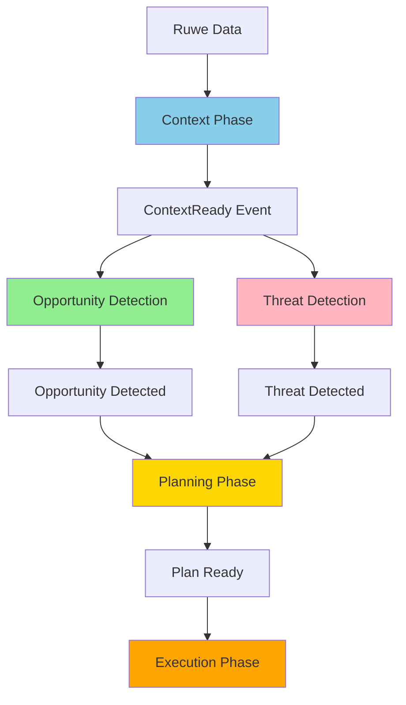
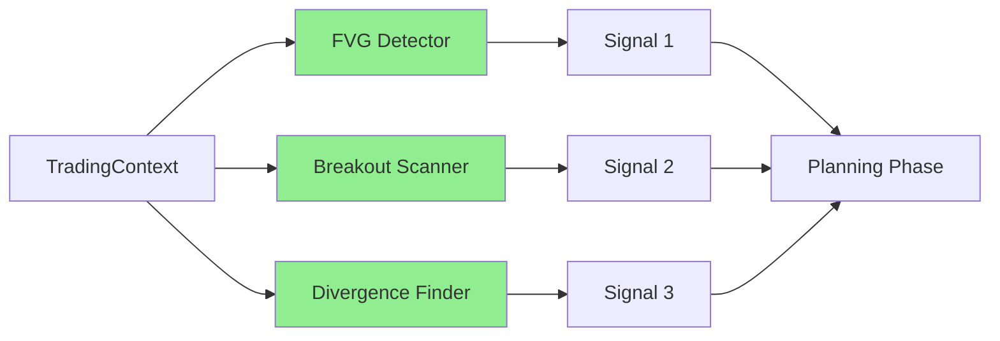
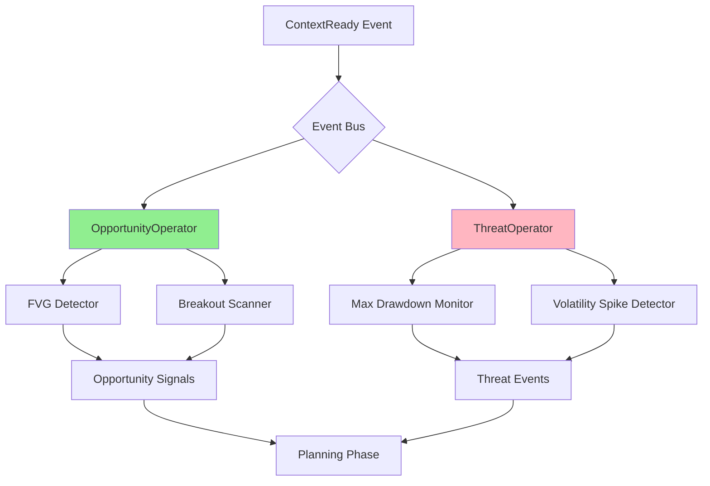
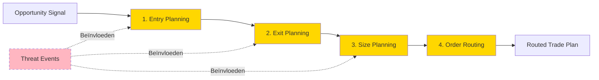
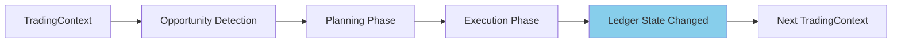

# **5. Het Worker Ecosysteem: Configureerbare Workflow Orkestratie**

Status: Definitief
Dit document beschrijft het flexibele, configureerbare workflow orkestratiesysteem van S1mpleTrader.

## **Inhoudsopgave**

1. [Executive Summary](#executive-summary)
2. [Introductie: De Paradigma Shift](#51-introductie-de-paradigma-shift)
3. [Fase 1: Context Phase - "De Cartograaf"](#52-fase-1-context-phase---de-cartograaf)
4. [Fase 2A: Opportunity Detection - "De Verkenner"](#53-fase-2a-opportunity-detection---de-verkenner)
5. [Fase 2B: Threat Detection - "De Waakhond" (Parallel)](#54-fase-2b-threat-detection---de-waakhond-parallel)
6. [Fase 3: Planning Phase - "De Strateeg"](#55-fase-3-planning-phase---de-strateeg)
7. [Fase 4: Execution Phase - "De Uitvoerder"](#56-fase-4-execution-phase---de-uitvoerder)
8. [Event-Driven Workflow: Drie Abstractieniveaus](#57-event-driven-workflow-drie-abstractieniveaus)
9. [Rolverdeling: Operators & Event Routing](#58-rolverdeling-operators--event-routing)
10. [Feedback Loops & Causale Traceerbaarheid](#59-feedback-loops--causale-traceerbaarheid)
11. [Samenvatting: De Paradigma Shift](#510-samenvatting-de-paradigma-shift)

---

## **Executive Summary**

Dit document beschrijft het flexibele, configureerbare workflow orkestratiesysteem van S1mpleTrader. De vier kernprincipes zijn:

### **1. Van Lineaire Pijplijn naar Parallel Event-Driven Ecosysteem**

Het systeem biedt een 5-fase parallel systeem waar Opportunities en Threats simultaan worden gedetecteerd, waardoor snellere responstijden en betere risicobeheersing mogelijk zijn.

### **2. Configureerbare Orkestratie (Niet Hard-Coded)**

Operators zijn **niet hard-coded parallel of sequentieel**. Hun gedrag wordt bepaald door [`operators.yaml`](config/operators.yaml) configuratie via:
- **ExecutionStrategy**: SEQUENTIAL, PARALLEL, of EVENT_DRIVEN
- **AggregationStrategy**: CHAIN_THROUGH of COLLECT_ALL

Dit maakt het systeem aanpasbaar zonder code-wijzigingen.

### **3. Drie Abstractieniveaus voor Event Workflows**

- **Niveau 1 (Impliciet)**: Definieer alleen workers, systeem genereert events automatisch
- **Niveau 2 (Predefined)**: Gebruik standaard triggers zoals `on_context_ready`, `on_ledger_update`
- **Niveau 3 (Custom)**: Volledige controle met custom events en routing

Deze progressieve complexiteit maakt het systeem toegankelijk voor beginners én krachtig voor experts.

### **4. Hybride Orkestratie: Operators + Events**

Het systeem werkt op twee complementaire niveaus:
- **Primair**: Operators roepen workers aan volgens ExecutionStrategy (configureerbaar gedrag)
- **Secundair**: Events voor cross-operator communicatie (opt-in voor complexe workflows)

**Kernprincipe**: Events zijn niet verplicht - ze zijn een krachtige aanvulling voor geavanceerde use cases, terwijl de basis orkestratie via configureerbare operators verloopt.

---

## **5.1. Introductie: De Paradigma Shift**

### **5.1.1. Van Lineaire Pijplijn naar Event-Driven Ecosysteem**

**Huidige Architectuur:** Een flexibel, event-driven ecosysteem met configureerbare orkestratie en intelligente parallelle verwerking:



### **5.1.2. De Vier Kerncriteria**

Dit document beschrijft de volledige workflow van data tot handelsactie, gebaseerd op vier fundamentele principes:

1.  **Configureerbare Orkestratie** - Operators zijn niet hard-coded parallel of sequentieel, maar configureerbaar via [`operators.yaml`](config/operators.yaml). Workers worden aangeroepen volgens hun ExecutionStrategy (SEQUENTIAL, PARALLEL, of EVENT_DRIVEN) en resultaten worden geaggregeerd volgens de AggregationStrategy (CHAIN_THROUGH of COLLECT_ALL). Zie [`2_ARCHITECTURE.md`](2_ARCHITECTURE.md#27-de-data-gedreven-operator) voor details.

2.  **Hybride Orkestratie Model** - Workers communiceren **optioneel** via events (voor complexe workflows), maar de primaire orkestratie gebeurt via Operators die workers aanroepen volgens hun ExecutionStrategy configuratie. Events zijn opt-in, niet verplicht. De meeste workflows werken zonder expliciete event definitie.

3.  **Opt-in Complexiteit** - Drie abstractieniveaus (Impliciet → Predefined → Custom) maken het systeem toegankelijk voor beginners én krachtig voor experts.

4.  **Causale Traceerbaarheid** - Elke actie is traceerbaar naar zijn oorzaak via een rijk framework van causale IDs (OpportunityID, ThreatID, TradeID, ScheduledID).

### **5.1.3. De 5 Worker Categorieën**

De workflow is opgedeeld in vijf conceptueel verschillende fases, elk beheerd door een gespecialiseerde Operator:

| Fase | Worker Type | Rol | Output |
|------|-------------|-----|--------|
| **1. Context** | [`ContextWorker`](backend/core/base_worker.py:BaseWorker) | "De Cartograaf" - verrijkt data | Verrijkte [`TradingContext`](backend/dtos/state/trading_context.py:TradingContext) |
| **2. Opportunity** | [`OpportunityWorker`](backend/core/base_worker.py:BaseWorker) | "De Verkenner" - detecteert kansen | [`Signal`](backend/dtos/pipeline/signal.py:Signal) DTOs |
| **3. Threat** | [`ThreatWorker`](backend/core/base_worker.py:BaseWorker) | "De Waakhond" - detecteert risico's | [`CriticalEvent`](backend/dtos/execution/critical_event.py:CriticalEvent) DTOs |
| **4. Planning** | [`PlanningWorker`](backend/core/base_worker.py:BaseWorker) | "De Strateeg" - maakt plannen | [`RoutedTradePlan`](backend/dtos/pipeline/routed_trade_plan.py:RoutedTradePlan) DTO |
| **5. Execution** | [`ExecutionWorker`](backend/core/base_worker.py:BaseWorker) | "De Uitvoerder" - voert uit | Directe acties |

**Architectuur Principe:** "Opportunity" en "Planning" zijn gescheiden verantwoordelijkheden voor optimale conceptuele zuiverheid.

---

## **5.2. Fase 1: Context Phase - "De Cartograaf"**

### **5.2.1. Verantwoordelijkheid**

De Context Phase verrijkt ruwe marktdata met objectieve, beschrijvende informatie. Het creëert een "kaart" van de markt zonder te filteren of te oordelen.

**Kernprincipe:** Objectief en beschrijvend - "Dit is wat er is"

### **5.2.2. Worker Types**

[`ContextWorker`](backend/core/base_worker.py:BaseWorker) plugins zijn georganiseerd in 7 sub-types volgens [`ContextType`](backend/core/enums.py:ContextType):

1.  **Regime Classification** - Markt regime & conditie classificatie
2.  **Structural Analysis** - Technische structuren (swings, zones)
3.  **Indicator Calculation** - Technische indicatoren
4.  **Microstructure Analysis** - Orderbook & liquiditeit
5.  **Temporal Context** - Sessies, tijd patronen
6.  **Sentiment Enrichment** - Nieuws, social media
7.  **Fundamental Enrichment** - On-chain, economische data

### **5.2.3. Praktijkvoorbeeld**

**Use Case:** ICT/SMC Strategie

```yaml
# strategy_blueprint.yaml
workforce:
  context_workers:
    # Structurele analyse
    - plugin: "market_structure_detector"
      subtype: "structural_analysis"
      params:
        detect_bos: true
        detect_choch: true
    
    # Indicatoren
    - plugin: "ema_detector"
      subtype: "indicator_calculation"
      params:
        periods: [20, 50, 200]
    
    # Regime classificatie
    - plugin: "adx_regime_classifier"
      subtype: "regime_classification"
      params:
        adx_threshold: 25
```

**Input:** Ruwe OHLCV [`DataFrame`](backend/dtos/state/trading_context.py:TradingContext.ohlcv_df)

**Proces:** Elke worker voegt kolommen toe aan de DataFrame:
-   `market_structure_detector` → `trend_direction`, `is_bos`, `is_choch`
-   `ema_detector` → `ema_20`, `ema_50`, `ema_200`
-   `adx_regime_classifier` → `regime` ('trending' of 'ranging')

**Output:** Verrijkte [`enriched_df`](backend/dtos/state/trading_context.py:TradingContext.enriched_df) in het [`TradingContext`](backend/dtos/state/trading_context.py:TradingContext) object

**Event:** Publiceert `ContextReady` event wanneer voltooid

---

## **5.3. Fase 2A: Opportunity Detection - "De Verkenner"**

### **5.3.1. Verantwoordelijkheid**

De Opportunity Detection Phase herkent handelskansen op basis van patronen, theorieën en strategieën. Het genereert "handelsideeën" zonder concrete plannen te maken.

**Kernprincipe:** Probabilistisch en creatief - "Ik zie een mogelijkheid"

### **5.3.2. Worker Types**

[`OpportunityWorker`](backend/core/base_worker.py:BaseWorker) plugins zijn georganiseerd in 7 sub-types volgens [`OpportunityType`](backend/core/enums.py:OpportunityType):

1.  **Technical Pattern** - Patroonherkenning (FVG, breakouts)
2.  **Momentum Signal** - Trend following signalen
3.  **Mean Reversion** - Oversold/overbought detectie
4.  **Statistical Arbitrage** - Arbitrage opportuniteiten
5.  **Event Driven** - Nieuws-gebaseerde signalen
6.  **Sentiment Signal** - Sentiment extremen
7.  **ML Prediction** - Machine learning voorspellingen

### **5.3.3. Parallelle Verwerking**

Opportunity workers worden standaard **parallel** uitgevoerd volgens de ExecutionStrategy configuratie in [`operators.yaml`](config/operators.yaml). Alle opportunity workers ontvangen dezelfde [`TradingContext`](backend/dtos/state/trading_context.py:TradingContext) en genereren hun signalen onafhankelijk.



### **5.3.4. Praktijkvoorbeeld**

**Use Case:** ICT FVG Entry Detection

```yaml
opportunity_workers:
  - plugin: "fvg_entry_detector"
    subtype: "technical_pattern"
    params:
      min_gap_size: 5
      require_structure_break: true
  
  - plugin: "volume_spike_refiner"
    subtype: "technical_pattern"
    params:
      min_volume_percentile: 80
```

**Input:** Verrijkte [`TradingContext`](backend/dtos/state/trading_context.py:TradingContext) (met `is_bos`, `trend_direction`, etc.)

**Proces:**
1.  `fvg_entry_detector` scant voor Fair Value Gaps na een structure break
2.  `volume_spike_refiner` valideert volume op het signaal moment

**Output:** [`Signal`](backend/dtos/pipeline/signal.py:Signal) DTOs met unieke `opportunity_id`:

```python
Signal(
    opportunity_id=uuid4(),  # Causale ID
    timestamp="2025-10-14T10:00:00Z",
    asset="BTC/EUR",
    direction="long",
    signal_type="fvg_entry",
    metadata={"gap_size": 8.5, "volume_percentile": 85}
)
```

**Event:** Publiceert `SignalGenerated` events per signaal

---

## **5.4. Fase 2B: Threat Detection - "De Waakhond" (Parallel)**

### **5.4.1. Verantwoordelijkheid**

De Threat Detection Phase draait **parallel** aan Opportunity Detection en monitort risico's, bedreigingen en afwijkingen. Het publiceert waarschuwende events maar handelt **nooit zelf**.

**Kernprincipe:** Defensief en informatief - "Let op, hier is een risico"

### **5.4.2. Worker Types**

[`ThreatWorker`](backend/core/base_worker.py:BaseWorker) plugins zijn georganiseerd in 5 sub-types volgens [`ThreatType`](backend/core/enums.py:ThreatType):

1.  **Portfolio Risk** - Drawdown, exposure, correlatie
2.  **Market Risk** - Volatiliteit, liquiditeit
3.  **System Health** - Connectie, data kwaliteit
4.  **Strategy Performance** - Underperformance, drift
5.  **External Event** - Breaking news, regulatie

### **5.4.3. Parallelle Verwerking met Opportunities**



### **5.4.4. Praktijkvoorbeeld**

**Use Case:** Risk Management voor Trading Strategie

```yaml
threat_workers:
  - plugin: "max_drawdown_monitor"
    subtype: "portfolio_risk"
    triggers:
      - "on_ledger_update"  # Predefined trigger
    params:
      max_daily_drawdown: 2.0
      max_total_drawdown: 10.0
  
  - plugin: "volatility_spike_detector"
    subtype: "market_risk"
    triggers:
      - "on_context_ready"
    params:
      volatility_threshold_percentile: 95
```

**Input:**
-   [`StrategyLedger`](backend/core/strategy_ledger.py) (voor portfolio risk)
-   Verrijkte [`TradingContext`](backend/dtos/state/trading_context.py:TradingContext) (voor market risk)

**Output:** [`CriticalEvent`](backend/dtos/execution/critical_event.py:CriticalEvent) DTOs met unieke `threat_id`:

```python
CriticalEvent(
    threat_id=uuid4(),  # Causale ID
    timestamp="2025-10-14T10:00:00Z",
    event_type="MAX_DRAWDOWN_BREACHED",
    severity="HIGH",
    metadata={
        "current_drawdown": 2.5,
        "max_allowed": 2.0,
        "recommendation": "HALT_NEW_TRADES"
    }
)
```

**Event:** Publiceert `ThreatDetected` events

---

## **5.5. Fase 3: Planning Phase - "De Strateeg"**

### **5.5.1. Verantwoordelijkheid**

De Planning Phase transformeert opportunities naar concrete, uitvoerbare plannen. Het luistert naar **beide** Opportunity signals én Threat events om intelligente beslissingen te maken.

**Kernprincipe:** Deterministisch en tactisch - "Gegeven deze kans en deze risico's, dit is het plan"

### **5.5.2. De Vier Planning Sub-Fases**

[`PlanningWorker`](backend/core/base_worker.py:BaseWorker) plugins zijn georganiseerd in 4 sequentiële sub-fases volgens [`PlanningPhase`](backend/core/enums.py:PlanningPhase):



### **5.5.3. Planning Sub-Fases Gedetailleerd**

#### **5.5.3.1. Entry Planning**

**Doel:** Bepaal de precieze entry prijs en methode.

**Voorbeelden:**
-   `limit_entry_at_fvg` - Limit order op FVG midpoint
-   `market_entry_immediate` - Direct market order
-   `twap_entry` - Verdeeld over tijd

**Input:** [`Signal`](backend/dtos/pipeline/signal.py:Signal)
**Output:** [`EntrySignal`](backend/dtos/pipeline/entry_signal.py:EntrySignal) (Signal + entry_price)

#### **5.5.3.2. Exit Planning**

**Doel:** Bepaal stop-loss en take-profit niveaus.

**Voorbeelden:**
-   `liquidity_target_exit` - Stops bij liquidity zones
-   `atr_based_stops` - Stops op basis van ATR
-   `fixed_rr_exit` - Fixed Risk:Reward ratio

**Input:** [`EntrySignal`](backend/dtos/pipeline/entry_signal.py:EntrySignal)
**Output:** [`RiskDefinedSignal`](backend/dtos/pipeline/risk_defined_signal.py:RiskDefinedSignal) (EntrySignal + sl_price + tp_price)

#### **5.5.3.3. Size Planning**

**Doel:** Bepaal positiegrootte op basis van risico en kapitaal.

**Threats Invloed:** Als `MAX_DRAWDOWN_BREACHED` gedetecteerd → reduce size of skip

**Voorbeelden:**
-   `fixed_risk_sizer` - Fixed % risico per trade
-   `kelly_criterion_sizer` - Kelly criterion sizing
-   `adaptive_sizer` - Past aan op basis van threat events

**Input:** [`RiskDefinedSignal`](backend/dtos/pipeline/risk_defined_signal.py:RiskDefinedSignal) + Threat events
**Output:** [`TradePlan`](backend/dtos/pipeline/trade_plan.py:TradePlan) (RiskDefinedSignal + position_size)

#### **5.5.3.4. Order Routing**

**Doel:** Vertaal het strategische plan naar tactische executie-instructies.

**Voorbeelden:**
-   `limit_order_router` - Limit orders
-   `iceberg_router` - Verberg grote orders
-   `smart_router` - Intelligent order routing

**Input:** [`TradePlan`](backend/dtos/pipeline/trade_plan.py:TradePlan)
**Output:** [`RoutedTradePlan`](backend/dtos/pipeline/routed_trade_plan.py:RoutedTradePlan) (TradePlan + order_type + routing params)

### **5.5.4. Praktijkvoorbeeld**

```yaml
planning_workers:
  entry_planning:
    - plugin: "limit_entry_at_fvg"
      params:
        entry_at_midpoint: true
  
  exit_planning:
    - plugin: "liquidity_target_exit"
      params:
        stop_below_order_block: true
        target_opposite_liquidity: true
  
  size_planning:
    - plugin: "adaptive_risk_sizer"
      params:
        base_risk_percent: 1.0
        reduce_on_high_threat: true  # Reageert op Threat events!
  
  order_routing:
    - plugin: "limit_order_router"
```

**DTO Evolutie:**

```
Signal (opportunity_id)
  ↓
EntrySignal (opportunity_id, entry_price: 50000.00)
  ↓
RiskDefinedSignal (opportunity_id, entry: 50000, sl: 49500, tp: 51000)
  ↓
TradePlan (opportunity_id, ..., position_size: 0.02 BTC)
  ↓
RoutedTradePlan (opportunity_id, ..., order_type: "limit", tif: "GTC")
```

**Causale Traceerbaarheid:** Alle DTOs behouden de originele `opportunity_id` voor volledige traceerbaarheid.

---

## **5.6. Fase 4: Execution Phase - "De Uitvoerder"**

### **5.6.1. Verantwoordelijkheid**

De Execution Phase voert plannen uit en beheert actieve posities dynamisch. Het reageert op triggers (tijd, events, markt).

**Kernprincipe:** Actief en deterministisch - "Ik voer uit en beheer"

### **5.6.2. Worker Types**

[`ExecutionWorker`](backend/core/base_worker.py:BaseWorker) plugins zijn georganiseerd in 4 sub-types volgens [`ExecutionType`](backend/core/enums.py:ExecutionType):

1.  **Trade Initiation** - Het initiëren van nieuwe trades
2.  **Position Management** - Dynamisch beheer van lopende posities
3.  **Risk Safety** - Noodmaatregelen en circuit breakers
4.  **Operational** - Geplande, operationele taken (DCA, rebalancing)

### **5.6.3. Praktijkvoorbeeld**

```yaml
execution_workers:
  trade_initiation:
    - plugin: "default_plan_executor"
  
  position_management:
    - plugin: "trailing_stop_manager"
      params:
        trail_after_first_target: true
        trail_by_structure: true
    
    - plugin: "partial_profit_taker"
      params:
        take_50_percent_at_first_target: true
        move_stop_to_breakeven: true
  
  risk_safety:
    - plugin: "emergency_exit_agent"
      triggers:
        - "on_threat_detected"  # Reageert op Threat events!
      params:
        exit_on_severity: ["CRITICAL", "HIGH"]
  
  operational:
    - plugin: "weekly_dca_executor"
      triggers:
        - "on_schedule:weekly_dca"
```

**Threat Integration:** De `emergency_exit_agent` luistert naar `ThreatDetected` events en kan posities forceren te sluiten bij kritieke risico's.

---

## **5.7. Event-Driven Workflow: Twee Architecturale Pijlers**

De V3-architectuur benadert event-gedreven workflows niet langer als een "abstractieniveau", maar als een fundamentele architecturale keuze die wordt vastgelegd in de **ROL** van een worker. De configuratie van deze ROL wordt vervolgens gedefinieerd door de **CAPABILITIES** in het manifest.

### **Pijler 1: De ROL Bepaalt de Workflow (Code)**

Een ontwikkelaar kiest expliciet een van de twee basisklassen, wat de fundamentele workflow bepaalt:

-   **`StandardWorker` (De Pijplijn-Deelnemer)**
    -   **Workflow**: Deze worker is onderdeel van een door een `BaseOperator` georkestreerde, voorspelbare pijplijn (sequentieel of parallel).
    -   **Contract**: Moet een `process()`-methode implementeren.
    -   **Gebruik**: Voor 90% van de gevallen waar een duidelijke, lineaire dataflow gewenst is (Context → Opportunity → Planning).

-   **`EventDrivenWorker` (De Autonome Agent)**
    -   **Workflow**: Deze worker opereert autonoom en reageert op events van de EventBus. Hij is niet onderdeel van de `run()`-methode van een operator.
    -   **Contract**: Heeft geen `process()`-methode. Zijn functionaliteit zit in de methodes die worden aangeroepen n.a.v. events.
    -   **Gebruik**: Voor complexe, asynchrone strategieën (zoals de Smart DCA), monitoring-taken of workers die op meerdere, onvoorspelbare triggers moeten reageren.

### **Pijler 2: Het Manifest Bepaalt de Details (Configuratie)**

Zodra de ROL is gekozen, definieert het `manifest.yaml` de specifieke `capabilities` die de worker nodig heeft om zijn rol te vervullen.

**Voorbeeld: Smart DCA (Event-Driven)**
De `dca_opportunity_scorer` is een `EventDrivenWorker`. Zijn manifest legt zijn volledige event-contract vast:

```yaml
# manifest.yaml van dca_opportunity_scorer
identification:
  name: "dca_opportunity_scorer"
  type: "opportunity_worker"
  # ...

capabilities:
  events:
    enabled: true # Dit is de cruciale vlag
    publishes:
      - as_event: "dca_opportunity_scored"
        payload_dto: "Signal"
    wirings:
      # Deze worker wordt actief wanneer de scheduler 'WEEKLY_DCA_TICK' publiceert,
      # en roept dan zijn eigen 'on_weekly_tick' methode aan.
      - listens_to: "WEEKLY_DCA_TICK"
        invokes:
          method: "on_weekly_tick"
```

In de `strategy_blueprint.yaml` hoeft de quant de worker alleen maar toe te wijzen. De complexiteit is volledig ingekapseld in de plugin zelf.

```yaml
# strategy_blueprint.yaml
workforce:
  opportunity_workers:
    - plugin: "dca_opportunity_scorer"
```

Deze aanpak elimineert de noodzaak voor "abstractieniveaus" en maakt de intentie van de ontwikkelaar expliciet en afdwingbaar, terwijl de configuratie voor de quant eenvoudig blijft.

### **Event Chain Validatie**

Het systeem valideert de volledige event chain tijdens de bootstrap-fase, onafhankelijk van de ROL van de workers. Het controleert de `publishes` en `wirings` in alle manifesten om te garanderen dat:

-   Elke `listens_to` een overeenkomstige `publishes` heeft.
-   Er geen circulaire afhankelijkheden zijn.
-   Payload DTO-types overeenkomen.

---

## **5.8. Rolverdeling: De Assembly Laag & De "Domme" Operator**

De orkestratie in V3 is een zuiver voorbeeld van het Single Responsibility Principle. De verantwoordelijkheid is strikt verdeeld tussen de **Assembly Laag** (de "slimme" voorbereiders) en de **`BaseOperator`** (de "domme" uitvoerder).

### **5.8.1. De Assembly Laag: De "Slimme" Voorbereiders**

Tijdens de bootstrap-fase orkestreren de componenten in de assembly-laag (`WorkerBuilder`, `OperatorFactory`, `EventAdapterFactory`) het volledige proces:

1.  **Classificatie (`WorkerBuilder`)**: De `WorkerBuilder` inspecteert elke worker. Het leest de basisklasse (`StandardWorker` of `EventDrivenWorker`) en het manifest.
2.  **Preparatie (`WorkerBuilder`)**:
    -   Voor `StandardWorkers`: Deze worden verzameld in de `standard_workers`-lijst.
    -   Voor `EventDrivenWorkers`: De `WorkerBuilder` roept de `EventAdapterFactory` aan om ze direct aan de EventBus te koppelen. Deze workers worden in de `event_driven_workers`-lijst geplaatst.
3.  **Levering (`WorkerBuilder`)**: De `WorkerBuilder` retourneert een `Workforce` DTO met twee gescheiden, voorbereide lijsten: `standard_workers` en `event_driven_workers`.
4.  **Operator Creatie (`OperatorFactory`)**: De `OperatorFactory` creëert een `BaseOperator`-instantie. Het geeft **alleen** de `standard_workers`-lijst door aan de constructor van de operator.

### **5.8.2. De `BaseOperator`: De "Domme" Uitvoerder**

De `BaseOperator` is extreem eenvoudig en robuust. Zijn enige verantwoordelijkheid is het uitvoeren van de `run()`-methode op de lijst van `StandardWorkers` die hij heeft ontvangen.

-   Hij heeft **geen kennis** van het bestaan van `EventDrivenWorkers`.
-   Zijn `run()`-methode bevat **geen logica** voor een `EVENT_DRIVEN` `execution_strategy`, omdat die workers hem nooit bereiken.
-   Hij focust puur op het toepassen van zijn geconfigureerde `execution_strategy` (`SEQUENTIAL` of `PARALLEL`) op zijn toegewezen `StandardWorkers`.

Deze architectuur, bekend als het **"Geprepareerde Workforce Model"**, zorgt voor een maximale scheiding van verantwoordelijkheden, wat leidt tot een eenvoudiger, robuuster en beter testbaar systeem. De "intelligentie" zit in de voorbereiding (de assembly-laag), niet in de operationele uitvoering (de operator).

---

## **5.9. Feedback Loops & Causale Traceerbaarheid**

### **5.9.1. De Technische Feedback Loop (Real-time)**

Deze loop gebeurt ***binnen*** een Operation, via de EventBus:



**Mechanisme:**
1.  ExecutionEnvironment publiceert `LedgerStateChanged` event na elke trade
2.  Deze event wordt opgenomen in de volgende [`TradingContext`](backend/dtos/state/trading_context.py:TradingContext)
3.  Workers hebben altijd de meest actuele financiële staat beschikbaar

### **5.9.2. De Strategische Feedback Loop (Human-in-the-loop)**

Deze loop vindt plaats ***tussen*** Operations:

```
Operation 1 → Resultaten → Analyse → Blueprint Aanpassing → Operation 2
```

De quant analyseert [`StrategyJournal`](backend/core/strategy_journal.py) data en past de [`strategy_blueprint.yaml`](config/runs/strategy_blueprint.yaml) aan.

### **5.9.3. Causale Traceerbaarheid Framework**

**ID Types:**

| ID Type | Gegenereerd Door | Doel |
|---------|------------------|------|
| **OpportunityID** | [`OpportunityWorker`](backend/core/base_worker.py:BaseWorker) | "Waarom is deze trade geopend?" |
| **ThreatID** | [`ThreatWorker`](backend/core/base_worker.py:BaseWorker) | "Waarom is deze trade aangepast/gesloten?" |
| **TradeID** | [`ExecutionWorker`](backend/core/base_worker.py:BaseWorker) | Primaire sleutel in journal |
| **ScheduledID** | Scheduler | "Waarom is deze actie nu uitgevoerd?" |

**Voorbeeld Journal Entry:**

```json
{
  "timestamp": "2025-10-14T10:05:00Z",
  "event_type": "TRADE_OPENED",
  "trade_id": "uuid-789",
  "opportunity_id": "uuid-456",  // Causale link!
  "details": {
    "strategy": "ICT_FVG_Liquidity_Sweep",
    "opportunity_type": "fvg_entry",
    "entry_price": 50000.00,
    "position_size": 0.02
  }
}
```

**Voorbeeld Rejection Entry:**

```json
{
  "timestamp": "2025-10-14T10:00:05Z",
  "event_type": "OPPORTUNITY_REJECTED",
  "opportunity_id": "uuid-123",
  "rejection_reason": {
    "threat_id": "uuid-789",  // Causale link!
    "threat_type": "MAX_DRAWDOWN_BREACHED",
    "details": {
      "current_drawdown": 2.5,
      "max_allowed": 2.0
    }
  }
}
```

**Analyse Mogelijkheden:**
-   "Welke opportunities werden het vaakst afgekeurd en waarom?"
-   "Welke threat types hadden de meeste impact op performance?"
-   "Wat was de gemiddelde tijd tussen opportunity detection en execution?"

---

## **5.10. Samenvatting: De Paradigma Shift**

### **5.10.1. Architectuur Kenmerken**

| Aspect | Huidige Implementatie |
|--------|----------------------|
| **Structuur** | Event-driven 5-categorie ecosysteem |
| **Verwerking** | Configureerbaar (SEQUENTIAL/PARALLEL/EVENT_DRIVEN) |
| **Opportunity/Threat** | Parallel detectie met dualiteit |
| **Analysis/Planning** | Gescheiden verantwoordelijkheden |
| **Orkestratie** | Configureerbaar via operators.yaml |
| **Event Model** | Drie abstractieniveaus + twee orkestratie niveaus |
| **Traceability** | Rijk causaal ID framework |
| **Flexibiliteit** | Opt-in complexiteit |

### **5.10.2. Kernvoordelen**

1.  **Conceptuele Zuiverheid** - Elke worker categorie heeft één duidelijke verantwoordelijkheid
2.  **Configureerbare Kracht** - Gedrag aanpasbaar via YAML zonder code-wijzigingen
3.  **Parallelle Efficiëntie** - Opportunities en Threats worden simultaan gedetecteerd
4.  **Intelligente Compositie** - Complexiteit komt van configuratie, niet van plugin code
5.  **Causale Transparantie** - Elke actie is traceerbaar naar zijn oorzaak
6.  **Progressieve Complexiteit** - Van simpel naar complex zonder refactoring
7.  **Methodologie Agnostisch** - Ondersteunt ICT, Wyckoff, ML, DCA, en meer

### **5.10.3. Configuratie Format**

Het systeem ondersteunt verschillende configuratie formaten voor maximale flexibiliteit:

```yaml
# Huidig aanbevolen format
workforce:
  opportunity_workers:
    - plugin: "fvg_detector"
      subtype: "technical_pattern"
```

---

## **5.11. Volgende Stappen**

**Voor Strategie Ontwikkelaars:**
1.  Begin met **Niveau 1** (Impliciete Pijplijnen) voor eenvoudige strategieën
2.  Upgrade naar **Niveau 2** (Predefined Triggers) voor threat monitoring
3.  Gebruik **Niveau 3** (Custom Events) voor complexe workflows zoals Smart DCA

**Voor Plugin Ontwikkelaars:**
1.  Lees [`WORKER_TAXONOMIE_V3.md`](docs/development/251014%20Bijwerken%20documentatie/WORKER_TAXONOMIE_V3.md) voor volledige taxonomie
2.  Gebruik de juiste base class ([`BaseWorker`](backend/core/base_worker.py:BaseWorker), [`BaseEventAwareWorker`](backend/core/base_worker.py:BaseEventAwareWorker), etc.)
3.  Definieer het juiste `type` en `subtype` in je manifest

**Voor Architecten:**
1.  Lees [`2_ARCHITECTURE.md`](docs/system/2_ARCHITECTURE.md) voor architectonische context
2.  Review event chain validatie logica in [`ComponentBuilder`](backend/assembly/component_builder.py)
3.  Begrijp de twee niveaus van orkestratie (Operator Config vs Event Mapping)

---

**Einde Document**

*"Van lineaire pijplijn naar configureerbaar ecosysteem - waar operators en events harmonieus samenwerken in een hybride orkestratie model."*