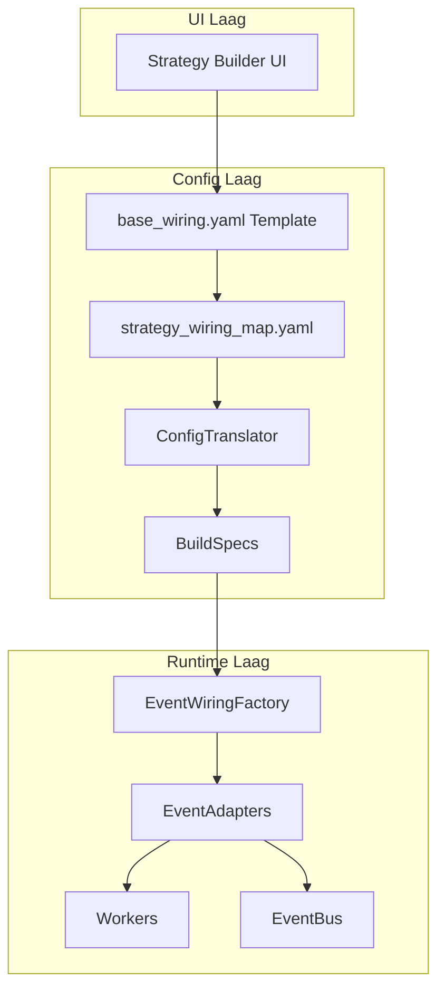
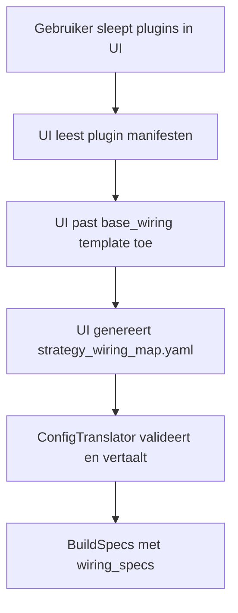
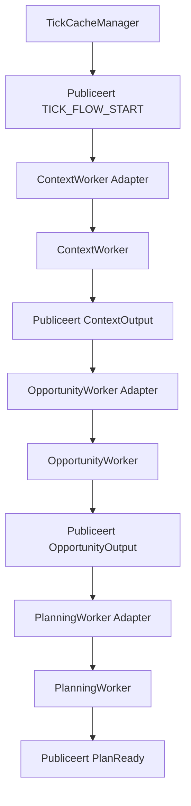

# 01_Bus_communicatie_structuur.md

# **S1mpleTrader: De Communicatie Architectuur**

Dit document beschrijft de communicatie-architectuur van S1mpleTrader, gebaseerd op een radicale scheiding tussen businesslogica en communicatielogica via een platgeslagen, expliciet bedraad netwerk van workers.

## **Inhoudsopgave**

1. [Executive Summary](#executive-summary)
2. [Visie & Filosofie: Scheiding van Logica](#visie--filosofie-scheiding-van-logica)
3. [Platgeslagen Orkestratie Model](#platgeslagen-orkestratie-model)
4. [EventAdapter Architectuur](#eventadapter-architectuur)
5. [Event Chain Validatie](#event-chain-validatie)
6. [Bootstrap Levenscyclus](#bootstrap-levenscyclus)
7. [Event Map: De Grondwet](#event-map-de-grondwet)
8. [Event-Driven Architectuur: Drie Niveaus](#event-driven-architectuur-drie-niveaus)
9. [Worker Orkestratie via Bedrading](#worker-orkestratie-via-bedrading)

---

## **Executive Summary**

Dit document beschrijft de communicatie-architectuur van S1mpleTrader, die is gebaseerd op een radicale scheiding tussen businesslogica en communicatielogica. De kern van het ontwerp is het platgeslagen, expliciet bedrade netwerk van workers, waarin elke component een eigen EventAdapter heeft die volledig wordt geconfigureerd via BuildSpecs.

### **Kernkenmerken**

**1. Platgeslagen Orkestratie**
- Geen Operator-laag meer; directe worker-naar-worker communicatie
- Expliciete bedrading via UI-gegenereerde strategy_wiring_map
- Configuratie-gedreven flow control

**2. EventAdapter per Component**
- Generieke, configureerbare EventAdapters voor alle componenten
- Volledig gestuurd door BuildSpecs uit ConfigTranslator
- Bus-agnostische workers via adapter interface

**3. UI-Gedreven Configuratie**
- Strategy Builder UI genereert complete strategy_wiring_map
- Base wiring templates voor standaard flows
- Visuele drag-and-drop configuratie

**4. Event Chain Validatie**
- Automatische validatie van event integriteit tijdens bootstrap
- Detectie van orphaned events, circular dependencies
- Fail-fast validatie voorkomt runtime problemen

**5. Progressieve Complexiteit**
- Drie niveaus van event-driven workflows
- Van impliciete pijplijnen tot custom event chains

### **Design Principes**

✅ **Scheiding van Verantwoordelijkheden** - Businesslogica weet niets van communicatie
✅ **Configuratie boven Code** - Event-routing en adapter-gedrag in YAML
✅ **Fail Fast Validatie** - Voorkom runtime fouten door validatie tijdens bootstrap
✅ **Opt-in Complexiteit** - Begin simpel en voeg event-driven complexiteit alleen toe waar nodig

---

## **Visie & Filosofie: Scheiding van Logica**

### **Inleiding & Doel**

Dit document beschrijft de communicatie-architectuur van S1mpleTrader. De kern van dit ontwerp is de radicale scheiding tussen businesslogica en communicatielogica in een platgeslagen netwerk van workers.

Het doel is een systeem te creëren waarin de componenten die de daadwerkelijke strategie- en businesslogica bevatten volledig puur, agnostisch en onwetend zijn van het communicatiemechanisme.

### **De Filosofie: Bus-Agnostische Componenten**

In deze architectuur is een worker een pure Python-klasse. Zijn taak is het uitvoeren van een specifieke business-taak: hij accepteert een DispositionEnvelope als input en retourneert een DispositionEnvelope als output. Hij weet niets van "subscriben" of "publishen".

De volledige verantwoordelijkheid voor de communicatie met de EventBus wordt gedelegeerd aan een generieke tussenlaag: het EventAdapter Patroon.

### **Kernprincipe: Event-Driven is Opt-in**

Een fundamenteel principe is dat event-driven communicatie optioneel is. Het systeem ondersteunt drie abstractieniveaus:

1. **Niveau 1: Impliciete Pijplijnen (95% van gebruik)**
   De quant definieert workers, het systeem genereert automatisch de event chain. Geen event management nodig.

2. **Niveau 2: Predefined Triggers (Opt-in)**
   Gebruik voorgedefinieerde trigger namen voor common use cases zonder custom events.

3. **Niveau 3: Custom Event Chains (Expert Mode)**
   Volledige controle met custom events en complexe workflows.

Dit "progressive complexity" model zorgt ervoor dat beginners direct kunnen starten, terwijl experts alle kracht hebben die ze nodig hebben.

---

## **Platgeslagen Orkestratie Model**

### **Het Concept**

Het systeem gebruikt een platgeslagen, expliciet bedraad netwerk waarin elke worker en singleton component een eigen EventAdapter heeft. Er is geen Operator-laag meer; de orkestratie wordt volledig bepaald door de wiring_specs in de BuildSpecs.

### **De Componenten**



### **Wiring Generatie Proces**



### **base_wiring.yaml Voorbeeld**

```yaml
base_wiring_id: "standard_trading_flow_v1"
wiring_rules:
  - wiring_id: "ctx_to_opp"
    source: 
      component_id: "ContextWorker"
      event_name: "ContextOutput"
    target: 
      component_id: "OpportunityWorker"
      handler_method: "process"
  - wiring_id: "opp_to_plan"
    source: 
      component_id: "OpportunityWorker"
      event_name: "OpportunityOutput"
    target: 
      component_id: "PlanningWorker"
      handler_method: "process"
```

### **Gegenereerde strategy_wiring_map.yaml**

```yaml
wiring_rules:
  - wiring_id: "ema_to_fvg"
    source: 
      component_id: "ema_detector_instance_1"
      event_name: "ema_fast_OUTPUT"
    target: 
      component_id: "fvg_detector_instance_1"
      handler_method: "process"
  - wiring_id: "fvg_to_planner"
    source: 
      component_id: "fvg_detector_instance_1"
      event_name: "fvg_detector_OUTPUT"
    target: 
      component_id: "limit_entry_planner_instance_1"
      handler_method: "process"
```

---

## **EventAdapter Architectuur**

### **Generieke, Configureerbare Adapters**

Het systeem gebruikt één enkele, generieke EventAdapter klasse. Het specifieke gedrag wordt bepaald door de configuratie die elke instantie meekrijgt tijdens de bootstrap-fase via de EventWiringFactory.

### **Kernverantwoordelijkheden**

1. **Event Ontvangst** - Luisteren naar specifieke events op de EventBus
2. **Component Aanroep** - De juiste methode op de component aanroepen
3. **Output Verwerking** - Interpreteren van DispositionEnvelope
4. **Publicatie Uitvoering** - Publiceren van systeem of custom events

### **Configuratie per Adapter**

```python
# Voorbeeld hoe EventAdapter wordt geconfigureerd
adapter = EventAdapter(
    component=worker_instance,
    subscription_list=["ContextReady", "ema_fast_OUTPUT"],
    handler_mapping={"ContextReady": "process"},
    publication_config={
        "system_events": {"ema_fast_OUTPUT": "ema_detector_OUTPUT"},
        "allowed_custom": ["custom_signal"]
    }
)
```

### **DispositionEnvelope**

Workers communiceren hun intentie via een gestandaardiseerde envelope:

```python
class DispositionEnvelope(BaseModel):
    disposition: Literal["CONTINUE", "PUBLISH", "STOP"]
    event_name: Optional[str] = None
    event_payload: Optional[BaseModel] = None
```

---

## **Event Chain Validatie**

### **Het Probleem: Event Chain Integriteit**

In een event-driven systeem kunnen complexe problemen ontstaan:
- Orphaned Events: Events zonder subscribers
- Dead-End Events: Subscribers zonder publishers
- Circular Dependencies: Event A triggert B, B triggert A
- Type Mismatches: Incompatible payload types

### **Event Chain Validator**

De EventChainValidator analyseert de volledige event chain tijdens bootstrap:

```python
class EventChainValidator:
    def validate(self, blueprint, wiring_map, operators_config) -> ValidationResult:
        # Build event graph
        # Check publisher/subscriber consistency
        # Detect circular dependencies
        # Detect dead-ends
        # Validate payload types
        return result
```

### **Validatie Output**

```
[INFO] Event Chain Validation Started
[INFO] Building event graph from blueprint and wiring_map...
[INFO] Found 12 events, 8 publishers, 15 subscribers
[✓] Check 1: All triggers have publishers
[✓] Check 2: No circular dependencies detected
[!] Check 3: Dead-end event detected: 'debug_signal_logged' has no subscribers
[✓] Check 4: Payload DTO types are consistent
[INFO] Event chain validation completed with 0 errors, 1 warning
```

---

## **Bootstrap Levenscyclus**

### **De Bootstrap Fase**

1. **ConfigTranslator** leest alle configuratie en genereert BuildSpecs
2. **EventWiringFactory** creëert EventAdapters op basis van wiring_specs
3. **Componenten** worden geïnstantieerd met hun adapters
4. **EventBus** wordt geconfigureerd met alle subscriptions
5. **Systeem** is klaar voor uitvoering

### **Runtime Flow**



---

## **Event Map: De Grondwet**

De event_map.yaml definieert alle toegestane events en hun contracten.

### **Event Map**

| Event Naam | Payload (DTO Contract) | Publisher | Subscriber |
|------------|----------------------|-----------|------------|
| **Operation Lifecycle** | | | |
| `OperationStarted` | OperationParameters | OperationService | EventAdapter |
| `BootstrapComplete` | BootstrapResult | ContextBuilder | ExecutionEnvironment |
| `ShutdownRequested` | ShutdownSignal | UI, EventAdapter | OperationService |
| `OperationFinished` | OperationSummary | OperationService | ResultLogger, UI |
| **Tick Lifecycle** | | | |
| `ContextReady` | TradingContext | ExecutionEnvironment | EventAdapter |
| `SignalsGenerated` | List[OpportunitySignal] | EventAdapter | EventAdapter |
| `ThreatsDetected` | List[CriticalEvent] | EventAdapter | EventAdapter |
| `PlansReady` | List[RoutedTradePlan] | EventAdapter | EventAdapter |
| `ExecutionApproved` | List[ExecutionDirective] | EventAdapter | ExecutionEnvironment |

---

## **Event-Driven Architectuur: Drie Niveaus**

### **Niveau 1: Impliciete Pijplijnen (95% van gebruik)**

**Voor wie:** Standaard quant die een lineaire strategie wil bouwen.

**Hoe het werkt:** De quant definieert workers, het systeem genereert automatisch de event chain.

**Voorbeeld:**

```yaml
workforce:
  context_workers:
    - plugin: "ema_detector"
    - plugin: "market_structure_detector"
  
  opportunity_workers:
    - plugin: "fvg_detector"
  
  planning_workers:
    entry_planning:
      - plugin: "limit_entry_planner"
    exit_planning:
      - plugin: "liquidity_target_exit"
    size_planning:
      - plugin: "fixed_risk_sizer"
    order_routing:
      - plugin: "default_router"
  
  execution_workers:
    trade_initiation:
      - plugin: "default_plan_executor"
```

**Automatisch gegenereerde event flow:**
```
ContextReady → SignalsGenerated → PlansReady → ExecutionApproved
```

### **Niveau 2: Predefined Triggers (Opt-in)**

**Voor wie:** Quant die specifieke workers op specifieke momenten wil activeren.

**Voorbeeld:**

```yaml
workforce:
  threat_workers:
    - plugin: "max_drawdown_monitor"
      triggers:
        - "on_ledger_update"
    
    - plugin: "news_event_monitor"
      triggers:
        - "on_context_ready"
```

**Predefined Triggers:**
- `on_context_ready`: Wanneer context klaar is
- `on_signal_generated`: Wanneer een signaal is gegenereerd
- `on_ledger_update`: Wanneer ledger verandert
- `on_position_opened`: Wanneer een positie wordt geopend
- `on_position_closed`: Wanneer een positie wordt gesloten
- `on_schedule`: Tijd-gebaseerd

### **Niveau 3: Custom Event Chains (Expert Mode)**

**Voor wie:** Geavanceerde quant die complexe, event-driven workflows wil bouwen.

**Voorbeeld: Smart DCA**

```yaml
workforce:
  opportunity_workers:
    - plugin: "dca_opportunity_scorer"
      triggers:
        - "on_schedule:weekly_dca"
      publishes:
        - event: "dca_opportunity_scored"
          payload_type: "Signal"
  
  threat_workers:
    - plugin: "dca_risk_assessor"
      triggers:
        - "on_schedule:weekly_dca"
      publishes:
        - event: "dca_risk_assessed"
          payload_type: "CriticalEvent"
  
  planning_workers:
    entry_planning:
      - plugin: "adaptive_dca_planner"
        triggers:
          - "dca_opportunity_scored"
          - "dca_risk_assessed"
        requires_all: true
        publishes:
          - event: "dca_plan_ready"
            payload_type: "TradePlan"
```

**Event Flow:**
```
Scheduler → WEEKLY_DCA_TICK
         ↓
    ┌────┴────┐
    ▼         ▼
Opportunity  Threat
  Scorer    Assessor
    │         │
    ▼         ▼
dca_opportunity_scored  dca_risk_assessed
         │         │
         └────┬────┘
              ▼
      Adaptive DCA Planner
              ▼
        dca_plan_ready
```

---

## **Worker Orkestratie via Bedrading**

### **Directe Worker Communicatie**

In het platgeslagen model communiceren workers direct met elkaar via expliciete bedrading, zonder tussenkomst van een Operator-laag.

### **Bedrading Types**

1. **Systeem Events** - Voor standaard flow tussen worker categorieën
2. **Custom Events** - Voor complexe, strategie-specifieke interacties
3. **Interne Events** - Voor flow control binnen een strategie

### **Voorbeeld Bedrading**

```yaml
wiring_rules:
  - wiring_id: "context_to_opportunity"
    source:
      component_id: "ema_detector_instance_1"
      event_name: "ema_detector_OUTPUT"
    target:
      component_id: "fvg_detector_instance_1"
      handler_method: "process"
  
  - wiring_id: "opportunity_to_planning"
    source:
      component_id: "fvg_detector_instance_1"
      event_name: "fvg_detector_OUTPUT"
    target:
      component_id: "limit_entry_planner_instance_1"
      handler_method: "process"
```

### **Flow Control**

Workers controleren de flow via DispositionEnvelope:

- **CONTINUE** - Ga door naar volgende worker
- **PUBLISH** - Publiceer event naar EventBus
- **STOP** - Stop deze flow tak

---

## **Conclusie**

S1mpleTrader introduceert een robuuste, flexibele en elegante communicatie-architectuur die:

✅ **Bus-agnostische workers** - Volledige isolatie via EventAdapter
✅ **Expliciete bedrading** - Directe worker-naar-worker communicatie
✅ **UI-gedreven configuratie** - Visuele strategie bouw
✅ **Automatische validatie** - Event chain integriteit
✅ **Progressieve complexiteit** - Van simpel naar expert zonder refactoring
✅ **Platgeslagen model** - Geen Operator-laag, directe orkestratie

Deze architectuur maakt het mogelijk om complexe, event-driven strategieën te bouwen terwijl het systeem begrijpelijk en onderhoudbaar blijft voor quants van alle niveaus.

---

**Referenties:**
- `2_ARCHITECTURE.md` - Complete architectuur overzicht
- `3_DE_CONFIGURATIE_TREIN.md` - Configuratie hiërarchie
- `4_DE_PLUGIN_ANATOMIE.md` - Plugin development guide

---

**Einde Document**