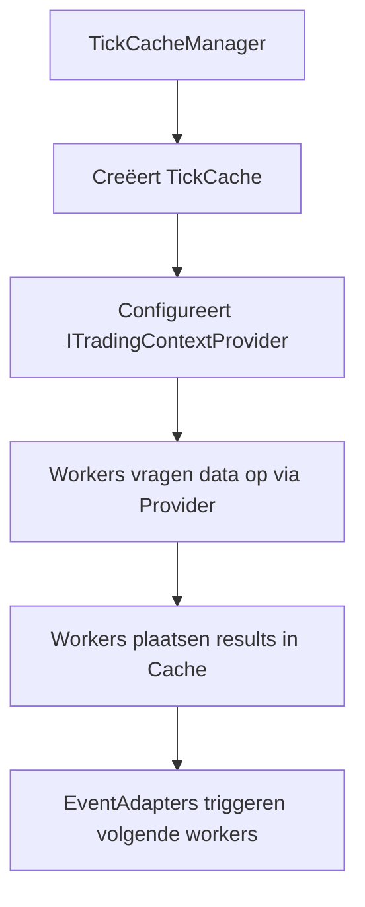
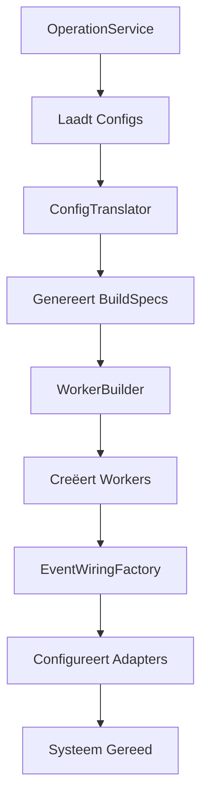
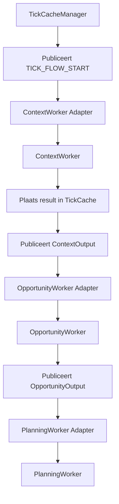

# 02_Architectuur_Componenten.md

# **S1mpleTrader: Architectuur & Componenten**

Dit document beschrijft de architectuur van S1mpleTrader, die een robuuste, flexibele en conceptueel zuivere systeemarchitectuur biedt gebaseerd op configuratie-gedreven design en event-driven communicatie.

## **Inhoudsopgave**

1. [Executive Summary](#executive-summary)
2. [Architectuur Principes](#architectuur-principes)
3. [Configuratie Lagen](#configuratie-lagen)
4. [Gelaagde Architectuur](#gelaagde-architectuur)
5. [Worker Ecosysteem: 5 Gespecialiseerde Rollen](#worker-ecosysteem-5-gespecialiseerde-rollen)
6. [Traceability Framework](#traceability-framework)
7. [Ledger/Journal Scheiding](#ledgerjournal-scheiding)
8. [Point-in-Time Data Architectuur](#point-in-time-data-architectuur)
9. [Persistence Suite](#persistence-suite)
10. [Plugin Capabilities Model](#plugin-capabilities-model)
11. [Componenten in Detail](#componenten-in-detail)
12. [Dataflow & Orkestratie](#dataflow--orkestratie)

---

## **Executive Summary**

De S1mpleTrader-architectuur is ontworpen om de conceptuele zuiverheid, flexibiliteit en analytische kracht van het platform te maximaliseren. Dit wordt bereikt door een doordachte systeemarchitectuur die de kern van het platform vormt.

### **Kernkenmerken**

**1. Configuratie-Gedreven Design**
- Drie gescheiden configuratielagen: PlatformConfig, OperationConfig, StrategyConfig
- ConfigTranslator genereert machine-instructies (BuildSpecs)
- Runtime componenten worden volledig geconfigureerd via BuildSpecs

**2. Event-Driven Communicatie**
- Platgeslagen netwerk van workers met directe bedrading
- EventAdapters per component voor bus-agnostische communicatie
- Expliciete event chains via UI-gegenereerde wiring

**3. 5-Worker Taxonomie**
- Vijf gespecialiseerde worker-categorieën voor zuivere scheiding van verantwoordelijkheden
- 27 sub-categorieën voor fijnmazige classificatie

**4. Point-in-Time Data Model**
- DTO-centric data-uitwisseling tussen workers
- TickCache voor synchrone data doorgifte
- ITradingContextProvider voor data toegang

**5. Volledige Traceability**
- Rijk Causaal ID Framework voor complete "waarom"-analyse
- Gescheiden operationele staat en analytische historie

**6. Unified Persistence Suite**
- Interface-gedreven architectuur voor alle data-opslag
- Atomic writes voor crash recovery
- Dependency injection voor testbaarheid

### **Design Principes**

✅ **Configuratie-gedreven** - Gedrag wordt gedefinieerd in YAML, niet in code
✅ **Event-driven** - Asynchrone communicatie via EventBus
✅ **Plugin-first** - Alle businesslogica in herbruikbare plugins
✅ **Contract-gedreven** - Pydantic validatie voor alle data-uitwisseling
✅ **Dependency injection** - Constructor injection voor alle dependencies
✅ **Testbaar** - Pure functies met mockable dependencies

---

## **Architectuur Principes**

De architectuur is gebaseerd op zes kernprincipes die samen een robuuste, flexibele en conceptueel zuivere systeemarchitectuur creëren:

| Principe | Beschrijving | Voordeel |
|----------|-------------|----------|
| **Configuratie-gedreven** | Alle operationele logica wordt gedefinieerd in YAML | Maximum flexibiliteit zonder code-wijzigingen |
| **Event-driven** | Asynchrone communicatie via EventBus | Losse koppeling tussen componenten |
| **Plugin-first** | Alle businesslogica in onafhankelijke plugins | Herbruikbaarheid en testbaarheid |
| **Contract-gedreven** | Strikte Pydantic validatie voor alle data | Type-veiligheid en voorspelbaarheid |
| **Dependency injection** | Constructor injection voor alle dependencies | Testbaarheid en flexibiliteit |
| **Point-in-time** | Data-uitwisseling gebaseerd op specifieke momenten | Consistente en traceerbare data flow |

---

## **Configuratie Lagen**

Het systeem gebruikt drie strikt gescheiden configuratielagen, elk met een eigen doel en levenscyclus.

### **PlatformConfig (De Fundering)**

Bevat alle globale, statische en run-onafhankelijke configuratie van het platform.

```yaml
# platform.yaml
language: "nl"
logging:
  profile: "analysis"
  levels: ["DEBUG", "INFO", "SETUP", "MATCH", "FILTER", "RESULT", "TRADE", "ERROR"]
archiving:
  format: "parquet"
plugins_root_path: "plugins"
data_root_path: "data"
```

### **OperationConfig (De Werkruimte)**

Definieert een specifieke "werkruimte" of "campagne" met alle technische middelen en strategieën.

```yaml
# operation.yaml
display_name: "Mijn BTC Operatie"
description: "Live trading en backtesting voor BTC strategieën"
strategy_links:
  - strategy_blueprint_id: "ict_smc_strategy"
    execution_environment_id: "live_kraken_main"
    is_active: true
  - strategy_blueprint_id: "smart_dca_btc"
    execution_environment_id: "backtest_2020_2024"
    is_active: true
```

### **StrategyConfig (De Blauwdruk)**

Vertegenwoordigt de volledige gebruikersintentie voor één specifieke strategie.

```yaml
# strategy_blueprint.yaml
display_name: "ICT/SMC Strategy"
version: "1.0.0"
description: "ICT methodology with FVG entries and liquidity targets"

workforce:
  context_workers:
    - plugin: "market_structure_detector"
      subtype: "structural_analysis"
      params:
        detect_bos: true
        detect_choch: true
    
  opportunity_workers:
    - plugin: "fvg_detector"
      subtype: "technical_pattern"
      params:
        min_gap_size: 5
        require_structure_break: true
```

### **ConfigTranslator**

De centrale component die alle configuratielagen vertaalt naar machine-instructies (BuildSpecs).

```python
class ConfigTranslator:
    def collect_build_specs(self, strategy_config, platform_config, operation_config):
        # Genereert complete BuildSpecs voor runtime componenten
        return BuildSpecCollection(
            workforce_spec=self._build_workforce_spec(strategy_config),
            wiring_spec=self._build_wiring_spec(strategy_config),
            environment_spec=self._build_environment_spec(operation_config)
        )
```

---

## **Gelaagde Architectuur**

De applicatie hanteert een strikte drie-lagen architectuur met eenrichtingsverkeer van afhankelijkheden:

```
┌─────────────────────────────────────────────────────────┐
│  FRONTEND LAAG  (/frontends)                            │
│  "De Gebruikersinterface"                               │
│  - CLI Presenters & Reporters                           │
│  - Web UI (React/TypeScript)                            │
│  - BFF API Layer                                        │
└────────────────────┬────────────────────────────────────┘
                     │ (Communiceert via BFF API)
                     ▼
┌─────────────────────────────────────────────────────────┐
│  SERVICE LAAG  (/services)                              │
│  "De Orkestratielaag"                                   │
│  - OperationService (lifecycle manager)                 │
│  - SchedulerService                                    │
│  - Meta Workflows (Optimization, Variant Testing)       │
└────────────────────┬────────────────────────────────────┘
                     │ (Gebruikt componenten uit backend)
                     ▼
┌─────────────────────────────────────────────────────────┐
│  BACKEND LAAG  (/backend)                               │
│  "De Motor & Gereedschapskist"                          │
│  - Core Components (Workers, DTOs, Interfaces)          │
│  - Assembly Team (Factories, Builders, Registry)        │
│  - Persistence Suite                                    │
│  - ExecutionEnvironments                                │
└─────────────────────────────────────────────────────────┘
```

### **Laag Verantwoordelijkheden**

| Laag | Mag Gebruiken | Mag NIET Gebruiken | Kernverantwoordelijkheid |
|------|---------------|-------------------|--------------------------|
| **Frontend** | Service Laag (via API) | Backend direct, EventBus | Gebruikersinteractie |
| **Service** | Backend, EventBus | Frontend | Workflow orchestratie |
| **Backend** | Eigen componenten | Service Laag, EventBus | Herbruikbare businesslogica |

---

## **Worker Ecosysteem: 5 Gespecialiseerde Rollen**

De architectuur biedt een verfijnd worker-model dat de workflow van een quant intuïtiever weerspiegelt door de verantwoordelijkheden strikter te scheiden.

### **De Vijf Worker Categorieën**

| Categorie | Rol | Output | Aantal Sub-types |
|-----------|-----|--------|------------------|
| **ContextWorker** | "De Cartograaf" - verrijkt marktdata | Verrijkte TradingContext | 7 |
| **OpportunityWorker** | "De Verkenner" - detecteert kansen | Signal DTOs | 7 |
| **ThreatWorker** | "De Waakhond" - detecteert risico's | CriticalEvent DTOs | 5 |
| **PlanningWorker** | "De Strateeg" - maakt plannen | RoutedTradePlan DTO | 4 |
| **ExecutionWorker** | "De Uitvoerder" - voert uit | Directe acties | 4 |

### **Sub-Categorieën Verdeling**

| Worker Type | Sub-Type Enum | Aantal | Organisatie Principe |
|-------------|---------------|--------|---------------------|
| ContextWorker | ContextType | 7 | Type data-verrijking |
| OpportunityWorker | OpportunityType | 7 | Strategische benadering |
| ThreatWorker | ThreatType | 5 | Domein van risico |
| PlanningWorker | PlanningPhase | 4 | Planningsfase |
| ExecutionWorker | ExecutionType | 4 | Type actie |

**Totaal:** 5 hoofdcategorieën, 27 sub-categorieën

### **Worker Rollen in Detail**

#### **ContextWorker - "De Cartograaf"**

**Single Responsibility:** Het in kaart brengen en verrijken van ruwe marktdata met objectieve context.

```python
class EMADetector(BaseWorker):
    def process(self, context: TradingContext) -> TradingContext:
        # Verrijk DataFrame met EMA kolommen
        context.enriched_df['ema_20'] = context.enriched_df['close'].ewm(span=20).mean()
        context.enriched_df['ema_50'] = context.enriched_df['close'].ewm(span=50).mean()
        return context
```

**Sub-Types:**
- `REGIME_CLASSIFICATION` - Markt regime & conditie classificatie
- `STRUCTURAL_ANALYSIS` - Technische structuur analyse
- `INDICATOR_CALCULATION` - Technische indicatoren
- `MICROSTRUCTURE_ANALYSIS` - Orderbook & microstructuur
- `TEMPORAL_CONTEXT` - Sessies, tijd patronen
- `SENTIMENT_ENRICHMENT` - Nieuws, social media
- `FUNDAMENTAL_ENRICHMENT` - On-chain, economische data

#### **OpportunityWorker - "De Verkenner"**

**Single Responsibility:** Het herkennen van handelskansen op basis van patronen en strategieën.

```python
class FVGDetector(BaseWorker):
    def process(self, context: TradingContext) -> List[Signal]:
        signals = []
        for i in range(len(context.enriched_df) - 3):
            if self._is_fvg(context.enriched_df, i):
                signals.append(Signal(
                    opportunity_id=uuid4(),
                    timestamp=context.enriched_df.index[i],
                    asset=context.asset_pair,
                    direction='long',
                    signal_type='fvg_entry'
                ))
        return signals
```

**Sub-Types:**
- `TECHNICAL_PATTERN` - Patroonherkenning (FVG's, breakouts)
- `MOMENTUM_SIGNAL` - Trend following signalen
- `MEAN_REVERSION` - Oversold/overbought detectie
- `STATISTICAL_ARBITRAGE` - Arbitrage opportuniteiten
- `EVENT_DRIVEN` - Nieuws-gebaseerde signalen
- `SENTIMENT_SIGNAL` - Sentiment extremen
- `ML_PREDICTION` - Machine learning voorspellingen

#### **ThreatWorker - "De Waakhond"**

**Single Responsibility:** Het detecteren van risico's en bedreigingen in de operatie.

```python
class MaxDrawdownMonitor(BaseWorker):
    def process(self, ledger_state: StrategyLedger) -> Optional[CriticalEvent]:
        current_drawdown = ledger_state.calculate_drawdown()
        if current_drawdown > self.params.max_drawdown_percent:
            return CriticalEvent(
                threat_id=uuid4(),
                threat_type='MAX_DRAWDOWN_BREACHED',
                severity='HIGH'
            )
        return None
```

**Sub-Types:**
- `PORTFOLIO_RISK` - Drawdown, exposure, correlatie
- `MARKET_RISK` - Volatiliteit, liquiditeit
- `SYSTEM_HEALTH` - Connectie, data kwaliteit
- `STRATEGY_PERFORMANCE` - Underperformance, drift
- `EXTERNAL_EVENT` - Breaking news, regulatie

#### **PlanningWorker - "De Strateeg"**

**Single Responsibility:** Het transformeren van handelskansen naar concrete, uitvoerbare plannen.

```python
class LimitEntryPlanner(BaseWorker):
    def process(self, signal: Signal, context: TradingContext) -> TradePlan:
        entry_price = self._calculate_entry(signal, context)
        return TradePlan(
            trade_id=uuid4(),
            opportunity_id=signal.opportunity_id,
            entry_price=entry_price,
            entry_type='LIMIT'
        )
```

**Sub-Types:**
- `ENTRY_PLANNING` - Waar stap ik in?
- `EXIT_PLANNING` - Waar plaats ik stops/targets?
- `SIZE_PLANNING` - Hoeveel risico neem ik?
- `ORDER_ROUTING` - Hoe voer ik technisch uit?

#### **ExecutionWorker - "De Uitvoerder"**

**Single Responsibility:** Het uitvoeren en actief beheren van trades en operationele taken.

```python
class DefaultPlanExecutor(BaseWorker):
    def process(self, plan: RoutedTradePlan) -> None:
        self.execution_env.execute_trade(plan)
```

**Sub-Types:**
- `TRADE_INITIATION` - Het initiëren van trades
- `POSITION_MANAGEMENT` - Beheer van lopende posities
- `RISK_SAFETY` - Emergency exits, circuit breakers
- `OPERATIONAL` - DCA, rebalancing, scheduled tasks

---

## **Traceability Framework**

De architectuur biedt een rijk framework van getypeerde, causale IDs die de volledige "waarom"-keten van elke beslissing vastleggen.

### **Het Causale ID Framework**

Het systeem gebruikt vier getypeerde IDs die samen een complete causale keten vormen:

```python
# 1. OpportunityID - Gegenereerd door OpportunityWorker
signal = Signal(
    opportunity_id=uuid4(),  # ← "Waarom openen?"
    timestamp=...,
    signal_type='fvg_entry'
)

# 2. TradeID met causale link
plan = TradePlan(
    trade_id=uuid4(),                    # ← "Welke trade?"
    opportunity_id=signal.opportunity_id, # ← Causale link!
    entry_price=50000.0
)

# 3. ThreatID - Gegenereerd door ThreatWorker
threat = CriticalEvent(
    threat_id=uuid4(),     # ← "Waarom ingrijpen?"
    threat_type='MAX_DRAWDOWN_BREACHED'
)

# 4. ScheduledID - Gegenereerd door Scheduler
scheduled_action = ScheduledEvent(
    scheduled_id=uuid4(),  # ← "Waarom nu?"
    schedule_name='weekly_dca'
)
```

### **Causale Reconstructie**

In de StrategyJournal worden deze causale links vastgelegd:

```json
{
  "journal_entries": [
    {
      "timestamp": "2025-10-14T10:00:00Z",
      "event_type": "OPPORTUNITY_DETECTED",
      "opportunity_id": "uuid-abc-123",
      "signal_type": "fvg_entry"
    },
    {
      "timestamp": "2025-10-14T10:00:05Z",
      "event_type": "TRADE_OPENED",
      "trade_id": "uuid-def-456",
      "opportunity_id": "uuid-abc-123",  // ← Causale link: waarom geopend
      "entry_price": 50100.0
    },
    {
      "timestamp": "2025-10-14T11:30:00Z",
      "event_type": "TRADE_CLOSED",
      "trade_id": "uuid-def-456",
      "threat_id": "uuid-ghi-789",       // ← Causale link: waarom gesloten
      "closure_reason": "MAX_DRAWDOWN_BREACHED"
    }
  ]
}
```

---

## **Ledger/Journal Scheiding**

De architectuur scheidt de operationele staat van de analytische geschiedenis voor maximale performance en SRP.

### **StrategyLedger - "Het Operationele Grootboek"**

**Verantwoordelijkheid:** Alleen actuele, operationele staat voor snelle executie.

```python
class StrategyLedger:
    """Snelle, operationele state tracking."""
    
    capital: Decimal
    open_positions: List[Position]      # ← Alleen actieve posities
    recently_closed: List[Position]     # ← Voor context (laatste 10)
    unrealized_pnl: Decimal
    realized_pnl: Decimal
    
    # GEEN causale IDs
    # GEEN volledige historie
    # GEEN analytische data
```

### **StrategyJournal - "De Intelligente Notulist"**

**Verantwoordelijkheid:** Onveranderlijk, causaal logboek van ALLE gebeurtenissen.

```python
class StrategyJournal:
    """Append-only, causaal logboek."""
    
    journal_entries: List[JournalEntry]
    
    # Bevat:
    # - Gedetecteerde opportunities (incl. metadata)
    # - Actieve threats
    # - Trade opens/closes met causale links
    # - AFGEWEZEN kansen met redenatie
    # - Parameter wijzigingen
```

---

## **Point-in-Time Data Architectuur**

Het systeem gebruikt een Point-in-Time, DTO-gedreven model voor data-uitwisseling tussen workers.

### **TickCache en ITradingContextProvider**



### **Data Toegang Patronen**

```python
class MyWorker(BaseWorker):
    def process(self, context: TradingContext) -> DispositionEnvelope:
        # Haal basis context op
        base_context = self.context_provider.get_base_context()
        
        # Haal benodigde DTOs op
        required_dtos = self.context_provider.get_required_dtos(self)
        
        # Haal platform data op
        ohlcv_data = self.ohlcv_provider.get_window(base_context.timestamp)
        
        # Business logica
        result = self._calculate_result(required_dtos, ohlcv_data)
        
        # Plaats result voor volgende workers
        self.context_provider.set_result_dto(self, result)
        
        return DispositionEnvelope(disposition="CONTINUE")
```

### **DTO-Centric Contracten**

Alle data-uitwisseling gebeurt via specifieke Pydantic DTOs:

```python
# Plugin-specifieke DTOs voor Cache
class EMAOutputDTO(BaseModel):
    ema_20: float
    ema_50: float
    timestamp: datetime

# Standaard DTOs voor EventBus
class OpportunitySignal(BaseModel):
    opportunity_id: UUID
    timestamp: datetime
    signal_type: str
    confidence: float
```

---

## **Persistence Suite**

De architectuur biedt een formele, geünificeerde architectuur voor alle data-persistentie via gespecialiseerde interfaces.

### **De Drie Pijlers**

| Data Type | Interface | Implementatie | Gebruik |
|-----------|-----------|---------------|---------|
| **Marktdata** | IDataPersistor | ParquetPersistor | Grote tijdreeksen |
| **Plugin State** | IStatePersistor | JsonPersistor (atomic) | Read-write state |
| **Strategy Journal** | IJournalPersistor | JsonPersistor (append) | Append-only log |

### **Dependency Injection Pattern**

```python
class PersistorFactory:
    def create_state_persistor(self, worker_id: str) -> IStatePersistor:
        return JsonPersistor(
            path=f"state/{worker_id}/state.json",
            mode="atomic"  # Crash-safe writes
        )
    
    def create_journal_persistor(self, strategy_id: str) -> IJournalPersistor:
        return JsonPersistor(
            path=f"journals/{strategy_id}/journal.json",
            mode="append"  # Append-only writes
        )
```

### **Atomic Writes voor Crash Recovery**

```python
class JsonPersistor:
    def save_atomic(self, data: dict) -> None:
        """Crash-safe write met journaling."""
        # 1. Schrijf naar .journal bestand
        with open(f"{self.path}.journal", 'w') as f:
            json.dump(data, f)
            f.flush()
            os.fsync(f.fileno())  # 2. Force naar disk
        
        # 3. Atomic rename
        os.rename(f"{self.path}.journal", self.path)
```

---

## **Plugin Capabilities Model**

De architectuur biedt een zuivere, expliciete scheiding tussen de ROL van een worker en zijn CAPABILITIES via het manifest-gedreven model.

Alle extra vaardigheden worden uitsluitend gedeclareerd in het manifest:

```yaml
capabilities:
  state:
    enabled: true
    state_dto: "dtos.state_dto.MyWorkerState"

  events:
    enabled: true
    publishes:
      - as_event: "MyCustomEventFired"
        payload_dto: "MyCustomSignal"
    wirings:
      - listens_to: "SomeTriggerEvent"
        invokes:
          method: "on_some_trigger"
```
---

## **Componenten in Detail**

### **Core Components**

#### **EventBus**
Centrale event distribution voor asynchrone communicatie.

```python
class EventBus:
    def subscribe(self, event_name: str, handler: Callable) -> None:
        # Subscribe to event
    
    def publish(self, event_name: str, payload: BaseModel) -> None:
        # Publish event to all subscribers
```

#### **Scheduler**
Tijd-gebaseerde event scheduling.

```python
class Scheduler:
    def __init__(self, config_path: Path, event_bus: EventBus):
        # Setup schedules from schedule.yaml
```

#### **StrategyLedger**
Operationele staat tracking.

```python
class StrategyLedger:
    def __init__(self, strategy_link_id: str, initial_capital: Decimal):
        self.strategy_link_id = strategy_link_id
        self.capital = initial_capital
        self.open_positions: List[Position] = []
```

#### **StrategyJournal**
Historische logging met causale links.

```python
class StrategyJournal:
    def log_opportunity_detected(self, opportunity_id: str, details: dict):
        # Log met causale context
```

### **Assembly Components**

#### **WorkerFactory**
Assembleert workers met geïnjecteerde dependencies.

```python
class WorkerFactory:
    def build_worker(self, manifest: dict, params: dict) -> BaseWorker:
        # Classificeert, valideert en injecteert capabilities
```

#### **EventWiringFactory**
Creëert EventAdapters op basis van wiring_specs.

```python
class EventWiringFactory:
    def create_adapters(self, component_registry: Dict[str, Any]):
        # Creëert geconfigureerde adapters
```

#### **ConfigTranslator**
Vertaalt configuratie naar BuildSpecs.

```python
class ConfigTranslator:
    def collect_build_specs(self, strategy_config, platform_config, operation_config):
        # Genereert complete BuildSpecs
```

---

## **Dataflow & Orkestratie**

### **Bootstrap Levenscyclus**



### **Runtime Dataflow**



### **Event Chain Validatie**

Automatische validatie tijdens bootstrap:

```python
class EventChainValidator:
    def validate(self, blueprint, wiring_map, operators_config) -> ValidationResult:
        # Valideert event integriteit
        # Detecteert orphaned events
        # Controleert circular dependencies
        return result
```

---

## **Conclusie**

S1mpleTrader introduceert een robuuste, flexibele en elegante architectuur die:

✅ **Configuratie-gedreven** - Alle gedrag via YAML configuratie
✅ **Event-driven** - Asynchrone communicatie via EventBus
✅ **Plugin-first** - Herbruikbare businesslogica componenten
✅ **Contract-gedreven** - Type-veilige data-uitwisseling
✅ **Point-in-time** - Consistente data flow per tick
✅ **Volledig traceerbaar** - Complete causale reconstructie
✅ **Robuust** - Atomic persistence en crash recovery

Deze architectuur maakt het mogelijk om complexe, event-driven strategieën te bouwen terwijl het systeem begrijpelijk en onderhoudbaar blijft voor quants van alle niveaus.

---

**Referenties:**
- `1_Bus_communicatie_structuur.md` - Communicatie architectuur
- `3_DE_CONFIGURATIE_TREIN.md` - Configuratie hiërarchie
- `4_DE_PLUGIN_ANATOMIE.md` - Plugin development guide

---

**Einde Document**