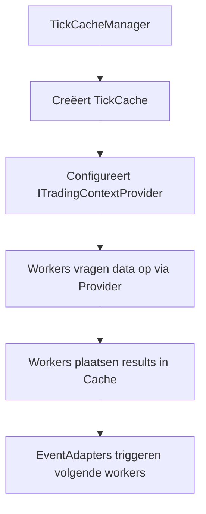

# 04_Plugin_Anatomie.md

# **S1mpleTrader: De Anatomie van een Plugin**

Dit document beschrijft de gedetailleerde structuur en de technische keuzes achter de plugins in de S1mpleTrader-architectuur, gebaseerd op het ROL vs CAPABILITIES model.

## **Inhoudsopgave**

1. [Executive Summary](#executive-summary)
2. [Fundamentele Mappenstructuur](#fundamentele-mappenstructuur)
3. [Formaat Keuzes: YAML vs. JSON](#formaat-keuzes-yaml-vs-json)
4. [Het Manifest: De Zelfbeschrijvende ID-kaart](#het-manifest-de-zelfbeschrijvende-id-kaart)
5. [ROL vs CAPABILITIES Model](#rol-vs-capabilities-model)
6. [De Worker & het BaseWorker Raamwerk](#de-worker--het-baseworker-raamwerk)
7. [Point-in-Time Data Interactie](#point-in-time-data-interactie)
8. [Plugin Capabilities in Detail](#plugin-capabilities-in-detail)

---

## **Executive Summary**

Dit document beschrijft de plugin anatomie van S1mpleTrader, een modulair systeem gebouwd op vier kernprincipes:

### **Kernkenmerken**

**1. 5-Categorie Worker Model**
- ContextWorker - De Cartograaf (marktdata verrijking)
- OpportunityWorker - De Verkenner (handelskansen herkennen)
- ThreatWorker - De Waakhond (risico's detecteren)
- PlanningWorker - De Strateeg (kansen → plannen)
- ExecutionWorker - De Uitvoerder (plannen uitvoeren)

**2. 27 Sub-Categorieën voor Fijnmazige Classificatie**
- Een gedetailleerde taxonomie voor het classificeren van elke plugin, wat filtering en begrip verbetert.

**3. Het "ROL vs CAPABILITIES Model"**
- De **ROL** van een worker (zijn architecturale doel) wordt bepaald door de keuze van de basisklasse (`StandardWorker` of `EventDrivenWorker`).
- De **CAPABILITIES** (extra vaardigheden zoals `state`, `events`, `journaling`) worden expliciet aangevraagd in het `manifest.yaml`.

**4. Point-in-Time Data Interactie**
- DTO-centric data-uitwisseling tussen workers
- TickCache voor synchrone data doorgifte
- ITradingContextProvider voor data toegang

### **Design Principes**

✅ **Plugin First** - Alles begint bij de plugin.
✅ **Zelfbeschrijvend** - Het manifest is de enige bron van waarheid.
✅ **ROL vs CAPABILITIES** - Zuivere scheiding van verantwoordelijkheden.
✅ **Opt-in Complexiteit** - Vraag alleen de capabilities aan die je nodig hebt.

---

## **Fundamentele Mappenstructuur**

Elke plugin is een opzichzelfstaande Python package. Deze structuur garandeert dat logica, contracten en metadata altijd bij elkaar blijven, wat essentieel is voor het "Plugin First" principe.

### **Basis Structuur (90% van plugins)**

```
plugins/[plugin_naam]/
├── manifest.yaml           # De ID-kaart (wie ben ik?)
├── worker.py               # De Logica (wat doe ik?)
├── schema.py               # Het Contract (wat heb ik nodig?)
├── context_schema.py       # Het visuele contract (wat kan ik laten zien?)
└── tests/
    └── test_worker.py     # De Kwaliteitscontrole (werk ik correct?)
```

### **Uitgebreide Structuur (event-aware plugins)**

Voor plugins die gebruik maken van event communication:

```
plugins/[plugin_naam]/
├── manifest.yaml           # De ID-kaart (wie ben ik?)
├── worker.py               # De Logica (wat doe ik?)
├── schema.py               # Het Contract (wat heb ik nodig?)
├── context_schema.py       # Het visuele contract (wat kan ik laten zien?)
├── dtos/                   # Event DTO's (ALLEEN voor event-aware plugins)
│   ├── __init__.py
│   ├── opportunity_signal.py    # Voorbeeld: custom Signal DTO
│   └── threat_alert.py          # Voorbeeld: custom CriticalEvent DTO
└── tests/
    └── test_worker.py     # De Kwaliteitscontrole (werk ik correct?)
```

### **Bestandsbeschrijvingen**

* **[`manifest.yaml`](plugins/)**: De "ID-kaart" van de plugin. Dit bestand maakt de plugin vindbaar en begrijpelijk voor het systeem. Bevat ook de optionele `capabilities` sectie voor extra vaardigheden.

* **[`worker.py`](plugins/)**: Bevat de Python-klasse met de daadwerkelijke businesslogica van de plugin. Erft van [`BaseWorker`](backend/core/base_worker.py) of een van de gespecialiseerde basisklassen.

* **[`schema.py`](plugins/)**: Bevat het Pydantic-model dat de structuur en validatieregels voor de configuratieparameters (`params`) van de plugin definieert.

* **[`context_schema.py`](plugins/)**: Bevat het concrete context model voor de visualisatie van gegevens die de plugin produceert. Dit is cruciaal voor de "Trade Explorer" in de frontend.

* **`dtos/`** (optioneel): Bevat custom Data Transfer Objects voor event payloads. **Alleen nodig voor event-aware plugins** die custom event payloads publiceren (niet de standaard [`Signal`](backend/dtos/pipeline/signal.py) of [`CriticalEvent`](backend/dtos/pipeline/) types).

* **[`tests/test_worker.py`](plugins/)**: Bevat de verplichte unit tests voor het valideren van de werking van de plugin. Een 100% score als uitkomst van pytest is noodzakelijk voor de succesvolle "enrollment" van een nieuwe plugin.

### **Wanneer dtos/ Map Nodig Is**

De `dtos/` map is **ALLEEN** nodig wanneer:
1. De plugin event-aware is
2. **EN** de plugin custom event payloads publiceert die niet de standaard types zijn

**95% van plugins heeft GEEN dtos/ map nodig** omdat:
- Ze zijn stateless (geen events)
- Of ze gebruiken standaard DTO's zoals [`Signal`](backend/dtos/pipeline/signal.py) en [`TradePlan`](backend/dtos/pipeline/trade_plan.py)

---

## **Formaat Keuzes: YAML vs. JSON**

De keuze voor een dataformaat hangt af van de primaire gebruiker: **een mens of een machine**. We hanteren daarom een hybride model om zowel leesbaarheid als betrouwbaarheid te maximaliseren.

* **YAML voor Menselijke Configuratie**
  * **Toepassing:** manifest.yaml en alle door de gebruiker geschreven strategy_blueprint.yaml en operation.yaml-bestanden.
  * **Waarom:** De superieure leesbaarheid, de mogelijkheid om commentaar toe te voegen, en de flexibelere syntax zijn essentieel voor ontwikkelaars en strategen die deze bestanden handmatig schrijven en onderhouden.
* **JSON voor Machine-Data**
  * **Toepassing:** Alle machine-gegenereerde data, zoals API-responses, state-bestanden, en gestructureerde logs.
  * **Waarom:** De strikte syntax en universele portabiliteit maken JSON de betrouwbare standaard voor communicatie tussen systemen en voor het opslaan van gestructureerde data waar absolute betrouwbaarheid vereist is.

---

## **Het Manifest: De Zelfbeschrijvende ID-kaart**

Het manifest.yaml is de kern van het "plugin discovery" mechanisme. Het stelt het systeem in staat om een plugin volledig te begrijpen **zonder de Python-code te hoeven inspecteren**. Dit manifest is een strikt contract dat alle cruciale metadata van een plugin vastlegt.

### **Identification**

De identification-sectie bevat alle beschrijvende metadata.

* **name**: De unieke, machine-leesbare naam (bv. [`market_structure_detector`](plugins/structural_context/market_structure_detector/)).
* **display_name**: De naam zoals deze in de UI wordt getoond.
* **type**: De **cruciale** categorie die bepaalt tot welke van de vijf functionele pijlers de plugin behoort. Toegestane waarden zijn:
  * [`context_worker`](backend/core/enums.py:WorkerType) - "De Cartograaf" - Verrijkt marktdata met context
  * [`opportunity_worker`](backend/core/enums.py:WorkerType) - "De Verkenner" - Herkent handelskansen
  * [`threat_worker`](backend/core/enums.py:WorkerType) - "De Waakhond" - Detecteert risico's
  * [`planning_worker`](backend/core/enums.py:WorkerType) - "De Strateeg" - Transformeert kansen naar plannen
  * [`execution_worker`](backend/core/enums.py:WorkerType) - "De Uitvoerder" - Voert plannen uit en beheert posities

* **subtype**: De **sub-categorie** binnen het worker type. Zie sectie 4.3.1b voor alle 27 sub-categorieën.
* **version**: De semantische versie van de plugin (bv. 1.0.1).
* **description**: Een korte, duidelijke beschrijving van de functionaliteit.
* **author**: De naam van de ontwikkelaar.

### **Dependencies (Het Data Contract)**

De dependencies-sectie is het formele contract dat definieert welke data een plugin nodig heeft om te functioneren en wat het produceert. Dit is de kern van de "context-bewuste" UI en validatie.

* **requires (Verplichte DataFrame Kolommen)**: Een lijst van datakolommen die een ContextWorker als **harde eis** verwacht in de DataFrame (bv. \['high', 'low', 'close'\]). Het systeem controleert of aan deze vereisten wordt voldaan.
* **provides (Geproduceerde DataFrame Kolommen)**: Een lijst van nieuwe datakolommen die een ContextWorker als **output** toevoegt aan de DataFrame (bv. \['is_swing_high'\]).
* **requires_context (Verplichte Rijke Data)**: Een lijst van **niet-DataFrame** data-objecten die de plugin als **harde eis** verwacht in de TradingContext. Als deze data niet beschikbaar is, zal de plugin in de UI **uitgeschakeld** zijn en zal het systeem een fout genereren bij de bootstrap.
* **uses (Optionele Rijke Data)**: Een lijst van **niet-DataFrame** data-objecten die de plugin kan gebruiken voor een **verbeterde analyse**, maar die **niet verplicht** zijn. Als deze data niet beschikbaar is, zal de plugin in een "fallback-modus" werken.

### **Capabilities (Optioneel)**

Dit is de meest cruciale sectie van het manifest in de nieuwe architectuur. Het vervangt de oude `event_config` en legt alle extra vaardigheden vast die een worker nodig heeft. Standaard heeft een worker geen extra capabilities.

```yaml
capabilities:
  # Capability voor statefulness
  state:
    enabled: true
    state_dto: "dtos.state_dto.MyWorkerState"

  # Capability voor event-interactie
  events:
    enabled: true
    publishes:
      - event: "MyCustomEventFired"
        payload_type: "MyCustomSignal"
    wirings:
      - listens_to: "SomeTriggerEvent"
        invokes:
          method: "on_some_trigger"

  # Capability voor journaling
  journaling:
    enabled: true
```

---

## **ROL vs CAPABILITIES Model**

De architectuur biedt een zuivere, expliciete scheiding tussen de **ROL** van een worker en zijn **CAPABILITIES** via het manifest-gedreven model.


```python
# backend/core/base_worker.py
from abc import ABC, abstractmethod

# De absolute basis, bevat alleen de __init__
class BaseWorker(ABC):
    def __init__(self, params: Any):
        self.params = params

# Het contract voor de ROL: Standaard Worker
class StandardWorker(BaseWorker, ABC):
    """
    Definieert de ROL van een worker die deelneemt aan de georkestreerde
    pijplijn. Deze klasse dwingt de implementatie van een 'process'-methode af.
    """
    @abstractmethod
    def process(self, context: Any, **kwargs) -> Any:
        raise NotImplementedError

```
Alle extra vaardigheden die een worker nodig heeft, worden uitsluitend gedeclareerd in een centrale `capabilities`-sectie binnen het `manifest.yaml`. Dit is de enige bron van waarheid voor de behoeften van een plugin.

```yaml
capabilities:
  # Capability voor statefulness
  state:
    enabled: true
    state_dto: "dtos.state_dto.MyWorkerState"

  # Capability voor event-interactie
  events:
    enabled: true
    publishes:
      - event: "MyCustomEventFired"
        payload_type: "MyCustomSignal"
    wirings:
      - listens_to: "SomeTriggerEvent"
        invokes:
          method: "on_some_trigger"

  # Capability voor journaling
  journaling:
    enabled: true
```

### **De Rol van de WorkerFactory**

De WorkerFactory fungeert als een "contract-valideerder" en assemblage-lijn:

1. **Lees Contract:** Inspecteert de **ROL** (basisklasse) en de aangevraagde **CAPABILITIES** (manifest).
2. **Valideer:** Controleert of de implementatie overeenkomt met de configuratie (bv. een `EventDrivenWorker` moet `events: enabled: true` hebben).
3. **Verzamel Onderdelen:** Vraagt de benodigde dependencies aan bij gespecialiseerde factories (bv. `PersistorFactory` voor state, `EventAdapterFactory` voor events).
4. **Injecteer & Bouw:** Instantieert de worker en injecteert de dependencies (`self.state`, `self.emit`, `self.log_entry`, etc.) dynamisch in de worker-instantie.

Dit model zorgt voor maximale duidelijkheid, veiligheid en onderhoudbaarheid. De ontwikkelaar declareert expliciet zijn intenties, en het systeem valideert en faciliteert deze op een robuuste manier.

---

## **De Worker & het Architecturale Contract**

De `worker.py` bevat de daadwerkelijke logica. Om de ontwikkeling te standaardiseren, dwingt de architectuur een expliciete keuze af voor de **ROL** van de worker. De ontwikkelaar moet erven van een van de twee abstracte basisklassen.

### **Voorbeeld van een StandardWorker**

Dit type worker is voor 90% van de gevallen de juiste keuze. Het is een pure, voorspelbare component in een georkestreerde pijplijn.

```python
# plugins/opportunity_workers/fvg_detector/worker.py
from backend.core.base_worker import StandardWorker
from backend.dtos.pipeline.signal import Signal

class FVGDetector(StandardWorker):
    """Detecteert Fair Value Gaps - pure, voorspelbare logica."""

    def process(self, context: TradingContext) -> List[Signal]:
        signals = []
        # Pure business logica...
        return signals
```

### **Voorbeeld van een EventDrivenWorker**

Dit type worker is voor autonome componenten die reageren op de EventBus.

```python
# plugins/threat_workers/dca_risk_assessor/worker.py
from backend.core.base_worker import EventDrivenWorker

class DCARiskAssessor(EventDrivenWorker):
    """Beoordeelt risico's n.a.v. een wekelijkse tick."""

    def assess_risk(self, payload: Any):
        # Deze methode wordt aangeroepen door de EventAdapter
        # zoals geconfigureerd in manifest.yaml
        risk_event = self._calculate_risk()
        if risk_event:
            # De 'emit' functie is dynamisch geïnjecteerd
            # door de EventAdapterFactory omdat de 'events'
            # capability is aangevraagd in het manifest.
            self.emit("dca_risk_assessed", risk_event)
```

### **Dynamisch Geïnjecteerde Capabilities**

Functionaliteit zoals `self.state`, `self.emit` en `self.log_entry` wordt niet langer verkregen via overerving van verschillende basisklassen. In plaats daarvan worden deze methodes en properties dynamisch geïnjecteerd door de WorkerFactory en de bijbehorende factories wanneer een plugin de betreffende capability aanvraagt in zijn `manifest.yaml`.

Dit zorgt voor een zuivere scheiding:

- De **klasse** (`worker.py`) definieert de **ROL** en de businesslogica.
- De **configuratie** (`manifest.yaml`) definieert de **CAPABILITIES** die de worker nodig heeft om die logica uit te voeren.

---

## **Point-in-Time Data Interactie**

Het systeem gebruikt een Point-in-Time, DTO-gedreven model voor data-uitwisseling tussen workers.

### **TickCache en ITradingContextProvider**



### **Data Toegang Patronen**

```python
class MyWorker(BaseWorker):
    def process(self, context: TradingContext) -> DispositionEnvelope:
        # Haal basis context op
        base_context = self.context_provider.get_base_context()

        # Haal benodigde DTOs op
        required_dtos = self.context_provider.get_required_dtos(self)

        # Haal platform data op
        ohlcv_data = self.ohlcv_provider.get_window(base_context.timestamp)

        # Business logica
        result = self._calculate_result(required_dtos, ohlcv_data)

        # Plaats result voor volgende workers
        self.context_provider.set_result_dto(self, result)

        return DispositionEnvelope(disposition="CONTINUE")
```

### **DTO-Centric Contracten**

Alle data-uitwisseling gebeurt via specifieke Pydantic DTOs:

```python
# Plugin-specifieke DTOs voor Cache
class EMAOutputDTO(BaseModel):
    ema_20: float
    ema_50: float
    timestamp: datetime

# Standaard DTOs voor EventBus
class OpportunitySignal(BaseModel):
    opportunity_id: UUID
    timestamp: datetime
    signal_type: str
    confidence: float
```

---

## **Plugin Capabilities in Detail**

### **State Capability**

Voor workers die interne staat moeten bijhouden tussen ticks.

```yaml
capabilities:
  state:
    enabled: true
    state_dto: "dtos.state_dto.MyWorkerState"
```

```python
class MyStatefulWorker(StandardWorker):
    def process(self, context: TradingContext) -> None:
        # self.state is geïnjecteerd door WorkerFactory
        counter = self.state.get('counter', 0)
        self.state['counter'] = counter + 1
        self.commit_state()  # Atomische save
```

### **Events Capability**

Voor workers die moeten reageren op of publiceren naar de EventBus.

```yaml
capabilities:
  events:
    enabled: true
    publishes:
      - event: "MyCustomEvent"
        payload_type: "MyCustomSignal"
    wirings:
      - listens_to: "SomeTriggerEvent"
        invokes:
          method: "on_some_trigger"
```

```python
class MyEventWorker(EventDrivenWorker):
    def on_some_trigger(self, payload: Any):
        # self.emit is geïnjecteerd door WorkerFactory
        self.emit("MyCustomEvent", signal)
```

### **Journaling Capability**

Voor workers die moeten schrijven naar het StrategyJournal.

```yaml
capabilities:
  journaling:
    enabled: true
```

```python
class MyJournalingWorker(StandardWorker):
    def process(self, context: TradingContext) -> None:
        # self.log_entries is geïnjecteerd door WorkerFactory
        self.log_entries([{"event": "something_happened"}], context)
```

---

## **Conclusie**

S1mpleTrader introduceert een robuuste, flexibele en elegante plugin-architectuur die:

✅ **ROL vs CAPABILITIES** - Zuivere scheiding van verantwoordelijkheid
✅ **Manifest-gedreven** - Single source of truth voor plugin behoeften
✅ **Point-in-Time data** - Consistente data flow per tick
✅ **Opt-in complexiteit** - Alleen de capabilities die je nodig hebt
✅ **Type-veilig** - Pydantic DTOs voor alle data-uitwisseling

Deze architectuur maakt het mogelijk om complexe, event-driven strategieën te bouwen terwijl het systeem begrijpelijk en onderhoudbaar blijft voor quants van alle niveaus.

---

**Referenties:**
- `1_Bus_communicatie_structuur.md` - Communicatie architectuur
- `2_Architectuur_Componenten.md` - Core architectuur principes
- `3_Configuratie_Trein.md` - Configuratie hiërarchie

---

## **ToDo**
EventAware worker herschrijven!

**Einde Document**