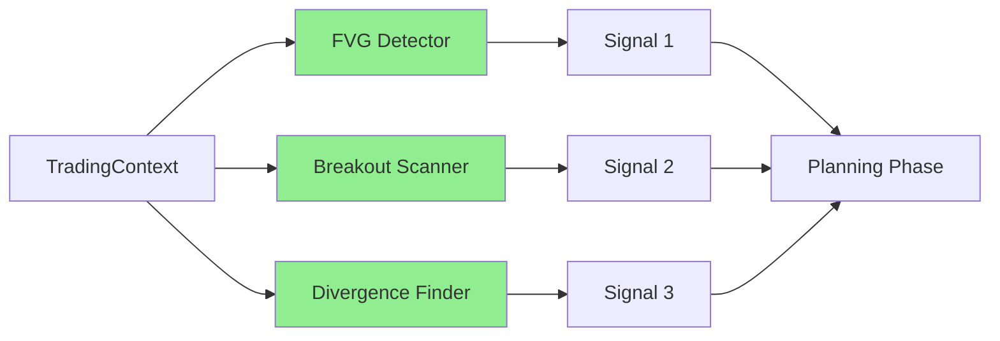
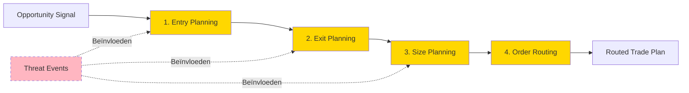

# Worker Ecosysteem: 5-Categorieën + 27 Sub-Types

**Versie:** 3.0
**Status:** Definitief

Dit document beschrijft het verfijnde worker-model van S1mpleTrader dat de workflow van een quant intuïtiever weerspiegelt door de verantwoordelijkheden strikter te scheiden.

---

## **Inhoudsopgave**

1. [Executive Summary](#executive-summary)
2. [De Vijf Worker Categorieën](#de-vijf-worker-categorieën)
3. [Sub-Categorieën Verdeling](#sub-categorieën-verdeling)
4. [Worker Rollen in Detail](#worker-rollen-in-detail)
5. [Workflow Orkestratie](#workflow-orkestratie)
6. [Plugin Capabilities Model](#plugin-capabilities-model)

---

## **Executive Summary**

De S1mpleTrader-architectuur biedt een verfijnd worker-model dat de workflow van een quant intuïtiever weerspiegelt door de verantwoordelijkheden strikter te scheiden.

### **Kernkenmerken**

**1. 5-Worker Taxonomie**
- Vijf gespecialiseerde worker-categorieën voor zuivere scheiding van verantwoordelijkheden
- 27 sub-categorieën voor fijnmazige classificatie

**2. Single Responsibility Principle**
- Elke worker heeft één duidelijke, afgebakende verantwoordelijkheid
- Context workers verrijken data, Opportunity workers detecteren kansen, etc.

**3. Plugin-First Filosofie**
- Alle businesslogica in herbruikbare, testbare plugins
- Workers zijn de fundamentele eenheid van functionaliteit

**4. Configuratie-Gedreven Orkestratie**
- Worker gedrag wordt gedefinieerd in YAML, niet in code
- Operators voeren uit volgens ExecutionStrategy en AggregationStrategy

---

## **De Vijf Worker Categorieën**

| Categorie | Rol | Output | Aantal Sub-types |
|-----------|-----|--------|------------------|
| **ContextWorker** | "De Cartograaf" - verrijkt marktdata | Verrijkte TradingContext | 7 |
| **OpportunityWorker** | "De Verkenner" - detecteert kansen | Signal DTOs | 7 |
| **ThreatWorker** | "De Waakhond" - detecteert risico's | CriticalEvent DTOs | 5 |
| **PlanningWorker** | "De Strateeg" - maakt plannen | RoutedTradePlan DTO | 4 |
| **ExecutionWorker** | "De Uitvoerder" - voert uit | Directe acties | 4 |

**Totaal:** 5 hoofdcategorieën, 27 sub-categorieën

---

## **Sub-Categorieën Verdeling**

| Worker Type | Sub-Type Enum | Aantal | Organisatie Principe |
|-------------|---------------|--------|---------------------|
| ContextWorker | ContextType | 7 | Type data-verrijking |
| OpportunityWorker | OpportunityType | 7 | Strategische benadering |
| ThreatWorker | ThreatType | 5 | Domein van risico |
| PlanningWorker | PlanningPhase | 4 | Planningsfase |
| ExecutionWorker | ExecutionType | 4 | Type actie |

### **ContextType (7)**
- `REGIME_CLASSIFICATION` - Markt regime & conditie classificatie
- `STRUCTURAL_ANALYSIS` - Technische structuur analyse
- `INDICATOR_CALCULATION` - Technische indicatoren
- `MICROSTRUCTURE_ANALYSIS` - Orderbook & microstructuur
- `TEMPORAL_CONTEXT` - Sessies, tijd patronen
- `SENTIMENT_ENRICHMENT` - Nieuws, social media
- `FUNDAMENTAL_ENRICHMENT` - On-chain, economische data

### **OpportunityType (7)**
- `TECHNICAL_PATTERN` - Patroonherkenning (FVG's, breakouts)
- `MOMENTUM_SIGNAL` - Trend following signalen
- `MEAN_REVERSION` - Oversold/overbought detectie
- `STATISTICAL_ARBITRAGE` - Arbitrage opportuniteiten
- `EVENT_DRIVEN` - Nieuws-gebaseerde signalen
- `SENTIMENT_SIGNAL` - Sentiment extremen
- `ML_PREDICTION` - Machine learning voorspellingen

### **ThreatType (5)**
- `PORTFOLIO_RISK` - Drawdown, exposure, correlatie
- `MARKET_RISK` - Volatiliteit, liquiditeit
- `SYSTEM_HEALTH` - Connectie, data kwaliteit
- `STRATEGY_PERFORMANCE` - Underperformance, drift
- `EXTERNAL_EVENT` - Breaking news, regulatie

### **PlanningPhase (4)**
- `ENTRY_PLANNING` - Waar stap ik in?
- `EXIT_PLANNING` - Waar plaats ik stops/targets?
- `SIZE_PLANNING` - Hoeveel risico neem ik?
- `ORDER_ROUTING` - Hoe voer ik technisch uit?

### **ExecutionType (4)**
- `TRADE_INITIATION` - Het initiëren van trades
- `POSITION_MANAGEMENT` - Beheer van lopende posities
- `RISK_SAFETY` - Emergency exits, circuit breakers
- `OPERATIONAL` - DCA, rebalancing, scheduled tasks

---

## **Worker Rollen in Detail**

### **ContextWorker - "De Cartograaf"**

**Single Responsibility:** Het in kaart brengen en verrijken van ruwe marktdata met objectieve context.

```python
class EMADetector(BaseWorker):
    def process(self, context: TradingContext) -> TradingContext:
        # Verrijk DataFrame met EMA kolommen
        context.enriched_df['ema_20'] = context.enriched_df['close'].ewm(span=20).mean()
        context.enriched_df['ema_50'] = context.enriched_df['close'].ewm(span=50).mean()
        return context
```

**Sub-Types:**
- `REGIME_CLASSIFICATION` - Markt regime & conditie classificatie
- `STRUCTURAL_ANALYSIS` - Technische structuur analyse
- `INDICATOR_CALCULATION` - Technische indicatoren
- `MICROSTRUCTURE_ANALYSIS` - Orderbook & microstructuur
- `TEMPORAL_CONTEXT` - Sessies, tijd patronen
- `SENTIMENT_ENRICHMENT` - Nieuws, social media
- `FUNDAMENTAL_ENRICHMENT` - On-chain, economische data

### **OpportunityWorker - "De Verkenner"**

**Single Responsibility:** Het herkennen van handelskansen op basis van patronen en strategieën.

```python
class FVGDetector(BaseWorker):
    def process(self, context: TradingContext) -> List[Signal]:
        signals = []
        for i in range(len(context.enriched_df) - 3):
            if self._is_fvg(context.enriched_df, i):
                signals.append(Signal(
                    opportunity_id=uuid4(),
                    timestamp=context.enriched_df.index[i],
                    asset=context.asset_pair,
                    direction='long',
                    signal_type='fvg_entry'
                ))
        return signals
```

**Sub-Types:**
- `TECHNICAL_PATTERN` - Patroonherkenning (FVG's, breakouts)
- `MOMENTUM_SIGNAL` - Trend following signalen
- `MEAN_REVERSION` - Oversold/overbought detectie
- `STATISTICAL_ARBITRAGE` - Arbitrage opportuniteiten
- `EVENT_DRIVEN` - Nieuws-gebaseerde signalen
- `SENTIMENT_SIGNAL` - Sentiment extremen
- `ML_PREDICTION` - Machine learning voorspellingen

### **ThreatWorker - "De Waakhond"**

**Single Responsibility:** Het detecteren van risico's en bedreigingen in de operatie.

```python
class MaxDrawdownMonitor(BaseWorker):
    def process(self, ledger_state: StrategyLedger) -> Optional[CriticalEvent]:
        current_drawdown = ledger_state.calculate_drawdown()
        if current_drawdown > self.params.max_drawdown_percent:
            return CriticalEvent(
                threat_id=uuid4(),
                threat_type='MAX_DRAWDOWN_BREACHED',
                severity='HIGH'
            )
        return None
```

**Sub-Types:**
- `PORTFOLIO_RISK` - Drawdown, exposure, correlatie
- `MARKET_RISK` - Volatiliteit, liquiditeit
- `SYSTEM_HEALTH` - Connectie, data kwaliteit
- `STRATEGY_PERFORMANCE` - Underperformance, drift
- `EXTERNAL_EVENT` - Breaking news, regulatie

### **PlanningWorker - "De Strateeg"**

**Single Responsibility:** Het transformeren van handelskansen naar concrete, uitvoerbare plannen.

```python
class LimitEntryPlanner(BaseWorker):
    def process(self, signal: Signal, context: TradingContext) -> TradePlan:
        entry_price = self._calculate_entry(signal, context)
        return TradePlan(
            trade_id=uuid4(),
            opportunity_id=signal.opportunity_id,
            entry_price=entry_price,
            entry_type='LIMIT'
        )
```

**Sub-Types:**
- `ENTRY_PLANNING` - Waar stap ik in?
- `EXIT_PLANNING` - Waar plaats ik stops/targets?
- `SIZE_PLANNING` - Hoeveel risico neem ik?
- `ORDER_ROUTING` - Hoe voer ik technisch uit?

### **ExecutionWorker - "De Uitvoerder"**

**Single Responsibility:** Het uitvoeren en actief beheren van trades en operationele taken.

```python
class DefaultPlanExecutor(BaseWorker):
    def process(self, plan: RoutedTradePlan) -> None:
        self.execution_env.execute_trade(plan)
```

**Sub-Types:**
- `TRADE_INITIATION` - Het initiëren van trades
- `POSITION_MANAGEMENT` - Beheer van lopende posities
- `RISK_SAFETY` - Emergency exits, circuit breakers
- `OPERATIONAL` - DCA, rebalancing, scheduled tasks

---

## **Workflow Orkestratie**

### **Parallelle Verwerking**

Opportunity en Threat workers worden standaard parallel uitgevoerd:



### **Sequentiele Planning**

Planning workers draaien sequentieel omdat latere fasen afhankelijk zijn van eerdere:



---

## **Plugin Capabilities Model**

De architectuur biedt een zuivere, expliciete scheiding tussen de **ROL** van een worker en zijn **CAPABILITIES** via het manifest-gedreven model.

### **ROL vs CAPABILITIES**

```python
# backend/core/base_worker.py
from abc import ABC, abstractmethod

# De absolute basis, bevat alleen de __init__
class BaseWorker(ABC):
    def __init__(self, params: Any):
        self.params = params

# Het contract voor de ROL: Standaard Worker
class StandardWorker(BaseWorker, ABC):
    """
    Definieert de ROL van een worker die deelneemt aan de georkestreerde
    pijplijn. Deze klasse dwingt de implementatie van een 'process'-methode af.
    """
    @abstractmethod
    def process(self, context: Any, **kwargs) -> Any:
        raise NotImplementedError
```

Alle extra vaardigheden worden uitsluitend gedeclareerd in het manifest:

```yaml
capabilities:
  # Capability voor statefulness
  state:
    enabled: true
    state_dto: "dtos.state_dto.MyWorkerState"

  # Capability voor event-interactie
  events:
    enabled: true
    publishes:
      - event: "MyCustomEventFired"
        payload_type: "MyCustomSignal"
    wirings:
      - listens_to: "SomeTriggerEvent"
        invokes:
          method: "on_some_trigger"

  # Capability voor journaling
  journaling:
    enabled: true
```

### **De Rol van de WorkerFactory**

De WorkerFactory fungeert als een "contract-valideerder" en assemblage-lijn:

1. **Lees Contract:** Inspecteert de **ROL** (basisklasse) en de aangevraagde **CAPABILITIES** (manifest)
2. **Valideer:** Controleert of de implementatie overeenkomt met de configuratie
3. **Verzamel Onderdelen:** Vraagt de benodigde dependencies aan bij gespecialiseerde factories
4. **Injecteer & Bouw:** Instantieert de worker en injecteert de dependencies dynamisch

---

## **Referenties**

- **[Event Architecture](02_Event_Architecture.md)** - Hoe workers communiceren
- **[Configuration Hierarchy](03_Configuration_Hierarchy.md)** - Hoe workers geconfigureerd worden
- **[Plugin Anatomy](03_Development/01_Plugin_Anatomy.md)** - Hoe workers gebouwd worden
- **[Traceability Framework](04_Traceability_Framework.md)** - Hoe worker acties getraceerd worden

---

**Einde Document**

*"Van lineaire pijplijn naar platgeslagen ecosysteem - waar workers en events harmonieus samenwerken in een expliciet bedraad model."*