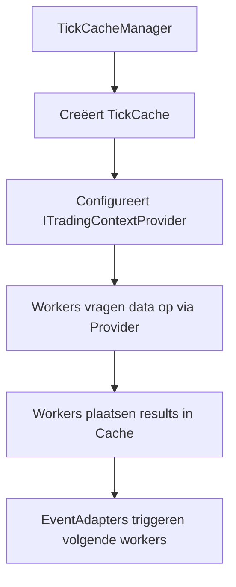

# Traceability Framework: Causale IDs

**Versie:** 3.0
**Status:** Definitief

Dit document beschrijft het rijke framework van getypeerde, causale IDs die de volledige "waarom"-keten van elke beslissing vastleggen in S1mpleTrader.

---

## **Inhoudsopgave**

1. [Executive Summary](#executive-summary)
2. [Het Causale ID Framework](#het-causale-id-framework)
3. [Causale Reconstructie](#causale-reconstructie)
4. [Ledger/Journal Scheiding](#ledgerjournal-scheiding)
5. [Point-in-Time Data Architectuur](#point-in-time-data-architectuur)
6. [Frontend Visualisatie](#frontend-visualisatie)
7. [Best Practices](#best-practices)

---

## **Executive Summary**

De S1mpleTrader-architectuur biedt een rijk framework van getypeerde, causale IDs die de volledige "waarom"-keten van elke beslissing vastleggen. Dit stelt gebruikers in staat om complete causale reconstructie uit te voeren: "Waarom is deze trade geopend?" en "Waarom is deze trade gesloten?"

### **Kernkenmerken**

**1. Getypeerde IDs**
- **OpportunityID** - "Waarom openen?" (gegenereerd door OpportunityWorker)
- **ThreatID** - "Waarom ingrijpen?" (gegenereerd door ThreatWorker)
- **TradeID** - "Welke trade?" (gegenereerd door PlanningWorker)
- **ScheduledID** - "Waarom nu?" (gegenereerd door Scheduler)

**2. Causale Links**
- Alle DTOs behouden causale links naar hun oorsprong
- StrategyJournal legt complete causale ketens vast
- Frontend Trade Explorer visualiseert causale reconstructie

**3. Ledger/Journal Scheiding**
- **StrategyLedger** - Operationele staat (snel, alleen actueel)
- **StrategyJournal** - Causale historie (rijk, append-only)

**4. Point-in-Time Data**
- DTO-centric data-uitwisseling tussen workers
- TickCache voor synchrone data doorgifte
- ITradingContextProvider voor data toegang

### **Design Principes**

✅ **Complete Traceability** - Volledige "waarom"-analyse van elke beslissing
✅ **Type Safety** - Getypeerde IDs voorkomen verwarring
✅ **Performance Optimized** - Scheiding tussen operationeel en analytisch
✅ **Visual Analytics** - Frontend tools voor causale reconstructie

---

## **Het Causale ID Framework**

Het systeem gebruikt vier getypeerde IDs die samen een complete causale keten vormen:

```python
# 1. OpportunityID - Gegenereerd door OpportunityWorker
signal = Signal(
    opportunity_id=uuid4(),  # ← "Waarom openen?"
    timestamp=...,
    signal_type='fvg_entry'
)

# 2. TradeID met causale link
plan = TradePlan(
    trade_id=uuid4(),                    # ← "Welke trade?"
    opportunity_id=signal.opportunity_id, # ← Causale link!
    entry_price=50000.0
)

# 3. ThreatID - Gegenereerd door ThreatWorker
threat = CriticalEvent(
    threat_id=uuid4(),     # ← "Waarom ingrijpen?"
    threat_type='MAX_DRAWDOWN_BREACHED'
)

# 4. ScheduledID - Gegenereerd door Scheduler
scheduled_action = ScheduledEvent(
    scheduled_id=uuid4(),  # ← "Waarom nu?"
    schedule_name='weekly_dca'
)
```

### **Causale Reconstructie**

In de StrategyJournal worden deze causale links vastgelegd:

```json
{
  "journal_entries": [
    {
      "timestamp": "2025-10-14T10:00:00Z",
      "event_type": "OPPORTUNITY_DETECTED",
      "opportunity_id": "uuid-abc-123",
      "signal_type": "fvg_entry"
    },
    {
      "timestamp": "2025-10-14T10:00:05Z",
      "event_type": "TRADE_OPENED",
      "trade_id": "uuid-def-456",
      "opportunity_id": "uuid-abc-123",  // ← Causale link: waarom geopend
      "entry_price": 50100.0
    },
    {
      "timestamp": "2025-10-14T11:30:00Z",
      "event_type": "TRADE_CLOSED",
      "trade_id": "uuid-def-456",
      "threat_id": "uuid-ghi-789",       // ← Causale link: waarom gesloten
      "closure_reason": "MAX_DRAWDOWN_BREACHED"
    }
  ]
}
```

---

## **Causale Reconstructie**

### **Trade Lifecycle Tracing**

Voor elke trade kan de complete levenscyclus worden gereconstrueerd:

```python
# 1. Opportunity Detection
opportunity = journal.get_entry(opportunity_id="uuid-abc-123")
# → "FVG detected after BOS at 50,125"

# 2. Trade Planning & Opening
trade_opened = journal.get_entries_for_trade("uuid-def-456")
# → "Trade opened because of opportunity uuid-abc-123"

# 3. Threat Detection & Response
threat = journal.get_entry(threat_id="uuid-ghi-789")
# → "Max drawdown 2.5% > threshold 2.0%"

# 4. Trade Closure
trade_closed = journal.get_trade_closure("uuid-def-456")
# → "Closed because of threat uuid-ghi-789"
```

### **Frontend Visualisatie**

De Trade Explorer UI visualiseert de causale keten:

```
Trade #42 (BTC/EUR)
├─ Opened: 2025-10-14 10:05:00
│  └─ Opportunity ID: uuid-456 ← Klikbaar
│     ├─ Type: fvg_entry (Technical Pattern)
│     ├─ Detector: fvg_detector
│     ├─ Context: Market structure break detected
│     └─ Metadata: {gap_size: 8.5, volume_percentile: 85}
│
├─ Modified: 2025-10-14 11:30:00
│  └─ Threat ID: uuid-789 ← Klikbaar
│     ├─ Type: MAX_DRAWDOWN_BREACH
│     ├─ Detector: max_drawdown_monitor
│     └─ Action: Stop moved to breakeven
│
└─ Closed: 2025-10-14 14:00:00
   └─ Reason: Take profit hit
   └─ P&L: +€125.00
```

---

## **Ledger/Journal Scheiding**

De architectuur scheidt de operationele staat van de analytische geschiedenis voor maximale performance en SRP.

### **StrategyLedger - "Het Operationele Grootboek"**

**Verantwoordelijkheid:** Alleen actuele, operationele staat voor snelle executie.

```python
class StrategyLedger:
    """Snelle, operationele state tracking."""

    capital: Decimal
    open_positions: List[Position]      # ← Alleen actieve posities
    recently_closed: List[Position]     # ← Voor context (laatste 10)
    unrealized_pnl: Decimal
    realized_pnl: Decimal

    # GEEN causale IDs
    # GEEN volledige historie
    # GEEN analytische data
```

### **StrategyJournal - "De Intelligente Notulist"**

**Verantwoordelijkheid:** Onveranderlijk, causaal logboek van ALLE gebeurtenissen.

```python
class StrategyJournal:
    """Append-only, causaal logboek."""

    journal_entries: List[JournalEntry]

    # Bevat:
    # - Gedetecteerde opportunities (incl. metadata)
    # - Actieve threats
    # - Trade opens/closes met causale links
    # - AFGEWEZEN kansen met redenatie
    # - Parameter wijzigingen
```

---

## **Point-in-Time Data Architectuur**

Het systeem gebruikt een Point-in-Time, DTO-gedreven model voor data-uitwisseling tussen workers.

### **TickCache en ITradingContextProvider**



### **Data Toegang Patronen**

```python
class MyWorker(BaseWorker):
    def process(self, context: TradingContext) -> DispositionEnvelope:
        # Haal basis context op
        base_context = self.context_provider.get_base_context()

        # Haal benodigde DTOs op
        required_dtos = self.context_provider.get_required_dtos(self)

        # Haal platform data op
        ohlcv_data = self.ohlcv_provider.get_window(base_context.timestamp)

        # Business logica
        result = self._calculate_result(required_dtos, ohlcv_data)

        # Plaats result voor volgende workers
        self.context_provider.set_result_dto(self, result)

        return DispositionEnvelope(disposition="CONTINUE")
```

### **DTO-Centric Contracten**

Alle data-uitwisseling gebeurt via specifieke Pydantic DTOs:

```python
# Plugin-specifieke DTOs voor Cache
class EMAOutputDTO(BaseModel):
    ema_20: float
    ema_50: float
    timestamp: datetime

# Standaard DTOs voor EventBus
class OpportunitySignal(BaseModel):
    opportunity_id: UUID
    timestamp: datetime
    signal_type: str
    confidence: float
```

---

## **Frontend Visualisatie**

### **Trade Explorer - Causale View**

**Causale ID Filtering:**

```typescript
interface TradeAnalysis {
  tradeId: string;
  opportunityId: string;      // ✨ Waarom geopend
  threatId?: string;          // ✨ Waarom gesloten (als threat)
  openedAt: Date;
  closedAt: Date;
  outcome: "profit" | "loss" | "breakeven";
  pnl: number;
  causaleChain: CausaleEvent[];
}
```

**Causale Reconstructie Tool:**

```typescript
interface CausaleEvent {
  timestamp: Date;
  eventType: "OPPORTUNITY_DETECTED" | "OPPORTUNITY_ACCEPTED" | "OPPORTUNITY_REJECTED"
           | "THREAT_DETECTED" | "TRADE_OPENED" | "TRADE_CLOSED";
  opportunityId?: string;
  threatId?: string;
  tradeId?: string;
  details: Record<string, any>;
  reason?: string;             // Voor rejections/closures
}
```

### **StrategyJournal Viewer**

```typescript
interface StrategyJournalEntry {
  timestamp: Date;
  eventType: string;
  opportunityId?: string;
  threatId?: string;
  tradeId?: string;
  signalType?: string;
  details: Record<string, any>;
  decision?: "accepted" | "rejected";
  rejectionReason?: string;
}
```

---

## **Best Practices**

### **DO's:**

✅ **Gebruik getypeerde IDs** - OpportunityID voor opportunities, ThreatID voor threats
✅ **Behoud causale links** - Alle DTOs moeten causale referenties behouden
✅ **Log alle beslissingen** - StrategyJournal moet complete audit trail bevatten
✅ **Visualiseer causaliteit** - Frontend tools voor causale reconstructie
✅ **Test causale flows** - Unit tests voor complete decision chains

### **DON'Ts:**

❌ **Gebruik generieke UUIDs** - Altijd getypeerde, semantische IDs
❌ **Verlies causale links** - DTOs moeten oorsprong behouden
❌ **Log alleen trades** - Ook rejected opportunities zijn waardevol
❌ **Negeer frontend tooling** - Causale visualisatie is cruciaal voor analyse
❌ **Complexe ID mapping** - Houd ID relaties eenvoudig en direct

### **Performance Overwegingen**

- **StrategyLedger** - Geoptimaliseerd voor snelheid, minimale data
- **StrategyJournal** - Geoptimaliseerd voor analyse, complete historie
- **Lazy Loading** - Journal entries alleen laden wanneer nodig
- **Indexing** - Database indices op alle causale ID velden

---

## **Referenties**

- **[Worker Ecosystem](01_Worker_Ecosystem.md)** - Worker types die IDs genereren
- **[Event Architecture](02_Event_Architecture.md)** - Event flows met causale data
- **[Configuration Hierarchy](03_Configuration_Hierarchy.md)** - Configuratie van traceability
- **[Frontend Integration](06_Advanced_Features/02_Frontend_Integration.md)** - UI visualisatie van causaliteit

---

**Einde Document**

*"Van data naar inzichten - waar elke beslissing zijn verhaal vertelt door de kracht van causale traceability."*