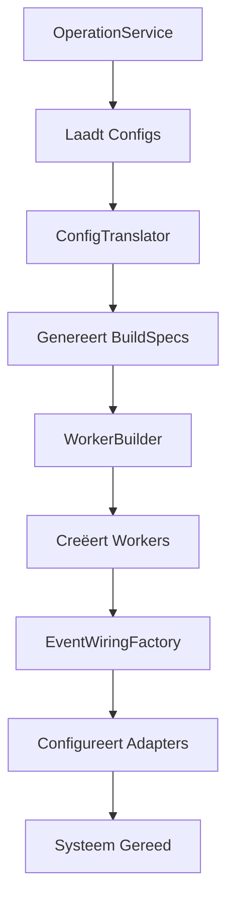
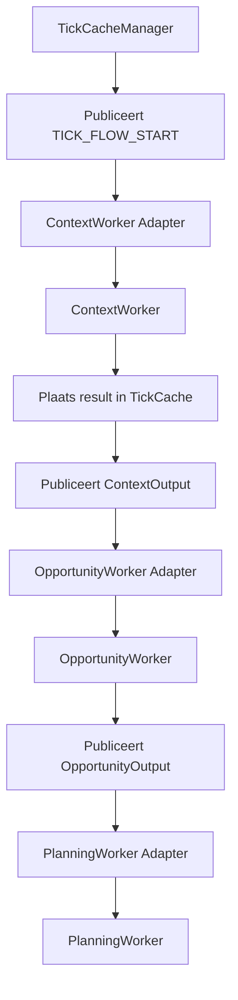

# Component Architectuur: Lagen & Componenten

**Versie:** 3.0
**Status:** Definitief

Dit document beschrijft de architectuur van S1mpleTrader, die een robuuste, flexibele en conceptueel zuivere systeemarchitectuur biedt gebaseerd op configuratie-gedreven design en event-driven communicatie.

---

## **Inhoudsopgave**

1. [Executive Summary](#executive-summary)
2. [Architectuur Principes](#architectuur-principes)
3. [Gelaagde Architectuur](#gelaagde-architectuur)
4. [Componenten in Detail](#componenten-in-detail)
5. [Dataflow & Orkestratie](#dataflow--orkestratie)

---

## **Executive Summary**

De S1mpleTrader-architectuur is ontworpen om de conceptuele zuiverheid, flexibiliteit en analytische kracht van het platform te maximaliseren. Dit wordt bereikt door een doordachte systeemarchitectuur die de kern van het platform vormt.

### **Kernkenmerken**

**1. Configuratie-Gedreven Design**
- Drie gescheiden configuratielagen: PlatformConfig, OperationConfig, StrategyConfig
- ConfigTranslator genereert machine-instructies (BuildSpecs)
- Runtime componenten worden volledig geconfigureerd via BuildSpecs

**2. Event-Driven Communicatie**
- Platgeslagen netwerk van workers met directe bedrading
- EventAdapters per component voor bus-agnostische communicatie
- Expliciete event chains via UI-gegenereerde wiring

**3. 5-Worker Taxonomie**
- Vijf gespecialiseerde worker-categorieën voor zuivere scheiding van verantwoordelijkheden
- 27 sub-categorieën voor fijnmazige classificatie

**4. Point-in-Time Data Model**
- DTO-centric data-uitwisseling tussen workers
- TickCache voor synchrone data doorgifte
- ITradingContextProvider voor data toegang

**5. Volledige Traceability**
- Rijk Causaal ID Framework voor complete "waarom"-analyse
- Gescheiden operationele staat en analytische historie

**6. Unified Persistence Suite**
- Interface-gedreven architectuur voor alle data-opslag
- Atomic writes voor crash recovery
- Dependency injection voor testbaarheid

### **Design Principes**

✅ **Configuratie-gedreven** - Gedrag wordt gedefinieerd in YAML, niet in code
✅ **Event-driven** - Asynchrone communicatie via EventBus
✅ **Plugin-first** - Alle businesslogica in herbruikbare plugins
✅ **Contract-gedreven** - Pydantic validatie voor alle data-uitwisseling
✅ **Dependency injection** - Constructor injection voor alle dependencies
✅ **Testbaar** - Pure functies met mockable dependencies

---

## **Architectuur Principes**

De architectuur is gebaseerd op zes kernprincipes die samen een robuuste, flexibele en conceptueel zuivere systeemarchitectuur creëren:

| Principe | Beschrijving | Voordeel |
|----------|-------------|----------|
| **Configuratie-gedreven** | Alle operationele logica wordt gedefinieerd in YAML | Maximum flexibiliteit zonder code-wijzigingen |
| **Event-driven** | Asynchrone communicatie via EventBus | Losse koppeling tussen componenten |
| **Plugin-first** | Alle businesslogica in onafhankelijke plugins | Herbruikbaarheid en testbaarheid |
| **Contract-gedreven** | Strikte Pydantic validatie voor alle data | Type-veiligheid en voorspelbaarheid |
| **Dependency injection** | Constructor injection voor alle dependencies | Testbaarheid en flexibiliteit |
| **Point-in-time** | Data-uitwisseling gebaseerd op specifieke momenten | Consistente en traceerbare data flow |

---

## **Gelaagde Architectuur**

De applicatie hanteert een strikte drie-lagen architectuur met eenrichtingsverkeer van afhankelijkheden:

```
┌─────────────────────────────────────────────────────────┐
│  FRONTEND LAAG  (/frontends)                            │
│  "De Gebruikersinterface"                               │
│  - CLI Presenters & Reporters                           │
│  - Web UI (React/TypeScript)                            │
│  - BFF API Layer                                        │
└────────────────────┬────────────────────────────────────┘
                     │ (Communiceert via BFF API)
                     ▼
┌─────────────────────────────────────────────────────────┐
│  SERVICE LAAG  (/services)                              │
│  "De Orkestratielaag"                                   │
│  - OperationService (lifecycle manager)                 │
│  - SchedulerService                                    │
│  - Meta Workflows (Optimization, Variant Testing)       │
└────────────────────┬────────────────────────────────────┘
                     │ (Gebruikt componenten uit backend)
                     ▼
┌─────────────────────────────────────────────────────────┐
│  BACKEND LAAG  (/backend)                               │
│  "De Motor & Gereedschapskist"                          │
│  - Core Components (Workers, DTOs, Interfaces)          │
│  - Assembly Team (Factories, Builders, Registry)        │
│  - Persistence Suite                                    │
│  - ExecutionEnvironments                                │
└─────────────────────────────────────────────────────────┘```

### **Laag Verantwoordelijkheden**

| Laag | Mag Gebruiken | Mag NIET Gebruiken | Kernverantwoordelijkheid |
|------|---------------|-------------------|--------------------------|
| **Frontend** | Service Laag (via API) | Backend direct, EventBus | Gebruikersinteractie |
| **Service** | Backend, EventBus | Frontend | Workflow orchestratie |
| **Backend** | Eigen componenten | Service Laag, EventBus | Herbruikbare businesslogica |

---

## **Componenten in Detail**

### **Core Components**

#### **EventBus**
Centrale event distribution voor asynchrone communicatie.

```python
class EventBus:
    def subscribe(self, event_name: str, handler: Callable) -> None:
        # Subscribe to event
    
    def publish(self, event_name: str, payload: BaseModel) -> None:
        # Publish event to all subscribers
```

#### **Scheduler**
Tijd-gebaseerde event scheduling.

```python
class Scheduler:
    def __init__(self, config_path: Path, event_bus: EventBus):
        # Setup schedules from schedule.yaml
```

#### **StrategyLedger**
Operationele staat tracking.

```python
class StrategyLedger:
    def __init__(self, strategy_link_id: str, initial_capital: Decimal):
        self.strategy_link_id = strategy_link_id
        self.capital = initial_capital
        self.open_positions: List[Position] = []
```

#### **StrategyJournal**
Historische logging met causale links.

```python
class StrategyJournal:
    def log_opportunity_detected(self, opportunity_id: str, details: dict):
        # Log met causale context```

### **Assembly Components**

#### **WorkerFactory**
Assembleert workers met geïnjecteerde dependencies.

```python
class WorkerFactory:
    def build_worker(self, manifest: dict, params: dict) -> BaseWorker:
        # Classificeert, valideert en injecteert capabilities
```

#### **EventWiringFactory**
Creëert EventAdapters op basis van wiring_specs.

```python
class EventWiringFactory:
    def create_adapters(self, component_registry: Dict[str, Any]):
        # Creëert geconfigureerde adapters
```

#### **ConfigTranslator**
Vertaalt configuratie naar BuildSpecs.

```python
class ConfigTranslator:
    def collect_build_specs(self, strategy_config, platform_config, operation_config):
        # Genereert complete BuildSpecs
```

---

## **Dataflow & Orkestratie**

### **Bootstrap Levenscyclus**



### **Runtime Dataflow**



### **Event Chain Validatie**

Automatische validatie tijdens bootstrap:

```python
class EventChainValidator:
    def validate(self, blueprint, wiring_map, operators_config) -> ValidationResult:
        # Valideert event integriteit
        # Detecteert orphaned events
        # Controleert circular dependencies
        return result
```

---

## **Referenties**

- **[Event Architecture](02_Core_Concepts/02_Event_Architecture.md)** - Communicatie architectuur
- **[Configuration Hierarchy](02_Core_Concepts/03_Configuration_Hierarchy.md)** - Configuratie hiërarchie
- **[Plugin Anatomy](03_Development/01_Plugin_Anatomy.md)** - Plugin development guide

---

**Einde Document**