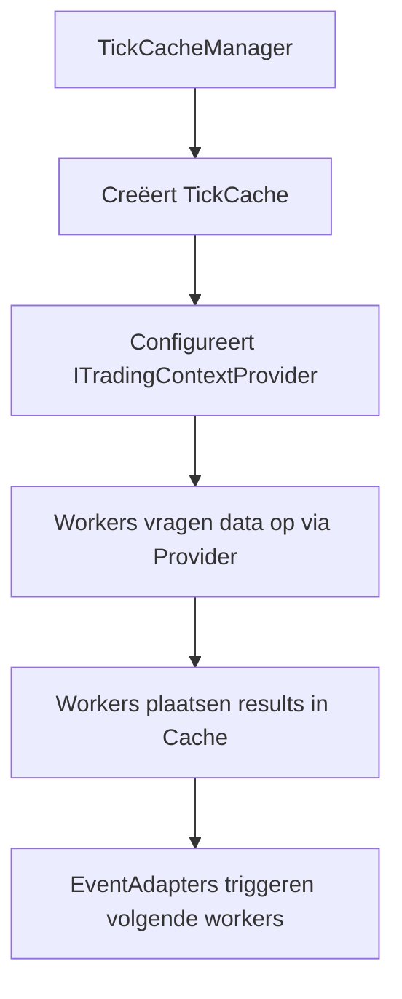

# Data Architectuur: DTOs, Persistence & State

**Versie:** 3.0
**Status:** Definitief

Dit document beschrijft de data-architectuur van S1mpleTrader, inclusief Data Transfer Objects (DTOs), de persistence suite en state management.

---

## **Inhoudsopgave**

1. [Executive Summary](#executive-summary)
2. [Point-in-Time Data Architectuur](#point-in-time-data-architectuur)
3. [Persistence Suite](#persistence-suite)
4. [Ledger/Journal Scheiding](#ledgerjournal-scheiding)
5. [Data Contracten (DTOs)](#data-contracten-dtos)

---

## **Executive Summary**

De data-architectuur van S1mpleTrader is ontworpen voor robuustheid, performance en traceerbaarheid.

### **Kernkenmerken**

**1. Point-in-Time Data Model**
- DTO-centric data-uitwisseling tussen workers
- TickCache voor synchrone data doorgifte
- ITradingContextProvider voor data toegang

**2. Unified Persistence Suite**
- Interface-gedreven architectuur voor alle data-opslag
- Atomic writes voor crash recovery
- Dependency injection voor testbaarheid

**3. Ledger/Journal Scheiding**
- **StrategyLedger** - Operationele staat (snel, alleen actueel)
- **StrategyJournal** - Causale historie (rijk, append-only)

**4. Contract-Gedreven**
- Pydantic validatie voor alle data-uitwisseling
- Strikte DTO contracten voor alle componenten

---

## **Point-in-Time Data Architectuur**

Het systeem gebruikt een Point-in-Time, DTO-gedreven model voor data-uitwisseling tussen workers.

### **TickCache en ITradingContextProvider**



### **Data Toegang Patronen**

```python
class MyWorker(BaseWorker):
    def process(self, context: TradingContext) -> DispositionEnvelope:
        # Haal basis context op
        base_context = self.context_provider.get_base_context()

        # Haal benodigde DTOs op
        required_dtos = self.context_provider.get_required_dtos(self)

        # Haal platform data op
        ohlcv_data = self.ohlcv_provider.get_window(base_context.timestamp)

        # Business logica
        result = self._calculate_result(required_dtos, ohlcv_data)

        # Plaats result voor volgende workers
        self.context_provider.set_result_dto(self, result)

        return DispositionEnvelope(disposition="CONTINUE")
```

### **DTO-Centric Contracten**

Alle data-uitwisseling gebeurt via specifieke Pydantic DTOs:

```python
# Plugin-specifieke DTOs voor Cache
class EMAOutputDTO(BaseModel):
    ema_20: float
    ema_50: float
    timestamp: datetime

# Standaard DTOs voor EventBus
class OpportunitySignal(BaseModel):
    opportunity_id: UUID
    timestamp: datetime
    signal_type: str
    confidence: float
```

---

## **Persistence Suite**

De architectuur biedt een formele, geünificeerde architectuur voor alle data-persistentie via gespecialiseerde interfaces.

### **De Drie Pijlers**

| Data Type | Interface | Implementatie | Gebruik |
|-----------|-----------|---------------|---------|
| **Marktdata** | IDataPersistor | ParquetPersistor | Grote tijdreeksen |
| **Plugin State** | IStatePersistor | JsonPersistor (atomic) | Read-write state |
| **Strategy Journal** | IJournalPersistor | JsonPersistor (append) | Append-only log |

### **Dependency Injection Pattern**

```python
class PersistorFactory:
    def create_state_persistor(self, worker_id: str) -> IStatePersistor:
        return JsonPersistor(
            path=f"state/{worker_id}/state.json",
            mode="atomic"  # Crash-safe writes
        )

    def create_journal_persistor(self, strategy_id: str) -> IJournalPersistor:
        return JsonPersistor(
            path=f"journals/{strategy_id}/journal.json",
            mode="append"  # Append-only writes
        )
```

### **Atomic Writes voor Crash Recovery**

```python
class JsonPersistor:
    def save_atomic(self, data: dict) -> None:
        """Crash-safe write met journaling."""
        # 1. Schrijf naar .journal bestand
        with open(f"{self.path}.journal", 'w') as f:
            json.dump(data, f)
            f.flush()
            os.fsync(f.fileno())  # 2. Force naar disk

        # 3. Atomic rename
        os.rename(f"{self.path}.journal", self.path)
```

---

## **Ledger/Journal Scheiding**

De architectuur scheidt de operationele staat van de analytische geschiedenis voor maximale performance en SRP.

### **StrategyLedger - "Het Operationele Grootboek"**

**Verantwoordelijkheid:** Alleen actuele, operationele staat voor snelle executie.

```python
class StrategyLedger:
    """Snelle, operationele state tracking."""

    capital: Decimal
    open_positions: List[Position]      # ← Alleen actieve posities
    recently_closed: List[Position]     # ← Voor context (laatste 10)
    unrealized_pnl: Decimal
    realized_pnl: Decimal

    # GEEN causale IDs
    # GEEN volledige historie
    # GEEN analytische data
```

### **StrategyJournal - "De Intelligente Notulist"**

**Verantwoordelijkheid:** Onveranderlijk, causaal logboek van ALLE gebeurtenissen.

```python
class StrategyJournal:
    """Append-only, causaal logboek."""

    journal_entries: List[JournalEntry]

    # Bevat:
    # - Gedetecteerde opportunities (incl. metadata)
    # - Actieve threats
    # - Trade opens/closes met causale links
    # - AFGEWEZEN kansen met redenatie
    # - Parameter wijzigingen
```

---

## **Data Contracten (DTOs)**

Voor een volledig overzicht van alle DTOs, zie **[Component Index](07_Appendices/03_Component_Index.md)**.

---

## **Referenties**

- **[Component Architectuur](01_Component_Architecture.md)** - Gelaagde architectuur
- **[Traceability Framework](02_Core_Concepts/04_Traceability_Framework.md)** - Causale IDs en journal
- **[Plugin Anatomy](03_Development/01_Plugin_Anatomy.md)** - DTOs in plugins

---

**Einde Document**