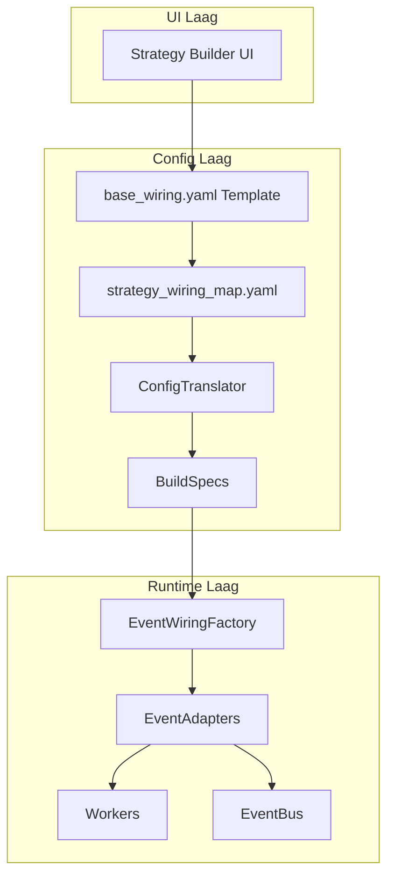
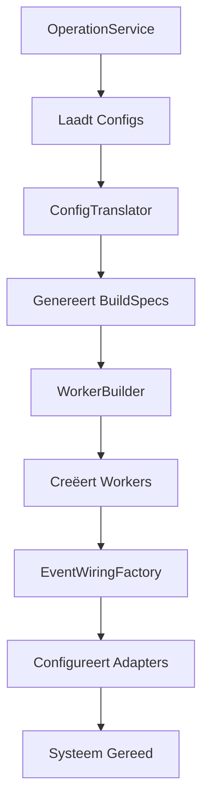

# Integration Architectuur: Event Wiring & Operators

**Versie:** 3.0
**Status:** Definitief

Dit document beschrijft de integratie-architectuur van S1mpleTrader, inclusief event wiring, data-gedreven operators en dependency injection.

---

## **Inhoudsopgave**

1. [Executive Summary](#executive-summary)
2. [Platgeslagen Orkestratie Model](#platgeslagen-orkestratie-model)
3. [EventAdapter Architectuur](#eventadapter-architectuur)
4. [Data-Gedreven Operators](#data-gedreven-operators)
5. [Dependency Injection Principes](#dependency-injection-principes)
6. [Bootstrap Levenscyclus](#bootstrap-levenscyclus)

---

## **Executive Summary**

De integratie-architectuur van S1mpleTrader is ontworpen voor flexibiliteit, testbaarheid en losse koppeling van componenten.

### **Kernkenmerken**

**1. Platgeslagen Orkestratie**
- Geen Operator-laag meer; directe worker-naar-worker communicatie
- Expliciete bedrading via UI-gegenereerde strategy_wiring_map
- Configuratie-gedreven flow control

**2. EventAdapter per Component**
- Generieke, configureerbare EventAdapters voor alle componenten
- Volledig gestuurd door BuildSpecs uit ConfigTranslator
- Bus-agnostische workers via adapter interface

**3. Data-Gedreven Operators**
- Gedrag van operators gedefinieerd in `operators.yaml`
- ExecutionStrategy en AggregationStrategy bepalen worker orkestratie
- Code is mechanica, YAML is intelligentie

**4. Dependency Injection**
- Constructor injection als standaard
- Interface-based dependencies
- Factory pattern voor complexe objecten

---

## **Platgeslagen Orkestratie Model**

### **Het Concept**

Het systeem gebruikt een platgeslagen, expliciet bedraad netwerk waarin elke worker en singleton component een eigen EventAdapter heeft. Er is geen Operator-laag meer; de orkestratie wordt volledig bepaald door de wiring_specs in de BuildSpecs.

### **De Componenten**



---

## **EventAdapter Architectuur**

### **Generieke, Configureerbare Adapters**

Het systeem gebruikt één enkele, generieke EventAdapter klasse. Het specifieke gedrag wordt bepaald door de configuratie die elke instantie meekrijgt tijdens de bootstrap-fase via de EventWiringFactory.

### **Kernverantwoordelijkheden**

1. **Event Ontvangst** - Luisteren naar specifieke events op de EventBus
2. **Component Aanroep** - De juiste methode op de component aanroepen
3. **Output Verwerking** - Interpreteren van DispositionEnvelope
4. **Publicatie Uitvoering** - Publiceren van systeem of custom events

---

## **Data-Gedreven Operators**

### **operators.yaml als Perfecte Scheiding**

Het [`operators.yaml`](../../config/operators.yaml) bestand is het perfecte voorbeeld van configuratie-gedreven design - het volledige gedrag van operators wordt gedefinieerd zonder code te wijzigen.

**Configuratie definieert gedrag:**
```yaml
# config/operators.yaml
operators:
  - operator_id: "ContextOperator"
    manages_worker_type: "ContextWorker"
    execution_strategy: "SEQUENTIAL"      # ← Gedrag in configuratie
    aggregation_strategy: "CHAIN_THROUGH" # ← Niet in code!

  - operator_id: "OpportunityOperator"
    manages_worker_type: "OpportunityWorker"
    execution_strategy: "PARALLEL"
    aggregation_strategy: "COLLECT_ALL"
```

**Code is generieke executor:**
```python
# backend/core/operators/base_operator.py
class BaseOperator:
    """Generieke operator - gedrag via configuratie."""

    def run(self, context: Any) -> Any:
        # Lees configuratie
        strategy = self.config.execution_strategy

        # Voer uit volgens configuratie
        if strategy == ExecutionStrategy.SEQUENTIAL:
            return self._execute_sequential(...)
        elif strategy == ExecutionStrategy.PARALLEL:
            return self._execute_parallel(...)
```

---

## **Dependency Injection Principes**

### **Constructor Injection als Standaard**

Alle dependencies worden geïnjecteerd via de constructor, nooit via property setters of method parameters.

**Goed voorbeeld:**
```python
# backend/core/operators/base_operator.py
class BaseOperator:
    """Operator met geïnjecteerde dependencies."""

    def __init__(
        self,
        config: OperatorConfig,
        component_builder: ComponentBuilder,
        event_bus: EventBus,
        persistor_factory: PersistorFactory
    ):
        self.config = config
        self._component_builder = component_builder
        self._event_bus = event_bus
        self._persistor_factory = persistor_factory
```

### **Gecentraliseerd Factory Model**

Complexe object-constructie gebeurt via **gespecialiseerde, gecentraliseerde factories**.

*   `PersistorFactory`: Creëert `IStatePersistor` en `IJournalPersistor` instanties.
*   `EventAdapterFactory`: Creëert `IEventHandler` (EventAdapter) instanties.
*   `OperatorFactory`: Creëert `BaseOperator` instanties op basis van configuratie.

---

## **Bootstrap Levenscyclus**



---

## **Referenties**

- **[Component Architectuur](01_Component_Architecture.md)** - Gelaagde architectuur
- **[Event Architecture](02_Core_Concepts/02_Event_Architecture.md)** - Event system details
- **[Coding Standards](05_Implementation/01_Coding_Standards.md)** - Dependency injection patterns

---

**Einde Document**