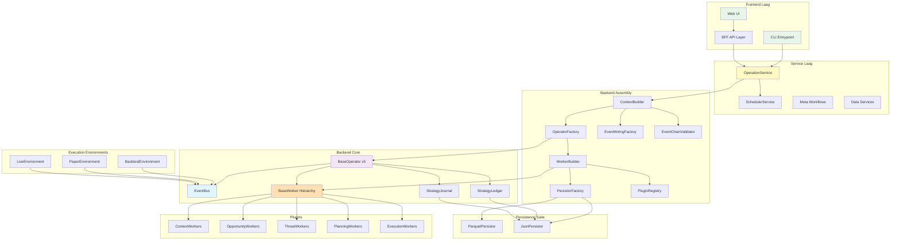
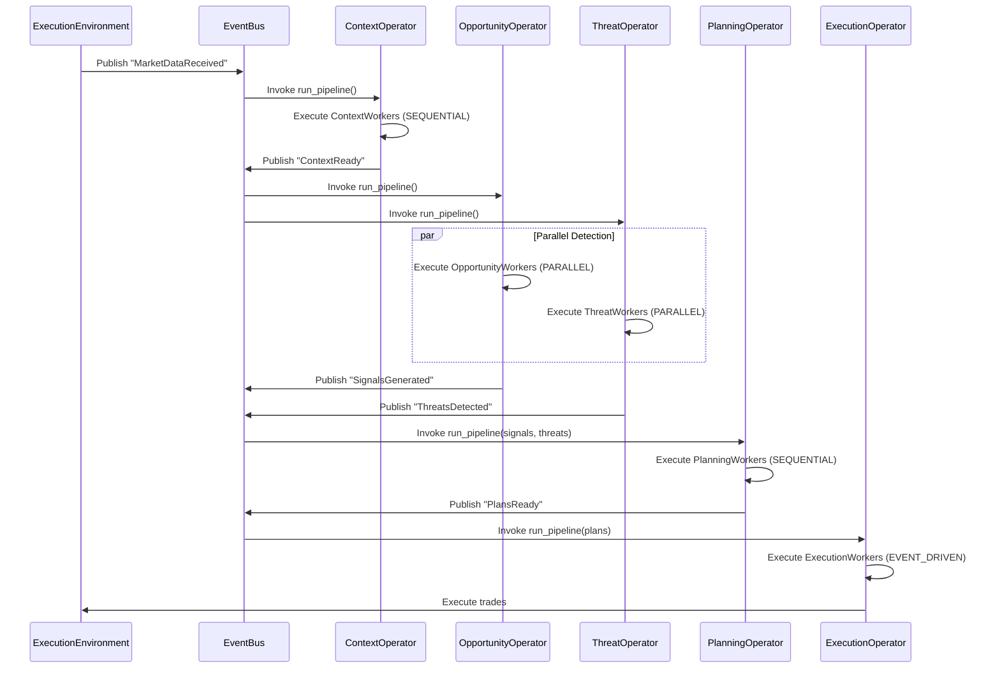
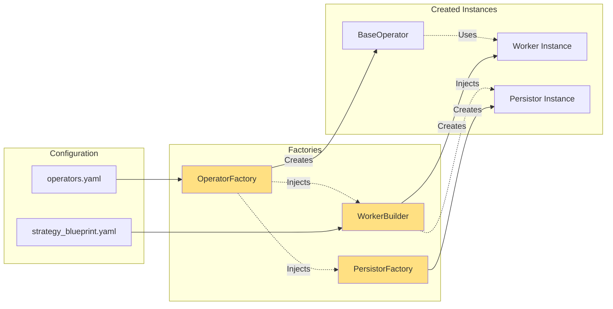
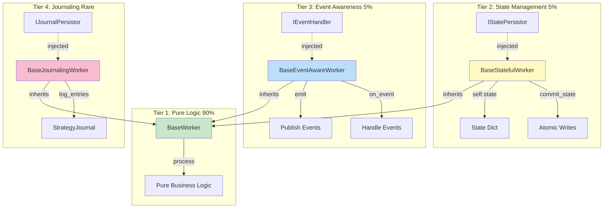
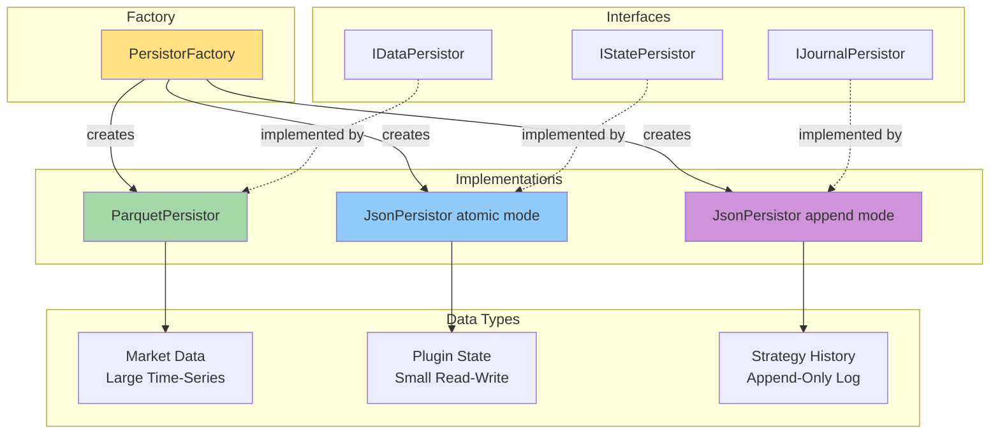

# **S1mpleTrader V3: Complete System Design**

**Versie:** 3.0  
**Status:** Definitief Ontwerp  
**Datum:** 2025-10-14  
**Auteur:** System Architect

---

## **Inhoudsopgave**

1. [Executive Summary](#1-executive-summary)
2. [Volledige Map- & Bestandstructuur](#2-volledige-map--bestandstructuur)
3. [Configuratie Schema's (Pydantic)](#3-configuratie-schemas-pydantic)
4. [Data Contracten (DTOs)](#4-data-contracten-dtos)
5. [Interface Contracten](#5-interface-contracten)
6. [Backend Assembly Componenten](#6-backend-assembly-componenten)
7. [Backend Core Componenten](#7-backend-core-componenten)
8. [Factories](#8-factories)
9. [Services Laag](#9-services-laag)
10. [Frontend Laag](#10-frontend-laag)
11. [Grafische Overzichten](#11-grafische-overzichten)
12. [Ontwikkelingsvolgorde](#12-ontwikkelingsvolgorde)

---

## **1. Executive Summary**

Dit document beschrijft het complete systeemontwerp voor S1mpleTrader V3, een configuratie-gedreven, event-driven trading platform gebouwd op strikte SOLID principes en dependency injection.

### **1.1. Kernprincipes**

✅ **Plugin-First** - Alle businesslogica in plugins  
✅ **Configuratie-gedreven** - YAML definieert gedrag, code is mechanica  
✅ **Contract-gedreven** - Pydantic validatie overal  
✅ **Event-driven** - Asynchrone communicatie (opt-in)  
✅ **Dependency Injection** - Constructor injection als standaard  
✅ **100% Test Coverage** - TDD adagium strikt gevolgd

### **1.2. Architectuur Highlights**

- **5 Worker Categorieën**: Context, Opportunity, Threat, Planning, Execution
- **27 Sub-Types**: Fijnmazige classificatie voor alle workers
- **Data-Gedreven Operators**: [`BaseOperator`](../../backend/core/operators/base_operator.py) met [`operators.yaml`](../../config/operators.yaml) configuratie
- **Gelaagde Capabilities**: Opt-in complexiteit via specialized base classes
- **Causaal ID Framework**: OpportunityID, ThreatID, TradeID, ScheduledID
- **Persistence Suite**: IDataPersistor, IStatePersistor, IJournalPersistor
- **Event Architecture**: Drie abstractieniveaus (Impliciet → Predefined → Custom)

---

## **2. Volledige Map- & Bestandstructuur**

```
S1mpleTraderV2/
├── backend/
│   ├── __init__.py
│   ├── py.typed
│   │
│   ├── config/
│   │   ├── __init__.py
│   │   ├── loader.py
│   │   ├── validator.py
│   │   └── schemas/
│   │       ├── __init__.py
│   │       ├── platform_schema.py
│   │       ├── operators_schema.py          # NIEUW V3
│   │       ├── schedule_schema.py           # NIEUW V3
│   │       ├── event_map_schema.py          # NIEUW V3
│   │       ├── wiring_map_schema.py         # NIEUW V3
│   │       ├── operation_schema.py          # V3 (was portfolio_schema.py)
│   │       ├── strategy_blueprint_schema.py # V3 (was run_schema.py)
│   │       ├── plugin_manifest_schema.py
│   │       ├── connectors_schema.py
│   │       ├── data_sources_schema.py       # NIEUW V3
│   │       ├── environments_schema.py        # NIEUW V3
│   │       └── connectors/
│   │           ├── __init__.py
│   │           └── kraken_schema.py
│   │
│   ├── core/
│   │   ├── __init__.py
│   │   ├── constants.py
│   │   ├── enums.py                         # V3 uitgebreid
│   │   │
│   │   ├── base_worker.py                   # V3.2 met StandardWorker & EventDrivenWorker
│   │   ├── strategy_ledger.py               # NIEUW V3 (operationele staat)
│   │   ├── strategy_journal.py              # NIEUW V3 (causale geschiedenis)
│   │   ├── event_bus.py                     # NIEUW V3
│   │   ├── scheduler.py                     # NIEUW V3
│   │   │
│   │   ├── operators/
│   │   │   ├── __init__.py
│   │   │   └── base_operator.py             # V3.1 'domme' uitvoerder
│   │   │
│   │   └── interfaces/
│   │       ├── __init__.py
│   │       ├── worker.py                    # IWorker protocol
│   │       ├── operator.py                  # IOperator protocol
│   │       ├── event_handler.py             # NIEUW V3
│   │       ├── connectors.py                # IAPIConnector
│   │       ├── persistors.py                # NIEUW V3 (IDataPersistor, IStatePersistor, IJournalPersistor)
│   │       ├── execution.py                 # IExecutionHandler
│   │       └── environment.py               # IExecutionEnvironment
│   │
│   ├── assembly/
│   │   ├── __init__.py
│   │   ├── context_builder.py               # V3 bootstrap orchestrator
│   │   ├── plugin_registry.py
│   │   ├── worker_builder.py                # V3 met DI injection
│   │   ├── operator_factory.py              # NIEUW V3
│   │   ├── persistor_factory.py             # NIEUW V3
│   │   ├── connector_factory.py
│   │   ├── plugin_event_adapter.py          # NIEUW V3
│   │   ├── event_wiring_factory.py          # NIEUW V3
│   │   ├── event_chain_validator.py         # NIEUW V3
│   │   ├── dependency_validator.py
│   │   └── config_validator.py              # NIEUW V3 (unified validation)
│   │
│   ├── dtos/
│   │   ├── __init__.py
│   │   │
│   │   ├── config/                          # NIEUW V3 (config DTOs)
│   │   │   ├── __init__.py
│   │   │   ├── operator_config.py
│   │   │   ├── schedule_config.py
│   │   │   ├── event_definition.py
│   │   │   └── wiring_definition.py
│   │   │
│   │   ├── state/
│   │   │   ├── __init__.py
│   │   │   ├── trading_context.py           # V3 enhanced
│   │   │   ├── ledger_state.py              # NIEUW V3
│   │   │   ├── journal_entry.py             # NIEUW V3
│   │   │   ├── operation_parameters.py      # NIEUW V3
│   │   │   ├── bootstrap_result.py          # NIEUW V3
│   │   │   ├── operation_summary.py         # NIEUW V3
│   │   │   └── scheduled_tick.py            # NIEUW V3
│   │   │
│   │   ├── pipeline/
│   │   │   ├── __init__.py
│   │   │   ├── signal.py                    # V3 met opportunity_id
│   │   │   ├── entry_signal.py
│   │   │   ├── risk_defined_signal.py
│   │   │   ├── trade_plan.py
│   │   │   └── routed_trade_plan.py
│   │   │
│   │   ├── execution/
│   │   │   ├── __init__.py
│   │   │   ├── critical_event.py            # V3 met threat_id
│   │   │   ├── execution_directive.py
│   │   │   └── shutdown_signal.py           # NIEUW V3
│   │   │
│   │   ├── market/
│   │   │   ├── __init__.py
│   │   │   ├── trade_tick.py
│   │   │   └── data_coverage.py
│   │   │
│   │   ├── queries/
│   │   │   ├── __init__.py
│   │   │   ├── coverage_query.py
│   │   │   ├── pairs_query.py
│   │   │   └── range_query.py
│   │   │
│   │   └── commands/
│   │       ├── __init__.py
│   │       ├── synchronization_command.py
│   │       ├── fetch_period_command.py
│   │       ├── extend_history_command.py
│   │       └── fill_gaps_command.py
│   │
│   ├── data/
│   │   ├── __init__.py
│   │   ├── loader.py
│   │   └── persistors/
│   │       ├── __init__.py
│   │       ├── parquet_persistor.py
│   │       └── json_persistor.py            # NIEUW V3 (atomic + append modes)
│   │
│   ├── environments/
│   │   ├── __init__.py
│   │   ├── base_environment.py              # NIEUW V3
│   │   ├── backtest_environment.py          # V3 enhanced
│   │   ├── paper_environment.py             # V3 enhanced
│   │   ├── live_environment.py              # V3 enhanced
│   │   └── api_connectors/
│   │       ├── __init__.py
│   │       └── kraken_connector.py
│   │
│   └── utils/
│       ├── __init__.py
│       ├── app_logger.py
│       ├── translator.py
│       ├── dynamic_loader.py
│       └── data_utils.py
│
├── services/
│   ├── __init__.py
│   ├── operation_service.py                 # NIEUW V3 (replaces strategy_operator)
│   ├── scheduler_service.py                 # NIEUW V3
│   │
│   ├── data_services/
│   │   ├── __init__.py
│   │   ├── data_query_service.py
│   │   └── data_command_service.py
│   │
│   ├── meta_workflows/
│   │   ├── __init__.py
│   │   ├── optimization_service.py
│   │   ├── variant_test_service.py
│   │   └── parallel_run_service.py
│   │
│   └── api_services/
│       ├── __init__.py
│       ├── plugin_query_service.py
│       └── visualization_service.py
│
├── plugins/
│   ├── __init__.py
│   │
│   ├── context_workers/
│   │   ├── __init__.py
│   │   │
│   │   ├── regime_classification/           # ContextType: REGIME_CLASSIFICATION
│   │   │   ├── adx_regime_classifier/
│   │   │   │   ├── __init__.py
│   │   │   │   ├── manifest.yaml
│   │   │   │   ├── schema.py
│   │   │   │   ├── worker.py
│   │   │   │   └── tests/
│   │   │   │       ├── __init__.py
│   │   │   │       └── test_worker.py
│   │   │   └── volatility_regime_detector/
│   │   │
│   │   ├── structural_analysis/             # ContextType: STRUCTURAL_ANALYSIS
│   │   │   ├── market_structure_detector/
│   │   │   ├── liquidity_zone_mapper/
│   │   │   └── order_block_identifier/
│   │   │
│   │   ├── indicator_calculation/           # ContextType: INDICATOR_CALCULATION
│   │   │   ├── ema_detector/
│   │   │   ├── atr_calculator/
│   │   │   └── premium_discount_calculator/
│   │   │
│   │   ├── microstructure_analysis/         # ContextType: MICROSTRUCTURE_ANALYSIS
│   │   │   └── orderbook_imbalance_detector/
│   │   │
│   │   ├── temporal_context/                # ContextType: TEMPORAL_CONTEXT
│   │   │   └── session_analyzer/
│   │   │
│   │   ├── sentiment_enrichment/            # ContextType: SENTIMENT_ENRICHMENT
│   │   │   └── news_sentiment_analyzer/
│   │   │
│   │   └── fundamental_enrichment/          # ContextType: FUNDAMENTAL_ENRICHMENT
│   │       └── onchain_metrics_enricher/
│   │
│   ├── opportunity_workers/                 # NIEUW V3
│   │   ├── __init__.py
│   │   │
│   │   ├── technical_pattern/               # OpportunityType: TECHNICAL_PATTERN
│   │   │   ├── fvg_detector/
│   │   │   │   ├── __init__.py
│   │   │   │   ├── manifest.yaml
│   │   │   │   ├── schema.py
│   │   │   │   ├── worker.py
│   │   │   │   └── tests/
│   │   │   │       ├── __init__.py
│   │   │   │       └── test_worker.py
│   │   │   ├── breakout_scanner/
│   │   │   └── divergence_finder/
│   │   │
│   │   ├── momentum_signal/                 # OpportunityType: MOMENTUM_SIGNAL
│   │   │   ├── liquidity_sweep_detector/
│   │   │   └── trend_continuation_detector/
│   │   │
│   │   ├── mean_reversion/                  # OpportunityType: MEAN_REVERSION
│   │   │   └── oversold_detector/
│   │   │
│   │   ├── statistical_arbitrage/           # OpportunityType: STATISTICAL_ARBITRAGE
│   │   │   └── pair_trading_detector/
│   │   │
│   │   ├── event_driven/                    # OpportunityType: EVENT_DRIVEN
│   │   │   └── news_signal_generator/
│   │   │
│   │   ├── sentiment_signal/                # OpportunityType: SENTIMENT_SIGNAL
│   │   │   └── dca_opportunity_scorer/
│   │   │
│   │   └── ml_prediction/                   # OpportunityType: ML_PREDICTION
│   │       └── pattern_recognition_ai/
│   │
│   ├── threat_workers/                      # NIEUW V3 (was monitor_workers)
│   │   ├── __init__.py
│   │   │
│   │   ├── portfolio_risk/                  # ThreatType: PORTFOLIO_RISK
│   │   │   ├── max_drawdown_monitor/
│   │   │   │   ├── __init__.py
│   │   │   │   ├── manifest.yaml
│   │   │   │   ├── schema.py
│   │   │   │   ├── worker.py
│   │   │   │   └── tests/
│   │   │   │       ├── __init__.py
│   │   │   │       └── test_worker.py
│   │   │   ├── exposure_monitor/
│   │   │   └── correlation_risk_detector/
│   │   │
│   │   ├── market_risk/                     # ThreatType: MARKET_RISK
│   │   │   ├── volatility_spike_detector/
│   │   │   └── liquidity_drought_detector/
│   │   │
│   │   ├── system_health/                   # ThreatType: SYSTEM_HEALTH
│   │   │   ├── connection_monitor/
│   │   │   └── data_gap_detector/
│   │   │
│   │   ├── strategy_performance/            # ThreatType: STRATEGY_PERFORMANCE
│   │   │   └── winrate_degradation_detector/
│   │   │
│   │   └── external_event/                  # ThreatType: EXTERNAL_EVENT
│   │       └── news_event_monitor/
│   │
│   ├── planning_workers/                    # NIEUW V3
│   │   ├── __init__.py
│   │   │
│   │   ├── entry_planning/                  # PlanningPhase: ENTRY_PLANNING
│   │   │   ├── limit_entry_planner/
│   │   │   │   ├── __init__.py
│   │   │   │   ├── manifest.yaml
│   │   │   │   ├── schema.py
│   │   │   │   ├── worker.py
│   │   │   │   └── tests/
│   │   │   │       ├── __init__.py
│   │   │   │       └── test_worker.py
│   │   │   ├── market_entry_planner/
│   │   │   └── adaptive_dca_planner/        # Event-aware example
│   │   │
│   │   ├── exit_planning/                   # PlanningPhase: EXIT_PLANNING
│   │   │   ├── liquidity_target_exit/
│   │   │   ├── atr_based_stops/
│   │   │   └── fixed_rr_exit/
│   │   │
│   │   ├── size_planning/                   # PlanningPhase: SIZE_PLANNING
│   │   │   ├── fixed_risk_sizer/
│   │   │   ├── kelly_criterion_sizer/
│   │   │   └── adaptive_risk_sizer/
│   │   │
│   │   └── order_routing/                   # PlanningPhase: ORDER_ROUTING
│   │       ├── default_router/
│   │       ├── limit_order_router/
│   │       └── iceberg_router/
│   │
│   └── execution_workers/
│       ├── __init__.py
│       │
│       ├── trade_initiation/                # ExecutionType: TRADE_INITIATION
│       │   └── default_plan_executor/
│       │       ├── __init__.py
│       │       ├── manifest.yaml
│       │       ├── schema.py
│       │       ├── worker.py
│       │       └── tests/
│       │           ├── __init__.py
│       │           └── test_worker.py
│       │
│       ├── position_management/             # ExecutionType: POSITION_MANAGEMENT
│       │   ├── trailing_stop_manager/       # BaseStatefulWorker example
│       │   └── partial_profit_taker/
│       │
│       ├── risk_safety/                     # ExecutionType: RISK_SAFETY
│       │   └── emergency_exit_agent/
│       │
│       └── operational/                     # ExecutionType: OPERATIONAL
│           └── dca_executor/
│
├── config/
│   ├── __init__.py
│   ├── platform.yaml
│   ├── operators.yaml                       # NIEUW V3
│   ├── schedule.yaml                        # NIEUW V3
│   ├── event_map.yaml                       # NIEUW V3
│   ├── wiring_map.yaml                      # NIEUW V3
│   ├── connectors.yaml
│   ├── data_sources.yaml                    # NIEUW V3
│   ├── environments.yaml                    # NIEUW V3
│   ├── operation.yaml                       # V3 (was portfolio.yaml)
│   ├── index.yaml
│   │
│   ├── runs/
│   │   ├── ict_smc_strategy.yaml           # strategy_blueprint voorbeeld
│   │   └── smart_dca_btc.yaml              # event-driven voorbeeld
│   │
│   ├── optimizations/
│   │   └── optimize_atr_params.yaml
│   │
│   ├── variants/
│   │   └── robustness_test.yaml
│   │
│   └── overrides/
│       └── use_eth_pair.yaml
│
├── frontends/
│   ├── __init__.py
│   │
│   ├── cli/
│   │   ├── __init__.py
│   │   ├── run_operation_entrypoint.py             # V3 entrypoint
│   │   ├── run_data_cli.py
│   │   ├── presenters/
│   │   │   ├── __init__.py
│   │   │   └── optimization_presenter.py
│   │   └── reporters/
│   │       ├── __init__.py
│   │       └── cli_reporter.py
│   │
│   └── web/
│       ├── __init__.py
│       ├── api/
│       │   ├── __init__.py
│       │   ├── main.py
│       │   └── routers/
│       │       ├── __init__.py
│       │       ├── operations_router.py     # NIEUW V3
│       │       ├── backtest_router.py
│       │       └── plugins_router.py
│       │
│       └── ui/
│           ├── package.json
│           └── src/
│               └── App.tsx
│
├── tests/
│   ├── __init__.py
│   │
│   ├── unit/
│   │   ├── __init__.py
│   │   ├── config/
│   │   │   ├── __init__.py
│   │   │   ├── test_config_loader.py
│   │   │   └── test_config_validator.py
│   │   │
│   │   ├── core/
│   │   │   ├── __init__.py
│   │   │   ├── test_base_worker.py
│   │   │   ├── test_base_stateful_worker.py
│   │   │   ├── test_base_event_aware_worker.py
│   │   │   ├── test_strategy_ledger.py
│   │   │   ├── test_strategy_journal.py
│   │   │   ├── test_event_bus.py
│   │   │   ├── test_scheduler.py
│   │   │   └── operators/
│   │   │       ├── __init__.py
│   │   │       └── test_base_operator.py
│   │   │
│   │   ├── assembly/
│   │   │   ├── __init__.py
│   │   │   ├── test_plugin_registry.py
│   │   │   ├── test_worker_builder.py
│   │   │   ├── test_operator_factory.py
│   │   │   ├── test_persistor_factory.py
│   │   │   ├── test_plugin_event_adapter.py
│   │   │   └── test_event_chain_validator.py
│   │   │
│   │   ├── data/
│   │   │   ├── __init__.py
│   │   │   └── persistors/
│   │   │       ├── __init__.py
│   │   │       ├── test_parquet_persistor.py
│   │   │       └── test_json_persistor.py
│   │   │
│   │   └── environments/
│   │       ├── __init__.py
│   │       ├── test_backtest_environment.py
│   │       └── test_live_environment.py
│   │
│   ├── integration/
│   │   ├── __init__.py
│   │   ├── test_end_to_end_backtest.py
│   │   ├── test_event_chain_flow.py
│   │   └── test_operator_coordination.py
│   │
│   └── fixtures/
│       ├── __init__.py
│       ├── mock_persistors.py
│       ├── mock_event_handler.py
│       └── test_data_factory.py
│
├── locales/
│   ├── nl.yaml
│   └── en.yaml
│
├── tools/
│   ├── migrate_v2_to_v3.py                  # NIEUW V3
│   └── validate_event_chains.py             # NIEUW V3
│
├── run_operation.py                         # V3 entrypoint (was run_backtest_cli.py)
├── run_supervisor.py
├── run_web.py
├── requirements.txt
├── pytest.ini
├── .pylintrc
└── README.md
```

---

## **3. Configuratie Schema's (Pydantic)**

### **3.1. backend/config/schemas/operators_schema.py**

**Bestandsnaam:** `operators_schema.py`  
**Plek in architectuur:** Backend > Config > Schemas  
**Type:** Pydantic Schema  
**Layer:** Backend (Config)  
**Dependencies:** `[Pydantic, backend.core.enums]`  
**Beschrijving:** Valideert de [`operators.yaml`](../../config/operators.yaml) configuratie die het gedrag van alle operators definieert.

**Responsibilities:**
- Valideert operator configuraties (execution_strategy, aggregation_strategy)
- Dwingt correcte enum waarden af voor ExecutionStrategy en AggregationStrategy
- Zorgt voor type-veilige operator configuratie

```python
# backend/config/schemas/operators_schema.py
"""
Pydantic schema for validating operators.yaml configuration.

@layer: Backend (Config)
@dependencies: [Pydantic, backend.core.enums]
@responsibilities:
    - Validates operator configuration structure
    - Enforces correct ExecutionStrategy and AggregationStrategy values
    - Provides type-safe operator configuration objects
"""
from typing import List
from pydantic import BaseModel, Field
from backend.core.enums import ExecutionStrategy, AggregationStrategy

class OperatorConfig(BaseModel):
    """Configuration schema for a single operator."""
    
    operator_id: str = Field(
        ...,
        description="config.operator.operator_id.desc"
    )
    manages_worker_type: str = Field(
        ...,
        description="config.operator.manages_worker_type.desc"
    )
    execution_strategy: ExecutionStrategy = Field(
        ...,
        description="config.operator.execution_strategy.desc"
    )
    aggregation_strategy: AggregationStrategy = Field(
        ...,
        description="config.operator.aggregation_strategy.desc"
    )
    rationale: str = Field(
        default="",
        description="config.operator.rationale.desc"
    )

class OperatorSuiteConfig(BaseModel):
    """Configuration schema for all operators."""
    
    operators: List[OperatorConfig] = Field(
        ...,
        description="config.operator_suite.operators.desc"
    )
```

**Voorbeeld YAML:**
```yaml
# config/operators.yaml
operators:
  - operator_id: "ContextOperator"
    manages_worker_type: "ContextWorker"
    execution_strategy: "SEQUENTIAL"
    aggregation_strategy: "CHAIN_THROUGH"
    rationale: >
      Context workers must run sequentially because later workers
      often depend on output from earlier workers.
  
  - operator_id: "OpportunityOperator"
    manages_worker_type: "OpportunityWorker"
    execution_strategy: "PARALLEL"
    aggregation_strategy: "COLLECT_ALL"
    rationale: >
      Opportunity detection is independent - different detectors can
      recognize different patterns simultaneously.
```

---

### **3.2. backend/config/schemas/schedule_schema.py**

**Bestandsnaam:** `schedule_schema.py`  
**Plek in architectuur:** Backend > Config > Schemas  
**Type:** Pydantic Schema  
**Layer:** Backend (Config)  
**Dependencies:** `[Pydantic]`  
**Beschrijving:** Valideert de [`schedule.yaml`](../../config/schedule.yaml) configuratie voor tijd-gebaseerde events.

**Responsibilities:**
- Valideert scheduler configuraties
- Ondersteunt interval en cron-based scheduling
- Zorgt voor correcte timezone definitie

```python
# backend/config/schemas/schedule_schema.py
"""
Pydantic schema for validating schedule.yaml configuration.

@layer: Backend (Config)
@dependencies: [Pydantic]
@responsibilities:
    - Validates schedule configuration structure
    - Supports interval and cron-based scheduling
    - Ensures correct timezone specification
"""
from typing import List, Literal
from pydantic import BaseModel, Field

class ScheduleConfig(BaseModel):
    """Configuration schema for a single scheduled event."""
    
    name: str = Field(
        ...,
        description="config.schedule.name.desc"
    )
    event: str = Field(
        ...,
        description="config.schedule.event.desc"
    )
    type: Literal["interval", "cron"] = Field(
        ...,
        description="config.schedule.type.desc"
    )
    value: str = Field(
        ...,
        description="config.schedule.value.desc"
    )
    timezone: str = Field(
        default="UTC",
        description="config.schedule.timezone.desc"
    )

class ScheduleSuiteConfig(BaseModel):
    """Configuration schema for all schedules."""
    
    schedules: List[ScheduleConfig] = Field(
        default_factory=list,
        description="config.schedule_suite.schedules.desc"
    )
```

**Voorbeeld YAML:**
```yaml
# config/schedule.yaml
schedules:
  - name: "weekly_dca"
    event: "WEEKLY_DCA_TICK"
    type: "cron"
    value: "0 10 * * 1"  # Every Monday at 10:00
    timezone: "Europe/Amsterdam"
  
  - name: "five_minute_reconciliation"
    event: "RECONCILIATION_TICK"
    type: "interval"
    value: "5m"
```

---

### **3.3. backend/config/schemas/event_map_schema.py**

**Bestandsnaam:** `event_map_schema.py`  
**Plek in architectuur:** Backend > Config > Schemas  
**Type:** Pydantic Schema  
**Layer:** Backend (Config)  
**Dependencies:** `[Pydantic]`  
**Beschrijving:** Valideert de [`event_map.yaml`](../../config/event_map.yaml) die alle toegestane events en hun payloads definieert.

**Responsibilities:**
- Valideert event definities
- Dwingt DTO payload contracts af
- Creëert event "grondwet"

```python
# backend/config/schemas/event_map_schema.py
"""
Pydantic schema for validating event_map.yaml configuration.

@layer: Backend (Config)
@dependencies: [Pydantic]
@responsibilities:
    - Validates event definitions
    - Enforces DTO payload contracts
    - Creates event "constitution"
"""
from typing import List
from pydantic import BaseModel, Field

class EventDefinition(BaseModel):
    """Definition of a single allowed event."""
    
    event_name: str = Field(
        ...,
        description="config.event_definition.event_name.desc"
    )
    payload_dto: str = Field(
        ...,
        description="config.event_definition.payload_dto.desc"
    )
    description: str = Field(
        default="",
        description="config.event_definition.description.desc"
    )
    category: str = Field(
        default="custom",
        description="config.event_definition.category.desc"
    )

class EventMapConfig(BaseModel):
    """Configuration schema for event map."""
    
    events: List[EventDefinition] = Field(
        ...,
        description="config.event_map.events.desc"
    )
```

**Voorbeeld YAML:**
```yaml
# config/event_map.yaml
events:
  # Operation Lifecycle
  - event_name: "OperationStarted"
    payload_dto: "OperationParameters"
    category: "lifecycle"
  
  - event_name: "BootstrapComplete"
    payload_dto: "BootstrapResult"
    category: "lifecycle"
  
  # Tick Lifecycle
  - event_name: "ContextReady"
    payload_dto: "TradingContext"
    category: "tick"
  
  - event_name: "SignalsGenerated"
    payload_dto: "List[Signal]"
    category: "tick"
  
  - event_name: "ThreatsDetected"
    payload_dto: "List[CriticalEvent]"
    category: "tick"
```

---

### **3.4. backend/config/schemas/wiring_map_schema.py**

**Bestandsnaam:** `wiring_map_schema.py`  
**Plek in architectuur:** Backend > Config > Schemas  
**Type:** Pydantic Schema  
**Layer:** Backend (Config)  
**Dependencies:** `[Pydantic]`  
**Beschrijving:** Valideert de [`wiring_map.yaml`](../../config/wiring_map.yaml) die operator event routing definieert.

**Responsibilities:**
- Valideert event routing configuratie
- Definieert adapter-naar-component mappings
- Zorgt voor correcte method invocations

```python
# backend/config/schemas/wiring_map_schema.py
"""
Pydantic schema for validating wiring_map.yaml configuration.

@layer: Backend (Config)
@dependencies: [Pydantic]
@responsibilities:
    - Validates event routing configuration
    - Defines adapter-to-component mappings
    - Ensures correct method invocations
"""
from typing import List
from pydantic import BaseModel, Field

class InvocationConfig(BaseModel):
    """Defines which component and method to invoke."""
    
    component: str = Field(
        ...,
        description="config.invocation.component.desc"
    )
    method: str = Field(
        ...,
        description="config.invocation.method.desc"
    )

class WiringDefinition(BaseModel):
    """Definition of a single event adapter wiring."""
    
    adapter_id: str = Field(
        ...,
        description="config.wiring.adapter_id.desc"
    )
    listens_to: str = Field(
        ...,
        description="config.wiring.listens_to.desc"
    )
    invokes: InvocationConfig = Field(
        ...,
        description="config.wiring.invokes.desc"
    )
    publishes_result_as: str = Field(
        default="",
        description="config.wiring.publishes_result_as.desc"
    )

class WiringMapConfig(BaseModel):
    """Configuration schema for wiring map."""
    
    wirings: List[WiringDefinition] = Field(
        ...,
        description="config.wiring_map.wirings.desc"
    )
```

**Voorbeeld YAML:**
```yaml
# config/wiring_map.yaml
wirings:
  - adapter_id: "ContextPipelineAdapter"
    listens_to: "MarketDataReceived"
    invokes:
      component: "ContextOperator"
      method: "run_pipeline"
    publishes_result_as: "ContextReady"
  
  - adapter_id: "OpportunityPipelineAdapter"
    listens_to: "ContextReady"
    invokes:
      component: "OpportunityOperator"
      method: "run_pipeline"
    publishes_result_as: "SignalsGenerated"
```

---

### **3.5. backend/config/schemas/operation_schema.py**

**Bestandsnaam:** `operation_schema.py`  
**Plek in architectuur:** Backend > Config > Schemas  
**Type:** Pydantic Schema  
**Layer:** Backend (Config)  
**Dependencies:** `[Pydantic]`  
**Beschrijving:** Valideert [`operation.yaml`](../../config/operation.yaml) (was portfolio.yaml) - het centrale draaiboek.

**Responsibilities:**
- Valideert operation configuratie
- Definieert strategy_links structuur
- Zorgt voor correcte blueprint-environment koppeling

```python
# backend/config/schemas/operation_schema.py
"""
Pydantic schema for validating operation.yaml configuration.

@layer: Backend (Config)
@dependencies: [Pydantic]
@responsibilities:
    - Validates operation configuration
    - Defines strategy_links structure
    - Ensures correct blueprint-environment coupling
"""
from typing import List
from pydantic import BaseModel, Field

class StrategyLink(BaseModel):
    """Links a strategy blueprint to an execution environment."""
    
    strategy_blueprint_id: str = Field(
        ...,
        description="config.strategy_link.blueprint_id.desc"
    )
    execution_environment_id: str = Field(
        ...,
        description="config.strategy_link.environment_id.desc"
    )
    is_active: bool = Field(
        default=True,
        description="config.strategy_link.is_active.desc"
    )

class OperationConfig(BaseModel):
    """Configuration schema for an operation."""
    
    display_name: str = Field(
        ...,
        description="config.operation.display_name.desc"
    )
    description: str = Field(
        default="",
        description="config.operation.description.desc"
    )
    strategy_links: List[StrategyLink] = Field(
        ...,
        description="config.operation.strategy_links.desc"
    )
```

**Voorbeeld YAML:**
```yaml
# config/operation.yaml
display_name: "BTC Trading Operation (Live & Backtest)"
description: "Runs ICT/SMC strategy live and backtests a DCA strategy"
strategy_links:
  - strategy_blueprint_id: "ict_smc_strategy"
    execution_environment_id: "live_kraken_main"
    is_active: true
  
  - strategy_blueprint_id: "smart_dca_btc"
    execution_environment_id: "backtest_2020_2024"
    is_active: true
```

---

### **3.6. backend/config/schemas/strategy_blueprint_schema.py**

**Bestandsnaam:** `strategy_blueprint_schema.py`  
**Plek in architectuur:** Backend > Config > Schemas  
**Type:** Pydantic Schema  
**Layer:** Backend (Config)  
**Dependencies:** `[Pydantic, backend.core.enums]`  
**Beschrijving:** Valideert [`strategy_blueprint.yaml`](../../config/runs/) (was run_schema.py) met V3 5-worker structuur.

**Responsibilities:**
- Valideert volledige workforce definitie
- Ondersteunt 5 worker categorieën met sub-structuur
- Valideert optionele event configuratie per worker

```python
# backend/config/schemas/strategy_blueprint_schema.py
"""
Pydantic schema for validating strategy_blueprint.yaml configuration.

@layer: Backend (Config)
@dependencies: [Pydantic, backend.core.enums]
@responsibilities:
    - Validates complete workforce definition
    - Supports 5 worker categories with sub-structure
    - Validates optional event configuration per worker
"""
from typing import List, Dict, Any, Optional
from pydantic import BaseModel, Field
from backend.core.enums import (
    ContextType, OpportunityType, ThreatType, 
    PlanningPhase, ExecutionType
)

class EventPublishConfig(BaseModel):
    """Configuration for an event that a worker publishes."""
    
    event: str = Field(..., description="config.event_publish.event.desc")
    payload_type: str = Field(..., description="config.event_publish.payload_type.desc")
    description: str = Field(default="", description="config.event_publish.description.desc")

class WorkerEventConfig(BaseModel):
    """Optional event configuration for event-aware workers."""
    
    triggers: List[str] = Field(
        default_factory=list,
        description="config.worker_event.triggers.desc"
    )
    publishes: List[EventPublishConfig] = Field(
        default_factory=list,
        description="config.worker_event.publishes.desc"
    )
    requires_all: bool = Field(
        default=False,
        description="config.worker_event.requires_all.desc"
    )

class WorkerConfig(BaseModel):
    """Configuration for a single worker instance."""
    
    plugin: str = Field(..., description="config.worker.plugin.desc")
    subtype: Optional[str] = Field(None, description="config.worker.subtype.desc")
    params: Dict[str, Any] = Field(
        default_factory=dict,
        description="config.worker.params.desc"
    )
    event_config: Optional[WorkerEventConfig] = Field(
        None,
        description="config.worker.event_config.desc"
    )

class PlanningWorkersConfig(BaseModel):
    """Sub-structured planning workers configuration."""
    
    entry_planning: List[WorkerConfig] = Field(
        default_factory=list,
        description="config.planning_workers.entry_planning.desc"
    )
    exit_planning: List[WorkerConfig] = Field(
        default_factory=list,
        description="config.planning_workers.exit_planning.desc"
    )
    size_planning: List[WorkerConfig] = Field(
        default_factory=list,
        description="config.planning_workers.size_planning.desc"
    )
    order_routing: List[WorkerConfig] = Field(
        default_factory=list,
        description="config.planning_workers.order_routing.desc"
    )

class ExecutionWorkersConfig(BaseModel):
    """Sub-structured execution workers configuration."""
    
    trade_initiation: List[WorkerConfig] = Field(
        default_factory=list,
        description="config.execution_workers.trade_initiation.desc"
    )
    position_management: List[WorkerConfig] = Field(
        default_factory=list,
        description="config.execution_workers.position_management.desc"
    )
    risk_safety: List[WorkerConfig] = Field(
        default_factory=list,
        description="config.execution_workers.risk_safety.desc"
    )
    operational: List[WorkerConfig] = Field(
        default_factory=list,
        description="config.execution_workers.operational.desc"
    )

class WorkforceConfig(BaseModel):
    """Complete workforce configuration."""
    
    context_workers: List[WorkerConfig] = Field(
        default_factory=list,
        description="config.workforce.context_workers.desc"
    )
    opportunity_workers: List[WorkerConfig] = Field(
        default_factory=list,
        description="config.workforce.opportunity_workers.desc"
    )
    threat_workers: List[WorkerConfig] = Field(
        default_factory=list,
        description="config.workforce.threat_workers.desc"
    )
    planning_workers: PlanningWorkersConfig = Field(
        default_factory=PlanningWorkersConfig,
        description="config.workforce.planning_workers.desc"
    )
    execution_workers: ExecutionWorkersConfig = Field(
        default_factory=ExecutionWorkersConfig,
        description="config.workforce.execution_workers.desc"
    )

class OperatorOverride(BaseModel):
    """Override for operator behavior per strategy."""
    
    execution_strategy: Optional[str] = Field(
        None,
        description="config.operator_override.execution_strategy.desc"
    )
    aggregation_strategy: Optional[str] = Field(
        None,
        description="config.operator_override.aggregation_strategy.desc"
    )

class StrategyBlueprintConfig(BaseModel):
    """Configuration schema for a strategy blueprint."""
    
    display_name: str = Field(
        ...,
        description="config.strategy_blueprint.display_name.desc"
    )
    version: str = Field(
        ...,
        description="config.strategy_blueprint.version.desc"
    )
    description: str = Field(
        default="",
        description="config.strategy_blueprint.description.desc"
    )
    workforce: WorkforceConfig = Field(
        ...,
        description="config.strategy_blueprint.workforce.desc"
    )
    operator_overrides: Dict[str, OperatorOverride] = Field(
        default_factory=dict,
        description="config.strategy_blueprint.operator_overrides.desc"
    )
```

**Voorbeeld YAML:**
```yaml
# config/runs/ict_smc_strategy.yaml
display_name: "ICT/SMC Liquidity Sweep Strategy"
version: "1.0.0"
description: "ICT methodology with FVG entries and liquidity targets"

workforce:
  context_workers:
    - plugin: "market_structure_detector"
      subtype: "structural_analysis"
      params:
        detect_bos: true
        detect_choch: true
    
    - plugin: "ema_detector"
      subtype: "indicator_calculation"
      params:
        periods: [20, 50, 200]
  
  opportunity_workers:
    - plugin: "fvg_detector"
      subtype: "technical_pattern"
      params:
        min_gap_size: 5
        require_structure_break: true
  
  threat_workers:
    - plugin: "max_drawdown_monitor"
      subtype: "portfolio_risk"
      event_config:
        triggers:
          - "on_ledger_update"
      params:
        max_daily_drawdown: 2.0
  
  planning_workers:
    entry_planning:
      - plugin: "limit_entry_planner"
        params:
          entry_at_midpoint: true
    
    exit_planning:
      - plugin: "liquidity_target_exit"
        params:
          stop_below_order_block: true
    
    size_planning:
      - plugin: "fixed_risk_sizer"
        params:
          risk_per_trade_percent: 1.0
    
    order_routing:
      - plugin: "limit_order_router"
  
  execution_workers:
    trade_initiation:
      - plugin: "default_plan_executor"
```

---

### **3.7. backend/config/schemas/plugin_manifest_schema.py**

**Bestandsnaam:** `plugin_manifest_schema.py`  
**Plek in architectuur:** Backend > Config > Schemas  
**Type:** Pydantic Schema  
**Layer:** Backend (Config)  
**Dependencies:** `[Pydantic, backend.core.enums]`  
**Beschrijving:** Valideert plugin [`manifest.yaml`](../../plugins/) met V3 uitbreidingen.

**Responsibilities:**
- Valideert plugin identification met type & subtype
- Valideert dependencies (requires, provides, requires_context)
- Valideert optionele event_config sectie
- Valideert permissions

```python
# backend/config/schemas/plugin_manifest_schema.py
"""
Pydantic schema for validating plugin manifest.yaml files.

@layer: Backend (Config)
@dependencies: [Pydantic, backend.core.enums]
@responsibilities:
    - Validates plugin identification with type & subtype
    - Validates dependencies (requires, provides, requires_context)
    - Validates optional event_config section
    - Validates permissions
"""
from typing import List, Optional
from pydantic import BaseModel, Field, StringConstraints
from typing_extensions import Annotated
from backend.core.enums import WorkerType

class PluginIdentification(BaseModel):
    """Plugin identification metadata."""
    
    name: Annotated[
        str,
        StringConstraints(strip_whitespace=True, to_lower=True, pattern=r"^[a-z0-9_]+$")
    ] = Field(description="manifest.identification.name.desc")
    
    display_name: str = Field(description="manifest.identification.display_name.desc")
    
    type: WorkerType = Field(description="manifest.identification.type.desc")
    
    subtype: str = Field(description="manifest.identification.subtype.desc")
    
    version: Annotated[
        str,
        StringConstraints(pattern=r"^\d+\.\d+\.\d+$")
    ] = Field(description="manifest.identification.version.desc")
    
    description: str = Field(description="manifest.identification.description.desc")
    
    author: str = Field(description="manifest.identification.author.desc")

class PluginDependencies(BaseModel):
    """Plugin data dependencies."""
    
    requires: List[str] = Field(
        default_factory=list,
        description="manifest.dependencies.requires.desc"
    )
    provides: List[str] = Field(
        default_factory=list,
        description="manifest.dependencies.provides.desc"
    )
    requires_context: List[str] = Field(
        default_factory=list,
        description="manifest.dependencies.requires_context.desc"
    )
    uses: List[str] = Field(
        default_factory=list,
        description="manifest.dependencies.uses.desc"
    )

class EventPublishDefinition(BaseModel):
    """Definition of an event that a plugin can publish."""
    
    event_name: str = Field(description="manifest.event_publish.event_name.desc")
    payload_type: str = Field(description="manifest.event_publish.payload_type.desc")
    description: str = Field(default="", description="manifest.event_publish.description.desc")

class PluginEventConfig(BaseModel):
    """Optional event configuration for event-aware plugins."""
    
    triggers: List[str] = Field(
        default_factory=list,
        description="manifest.event_config.triggers.desc"
    )
    publishes: List[EventPublishDefinition] = Field(
        default_factory=list,
        description="manifest.event_config.publishes.desc"
    )
    requires_all: bool = Field(
        default=False,
        description="manifest.event_config.requires_all.desc"
    )

class PluginPermissions(BaseModel):
    """Plugin security permissions."""
    
    network_access: List[str] = Field(
        default_factory=list,
        description="manifest.permissions.network_access.desc"
    )
    filesystem_access: List[str] = Field(
        default_factory=list,
        description="manifest.permissions.filesystem_access.desc"
    )

class PluginManifest(BaseModel):
    """Complete validated plugin manifest."""
    
    identification: PluginIdentification = Field(
        ...,
        description="manifest.identification.desc"
    )
    dependencies: PluginDependencies = Field(
        ...,
        description="manifest.dependencies.desc"
    )
    event_config: Optional[PluginEventConfig] = Field(
        None,
        description="manifest.event_config.desc"
    )
    permissions: PluginPermissions = Field(
        default_factory=PluginPermissions,
        description="manifest.permissions.desc"
    )
```

---

## **4. Data Contracten (DTOs)**

### **4.1. backend/dtos/config/operator_config.py**

**Bestandsnaam:** `operator_config.py`  
**Plek in architectuur:** Backend > DTOs > Config  
**Type:** Data Contract DTO  
**Layer:** Backend (DTO)  
**Dependencies:** `[Pydantic, backend.core.enums]`  
**Beschrijving:** Runtime DTO voor operator configuratie objecten.

**Responsibilities:**
- Representeert een gevalideerde operator configuratie in runtime
- Gebruikt door [`OperatorFactory`](../../backend/assembly/operator_factory.py)
- Bevat execution en aggregation strategie

```python
# backend/dtos/config/operator_config.py
"""
Runtime DTO for operator configuration.

@layer: Backend (DTO)
@dependencies: [Pydantic, backend.core.enums]
@responsibilities:
    - Represents validated operator configuration in runtime
    - Used by OperatorFactory
    - Contains execution and aggregation strategy
"""
from pydantic import BaseModel, Field
from backend.core.enums import ExecutionStrategy, AggregationStrategy

class OperatorConfig(BaseModel):
    """Runtime operator configuration."""
    
    operator_id: str
    manages_worker_type: str
    execution_strategy: ExecutionStrategy
    aggregation_strategy: AggregationStrategy
    rationale: str = ""
```

---

### **4.2. backend/dtos/state/ledger_state.py**

**Bestandsnaam:** `ledger_state.py`  
**Plek in architectuur:** Backend > DTOs > State  
**Type:** Data Contract DTO  
**Layer:** Backend (DTO)  
**Dependencies:** `[Pydantic, Decimal, datetime]`  
**Beschrijving:** DTO voor operationele ledger staat (alleen actueel, geen historie).

**Responsibilities:**
- Representeert actuele financiële staat van een strategie
- Bevat alleen open en recent gesloten posities
- Gebruikt voor snelle executie beslissingen

```python
# backend/dtos/state/ledger_state.py
"""
DTO for operational ledger state.

@layer: Backend (DTO)
@dependencies: [Pydantic, Decimal, datetime]
@responsibilities:
    - Represents current financial state of a strategy
    - Contains only open and recently closed positions
    - Used for fast execution decisions
"""
from typing import List
from decimal import Decimal
from datetime import datetime
from pydantic import BaseModel, Field

class Position(BaseModel):
    """Represents a single open or closed position."""
    
    trade_id: str = Field(..., description="ledger.position.trade_id.desc")
    opportunity_id: str = Field(..., description="ledger.position.opportunity_id.desc")
    asset: str
    direction: str  # 'long' or 'short'
    entry_price: Decimal
    position_size: Decimal
    stop_loss: Decimal
    take_profit: Decimal
    opened_at: datetime
    closed_at: Optional[datetime] = None
    exit_price: Optional[Decimal] = None
    pnl: Optional[Decimal] = None

class LedgerState(BaseModel):
    """Operational ledger state - fast, minimal data."""
    
    strategy_link_id: str
    capital: Decimal
    open_positions: List[Position] = Field(default_factory=list)
    recently_closed: List[Position] = Field(default_factory=list)
    unrealized_pnl: Decimal = Decimal("0")
    realized_pnl: Decimal = Decimal("0")
    
    def calculate_drawdown(self) -> float:
        """Calculate current drawdown percentage."""
        pass  # Implementation
```

---

### **4.3. backend/dtos/state/journal_entry.py**

**Bestandsnaam:** `journal_entry.py`  
**Plek in architectuur:** Backend > DTOs > State  
**Type:** Data Contract DTO  
**Layer:** Backend (DTO)  
**Dependencies:** `[Pydantic, datetime, UUID]`  
**Beschrijving:** DTO voor causale journal entries met volledige traceability.

**Responsibilities:**
- Representeert één entry in het StrategyJournal
- Bevat causale IDs (opportunity_id, threat_id, trade_id)
- Ondersteunt verschillende event types

```python
# backend/dtos/state/journal_entry.py
"""
DTO for causal journal entries.

@layer: Backend (DTO)
@dependencies: [Pydantic, datetime, UUID]
@responsibilities:
    - Represents one entry in the StrategyJournal
    - Contains causal IDs (opportunity_id, threat_id, trade_id)
    - Supports different event types
"""
from typing import Optional, Dict, Any
from datetime import datetime
from uuid import UUID
from pydantic import BaseModel, Field

class JournalEntry(BaseModel):
    """Single entry in the strategy journal with causal links."""
    
    timestamp: datetime = Field(..., description="journal.entry.timestamp.desc")
    event_type: str = Field(..., description="journal.entry.event_type.desc")
    
    # Causale IDs (optioneel, afhankelijk van event type)
    opportunity_id: Optional[UUID] = Field(None, description="journal.entry.opportunity_id.desc")
    threat_id: Optional[UUID] = Field(None, description="journal.entry.threat_id.desc")
    trade_id: Optional[UUID] = Field(None, description="journal.entry.trade_id.desc")
    scheduled_id: Optional[UUID] = Field(None, description="journal.entry.scheduled_id.desc")
    
    # Event-specifieke details
    details: Dict[str, Any] = Field(
        default_factory=dict,
        description="journal.entry.details.desc"
    )
    
    # Metadata
    strategy_link_id: str = Field(..., description="journal.entry.strategy_link_id.desc")
    worker_name: Optional[str] = Field(None, description="journal.entry.worker_name.desc")
```

---

### **4.4. backend/dtos/pipeline/signal.py**

**Bestandsnaam:** `signal.py`  
**Plek in architectuur:** Backend > DTOs > Pipeline  
**Type:** Data Contract DTO  
**Layer:** Backend (DTO)  
**Dependencies:** `[Pydantic, UUID, datetime]`  
**Beschrijving:** V3 Signal DTO met opportunity_id voor causale traceability.

**Responsibilities:**
- Representeert een gedetecteerde handelskans
- Bevat OpportunityID als causale anchor
- Eerste DTO in de planning pipeline

```python
# backend/dtos/pipeline/signal.py
"""
V3 Signal DTO with opportunity_id for causal traceability.

@layer: Backend (DTO)
@dependencies: [Pydantic, UUID, datetime]
@responsibilities:
    - Represents a detected trading opportunity
    - Contains OpportunityID as causal anchor
    - First DTO in the planning pipeline
"""
from typing import Dict, Any, Literal, Optional
from datetime import datetime
from uuid import UUID, uuid4
from pydantic import BaseModel, Field

class Signal(BaseModel):
    """
    Represents a detected trading opportunity.
    
    V3 Enhancement: Uses OpportunityID instead of generic correlation_id
    for full causal traceability.
    """
    
    opportunity_id: UUID = Field(
        default_factory=uuid4,
        description="signal.opportunity_id.desc"
    )
    timestamp: datetime = Field(..., description="signal.timestamp.desc")
    asset: str = Field(..., description="signal.asset.desc")
    direction: Literal['long', 'short'] = Field(..., description="signal.direction.desc")
    signal_type: str = Field(..., description="signal.signal_type.desc")
    metadata: Dict[str, Any] = Field(
        default_factory=dict,
        description="signal.metadata.desc"
    )
```

---

### **4.5. backend/dtos/execution/critical_event.py**

**Bestandsnaam:** `critical_event.py`  
**Plek in architectuur:** Backend > DTOs > Execution  
**Type:** Data Contract DTO  
**Layer:** Backend (DTO)  
**Dependencies:** `[Pydantic, UUID, datetime]`  
**Beschrijving:** V3 CriticalEvent DTO met threat_id voor causale traceability.

**Responsibilities:**
- Representeert een gedetecteerd risico of bedreiging
- Bevat ThreatID als causale anchor
- Gebruikt door ThreatWorkers en ExecutionWorkers

```python
# backend/dtos/execution/critical_event.py
"""
V3 CriticalEvent DTO with threat_id for causal traceability.

@layer: Backend (DTO)
@dependencies: [Pydantic, UUID, datetime]
@responsibilities:
    - Represents a detected risk or threat
    - Contains ThreatID as causal anchor
    - Used by ThreatWorkers and ExecutionWorkers
"""
from typing import Dict, Any, Literal
from datetime import datetime
from uuid import UUID, uuid4
from pydantic import BaseModel, Field

class CriticalEvent(BaseModel):
    """
    Represents a detected threat or risk.
    
    V3 Enhancement: Uses ThreatID for full causal traceability.
    """
    
    threat_id: UUID = Field(
        default_factory=uuid4,
        description="critical_event.threat_id.desc"
    )
    timestamp: datetime = Field(..., description="critical_event.timestamp.desc")
    threat_type: str = Field(..., description="critical_event.threat_type.desc")
    severity: Literal['LOW', 'MEDIUM', 'HIGH', 'CRITICAL'] = Field(
        ...,
        description="critical_event.severity.desc"
    )
    details: Dict[str, Any] = Field(
        default_factory=dict,
        description="critical_event.details.desc"
    )
    recommendation: Optional[str] = Field(
        None,
        description="critical_event.recommendation.desc"
    )
```

---

### **4.6. backend/dtos/state/trading_context.py**

**Bestandsnaam:** `trading_context.py`  
**Plek in architectuur:** Backend > DTOs > State  
**Type:** Data Contract DTO  
**Layer:** Backend (DTO)  
**Dependencies:** `[Pydantic, pandas, datetime]`  
**Beschrijving:** V3 TradingContext - volledig en direct gecreëerd door ExecutionEnvironment.

**Responsibilities:**
- Bevat volledige trading context voor één tick
- Gecreëerd door ExecutionEnvironment (niet ContextOperator)
- Bevat strategy_link_id vanaf creatie
- Verrijkt door ContextWorkers

```python
# backend/dtos/state/trading_context.py
"""
V3 TradingContext - complete and directly created by ExecutionEnvironment.

@layer: Backend (DTO)
@dependencies: [Pydantic, pandas, datetime]
@responsibilities:
    - Contains complete trading context for one tick
    - Created by ExecutionEnvironment (not ContextOperator)
    - Contains strategy_link_id from creation
    - Enriched by ContextWorkers
"""
from typing import Dict, Any, Optional
from datetime import datetime
import pandas as pd
from pydantic import BaseModel, Field, ConfigDict, PrivateAttr

class TradingContext(BaseModel):
    """
    Complete trading context for a single tick.
    
    V3 Enhancement: Created by ExecutionEnvironment, includes strategy_link_id.
    """
    
    # Core identifiers
    timestamp: datetime = Field(..., description="trading_context.timestamp.desc")
    strategy_link_id: str = Field(..., description="trading_context.strategy_link_id.desc")
    asset_pair: str = Field(..., description="trading_context.asset_pair.desc")
    
    # Market data
    current_price: float = Field(..., description="trading_context.current_price.desc")
    ohlcv_df: pd.DataFrame = Field(..., description="trading_context.ohlcv_df.desc")
    enriched_df: pd.DataFrame = Field(..., description="trading_context.enriched_df.desc")
    
    # Financial state reference
    ledger_snapshot: Optional[Any] = Field(
        None,
        description="trading_context.ledger_snapshot.desc"
    )
    
    # Structural context registry (voor non-tabular data)
    _structural_context_registry: Dict[str, Any] = PrivateAttr(default_factory=dict)
    
    model_config = ConfigDict(arbitrary_types_allowed=True)
    
    def register_structural_data(self, source_plugin: str, data: Any) -> None:
        """Register complex, non-tabular data structure."""
        self._structural_context_registry[source_plugin] = data
    
    def get_structural_data(self, source_plugin: str, default: Any = None) -> Any:
        """Retrieve previously registered complex data."""
        return self._structural_context_registry.get(source_plugin, default)
```

---

## **5. Interface Contracten**

### **5.1. backend/core/interfaces/event_handler.py**

**Bestandsnaam:** `event_handler.py`  
**Plek in architectuur:** Backend > Core > Interfaces  
**Type:** Interface Contract (Protocol)  
**Layer:** Backend (Core Interfaces)  
**Dependencies:** `[typing, Protocol]`  
**Beschrijving:** Interface voor event publicatie - maakt workers bus-agnostisch.

**Responsibilities:**
- Definieert abstractie voor event publicatie
- Gebruikt door BaseEventAwareWorker
- Geïmplementeerd door PluginEventAdapter

```python
# backend/core/interfaces/event_handler.py
"""
Interface for event publication - makes workers bus-agnostic.

@layer: Backend (Core Interfaces)
@dependencies: [typing, Protocol]
@responsibilities:
    - Defines abstraction for event publication
    - Used by BaseEventAwareWorker
    - Implemented by PluginEventAdapter
"""
from typing import Protocol, Any, Callable
from pydantic import BaseModel

class IEventHandler(Protocol):
    """
    Interface for event publication and subscription.
    
    Workers use this abstraction instead of direct EventBus coupling,
    making them testable and reusable.
    """
    
    def publish(self, event_name: str, payload: BaseModel) -> None:
        """
        Publish an event with payload.
        
        Args:
            event_name: Name of the event to publish
            payload: Validated Pydantic model as payload
        """
        ...
    
    def subscribe(self, event_name: str, handler: Callable[[BaseModel], None]) -> None:
        """
        Subscribe to an event.
        
        Args:
            event_name: Name of the event to subscribe to
            handler: Callback function that receives the payload
        """
        ...
```

---

### **5.2. backend/core/interfaces/persistors.py**

**Bestandsnaam:** `persistors.py`  
**Plek in architectuur:** Backend > Core > Interfaces  
**Type:** Interface Contract (Protocol)  
**Layer:** Backend (Core Interfaces)  
**Dependencies:** `[typing, Protocol, pandas]`  
**Beschrijving:** V3 Persistence Suite - drie gespecialiseerde interfaces.

**Responsibilities:**
- Definieert IDataPersistor voor marktdata (Parquet)
- Definieert IStatePersistor voor plugin state (JSON atomic)
- Definieert IJournalPersistor voor strategy journal (JSON append-only)

```python
# backend/core/interfaces/persistors.py
"""
V3 Persistence Suite - three specialized interfaces.

@layer: Backend (Core Interfaces)
@dependencies: [typing, Protocol, pandas]
@responsibilities:
    - Defines IDataPersistor for market data (Parquet)
    - Defines IStatePersistor for plugin state (JSON atomic)
    - Defines IJournalPersistor for strategy journal (JSON append-only)
"""
from typing import Protocol, List, Dict, Any
import pandas as pd
from backend.dtos.market.trade_tick import TradeTick
from backend.dtos.market.data_coverage import DataCoverage

class IDataPersistor(Protocol):
    """
    Interface for market data persistence.
    
    Optimized for large volumes of column-oriented time-series data.
    """
    
    def get_first_timestamp(self, pair: str) -> int:
        """Get timestamp of oldest stored trade."""
        ...
    
    def get_last_timestamp(self, pair: str) -> int:
        """Get timestamp of most recent stored trade."""
        ...
    
    def save_trades(self, pair: str, trades: List[TradeTick]) -> None:
        """Save list of trade ticks."""
        ...
    
    def get_data_coverage(self, pair: str) -> List[DataCoverage]:
        """Get list of contiguous data blocks."""
        ...
    
    def load_ohlcv(
        self, 
        pair: str, 
        timeframe: str, 
        start: int, 
        end: int
    ) -> pd.DataFrame:
        """Load OHLCV data for specified range."""
        ...

class IStatePersistor(Protocol):
    """
    Interface for plugin state persistence.
    
    Small, transactional, read-write data with atomic consistency.
    Uses journaling pattern for crash recovery.
    """
    
    def load(self) -> Dict[str, Any]:
        """Load state with automatic crash recovery."""
        ...
    
    def save_atomic(self, state: Dict[str, Any]) -> None:
        """
        Atomic write with journaling.
        
        Pattern: write to .journal → fsync → rename
        """
        ...

class IJournalPersistor(Protocol):
    """
    Interface for strategy journal persistence.
    
    Append-only, semi-structured historical log data.
    """
    
    def append(self, entries: List[Dict[str, Any]]) -> None:
        """
        Append entries to journal.
        
        Entries are automatically enriched with timestamp if missing.
        """
        ...
    
    def read_all(self) -> List[Dict[str, Any]]:
        """Read complete journal."""
        ...
    
    def read_range(self, start: int, end: int) -> List[Dict[str, Any]]:
        """Read journal entries within time range."""
        ...
```

---

### **5.3. backend/core/interfaces/operator.py**

**Bestandsnaam:** `operator.py`  
**Plek in architectuur:** Backend > Core > Interfaces  
**Type:** Interface Contract (Protocol)  
**Layer:** Backend (Core Interfaces)  
**Dependencies:** `[typing, Protocol]`  
**Beschrijving:** Interface voor operators - definieert contract voor worker orchestratie.

**Responsibilities:**
- Definieert operator contract
- Gebruikt door OperatorFactory en EventAdapters
- Zorgt voor consistente operator API

```python
# backend/core/interfaces/operator.py
"""
Interface for operators - defines contract for worker orchestration.

@layer: Backend (Core Interfaces)
@dependencies: [typing, Protocol]
@responsibilities:
    - Defines operator contract
    - Used by OperatorFactory and EventAdapters
    - Ensures consistent operator API
"""
from typing import Protocol, Any

class IOperator(Protocol):
    """
    Interface for all operators.
    
    Operators orchestrate workers according to their configured
    ExecutionStrategy and AggregationStrategy.
    """
    
    def run_pipeline(self, context: Any, **kwargs) -> Any:
        """
        Execute the worker pipeline.
        
        Args:
            context: Input context (varies by operator type)
            **kwargs: Additional parameters (e.g., signals, threats)
        
        Returns:
            Aggregated result according to AggregationStrategy
        """
        ...
    
    def get_operator_id(self) -> str:
        """Get the unique identifier for this operator."""
        ...
```

---

### **5.4. backend/core/interfaces/worker.py**

**Bestandsnaam:** `worker.py`  
**Plek in architectuur:** Backend > Core > Interfaces  
**Type:** Interface Contract (Protocol)  
**Layer:** Backend (Core Interfaces)  
**Dependencies:** `[typing, Protocol]`  
**Beschrijving:** Interface voor workers - basis contract voor alle plugins.

**Responsibilities:**
- Definieert minimaal worker contract
- Gebruikt door WorkerBuilder en Operators
- Basis voor alle worker types

```python
# backend/core/interfaces/worker.py
"""
Interface for workers - base contract for all plugins.

@layer: Backend (Core Interfaces)
@dependencies: [typing, Protocol]
@responsibilities:
    - Defines minimal worker contract
    - Used by WorkerBuilder and Operators
    - Base for all worker types
"""
from typing import Protocol, Any
from backend.dtos.state.trading_context import TradingContext

class IWorker(Protocol):
    """
    Base interface for all workers.
    
    All workers must implement process() method, but the signature
    varies by worker type.
    """
    
    def process(self, context: TradingContext, **kwargs) -> Any:
        """
        Process the trading context and return result.
        
        Args:
            context: Current trading context
            **kwargs: Additional parameters (varies by worker type)
        
        Returns:
            Result (varies by worker type)
        """
        ...
```

---

## **6. Backend Assembly Componenten**

### **6.1. backend/assembly/operator_factory.py**

**Bestandsnaam:** `operator_factory.py`  
**Plek in architectuur:** Backend > Assembly  
**Type:** Factory  
**Layer:** Backend (Assembly)  
**Dependencies:** `[backend.config.loader, backend.core.operators.base_operator, backend.dtos.config]`  
**Beschrijving:** Factory voor het creëren van BaseOperator instanties op basis van operators.yaml.

**Responsibilities:**
- Leest en valideert operators.yaml configuratie
- Creëert BaseOperator instanties met juiste configuratie
- Injecteert dependencies (ComponentBuilder, EventBus, PersistorFactory)

```python
class OperatorFactory:
    """Creates BaseOperator instances based on operators.yaml."""
    
    def __init__(
        self,
        config_path: Path,
        worker_builder: WorkerBuilder, # <- Krijgt de WorkerBuilder geïnjecteerd
        event_bus: EventBus,
        logger: LogEnricher
    ):
        self._config_path = config_path
        self._worker_builder = worker_builder
        self._event_bus = event_bus
        self._logger = logger
        self._config = self._load_config()
    
    def _load_config(self) -> OperatorSuiteConfig:
        """Load and validate operators.yaml."""
        with open(self._config_path, 'r', encoding='utf-8') as f:
            config_data = yaml.safe_load(f)
        return OperatorSuiteConfig(**config_data)
    
    def create_operator(self, operator_id: str, blueprint: StrategyBlueprintConfig) -> BaseOperator:
        """
        Create a BaseOperator instance for the given operator_id.
        
        Args:
            operator_id: Unique identifier for the operator.
            blueprint: The strategy blueprint to build the workforce from.
        
        Returns:
            Configured BaseOperator instance.
        """
        operator_config = next(
            (op for op in self._config.operators if op.operator_id == operator_id), None
        )
        
        if not operator_config:
            raise ValueError(f"Operator '{operator_id}' not found in operators.yaml")
        
        # HET GEPREPAREERDE WORKFORCE MODEL:
        # 1. De WorkerBuilder classificeert en bouwt de *volledige* workforce.
        workforce_dto = self._worker_builder.build_workforce_for_operator(blueprint, operator_config)
        
        # 2. De Operator wordt "dom" en ontvangt alleen de voor hem bestemde lijst.
        return BaseOperator(
            config=operator_config,
            workers=workforce_dto.standard_workers, # <- Alleen standard workers!
            event_bus=self._event_bus,
            logger=self._logger
        )
    
    def create_all_operators(self, blueprint: StrategyBlueprintConfig) -> Dict[str, BaseOperator]:
        """
        Create all operators defined in operators.yaml for a given blueprint.
        
        Returns:
            Dictionary mapping operator_id to BaseOperator instance
        """
        operators = {}
        for operator_config in self._config.operators:
            operator = self.create_operator(operator_config.operator_id, blueprint)
            operators[operator_config.operator_id] = operator
```

---

### **6.2. backend/assembly/persistor_factory.py**

**Bestandsnaam:** `persistor_factory.py`  
**Plek in architectuur:** Backend > Assembly  
**Type:** Factory  
**Layer:** Backend (Assembly)  
**Dependencies:** `[backend.core.interfaces.persistors, backend.data.persistors]`  
**Beschrijving:** Factory voor het creëren van gespecialiseerde persistors.

**Responsibilities:**
- Creëert IDataPersistor implementaties (ParquetPersistor)
- Creëert IStatePersistor implementaties (JsonPersistor atomic mode)
- Creëert IJournalPersistor implementaties (JsonPersistor append mode)
- Beheert base paths voor alle persistors

```python
# backend/assembly/persistor_factory.py
"""
Factory for creating specialized persistors.

@layer: Backend (Assembly)
@dependencies: [backend.core.interfaces.persistors, backend.data.persistors]
@responsibilities:
    - Creates IDataPersistor implementations (ParquetPersistor)
    - Creates IStatePersistor implementations (JsonPersistor atomic mode)
    - Creates IJournalPersistor implementations (JsonPersistor append mode)
    - Manages base paths for all persistors
"""
from pathlib import Path
from backend.core.interfaces.persistors import (
    IDataPersistor, 
    IStatePersistor, 
    IJournalPersistor
)
from backend.data.persistors.parquet_persistor import ParquetPersistor
from backend.data.persistors.json_persistor import JsonPersistor

class PersistorFactory:
    """Creates specialized persistors for different data types."""
    
    def __init__(self, base_path: Path):
        """
        Initialize PersistorFactory.
        
        Args:
            base_path: Base directory for all persistence operations
        """
        self._base_path = base_path
        self._data_path = base_path / "data"
        self._state_path = base_path / "state"
        self._journal_path = base_path / "journals"
        
        # Ensure directories exist
        self._data_path.mkdir(parents=True, exist_ok=True)
        self._state_path.mkdir(parents=True, exist_ok=True)
        self._journal_path.mkdir(parents=True, exist_ok=True)
    
    def create_data_persistor(self) -> IDataPersistor:
        """
        Create persistor for market data.
        
        Returns:
            ParquetPersistor for efficient time-series storage
        """
        return ParquetPersistor(base_path=self._data_path)
    
    def create_state_persistor(self, worker_id: str) -> IStatePersistor:
        """
        Create persistor for worker state.
        
        Args:
            worker_id: Unique identifier for the worker
        
        Returns:
            JsonPersistor with atomic write mode (crash-safe)
        """
        state_file = self._state_path / worker_id / "state.json"
        state_file.parent.mkdir(parents=True, exist_ok=True)
        
        return JsonPersistor(
            path=state_file,
            mode="atomic"  # Journal → fsync → rename pattern
        )
    
    def create_journal_persistor(self, strategy_id: str) -> IJournalPersistor:
        """
        Create persistor for strategy journal.
        
        Args:
            strategy_id: Unique identifier for the strategy
        
        Returns:
            JsonPersistor with append-only mode
        """
        journal_file = self._journal_path / strategy_id / "journal.json"
        journal_file.parent.mkdir(parents=True, exist_ok=True)
        
        return JsonPersistor(
            path=journal_file,
            mode="append"  # Append-only writes
        )
```

---

### **6.3. backend/assembly/plugin_event_adapter.py**

**Bestandsnaam:** `plugin_event_adapter.py`  
**Plek in architectuur:** Backend > Assembly  
**Type:** Adapter  
**Layer:** Backend (Assembly)  
**Dependencies:** `[backend.core.interfaces, backend.core.event_bus]`  
**Beschrijving:** Adapter die bus-agnostische workers verbindt met EventBus.

**Responsibilities:**
- Leest event_config uit plugin manifest
- Implementeert IEventHandler interface voor workers
- Beheert event subscriptions en publications
- Valideert dat workers alleen toegestane events publiceren

```python
# backend/assembly/plugin_event_adapter.py
"""
Adapter that connects bus-agnostic workers with EventBus.

@layer: Backend (Assembly)
@dependencies: [backend.core.interfaces, backend.core.event_bus]
@responsibilities:
    - Reads event_config from plugin manifest
    - Implements IEventHandler interface for workers
    - Manages event subscriptions and publications
    - Validates that workers only publish allowed events
"""
from typing import Dict, Any, Callable, Set
from pydantic import BaseModel
from backend.core.interfaces.event_handler import IEventHandler
from backend.core.interfaces.worker import IWorker
from backend.core.event_bus import EventBus
from backend.utils.app_logger import LogEnricher

class PluginEventAdapter(IEventHandler):
    """
    Translates between worker API and EventBus.
    
    Makes workers completely bus-agnostic while enabling
    event-driven communication.
    """
    
    def __init__(
        self,
        worker: IWorker,
        manifest_config: Dict[str, Any],
        event_bus: EventBus,
        logger: LogEnricher
    ):
        """
        Initialize PluginEventAdapter.
        
        Args:
            worker: The worker instance to adapt
            manifest_config: Plugin manifest configuration
            event_bus: The event bus instance
            logger: Application logger
        """
        self._worker = worker
        self._manifest = manifest_config
        self._event_bus = event_bus
        self._logger = logger
        
        # Parse allowed publications from manifest
        event_config = manifest_config.get('event_config', {})
        self._allowed_publications: Set[str] = {
            pub['event_name'] 
            for pub in event_config.get('publishes', [])
        }
        
        # Track received events for requires_all logic
        self._triggers = set(event_config.get('triggers', []))
        self._requires_all = event_config.get('requires_all', False)
        self._received_events: Set[str] = set()
        
        # Subscribe to configured events
        self._subscribe_to_events()
    
    def _subscribe_to_events(self) -> None:
        """Subscribe to all events in listens_to configuration."""
        event_config = self._manifest.get('event_config', {})
        
        for trigger in event_config.get('triggers', []):
            # Create handler wrapper
            def handler_wrapper(payload: BaseModel) -> None:
                self._on_event_received(trigger, payload)
            
            self._event_bus.subscribe(trigger, handler_wrapper)
            self._logger.debug(f"Adapter subscribed to '{trigger}'")
    
    def _on_event_received(self, event_name: str, payload: BaseModel) -> None:
        """
        Handle received event.
        
        Implements requires_all logic if configured.
        """
        self._received_events.add(event_name)
        
        # Call worker's on_event method
        if hasattr(self._worker, 'on_event'):
            self._worker.on_event(event_name, payload)
        
        # Check if we should trigger process()
        if self._requires_all:
            if self._triggers.issubset(self._received_events):
                # All required events received, trigger process
                self._trigger_worker_process()
                self._received_events.clear()  # Reset for next cycle
        else:
            # Trigger on any event
            self._trigger_worker_process()
    
    def _trigger_worker_process(self) -> None:
        """Trigger worker's process method (implementation depends on operator)."""
        # This is called by the operator when appropriate
        pass
    
    def publish(self, event_name: str, payload: BaseModel) -> None:
        """
        Publish an event on behalf of the worker.
        
        Validates that the event is declared in manifest.
        """
        if event_name not in self._allowed_publications:
            raise PermissionError(
                f"Worker '{self._worker.__class__.__name__}' has no permission "
                f"to publish event '{event_name}'. "
                f"Declare it in the 'publishes' section of the manifest."
            )
        
        self._event_bus.publish(event_name, payload)
        self._logger.debug(f"Adapter published '{event_name}'")
    
    def subscribe(self, event_name: str, handler: Callable[[BaseModel], None]) -> None:
        """Subscribe to an event (delegated to EventBus)."""
        self._event_bus.subscribe(event_name, handler)
```

---

### **6.4. backend/assembly/event_chain_validator.py**

**Bestandsnaam:** `event_chain_validator.py`  
**Plek in architectuur:** Backend > Assembly  
**Type:** Validator  
**Layer:** Backend (Assembly)  
**Dependencies:** `[backend.config.schemas, typing]`  
**Beschrijving:** Valideert event chain integriteit tijdens bootstrap.

**Responsibilities:**
- Valideert dat alle triggers een publisher hebben
- Detecteert circular dependencies
- Waarschuwt voor dead-end events
- Valideert payload DTO type consistency

```python
# backend/assembly/event_chain_validator.py
"""
Validates event chain integrity during bootstrap.

@layer: Backend (Assembly)
@dependencies: [backend.config.schemas, typing]
@responsibilities:
    - Validates that all triggers have a publisher
    - Detects circular dependencies
    - Warns for dead-end events
    - Validates payload DTO type consistency
"""
from typing import Dict, List, Set, Any
from backend.config.schemas.strategy_blueprint_schema import StrategyBlueprintConfig
from backend.utils.app_logger import LogEnricher

class ValidationResult:
    """Container for validation results."""
    
    def __init__(self):
        self.errors: List[str] = []
        self.warnings: List[str] = []
    
    def add_error(self, message: str) -> None:
        """Add validation error."""
        self.errors.append(message)
    
    def add_warning(self, message: str) -> None:
        """Add validation warning."""
        self.warnings.append(message)
    
    def has_errors(self) -> bool:
        """Check if there are any errors."""
        return len(self.errors) > 0

class EventGraph:
    """Graph representation of event relationships."""
    
    def __init__(self):
        self._publishers: Dict[str, Set[str]] = {}  # event -> set of publishers
        self._subscribers: Dict[str, Set[str]] = {}  # event -> set of subscribers
        self._edges: Dict[str, Set[str]] = {}  # event -> downstream events
    
    def add_publisher(self, event_name: str, publisher: str) -> None:
        """Add a publisher for an event."""
        if event_name not in self._publishers:
            self._publishers[event_name] = set()
        self._publishers[event_name].add(publisher)
    
    def add_subscriber(self, event_name: str, subscriber: str) -> None:
        """Add a subscriber for an event."""
        if event_name not in self._subscribers:
            self._subscribers[event_name] = set()
        self._subscribers[event_name].add(subscriber)
    
    def add_edge(self, from_event: str, to_event: str) -> None:
        """Add an edge from one event to another."""
        if from_event not in self._edges:
            self._edges[from_event] = set()
        self._edges[from_event].add(to_event)
    
    def get_publishers(self, event_name: str) -> Set[str]:
        """Get all publishers for an event."""
        return self._publishers.get(event_name, set())
    
    def get_subscribers(self, event_name: str) -> Set[str]:
        """Get all subscribers for an event."""
        return self._subscribers.get(event_name, set())
    
    def get_downstream_events(self, event_name: str) -> Set[str]:
        """Get all downstream events."""
        return self._edges.get(event_name, set())
    
    def get_all_events(self) -> Set[str]:
        """Get all unique event names."""
        return set(self._publishers.keys()) | set(self._subscribers.keys())

class EventChainValidator:
    """
    Validates event chain integrity during startup.
    
    Performs comprehensive checks to prevent runtime event routing issues.
    """
    
    def __init__(self, logger: LogEnricher):
        """
        Initialize EventChainValidator.
        
        Args:
            logger: Application logger
        """
        self._logger = logger
    
    def validate(
        self,
        blueprint: StrategyBlueprintConfig,
        wiring_map: Dict[str, Any],
        operators_config: Dict[str, Any]
    ) -> ValidationResult:
        """
        Perform complete event chain validation.
        
        Args:
            blueprint: Strategy blueprint configuration
            wiring_map: Application-level event routing
            operators_config: Operator configuration
        
        Returns:
            ValidationResult with errors and warnings
        """
        result = ValidationResult()
        
        # Build event graph
        self._logger.info("Building event graph...")
        graph = self._build_event_graph(blueprint, wiring_map)
        
        # Perform checks
        self._logger.info("Validating publishers and subscribers...")
        self._validate_publishers_and_subscribers(graph, result)
        
        self._logger.info("Detecting circular dependencies...")
        self._detect_circular_dependencies(graph, result)
        
        self._logger.info("Detecting dead-end events...")
        self._detect_dead_ends(graph, result)
        
        return result
    
    def _build_event_graph(
        self,
        blueprint: StrategyBlueprintConfig,
        wiring_map: Dict[str, Any]
    ) -> EventGraph:
        """Build graph of all event relationships."""
        graph = EventGraph()
        
        # Parse wiring_map (application-level)
        for wire in wiring_map.get('wirings', []):
            listens_to = wire.get('listens_to')
            publishes = wire.get('publishes_result_as')
            
            if listens_to and publishes:
                graph.add_edge(listens_to, publishes)
        
        # Parse worker event configs (plugin-level)
        all_workers = (
            blueprint.workforce.context_workers +
            blueprint.workforce.opportunity_workers +
            blueprint.workforce.threat_workers +
            blueprint.workforce.planning_workers.entry_planning +
            blueprint.workforce.planning_workers.exit_planning +
            blueprint.workforce.planning_workers.size_planning +
            blueprint.workforce.planning_workers.order_routing +
            blueprint.workforce.execution_workers.trade_initiation +
            blueprint.workforce.execution_workers.position_management +
            blueprint.workforce.execution_workers.risk_safety +
            blueprint.workforce.execution_workers.operational
        )
        
        for worker_config in all_workers:
            plugin_name = worker_config.plugin
            event_config = worker_config.event_config
            
            if event_config:
                # Add publishers
                for pub in event_config.publishes:
                    graph.add_publisher(pub.event, plugin_name)
                
                # Add subscribers
                for trigger in event_config.triggers:
                    graph.add_subscriber(trigger, plugin_name)
        
        return graph
    
    def _validate_publishers_and_subscribers(
        self,
        graph: EventGraph,
        result: ValidationResult
    ) -> None:
        """Check that all triggers have publishers."""
        for event_name in graph.get_all_events():
            subscribers = graph.get_subscribers(event_name)
            publishers = graph.get_publishers(event_name)
            
            if subscribers and not publishers:
                result.add_error(
                    f"Event '{event_name}' has subscribers {subscribers} "
                    f"but no publishers!"
                )
    
    def _detect_circular_dependencies(
        self,
        graph: EventGraph,
        result: ValidationResult
    ) -> None:
        """Detect circular dependencies using DFS."""
        visited: Set[str] = set()
        rec_stack: Set[str] = set()
        
        def dfs(event: str, path: List[str]) -> None:
            visited.add(event)
            rec_stack.add(event)
            
            for next_event in graph.get_downstream_events(event):
                if next_event not in visited:
                    dfs(next_event, path + [next_event])
                elif next_event in rec_stack:
                    # Circular dependency!
                    cycle = path[path.index(next_event):] + [next_event]
                    result.add_error(
                        f"Circular dependency detected: {' → '.join(cycle)}"
                    )
            
            rec_stack.remove(event)
        
        for event in graph.get_all_events():
            if event not in visited:
                dfs(event, [event])
    
    def _detect_dead_ends(
        self,
        graph: EventGraph,
        result: ValidationResult
    ) -> None:
        """Detect events that are published but never consumed."""
        for event_name in graph.get_all_events():
            publishers = graph.get_publishers(event_name)
            subscribers = graph.get_subscribers(event_name)
            
            if publishers and not subscribers:
                result.add_warning(
                    f"Event '{event_name}' is published by {publishers} "
                    f"but has no subscribers. Is this intentional?"
                )
```

---

### **6.5. backend/assembly/event_wiring_factory.py**

**Bestandsnaam:** `event_wiring_factory.py`  
**Plek in architectuur:** Backend > Assembly  
**Type:** Factory  
**Layer:** Backend (Assembly)  
**Dependencies:** `[backend.config.schemas, backend.core.event_bus]`  
**Beschrijving:** Factory voor het creëren van EventAdapters op basis van wiring_map.yaml.

**Responsibilities:**
- Leest wiring_map.yaml configuratie
- Creëert EventAdapter instanties
- Verbindt operators aan EventBus via adapters
- Beheert adapter lifecycle

```python
# backend/assembly/event_wiring_factory.py
"""
Factory for creating EventAdapters based on wiring_map.yaml.

@layer: Backend (Assembly)
@dependencies: [backend.config.schemas, backend.core.event_bus]
@responsibilities:
    - Reads wiring_map.yaml configuration
    - Creates EventAdapter instances
    - Connects operators to EventBus via adapters
    - Manages adapter lifecycle
"""
from typing import Dict, Any, Callable
from pathlib import Path
import yaml
from backend.config.schemas.wiring_map_schema import WiringMapConfig
from backend.core.event_bus import EventBus
from backend.utils.app_logger import LogEnricher

class EventAdapter:
    """
    Generic event adapter that connects operators to EventBus.
    
    Configured via wiring_map.yaml, not hard-coded.
    """
    
    def __init__(
        self,
        adapter_id: str,
        listens_to: str,
        invokes_component: str,
        invokes_method: str,
        publishes_as: str,
        event_bus: EventBus,
        component_registry: Dict[str, Any],
        logger: LogEnricher
    ):
        """Initialize EventAdapter."""
        self.adapter_id = adapter_id
        self._listens_to = listens_to
        self._invokes_component = invokes_component
        self._invokes_method = invokes_method
        self._publishes_as = publishes_as
        self._event_bus = event_bus
        self._component_registry = component_registry
        self._logger = logger
        
        # Subscribe to event
        self._event_bus.subscribe(listens_to, self._on_event)
    
    def _on_event(self, payload: Any) -> None:
        """Handle event by invoking component method."""
        # Get component from registry
        component = self._component_registry.get(self._invokes_component)
        if not component:
            self._logger.error(
                f"Component '{self._invokes_component}' not found in registry"
            )
            return
        
        # Get method
        method = getattr(component, self._invokes_method, None)
        if not method or not callable(method):
            self._logger.error(
                f"Method '{self._invokes_method}' not found on "
                f"component '{self._invokes_component}'"
            )
            return
        
        # Invoke method
        result = method(payload)
        
        # Publish result if configured
        if self._publishes_as and result is not None:
            self._event_bus.publish(self._publishes_as, result)

class EventWiringFactory:
    """Creates and manages event adapters based on wiring_map.yaml."""
    
    def __init__(
        self,
        config_path: Path,
        event_bus: EventBus,
        logger: LogEnricher
    ):
        """
        Initialize EventWiringFactory.
        
        Args:
            config_path: Path to wiring_map.yaml
            event_bus: Event bus instance
            logger: Application logger
        """
        self._config_path = config_path
        self._event_bus = event_bus
        self._logger = logger
        self._config = self._load_config()
        self._adapters: Dict[str, EventAdapter] = {}
    
    def _load_config(self) -> WiringMapConfig:
        """Load and validate wiring_map.yaml."""
        with open(self._config_path, 'r', encoding='utf-8') as f:
            config_data = yaml.safe_load(f)
        return WiringMapConfig(**config_data)
    
    def create_adapters(
        self,
        component_registry: Dict[str, Any]
    ) -> Dict[str, EventAdapter]:
        """
        Create all adapters from wiring_map.
        
        Args:
            component_registry: Dictionary of instantiated components
        
        Returns:
            Dictionary of created adapters
        """
        for wiring in self._config.wirings:
            adapter = EventAdapter(
                adapter_id=wiring.adapter_id,
                listens_to=wiring.listens_to,
                invokes_component=wiring.invokes.component,
                invokes_method=wiring.invokes.method,
                publishes_as=wiring.publishes_result_as,
                event_bus=self._event_bus,
                component_registry=component_registry,
                logger=self._logger
            )
            
            self._adapters[wiring.adapter_id] = adapter
            self._logger.info(f"Created adapter '{wiring.adapter_id}'")
        
        return self._adapters
```

---

### **6.6. backend/assembly/context_builder.py**

**Bestandsnaam:** `context_builder.py`  
**Plek in architectuur:** Backend > Assembly  
**Type:** Builder/Orchestrator  
**Layer:** Backend (Assembly)  
**Dependencies:** `[backend.config.schemas, backend.assembly factories]`  
**Beschrijving:** Orkestreert de volledige bootstrap fase van een operation.

**Responsibilities:**
- Laadt en valideert alle configuratie bestanden
- Creëert alle operators via OperatorFactory
- Valideert event chains via EventChainValidator
- Creëert event adapters via EventWiringFactory
- Retourneert volledig geconfigureerd systeem

```python
# backend/assembly/context_builder.py
"""
Orchestrates the complete bootstrap phase of an operation.

@layer: Backend (Assembly)
@dependencies: [backend.config.schemas, backend.assembly factories]
@responsibilities:
    - Loads and validates all configuration files
    - Creates all operators via OperatorFactory
    - Validates event chains via EventChainValidator
    - Creates event adapters via EventWiringFactory
    - Returns fully configured system
"""
from typing import Dict, Any
from pathlib import Path
from backend.config.schemas.strategy_blueprint_schema import StrategyBlueprintConfig
from backend.config.schemas.platform_schema import PlatformConfig
from backend.assembly.operator_factory import OperatorFactory
from backend.assembly.event_chain_validator import EventChainValidator
from backend.assembly.event_wiring_factory import EventWiringFactory
from backend.assembly.worker_builder import WorkerBuilder
from backend.assembly.persistor_factory import PersistorFactory
from backend.core.event_bus import EventBus
from backend.utils.app_logger import LogEnricher

class BootstrapResult:
    """Container for bootstrap results."""
    
    def __init__(
        self,
        operators: Dict[str, Any],
        event_bus: EventBus,
        validation_result: Any
    ):
        self.operators = operators
        self.event_bus = event_bus
        self.validation_result = validation_result

class ContextBuilder:
    """
    Orchestrates the complete bootstrap phase.
    
    This is the "master assembler" that coordinates all factories
    and validators to create a fully configured operation.
    """
    
    def __init__(
        self,
        platform_config: PlatformConfig,
        logger: LogEnricher
    ):
        """
        Initialize ContextBuilder.
        
        Args:
            platform_config: Validated platform configuration
            logger: Application logger
        """
        self._platform_config = platform_config
        self._logger = logger
    
    def bootstrap(
        self,
        blueprint: StrategyBlueprintConfig,
        config_dir: Path
    ) -> BootstrapResult:
        """
        Execute complete bootstrap process.
        
        Args:
            blueprint: Strategy blueprint configuration
            config_dir: Directory containing all config files
        
        Returns:
            BootstrapResult with all components
        """
        self._logger.info("Bootstrap phase starting...")
        
        # 1. Create core infrastructure
        event_bus = EventBus(logger=self._logger)
        persistor_factory = PersistorFactory(
            base_path=Path(self._platform_config.data_root_path)
        )
        
        # 2. Create worker builder
        from backend.assembly.plugin_registry import PluginRegistry
        plugin_registry = PluginRegistry(
            platform_config=self._platform_config,
            logger=self._logger
        )
        worker_builder = WorkerBuilder(
            plugin_registry=plugin_registry,
            persistor_factory=persistor_factory,
            event_bus=event_bus,
            logger=self._logger
        )
        
        # 3. Create operator factory
        operator_factory = OperatorFactory(
            config_path=config_dir / "operators.yaml",
            worker_builder=worker_builder,
            event_bus=event_bus,
            persistor_factory=persistor_factory,
            logger=self._logger
        )
        
        # 4. Create all operators
        operators = operator_factory.create_all_operators()
        
        # 5. Validate event chains
        validator = EventChainValidator(logger=self._logger)
        
        # Load wiring_map for validation
        import yaml
        with open(config_dir / "wiring_map.yaml", 'r', encoding='utf-8') as f:
            wiring_map = yaml.safe_load(f)
        
        with open(config_dir / "operators.yaml", 'r', encoding='utf-8') as f:
            operators_config = yaml.safe_load(f)
        
        validation_result = validator.validate(
            blueprint,
            wiring_map,
            operators_config
        )
        
        # 6. Stop if errors
        if validation_result.has_errors():
            error_msg = "\n".join(validation_result.errors)
            raise ValueError(f"Event chain validation failed:\n{error_msg}")
        
        # 7. Log warnings
        for warning in validation_result.warnings:
            self._logger.warning(f"Event chain: {warning}")
        
        # 8. Create event adapters
        wiring_factory = EventWiringFactory(
            config_path=config_dir / "wiring_map.yaml",
            event_bus=event_bus,
            logger=self._logger
        )
        
        # Build component registry for adapters
        component_registry = {
            op_id: operator 
            for op_id, operator in operators.items()
        }
        
        adapters = wiring_factory.create_adapters(component_registry)
        
        self._logger.info(
            f"Bootstrap complete: {len(operators)} operators, "
            f"{len(adapters)} adapters"
        )
        
        return BootstrapResult(
            operators=operators,
            event_bus=event_bus,
            validation_result=validation_result
        )
```

---

## **7. Backend Core Componenten**

### **7.1. backend/core/enums.py**

**Bestandsnaam:** `enums.py`  
**Plek in architectuur:** Backend > Core  
**Type:** Enumerations  
**Layer:** Backend (Core)  
**Dependencies:** `[enum]`  
**Beschrijving:** V3 uitgebreide enums met alle worker types en sub-types.

**Responsibilities:**
- Definieert WorkerType enum (5 categorieën)
- Definieert alle sub-type enums (27 totaal)
- Definieert ExecutionStrategy en AggregationStrategy
- Definieert EnvironmentType en andere system enums

```python
# backend/core/enums.py
"""
V3 extended enums with all worker types and sub-types.

@layer: Backend (Core)
@dependencies: [enum]
@responsibilities:
    - Defines WorkerType enum (5 categories)
    - Defines all sub-type enums (27 total)
    - Defines ExecutionStrategy and AggregationStrategy
    - Defines EnvironmentType and other system enums
"""
from enum import Enum

# === WORKER TYPES (5 CATEGORIES) ===

class WorkerType(str, Enum):
    """
    The 5 fundamental worker categories in V3 architecture.
    
    Each represents a distinct functional role:
    - CONTEXT_WORKER: Enriches market data with context
    - OPPORTUNITY_WORKER: Detects trading opportunities
    - THREAT_WORKER: Detects risks and threats
    - PLANNING_WORKER: Transforms opportunities into plans
    - EXECUTION_WORKER: Executes and manages trades
    """
    CONTEXT_WORKER = "context_worker"
    OPPORTUNITY_WORKER = "opportunity_worker"
    THREAT_WORKER =
 "threat_worker"
    PLANNING_WORKER = "planning_worker"
    EXECUTION_WORKER = "execution_worker"

# === SUB-TYPE ENUMS (27 TOTAL) ===

class ContextType(str, Enum):
    """7 sub-categories for ContextWorker plugins."""
    REGIME_CLASSIFICATION = "regime_classification"
    STRUCTURAL_ANALYSIS = "structural_analysis"
    INDICATOR_CALCULATION = "indicator_calculation"
    MICROSTRUCTURE_ANALYSIS = "microstructure_analysis"
    TEMPORAL_CONTEXT = "temporal_context"
    SENTIMENT_ENRICHMENT = "sentiment_enrichment"
    FUNDAMENTAL_ENRICHMENT = "fundamental_enrichment"

class OpportunityType(str, Enum):
    """7 sub-categories for OpportunityWorker plugins."""
    TECHNICAL_PATTERN = "technical_pattern"
    MOMENTUM_SIGNAL = "momentum_signal"
    MEAN_REVERSION = "mean_reversion"
    STATISTICAL_ARBITRAGE = "statistical_arbitrage"
    EVENT_DRIVEN = "event_driven"
    SENTIMENT_SIGNAL = "sentiment_signal"
    ML_PREDICTION = "ml_prediction"

class ThreatType(str, Enum):
    """5 sub-categories for ThreatWorker plugins."""
    PORTFOLIO_RISK = "portfolio_risk"
    MARKET_RISK = "market_risk"
    SYSTEM_HEALTH = "system_health"
    STRATEGY_PERFORMANCE = "strategy_performance"
    EXTERNAL_EVENT = "external_event"

class PlanningPhase(str, Enum):
    """4 sub-categories for PlanningWorker plugins."""
    ENTRY_PLANNING = "entry_planning"
    EXIT_PLANNING = "exit_planning"
    SIZE_PLANNING = "size_planning"
    ORDER_ROUTING = "order_routing"

class ExecutionType(str, Enum):
    """4 sub-categories for ExecutionWorker plugins."""
    TRADE_INITIATION = "trade_initiation"
    POSITION_MANAGEMENT = "position_management"
    RISK_SAFETY = "risk_safety"
    OPERATIONAL = "operational"

# === OPERATOR STRATEGIES ===

class ExecutionStrategy(str, Enum):
    """How workers are executed within an operator."""
    SEQUENTIAL = "SEQUENTIAL"      # One by one, chained
    PARALLEL = "PARALLEL"          # All at once, collect results
    EVENT_DRIVEN = "EVENT_DRIVEN"  # React to events

class AggregationStrategy(str, Enum):
    """How worker outputs are combined."""
    CHAIN_THROUGH = "CHAIN_THROUGH"  # Output N → Input N+1
    COLLECT_ALL = "COLLECT_ALL"      # Collect all in list
    NONE = "NONE"                     # No aggregation

# === ENVIRONMENT TYPES ===

class EnvironmentType(str, Enum):
    """The three execution environment types."""
    BACKTEST = "backtest"
    PAPER = "paper"
    LIVE = "live"

# === LOG LEVELS ===

class LogLevel(str, Enum):
    """Defines all valid logging levels."""
    DEBUG = "DEBUG"
    INFO = "INFO"
    WARNING = "WARNING"
    ERROR = "ERROR"
    CRITICAL = "CRITICAL"
    SETUP = "SETUP"
    MATCH = "MATCH"
    FILTER = "FILTER"
    POLICY = "POLICY"
    RESULT = "RESULT"
    TRADE = "TRADE"
```

---

### **7.2. backend/core/event_bus.py**

**Bestandsnaam:** `event_bus.py`  
**Plek in architectuur:** Backend > Core  
**Type:** Infrastructure Component  
**Layer:** Backend (Core)  
**Dependencies:** `[typing, Callable]`  
**Beschrijving:** Centraal event distribution mechanisme voor asynchrone communicatie.

**Responsibilities:**
- Beheert event subscriptions
- Publiceert events naar subscribers
- Valideert event payloads tegen event_map
- Thread-safe event distribution

```python
# backend/core/event_bus.py
"""
Central event distribution mechanism for asynchronous communication.

@layer: Backend (Core)
@dependencies: [typing, Callable]
@responsibilities:
    - Manages event subscriptions
    - Publishes events to subscribers
    - Validates event payloads against event_map
    - Thread-safe event distribution
"""
from typing import Dict, List, Callable, Any
from threading import Lock
from pydantic import BaseModel
from backend.utils.app_logger import LogEnricher

class EventBus:
    """
    Central event bus for asynchronous communication.
    
    Implements pub/sub pattern with type-safe payloads.
    """
    
    def __init__(self, logger: LogEnricher):
        """
        Initialize EventBus.
        
        Args:
            logger: Application logger
        """
        self._logger = logger
        self._subscriptions: Dict[str, List[Callable[[BaseModel], None]]] = {}
        self._lock = Lock()
    
    def subscribe(
        self, 
        event_name: str, 
        handler: Callable[[BaseModel], None]
    ) -> None:
        """
        Subscribe to an event.
        
        Args:
            event_name: Name of the event
            handler: Callback function
        """
        with self._lock:
            if event_name not in self._subscriptions:
                self._subscriptions[event_name] = []
            
            self._subscriptions[event_name].append(handler)
            self._logger.debug(
                f"EventBus: Subscribed to '{event_name}' "
                f"(total subscribers: {len(self._subscriptions[event_name])})"
            )
    
    def publish(self, event_name: str, payload: BaseModel) -> None:
        """
        Publish an event to all subscribers.
        
        Args:
            event_name: Name of the event
            payload: Event payload (must be Pydantic BaseModel)
        """
        with self._lock:
            subscribers = self._subscriptions.get(event_name, [])
        
        if not subscribers:
            self._logger.debug(
                f"EventBus: Event '{event_name}' published but no subscribers"
            )
            return
        
        self._logger.debug(
            f"EventBus: Publishing '{event_name}' to {len(subscribers)} subscribers"
        )
        
        for handler in subscribers:
            try:
                handler(payload)
            except Exception as e:
                self._logger.error(
                    f"EventBus: Error in subscriber for '{event_name}': {e}"
                )
    
    def unsubscribe(
        self, 
        event_name: str, 
        handler: Callable[[BaseModel], None]
    ) -> None:
        """
        Unsubscribe from an event.
        
        Args:
            event_name: Name of the event
            handler: Callback function to remove
        """
        with self._lock:
            if event_name in self._subscriptions:
                try:
                    self._subscriptions[event_name].remove(handler)
                    self._logger.debug(f"EventBus: Unsubscribed from '{event_name}'")
                except ValueError:
                    self._logger.warning(
                        f"EventBus: Handler not found for '{event_name}'"
                    )
    
    def clear_all(self) -> None:
        """Clear all subscriptions (used for cleanup)."""
        with self._lock:
            self._subscriptions.clear()
            self._logger.info("EventBus: All subscriptions cleared")
```

---

### **7.3. backend/core/scheduler.py**

**Bestandsnaam:** `scheduler.py`  
**Plek in architectuur:** Backend > Core  
**Type:** Infrastructure Component  
**Layer:** Backend (Core)  
**Dependencies:** `[schedule, threading, backend.core.event_bus]`  
**Beschrijving:** Tijd-gebaseerde event scheduling component.

**Responsibilities:**
- Leest schedule.yaml configuratie
- Publiceert scheduled events op EventBus
- Ondersteunt interval en cron-based scheduling
- Genereert ScheduledID voor traceability

```python
# backend/core/scheduler.py
"""
Time-based event scheduling component.

@layer: Backend (Core)
@dependencies: [schedule, threading, backend.core.event_bus]
@responsibilities:
    - Reads schedule.yaml configuration
    - Publishes scheduled events on EventBus
    - Supports interval and cron-based scheduling
    - Generates ScheduledID for traceability
"""
from typing import Dict, Any
from pathlib import Path
from datetime import datetime
from uuid import uuid4
import yaml
import schedule
import threading
import time
from backend.config.schemas.schedule_schema import ScheduleSuiteConfig
from backend.core.event_bus import EventBus
from backend.dtos.state.scheduled_tick import ScheduledTick
from backend.utils.app_logger import LogEnricher

class Scheduler:
    """
    Time-based event scheduler.
    
    Publishes scheduled events on the EventBus according to
    configured intervals or cron expressions.
    """
    
    def __init__(
        self,
        config_path: Path,
        event_bus: EventBus,
        logger: LogEnricher
    ):
        """
        Initialize Scheduler.
        
        Args:
            config_path: Path to schedule.yaml
            event_bus: Event bus for publishing events
            logger: Application logger
        """
        self._config_path = config_path
        self._event_bus = event_bus
        self._logger = logger
        self._config = self._load_config()
        self._running = False
        self._thread: Optional[threading.Thread] = None
        
        # Setup all schedules
        self._setup_schedules()
    
    def _load_config(self) -> ScheduleSuiteConfig:
        """Load and validate schedule.yaml."""
        with open(self._config_path, 'r', encoding='utf-8') as f:
            config_data = yaml.safe_load(f)
        return ScheduleSuiteConfig(**config_data)
    
    def _setup_schedules(self) -> None:
        """Setup all configured schedules."""
        for schedule_config in self._config.schedules:
            if schedule_config.type == "interval":
                self._setup_interval_schedule(schedule_config)
            elif schedule_config.type == "cron":
                self._setup_cron_schedule(schedule_config)
    
    def _setup_interval_schedule(self, config: Any) -> None:
        """Setup interval-based schedule."""
        # Parse interval (e.g., "5m" -> 5 minutes)
        value = config.value
        if value.endswith('s'):
            seconds = int(value[:-1])
            schedule.every(seconds).seconds.do(
                self._publish_event, config.event, config.name
            )
        elif value.endswith('m'):
            minutes = int(value[:-1])
            schedule.every(minutes).minutes.do(
                self._publish_event, config.event, config.name
            )
        elif value.endswith('h'):
            hours = int(value[:-1])
            schedule.every(hours).hours.do(
                self._publish_event, config.event, config.name
            )
    
    def _setup_cron_schedule(self, config: Any) -> None:
        """Setup cron-based schedule."""
        # TODO: Implement cron parsing and scheduling
        # Using croniter or similar library
        pass
    
    def _publish_event(self, event_name: str, schedule_name: str) -> None:
        """Publish a scheduled event."""
        tick = ScheduledTick(
            scheduled_id=uuid4(),
            schedule_name=schedule_name,
            timestamp=datetime.now()
        )
        
        self._event_bus.publish(event_name, tick)
        self._logger.debug(
            f"Scheduler: Published '{event_name}' from schedule '{schedule_name}'"
        )
    
    def start(self) -> None:
        """Start the scheduler in a background thread."""
        self._running = True
        self._thread = threading.Thread(target=self._run_loop, daemon=True)
        self._thread.start()
        self._logger.info("Scheduler started")
    
    def stop(self) -> None:
        """Stop the scheduler."""
        self._running = False
        if self._thread:
            self._thread.join(timeout=5)
        self._logger.info("Scheduler stopped")
    
    def _run_loop(self) -> None:
        """Main scheduler loop."""
        while self._running:
            schedule.run_pending()
            time.sleep(1)
```

---

### **7.4. backend/core/strategy_ledger.py**

**Bestandsnaam:** `strategy_ledger.py`  
**Plek in architectuur:** Backend > Core  
**Type:** State Management Component  
**Layer:** Backend (Core)  
**Dependencies:** `[Decimal, datetime, backend.dtos.state]`  
**Beschrijving:** Operationeel grootboek voor snelle executie (alleen actuele staat).

**Responsibilities:**
- Beheert actuele financiële staat van één strategie
- Bevat alleen open en recently closed positions
- Gebruikt voor snelle executie beslissingen
- GEEN historie, GEEN causale IDs (dat is StrategyJournal)

```python
# backend/core/strategy_ledger.py
"""
Operational ledger for fast execution (current state only).

@layer: Backend (Core)
@dependencies: [Decimal, datetime, backend.dtos.state]
@responsibilities:
    - Manages current financial state of one strategy
    - Contains only open and recently closed positions
    - Used for fast execution decisions
    - NO history, NO causal IDs (that's StrategyJournal)
"""
from typing import List, Optional
from decimal import Decimal
from datetime import datetime
from backend.dtos.state.ledger_state import LedgerState, Position

class StrategyLedger:
    """
    Fast, operational ledger.
    
    V3 Philosophy: "The Dumb Ledger" - only current state, no history.
    History and causal data lives in StrategyJournal.
    """
    
    def __init__(
        self,
        strategy_link_id: str,
        initial_capital: Decimal
    ):
        """
        Initialize StrategyLedger.
        
        Args:
            strategy_link_id: Unique identifier for this strategy run
            initial_capital: Starting capital
        """
        self.strategy_link_id = strategy_link_id
        self.capital = initial_capital
        self.open_positions: List[Position] = []
        self.recently_closed: List[Position] = []  # Last 10 for context
        self.unrealized_pnl = Decimal("0")
        self.realized_pnl = Decimal("0")
    
    def add_position(self, position: Position) -> None:
        """Add a new open position."""
        self.open_positions.append(position)
        self._recalculate_unrealized_pnl()
    
    def close_position(
        self, 
        trade_id: str, 
        exit_price: Decimal,
        closed_at: datetime
    ) -> Optional[Position]:
        """
        Close a position.
        
        Args:
            trade_id: ID of the trade to close
            exit_price: Exit price
            closed_at: Closure timestamp
        
        Returns:
            Closed position or None if not found
        """
        # Find and remove from open positions
        position = next(
            (p for p in self.open_positions if p.trade_id == trade_id),
            None
        )
        
        if not position:
            return None
        
        self.open_positions.remove(position)
        
        # Calculate P&L
        if position.direction == 'long':
            pnl = (exit_price - position.entry_price) * position.position_size
        else:
            pnl = (position.entry_price - exit_price) * position.position_size
        
        # Update position
        position.closed_at = closed_at
        position.exit_price = exit_price
        position.pnl = pnl
        
        # Update ledger
        self.realized_pnl += pnl
        self.capital += pnl
        
        # Add to recently closed (keep last 10)
        self.recently_closed.append(position)
        if len(self.recently_closed) > 10:
            self.recently_closed.pop(0)
        
        self._recalculate_unrealized_pnl()
        
        return position
    
    def _recalculate_unrealized_pnl(self) -> None:
        """Recalculate total unrealized P&L from open positions."""
        # Implementation would calculate based on current prices
        pass
    
    def calculate_drawdown(self) -> float:
        """Calculate current drawdown percentage."""
        if self.capital == 0:
            return 0.0
        
        peak_capital = max(self.capital, self.capital + self.unrealized_pnl)
        current = self.capital + self.unrealized_pnl
        
        if peak_capital == 0:
            return 0.0
        
        return float((peak_capital - current) / peak_capital * 100)
    
    def get_state(self) -> LedgerState:
        """Get current state as DTO."""
        return LedgerState(
            strategy_link_id=self.strategy_link_id,
            capital=self.capital,
            open_positions=self.open_positions,
            recently_closed=self.recently_closed,
            unrealized_pnl=self.unrealized_pnl,
            realized_pnl=self.realized_pnl
        )
```

---

### **7.5. backend/core/strategy_journal.py**

**Bestandsnaam:** `strategy_journal.py`  
**Plek in architectuur:** Backend > Core  
**Type:** Logging Component  
**Layer:** Backend (Core)  
**Dependencies:** `[backend.core.interfaces.persistors, backend.dtos.state]`  
**Beschrijving:** Append-only causaal logboek van alle gebeurtenissen.

**Responsibilities:**
- Beheert onveranderlijk, causaal logboek
- Bevat opportunities, threats, trades met causale links
- Bevat afgewezen kansen met redenatie
- Gebruikt IJournalPersistor voor persistence

```python
# backend/core/strategy_journal.py
"""
Append-only causal log of all events.

@layer: Backend (Core)
@dependencies: [backend.core.interfaces.persistors, backend.dtos.state]
@responsibilities:
    - Manages immutable, causal log
    - Contains opportunities, threats, trades with causal links
    - Contains rejected opportunities with reasoning
    - Uses IJournalPersistor for persistence
"""
from typing import List, Dict, Any
from datetime import datetime
from backend.core.interfaces.persistors import IJournalPersistor
from backend.dtos.state.journal_entry import JournalEntry

class StrategyJournal:
    """
    Intelligent notary.
    
    V3 Philosophy: Complete causal history with OpportunityID, ThreatID,
    TradeID for full "why" analysis.
    """
    
    def __init__(
        self,
        strategy_link_id: str,
        persistor: IJournalPersistor
    ):
        """
        Initialize StrategyJournal.
        
        Args:
            strategy_link_id: Unique identifier for this strategy run
            persistor: Injected journal persistor
        """
        self.strategy_link_id = strategy_link_id
        self._persistor = persistor
    
    def log_opportunity_detected(
        self,
        opportunity_id: str,
        signal_type: str,
        details: Dict[str, Any]
    ) -> None:
        """Log detected opportunity."""
        entry = JournalEntry(
            timestamp=datetime.now(),
            event_type="OPPORTUNITY_DETECTED",
            opportunity_id=opportunity_id,
            details=details,
            strategy_link_id=self.strategy_link_id
        )
        self._persistor.append([entry.dict()])
    
    def log_opportunity_rejected(
        self,
        opportunity_id: str,
        threat_id: str,
        rejection_reason: str,
        details: Dict[str, Any]
    ) -> None:
        """Log rejected opportunity with causal link to threat."""
        entry = JournalEntry(
            timestamp=datetime.now(),
            event_type="OPPORTUNITY_REJECTED",
            opportunity_id=opportunity_id,
            threat_id=threat_id,
            details={
                "rejection_reason": rejection_reason,
                **details
            },
            strategy_link_id=self.strategy_link_id
        )
        self._persistor.append([entry.dict()])
    
    def log_trade_opened(
        self,
        trade_id: str,
        opportunity_id: str,
        details: Dict[str, Any]
    ) -> None:
        """Log trade opening with causal link to opportunity."""
        entry = JournalEntry(
            timestamp=datetime.now(),
            event_type="TRADE_OPENED",
            trade_id=trade_id,
            opportunity_id=opportunity_id,  # Causal link!
            details=details,
            strategy_link_id=self.strategy_link_id
        )
        self._persistor.append([entry.dict()])
    
    def log_trade_closed(
        self,
        trade_id: str,
        threat_id: Optional[str],
        closure_reason: str,
        details: Dict[str, Any]
    ) -> None:
        """Log trade closure with optional causal link to threat."""
        entry = JournalEntry(
            timestamp=datetime.now(),
            event_type="TRADE_CLOSED",
            trade_id=trade_id,
            threat_id=threat_id,  # Causal link if closed due to threat
            details={
                "closure_reason": closure_reason,
                **details
            },
            strategy_link_id=self.strategy_link_id
        )
        self._persistor.append([entry.dict()])
    
    def log_threat_detected(
        self,
        threat_id: str,
        threat_type: str,
        severity: str,
        details: Dict[str, Any]
    ) -> None:
        """Log detected threat."""
        entry = JournalEntry(
            timestamp=datetime.now(),
            event_type="THREAT_DETECTED",
            threat_id=threat_id,
            details={
                "threat_type": threat_type,
                "severity": severity,
                **details
            },
            strategy_link_id=self.strategy_link_id
        )
        self._persistor.append([entry.dict()])
    
    def get_all_entries(self) -> List[JournalEntry]:
        """Get all journal entries."""
        raw_entries = self._persistor.read_all()
        return [JournalEntry(**entry) for entry in raw_entries]
    
    def get_entries_for_trade(self, trade_id: str) -> List[JournalEntry]:
        """Get all entries related to a specific trade."""
        all_entries = self.get_all_entries()
        return [
            entry for entry in all_entries
            if entry.trade_id == trade_id
        ]
```

---

### **7.6. backend/core/base_worker.py**

**Bestandsnaam:** `base_worker.py`
**Plek in architectuur:** Backend > Core
**Type:** Base Class (Abstract)
**Layer:** Backend (Core)
**Dependencies:** `[abc, typing]`
**Beschrijving:** V3.2 architectuur met ROL-definiërende basisklassen.

**Responsibilities:**
- Definieert `BaseWorker` als de absolute basis.
- Definieert `StandardWorker` als het contract voor de georkestreerde pijplijn (vereist `process()`).
- Definieert `EventDrivenWorker` als het contract voor autonome, event-based workers.
- De "gelaagde capabilities" worden niet langer door overerving bepaald, maar door configuratie in het manifest.

```python
# backend/core/base_worker.py
from abc import ABC, abstractmethod
from typing import Any
from backend.dtos.state.trading_context import TradingContext

class BaseWorker(ABC):
    """
    De absolute basisklasse voor alle workers. Bevat alleen de initializer.
    Een ontwikkelaar erft hier nooit direct van, maar kiest altijd een van
    de twee ROL-definiërende kinderen: StandardWorker of EventDrivenWorker.
    """
    def __init__(self, params: Any):
        self.params = params

class StandardWorker(BaseWorker, ABC):
    """
    Definieert de ROL van een worker die deelneemt aan de georkestreerde
    "top-down" pijplijn (SEQUENTIAL/PARALLEL).
    Deze klasse dwingt de implementatie van een `process`-methode af.
    """
    @abstractmethod
    def process(self, context: TradingContext, **kwargs) -> Any:
        """
        De kernlogica voor een standaard worker. MOET geïmplementeerd worden.
        """
        raise NotImplementedError

class EventDrivenWorker(BaseWorker, ABC):
    """
    Definieert de ROL van een worker die autonoom en "bottom-up" reageert op
    events van de EventBus.
    Deze klasse heeft bewust GEEN 'process'-methode. Zijn functionaliteit
    zit in de methodes die worden aangeroepen n.a.v. events.
    """
    # Deze klasse is een "marker" voor de rol.
    pass
```

---

### **7.7. backend/core/operators/base_operator.py**

**Bestandsnaam:** `base_operator.py`  
**Plek in architectuur:** Backend > Core > Operators  
**Type:** Base Class  
**Layer:** Backend (Core)  
**Dependencies:** `[backend.dtos.config, backend.assembly, backend.core.event_bus]`  
**Beschrijving:** Generieke, data-gedreven operator - één class voor alle 5 operators.

**Responsibilities:**
- Orkestreert workers volgens ExecutionStrategy
- Aggregeert resultaten volgens AggregationStrategy
- Implementeert SEQUENTIAL, PARALLEL en EVENT_DRIVEN executie
- Gebruikt WorkerBuilder voor worker instantiatie

```python
# backend/core/operators/base_operator.py
"""
Generic, data-driven operator - one class for all 5 operators.

@layer: Backend (Core)
@dependencies: [backend.dtos.config, backend.assembly, backend.core.event_bus]
@responsibilities:
    - Orchestrates workers according to ExecutionStrategy
    - Aggregates results according to AggregationStrategy
    - Implements SEQUENTIAL, PARALLEL and EVENT_DRIVEN execution
    - Uses WorkerBuilder for worker instantiation
"""
from typing import Any, List, Dict, Optional
from concurrent.futures import ThreadPoolExecutor, as_completed
from backend.dtos.config.operator_config import OperatorConfig
from backend.assembly.worker_builder import WorkerBuilder
from backend.core.event_bus import EventBus
from backend.core.enums import ExecutionStrategy, AggregationStrategy
from backend.dtos.state.trading_context import TradingContext
from backend.utils.app_logger import LogEnricher

class BaseOperator:
    """
    Generic, configuration-driven operator.
    
    V3.1 Philosophy: "Dumb executor, setup-phase is smart"
    Behavior is determined by its configuration and the pre-prepared
    list of workers it receives.
    """
    
    def __init__(
        self,
        config: OperatorConfig,
        workers: List[Any], # <- Ontvangt een kant-en-klare lijst!
        event_bus: EventBus,
        logger: LogEnricher
    ):
        """
        Initialize BaseOperator.
        
        Args:
            config: Operator configuration from operators.yaml.
            workers: A pre-filtered list of StandardWorker instances to orchestrate.
            event_bus: Event bus for communication.
            logger: Application logger.
        """
        self.config = config
        self._workers = workers
        self._event_bus = event_bus
        self._logger = logger
        
        self._logger.info(
            f"{self.config.operator_id}: Initialized with {len(self._workers)} workers."
        )

    def run_pipeline(self, context: TradingContext, **kwargs) -> Any:
        """
        Execute the worker pipeline according to configured strategy.
        """
        # ... (implementatie van _execute_sequential en _execute_parallel blijft hetzelfde) ...
        # ... De 'event_driven' case kan verwijderd worden, omdat een Operator
        # ... nooit een lijst van EventDrivenWorkers zal ontvangen.
        if self.config.execution_strategy == ExecutionStrategy.SEQUENTIAL:
            return self._execute_sequential(context, **kwargs)
        elif self.config.execution_strategy == ExecutionStrategy.PARALLEL:
            return self._execute_parallel(context, **kwargs)
        else:
            # Een operator die standaard workers beheert, kan geen event-driven strategie hebben.
            # Deze validatie gebeurt in de setup-fase.
            self._logger.debug(f"Operator {self.config.operator_id} has no workers to execute.")
            return None

    # ... (_execute_sequential, _execute_parallel, _aggregate methodes blijven ongewijzigd) ...

    def get_operator_id(self) -> str:
        """Get operator identifier."""
        return self.config.operator_id
```

---

## **8. Factories**

### **8.1. backend/data/persistors/json_persistor.py**

**Bestandsnaam:** `json_persistor.py`  
**Plek in architectuur:** Backend > Data > Persistors  
**Type:** Persistor Implementation  
**Layer:** Backend (Data)  
**Dependencies:** `[json, pathlib, os]`  
**Beschrijving:** JSON persistor met atomic en append modes.

**Responsibilities:**
- Implementeert IStatePersistor (atomic mode)
- Implementeert IJournalPersistor (append mode)
- Crash-safe writes via journaling pattern
- Automatic crash recovery

```python
# backend/data/persistors/json_persistor.py
"""
JSON persistor with atomic and append modes.

@layer: Backend (Data)
@dependencies: [json, pathlib, os]
@responsibilities:
    - Implements IStatePersistor (atomic mode)
    - Implements IJournalPersistor (append mode)
    - Crash-safe writes via journaling pattern
    - Automatic crash recovery
"""
import json
import os
from pathlib import Path
from typing import Dict, Any, List, Literal

class JsonPersistor:
    """
    Flexible JSON persistor with multiple modes.
    
    Modes:
    - atomic: Crash-safe state writes (journal → fsync → rename)
    - append: Append-only journal writes
    """
    
    def __init__(
        self,
        path: Path,
        mode: Literal["atomic", "append"]
    ):
        """
        Initialize JsonPersistor.
        
        Args:
            path: Path to JSON file
            mode: Persistence mode (atomic or append)
        """
        self.path = path
        self.mode = mode
        self.journal_path = Path(str(path) + ".journal")
        
        # Ensure parent directory exists
        self.path.parent.mkdir(parents=True, exist_ok=True)
    
    # === IStatePersistor Implementation (atomic mode) ===
    
    def load(self) -> Dict[str, Any]:
        """
        Load state with automatic crash recovery.
        
        Returns:
            State dictionary or empty dict if file doesn't exist
        """
        # Check for crash recovery
        if self.journal_path.exists():
            self._recover_from_crash()
        
        # Load normal file
        if self.path.exists():
            with open(self.path, 'r', encoding='utf-8') as f:
                return json.load(f)
        
        return {}
    
    def save_atomic(self, state: Dict[str, Any]) -> None:
        """
        Atomic write with journaling pattern.
        
        Pattern: write to .journal → fsync → rename
        This ensures state is never corrupted even if crash occurs.
        
        Args:
            state: State dictionary to save
        """
        # 1. Write to journal file
        with open(self.journal_path, 'w', encoding='utf-8') as f:
            json.dump(state, f, indent=2)
            f.flush()
            os.fsync(f.fileno())  # 2. Force to disk
        
        # 3. Atomic rename
        os.replace(self.journal_path, self.path)
    
    def _recover_from_crash(self) -> None:
        """Recover from crash by completing interrupted write."""
        if self.journal_path.exists():
            os.replace(self.journal_path, self.path)
    
    # === IJournalPersistor Implementation (append mode) ===
    
    def append(self, entries: List[Dict[str, Any]]) -> None:
        """
        Append entries to journal.
        
        Args:
            entries: List of journal entries to append
        """
        # Load existing entries
        existing = []
        if self.path.exists():
            with open(self.path, 'r', encoding='utf-8') as f:
                existing = json.load(f)
        
        # Append new entries
        existing.extend(entries)
        
        # Write back (atomic for safety)
        self.save_atomic({'entries': existing})
    
    def read_all(self) -> List[Dict[str, Any]]:
        """
        Read complete journal.
        
        Returns:
            List of all journal entries
        """
        if self.path.exists():
            with open(self.path, 'r', encoding='utf-8') as f:
                data = json.load(f)
                return data.get('entries', [])
        return []
    
    def read_range(self, start: int, end: int) -> List[Dict[str, Any]]:
        """
        Read journal entries within time range.
        
        Args:
            start: Start timestamp (UNIX nanoseconds)
            end: End timestamp (UNIX nanoseconds)
        
        Returns:
            Filtered list of journal entries
        """
        all_entries = self.read_all()
        
        return [
            entry for entry in all_entries
            if start <= entry.get('timestamp', 0) <= end
        ]
```

---

## **9. Services Laag**

### **9.1. services/operation_service.py**

**Bestandsnaam:** `operation_service.py`  
**Plek in architectuur:** Services  
**Type:** Service (Orchestrator)  
**Layer:** Service  
**Dependencies:** `[backend.assembly, backend.core, backend.config]`  
**Beschrijving:** Hoofdservice voor het uitvoeren van een volledige operation.

**Responsibilities:**
- Laadt operation.yaml configuratie
- Bootstrap alle strategy_links via ContextBuilder
- Orkestreert parallel execution van meerdere strategieën
- Beheert operation lifecycle

```python
# services/operation_service.py
"""
Main service for executing a complete operation.

@layer: Service
@dependencies: [backend.assembly, backend.core, backend.config]
@responsibilities:
    - Loads operation.yaml configuration
    - Bootstraps all strategy_links via ContextBuilder
    - Orchestrates parallel execution of multiple strategies
    - Manages operation lifecycle
"""
from typing import Dict, List, Any
from pathlib import Path
import yaml
from backend.config.schemas.operation_schema import OperationConfig
from backend.config.schemas.platform_schema import PlatformConfig
from backend.assembly.context_builder import ContextBuilder
from backend.utils.app_logger import LogEnricher

class OperationService:
    """
    Orchestrates a complete operation.
    
    An operation can run multiple strategies simultaneously,
    each in its own ExecutionEnvironment.
    """
    
    def __init__(
        self,
        operation_config_path: Path,
        platform_config: PlatformConfig,
        logger: LogEnricher
    ):
        """
        Initialize OperationService.
        
        Args:
            operation_config_path: Path to operation.yaml
            platform_config: Validated platform configuration
            logger: Application logger
        """
        self._config_path = operation_config_path
        self._platform_config = platform_config
        self._logger = logger
        self._config = self._load_config()
        self._strategy_runs: Dict[str, Any] = {}
    
    def _load_config(self) -> OperationConfig:
        """Load and validate operation.yaml."""
        with open(self._config_path, 'r', encoding='utf-8') as f:
            config_data = yaml.safe_load(f)
        return OperationConfig(**config_data)
    
    def bootstrap(self) -> None:
        """Bootstrap all strategy links."""
        self._logger.info(
            f"Operation: {self._config.display_name} - "
            f"Bootstrapping {len(self._config.strategy_links)} strategy links"
        )
        
        for link in self._config.strategy_links:
            if not link.is_active:
                self._logger.info(
                    f"Skipping inactive strategy link: {link.strategy_blueprint_id}"
                )
                continue
            
            self._bootstrap_strategy_link(link)
    
    def _bootstrap_strategy_link(self, link: Any) -> None:
        """Bootstrap a single strategy link."""
        # Load strategy blueprint
        blueprint_path = (
            self._config_path.parent / 
            "runs" / 
            f"{link.strategy_blueprint_id}.yaml"
        )
        
        with open(blueprint_path, 'r', encoding='utf-8') as f:
            from backend.config.schemas.strategy_blueprint_schema import (
                StrategyBlueprintConfig
            )
            blueprint_data = yaml.safe_load(f)
            blueprint = StrategyBlueprintConfig(**blueprint_data)
        
        # Create context builder
        context_builder = ContextBuilder(
            platform_config=self._platform_config,
            logger=self._logger
        )
        
        # Bootstrap
        config_dir = self._config_path.parent
        bootstrap_result = context_builder.bootstrap(blueprint, config_dir)
        
        # Store for later execution
        self._strategy_runs[link.strategy_blueprint_id] = {
            'link': link,
            'blueprint': blueprint,
            'bootstrap_result': bootstrap_result
        }
        
        self._logger.info(
            f"Strategy link '{link.strategy_blueprint_id}' bootstrapped successfully"
        )
    
    def run(self) -> None:
        """Execute all bootstrapped strategy links."""
        self._logger.info(f"Operation: Starting execution of {len(self._strategy_runs)} strategies")
        
        # For MVP: sequential execution
        # TODO: Parallel execution for multiple strategies
        for strategy_id, run_data in self._strategy_runs.items():
            self._run_strategy(strategy_id, run_data)
    
    def _run_strategy(self, strategy_id: str, run_data: Dict[str, Any]) -> None:
        """Execute a single strategy."""
        self._logger.info(f"Starting strategy: {strategy_id}")
        
        # Get bootstrap result
        bootstrap_result = run_data['bootstrap_result']
        
        # Create execution environment
        # TODO: Use EnvironmentFactory based on link.execution_environment_id
        
        # Publish OperationStarted event
        from backend.dtos.state.operation_parameters import OperationParameters
        params = OperationParameters(
            strategy_link_id=strategy_id,
            timestamp=datetime.now()
        )
        bootstrap_result.event_bus.publish("OperationStarted", params)
        
        # The event chain will now execute automatically via adapters
        # Environment will publish MarketDataReceived/ContextReady events
        # which trigger the operator chain
```

---

### **9.2. services/scheduler_service.py**

**Bestandsnaam:** `scheduler_service.py`  
**Plek in architectuur:** Services  
**Type:** Service  
**Layer:** Service  
**Dependencies:** `[backend.core.scheduler, backend.core.event_bus]`  
**Beschrijving:** Service wrapper voor Scheduler component.

**Responsibilities:**
- Managet Scheduler lifecycle
- Integreert scheduler met OperationService
- Handelt scheduler errors

```python
# services/scheduler_service.py
"""
Service wrapper for Scheduler component.

@layer: Service
@dependencies: [backend.core.scheduler, backend.core.event_bus]
@responsibilities:
    - Manages Scheduler lifecycle
    - Integrates scheduler with OperationService
    - Handles scheduler errors
"""
from pathlib import Path
from backend.core.scheduler import Scheduler
from backend.core.event_bus import EventBus
from backend.utils.app_logger import LogEnricher

class SchedulerService:
    """Service for managing time-based event scheduling."""
    
    def __init__(
        self,
        schedule_config_path: Path,
        event_bus: EventBus,
        logger: LogEnricher
    ):
        """
        Initialize SchedulerService.
        
        Args:
            schedule_config_path: Path to schedule.yaml
            event_bus: Event bus for publishing events
            logger: Application logger
        """
        self._scheduler = Scheduler(
            config_path=schedule_config_path,
            event_bus=event_bus,
            logger=logger
        )
        self._logger = logger
    
    def start(self) -> None:
        """Start the scheduler."""
        self._logger.info("SchedulerService: Starting scheduler")
        self._scheduler.start()
    
    def stop(self) -> None:
        """Stop the scheduler."""
        self._logger.info("SchedulerService: Stopping scheduler")
        self._scheduler.stop()
```

---

## **10. Frontend Laag**

### **10.1. frontends/cli/run_operation_entrypoint.py**

**Bestandsnaam:** `run_operation_entrypoint.py`  
**Plek in architectuur:** Frontends > CLI  
**Type:** Entrypoint  
**Layer:** Frontend  
**Dependencies:** `[argparse, services.operation_service]`  
**Beschrijving:** CLI entrypoint voor het draaien van een operation.

**Responsibilities:**
- Parst command-line argumenten
- Initialiseert OperationService
- Start operation execution
- Rapporteert resultaten

```python
# frontends/cli/run_operation_entrypoint.py
"""
CLI entrypoint for running an operation.

@layer: Frontend
@dependencies: [argparse, services.operation_service]
@responsibilities:
    - Parses command-line arguments
    - Initializes OperationService
    - Starts operation execution
    - Reports results
"""
import argparse
from pathlib import Path
from backend.config.schemas.platform_schema import PlatformConfig
from services.operation_service import OperationService
from backend.utils.app_logger import setup_logger

def main():
    """Main CLI entrypoint."""
    parser = argparse.ArgumentParser(
        description="Run S1mpleTrader V3 Operation"
    )
    parser.add_argument(
        'operation',
        help='Name of the operation to run (without .yaml extension)'
    )
    parser.add_argument(
        '--config-dir',
        default='config',
        help='Configuration directory'
    )
    
    args = parser.parse_args()
    
    # Setup logger
    logger = setup_logger()
    
    # Load platform config
    config_dir = Path(args.config_dir)
    platform_config = PlatformConfig.load_from_file(
        config_dir / "platform.yaml"
    )
    
    # Initialize operation service
    operation_config_path = config_dir / f"{args.operation}.yaml"
    
    operation_service = OperationService(
        operation_config_path=operation_config_path,
        platform_config=platform_config,
        logger=logger
    )
    
    # Bootstrap and run
    try:
        operation_service.bootstrap()
        operation_service.run()
        logger.info("Operation completed successfully")
    except Exception as e:
        logger.error(f"Operation failed: {e}")
        raise

if __name__ == "__main__":
    main()
```

---

## **11. Grafische Overzichten**

### **11.1. Complete Architectuur Overzicht**



---

### **11.2. Event Flow Diagram**



---

### **11.3. Dependency Injection Flow**



---

### **11.4. Worker Capability Tiers**



---

### **11.5. Persistence Suite Architecture**



---

### **11.6. Causaal ID Framework**

```mermaid
graph TB
    subgraph "OpportunityWorker"
        OpWorker[Opportunity<br/>Detection]
        OpWorker -->|generates| OpID[OpportunityID<br/>UUID]
    end
    
    subgraph "ThreatWorker"
        ThreatWorker[Threat<br/>Detection]
        ThreatWorker -->|generates| ThrID[ThreatID<br/>UUID]
    end
    
    subgraph "Scheduler"
        SchedulerComp[Scheduler]
        SchedulerComp -->|generates| SchID[ScheduledID<br/>UUID]
    end
    
    subgraph "PlanningWorker"
        PlanWorker[Trade<br/>Planning]
        OpID -->|causal link| PlanWorker
        PlanWorker -->|generates| TradeID[TradeID<br/>UUID]
    end
    
    subgraph "ExecutionWorker"
        ExecWorker[Trade<br/>Execution]
        TradeID -->|references| ExecWorker
        ThrID -.->|may reference| ExecWorker
    end
    
    subgraph "StrategyJournal"
        Journal[Journal Entries]
        OpID -->|logged in| Journal
        ThrID -->|logged in| Journal
        TradeID -->|logged in| Journal
        SchID -->|logged in| Journal
    end
    
    style OpID fill:#90EE90
    style ThrID fill:#FFB6C1
    style TradeID fill:#FFD700
    style SchID fill:#87CEEB
```

---

## **12. Ontwikkelingsvolgorde**

Volgens TDD adagium en dependency principes:

### **Fase 1: Configuratie Schemas + Voorbeeld YAML**

1. ✅ `backend/core/enums.py` (alle V3 enums)
2. ✅ `backend/config/schemas/operators_schema.py` + `config/operators.yaml`
3. ✅ `backend/config/schemas/schedule_schema.py` + `config/schedule.yaml`
4. ✅ `backend/config/schemas/event_map_schema.py` + `config/event_map.yaml`
5. ✅ `backend/config/schemas/wiring_map_schema.py` + `config/wiring_map.yaml`
6. ✅ `backend/config/schemas/operation_schema.py` + update `config/operation.yaml`
7. ✅ `backend/config/schemas/strategy_blueprint_schema.py` + voorbeelden in `config/runs/`
8. ✅ Update `backend/config/schemas/plugin_manifest_schema.py` voor V3

**Tests:** `tests/unit/config/test_*_schema.py` voor elk schema

---

### **Fase 2: Data Contracten (DTOs)**

9. ✅ `backend/dtos/config/operator_config.py`
10. ✅ `backend/dtos/config/schedule_config.py`
11. ✅ `backend/dtos/config/event_definition.py`
12. ✅ `backend/dtos/config/wiring_definition.py`
13. ✅ `backend/dtos/state/ledger_state.py`
14. ✅ `backend/dtos/state/journal_entry.py`
15. ✅ `backend/dtos/state/operation_parameters.py`
16. ✅ `backend/dtos/state/bootstrap_result.py`
17. ✅ `backend/dtos/state/scheduled_tick.py`
18. ✅ Update `backend/dtos/pipeline/signal.py` (opportunity_id)
19. ✅ Update `backend/dtos/execution/critical_event.py` (threat_id)
20. ✅ Update `backend/dtos/state/trading_context.py` (strategy_link_id)

**Tests:** `tests/unit/dtos/test_*_dto.py` voor elke DTO

---

### **Fase 3: Interface Contracten**

21. ✅ `backend/core/interfaces/event_handler.py` (IEventHandler)
22. ✅ Update `backend/core/interfaces/persistors.py` (IStatePersistor, IJournalPersistor)
23. ✅ `backend/core/interfaces/operator.py` (IOperator)
24. ✅ Update `backend/core/interfaces/worker.py` (IWorker)

**Tests:** Interface contracts worden getest via hun implementaties

---

### **Fase 4: Backend Core Components**

25. ✅ `backend/core/event_bus.py`
26. ✅ `backend/core/scheduler.py`
27. ✅ `backend/core/strategy_ledger.py`
28. ✅ `backend/core/strategy_journal.py`
29. ✅ Update `backend/core/base_worker.py` (V3 hierarchy)
30. ✅ `backend/core/operators/base_operator.py`

**Tests:**
- `tests/unit/core/test_event_bus.py`
- `tests/unit/core/test_scheduler.py`
- `tests/unit/core/test_strategy_ledger.py`
- `tests/unit/core/test_strategy_journal.py`
- `tests/unit/core/test_base_worker.py`
- `tests/unit/core/test_base_stateful_worker.py`
- `tests/unit/core/test_base_event_aware_worker.py`
- `tests/unit/core/operators/test_base_operator.py`

---

### **Fase 5: Backend Assembly (Factories & Builders)**

31. ✅ `backend/assembly/persistor_factory.py`
32. ✅ `backend/assembly/operator_factory.py`
33. ✅ Update `backend/assembly/worker_builder.py` (V3 DI injection)
34. ✅ `backend/assembly/plugin_event_adapter.py`
35. ✅ `backend/assembly/event_wiring_factory.py`
36. ✅ `backend/assembly/event_chain_validator.py`
37. ✅ Update `backend/assembly/context_builder.py` (V3 bootstrap orchestrator)
38. ✅ Update `backend/assembly/plugin_registry.py` (V3 manifest validation)

**Tests:**
- `tests/unit/assembly/test_persistor_factory.py`
- `tests/unit/assembly/test_operator_factory.py`
- `tests/unit/assembly/test_worker_builder.py`
- `tests/unit/assembly/test_plugin_event_adapter.py`
- `tests/unit/assembly/test_event_wiring_factory.py`
- `tests/unit/assembly/test_event_chain_validator.py`
- `tests/unit/assembly/test_context_builder.py`

---

### **Fase 6: Data Persistence Implementations**

39. ✅ `backend/data/persistors/json_persistor.py` (atomic + append modes)
40. ✅ Update `backend/data/persistors/parquet_persistor.py` (IDataPersistor compliance)

**Tests:**
- `tests/unit/data/persistors/test_json_persistor_atomic.py`
- `tests/unit/data/persistors/test_json_persistor_append.py`
- `tests/unit/data/persistors/test_parquet_persistor.py`

---

### **Fase 7: Execution Environments**

41. ✅ `backend/environments/base_environment.py` (abstract base)
42. ✅ Update `backend/environments/backtest_environment.py` (V3 TradingContext creation)
43. ✅ Update `backend/environments/paper_environment.py` (V3 TradingContext creation)
44. ✅ Update `backend/environments/live_environment.py` (V3 TradingContext creation)

**Tests:**
- `tests/unit/environments/test_backtest_environment.py`
- `tests/unit/environments/test_paper_environment.py`
- `tests/unit/environments/test_live_environment.py`

---

### **Fase 8: Services**

45. ✅ `services/operation_service.py` (replaces strategy_operator.py)
46. ✅ `services/scheduler_service.py`
47. ✅ Update `services/data_query_service.py` (V3 compatibility)
48. ✅ Update `services/data_command_service.py` (V3 compatibility)

**Tests:**
- `tests/unit/services/test_operation_service.py`
- `tests/unit/services/test_scheduler_service.py`
- `tests/integration/test_end_to_end_operation.py`

---

### **Fase 9: Plugin Migration & Creation**

49. ✅ Migreer bestaande plugins naar V3 structure
   - Update manifests (type + subtype)
   - Herstructureer in correcte directories
   - Update naar nieuwe base classes waar nodig

50. ✅ Creëer voorbeeld plugins voor elk worker type:
   - `plugins/context_workers/indicator_calculation/ema_detector/`
   - `plugins/opportunity_workers/technical_pattern/fvg_detector/`
   - `plugins/threat_workers/portfolio_risk/max_drawdown_monitor/`
   - `plugins/planning_workers/entry_planning/limit_entry_planner/`
   - `plugins/execution_workers/trade_initiation/default_plan_executor/`

**Tests:** Elke plugin heeft `tests/test_worker.py` met 100% coverage

---

### **Fase 10: Frontend & CLI**

51. ✅ `frontends/cli/run_operation_entrypoint.py` (V3 entrypoint)
52. ✅ Update `frontends/web/api/routers/operations_router.py`
53. ✅ Update Web UI componenten voor V3 concepts

---

### **Fase 11: Integration & System Tests**

54. ✅ `tests/integration/test_end_to_end_backtest.py`
55. ✅ `tests/integration/test_event_chain_flow.py`
56. ✅ `tests/integration/test_operator_coordination.py`
57. ✅ `tests/integration/test_multi_strategy_operation.py`

---

### **Fase 12: Tools & Utilities**

58. ✅ `tools/migrate_v2_to_v3.py` (auto-migration script)
59. ✅ `tools/validate_event_chains.py` (standalone validator)
60. ✅ `tools/generate_plugin_scaffold.py` (plugin generator)

---

## **13. Aanvullende Component Beschrijvingen**

### **13.1. backend/assembly/worker_builder.py (V3.2 Enhanced)**

**Bestandsnaam:** `worker_builder.py`
**Plek in architectuur:** Backend > Assembly
**Type:** Builder/Assembler
**Layer:** Backend (Assembly)
**Dependencies:** `[PluginRegistry, PersistorFactory, EventAdapterFactory]`
**Beschrijving:** V3.2 `WorkerBuilder` die de volledige workforce assembleert, classificeert, valideert en injecteert.

**Responsibilities:**
-   Implementeert het **Geprepareerde Workforce Model**: classificeert workers en retourneert een `WorkforceDTO`.
-   Implementeert het **Manifest-Gedreven Capability Model**: valideert of de ROL (basisklasse) van de worker overeenkomt met de intentie in het manifest (`capabilities.events.enabled`).
-   Implementeert het **Gecentraliseerde Factory Model**: fungeert als "klant" van de `PersistorFactory` en `EventAdapterFactory` om dependencies te creëren en te injecteren.

**V3.2 Enhancements (Pseudo-code):**
```python
class WorkerBuilder:
    def __init__(
        self,
        plugin_registry: PluginRegistry,
        persistor_factory: PersistorFactory,
        event_adapter_factory: EventAdapterFactory,
        logger: LogEnricher
    ):
        # ... injecteer factories ...

    def build_workforce_for_operator(
        self,
        blueprint: StrategyBlueprintConfig,
        operator_config: OperatorConfig
    ) -> WorkforceDTO:
        """
        Builds, classifies, and validates the entire workforce for a given operator type.
        """
        workforce = WorkforceDTO()
        worker_configs = self._get_configs_for_operator(blueprint, operator_config)

        for config in worker_configs:
            manifest, plugin_path = self._registry.get_plugin_data(config.plugin)
            worker_class = self._load_worker_class(plugin_path)

            # 1. VALIDEER ROL vs. MANIFEST
            self._validate_role_consistency(worker_class, manifest)

            # 2. BOUW DE WORKER MET INJECTIES
            instance = self._build_worker_instance(worker_class, manifest, config.params)

            # 3. CLASSIFICEER EN VOEG TOE AAN WORKFORCE DTO
            if isinstance(instance, StandardWorker):
                workforce.standard_workers.append(instance)
            elif isinstance(instance, EventDrivenWorker):
                # Event-driven workers worden hier al volledig 'bedraad'
                workforce.event_driven_workers.append(instance)

        return workforce

    def _build_worker_instance(self, worker_class, manifest, params) -> BaseWorker:
        """Builds a single worker, injecting dependencies based on capabilities."""
        instance = worker_class(params=self._validate_params(manifest, params))
        
        capabilities = manifest.get('capabilities', {})
        
        # Injecteer state capability
        if capabilities.get('state', {}).get('enabled'):
            self._inject_state_logic(instance, manifest)
            
        # Injecteer event capability
        if capabilities.get('events', {}).get('enabled'):
            self._inject_event_logic(instance, manifest)
            
        # ... andere capabilities ...
        
        return instance
        
    def _validate_role_consistency(self, worker_class, manifest):
        """Checks if the implemented Role (class) matches the manifest intent."""
        is_event_driven_intent = manifest.get('capabilities', {}).get('events', {}).get('enabled', False)
        
        if is_event_driven_intent and not issubclass(worker_class, EventDrivenWorker):
            raise ConfigurationError(
                f"Architectural Mismatch in '{manifest.name}': Manifest"
                f" declares an event-driven role, but class does not inherit from EventDrivenWorker."
            )
        if not is_event_driven_intent and not issubclass(worker_class, StandardWorker):
             raise ConfigurationError(
                f"Architectural Mismatch in '{manifest.name}': Manifest"
                f" declares a standard pipeline role, but class does not inherit from StandardWorker."
            )
```

---

### **13.2. backend/config/loader.py**

**Bestandsnaam:** `loader.py`  
**Plek in architectuur:** Backend > Config  
**Type:** Configuration Loader  
**Layer:** Backend (Config)  
**Dependencies:** `[yaml, pathlib, backend.config.schemas]`  
**Beschrijving:** Centraal configuratie laad- en validatie mechanisme.

**Responsibilities:**
- Laadt alle YAML configuratiebestanden
- Valideert tegen Pydantic schemas
- Cache geconfigureerde objecten
- Ondersteunt environment variable substitution

```python
# backend/config/loader.py
"""
Central configuration loading and validation mechanism.

@layer: Backend (Config)
@dependencies: [yaml, pathlib, backend.config.schemas]
@responsibilities:
    - Loads all YAML configuration files
    - Validates against Pydantic schemas
    - Caches validated objects
    - Supports environment variable substitution
"""
from pathlib import Path
from typing import Dict, Any, TypeVar, Type
import yaml
import os
import re
from pydantic import BaseModel

T = TypeVar('T', bound=BaseModel)

class ConfigLoader:
    """
    Central configuration loader with validation.
    
    Loads, validates and caches all configuration files.
    """
    
    def __init__(self, config_dir: Path):
        """
        Initialize ConfigLoader.
        
        Args:
            config_dir: Root configuration directory
        """
        self._config_dir = config_dir
        self._cache: Dict[str, Any] = {}
    
    def load_config(
        self, 
        filename: str, 
        schema_class: Type[T]
    ) -> T:
        """
        Load and validate a configuration file.
        
        Args:
            filename: Name of the YAML file
            schema_class: Pydantic schema class for validation
        
        Returns:
            Validated configuration object
        """
        # Check cache
        cache_key = f"{filename}:{schema_class.__name__}"
        if cache_key in self._cache:
            return self._cache[cache_key]
        
        # Load YAML
        file_path = self._config_dir / filename
        with open(file_path, 'r', encoding='utf-8') as f:
            raw_data = yaml.safe_load(f)
        
        # Substitute environment variables
        processed_data = self._substitute_env_vars(raw_data)
        
        # Validate
        validated = schema_class(**processed_data)
        
        # Cache
        self._cache[cache_key] = validated
        
        return validated
    
    def _substitute_env_vars(self, data: Any) -> Any:
        """
        Recursively substitute environment variables.
        
        Supports ${VAR_NAME} syntax.
        """
        if isinstance(data, dict):
            return {k: self._substitute_env_vars(v) for k, v in data.items()}
        elif isinstance(data, list):
            return [self._substitute_env_vars(item) for item in data]
        elif isinstance(data, str):
            # Match ${VAR_NAME} pattern
            pattern = r'\$\{([^}]+)\}'
            matches = re.findall(pattern, data)
            
            for match in matches:
                env_value = os.environ.get(match, '')
                data = data.replace(f'${{{match}}}', env_value)
            
            return data
        else:
            return data
```

---

### **13.3. backend/config/validator.py**

**Bestandsnaam:** `validator.py`  
**Plek in architectuur:** Backend > Config  
**Type:** Configuration Validator  
**Layer:** Backend (Config)  
**Dependencies:** `[backend.config.schemas, backend.assembly]`  
**Beschrijving:** Unified configuration validation orchestrator.

**Responsibilities:**
- Orkestreert alle configuratie validaties
- Valideert cross-file referenties (connector_id, plugin_id, etc.)
- Valideert event chains
- Valideert dependency requirements
- Produceert comprehensive validation report

```python
# backend/config/validator.py
"""
Unified configuration validation orchestrator.

@layer: Backend (Config)
@dependencies: [backend.config.schemas, backend.assembly]
@responsibilities:
    - Orchestrates all configuration validations
    - Validates cross-file references
    - Validates event chains
    - Validates dependency requirements
    - Produces comprehensive validation report
"""
from typing import List, Dict, Any
from pathlib import Path
from backend.config.loader import ConfigLoader
from backend.assembly.event_chain_validator import EventChainValidator
from backend.utils.app_logger import LogEnricher

class ValidationError:
    """Single validation error."""
    
    def __init__(self, severity: str, message: str, file: str = ""):
        self.severity = severity
        self.message = message
        self.file = file

class ValidationReport:
    """Complete validation report."""
    
    def __init__(self):
        self.errors: List[ValidationError] = []
        self.warnings: List[ValidationError] = []
    
    def add_error(self, message: str, file: str = "") -> None:
        """Add validation error."""
        self.errors.append(ValidationError("ERROR", message, file))
    
    def add_warning(self, message: str, file: str = "") -> None:
        """Add validation warning."""
        self.warnings.append(ValidationError("WARNING", message, file))
    
    def is_valid(self) -> bool:
        """Check if validation passed (no errors)."""
        return len(self.errors) == 0
    
    def print_report(self) -> None:
        """Print formatted validation report."""
        if self.errors:
            print("\n❌ VALIDATION ERRORS:")
            for error in self.errors:
                print(f"  [{error.file}] {error.message}")
        
        if self.warnings:
            print("\n⚠️  VALIDATION WARNINGS:")
            for warning in self.warnings:
                print(f"  [{warning.file}] {warning.message}")
        
        if self.is_valid():
            print("\n✅ VALIDATION PASSED")

class ConfigValidator:
    """
    Unified configuration validator.
    
    Performs comprehensive validation of all configuration files
    and their cross-references.
    """
    
    def __init__(
        self,
        config_dir: Path,
        logger: LogEnricher
    ):
        """
        Initialize ConfigValidator.
        
        Args:
            config_dir: Root configuration directory
            logger: Application logger
        """
        self._config_dir = config_dir
        self._logger = logger
        self._loader = ConfigLoader(config_dir)
    
    def validate_all(self) -> ValidationReport:
        """
        Perform complete configuration validation.
        
        Returns:
            ValidationReport with all errors and warnings
        """
        report = ValidationReport()
        
        self._logger.info("Starting comprehensive configuration validation...")
        
        # 1. Schema validation
        self._validate_schemas(report)
        
        # 2. Reference validation
        self._validate_references(report)
        
        # 3. Event chain validation
        self._validate_event_chains(report)
        
        # 4. Dependency validation
        self._validate_dependencies(report)
        
        return report
    
    def _validate_schemas(self, report: ValidationReport) -> None:
        """Validate all YAML files against their schemas."""
        schema_map = {
            'platform.yaml': PlatformConfig,
            'operators.yaml': OperatorSuiteConfig,
            'schedule.yaml': ScheduleSuiteConfig,
            'event_map.yaml': EventMapConfig,
            'wiring_map.yaml': WiringMapConfig,
            'operation.yaml': OperationConfig
        }
        
        for filename, schema_class in schema_map.items():
            try:
                self._loader.load_config(filename, schema_class)
            except Exception as e:
                report.add_error(f"Schema validation failed: {e}", filename)
    
    def _validate_references(self, report: ValidationReport) -> None:
        """Validate cross-file ID references."""
        # Validate connector_id references
        # Validate plugin references
        # Validate environment_id references
        # etc.
        pass
    
    def _validate_event_chains(self, report: ValidationReport) -> None:
        """Validate event chain integrity."""
        validator = EventChainValidator(logger=self._logger)
        # Use validator to check event chains
        pass
    
    def _validate_dependencies(self, report: ValidationReport) -> None:
        """Validate plugin dependency requirements."""
        # Check that all required DataFrame columns are provided
        # Check that all required_context data is available
        pass
```

---

### **13.4. backend/environments/base_environment.py**

**Bestandsnaam:** `base_environment.py`  
**Plek in architectuur:** Backend > Environments  
**Type:** Abstract Base Class  
**Layer:** Backend (Environments)  
**Dependencies:** `[abc, backend.dtos.state, backend.core.event_bus]`  
**Beschrijving:** Abstract base voor alle ExecutionEnvironments.

**Responsibilities:**
- Definieert interface voor alle environments
- Creëert TradingContext met strategy_link_id
- Publiceert MarketDataReceived/ContextReady events
- Abstracte methods voor environment-specifieke logica

```python
# backend/environments/base_environment.py
"""
Abstract base for all ExecutionEnvironments.

@layer: Backend (Environments)
@dependencies: [abc, backend.dtos.state, backend.core.event_bus]
@responsibilities:
    - Defines interface for all environments
    - Creates TradingContext with strategy_link_id
    - Publishes MarketDataReceived/ContextReady events
    - Abstract methods for environment-specific logic
"""
from abc import ABC, abstractmethod
from datetime import datetime
import pandas as pd
from backend.dtos.state.trading_context import TradingContext
from backend.core.event_bus import EventBus
from backend.utils.app_logger import LogEnricher

class BaseExecutionEnvironment(ABC):
    """
    Abstract base for all execution environments.
    
    V3 Enhancement: Creates complete TradingContext directly,
    including strategy_link_id.
    """
    
    def __init__(
        self,
        strategy_link_id: str,
        asset_pair: str,
        event_bus: EventBus,
        logger: LogEnricher
    ):
        """
        Initialize BaseExecutionEnvironment.
        
        Args:
            strategy_link_id: Unique identifier for this strategy run
            asset_pair: Trading pair (e.g., "BTC/EUR")
            event_bus: Event bus for publishing events
            logger: Application logger
        """
        self.strategy_link_id = strategy_link_id
        self.asset_pair = asset_pair
        self._event_bus = event_bus
        self._logger = logger
    
    @abstractmethod
    def initialize(self) -> None:
        """Initialize environment-specific resources."""
        raise NotImplementedError
    
    @abstractmethod
    def get_current_price(self) -> float:
        """Get current market price."""
        raise NotImplementedError
    
    @abstractmethod
    def get_ohlcv_window(self, lookback: int) -> pd.DataFrame:
        """Get OHLCV data window."""
        raise NotImplementedError
    
    def create_trading_context(self) -> TradingContext:
        """
        Create complete TradingContext.
        
        V3: Environment creates complete context including strategy_link_id.
        """
        return TradingContext(
            timestamp=datetime.now(),
            strategy_link_id=self.strategy_link_id,
            asset_pair=self.asset_pair,
            current_price=self.get_current_price(),
            ohlcv_df=self.get_ohlcv_window(lookback=500),
            enriched_df=self.get_ohlcv_window(lookback=500).copy()
        )
    
    def tick(self) -> None:
        """
        Process one tick.
        
        Creates TradingContext and publishes to EventBus.
        """
        context = self.create_trading_context()
        self._event_bus.publish("ContextReady", context)
    
    @abstractmethod
    def execute_trade(self, plan: Any) -> None:
        """Execute a trade plan."""
        raise NotImplementedError
    
    @abstractmethod
    def close(self) -> None:
        """Cleanup resources."""
        raise NotImplementedError
```

---

### **13.5. Aanvullende DTOs**

#### **backend/dtos/state/operation_parameters.py**

```python
# backend/dtos/state/operation_parameters.py
"""DTO for operation initialization parameters."""
from datetime import datetime
from pydantic import BaseModel, Field

class OperationParameters(BaseModel):
    """Parameters for operation startup."""
    
    strategy_link_id: str
    timestamp: datetime
    mode: str = "backtest"  # backtest, paper, live
```

#### **backend/dtos/state/bootstrap_result.py**

```python
# backend/dtos/state/bootstrap_result.py
"""DTO for bootstrap phase results."""
from typing import Dict, Any
from pydantic import BaseModel

class BootstrapResult(BaseModel):
    """Result of bootstrap phase."""
    
    operators_initialized: int
    workers_initialized: int
    adapters_created: int
    validation_passed: bool
    warnings: list[str] = []
```

#### **backend/dtos/state/scheduled_tick.py**

```python
# backend/dtos/state/scheduled_tick.py
"""DTO for scheduled events."""
from datetime import datetime
from uuid import UUID, uuid4
from pydantic import BaseModel, Field

class ScheduledTick(BaseModel):
    """Scheduled event tick."""
    
    scheduled_id: UUID = Field(default_factory=uuid4)
    schedule_name: str
    timestamp: datetime
```

---

## **14. Test Structure**

### **14.1. De Testfilosofie: Elk .py Bestand Heeft een Test** ⭐

**V3.1 UPDATE**: De "Testen als Voorwaarde"-filosofie wordt uitgebreid naar **alle** Python bestanden in het project, inclusief de architecturale contracten zelf (Schema's, DTOs en Interfaces). Dit garandeert de robuustheid van de "Contract-Gedreven Architectuur" vanaf de basis.

**Kernprincipe:** Geen enkel .py bestand is compleet zonder een corresponderend test bestand. Dit geldt voor:
- **Worker implementaties** (`worker.py` → `tests/test_worker.py`)
- **Configuratie schemas** (`*_schema.py` → `tests/unit/config/schemas/test_*_schema.py`)
- **Data Transfer Objects** (`*.py` in `dtos/` → `tests/unit/dtos/test_*.py`)
- **Interface definities** (`*.py` in `interfaces/` → abstracte testklassen)
- **Infrastructuur componenten** (operators, services, factories)

**Motivatie:**
In een Contract-Gedreven Architectuur zijn de contracten (Pydantic-modellen en interfaces) de meest kritieke onderdelen van de codebase. Fouten of onduidelijkheden in deze contracten leiden onvermijdelijk tot onverwachte runtime-fouten in de componenten die ze gebruiken.

Het testen van contracten heeft drie hoofddoelen:
1. **Validatie van het Contract:** Verifiëren dat het contract zich gedraagt zoals verwacht
2. **Documentatie via Code:** Tests fungeren als levende, uitvoerbare documentatie
3. **Afdwingen van Implementatie:** Verifiëren dat concrete klassen het contract volledig implementeren

### **14.2. Testen van Configuratie Schema's**

**Doel:** Garanderen dat het schema robuust is tegen zowel geldige als ongeldige configuratie-data.

**Wat te testen:**
- **Happy Path:** Kan het schema succesvol parsen met een correct en volledig YAML-voorbeeld?
- **Default Values:** Worden optionele velden correct gevuld met standaardwaarden als ze ontbreken?
- **Validatie Fouten:** Werpt het schema een ValidationError op bij incorrecte data?

**Voorbeeld:**
```python
# tests/unit/config/schemas/test_operators_schema.py
import pytest
from pydantic import ValidationError
from backend.config.schemas.operators_schema import OperatorConfig
from backend.core.enums import ExecutionStrategy, AggregationStrategy

def test_operator_config_happy_path():
    """Tests successful validation with correct data."""
    data = {
        "operator_id": "TestOperator",
        "manages_worker_type": "ContextWorker",
        "execution_strategy": "SEQUENTIAL",
        "aggregation_strategy": "CHAIN_THROUGH"
    }
    config = OperatorConfig(**data)
    assert config.operator_id == "TestOperator"
    assert config.execution_strategy == ExecutionStrategy.SEQUENTIAL

def test_operator_config_invalid_strategy():
    """Tests that an invalid enum value raises a ValidationError."""
    data = {
        "operator_id": "TestOperator",
        "manages_worker_type": "ContextWorker",
        "execution_strategy": "INVALID_STRATEGY",
        "aggregation_strategy": "CHAIN_THROUGH"
    }
    with pytest.raises(ValidationError):
        OperatorConfig(**data)
```

### **14.3. Testen van Data Transfer Objects (DTOs)**

**Doel:** Verifiëren dat de "vervoerscontainers" voor data correct functioneren.

**Wat te testen:**
- **Happy Path:** Kan de DTO succesvol worden aangemaakt met geldige data?
- **Standaardwaarden & Factories:** Worden velden met default_factory correct geïnitialiseerd?
- **Type Coercion:** Converteert Pydantic data correct waar van toepassing?

**Voorbeeld:**
```python
# tests/unit/dtos/pipeline/test_signal_dto.py
from uuid import UUID
from datetime import datetime
from backend.dtos.pipeline.signal import Signal

def test_signal_dto_creation():
    """Tests basic instantiation and default value generation."""
    now = datetime.utcnow()
    signal = Signal(
        timestamp=now,
        asset="BTC/EUR",
        direction="long",
        signal_type="fvg_entry"
    )
    
    assert isinstance(signal.opportunity_id, UUID)
    assert signal.asset == "BTC/EUR"
```

### **14.4. Testen van Interface Contracten**

**Doel:** Afdwingen dat concrete klassen zich aan het gedefinieerde gedrag van een interface houden.

**Strategie:**
- We schrijven een **abstracte testklasse** die de *verwachtingen* van de interface test
- Voor **elke concrete implementatie** maken we een testklasse die erft van de abstracte testklasse

**Voorbeeld:**
```python
# tests/unit/core/interfaces/test_persistors.py
from abc import ABC, abstractmethod
import pytest

class AbstractTestIStatePersistor(ABC):
    """Abstract test for IStatePersistor contract."""
    
    @abstractmethod
    def get_persistor_instance(self, path):
        """Must return an instance of the persistor to test."""
        raise NotImplementedError
    
    def test_save_and_load_cycle(self, tmp_path):
        """Test basic save and load functionality."""
        persistor = self.get_persistor_instance(tmp_path / "state.json")
        test_data = {"key": "value", "count": 1}
        
        persistor.save_atomic(test_data)
        loaded_data = persistor.load()
        assert loaded_data == test_data

# Concrete test for JsonPersistor
from backend.data.persistors.json_persistor import JsonPersistor

class TestJsonPersistor(AbstractTestIStatePersistor):
    """Concrete test for the JsonPersistor implementation."""
    def get_persistor_instance(self, path):
        return JsonPersistor(path=path, mode="atomic")

# Als we later een DatabasePersistor maken:
# class TestDatabasePersistor(AbstractTestIStatePersistor):
#     def get_persistor_instance(self, path):
#         return DatabasePersistor(connection_string="...")
```

Deze aanpak garandeert dat elke nieuwe implementatie van een interface automatisch volledig getest wordt.

### **14.5. Test Mirror Principle**

Alle productie code heeft een exacte mirror in `tests/`:

```
backend/core/event_bus.py
→ tests/unit/core/test_event_bus.py

backend/config/schemas/operators_schema.py
→ tests/unit/config/schemas/test_operators_schema.py

backend/dtos/pipeline/signal.py
→ tests/unit/dtos/pipeline/test_signal_dto.py

backend/core/interfaces/persistors.py
→ tests/unit/core/interfaces/test_persistors.py (abstracte tests)

backend/assembly/operator_factory.py
→ tests/unit/assembly/test_operator_factory.py

plugins/opportunity_workers/technical_pattern/fvg_detector/worker.py
→ plugins/opportunity_workers/technical_pattern/fvg_detector/tests/test_worker.py
```

### **14.6. Test Categories**

**Unit Tests** (`tests/unit/`):
- Test individuele componenten in isolatie
- Mock alle dependencies
- Focus op business logic

**Integration Tests** (`tests/integration/`):
- Test samenwerking tussen componenten
- Minimale mocking
- Focus op dataflow

**Plugin Tests** (`plugins/*/tests/`):
- Co-located met plugin code
- Test plugin business logic
- 100% coverage vereist

### **14.7. Test Fixtures**

**tests/fixtures/mock_persistors.py**:
```python
# tests/fixtures/mock_persistors.py
"""Mock implementations of persistor interfaces for testing."""

class MockStatePersistor:
    """Mock implementation of IStatePersistor."""
    
    def __init__(self):
        self.state = {}
        self.save_called = False
        self.saved_data = None
    
    def load(self) -> Dict[str, Any]:
        return self.state.copy()
    
    def save_atomic(self, state: Dict[str, Any]) -> None:
        self.state = state.copy()
        self.saved_data = state.copy()
        self.save_called = True
```

**tests/fixtures/mock_event_handler.py**:
```python
# tests/fixtures/mock_event_handler.py
"""Mock implementation of IEventHandler for testing."""

class MockEventHandler:
    """Mock implementation of IEventHandler."""
    
    def __init__(self):
        self.published_events = []
        self.subscriptions = {}
    
    def publish(self, event_name: str, payload: Any) -> None:
        self.published_events.append((event_name, payload))
    
    def subscribe(self, event_name: str, handler: Callable) -> None:
        if event_name not in self.subscriptions:
            self.subscriptions[event_name] = []
        self.subscriptions[event_name].append(handler)
```

---

## **15. Component Dependencies Matrix**

| Component | Dependencies | Layer | Type |
|-----------|-------------|-------|------|
| **ConfigLoader** | yaml, pathlib, Pydantic schemas | Backend (Config) | Loader |
| **ConfigValidator** | ConfigLoader, EventChainValidator | Backend (Config) | Validator |
| **EventBus** | threading, typing | Backend (Core) | Infrastructure |
| **Scheduler** | schedule, EventBus, schedule_schema | Backend (Core) | Infrastructure |
| **StrategyLedger** | ledger_state DTO | Backend (Core) | State Management |
| **StrategyJournal** | IJournalPersistor, journal_entry DTO | Backend (Core) | Logging |
| **BaseWorker** | abc, typing | Backend (Core) | Base Class |
| **BaseStatefulWorker** | BaseWorker, IStatePersistor | Backend (Core) | Base Class |
| **BaseEventAwareWorker** | BaseWorker, IEventHandler | Backend (Core) | Base Class |
| **BaseJournalingWorker** | BaseWorker, IJournalPersistor | Backend (Core) | Base Class |
| **BaseOperator** | OperatorConfig, WorkerBuilder, EventBus | Backend (Core) | Base Class |
| **OperatorFactory** | operators_schema, BaseOperator | Backend (Assembly) | Factory |
| **PersistorFactory** | persistor interfaces, implementations | Backend (Assembly) | Factory |
| **WorkerBuilder** | PluginRegistry, PersistorFactory, EventBus | Backend (Assembly) | Builder |
| **PluginEventAdapter** | IEventHandler, EventBus, IWorker | Backend (Assembly) | Adapter |
| **EventWiringFactory** | wiring_map_schema, EventBus | Backend (Assembly) | Factory |
| **EventChainValidator** | strategy_blueprint_schema | Backend (Assembly) | Validator |
| **ContextBuilder** | All factories, validators | Backend (Assembly) | Orchestrator |
| **PluginRegistry** | plugin_manifest_schema, pathlib | Backend (Assembly) | Registry |
| **JsonPersistor** | json, pathlib, os | Backend (Data) | Persistor |
| **ParquetPersistor** | pandas, pyarrow, pathlib | Backend (Data) | Persistor |
| **BaseExecutionEnvironment** | TradingContext, EventBus | Backend (Environments) | Base Class |
| **BacktestEnvironment** | BaseExecutionEnvironment | Backend (Environments) | Implementation |
| **OperationService** | ContextBuilder, all configs | Service | Orchestrator |
| **SchedulerService** | Scheduler, EventBus | Service | Service |

---

## **16. Naamgevingsconventies Samenvatting**

Volgens hoofdstuk 10 principes:

### **16.1. Interfaces**
- Prefix met `I`: `IAPIConnector`, `IStatePersistor`, `IEventHandler`
- Protocol-based waar mogelijk
- ABC alleen waar state nodig is

### **16.2. Base Classes**
- Prefix met `Base`: `BaseWorker`, `BaseOperator`, `BaseExecutionEnvironment`
- Abstract methods voor plugin implementatie
- Dependency injection via constructor

### **16.3. Factories**
- Suffix met `Factory`: `OperatorFactory`, `PersistorFactory`
- Constructor injection van dependencies
- `create_*` methods voor object creation

### **16.4. Services**
- Suffix met `Service`: `OperationService`, `SchedulerService`
- Query services: `get_*` methods
- Command services: actieve werkwoorden

### **16.5. DTOs**
- Descriptieve namen: `Signal`, `TradePlan`, `CriticalEvent`
- Pydantic BaseModel
- Immutable waar mogelijk
- Query suffix: `CoverageQuery`, `RangeQuery`
- Command suffix: `SynchronizationCommand`, `FetchPeriodCommand`

### **16.6. Enums**
- PascalCase voor enum class: `WorkerType`, `ExecutionStrategy`
- UPPER_CASE voor waarden: `SEQUENTIAL`, `PARALLEL`
- Type suffix waar logisch: `ContextType`, `OpportunityType`

### **16.7. Private Members**
- Prefix met `_`: `_event_bus`, `_logger`, `_workers`
- Communicates internal usage
- Not part of public API

---

## **17. Validatie Tegen Hoofdstuk 10**

### **17.1. Code Kwaliteit & Stijl** ✅

- ✅ PEP 8 compliant (max 100 karakters)
- ✅ snake_case voor functies/variabelen
- ✅ PascalCase voor classes
- ✅ Volledige type hinting
- ✅ Engels voor alle commentaar en docstrings
- ✅ Google Style docstrings

### **17.2. Contract-Gedreven Ontwikkeling** ✅

- ✅ Alle data in Pydantic BaseModel
- ✅ Abstracte interfaces (Protocol/ABC) voor uitwisselbaarheid
- ✅ Strikte validatie voordat processing

### **17.3. Dependency Injection Principes** ✅

- ✅ Constructor injection als standaard
- ✅ Interface-based dependencies (IStatePersistor, not JsonPersistor)
- ✅ Factory pattern voor complexe objecten
- ✅ "Plugins zijn slim, infrastructuur is dom"

### **17.4. Configuratie-Gedreven Design** ✅

- ✅ Gedrag in YAML, niet in code
- ✅ Pydantic validatie voor alle configuratie
- ✅ Self-documenting met description fields
- ✅ operators.yaml als perfecte scheiding voorbeeld

### **17.5. Gelaagde Logging & Traceability** ✅

- ✅ Causaal ID Framework (OpportunityID, ThreatID, TradeID, ScheduledID)
- ✅ StrategyJournal voor volledige historie
- ✅ Gestructureerde JSON logs

### **17.6. Testen als Voorwaarde** ✅

- ✅ 100% test mirror in tests/
- ✅ Verplichte plugin tests
- ✅ Unit + Integration tests
- ✅ Mock dependencies voor unit tests

### **17.7. Internationalisatie** ✅

- ✅ Alle user-facing tekst via Translator
- ✅ Dot-notation voor translation keys
- ✅ Pydantic descriptions met i18n keys
- ✅ Plugin manifests via PluginQueryService

### **17.8. SOLID in de Praktijk** ✅

- ✅ **SRP**: Elke klasse heeft één verantwoordelijkheid
- ✅ **OCP**: Uitbreidbaar zonder wijzigingen (plugins, configuratie)
- ✅ **LSP**: Plugins zijn uitwisselbaar binnen hun categorie
- ✅ **ISP**: Gelaagde capabilities (opt-in)
- ✅ **DIP**: Dependencies op abstracties (IEventHandler, IStatePersistor)

### **17.9. Kernpatronen** ✅

- ✅ **Factory Pattern**: OperatorFactory, PersistorFactory, WorkerBuilder
- ✅ **Strategy Pattern**: Plugins als uitwisselbare strategieën
- ✅ **Adapter Pattern**: PluginEventAdapter, EventAdapter
- ✅ **DTO Pattern**: Alle data als Pydantic models

### **17.10. CQRS** ✅

- ✅ DataQueryService (getters, *Query DTOs)
- ✅ DataCommandService (actions, *Command DTOs)
- ✅ Scheiding tussen lezen en schrijven

---

## **18. Kritieke Implementatie Aandachtspunten**

### **18.1. Event Chain Bootstrap Volgorde**

1. Load alle configuratie (platform, operators, wiring, blueprint)
2. Valideer schemas
3. Valideer event chains (EventChainValidator)
4. Create EventBus
5. Create factories (Persistor, Operator, Worker)
6. Create operators (via OperatorFactory)
7. Initialize workforce per operator (via WorkerBuilder)
8. Create event adapters (via EventWiringFactory)
9. Start scheduler (indien gebruikt)
10. Publish OperationStarted event

### **18.2. Worker Instantiation Pattern**

```python
# Manifest-driven injection
if manifest.base_class == "BaseStatefulWorker":
    worker = WorkerClass(
        params=validated_params,
        state_persistor=persistor_factory.create_state_persistor(worker_id)
    )
elif manifest.base_class == "BaseEventAwareWorker":
    adapter = PluginEventAdapter(manifest, event_bus, logger)
    worker = WorkerClass(
        params=validated_params,
        event_handler=adapter
    )
    adapter._worker = worker  # Circular reference resolved
else:
    # Pure BaseWorker
    worker = WorkerClass(params=validated_params)
```

### **18.3. Atomic Write Pattern**

```python
# JsonPersistor atomic mode
def save_atomic(self, data: dict):
    # 1. Write to .journal
    with open(f"{path}.journal", 'w') as f:
        json.dump(data, f)
        f.flush()
        os.fsync(f.fileno())  # 2. Force to disk
    
    # 3. Atomic rename
    os.replace(f"{path}.journal", path)
```

### **18.4. Event Chain Validation Pattern**

```python
# During bootstrap
validator = EventChainValidator()
result = validator.validate(blueprint, wiring_map, operators_config)

if result.has_errors():
    # FAIL FAST - don't start operation
    raise EventChainValidationError(result.errors)

# Log warnings but continue
for warning in result.warnings:
    logger.warning(warning)
```

---

## **19. Samenvatting Ontwerpbeslissingen**

### **19.1. Configuratie First**
- **Beslissing**: Alle gedrag via YAML, code is mechanica
- **Rationale**: Maximum flexibiliteit zonder code wijzigingen
- **Impact**: operators.yaml, event configuratie in manifests

### **19.2. Dependency Injection Overal**
- **Beslissing**: Constructor injection voor alle dependencies
- **Rationale**: Testbaarheid en flexibiliteit
- **Impact**: Factories creëren objecten met injecties

### **19.3. Interface-Based Design**
- **Beslissing**: Dependencies op abstracties, niet concrete classes
- **Rationale**: Uitwisselbaarheid en testbaarheid
- **Impact**: IEventHandler, IStatePersistor, etc.

### **19.4. Gelaagde Capabilities**
- **Beslissing**: Opt-in complexiteit via specialized base classes
- **Rationale**: Simpelheid als default, complexiteit alleen waar nodig
- **Impact**: 90% plugins is pure BaseWorker

### **19.5. Causale Traceability**
- **Beslissing**: Getypeerde, semantische IDs ipv generieke UUID
- **Rationale**: Volledige "waarom" reconstructie
- **Impact**: OpportunityID, ThreatID, TradeID in alle DTOs

### **19.6. Ledger/Journal Scheiding**
- **Beslissing**: Operationele staat gescheiden van historie
- **Rationale**: Performance en analytische kracht
- **Impact**: StrategyLedger (snel) + StrategyJournal (rijk)

### **19.7. Data-Driven Operators**
- **Beslissing**: Één BaseOperator class ipv 5 aparte classes
- **Rationale**: DRY principe, configuratie-gedreven gedrag
- **Impact**: operators.yaml definieert execution/aggregation strategies

### **19.8. Event Architecture Niveaus**
- **Beslissing**: Drie abstractieniveaus (Impliciet → Predefined → Custom)
- **Rationale**: Progressive complexity - toegankelijk voor beginners, krachtig voor experts
- **Impact**: 95% gebruikt impliciete chains, 5% custom events

---

## **20. Ontwikkelingsroadmap**

### **Sprint 1: Fundamenten (Weken 1-2)**
- Configuratie schemas
- Voorbeeld YAML bestanden
- Core enums
- Basis DTOs

### **Sprint 2: Core Infrastructure (Weken 3-4)**
- EventBus implementatie
- Scheduler implementatie
- StrategyLedger
- StrategyJournal
- JsonPersistor (beide modes)

### **Fase 3: Worker Hierarchy (Week 5)**
-   Implementeer `BaseWorker` (absolute basis)
-   Implementeer `StandardWorker` (met abstracte `process` methode)
-   Implementeer `EventDrivenWorker` (lege marker klasse)
-   Unit tests voor de validatielogica in de `WorkerBuilder`

### **Sprint 4: Operators (Week 6)**
- BaseOperator implementatie
- ExecutionStrategy implementations
- AggregationStrategy implementations
- Unit tests

### **Sprint 5: Assembly Layer (Weken 7-8)**
- OperatorFactory
- PersistorFactory
- WorkerBuilder (V3 met DI)
- PluginEventAdapter
- EventWiringFactory
- EventChainValidator
- ContextBuilder

### **Sprint 6: Environments (Week 9)**
- BaseExecutionEnvironment
- BacktestEnvironment V3
- PaperEnvironment V3
- LiveEnvironment V3

### **Sprint 7: Services (Week 10)**
- OperationService
- SchedulerService
- Update data services

### **Sprint 8: Plugin Migration (Weken 11-12)**
- Migreer bestaande plugins
- Creëer voorbeeld plugins per categorie
- Update alle manifests
- Herstructureer directories

### **Sprint 9: Integration (Week 13)**
- End-to-end tests
- Event chain tests
- Multi-strategy tests
- Performance tests

### **Sprint 10: Frontend & Tools (Week 14)**
- CLI entrypoint
- Migration tool
- Validation tool
- Web UI updates

---

**EINDE SYSTEEMONTWERP V3.0**

Dit complete systeemontwerp volgt strikt de principes uit hoofdstuk 10 en implementeert de volledige V3 architectuur zoals beschreven in de documentatie. Alle componenten zijn ontworpen volgens TDD principes met 100% test coverage requirement.