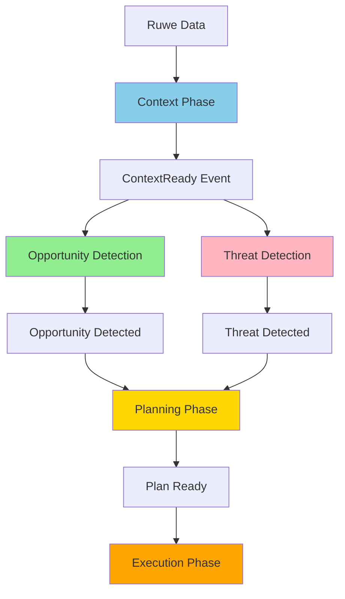
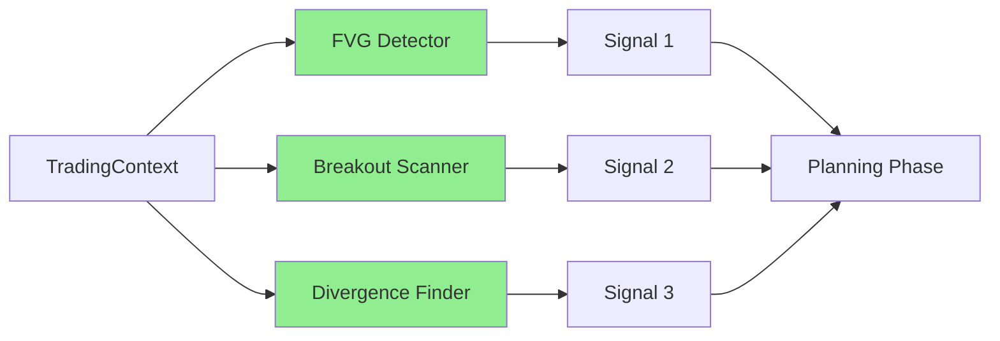
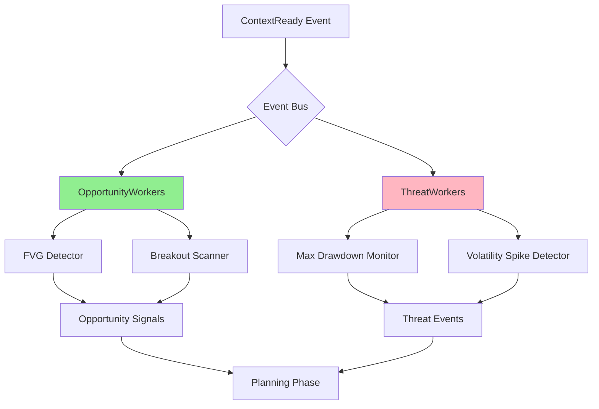
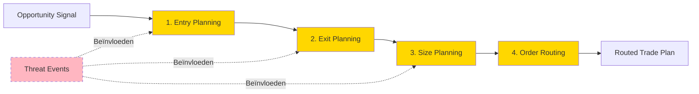
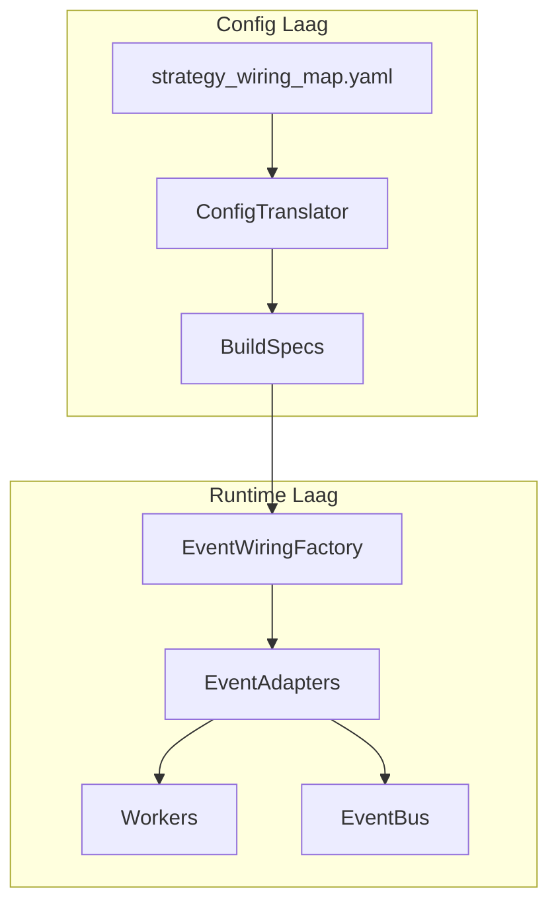
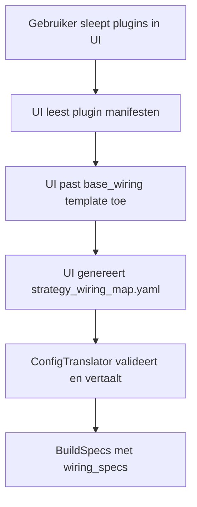
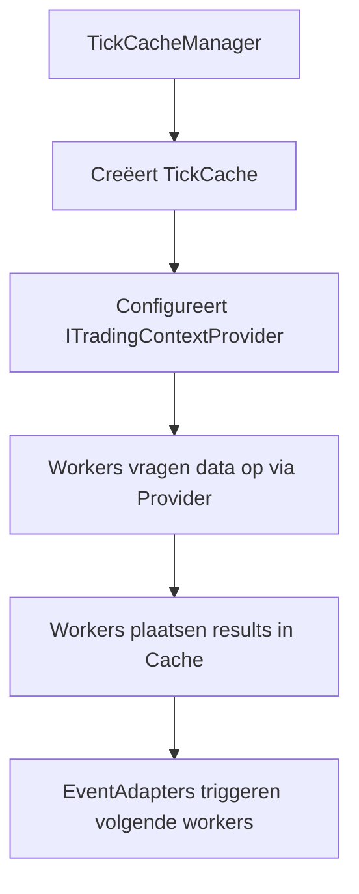
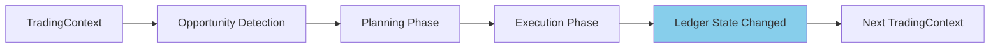

# 05_Workflow_Orkestratie.md

# **S1mpleTrader: Het Worker Ecosysteem: Configureerbare Workflow Orkestratie**

Dit document beschrijft het flexibele, configureerbare workflow orkestratiesysteem van S1mpleTrader, gebaseerd op een platgeslagen, expliciet bedraad netwerk van workers.

## **Inhoudsopgave**

1. [Executive Summary](#executive-summary)
2. [Introductie: De Paradigma Shift](#introductie-de-paradigma-shift)
3. [Fase 1: Context Phase - "De Cartograaf"](#fase-1-context-phase---de-cartograaf)
4. [Fase 2A: Opportunity Detection - "De Verkenner"](#fase-2a-opportunity-detection---de-verkenner)
5. [Fase 2B: Threat Detection - "De Waakhond" (Parallel)](#fase-2b-threat-detection---de-waakhond-parallel)
6. [Fase 3: Planning Phase - "De Strateeg"](#fase-3-planning-phase---de-strateeg)
7. [Fase 4: Execution Phase - "De Uitvoerder"](#fase-4-execution-phase---de-uitvoerder)
8. [Platgeslagen Workflow Model](#platgeslagen-workflow-model)
9. [Event-Driven Workflow: Drie Abstractieniveaus](#event-driven-workflow-drie-abstractieniveaus)
10. [Point-in-Time Data Flow](#point-in-time-data-flow)
11. [Worker Orkestratie via Bedrading](#worker-orkestratie-via-bedrading)
12. [Feedback Loops & Causale Traceerbaarheid](#feedback-loops--causale-traceerbaarheid)
13. [Samenvatting: De Paradigma Shift](#samenvatting-de-paradigma-shift)

---

## **Executive Summary**

Dit document beschrijft het flexibele, configureerbare workflow orkestratiesysteem van S1mpleTrader. De vier kernprincipes zijn:

### **1. Platgeslagen, Expliciet Bedraad Netwerk**

Het systeem biedt een 5-fase parallel systeem waar Opportunities en Threats simultaan worden gedetecteerd, gestuurd door expliciete wiring_specs in plaats van een Operator-laag.

### **2. Configureerbare Orkestratie**

Workers worden aangeroepen volgens hun geconfigureerde wiring, de plaatsing in de flow bepaald de executie volgorde en parallelle- of sequentiële uitvoering.

### **3. Drie Abstractieniveaus voor Event Workflows**

- **Niveau 1 (Impliciet)**: Definieer alleen workers, systeem genereert events automatisch
- **Niveau 2 (Predefined)**: Gebruik standaard triggers zoals `on_context_ready`, `on_ledger_update`
- **Niveau 3 (Custom)**: Volledige controle met custom events en routing

### **4. Point-in-Time Data Model**

- DTO-centric data-uitwisseling tussen workers
- TickCache voor synchrone data doorgifte
- ITradingContextProvider voor data toegang

### **5. Causale Traceerbaarheid**

- Elke actie is traceerbaar naar zijn oorzaak via een rijk framework van causale IDs
- Volledige "waarom"-analyse van elke beslissing

---

## **Introductie: De Paradigma Shift**

### **Van Lineaire Pijplijn naar Platgeslagen Ecosysteem**

**Huidige Architectuur:** Een flexibel, event-driven ecosysteem met configureerbare orkestratie en intelligente parallelle verwerking:



### **De Vier Kerncriteria**

Dit document beschrijft de volledige workflow van data tot handelsactie, gebaseerd op vier fundamentele principes:

1. **Platgeslagen Orkestratie** - Geen Operator-laag meer; directe worker-naar-worker communicatie via expliciete wiring_specs
2. **Point-in-Time Data Model** - DTO-centric data-uitwisseling met TickCache
3. **Opt-in Complexiteit** - Drie abstractieniveaus (Impliciet → Predefined → Custom)
4. **Causale Traceerbaarheid** - Volledige "waarom"-analyse via causale IDs

### **De 5 Worker Categorieën**

De workflow is opgedeeld in vijf conceptueel verschillende fases:

| Fase | Worker Type | Rol | Output |
|------|-------------|-----|--------|
| **1. Context** | ContextWorker | "De Cartograaf" - verrijkt data | Verrijkte TradingContext |
| **2. Opportunity** | OpportunityWorker | "De Verkenner" - detecteert kansen | Signal DTOs |
| **3. Threat** | ThreatWorker | "De Waakhond" - detecteert risico's | CriticalEvent DTOs |
| **4. Planning** | PlanningWorker | "De Strateeg" - maakt plannen | RoutedTradePlan DTO |
| **5. Execution** | ExecutionWorker | "De Uitvoerder" - voert uit | Directe acties |

---

## **Fase 1: Context Phase - "De Cartograaf"**

### **Verantwoordelijkheid**

De Context Phase verrijkt ruwe marktdata met objectieve, beschrijvende informatie. Het creëert een "kaart" van de markt zonder te filteren of te oordelen.

**Kernprincipe:** Objectief en beschrijvend - "Dit is wat er is"

### **Worker Types**

ContextWorker plugins zijn georganiseerd in 7 sub-types:

1. **Regime Classification** - Markt regime & conditie classificatie
2. **Structural Analysis** - Technische structuren (swings, zones)
3. **Indicator Calculation** - Technische indicatoren
4. **Microstructure Analysis** - Orderbook & liquiditeit
5. **Temporal Context** - Sessies, tijd patronen
6. **Sentiment Enrichment** - Nieuws, social media
7. **Fundamental Enrichment** - On-chain, economische data

### **Praktijkvoorbeeld**

**Use Case:** ICT/SMC Strategie

```yaml
workforce:
  context_workers:
    # Structurele analyse
    - plugin: "market_structure_detector"
      subtype: "structural_analysis"
      params:
        detect_bos: true
        detect_choch: true
    
    # Indicatoren
    - plugin: "ema_detector"
      subtype: "indicator_calculation"
      params:
        periods: [20, 50, 200]
    
    # Regime classificatie
    - plugin: "adx_regime_classifier"
      subtype: "regime_classification"
      params:
        adx_threshold: 25
```

**Input:** Ruwe OHLCV DataFrame

**Proces:** Elke worker voegt kolommen toe aan de DataFrame:
- `market_structure_detector` → `trend_direction`, `is_bos`, `is_choch`
- `ema_detector` → `ema_20`, `ema_50`, `ema_200`
- `adx_regime_classifier` → `regime` ('trending' of 'ranging')

**Output:** Verrijkte TradingContext met alle kolommen

---

## **Fase 2A: Opportunity Detection - "De Verkenner"**

### **Verantwoordelijkheid**

De Opportunity Detection Phase herkent handelskansen op basis van patronen, theorieën en strategieën. Het genereert "handelsideeën" zonder concrete plannen te maken.

**Kernprincipe:** Probabilistisch en creatief - "Ik zie een mogelijkheid"

### **Worker Types**

OpportunityWorker plugins zijn georganiseerd in 7 sub-types:

1. **Technical Pattern** - Patroonherkenning (FVG, breakouts)
2. **Momentum Signal** - Trend following signalen
3. **Mean Reversion** - Oversold/overbought detectie
4. **Statistical Arbitrage** - Arbitrage opportuniteiten
5. **Event Driven** - Nieuws-gebaseerde signalen
6. **Sentiment Signal** - Sentiment extremen
7. **ML Prediction** - Machine learning voorspellingen

### **Parallelle Verwerking**

Opportunity workers worden standaard parallel uitgevoerd. Alle opportunity workers ontvangen dezelfde TradingContext en genereren hun signalen onafhankelijk.



### **Praktijkvoorbeeld**

**Use Case:** ICT FVG Entry Detection

```yaml
opportunity_workers:
  - plugin: "fvg_entry_detector"
    subtype: "technical_pattern"
    params:
      min_gap_size: 5
      require_structure_break: true
  
  - plugin: "volume_spike_refiner"
    subtype: "technical_pattern"
    params:
      min_volume_percentile: 80
```

**Input:** Verrijkte TradingContext (met `is_bos`, `trend_direction`, etc.)

**Proces:**
1. `fvg_entry_detector` scant voor Fair Value Gaps na een structure break
2. `volume_spike_refiner` valideert volume op het signaal moment

**Output:** Signal DTOs met unieke `opportunity_id`:

```python
Signal(
    opportunity_id=uuid4(),  # Causale ID
    timestamp="2025-10-14T10:00:00Z",
    asset="BTC/EUR",
    direction="long",
    signal_type="fvg_entry",
    metadata={"gap_size": 8.5, "volume_percentile": 85}
)
```

---

## **Fase 2B: Threat Detection - "De Waakhond" (Parallel)**

### **Verantwoordelijkheid**

De Threat Detection Phase draait parallel aan Opportunity Detection en monitort risico's, bedreigingen en afwijkingen. Het publiceert waarschuwende events maar handelt **nooit zelf**.

**Kernprincipe:** Defensief en informatief - "Let op, hier is een risico"

### **Worker Types**

ThreatWorker plugins zijn georganiseerd in 5 sub-types:

1. **Portfolio Risk** - Drawdown, exposure, correlatie
2. **Market Risk** - Volatiliteit, liquiditeit
3. **System Health** - Connectie, data kwaliteit
4. **Strategy Performance** - Underperformance, drift
5. **External Event** - Breaking news, regulatie

### **Parallelle Verwerking met Opportunities**



### **Praktijkvoorbeeld**

**Use Case:** Risk Management voor Trading Strategie

```yaml
threat_workers:
  - plugin: "max_drawdown_monitor"
    subtype: "portfolio_risk"
    triggers:
      - "on_ledger_update"
    params:
      max_daily_drawdown: 2.0
      max_total_drawdown: 10.0
  
  - plugin: "volatility_spike_detector"
    subtype: "market_risk"
    triggers:
      - "on_context_ready"
    params:
      volatility_threshold_percentile: 95
```

**Input:**
- StrategyLedger (voor portfolio risk)
- Verrijkte TradingContext (voor market risk)

**Output:** CriticalEvent DTOs met unieke `threat_id`:

```python
CriticalEvent(
    threat_id=uuid4(),  # Causale ID
    timestamp="2025-10-14T10:00:00Z",
    event_type="MAX_DRAWDOWN_BREACHED",
    severity="HIGH",
    metadata={
        "current_drawdown": 2.5,
        "max_allowed": 2.0,
        "recommendation": "HALT_NEW_TRADES"
    }
)
```

---

## **Fase 3: Planning Phase - "De Strateeg"**

### **Verantwoordelijkheid**

De Planning Phase transformeert opportunities naar concrete, uitvoerbare plannen. Het luistert naar **beide** Opportunity signals én Threat events om intelligente beslissingen te maken.

**Kernprincipe:** Deterministisch en tactisch - "Gegeven deze kans en deze risico's, dit is het plan"

### **De Vier Planning Sub-Fases**

PlanningWorker plugins zijn georganiseerd in 4 sequentiële sub-fasen:



### **Planning Sub-Fases Gedetailleerd**

#### **Entry Planning**

**Doel:** Bepaal de precieze entry prijs en methode.

**Voorbeelden:**
- `limit_entry_at_fvg` - Limit order op FVG midpoint
- `market_entry_immediate` - Direct market order
- `twap_entry` - Verdeeld over tijd

**Input:** Signal
**Output:** EntrySignal (Signal + entry_price)

#### **Exit Planning**

**Doel:** Bepaal stop-loss en take-profit niveaus.

**Voorbeelden:**
- `liquidity_target_exit` - Stops bij liquidity zones
- `atr_based_stops` - Stops op basis van ATR
- `fixed_rr_exit` - Fixed Risk:Reward ratio

**Input:** EntrySignal
**Output:** RiskDefinedSignal (EntrySignal + sl_price + tp_price)

#### **Size Planning**

**Doel:** Bepaal positiegrootte op basis van risico en kapitaal.

**Threats Invloed:** Als `MAX_DRAWDOWN_BREACHED` gedetecteerd → reduce size of skip

**Voorbeelden:**
- `fixed_risk_sizer` - Fixed % risico per trade
- `kelly_criterion_sizer` - Kelly criterion sizing
- `adaptive_sizer` - Past aan op basis van threat events

**Input:** RiskDefinedSignal + Threat events
**Output:** TradePlan (RiskDefinedSignal + position_size)

#### **Order Routing**

**Doel:** Vertaal het strategische plan naar tactische executie-instructies.

**Voorbeelden:**
- `limit_order_router` - Limit orders
- `iceberg_router` - Verberg grote orders
- `smart_router` - Intelligent order routing

**Input:** TradePlan
**Output:** RoutedTradePlan (TradePlan + order_type + routing params)

### **Praktijkvoorbeeld**

```yaml
planning_workers:
  entry_planning:
    - plugin: "limit_entry_at_fvg"
      params:
        entry_at_midpoint: true
  
  exit_planning:
    - plugin: "liquidity_target_exit"
      params:
        stop_below_order_block: true
        target_opposite_liquidity: true
  
  size_planning:
    - plugin: "adaptive_risk_sizer"
      params:
        base_risk_percent: 1.0
        reduce_on_high_threat: true  # Reageert op Threat events!
  
  order_routing:
    - plugin: "limit_order_router"
```

**DTO Evolutie:**

```
Signal (opportunity_id)
  ↓
EntrySignal (opportunity_id, entry_price: 50000.00)
  ↓
RiskDefinedSignal (opportunity_id, entry: 50000, sl: 49500, tp: 51000)
  ↓
TradePlan (opportunity_id, ..., position_size: 0.02 BTC)
  ↓
RoutedTradePlan (opportunity_id, ..., order_type: "limit", tif: "GTC")
```

**Causale Traceerbaarheid:** Alle DTOs behouden de originele `opportunity_id` voor volledige traceerbaarheid.

---

## **Fase 4: Execution Phase - "De Uitvoerder"**

### **Verantwoordelijkheid**

De Execution Phase voert plannen uit en beheert actieve posities dynamisch. Het reageert op triggers (tijd, events, markt).

**Kernprincipe:** Actief en deterministisch - "Ik voer uit en beheer"

### **Worker Types**

ExecutionWorker plugins zijn georganiseerd in 4 sub-types:

1. **Trade Initiation** - Het initiëren van nieuwe trades
2. **Position Management** - Dynamisch beheer van lopende posities
3. **Risk Safety** - Noodmaatregelen en circuit breakers
4. **Operational** - Geplande, operationele taken (DCA, rebalancing)

### **Praktijkvoorbeeld**

```yaml
execution_workers:
  trade_initiation:
    - plugin: "default_plan_executor"
  
  position_management:
    - plugin: "trailing_stop_manager"
      params:
        trail_after_first_target: true
        trail_by_structure: true
    
    - plugin: "partial_profit_taker"
      params:
        take_50_percent_at_first_target: true
        move_stop_to_breakeven: true
  
  risk_safety:
    - plugin: "emergency_exit_agent"
      triggers:
        - "on_threat_detected"  # Reageert op Threat events!
      params:
        exit_on_severity: ["CRITICAL", "HIGH"]
  
  operational:
    - plugin: "weekly_dca_executor"
      triggers:
        - "on_schedule:weekly_dca"
```

**Threat Integration:** De `emergency_exit_agent` luistert naar `ThreatDetected` events en kan posities forceren te sluiten bij kritieke risico's.

---

## **Platgeslagen Workflow Model**

### **Het Concept**

Het systeem gebruikt een platgeslagen, expliciet bedraad netwerk waarin elke worker een eigen EventAdapter heeft. Er is geen tussenlaag; de orkestratie wordt volledig bepaald door de wiring_specs in de BuildSpecs.

### **De Componenten**



### **Wiring Generatie Proces**



### **base_wiring.yaml Voorbeeld**

```yaml
base_wiring_id: "standard_trading_flow_v1"
wiring_rules:
  - wiring_id: "ctx_to_opp"
    source: 
      component_id: "ContextWorker"
      event_name: "ContextOutput"
    target: 
      component_id: "OpportunityWorker"
      handler_method: "process"
  - wiring_id: "opp_to_plan"
    source: 
      component_id: "OpportunityWorker"
      event_name: "OpportunityOutput"
    target: 
      component_id: "PlanningWorker"
      handler_method: "process"
```

### **Gegenereerde strategy_wiring_map.yaml**

```yaml
wiring_rules:
  - wiring_id: "ema_to_fvg"
    source: 
      component_id: "ema_detector_instance_1"
      event_name: "ema_fast_OUTPUT"
    target: 
      component_id: "fvg_detector_instance_1"
      handler_method: "process"
  - wiring_id: "fvg_to_planner"
    source: 
      component_id: "fvg_detector_instance_1"
      event_name: "fvg_detector_OUTPUT"
    target: 
      component_id: "limit_entry_planner_instance_1"
      handler_method: "process"
```

---

## **Event-Driven Workflow: Drie Abstractieniveaus**

### **Niveau 1: Impliciete Pijplijnen (95% van gebruik)**

**Voor wie:** Standaard quant die een lineaire strategie wil bouwen.

**Hoe het werkt:** De quant definieert workers, het systeem genereert automatisch de event chain.

**Voorbeeld:**

```yaml
workforce:
  context_workers:
    - plugin: "ema_detector"
    - plugin: "market_structure_detector"
  
  opportunity_workers:
    - plugin: "fvg_detector"
  
  planning_workers:
    entry_planning:
      - plugin: "limit_entry_planner"
    exit_planning:
      - plugin: "liquidity_target_exit"
    size_planning:
      - plugin: "fixed_risk_sizer"
    order_routing:
      - plugin: "default_router"
  
  execution_workers:
    trade_initiation:
      - plugin: "default_plan_executor"
```

**Automatisch gegenereerde event flow:**
```
ContextReady → SignalsGenerated → PlansReady → ExecutionApproved
```

### **Niveau 2: Predefined Triggers (Opt-in)**

**Voor wie:** Quant die specifieke workers op specifieke momenten wil activeren.

**Voorbeeld:**

```yaml
workforce:
  threat_workers:
    - plugin: "max_drawdown_monitor"
      triggers:
        - "on_ledger_update"  # Predefined trigger
    
    - plugin: "news_event_monitor"
      triggers:
        - "on_context_ready"
```

**Predefined Triggers:**
- `on_context_ready`: Wanneer context klaar is
- `on_signal_generated`: Wanneer een signaal is gegenereerd
- `on_ledger_update`: Wanneer ledger verandert
- `on_position_opened`: Wanneer een positie wordt geopend
- `on_position_closed`: Wanneer een positie wordt gesloten
- `on_schedule`: Tijd-gebaseerd

### **Niveau 3: Custom Event Chains (Expert Mode)**

**Voor wie:** Geavanceerde quant die complexe, event-driven workflows wil bouwen.

**Voorbeeld: Smart DCA**

```yaml
workforce:
  opportunity_workers:
    - plugin: "dca_opportunity_scorer"
      triggers:
        - "on_schedule:weekly_dca"
      publishes:
        - event: "dca_opportunity_scored"
          payload_type: "Signal"
  
  threat_workers:
    - plugin: "dca_risk_assessor"
      triggers:
        - "on_schedule:weekly_dca"
      publishes:
        - event: "dca_risk_assessed"
          payload_type: "CriticalEvent"
  
  planning_workers:
    entry_planning:
      - plugin: "adaptive_dca_planner"
        triggers:
          - "dca_opportunity_scored"
          - "dca_risk_assessed"
        requires_all: true
        publishes:
          - event: "dca_plan_ready"
            payload_type: "TradePlan"
```

**Event Flow:**
```
Scheduler → WEEKLY_DCA_TICK
         ↓
    ┌────┴────┐
    ▼         ▼
Opportunity  Threat
  Scorer    Assessor
    │         │
    ▼         ▼
dca_opportunity_scored  dca_risk_assessed
         │         │
         └────┬────┘
              ▼
      Adaptive DCA Planner
              ▼
        dca_plan_ready
```

---

## **Point-in-Time Data Flow**

Het systeem gebruikt een Point-in-Time, DTO-gedreven model voor data-uitwisseling tussen workers.

### **TickCache en ITradingContextProvider**



### **Data Toegang Patronen**

```python
class MyWorker(BaseWorker):
    def process(self, context: TradingContext) -> DispositionEnvelope:
        # Haal basis context op
        base_context = self.context_provider.get_base_context()
        
        # Haal benodigde DTOs op
        required_dtos = self.context_provider.get_required_dtos(self)
        
        # Haal platform data op
        ohlcv_data = self.ohlcv_provider.get_window(base_context.timestamp)
        
        # Business logica
        result = self._calculate_result(required_dtos, ohlcv_data)
        
        # Plaats result voor volgende workers
        self.context_provider.set_result_dto(self, result)
        
        return DispositionEnvelope(disposition="CONTINUE")
```

### **DTO-Centric Contracten**

Alle data-uitwisseling gebeurt via specifieke Pydantic DTOs:

```python
# Plugin-specifieke DTOs voor Cache
class EMAOutputDTO(BaseModel):
    ema_20: float
    ema_50: float
    timestamp: datetime

# Standaard DTOs voor EventBus
class OpportunitySignal(BaseModel):
    opportunity_id: UUID
    timestamp: datetime
    signal_type: str
    confidence: float
```

---

## **Worker Orkestratie via Bedrading**

### **Directe Worker Communicatie**

In het platgeslagen model communiceren workers direct met elkaar via expliciete bedrading, zonder tussenkomst van een tussenlaag.

### **Bedrading Types**

1. **Systeem Events** - Voor standaard flow tussen worker categorieën
2. **Custom Events** - Voor complexe, strategie-specifieke interacties
3. **Interne Events** - Voor flow control binnen een strategie

### **Voorbeeld Bedrading**

```yaml
wiring_rules:
  - wiring_id: "context_to_opportunity"
    source:
      component_id: "ema_detector_instance_1"
      event_name: "ema_detector_OUTPUT"
    target:
      component_id: "fvg_detector_instance_1"
      handler_method: "process"
  
  - wiring_id: "opportunity_to_planning"
    source:
      component_id: "fvg_detector_instance_1"
      event_name: "fvg_detector_OUTPUT"
    target:
      component_id: "limit_entry_planner_instance_1"
      handler_method: "process"
```

### **Flow Control**

Workers controleren de flow via DispositionEnvelope:

- **CONTINUE** - Ga door naar volgende worker
- **PUBLISH** - Publiceer event naar EventBus
- **STOP** - Stop deze flow tak

---

## **Feedback Loops & Causale Traceerbaarheid**

### **De Technische Feedback Loop (Real-time)**

Deze loop gebeurt binnen een Operation, via de EventBus:



**Mechanisme:**
1. ExecutionEnvironment publiceert `LedgerStateChanged` event na elke trade
2. Deze event wordt opgenomen in de volgende TradingContext
3. Workers hebben altijd de meest actuele financiële staat beschikbaar

### **De Strategische Feedback Loop (Human-in-the-loop)**

Deze loop vindt plaats tussen Operations:

```
Operation 1 → Resultaten → Analyse → Blueprint Aanpassing → Operation 2
```

De quant analyseert StrategyJournal data en past de strategy_blueprint.yaml aan.

### **Causale Traceerbaarheid Framework**

**ID Types:**

| ID Type | Gegenereerd Door | Doel |
|---------|------------------|------|
| **OpportunityID** | OpportunityWorker | "Waarom is deze trade geopend?" |
| **ThreatID** | ThreatWorker | "Waarom is deze trade aangepast/gesloten?" |
| **TradeID** | PlanningWorker of ExecutionWorker | Primaire sleutel in journal |
| **ScheduledID** | Scheduler | "Waarom is deze actie nu uitgevoerd?" |

**Voorbeeld Journal Entry:**

```json
{
  "timestamp": "2025-10-14T10:05:00Z",
  "event_type": "TRADE_OPENED",
  "trade_id": "uuid-789",
  "opportunity_id": "uuid-456",  // Causale link!
  "details": {
    "strategy": "ICT_FVG_Liquidity_Sweep",
    "opportunity_type": "fvg_entry",
    "entry_price": 50000.00,
    "position_size": 0.02
  }
}
```

**Voorbeeld Rejection Entry:**

```json
{
  "timestamp": "2025-10-14T10:00:05Z",
  "event_type": "OPPORTUNITY_REJECTED",
  "opportunity_id": "uuid-123",
  "rejection_reason": {
    "threat_id": "uuid-789",  // Causale link!
    "threat_type": "MAX_DRAWDOWN_BREACHED",
    "details": {
      "current_drawdown": 2.5,
      "max_allowed": 2.0
    }
  }
}
```

**Analyse Mogelijkheden:**
- "Welke opportunities werden het vaakst afgekeurd en waarom?"
- "Welke threat types hadden de meeste impact op performance?"
- "Wat was de gemiddelde tijd tussen opportunity detection en execution?"

---

## **Samenvatting: De Paradigma Shift**

### **Architectuur Kenmerken**

| Aspect | Huidige Implementatie |
|--------|----------------------|
| **Structuur** | Platgeslagen 5-categorie ecosysteem |
| **Verwerking** | Configureerbaar (SEQUENTIAL/PARALLEL/EVENT_DRIVEN) |
| **Opportunity/Threat** | Parallel detectie |
| **Data Flow** | Point-in-Time DTO model |
| **Orkestratie** | Expliciete wiring_specs |
| **Event Model** | Drie abstractieniveaus |
| **Traceability** | Rijk causaal ID framework |
| **Flexibiliteit** | Opt-in complexiteit |

### **Kernvoordelen**

1. **Conceptuele Zuiverheid** - Elke worker categorie heeft één duidelijke verantwoordelijkheid
2. **Configureerbare Kracht** - Gedrag aanpasbaar via YAML zonder code-wijzigingen
3. **Parallelle Efficiëntie** - Opportunities en Threats worden simultaan gedetecteerd
4. **Intelligente Compositie** - Complexiteit komt van configuratie, niet van plugin code
5. **Causale Transparantie** - Elke actie is traceerbaar naar zijn oorzaak
6. **Progressieve Complexiteit** - Van simpel naar complex zonder refactoring
7. **Methodologie Agnostisch** - Ondersteunt ICT, Wyckoff, ML, DCA, en meer

### **Configuratie Format**

Het systeem ondersteunt verschillende configuratie formaten voor maximale flexibiliteit:

```yaml
# Huidig aanbevolen format
workforce:
  opportunity_workers:
    - plugin: "fvg_detector"
      subtype: "technical_pattern"
```

---

## **Volgende Stappen**

**Voor Strategie Ontwikkelaars:**
1. Begin met **Niveau 1** (Impliciete Pijplijnen) voor eenvoudige strategieën
2. Upgrade naar **Niveau 2** (Predefined Triggers) voor threat monitoring
3. Gebruik **Niveau 3** (Custom Events) voor complexe workflows zoals Smart DCA

**Voor Plugin Ontwikkelaars:**
1. Lees de volledige worker taxonomie voor sub-types
2. Gebruik de juiste base class (BaseWorker, BaseEventAwareWorker)
3. Definieer het juiste `type` en `subtype` in je manifest

**Voor Architecten:**
1. Begrijp de twee niveaus van orkestratie (Wiring Config vs Event Mapping)
2. Review event chain validatie logica
3. Begrijp de Point-in-Time data flow

---

**Einde Document**

*"Van lineaire pijplijn naar platgeslagen ecosysteem - waar workers en events harmonieus samenwerken in een expliciet bedraad model."*

---

**Referenties:**
- `1_Bus_communicatie_structuur.md` - Communicatie architectuur
- `2_Architectuur_Componenten.md` - Core architectuur principes
- `3_Configuratie_Trein.md` - Configuratie hiërarchie
- `4_Plugin_Anatomie.md` - Plugin development guide

---

**Einde Document**