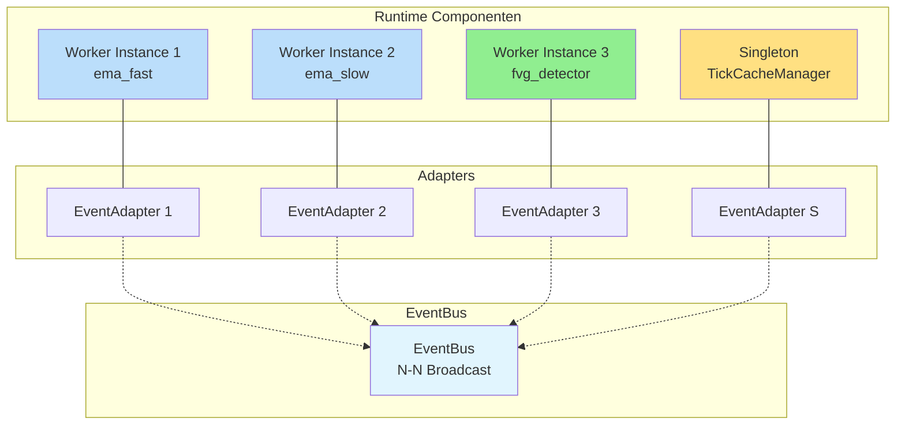
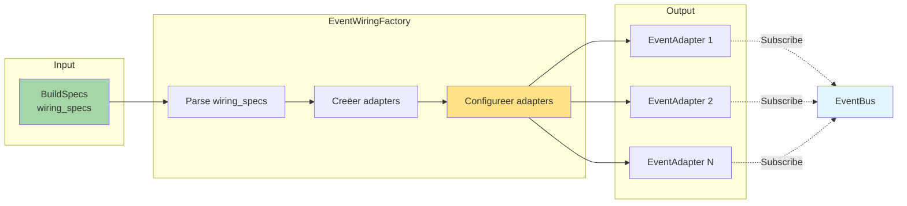
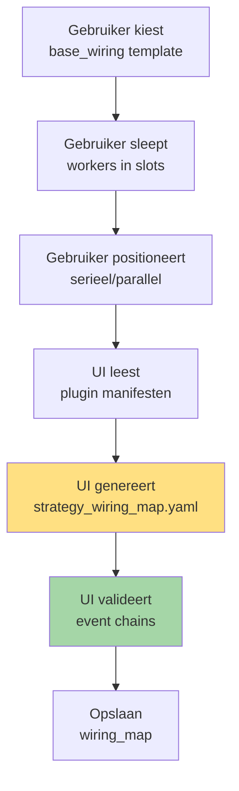
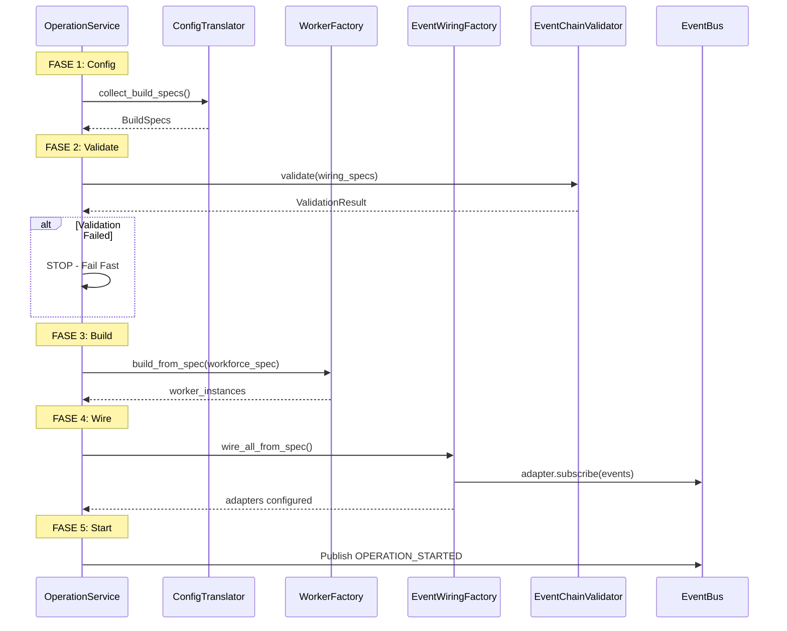

# Hoofdstuk 1: Communicatie Architectuur

**Status:** Definitief  
**Versie:** 4.0

---

## 1.1. Kernprincipe: Platgeslagen Event-Driven Netwerk

De communicatie architectuur van S1mpleTrader is gebaseerd op één fundamenteel principe:

> **Elke component krijgt zijn eigen EventAdapter. Er zijn geen Operators.**



**Kenmerken**:
- ✅ Elke worker instance heeft precies één adapter
- ✅ Elke adapter weet exact wat hij moet doen (via configuratie)
- ✅ EventBus is pure N-N broadcast (geen intelligentie)
- ✅ Bedrading volledig expliciet in strategy_wiring_map.yaml

---

## 1.2. De EventAdapter: Generieke Communicatie Uitvoerder

De [`EventAdapter`](backend/assembly/event_adapter.py) is een generieke component zonder business logica. Zijn gedrag wordt **volledig bepaald door configuratie**.

### Configuratie Structuur

Elke adapter krijgt tijdens bootstrap van de [`EventWiringFactory`](backend/assembly/event_wiring_factory.py) zijn configuratie:

```python
# backend/assembly/event_adapter.py
from typing import Dict, List, Callable, Any
from pydantic import BaseModel

class AdapterConfig(BaseModel):
    """Configuratie voor één EventAdapter."""
    
    # Subscriptions: welke events triggeren deze component?
    subscriptions: List[str]  # event namen
    
    # Handler mapping: event_name -> method_name
    handler_mapping: Dict[str, str]
    
    # Publication config: wat mag deze adapter publiceren?
    system_event_publications: Dict[str, str]  # disposition -> event_name
    allowed_custom_events: List[str]
    flow_stop_event: str

class EventAdapter:
    """Generieke adapter - gedrag via configuratie."""
    
    def __init__(
        self,
        component: Any,  # Worker of Singleton
        config: AdapterConfig,
        event_bus: EventBus,
        context_provider: ITradingContextProvider
    ):
        self._component = component
        self._config = config
        self._event_bus = event_bus
        self._context_provider = context_provider
        
        # Abonneer op geconfigureerde events
        for event_name in config.subscriptions:
            handler = self._create_handler(event_name)
            event_bus.subscribe(event_name, handler)
    
    def _create_handler(self, event_name: str) -> Callable:
        """Creëer handler voor specifiek event."""
        def handler(payload: Any) -> None:
            # Zoek welke methode aangeroepen moet worden
            method_name = self._config.handler_mapping.get(event_name)
            if not method_name:
                return
            
            # Roep component aan
            method = getattr(self._component, method_name)
            result = method(payload) if payload else method()
            
            # Verwerk DispositionEnvelope
            self._process_disposition(result)
        
        return handler
    
    def _process_disposition(self, envelope: DispositionEnvelope) -> None:
        """Verwerk worker output envelope."""
        
        if envelope.disposition == "CONTINUE":
            # Publiceer systeem event voor volgende worker
            system_event = self._config.system_event_publications.get("CONTINUE")
            if system_event:
                # Haal data uit cache voor payload
                payload = self._create_system_payload(system_event)
                self._event_bus.publish(system_event, payload)
        
        elif envelope.disposition == "PUBLISH":
            # Valideer custom event
            if envelope.event_name not in self._config.allowed_custom_events:
                raise PermissionError(
                    f"Component not allowed to publish '{envelope.event_name}'"
                )
            
            # Publiceer custom event
            self._event_bus.publish(
                envelope.event_name,
                envelope.event_payload
            )
        
        elif envelope.disposition == "STOP":
            # Publiceer flow stop event
            self._event_bus.publish(
                self._config.flow_stop_event,
                FlowStopDTO()
            )
```

### Adapter Configuratie Voorbeeld

Voor worker `ema_fast`:

```python
AdapterConfig(
    subscriptions=["TICK_FLOW_START"],
    handler_mapping={
        "TICK_FLOW_START": "process"
    },
    system_event_publications={
        "CONTINUE": "ema_fast_OUTPUT"
    },
    allowed_custom_events=[],  # Geen custom events
    flow_stop_event="ema_fast_STOP"
)
```

Voor event-aware worker `emergency_news_monitor`:

```python
AdapterConfig(
    subscriptions=["NEWS_RECEIVED"],
    handler_mapping={
        "NEWS_RECEIVED": "on_news"
    },
    system_event_publications={},
    allowed_custom_events=["EMERGENCY_HALT_TRADING"],  # Uit manifest
    flow_stop_event="news_monitor_STOP"
)
```

---

## 1.3. EventWiringFactory: De Configurator

De [`EventWiringFactory`](backend/assembly/event_wiring_factory.py) creëert en configureert alle adapters op basis van de wiring_specs uit BuildSpecs.



**Implementatie**:

```python
# backend/assembly/event_wiring_factory.py
class EventWiringFactory:
    """Creëert en configureert EventAdapters uit BuildSpecs."""
    
    def wire_all_from_spec(
        self,
        platform_wiring_spec: List[WiringRule],
        strategy_wiring_spec: List[WiringRule],
        worker_instances: Dict[str, Any],
        singleton_instances: Dict[str, Any]
    ) -> Dict[str, EventAdapter]:
        """
        Hoofdmethode: bedraad alles.
        
        Args:
            platform_wiring_spec: Bedrading voor singletons
            strategy_wiring_spec: Bedrading voor workers
            worker_instances: Map van instance_id -> worker
            singleton_instances: Map van singleton_id -> singleton
        
        Returns:
            Map van component_id -> EventAdapter
        """
        adapters = {}
        
        # Wire platform singletons
        for rule in platform_wiring_spec:
            adapter = self._create_adapter_for_rule(
                rule, 
                singleton_instances
            )
            adapters[rule.target['component_id']] = adapter
        
        # Wire strategy workers
        for rule in strategy_wiring_spec:
            adapter = self._create_adapter_for_rule(
                rule,
                worker_instances
            )
            adapters[rule.target['component_id']] = adapter
        
        return adapters
    
    def _create_adapter_for_rule(
        self,
        rule: WiringRule,
        component_map: Dict[str, Any]
    ) -> EventAdapter:
        """Creëer adapter voor één wiring rule."""
        
        component = component_map[rule.target['component_id']]
        
        # Bouw adapter configuratie
        config = self._build_adapter_config(rule, component)
        
        # Creëer adapter
        return EventAdapter(
            component=component,
            config=config,
            event_bus=self._event_bus,
            context_provider=self._context_provider
        )
    
    def _build_adapter_config(
        self,
        rule: WiringRule,
        component: Any
    ) -> AdapterConfig:
        """Bouw AdapterConfig uit WiringRule."""
        
        # Verzamel alle rules voor dit component
        all_rules = self._find_all_rules_for_component(
            rule.target['component_id']
        )
        
        # Extract subscriptions
        subscriptions = [r.source['event_name'] for r in all_rules]
        
        # Extract handler mapping
        handler_mapping = {
            r.source['event_name']: r.target['handler_method']
            for r in all_rules
        }
        
        # Extract publication config
        system_pubs = self._extract_system_publications(all_rules)
        custom_events = self._extract_custom_events(component)
        
        return AdapterConfig(
            subscriptions=subscriptions,
            handler_mapping=handler_mapping,
            system_event_publications=system_pubs,
            allowed_custom_events=custom_events,
            flow_stop_event=f"{component.instance_id}_STOP"
        )
```

---

## 1.4. De EventBus: Pure N-N Broadcast

De [`EventBus`](backend/core/event_bus.py) is extreem simpel - een pure publish/subscribe bus zonder intelligentie.

```python
# backend/core/event_bus.py
from typing import Dict, List, Callable, Any
from threading import Lock

class EventBus:
    """Pure N-N broadcast bus."""
    
    def __init__(self):
        self._subscriptions: Dict[str, List[Callable]] = {}
        self._lock = Lock()
    
    def subscribe(self, event_name: str, handler: Callable) -> None:
        """Subscribe handler to event."""
        with self._lock:
            if event_name not in self._subscriptions:
                self._subscriptions[event_name] = []
            self._subscriptions[event_name].append(handler)
    
    def publish(self, event_name: str, payload: Any = None) -> None:
        """Publish event to all subscribers."""
        with self._lock:
            subscribers = self._subscriptions.get(event_name, [])
        
        for handler in subscribers:
            try:
                handler(payload)
            except Exception as e:
                # Log maar crash niet
                logger.error(f"Handler error for '{event_name}': {e}")
```

**Geen**:
- ❌ Routing logica
- ❌ Payload transformatie
- ❌ Filtering
- ❌ Prioriteiten

**Wel**:
- ✅ Subscribe
- ✅ Publish
- ✅ Thread-safe

---

## 1.5. Event Types: System vs Custom

De architectuur onderscheidt twee types events:

### System Events (Flow Control)

**Doel**: Interne flow control tussen workers in de standaard pipeline.

**Kenmerken**:
- Unieke namen gegenereerd door UI (bv. `ema_fast_OUTPUT`, `TICK_FLOW_START`)
- Bevatten **altijd** een payload (Systeem DTO of data uit cache)
- Gedefinieerd in strategy_wiring_map.yaml
- Niet zichtbaar voor plugin developer

**Voorbeelden**:
- `TICK_FLOW_START` - Start van nieuwe tick
- `ema_fast_OUTPUT` - Output van ema_fast worker
- `CONTEXT_PHASE_COMPLETE` - Context verrijking klaar

### Custom Events (Plugin-to-Plugin)

**Doel**: Expliciete communicatie tussen event-aware plugins.

**Kenmerken**:
- Namen gedefinieerd in manifest.yaml
- Bevatten meestal **geen** payload (data in Tick Cache)
- Gedeclareerd in manifest.publishes
- Expliciet zichtbaar voor developer

**Voorbeelden**:
- `SIGNAL_GENERATED` - Opportunity gedetecteerd
- `THREAT_DETECTED` - Risico gevonden
- `EMERGENCY_HALT_TRADING` - Noodstop signaal

**Manifest declaratie**:

```yaml
# manifest.yaml van emergency_news_monitor
capabilities:
  events:
    enabled: true
    publishes:
      - event_name: "EMERGENCY_HALT_TRADING"
        description: "Published when high-impact news detected"
    wirings:
      - listens_to: "NEWS_RECEIVED"
        invokes:
          method: "on_news"
```

---

## 1.6. Wiring Maps: Platform vs Strategy

De bedrading wordt gedefinieerd in twee aparte configuraties:

### Platform Wiring Map (Statisch)

**Bestand**: [`platform_wiring_map.yaml`](config/platform_wiring_map.yaml)

**Doel**: Bedraadt operation-brede singleton componenten.

```yaml
# config/platform_wiring_map.yaml
wiring_rules:
  - wiring_id: "raw_tick_to_cache_manager"
    source:
      component_id: "ExecutionEnvironment"
      event_name: "RAW_TICK"
      event_type: "SystemEvent"
    target:
      component_id: "TickCacheManager"
      handler_method: "on_raw_tick"
  
  - wiring_id: "ledger_to_aggregator"
    source:
      component_id: "StrategyLedger"
      event_name: "LEDGER_STATE_CHANGED"
      event_type: "SystemEvent"
    target:
      component_id: "AggregatedLedger"
      handler_method: "on_ledger_update"
```

### Strategy Wiring Map (UI-Gegenereerd)

**Bestand**: [`strategy_wiring_map.yaml`](config/runs/strategy_wiring_map.yaml)

**Doel**: Bedraadt alle workers voor één specifieke strategie.

**Gegenereerd door**: Strategy Builder UI

**Basis**: Template uit [`base_wiring.yaml`](config/base_wiring.yaml) + plugin manifesten + gebruiker keuzes

```yaml
# config/runs/ict_smc_wiring_v1.yaml (gegenereerd)
wiring_rules:
  # Start van flow
  - wiring_id: "flow_start_to_ema_fast"
    source:
      component_id: "TickCacheManager"
      event_name: "TICK_FLOW_START"
      event_type: "SystemEvent"
    target:
      component_id: "ema_fast"
      handler_method: "process"
  
  # Sequentiële keten (UI detecteert dit uit positionering)
  - wiring_id: "ema_fast_to_ema_slow"
    source:
      component_id: "ema_fast"
      event_name: "ema_fast_OUTPUT"
      event_type: "SystemEvent"
    target:
      component_id: "ema_slow"
      handler_method: "process"
  
  # Van context naar opportunity
  - wiring_id: "context_to_fvg"
    source:
      component_id: "ema_slow"
      event_name: "ema_slow_OUTPUT"
      event_type: "SystemEvent"
    target:
      component_id: "fvg_det_1"
      handler_method: "process"
  
  # Custom event (uit manifest van news monitor)
  - wiring_id: "news_to_emergency_exit"
    source:
      component_id: "news_monitor"
      event_name: "EMERGENCY_HALT_TRADING"
      event_type: "CustomEvent"
    target:
      component_id: "emergency_exit_agent"
      handler_method: "on_emergency_halt"
```

---

## 1.7. Strategy Builder UI: Intelligente Wiring Generatie

De UI is de **generator** van de strategy_wiring_map.yaml.

### Workflow in UI



**Intelligente generatie**:

1. **Seriële positionering**: UI genereert chain
   ```
   ema_fast → ema_slow → fvg_detector
   
   Genereert:
   - TICK_FLOW_START → ema_fast
   - ema_fast_OUTPUT → ema_slow
   - ema_slow_OUTPUT → fvg_detector
   ```

2. **Parallelle positionering**: UI genereert fan-out/fan-in
   ```
   TICK_FLOW_START → ema_fast
   TICK_FLOW_START → ema_slow
   (beide outputs → volgende fase)
   ```

3. **Custom events**: UI leest manifest en tekent automatisch verbindingen
   ```
   manifest declares:
   publishes: ["EMERGENCY_HALT"]
   
   UI finds listeners:
   emergency_exit_agent listens to "EMERGENCY_HALT"
   
   UI genereert:
   - EMERGENCY_HALT → emergency_exit_agent
   ```

---

## 1.8. Event Chain Validation

De [`EventChainValidator`](backend/assembly/event_chain_validator.py) analyseert de complete event topologie **voor** runtime start.

### Validatie Checks

```python
# backend/assembly/event_chain_validator.py
class EventChainValidator:
    """Valideert event chain integriteit."""
    
    def validate(self, wiring_specs: List[WiringRule]) -> ValidationResult:
        """
        Complete event chain validatie.
        
        Checks:
        1. Alle events hebben publishers
        2. Geen circular dependencies
        3. Orphaned events (warning)
        4. Type consistency
        """
        result = ValidationResult()
        
        # Bouw event graph
        graph = self._build_event_graph(wiring_specs)
        
        # Check 1: Publishers
        for event in graph.get_all_events():
            if graph.has_subscribers(event) and not graph.has_publishers(event):
                result.add_error(
                    f"Event '{event}' has subscribers but no publishers!"
                )
        
        # Check 2: Circular dependencies (DFS)
        cycles = self._detect_cycles(graph)
        for cycle in cycles:
            result.add_error(f"Circular dependency: {' → '.join(cycle)}")
        
        # Check 3: Orphaned events
        for event in graph.get_all_events():
            if graph.has_publishers(event) and not graph.has_subscribers(event):
                result.add_warning(
                    f"Event '{event}' published but no subscribers"
                )
        
        return result
```

**Voorbeeld validatie output**:

```
✓ Check 1: All events have publishers (12 events checked)
✓ Check 2: No circular dependencies detected
⚠ Check 3: Event 'debug_trace' has no subscribers (is this intentional?)
✓ Check 4: Payload types consistent

SUCCESS: Event chain valid with 0 errors, 1 warning
```

---

## 1.9. Bootstrap Sequence

De complete startup volgorde:



---

## 1.10. Voordelen van dit Model

### Versus Operator Model

| Aspect | Oude Model (Operators) | Nieuwe Model (Platgeslagen) |
|--------|----------------------|---------------------------|
| **Complexiteit** | Operator laag + Adapters | Alleen Adapters |
| **Configuratie** | operators.yaml + wiring_map | strategy_wiring_map (UI) |
| **Transparantie** | Impliciet via operator strategie | Expliciet in wiring_map |
| **Flexibiliteit** | Beperkt door operator categories | Volledig vrij |
| **Testbaarheid** | Mock operator + workers | Mock adapter config |

### Kernvoordelen

✅ **Maximale SRP**: Elke component doet precies één ding
✅ **Expliciete Flow**: Exact zichtbaar in configuratie
✅ **UI-Driven**: Strategy Builder genereert bedrading
✅ **Valideerbaar**: Complete event chain analyse voor runtime
✅ **Flexibel**: Ondersteunt complexe workflows zonder code wijzigingen

---

**Einde Hoofdstuk 1**

Dit hoofdstuk beschrijft de fundamentele communicatie architectuur zonder Operators. Alle orkestratie gebeurt via expliciet bedrade EventAdapters, volledig gestuurd door de UI-gegenereerde strategy_wiring_map.yaml.