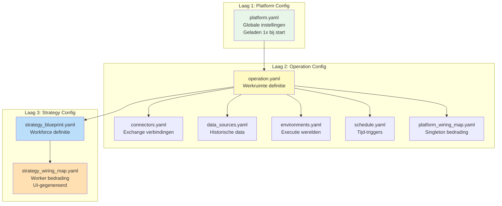
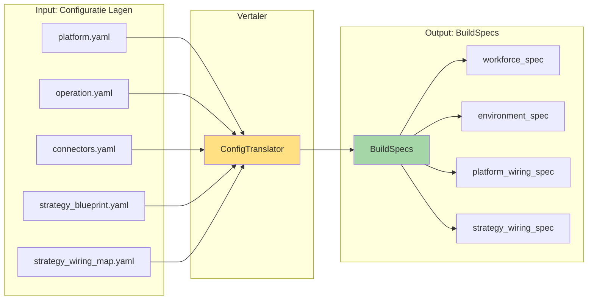
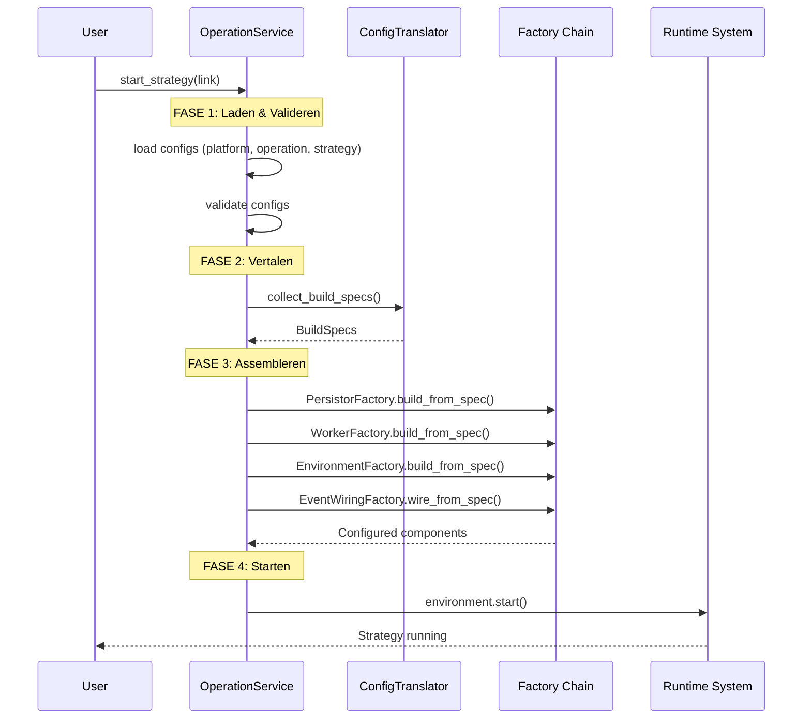

# Hoofdstuk 2: De Drie Configuratielagen & BuildSpecs

**Status:** Definitief  
**Versie:** 4.0

---

## 2.1. De Gelaagde Configuratie Structuur

S1mpleTrader gebruikt een strikte hiërarchie van drie configuratielagen, elk met een duidelijke verantwoordelijkheid.



### Laag 1: PlatformConfig

**Doel**: Globale, run-onafhankelijke platform instellingen.

**Bestand**: [`platform.yaml`](config/platform.yaml)

**Inhoud**:
- Logging profielen en taalinstellingen
- Basis paden (plugins_root_path)
- Archivering formaat
- Globale platform settings

**Levenscyclus**: Geladen **eenmaal** bij start van OperationService.

```yaml
# config/platform.yaml
language: "nl"
logging:
  profile: "analysis"
  profiles:
    developer: [INFO, WARNING, ERROR]
    analysis: [DEBUG, INFO, TRADE, ERROR]
plugins_root_path: "plugins"
archiving:
  format: "parquet"
```

### Laag 2: OperationConfig

**Doel**: Definieert de operationele werkruimte - alle technische middelen en de te draaien strategieën.

**Hoofdbestand**: [`operation.yaml`](config/operation.yaml)

**Gerelateerde bestanden**:
- [`connectors.yaml`](config/connectors.yaml) - Live exchange verbindingen
- [`data_sources.yaml`](config/data_sources.yaml) - Lokale historische datasets
- [`environments.yaml`](config/environments.yaml) - Executie omgevingen (backtest/paper/live)
- [`schedule.yaml`](config/schedule.yaml) - Tijd-gebaseerde triggers
- [`platform_wiring_map.yaml`](config/platform_wiring_map.yaml) - Bedrading voor operation-brede singletons

**Voorbeeld operation.yaml**:

```yaml
# config/operation.yaml
display_name: "BTC Trading Operation"
description: "Multi-strategy BTC operation"

strategy_links:
  - strategy_link_id: "live_btc_ict"
    is_active: true
    execution_environment_id: "live_kraken_main"
    strategy_config:
      blueprint_id: "ict_smc_strategy"
      wiring_map_id: "ict_smc_wiring_v1"
```

### Laag 3: StrategyConfig

**Doel**: Volledige definitie van één specifieke strategie-instantie.

**Bestanden**:
- [`strategy_blueprint.yaml`](config/runs/strategy_blueprint.yaml) - Workforce (welke plugins, met welke params)
- [`strategy_wiring_map.yaml`](config/runs/strategy_wiring_map.yaml) - Worker bedrading (**UI-gegenereerd**)

**Voorbeeld strategy_blueprint.yaml**:

```yaml
# config/runs/ict_smc_strategy.yaml
display_name: "ICT/SMC Strategy"
version: "1.0.0"

workforce:
  context_workers:
    - instance_id: "ema_fast"
      plugin: "ema_detector"
      params:
        period: 20
    
    - instance_id: "ema_slow"
      plugin: "ema_detector"
      params:
        period: 50
  
  opportunity_workers:
    - instance_id: "fvg_det_1"
      plugin: "fvg_detector"
      params:
        min_gap_size: 5
```

**Voorbeeld strategy_wiring_map.yaml** (gegenereerd door UI):

```yaml
# config/runs/ict_smc_wiring_v1.yaml
# Gegenereerd door Strategy Builder UI
wiring_rules:
  # Systeem event: Start context phase
  - wiring_id: "start_to_ema_fast"
    source:
      component_id: "ExecutionEnvironment"
      event_name: "TICK_FLOW_START"
      event_type: "SystemEvent"
    target:
      component_id: "ema_fast"
      handler_method: "process"
  
  # Systeem event: Chain ema_fast → ema_slow
  - wiring_id: "ema_fast_to_slow"
    source:
      component_id: "ema_fast"
      event_name: "ema_fast_OUTPUT"
      event_type: "SystemEvent"
    target:
      component_id: "ema_slow"
      handler_method: "process"
  
  # Systeem event: ema_slow → fvg_detector
  - wiring_id: "context_to_opportunity"
    source:
      component_id: "ema_slow"
      event_name: "ema_slow_OUTPUT"
      event_type: "SystemEvent"
    target:
      component_id: "fvg_det_1"
      handler_method: "process"
```

---

## 2.2. De ConfigTranslator: Van YAML naar BuildSpecs

De [`ConfigTranslator`](backend/config/translator.py) is het brein dat alle configuratielagen leest en vertaalt naar één geünificeerd [`BuildSpecs`](backend/assembly/build_specs.py) object.



### BuildSpecs Structuur

```python
# backend/assembly/build_specs.py
from pydantic import BaseModel
from typing import List, Dict, Any

class WorkerSpec(BaseModel):
    """Specificatie voor één worker instance."""
    instance_id: str
    plugin_name: str
    params: Dict[str, Any]
    requires_capabilities: List[str]  # bv. ["state_persistence", "ohlcv_window"]

class WiringRule(BaseModel):
    """Eén bedrading tussen componenten."""
    wiring_id: str
    source: Dict[str, str]  # component_id, event_name, event_type
    target: Dict[str, str]  # component_id, handler_method
    condition: Dict[str, Any] = {}

class BuildSpecs(BaseModel):
    """Complete machine-leesbare specificatie voor bootstrap."""
    
    # Platform niveau
    platform_wiring_spec: List[WiringRule]
    
    # Strategy niveau
    workforce_spec: List[WorkerSpec]
    strategy_wiring_spec: List[WiringRule]
    
    # Environment
    environment_spec: Dict[str, Any]
    
    # Persistentie
    persistor_spec: Dict[str, Any]
```

### ConfigTranslator Workflow

```python
# backend/config/translator.py
class ConfigTranslator:
    """Vertaalt YAML configuratie naar BuildSpecs."""
    
    def collect_build_specs(
        self,
        strategy_config: StrategyConfig,
        platform_config: PlatformConfig,
        operation_config: OperationConfig
    ) -> BuildSpecs:
        """
        Hoofdmethode: vertaalt alle config naar BuildSpecs.
        
        Args:
            strategy_config: Strategy blueprint + wiring map
            platform_config: Platform instellingen
            operation_config: Operation resources
        
        Returns:
            Complete BuildSpecs klaar voor factories
        """
        return BuildSpecs(
            platform_wiring_spec=self._translate_platform_wiring(operation_config),
            workforce_spec=self._translate_workforce(strategy_config),
            strategy_wiring_spec=self._translate_strategy_wiring(strategy_config),
            environment_spec=self._translate_environment(strategy_config, operation_config),
            persistor_spec=self._translate_persistors(strategy_config)
        )
```

---

## 2.3. OperationService als Levenscyclus Manager

De [`OperationService`](services/operation_service.py) is de dirigent die de hele bootstrap orkestreert via een strikte "factory chain".



### Kernmethoden

```python
# services/operation_service.py
class OperationService:
    """Pure levenscyclus manager voor strategieën."""
    
    def start_strategy(self, strategy_link) -> str:
        """
        Universele start-procedure voor één strategie.
        
        Returns:
            strategy_instance_id
        """
        # 1. Laden & Valideren
        strategy_config = self._config_loader.load_strategy_config(
            strategy_link.blueprint_id
        )
        self._config_validator.validate_strategy_config(
            strategy_config, 
            self._operation_config
        )
        
        # 2. Vertalen
        build_specs = self._config_translator.collect_build_specs(
            strategy_config,
            self._platform_config,
            self._operation_config
        )
        
        # 3. Assembleren (Factory Chain)
        persistor_map = self._persistor_factory.build_from_spec(
            build_specs.persistor_spec
        )
        worker_instances = self._worker_factory.build_from_spec(
            build_specs.workforce_spec,
            persistor_map
        )
        environment = self._environment_factory.build_from_spec(
            build_specs.environment_spec
        )
        
        # 4. Bedraad het systeem
        self._event_wiring_factory.wire_all_from_spec(
            build_specs.platform_wiring_spec,
            build_specs.strategy_wiring_spec,
            worker_instances
        )
        
        # 5. Start
        environment.start()
        
        # 6. Registreer
        instance_id = self._register_active_strategy(...)
        return instance_id
    
    def stop_strategy(self, instance_id: str) -> None:
        """Stop één strategie."""
        pass
    
    def restart_strategy(self, instance_id: str) -> None:
        """Herstart één strategie."""
        self.stop_strategy(instance_id)
        self.start_strategy(original_link)
```

---

## 2.4. Validatie: Fail Fast

Alle validatie gebeurt **voor** de factories worden aangeroepen:

**Validators**:
- [`ConfigValidator`](backend/config/validator.py) - Schema validatie, referentie checks
- [`DependencyValidator`](backend/assembly/dependency_validator.py) - Data-afhankelijkheden tussen workers
- [`EventChainValidator`](backend/assembly/event_chain_validator.py) - Event topologie integriteit

```python
# Validatie workflow
try:
    config_validator.validate_all()
    dependency_validator.validate(blueprint, wiring_map)
    event_chain_validator.validate(wiring_specs)
except ValidationError as e:
    # FAIL FAST - stop bootstrap
    logger.error(f"Validation failed: {e}")
    raise
```

### Wat wordt gevalideerd

- ✅ YAML schema correctheid (Pydantic)
- ✅ Cross-file referenties (connector_id, plugin_id bestaan)
- ✅ Data dependencies (required DTOs worden geproduceerd)
- ✅ Event chains (alle triggers hebben publishers)
- ✅ Circular dependencies (geen event loops)
- ✅ Execution volgorde vs data afhankelijkheden

---

**Einde Hoofdstuk 2**

Dit hoofdstuk beschrijft de drie configuratielagen, de ConfigTranslator die ze vertaalt naar BuildSpecs, en de OperationService die als levenscyclus manager fungeert.