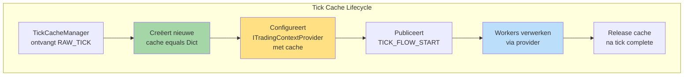
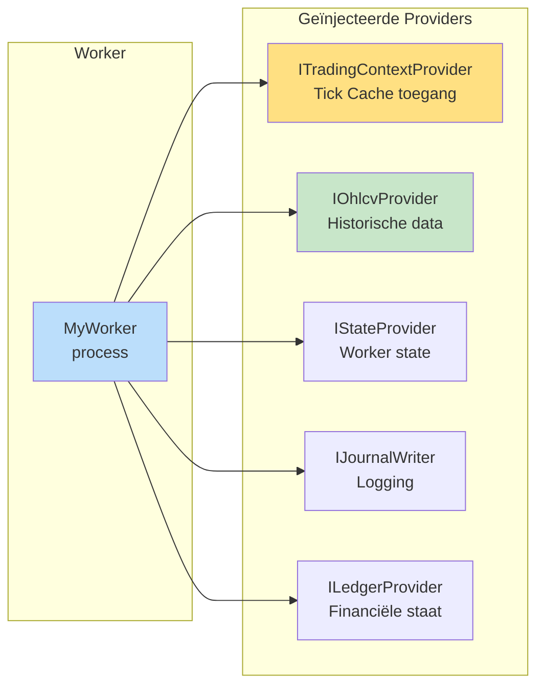
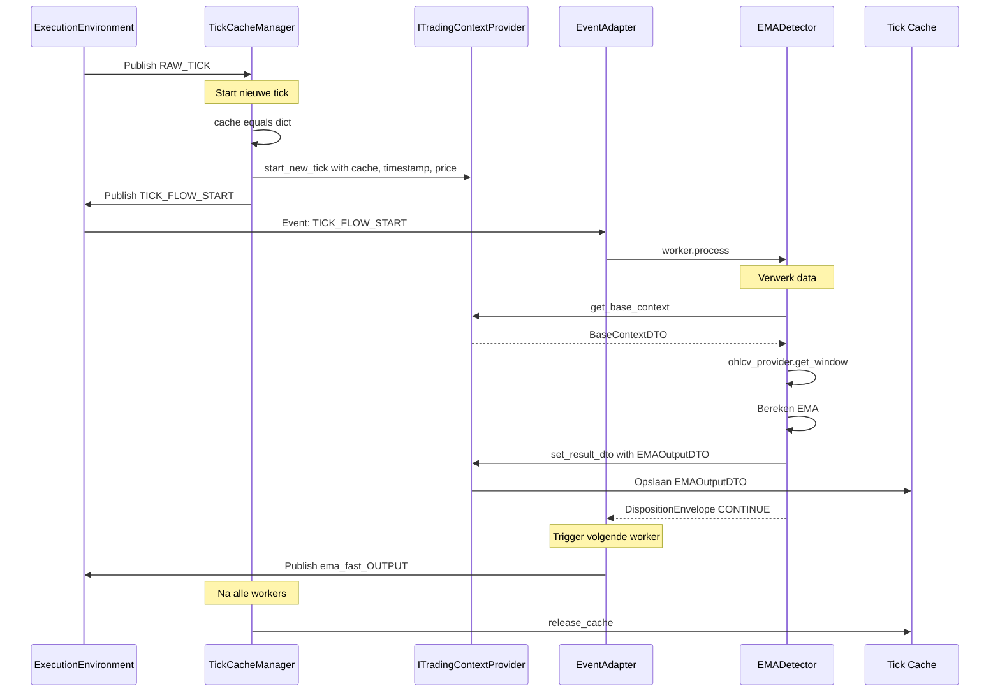

# Hoofdstuk 3: Het Data Landschap (Point-in-Time Architectuur)

**Status:** Definitief  
**Versie:** 4.0

---

## 3.1. De Minimale TradingContext

De [`TradingContext`](backend/dtos/state/trading_context.py) bevat **alleen** de meest essentiële basis informatie:

```python
# backend/dtos/state/trading_context.py
from pydantic import BaseModel
from datetime import datetime

class TradingContext(BaseModel):
    """Minimale context voor één tick."""
    
    timestamp: datetime
    strategy_link_id: str
    asset_pair: str
    current_price: float
    
    # GEEN enriched_df
    # GEEN grote data structuren
    # Alle andere data via ITradingContextProvider
```

---

## 3.2. ITradingContextProvider: De Data Hub

De [`ITradingContextProvider`](backend/core/interfaces/context_provider.py) is de centrale toegangspoort tot alle tick-specifieke data.



### Interface

```python
# backend/core/interfaces/context_provider.py
from typing import Protocol, Dict, Type
from pydantic import BaseModel

class ITradingContextProvider(Protocol):
    """Interface voor Point-in-Time data toegang."""
    
    def start_new_tick(
        self, 
        tick_cache: Dict[Type[BaseModel], BaseModel],
        timestamp: datetime,
        current_price: float
    ) -> None:
        """Configureert provider voor nieuwe tick."""
        ...
    
    def get_base_context(self) -> BaseContextDTO:
        """Haalt minimale basis context op."""
        ...
    
    def get_required_dtos(
        self, 
        requesting_worker: IWorker
    ) -> Dict[Type[BaseModel], BaseModel]:
        """
        Haalt DTOs op basis van manifest.requires_dtos.
        
        Raises:
            MissingContextDataError: Als vereist DTO ontbreekt
        """
        ...
    
    def set_result_dto(
        self, 
        producing_worker: IWorker,
        result_dto: BaseModel
    ) -> None:
        """
        Plaatst geproduceerd DTO in cache.
        Valideert tegen manifest.produces_dtos.
        """
        ...
```

---

## 3.3. De Tick Cache: Tijdelijke DTO Opslag

**Definitie**: Een dictionary die **alleen bestaat tijdens één tick/flow**.

```python
# Type definitie
TickCacheType = Dict[Type[BaseModel], BaseModel]

# Voorbeeld cache inhoud tijdens een tick:
{
    EMAOutputDTO: EMAOutputDTO(ema_20=50123.45, ema_50=50089.12),
    MarketStructureDTO: MarketStructureDTO(is_bos=True, trend='bullish'),
    ATROutputDTO: ATROutputDTO(atr_14=234.56)
}
```

### Kenmerken

- ✅ **Levensduur**: Alleen tijdens één tick (extreem kort)
- ✅ **Inhoud**: Alleen DTO-instanties (geen primitieve types)
- ✅ **Doel**: Efficiënte data-doorgifte tussen workers
- ✅ **Persistentie**: NIET persistent (weggegooid na tick)

### Verschil met StrategyJournal

| Aspect | Tick Cache | StrategyJournal |
|--------|------------|-----------------|
| **Levensduur** | Extreem kort (1 tick) | Permanent |
| **Inhoud** | Intermediaire DTOs | Significante events |
| **Doel** | Data flow binnen tick | Historische logging |
| **Persistentie** | Nee | Ja (bestand) |

---

## 3.4. Platform Providers: De Toolbox

Workers krijgen toegang tot platform diensten via geïnjecteerde Provider interfaces.



### Provider Overzicht

| Provider | Capability Key | Gebruik |
|----------|---------------|---------|
| [`ITradingContextProvider`](backend/core/interfaces/context_provider.py) | (standaard) | Tick Cache toegang |
| [`IOhlcvProvider`](backend/core/interfaces/ohlcv_provider.py) | "ohlcv_window" | Historische OHLCV data |
| [`IStateProvider`](backend/core/interfaces/state_provider.py) | "state_persistence" | Worker state (persistent) |
| [`IJournalWriter`](backend/core/interfaces/journal_writer.py) | "journaling" | Strategy Journal logging |
| [`ILedgerProvider`](backend/core/interfaces/ledger_provider.py) | "ledger_state" | Financiële staat |
| [`IMtfProvider`](backend/core/interfaces/mtf_provider.py) | "multi_timeframe" | Multi-timeframe data |

### Declaratie in Manifest

```yaml
# manifest.yaml
requires_capability:
  - "ohlcv_window"
  - "state_persistence"
```

### Injectie door WorkerFactory

```python
# De WorkerFactory leest requires_capability en injecteert providers
worker = WorkerClass(
    params=params,
    context_provider=trading_context_provider,  # Altijd geïnjecteerd
    ohlcv_provider=ohlcv_provider,              # Op basis van manifest
    state_provider=state_provider                # Op basis van manifest
)
```

---

## 3.5. DispositionEnvelope: Flow Control

Workers communiceren hun intentie na verwerking via een [`DispositionEnvelope`](backend/shared_dtos/disposition_envelope.py).

```python
# backend/shared_dtos/disposition_envelope.py
from pydantic import BaseModel
from typing import Optional, Literal

class DispositionEnvelope(BaseModel):
    """Gestandaardiseerde envelope voor worker output."""
    
    disposition: Literal["CONTINUE", "PUBLISH", "STOP"] = "CONTINUE"
    
    # Alleen bij PUBLISH
    event_name: Optional[str] = None
    event_payload: Optional[BaseModel] = None  # Systeem DTO
```

### Gebruik Patronen

```python
# Patroon 1: CONTINUE (normale flow, data in cache)
class EMADetector(StandardWorker):
    def process(self) -> DispositionEnvelope:
        # Bereken EMA
        result_dto = EMAOutputDTO(ema_20=..., ema_50=...)
        
        # Plaats in cache voor volgende worker
        self.context_provider.set_result_dto(self, result_dto)
        
        # Signaal: ga door met flow
        return DispositionEnvelope(disposition="CONTINUE")

# Patroon 2: PUBLISH (publiceer event op EventBus)
class FVGDetector(StandardWorker):
    def process(self) -> DispositionEnvelope:
        if fvg_detected:
            signal = OpportunitySignalDTO(...)
            
            # Publiceer naar EventBus
            return DispositionEnvelope(
                disposition="PUBLISH",
                event_name="SIGNAL_GENERATED",
                event_payload=signal
            )
        else:
            # Stop deze flow-tak
            return DispositionEnvelope(disposition="STOP")

# Patroon 3: STOP (beëindig deze flow-tak)
class RiskGovernor(StandardWorker):
    def process(self) -> DispositionEnvelope:
        if risk_too_high:
            # Log afwijzing in journal
            self.journal_writer.log_rejection(...)
            
            # Stop flow
            return DispositionEnvelope(disposition="STOP")
```

---

## 3.6. Data Flow Voorbeeld: Complete Tick



---

## 3.7. DTO Types: Cache vs EventBus

**Cruciaal onderscheid**:

| Gebruik | DTO Type | Via | Doel |
|---------|----------|-----|------|
| **Tick Cache** | Plugin-specifieke DTOs | `set_result_dto()` | Interne synchrone flow |
| **EventBus** | Standaard Systeem DTOs | `DispositionEnvelope.PUBLISH` | Externe signalen/events |

### Plugin-specifieke DTOs (voor cache)

**Voorbeelden**: `EMAOutputDTO`, `MarketStructureDTO`, `PatternConfirmationDTO`

**Locatie**: 
- Gedefinieerd in plugin's [`dtos/`](plugins/*/dtos/) folder
- Gekopieerd naar centraal register: [`backend/dto_reg/<vendor>/<plugin>/<version>/`](backend/dto_reg/)

```python
# plugins/ema_detector/dtos/ema_output_dto.py
class EMAOutputDTO(BaseModel):
    ema_20: float
    ema_50: float
    ema_200: float = 0.0
    timestamp: datetime
    
    class Config:
        frozen = True
```

### Systeem DTOs (voor EventBus)

**Voorbeelden**: `OpportunitySignalDTO`, `CriticalEventDTO`, `RoutedTradePlanDTO`

**Locatie**: [`backend/dtos/`](backend/dtos/)

```python
# backend/dtos/pipeline/signal.py
class OpportunitySignalDTO(BaseModel):
    opportunity_id: UUID = Field(default_factory=uuid4)
    timestamp: datetime
    asset: str
    signal_type: str
    confidence: float
    metadata: Dict[str, Any] = {}
```

---

## 3.8. TickCacheManager: Flow Initiator

De [`TickCacheManager`](backend/core/tick_cache_manager.py) is de singleton die elke nieuwe data-verwerkingsflow initieert.

```python
# backend/core/tick_cache_manager.py
from typing import Dict, Type
from pydantic import BaseModel

class TickCacheManager:
    """Beheert levenscyclus van Tick Caches."""
    
    def __init__(
        self,
        context_provider: ITradingContextProvider,
        event_bus: EventBus
    ):
        self._context_provider = context_provider
        self._event_bus = event_bus
        self._active_caches: Dict[str, Dict] = {}
    
    def on_raw_tick(self, tick_event: Any) -> None:
        """
        Event handler - aangeroepen bij RAW_TICK event.
        Start nieuwe flow.
        """
        # 1. Creëer nieuwe cache
        cache = {}
        
        # 2. Extract basis info
        timestamp = tick_event.timestamp
        price = tick_event.current_price
        
        # 3. Configureer provider
        self._context_provider.start_new_tick(cache, timestamp, price)
        
        # 4. Publiceer start event
        tick_id = str(uuid4())
        self._active_caches[tick_id] = cache
        
        self._event_bus.publish(
            "TICK_FLOW_START",
            TickFlowStartDTO(tick_id=tick_id)
        )
    
    def release_cache(self, tick_id: str) -> None:
        """Geef cache vrij na flow complete."""
        if tick_id in self._active_caches:
            del self._active_caches[tick_id]
```

---

## 3.9. Worker Data Toegang Patroon

### Complete voorbeeld: ContextWorker

```python
# plugins/context_workers/indicator_calculation/ema_detector/worker.py
from backend.core.base_worker import StandardWorker
from backend.dtos.state.base_context_dto import BaseContextDTO
from backend.shared_dtos.disposition_envelope import DispositionEnvelope
from .dtos.ema_output_dto import EMAOutputDTO

class EMADetector(StandardWorker):
    """Berekent EMA indicatoren."""
    
    # Providers worden geïnjecteerd door WorkerFactory
    context_provider: ITradingContextProvider
    ohlcv_provider: IOhlcvProvider
    
    def process(self) -> DispositionEnvelope:
        """Hoofdverwerking - Point-in-Time."""
        
        # 1. Haal basis context
        base_ctx = self.context_provider.get_base_context()
        
        # 2. Haal historische data (Point-in-Time!)
        df = self.ohlcv_provider.get_window(
            timestamp=base_ctx.timestamp,
            lookback=200
        )
        
        # 3. Bereken EMA
        ema_20 = df['close'].ewm(span=self.params.period_fast).mean().iloc[-1]
        ema_50 = df['close'].ewm(span=self.params.period_slow).mean().iloc[-1]
        
        # 4. Creëer output DTO
        result = EMAOutputDTO(
            ema_20=ema_20,
            ema_50=ema_50,
            timestamp=base_ctx.timestamp
        )
        
        # 5. Plaats in Tick Cache
        self.context_provider.set_result_dto(self, result)
        
        # 6. Signaal: ga door naar volgende worker
        return DispositionEnvelope(disposition="CONTINUE")
```

### Complete voorbeeld: OpportunityWorker

```python
# plugins/opportunity_workers/technical_pattern/fvg_detector/worker.py
from backend.core.base_worker import StandardWorker
from backend.dtos.pipeline.signal import OpportunitySignalDTO
from backend.shared_dtos.disposition_envelope import DispositionEnvelope
# Import van andere plugin's DTO via centraal register
from backend.dto_reg.s1mple.market_structure_detector.v1_0_0.structure_dto import MarketStructureDTO

class FVGDetector(StandardWorker):
    """Detecteert Fair Value Gaps."""
    
    context_provider: ITradingContextProvider
    ohlcv_provider: IOhlcvProvider
    
    def process(self) -> DispositionEnvelope:
        """FVG detectie - gebruikt DTOs uit cache."""
        
        # 1. Haal basis context
        base_ctx = self.context_provider.get_base_context()
        
        # 2. Haal required DTOs uit cache
        # Manifest declareert: requires_dtos: ["MarketStructureDTO"]
        required_dtos = self.context_provider.get_required_dtos(self)
        structure_dto = required_dtos[MarketStructureDTO]
        
        # 3. Haal OHLCV data
        df = self.ohlcv_provider.get_window(
            timestamp=base_ctx.timestamp,
            lookback=100
        )
        
        # 4. FVG logica
        if self._detect_fvg(df, structure_dto):
            # Kans gevonden! Publiceer naar EventBus
            signal = OpportunitySignalDTO(
                opportunity_id=uuid4(),
                timestamp=base_ctx.timestamp,
                asset=base_ctx.asset_pair,
                signal_type='fvg_entry',
                confidence=0.85,
                metadata={'gap_size': 8.5}
            )
            
            return DispositionEnvelope(
                disposition="PUBLISH",
                event_name="SIGNAL_GENERATED",
                event_payload=signal
            )
        else:
            # Geen kans, stop deze flow-tak
            return DispositionEnvelope(disposition="STOP")
    
    def _detect_fvg(self, df, structure_dto) -> bool:
        """FVG detectie logica."""
        # Alleen detecteren na structure break
        if not structure_dto.is_bos:
            return False
        
        # Check voor gap
        # ... implementatie ...
        return gap_detected
```

---

## 3.10. DTO Registry & Enrollment

Plugin-specifieke DTOs worden centraal beschikbaar gesteld via een "enrollment" mechanisme.

### Structuur

```
backend/
└── dto_reg/
    └── <vendor>/
        └── <plugin_name>/
            └── v<version>/
                └── <dto_name>.py
```

### Voorbeeld

```
backend/dto_reg/
├── s1mple/
│   ├── ema_detector/
│   │   └── v1_0_0/
│   │       └── ema_output_dto.py
│   └── market_structure_detector/
│       └── v1_0_0/
│           └── structure_dto.py
```

### Gebruik

```python
# Producer plugin definieert DTO lokaal
# plugins/ema_detector/dtos/ema_output_dto.py

# Bij enrollment kopieert platform naar centraal register
# backend/dto_reg/s1mple/ema_detector/v1_0_0/ema_output_dto.py

# Consumer importeert van centrale locatie
from backend.dto_reg.s1mple.ema_detector.v1_0_0.ema_output_dto import EMAOutputDTO
```

### Manifest Declaraties

```yaml
# Producer manifest
produces_dtos:
  - dto_type: "EMAOutputDTO"
    local_path: "dtos/ema_output_dto.py"

# Consumer manifest  
requires_dtos:
  - dto_type: "EMAOutputDTO"
    expected_path: "backend.dto_reg.s1mple.ema_detector.v1_0_0.ema_output_dto"
```

---

## 3.11. Point-in-Time Garantie

### Hoe wordt Point-in-Time gegarandeerd?

1. **TickCacheManager**: Legt timestamp vast bij flow start
2. **Platform Providers**: MOETEN timestamp respecteren (geen toekomstige data)
3. **Tick Cache**: Bevat alleen data berekend binnen huidige tick
4. **Validatie**: DependencyValidator checkt data-volgorde tijdens bootstrap

```python
# Voorbeeld: IOhlcvProvider implementatie
class OhlcvProvider:
    def get_window(self, timestamp: datetime, lookback: int) -> pd.DataFrame:
        """
        Haalt OHLCV data op.
        
        CRUCIALE REGEL: Retourneer ALLEEN data tot en met timestamp.
        Geen data uit de toekomst!
        """
        return self._data_source.load_data(
            end_time=timestamp,  # ← Point-in-Time grens
            lookback=lookback
        )
```

---

**Einde Hoofdstuk 3**

Dit hoofdstuk beschrijft het complete Point-in-Time data landschap met ITradingContextProvider, Tick Cache, Platform Providers en DispositionEnvelope voor flow control.
