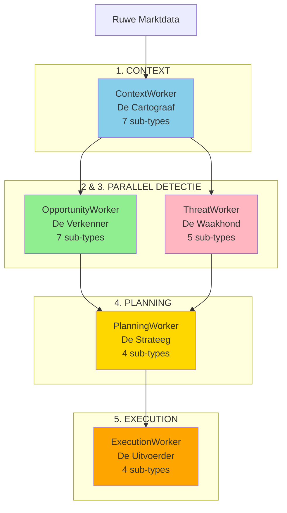
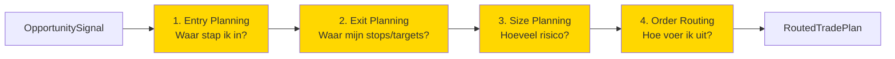

# Hoofdstuk 5: Worker Ecosysteem (5 Categorieën)

**Status:** Definitief  
**Versie:** 4.0

---

## 5.1. De Vijf Worker Categorieën

S1mpleTrader organiseert alle businesslogica in vijf gespecialiseerde worker categorieën, elk met een duidelijke verantwoordelijkheid.



**Kernprincipe**: Elke categorie heeft één duidelijke verantwoordelijkheid (SRP).

---

## 5.2. ContextWorker - "De Cartograaf"

**Verantwoordelijkheid**: Verrijkt ruwe data met objectieve, beschrijvende context.

**Kernprincipe**: Objectief en beschrijvend - "Dit is wat er is"

### Input/Output Pattern

```python
# Typisch ContextWorker patroon
class MyContextWorker(StandardWorker):
    def process(self) -> DispositionEnvelope:
        # Input: basis context + platform providers
        base_ctx = self.context_provider.get_base_context()
        df = self.ohlcv_provider.get_window(base_ctx.timestamp, ...)
        
        # Verwerk: objectieve analyse
        result_dto = self._calculate_context(df)
        
        # Output: plaats DTO in cache
        self.context_provider.set_result_dto(self, result_dto)
        
        # Flow: continue naar volgende
        return DispositionEnvelope(disposition="CONTINUE")
```

### Sub-Types & Voorbeelden

#### 1. REGIME_CLASSIFICATION

**Doel**: Classificeer marktregime en condities.

```python
# plugins/context_workers/regime_classification/adx_filter/worker.py
class ADXTrendFilter(StandardWorker):
    """Classificeert trending vs ranging markt."""
    
    def process(self) -> DispositionEnvelope:
        # Bereken ADX
        adx_value = self._calculate_adx(df)
        
        # Classificeer regime
        result = MarketRegimeDTO(
            regime='trending' if adx_value > 25 else 'ranging',
            strength=adx_value / 100,
            timestamp=base_ctx.timestamp
        )
        
        self.context_provider.set_result_dto(self, result)
        return DispositionEnvelope(disposition="CONTINUE")
```

**Output DTO**:
```python
class MarketRegimeDTO(BaseModel):
    regime: Literal['trending', 'ranging', 'transitioning']
    strength: float  # 0.0 - 1.0
    timestamp: datetime
```

#### 2. STRUCTURAL_ANALYSIS

**Doel**: Identificeer technische marktstructuren.

```python
class MarketStructureDetector(StandardWorker):
    """Detecteert Break of Structure en CHoCH."""
    
    def process(self) -> DispositionEnvelope:
        # Analyseer swing points
        swings = self._identify_swings(df)
        
        # Detecteer structure breaks
        result = MarketStructureDTO(
            is_bos=self._is_break_of_structure(swings),
            is_choch=self._is_change_of_character(swings),
            trend_direction='bullish' if bullish else 'bearish',
            last_swing_high=swings.high,
            last_swing_low=swings.low
        )
        
        self.context_provider.set_result_dto(self, result)
        return DispositionEnvelope(disposition="CONTINUE")
```

#### 3. INDICATOR_CALCULATION

**Doel**: Bereken technische indicatoren.

```python
class EMADetector(StandardWorker):
    """Berekent EMA indicatoren."""
    
    def process(self) -> DispositionEnvelope:
        df = self.ohlcv_provider.get_window(...)
        
        result = EMAOutputDTO(
            ema_20=df['close'].ewm(span=20).mean().iloc[-1],
            ema_50=df['close'].ewm(span=50).mean().iloc[-1],
            ema_200=df['close'].ewm(span=200).mean().iloc[-1]
        )
        
        self.context_provider.set_result_dto(self, result)
        return DispositionEnvelope(disposition="CONTINUE")
```

---

## 5.3. OpportunityWorker - "De Verkenner"

**Verantwoordelijkheid**: Herkennen van handelskansen op basis van patronen.

**Kernprincipe**: Probabilistisch en creatief - "Ik zie een mogelijkheid"

### Input/Output Pattern

```python
# Typisch OpportunityWorker patroon
class MyOpportunityWorker(StandardWorker):
    def process(self) -> DispositionEnvelope:
        # Input: required DTOs uit cache
        required_dtos = self.context_provider.get_required_dtos(self)
        structure_dto = required_dtos[MarketStructureDTO]
        
        # Verwerk: pattern detectie
        if self._pattern_detected(structure_dto):
            # Output: publiceer signaal
            signal = OpportunitySignalDTO(
                opportunity_id=uuid4(),  # Causale ID
                signal_type='my_pattern',
                confidence=0.85
            )
            
            return DispositionEnvelope(
                disposition="PUBLISH",
                event_name="SIGNAL_GENERATED",
                event_payload=signal
            )
        
        # Geen kans gevonden
        return DispositionEnvelope(disposition="STOP")
```

### Sub-Types & Voorbeelden

#### TECHNICAL_PATTERN

**Doel**: Detecteer chart patronen.

```python
class FVGDetector(StandardWorker):
    """Detecteert Fair Value Gaps."""
    
    def process(self) -> DispositionEnvelope:
        # Haal structuur context
        required_dtos = self.context_provider.get_required_dtos(self)
        structure = required_dtos[MarketStructureDTO]
        
        # Alleen detecteren na structure break
        if not structure.is_bos:
            return DispositionEnvelope(disposition="STOP")
        
        # Check voor FVG
        df = self.ohlcv_provider.get_window(...)
        
        if self._is_fvg(df):
            signal = OpportunitySignalDTO(
                opportunity_id=uuid4(),
                timestamp=base_ctx.timestamp,
                signal_type='fvg_entry',
                confidence=0.85,
                metadata={'gap_size': 8.5}
            )
            
            return DispositionEnvelope(
                disposition="PUBLISH",
                event_name="SIGNAL_GENERATED",
                event_payload=signal
            )
        
        return DispositionEnvelope(disposition="STOP")
```

#### MOMENTUM_SIGNAL

```python
class TrendContinuation(StandardWorker):
    """Detecteert trend continuation signalen."""
    
    def process(self) -> DispositionEnvelope:
        required_dtos = self.context_provider.get_required_dtos(self)
        
        # Vereist regime en EMA data
        regime = required_dtos[MarketRegimeDTO]
        ema = required_dtos[EMAOutputDTO]
        
        # Alleen in trending markt
        if regime.regime != 'trending':
            return DispositionEnvelope(disposition="STOP")
        
        # Check momentum
        if self._momentum_confirmed(ema):
            signal = OpportunitySignalDTO(
                opportunity_id=uuid4(),
                signal_type='trend_continuation',
                confidence=regime.strength
            )
            
            return DispositionEnvelope(
                disposition="PUBLISH",
                event_name="SIGNAL_GENERATED",
                event_payload=signal
            )
        
        return DispositionEnvelope(disposition="STOP")
```

---

## 5.4. ThreatWorker - "De Waakhond"

**Verantwoordelijkheid**: Detecteren van risico's en bedreigingen.

**Kernprincipe**: Defensief en informatief - "Let op, hier is een risico"

### Input/Output Pattern

```python
# Typisch ThreatWorker patroon
class MyThreatWorker(StandardWorker):
    def process(self) -> DispositionEnvelope:
        # Input: ledger state via provider
        current_dd = self.ledger_provider.get_current_drawdown()
        
        # Verwerk: risico analyse
        if current_dd > self.params.max_drawdown:
            # Output: publiceer threat
            threat = CriticalEventDTO(
                threat_id=uuid4(),  # Causale ID
                threat_type='MAX_DRAWDOWN_BREACHED',
                severity='HIGH',
                details={'current': current_dd, 'max': self.params.max_drawdown}
            )
            
            return DispositionEnvelope(
                disposition="PUBLISH",
                event_name="THREAT_DETECTED",
                event_payload=threat
            )
        
        # Geen dreiging
        return DispositionEnvelope(disposition="STOP")
```

### Sub-Types & Voorbeelden

#### PORTFOLIO_RISK

```python
class MaxDrawdownMonitor(StandardWorker):
    """Monitort portfolio drawdown."""
    
    ledger_provider: ILedgerProvider
    
    def process(self) -> DispositionEnvelope:
        # Haal ledger staat
        current_dd = self.ledger_provider.get_current_drawdown()
        peak = self.ledger_provider.get_peak_capital()
        
        if current_dd > self.params.max_drawdown_percent:
            threat = CriticalEventDTO(
                threat_id=uuid4(),
                timestamp=self.context_provider.get_base_context().timestamp,
                threat_type='MAX_DRAWDOWN_BREACHED',
                severity='HIGH',
                details={
                    'current_drawdown': current_dd,
                    'max_allowed': self.params.max_drawdown_percent,
                    'peak_capital': peak
                }
            )
            
            return DispositionEnvelope(
                disposition="PUBLISH",
                event_name="THREAT_DETECTED",
                event_payload=threat
            )
        
        return DispositionEnvelope(disposition="STOP")
```

**Trigger**: Vaak event-driven via `LEDGER_STATE_CHANGED`

```yaml
# manifest.yaml
capabilities:
  events:
    enabled: true
    wirings:
      - listens_to: "LEDGER_STATE_CHANGED"
        invokes:
          method: "process"
```

#### MARKET_RISK

```python
class VolatilitySpikeDetector(StandardWorker):
    """Detecteert volatiliteit spikes."""
    
    def process(self) -> DispositionEnvelope:
        required_dtos = self.context_provider.get_required_dtos(self)
        atr = required_dtos[ATROutputDTO]
        
        # Haal historische ATR
        hist_atr = self.state_provider.get()['atr_percentiles']
        
        # Check spike
        current_percentile = self._calculate_percentile(atr.atr_14, hist_atr)
        
        if current_percentile > 95:
            threat = CriticalEventDTO(
                threat_id=uuid4(),
                threat_type='VOLATILITY_SPIKE',
                severity='MEDIUM',
                details={'percentile': current_percentile}
            )
            
            return DispositionEnvelope(
                disposition="PUBLISH",
                event_name="THREAT_DETECTED",
                event_payload=threat
            )
        
        return DispositionEnvelope(disposition="STOP")
```

---

## 5.5. PlanningWorker - "De Strateeg"

**Verantwoordelijkheid**: Transformeren van kansen naar concrete, uitvoerbare plannen.

**Kernprincipe**: Deterministisch en tactisch - "Gegeven deze kans, dit is het plan"

### Sequentiële Sub-Fases

Planning gebeurt in vier sequentiële stappen:



### Input/Output Pattern

```python
# Planning workers vormen een chain via DTOs
class EntryPlanner(StandardWorker):
    def process(self) -> DispositionEnvelope:
        # Input: OpportunitySignal (van EventBus) + Context DTOs
        required_dtos = self.context_provider.get_required_dtos(self)
        structure = required_dtos[MarketStructureDTO]
        
        # Bereken entry
        entry_price = self._calculate_entry(structure)
        
        # Output: EntryPlanDTO in cache
        plan = EntryPlanDTO(
            entry_price=entry_price,
            entry_type='LIMIT'
        )
        
        self.context_provider.set_result_dto(self, plan)
        return DispositionEnvelope(disposition="CONTINUE")

class ExitPlanner(StandardWorker):
    def process(self) -> DispositionEnvelope:
        # Input: EntryPlanDTO uit cache
        required_dtos = self.context_provider.get_required_dtos(self)
        entry_plan = required_dtos[EntryPlanDTO]
        
        # Bereken stops/targets
        exit_plan = ExitPlanDTO(
            stop_loss=self._calculate_stop(entry_plan),
            take_profit=self._calculate_target(entry_plan)
        )
        
        self.context_provider.set_result_dto(self, exit_plan)
        return DispositionEnvelope(disposition="CONTINUE")

# ... SizePlanner, OrderRouter ...

class OrderRouter(StandardWorker):
    """Laatste planner - publiceert complete plan."""
    
    def process(self) -> DispositionEnvelope:
        # Input: alle vorige plan DTOs
        required_dtos = self.context_provider.get_required_dtos(self)
        entry = required_dtos[EntryPlanDTO]
        exit = required_dtos[ExitPlanDTO]
        size = required_dtos[SizePlanDTO]
        
        # Creëer final plan
        final_plan = RoutedTradePlanDTO(
            trade_id=uuid4(),
            entry_price=entry.entry_price,
            stop_loss=exit.stop_loss,
            take_profit=exit.take_profit,
            position_size=size.position_size,
            order_type='LIMIT',
            routing_params={'tif': 'GTC'}
        )
        
        # Publiceer naar ExecutionWorker
        return DispositionEnvelope(
            disposition="PUBLISH",
            event_name="PLAN_READY",
            event_payload=final_plan
        )
```

### Sub-Types Detail

#### ENTRY_PLANNING

**Output**: [`EntryPlanDTO`](backend/dtos/pipeline/entry_plan_dto.py)

```python
class EntryPlanDTO(BaseModel):
    """Entry planning specificatie."""
    entry_price: float
    entry_type: Literal['MARKET', 'LIMIT', 'STOP']
    entry_params: Dict[str, Any] = {}
```

**Voorbeelden**:
- `limit_entry_at_fvg` - Limit order op FVG midpoint
- `market_entry_immediate` - Direct market order
- `twap_entry` - Time-weighted average entry

#### EXIT_PLANNING

**Input**: `EntryPlanDTO`  
**Output**: [`ExitPlanDTO`](backend/dtos/pipeline/exit_plan_dto.py)

```python
class ExitPlanDTO(BaseModel):
    """Exit planning specificatie."""
    stop_loss: float
    take_profit: float
    stop_type: str = 'LIMIT'
    target_type: str = 'LIMIT'
```

**Voorbeelden**:
- `liquidity_target_exit` - Targets op liquidity zones
- `atr_based_stops` - Stops gebaseerd op ATR
- `fixed_rr_exit` - Fixed Risk:Reward ratio

#### SIZE_PLANNING

**Input**: `ExitPlanDTO`  
**Output**: [`SizePlanDTO`](backend/dtos/pipeline/size_plan_dto.py)

```python
class SizePlanDTO(BaseModel):
    """Size planning specificatie."""
    position_size: float
    risk_amount: float
    sizing_rationale: str
```

**Voorbeelden**:
- `fixed_risk_sizer` - Fixed % per trade
- `kelly_criterion` - Kelly formula
- `adaptive_sizer` - Aanpassen op basis van threats

#### ORDER_ROUTING

**Input**: `SizePlanDTO`  
**Output**: [`RoutedTradePlanDTO`](backend/dtos/pipeline/routed_trade_plan.py) (via PUBLISH)

```python
class RoutedTradePlanDTO(BaseModel):
    """Complete, uitvoerbaar trade plan."""
    
    # Causale IDs
    trade_id: UUID
    opportunity_id: UUID  # Link naar opportunity
    
    # Entry
    entry_price: float
    entry_type: str
    
    # Exit
    stop_loss: float
    take_profit: float
    
    # Size
    position_size: float
    
    # Routing
    order_type: str
    routing_params: Dict[str, Any]
```

---

## 5.6. ExecutionWorker - "De Uitvoerder"

**Verantwoordelijkheid**: Uitvoeren en actief beheren van trades.

**Kernprincipe**: Actief en deterministisch - "Ik voer uit en beheer"

### Input/Output Pattern

```python
# Typisch ExecutionWorker patroon
class MyExecutionWorker(EventDrivenWorker):
    """Meestal event-driven."""
    
    execution_provider: IExecutionProvider
    ledger_provider: ILedgerProvider
    journal_writer: IJournalWriter
    
    def on_plan_ready(self, plan: RoutedTradePlanDTO) -> DispositionEnvelope:
        """Event handler voor PLAN_READY."""
        
        # Execute via provider
        result = self.execution_provider.place_order(
            asset=plan.asset,
            order_type=plan.order_type,
            price=plan.entry_price,
            size=plan.position_size
        )
        
        # Update ledger
        self.ledger_provider.add_position(...)
        
        # Log in journal
        self.journal_writer.log_entry({
            'event_type': 'TRADE_OPENED',
            'trade_id': plan.trade_id,
            'opportunity_id': plan.opportunity_id  # Causale link!
        })
        
        # Publiceer executie event
        return DispositionEnvelope(
            disposition="PUBLISH",
            event_name="TRADE_EXECUTED",
            event_payload=TradeExecutedDTO(...)
        )
```

### Sub-Types Detail

#### TRADE_INITIATION

**Trigger**: `PLAN_READY` event

```python
class DefaultPlanExecutor(EventDrivenWorker):
    """Voert trade plannen uit."""
    
    def on_plan_ready(self, plan: RoutedTradePlanDTO) -> DispositionEnvelope:
        # Execute trade
        order_result = self.execution_provider.place_order(...)
        
        # Log causale keten
        self.journal_writer.log_trade_opened(
            trade_id=plan.trade_id,
            opportunity_id=plan.opportunity_id  # Waarom geopend
        )
        
        return DispositionEnvelope(
            disposition="PUBLISH",
            event_name="TRADE_EXECUTED",
            event_payload=TradeExecutedDTO(...)
        )
```

#### POSITION_MANAGEMENT

**Trigger**: Vaak tijd-gebaseerd of op price updates

```python
class TrailingStopManager(EventDrivenWorker):
    """Beheert trailing stops - vereist state."""
    
    state_provider: IStateProvider
    
    def on_price_update(self, update: PriceUpdateDTO) -> DispositionEnvelope:
        """Update trailing stop bij nieuwe high."""
        
        # Haal state
        state = self.state_provider.get()
        hwm = state.get('high_water_mark', update.price)
        
        # Update HWM
        if update.price > hwm:
            state['high_water_mark'] = update.price
            self.state_provider.set(state)
            
            # Bereken nieuwe stop
            new_stop = hwm * (1 - self.params.trail_percent)
            
            # Modify order
            self.execution_provider.modify_stop(
                position_id=update.position_id,
                new_stop=new_stop
            )
            
            return DispositionEnvelope(
                disposition="PUBLISH",
                event_name="STOP_MODIFIED",
                event_payload=StopModifiedDTO(...)
            )
        
        return DispositionEnvelope(disposition="STOP")
```

#### RISK_SAFETY

**Trigger**: `THREAT_DETECTED` events

```python
class EmergencyExitAgent(EventDrivenWorker):
    """Emergency exit bij kritieke threats."""
    
    def on_threat_detected(self, threat: CriticalEventDTO) -> DispositionEnvelope:
        """React op threats."""
        
        # Alleen bij CRITICAL severity
        if threat.severity != 'CRITICAL':
            return DispositionEnvelope(disposition="STOP")
        
        # Close alle posities
        open_positions = self.ledger_provider.get_open_positions()
        
        for position in open_positions:
            self.execution_provider.close_position(
                position_id=position.id,
                reason='emergency_exit'
            )
            
            # Log met causale link
            self.journal_writer.log_trade_closed(
                trade_id=position.trade_id,
                threat_id=threat.threat_id  # Waarom gesloten!
            )
        
        return DispositionEnvelope(
            disposition="PUBLISH",
            event_name="EMERGENCY_EXIT_COMPLETE",
            event_payload=EmergencyExitDTO(...)
        )
```

#### OPERATIONAL

**Trigger**: Scheduled events

```python
class DCAExecutor(EventDrivenWorker):
    """Voert periodieke DCA aankopen uit."""
    
    def on_weekly_tick(self, tick: ScheduledTickDTO) -> DispositionEnvelope:
        """Weekly DCA purchase."""
        
        # Haal beschikbaar kapitaal
        available = self.ledger_provider.get_available_cash()
        
        # Bereken amount
        dca_amount = min(self.params.weekly_amount, available)
        
        if dca_amount > self.params.min_amount:
            # Execute DCA
            self.execution_provider.place_order(
                asset=self.params.asset,
                order_type='MARKET',
                size=dca_amount / base_ctx.current_price
            )
            
            return DispositionEnvelope(
                disposition="PUBLISH",
                event_name="DCA_EXECUTED",
                event_payload=DCAExecutedDTO(amount=dca_amount)
            )
        
        return DispositionEnvelope(disposition="STOP")
```

---

## 5.7. Worker Category Overzicht

### Data Flow Samenvatting

| Categorie | Primaire Input | Primaire Output | Disposition |
|-----------|---------------|-----------------|-------------|
| **ContextWorker** | Platform providers | Plugin DTOs → Cache | CONTINUE |
| **OpportunityWorker** | Cache DTOs | OpportunitySignalDTO → EventBus | PUBLISH of STOP |
| **ThreatWorker** | Cache DTOs + Ledger | CriticalEventDTO → EventBus | PUBLISH of STOP |
| **PlanningWorker** | Cache DTOs (chain) | Plan DTOs → Cache<br/>Final: PUBLISH | CONTINUE<br/>Final: PUBLISH |
| **ExecutionWorker** | EventBus events | Side-effects + Events | PUBLISH |

### Causale ID Generatie

| Worker Type | Genereert ID | Gebruikt ID |
|-------------|--------------|-------------|
| **OpportunityWorker** | `opportunity_id` | - |
| **ThreatWorker** | `threat_id` | - |
| **PlanningWorker** | `trade_id` | `opportunity_id` (link) |
| **ExecutionWorker** | - | `trade_id`, `threat_id` (logging) |

---

## 5.8. Manifest Templates per Categorie

### ContextWorker Template

```yaml
identification:
  name: "my_context_worker"
  type: "context_worker"
  subtype: "indicator_calculation"  # of andere context sub-type

requires_capability:
  - "ohlcv_window"

requires_dtos: []  # Meestal geen, tenzij chained

produces_dtos:
  - dto_type: "MyOutputDTO"
    local_path: "dtos/my_output_dto.py"

capabilities:
  state:
    enabled: false  # Meestal niet nodig
  events:
    enabled: false  # Nooit voor pure ContextWorkers
```

### OpportunityWorker Template

```yaml
identification:
  name: "my_opportunity_worker"
  type: "opportunity_worker"
  subtype: "technical_pattern"  # of andere opportunity sub-type

requires_capability:
  - "ohlcv_window"  # Optioneel

requires_dtos:
  - dto_type: "MarketStructureDTO"  # Context van andere workers
    expected_path: "backend.dto_reg.s1mple.market_structure.v1_0_0.structure_dto"

produces_dtos: []  # Publiceert via EventBus, niet cache

capabilities:
  state:
    enabled: false  # Alleen als nodig voor pattern tracking
  events:
    enabled: false  # Gebruikt DispositionEnvelope.PUBLISH
```

### ThreatWorker Template (Event-Driven)

```yaml
identification:
  name: "my_threat_worker"
  type: "threat_worker"
  subtype: "portfolio_risk"

requires_capability:
  - "ledger_state"

requires_dtos: []

produces_dtos: []

capabilities:
  events:
    enabled: true
    wirings:
      - listens_to: "LEDGER_STATE_CHANGED"
        invokes:
          method: "on_ledger_update"
    publishes:
      - event_name: "THREAT_DETECTED"
```

### PlanningWorker Template

```yaml
identification:
  name: "my_entry_planner"
  type: "planning_worker"
  subtype: "entry_planning"

requires_dtos:
  - dto_type: "MarketStructureDTO"
    expected_path: "..."

produces_dtos:
  - dto_type: "EntryPlanDTO"
    local_path: "dtos/entry_plan_dto.py"

capabilities:
  state:
    enabled: false
  events:
    enabled: false  # Standard flow via cache
```

### ExecutionWorker Template (Event-Driven)

```yaml
identification:
  name: "my_executor"
  type: "execution_worker"
  subtype: "trade_initiation"

requires_capability:
  - "execution_provider"
  - "ledger_state"
  - "journaling"

requires_dtos: []

produces_dtos: []

capabilities:
  events:
    enabled: true
    wirings:
      - listens_to: "PLAN_READY"
        invokes:
          method: "on_plan_ready"
    publishes:
      - event_name: "TRADE_EXECUTED"
```

---

## 5.9. Quick Reference: Welke Worker Type?

### Beslisboom

```
Je wilt data verrijken met objectieve info?
└─> ContextWorker
    └─> Welk type data?
        ├─> Markt regime → regime_classification
        ├─> Structuren (swings, zones) → structural_analysis
        ├─> Indicatoren (EMA, RSI) → indicator_calculation
        └─> ...

Je wilt handelskansen detecteren?
└─> OpportunityWorker
    └─> Wat voor signaal?
        ├─> Chart patroon → technical_pattern
        ├─> Momentum → momentum_signal
        ├─> Mean reversion → mean_reversion
        └─> ...

Je wilt risico's detecteren?
└─> ThreatWorker
    └─> Wat voor risico?
        ├─> Portfolio (drawdown) → portfolio_risk
        ├─> Markt (volatility) → market_risk
        ├─> Systeem (connection) → system_health
        └─> ...

Je wilt een signaal omzetten naar een plan?
└─> PlanningWorker
    └─> Welke fase?
        ├─> Entry bepalen → entry_planning
        ├─> Exit bepalen → exit_planning
        ├─> Size bepalen → size_planning
        └─> Routing bepalen → order_routing

Je wilt trades uitvoeren of beheren?
└─> ExecutionWorker
    └─> Wat voor actie?
        ├─> Trade openen → trade_initiation
        ├─> Positie beheren → position_management
        ├─> Noodmaatregelen → risk_safety
        └─> Geplande taken (DCA) → operational
```

---

**Einde Hoofdstuk 5**

Dit hoofdstuk beschrijft het complete Worker Ecosysteem met alle 5 categorieën en 27 sub-types, inclusief input/output patronen, voorbeelden en templates voor elk type.