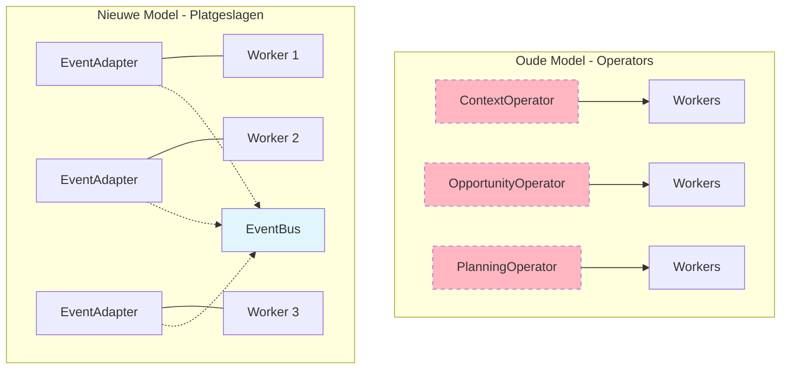
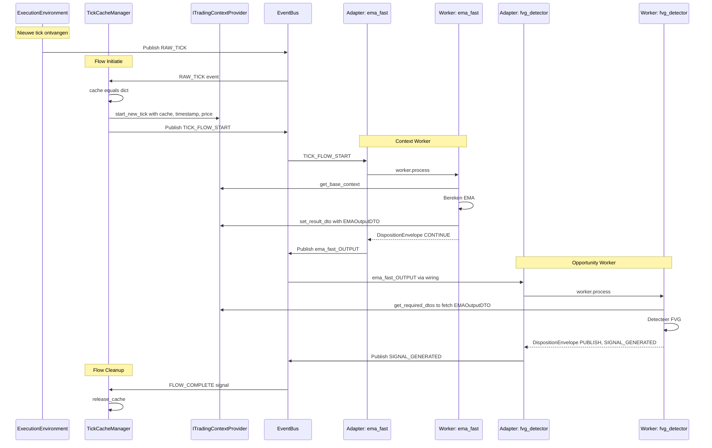
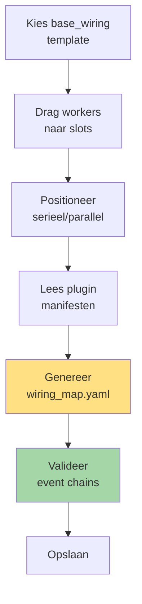
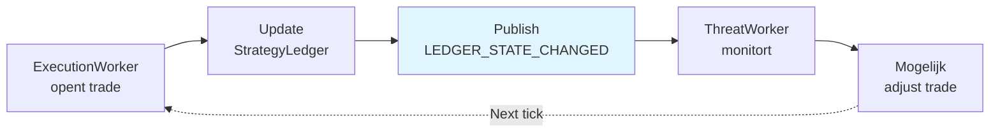
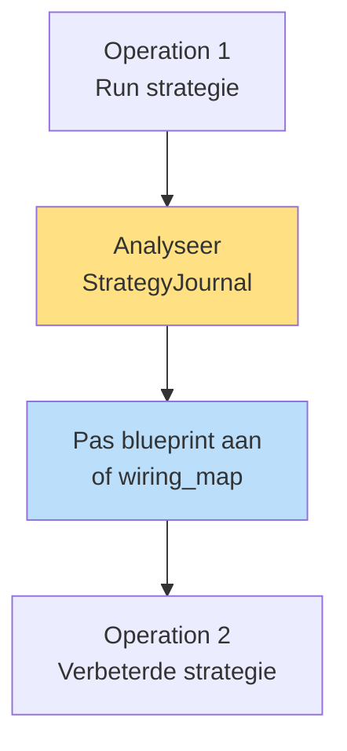

# Hoofdstuk 6: Workflow Orkestratie

**Status:** Definitief
**Versie:** 4.0

---

## 6.1. Het Platgeslagen Model

In het platgeslagen model is er **geen orkestrerende laag** (geen Operators). De workflow wordt volledig bepaald door **expliciete bedrading** via EventAdapters.



**Kernverschil**: Workers communiceren via EventBus, niet via Operators.

---

## 6.2. Complete Tick Lifecycle

Een complete data-verwerkingscyclus van RAW_TICK tot trade execution:



---

## 6.3. Flow Patronen

### 6.3.1. Sequentiële Keten

**UI**: Workers onder elkaar geplaatst in Strategy Builder

**Wiring**:

```yaml
wiring_rules:
  - wiring_id: "flow_start_to_w1"
    source: {component_id: "TickCacheManager", event_name: "TICK_FLOW_START"}
    target: {component_id: "ema_fast", handler_method: "process"}
  
  - wiring_id: "w1_to_w2"
    source: {component_id: "ema_fast", event_name: "ema_fast_OUTPUT"}
    target: {component_id: "ema_slow", handler_method: "process"}
```

**Data**: Elke worker plaatst DTO in cache, volgende haalt op.

### 6.3.2. Parallelle Detectie

**UI**: Workers naast elkaar geplaatst

**Wiring**:

```yaml
wiring_rules:
  - wiring_id: "context_to_fvg"
    source: {component_id: "structure_det", event_name: "structure_det_OUTPUT"}
    target: {component_id: "fvg_detector", handler_method: "process"}
  
  - wiring_id: "context_to_breakout"
    source: {component_id: "structure_det", event_name: "structure_det_OUTPUT"}
    target: {component_id: "breakout_scanner", handler_method: "process"}
```

**Data**: Beide workers delen Tick Cache, publiceren onafhankelijk.

### 6.3.3. Event Coordinatie

**UI**: Event-aware workers met custom events

**Manifest**:

```yaml
capabilities:
  events:
    enabled: true
    wirings:
      - listens_to: "DCA_OPPORTUNITY_SCORED"
        invokes: {method: "on_opportunity_scored"}
      - listens_to: "DCA_RISK_ASSESSED"
        invokes: {method: "on_risk_assessed"}
```

**Worker**:

```python
class AdaptiveDCAPlanner(EventDrivenWorker):
    state_provider: IStateProvider
    
    def on_opportunity_scored(self, score_dto):
        state = self.state_provider.get()
        state['opportunity_score'] = score_dto.score
        self.state_provider.set(state)
        self._try_create_plan()
    
    def on_risk_assessed(self, risk_dto):
        state = self.state_provider.get()
        state['risk_level'] = risk_dto.risk_level
        self.state_provider.set(state)
        self._try_create_plan()
    
    def _try_create_plan(self):
        state = self.state_provider.get()
        
        if 'opportunity_score' in state and 'risk_level' in state:
            # Beide ontvangen - maak plan
            amount = self._decide_amount(
                state['opportunity_score'],
                state['risk_level']
            )
            
            if amount > 0:
                plan = DCAplanDTO(amount=amount)
                self.state_provider.set({})  # Reset
                
                return DispositionEnvelope(
                    disposition="PUBLISH",
                    event_name="DCA_PLAN_READY",
                    event_payload=plan
                )
```

---

## 6.4. Strategy Builder UI: Wiring Generatie

De UI is de intelligente generator van strategy_wiring_map.yaml.

### UI Workflow



### Generatie Logica

**Seriële positionering**:
```
User plaatst: [A] → [B] → [C]

UI genereert:
  TICK_FLOW_START → A
  A_OUTPUT → B
  B_OUTPUT → C
```

**Parallelle positionering**:
```
User plaatst: [A]
              [B] (parallel)

UI genereert:
  TICK_FLOW_START → A
  TICK_FLOW_START → B
```

**Custom events** (uit manifest):
```
Manifest van A: publishes: ["MY_EVENT"]
Manifest van B: wirings: listens_to: "MY_EVENT"

UI genereert:
  MY_EVENT → B.on_my_event()
```

---

## 6.5. Causale Traceerbaarheid

Alle belangrijke beslissingen worden gelogd met causale IDs.

### ID Types

| ID Type | Gegenereerd Door | Betekenis |
|---------|------------------|-----------|
| `opportunity_id` | OpportunityWorker | Waarom trade geopend? |
| `threat_id` | ThreatWorker | Waarom trade gewijzigd/gesloten? |
| `trade_id` | PlanningWorker | Primaire trade identifier |
| `scheduled_id` | Scheduler | Waarom nu uitgevoerd? |

### Journal Logging

```python
# In ExecutionWorker
self.journal_writer.log_trade_opened(
    trade_id=plan.trade_id,
    opportunity_id=plan.opportunity_id  # Causale link!
)

# Later bij close
self.journal_writer.log_trade_closed(
    trade_id=position.trade_id,
    threat_id=threat.threat_id  # Causale link naar threat!
)
```

### Analyse Mogelijkheden

Met causale IDs kan men:
- Alle trades van één opportunity type analyseren
- Zien waarom trades werden afgewezen (threat_id)
- Win rate per opportunity pattern berekenen
- Impact van threats op performance meten

---

## 6.6. Feedback Loops

### Real-time Feedback (Binnen Operation)



### Strategic Feedback (Tussen Operations)



---

## 6.7. Validation & Safety

### Bootstrap Validaties

Alle validaties gebeuren **voor** runtime start:

```python
# Bootstrap sequence met validaties
def bootstrap_strategy(build_specs):
    # 1. Validate event chains
    event_validator.validate(build_specs.strategy_wiring_spec)
    # → Check: alle triggers hebben publishers
    # → Check: geen circular dependencies
    # → Check: payload types consistent
    
    # 2. Validate data dependencies
    dependency_validator.validate(
        build_specs.workforce_spec,
        build_specs.strategy_wiring_spec
    )
    # → Check: required DTOs worden geproduceerd
    # → Check: executie volgorde vs dependencies
    
    # 3. Validate config
    config_validator.validate_all(build_specs)
    # → Check: alle referenties bestaan
    # → Check: parameters valid
    
    # Als ALLE validaties slagen → build runtime
    factories.build_from_specs(build_specs)
```

### Runtime Safety

- **Point-in-Time**: Providers weigeren toekomstige data
- **Type Safety**: Pydantic validatie op alle DTOs
- **Permission Checks**: Adapters valideren allowed events
- **Atomic Writes**: State persistence crash-safe

---

## 6.8. Voordelen van Platgeslagen Model

### vs Operator Model

| Aspect | Met Operators | Platgeslagen |
|--------|--------------|--------------|
| **Transparantie** | Impliciet via operator strategie | Expliciet in wiring_map |
| **Flexibiliteit** | Beperkt door operator categorieën | Volledig vrij |
| **UI Rol** | Configureert workers | Genereert complete flow |
| **Debugging** | Operator + workers | Alleen workers + wiring |
| **Testing** | Mock operators + workers | Mock adapter config |
| **Complexiteit** | Operator laag + adapters | Alleen adapters |

### Kernvoordelen

✅ **Expliciete Flow**: Complete workflow zichtbaar in één bestand
✅ **UI-Driven**: Strategy Builder genereert bedrading
✅ **Flexibel**: Ondersteunt alle patronen (sequential, parallel, event-driven)
✅ **Valideerbaar**: Complete analyse tijdens bootstrap
✅ **Testbaar**: Mock wiring specs in tests
✅ **Schaalbaar**: Geen performance overhead van extra laag

---

**Einde Hoofdstuk 6**

Dit hoofdstuk beschrijft de complete workflow orkestratie in het platgeslagen model, waar de expliciete bedrading via strategy_wiring_map.yaml de volledige flow definieert zonder tussenliggende Operator laag.