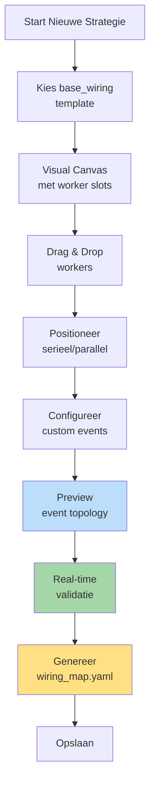

# Hoofdstuk 7: Frontend Integration

**Status:** Definitief  
**Versie:** 4.0

---

## 7.1. Strategy Builder UI: De Wiring Generator

De Strategy Builder UI is de **belangrijkste tool** in de nieuwe architectuur - het is de generator van de strategy_wiring_map.yaml.

### UI Workflow



### Canvas Layout

```
┌─────────────────────────────────────────────────────┐
│  STRATEGY BUILDER: ICT/SMC Strategy                 │
├─────────────────────────────────────────────────────┤
│                                                      │
│  ┌─── CONTEXT PHASE (Sequential) ─────────────┐   │
│  │                                              │   │
│  │  [1] ema_detector (fast)                    │   │
│  │       ↓ (UI shows flow arrow)               │   │
│  │  [2] ema_detector (slow)                    │   │
│  │       ↓                                      │   │
│  │  [3] market_structure_detector              │   │
│  │                                              │   │
│  └──────────────────────────────────────────────┘   │
│                                                      │
│  ┌─── OPPORTUNITY PHASE (Parallel) ───────────┐   │
│  │                                              │   │
│  │  [A] fvg_detector        [B] breakout_scan │   │
│  │      (parallel - UI shows side-by-side)     │   │
│  │                                              │   │
│  └──────────────────────────────────────────────┘   │
│                                                      │
│  ┌─── THREAT MONITORING (Event-Driven) ───────┐   │
│  │                                              │   │
│  │  [⚡] max_drawdown_monitor                  │   │
│  │      Triggers: LEDGER_STATE_CHANGED         │   │
│  │      Publishes: THREAT_DETECTED             │   │
│  │                                              │   │
│  └──────────────────────────────────────────────┘   │
│                                                      │
│  [Generate Wiring] [Preview Topology] [Validate]   │
└─────────────────────────────────────────────────────┘
```

### Intelligente Generatie

**Seriële detectie**:
```javascript
// UI detecteert verticale positionering
if (worker2.y > worker1.y + threshold) {
  // Genereer chain
  wiring_rules.push({
    source: {component_id: worker1.id, event_name: `${worker1.id}_OUTPUT`},
    target: {component_id: worker2.id, handler_method: "process"}
  });
}
```

**Parallelle detectie**:
```javascript
// UI detecteert horizontale positionering
if (Math.abs(worker1.y - worker2.y) < threshold) {
  // Beiden triggeren op zelfde event
  const trigger_event = findPreviousPhaseOutput();
  
  wiring_rules.push(
    {source: {event_name: trigger_event}, target: {component_id: worker1.id}},
    {source: {event_name: trigger_event}, target: {component_id: worker2.id}}
  );
}
```

**Custom events**:
```javascript
// UI leest manifest en tekent automatisch verbindingen
if (worker.manifest.capabilities?.events?.publishes) {
  for (const published_event of worker.manifest.capabilities.events.publishes) {
    // Zoek listeners
    const listeners = findWorkersListeningTo(published_event.event_name);
    
    // Teken verbindingen
    for (const listener of listeners) {
      drawEventConnection(worker, listener, published_event.event_name);
      
      // Genereer wiring rule
      wiring_rules.push({
        source: {component_id: worker.id, event_name: published_event.event_name},
        target: {component_id: listener.id, handler_method: listener.handler}
      });
    }
  }
}
```

---

## 7.2. Plugin Library & Discovery

### Multi-Dimensionale Filtering

```
┌─────────────────────────────────────────────────────┐
│  PLUGIN LIBRARY                                      │
├─────────────────────────────────────────────────────┤
│                                                      │
│  Filters:                                           │
│  Worker Type:  [OpportunityWorker ▼]               │
│  Sub-Type:     [technical_pattern ▼]               │
│  Capabilities: [☐ state] [☐ events]                │
│  Search:       [fvg______________]                  │
│                                                      │
│  ─────────────────────────────────────────────────  │
│                                                      │
│  📦 fvg_detector                    ⭐⭐⭐⭐⭐      │
│  OpportunityWorker / Technical Pattern             │
│  Badges: [StandardWorker] [Pure Logic]             │
│                                                      │
│  Requires DTOs:                                     │
│  • MarketStructureDTO                              │
│  • EMAOutputDTO                                     │
│                                                      │
│  Produces: OpportunitySignalDTO (via PUBLISH)      │
│                                                      │
│  [Add to Strategy] [View Details] [Clone]          │
│                                                      │
│  ─────────────────────────────────────────────────  │
│                                                      │
│  📦 adaptive_dca_planner            ⭐⭐⭐⭐       │
│  PlanningWorker / Entry Planning                    │
│  Badges: [EventDrivenWorker] [State] [Events]      │
│                                                      │
│  Listens to: DCA_OPPORTUNITY_SCORED, DCA_RISK      │
│  Publishes: DCA_PLAN_READY                         │
│                                                      │
│  [Add to Strategy] [Configure Events] [Docs]       │
└─────────────────────────────────────────────────────┘
```

### TypeScript Interfaces

```typescript
// frontend/src/types/plugin.ts
interface PluginCard {
  identification: {
    name: string;
    displayName: string;
    type: WorkerType;
    subtype: string;
    version: string;
  };
  
  dependencies: {
    requiresCapability: string[];
    requiresDtos: DtoReference[];
    producesDtos: DtoReference[];
  };
  
  capabilities: {
    state?: boolean;
    events?: {
      publishes: string[];
      wirings: EventWiring[];
    };
  };
  
  isCompatible: boolean;
  popularity: number;
}

interface DtoReference {
  dtoType: string;
  expectedPath: string;
}
```

---

## 7.3. Event Topology Viewer

Visuele weergave van complete event chain.

```
┌─────────────────────────────────────────────────────┐
│  EVENT TOPOLOGY: ict_smc_strategy                   │
├─────────────────────────────────────────────────────┤
│                                                      │
│              ┌──────────────┐                       │
│              │TickCache     │                       │
│              │Manager       │                       │
│              └──────┬───────┘                       │
│                     │ TICK_FLOW_START               │
│                     ▼                                │
│       ┌─────────────────────────┐                  │
│       │ ema_fast                 │                  │
│       └──────────┬──────────────┘                  │
│                  │ ema_fast_OUTPUT                  │
│                  ▼                                   │
│       ┌─────────────────────────┐                  │
│       │ ema_slow                 │                  │
│       └──────────┬──────────────┘                  │
│                  │ ema_slow_OUTPUT                  │
│           ┌──────┴──────┐                           │
│           ▼             ▼                            │
│    ┌──────────┐  ┌──────────┐                      │
│    │fvg_det   │  │breakout  │                      │
│    └────┬─────┘  └────┬─────┘                      │
│         │             │                              │
│         └──────┬──────┘                             │
│                │ SIGNAL_GENERATED                    │
│                ▼                                      │
│       ┌─────────────────┐                           │
│       │ Planning Chain   │                           │
│       └─────────────────┘                           │
│                                                      │
│  Click node for details | Export PNG                │
└─────────────────────────────────────────────────────┘
```

---

## 7.4. Trade Explorer: Causale Analyse

```
┌─────────────────────────────────────────────────────┐
│  TRADE EXPLORER                                      │
├─────────────────────────────────────────────────────┤
│                                                      │
│  Filters:                                           │
│  OpportunityID: [abc-123___] 🔍                    │
│  ThreatID:      [__________ ] 🔍                    │
│  TradeID:       [__________ ] 🔍                    │
│                                                      │
│  ─────────────────────────────────────────────────  │
│                                                      │
│  📊 Trade #42: +€125.00 (+2.5%)                    │
│  ┌────────────────────────────────────────────┐    │
│  │                                             │    │
│  │  🆔 TradeID: def-456-abc                   │    │
│  │                                             │    │
│  │  🔗 Causale Keten:                         │    │
│  │  ┌──────────────────────────────────┐     │    │
│  │  │ Geopend vanwege:                  │     │    │
│  │  │ 💡 OpportunityID: abc-123-xyz     │     │    │
│  │  │    → fvg_detector                 │     │    │
│  │  │    → Confidence: 85%              │     │    │
│  │  │    → Gap size: 8.5 pips           │     │    │
│  │  │                                    │     │    │
│  │  │ Gesloten vanwege:                 │     │    │
│  │  │ 🎯 Take profit hit                │     │    │
│  │  │    (geen threat)                  │     │    │
│  │  └──────────────────────────────────┘     │    │
│  │                                             │    │
│  │  [View Context] [Replay] [Similar Trades] │    │
│  └────────────────────────────────────────────┘    │
│                                                      │
│  📊 Trade #43: -€50.00 (-1.0%) ⚠️                 │
│  ┌────────────────────────────────────────────┐    │
│  │  🆔 TradeID: ghi-789-def                   │    │
│  │                                             │    │
│  │  🔗 Causale Keten:                         │    │
│  │  ┌──────────────────────────────────┐     │    │
│  │  │ Geopend vanwege:                  │     │    │
│  │  │ 💡 OpportunityID: jkl-012-mno     │     │    │
│  │  │                                    │     │    │
│  │  │ Gesloten vanwege:                 │     │    │
│  │  │ ⚠️ ThreatID: pqr-345-stu         │     │    │
│  │  │    → max_drawdown_monitor         │     │    │
│  │  │    → Drawdown: 2.5% (max: 2.0%)  │     │    │
│  │  │    → Emergency exit triggered     │     │    │
│  │  └──────────────────────────────────┘     │    │
│  └────────────────────────────────────────────┘    │
└─────────────────────────────────────────────────────┘
```

### BFF API Endpoints

```typescript
// GET /api/strategies/:strategyId/topology
interface EventTopologyResponse {
  nodes: TopologyNode[];
  edges: TopologyEdge[];
  validation: ValidationResult;
}

// POST /api/strategies/generate-wiring
interface GenerateWiringRequest {
  baseWiringTemplateId: string;
  workers: WorkerPlacement[];  // instance_id, plugin, position
}

interface GenerateWiringResponse {
  wiringMap: WiringMap;
  validationResult: ValidationResult;
  previewTopology: EventTopology;
}

// GET /api/trades/:tradeId/causal-chain
interface CausalChainResponse {
  tradeId: string;
  opportunityId: string;
  threatId?: string;
  timeline: CausalEvent[];
}
```

---

## 7.5. Live Monitoring Dashboard

```
┌─────────────────────────────────────────────────────┐
│  LIVE STRATEGY: ict_smc_strategy                    │
├─────────────────────────────────────────────────────┤
│                                                      │
│  📊 StrategyLedger (Operationeel)                   │
│  Capital: €10,000 | Realized: +€523 | Open: 1      │
│                                                      │
│  📜 StrategyJournal (Analytisch)                    │
│  Opportunities: 47 | Accepted: 15 | Rejected: 32    │
│                                                      │
│  ⚠️ Active Threats                                  │
│  🟡 Drawdown: 6.2% (threshold: 10%)                │
│  🟢 Volatility: Normal                              │
│                                                      │
│  📡 Real-time Event Stream                          │
│  14:25:32  TICK_FLOW_START                         │
│  14:25:33  ema_fast_OUTPUT                         │
│  14:25:34  SIGNAL_GENERATED (fvg_detector)         │
│  14:25:35  THREAT_DETECTED (drawdown_monitor)      │
│  14:25:36  OPPORTUNITY_REJECTED (risk too high)    │
│                                                      │
│  [⏸️ Pause] [🛑 Emergency Stop] [⚙️ Settings]     │
└─────────────────────────────────────────────────────┘
```

---

## 7.6. Belangrijkste UI Updates vs V3.0

### Vervallen UI Componenten ❌

- Operator Configuration UI (operators.yaml editor)
- Operator strategy visualizer
- Execution/Aggregation strategy selectors

### Nieuwe UI Componenten ✨

- **Wiring Canvas**: Visuele worker positionering
- **Event Topology Viewer**: Complete event chain visualisatie
- **Wiring Generator**: Automatische strategy_wiring_map.yaml generatie
- **Real-time Validation**: Event chain validatie tijdens design
- **DTO Dependency Graph**: Visualisatie van DTO afhankelijkheden

### Behouden UI Componenten ✅

- Plugin Library (met filtering)
- Trade Explorer (causale analyse)
- Live Monitoring
- Backtest Results
- Parameter Configuration

---

**Einde Hoofdstuk 7**

Dit hoofdstuk beschrijft de frontend integratie met focus op de Strategy Builder als centrale wiring generator en de causale analyse tools.