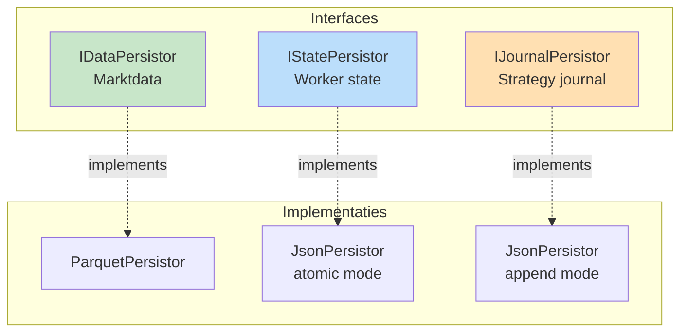

# Hoofdstuk 8: Robuustheid & Operations

**Status:** Definitief  
**Versie:** 4.0

---

## 8.1. Persistence Suite

De [`PersistorFactory`](backend/assembly/persistor_factory.py) creëert drie gespecialiseerde persistors.

### Interface-Gedreven Persistentie



### Atomic Writes (Crash-Safe)

**Pattern**: Write-Ahead Log (journaling)

```python
# backend/data/persistors/json_persistor.py
class JsonPersistor:
    """Crash-safe JSON persistence."""
    
    def save_atomic(self, data: dict) -> None:
        """
        Atomic write pattern.
        
        Stappen:
        1. Write to .journal file
        2. fsync (force to disk)
        3. Atomic rename
        """
        journal_path = f"{self.path}.journal"
        
        # 1. Write to journal
        with open(journal_path, 'w') as f:
            json.dump(data, f, indent=2)
            f.flush()
            os.fsync(f.fileno())  # 2. Force to disk
        
        # 3. Atomic rename (all-or-nothing)
        os.replace(journal_path, self.path)
    
    def load(self) -> dict:
        """Load with automatic crash recovery."""
        
        # Check for incomplete write
        if os.path.exists(f"{self.path}.journal"):
            # Crash during write - complete it
            os.replace(f"{self.path}.journal", self.path)
        
        # Load normal file
        if os.path.exists(self.path):
            with open(self.path, 'r') as f:
                return json.load(f)
        
        return {}
```

---

## 8.2. Causaal Traceability Framework

Vier getypeerde IDs voor complete "waarom"-analyse.

### ID Types

```python
# backend/dtos/pipeline/signal.py
class OpportunitySignalDTO(BaseModel):
    opportunity_id: UUID = Field(default_factory=uuid4)  # Waarom geopend?
    # ...

# backend/dtos/execution/critical_event.py
class CriticalEventDTO(BaseModel):
    threat_id: UUID = Field(default_factory=uuid4)  # Waarom gesloten?
    # ...

# backend/dtos/pipeline/routed_trade_plan.py
class RoutedTradePlanDTO(BaseModel):
    trade_id: UUID = Field(default_factory=uuid4)  # Primaire ID
    opportunity_id: UUID  # Causale link terug!
    # ...
```

### Journal Logging met Causale Links

```python
# In ExecutionWorker
class DefaultPlanExecutor(EventDrivenWorker):
    def on_plan_ready(self, plan: RoutedTradePlanDTO):
        # Execute trade
        result = self.execution_provider.place_order(...)
        
        # Log met causale context
        self.journal_writer.log_trade_opened(
            trade_id=plan.trade_id,
            opportunity_id=plan.opportunity_id,  # ← Causale link
            details={
                'entry_price': result.fill_price,
                'position_size': result.filled_quantity
            }
        )

# Later bij close
class RiskSafetyWorker(EventDrivenWorker):
    def on_threat(self, threat: CriticalEventDTO):
        # Close positions
        for position in self.ledger_provider.get_open_positions():
            self.execution_provider.close_position(...)
            
            # Log met threat link
            self.journal_writer.log_trade_closed(
                trade_id=position.trade_id,
                threat_id=threat.threat_id,  # ← Waarom gesloten
                closure_reason='emergency_exit'
            )
```

---

## 8.3. State Reconciliation (Live Trading)

Voor live omgevingen: periodieke sync met exchange.

```python
# services/reconciliation_service.py
class ReconciliationService:
    """Reconcilieert internal state met exchange."""
    
    def reconcile(self, strategy_link_id: str) -> ReconciliationResult:
        """
        Pull-based state verificatie.
        
        Workflow:
        1. Haal "truth" van exchange (via IAPIConnector)
        2. Vergelijk met StrategyLedger
        3. Corrigeer discrepanties
        4. Log verschillen
        """
        # 1. Get exchange truth
        exchange_positions = self.api_connector.get_open_positions()
        exchange_orders = self.api_connector.get_open_orders()
        
        # 2. Get internal state
        internal_positions = self.ledger_provider.get_open_positions()
        
        # 3. Compare
        discrepancies = self._find_discrepancies(
            exchange_positions,
            internal_positions
        )
        
        # 4. Correct
        for disc in discrepancies:
            self.ledger_provider.force_update(disc.correction)
            logger.critical(f"State discrepancy corrected: {disc}")
        
        return ReconciliationResult(
            discrepancies_found=len(discrepancies),
            corrections_applied=len(discrepancies)
        )
```

**Trigger**: 
- Bij startup (altijd)
- Periodiek (via Scheduler - elk 5 minuten)
- Na netwerk reconnect

---

## 8.4. Supervisor Model (Crash Recovery)

External watchdog voor automatic restart.

```python
# run_supervisor.py
"""
Supervisor watchdog voor live trading.

Monitort main process en restart bij crash.
"""
import subprocess
import time

def main():
    """Main supervisor loop."""
    
    while True:
        try:
            # Start main process
            process = subprocess.Popen([
                'python', 'services/operation_service.py',
                '--operation', 'live_operation'
            ])
            
            # Wait for completion
            return_code = process.wait()
            
            if return_code != 0:
                # Crash detected
                logger.error(f"Process crashed with code {return_code}")
                logger.info("Restarting in 5 seconds...")
                time.sleep(5)
                # Loop continues - restart
            else:
                # Normal exit
                break
                
        except KeyboardInterrupt:
            # User stop
            process.terminate()
            break
```

**Recovery bij restart**:
1. JsonPersistor.load() herstelt state (via .journal recovery)
2. ReconciliationService sync met exchange
3. EventWiringFactory rebuild adapters
4. Normal operation resume

---

## 8.5. Network Resilience

### Connection Monitoring

```python
# plugins/threat_workers/system_health/connection_monitor/worker.py
class ConnectionMonitor(EventDrivenWorker):
    """Monitort netwerk connectie."""
    
    def on_heartbeat_timeout(self, event) -> DispositionEnvelope:
        """Triggered bij gemiste heartbeat."""
        
        # Publish threat
        threat = CriticalEventDTO(
            threat_id=uuid4(),
            threat_type='CONNECTION_LOST',
            severity='CRITICAL',
            details={'last_heartbeat': event.last_seen}
        )
        
        return DispositionEnvelope(
            disposition="PUBLISH",
            event_name="THREAT_DETECTED",
            event_payload=threat
        )
```

### Circuit Breaker

```python
# plugins/execution_workers/risk_safety/circuit_breaker/worker.py
class CircuitBreaker(EventDrivenWorker):
    """Halt trading bij systeem problemen."""
    
    def on_threat(self, threat: CriticalEventDTO) -> DispositionEnvelope:
        """React op system threats."""
        
        if threat.threat_type == 'CONNECTION_LOST':
            # Halt nieuwe trades
            self._halt_flag = True
            
            # Optioneel: close alle posities
            if self.params.close_on_disconnect:
                self._emergency_close_all()
            
            return DispositionEnvelope(
                disposition="PUBLISH",
                event_name="TRADING_HALTED",
                event_payload=HaltedDTO(reason='connection_lost')
            )
        
        return DispositionEnvelope(disposition="STOP")
```

---

## 8.6. Validation Strategie

### Bootstrap Validations (Fail Fast)

```python
# Complete validation voor runtime start
try:
    # 1. Schema validatie
    config_validator.validate_all(configs)
    
    # 2. Dependency validatie
    dependency_validator.validate(
        workforce_spec,
        wiring_spec
    )
    
    # 3. Event chain validatie
    event_chain_validator.validate(wiring_spec)
    
except ValidationError as e:
    # STOP - fail fast
    logger.error(f"Validation failed: {e}")
    raise SystemExit(1)
```

### Runtime Validations

```python
# During execution
def set_result_dto(self, worker, dto):
    """Runtime validatie bij DTO placement."""
    
    # Check: DTO type matches manifest.produces_dtos
    expected_types = worker.manifest.produces_dtos
    if type(dto) not in expected_types:
        raise TypeError(
            f"Worker {worker.instance_id} produced {type(dto)} "
            f"but manifest declares {expected_types}"
        )
    
    # Place in cache
    self._cache[type(dto)] = dto
```

---

## 8.7. Operationele Monitoring

### Metrics Collectie

```python
# Platform collecteert metrics
class MetricsCollector:
    """Verzamelt operational metrics."""
    
    metrics = {
        'ticks_processed': 0,
        'events_published': 0,
        'workers_executed': 0,
        'cache_hits': 0,
        'cache_misses': 0,
        'validation_errors': 0
    }
    
    def on_tick_complete(self):
        self.metrics['ticks_processed'] += 1
    
    def on_cache_access(self, hit: bool):
        if hit:
            self.metrics['cache_hits'] += 1
        else:
            self.metrics['cache_misses'] += 1
```

### Health Checks

```python
# Health check endpoints
def health_check() -> HealthStatus:
    """System health check."""
    
    return HealthStatus(
        event_bus_alive=event_bus.is_alive(),
        strategies_running=len(operation_service.active_strategies),
        last_tick_timestamp=tick_cache_manager.last_tick_time,
        cache_memory_usage=tick_cache_manager.memory_usage(),
        validation_errors_last_hour=metrics.get_errors_last_hour()
    )
```

---

**Einde Hoofdstuk 8**

Dit hoofdstuk beschrijft robuustheid mechanismen: atomic writes, causale traceability, state reconciliation, crash recovery en validatie strategieën.