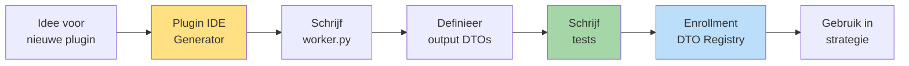
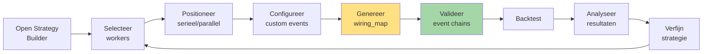
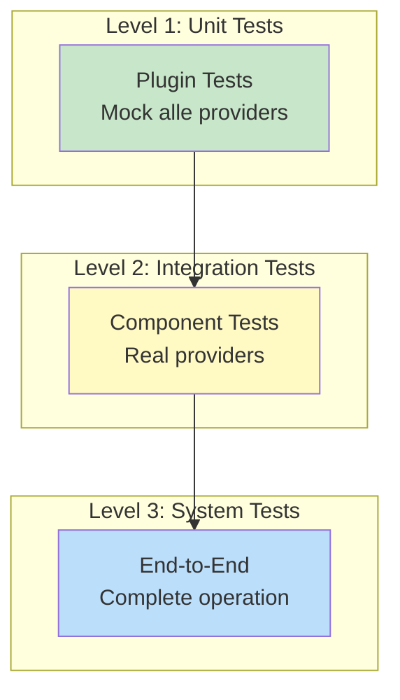

# Hoofdstuk 9: Development Strategy

**Status:** Definitief  
**Versie:** 4.0

---

## 9.1. Development Workflow

De development cyclus in V4.0 architectuur.

### Plugin Development



### Strategy Development



---

## 9.2. Plugin IDE: Intelligente Generator

### Wizard Steps

```
Step 1: Worker Type Selectie
├─ Kies categorie (Context/Opportunity/Threat/Planning/Execution)
└─ Kies sub-type (27 opties)

Step 2: Base Class Selectie
├─ StandardWorker (90%) - voor pipeline
└─ EventDrivenWorker (10%) - voor events

Step 3: Capabilities
├─ [ ] state_persistence
├─ [ ] events (indien EventDrivenWorker)
└─ [ ] journaling

Step 4: Data Contracten
├─ requires_capability: welke providers?
├─ requires_dtos: welke DTOs uit cache?
└─ produces_dtos: welke DTOs produceren?

Step 5: Parameters (schema.py)
└─ Definieer configureerbare params

Step 6: Event Config (indien events enabled)
├─ Publishes: welke events?
└─ Wirings: luister naar welke events?

Step 7: Generate
└─ Creëer complete plugin scaffold
```

### Gegenereerde Code

IDE genereert:
- `manifest.yaml` (compleet)
- `worker.py` (skeleton met TODOs)
- `schema.py` (parameter model)
- `dtos/output_dto.py` (indien produces_dtos)
- `tests/test_worker.py` (test template)

---

## 9.3. Testing Strategie

### Test Levels



### Unit Test Pattern

```python
# tests/test_worker.py
from unittest.mock import MagicMock
import pytest

class TestMyWorker:
    """Test suite voor MyWorker."""
    
    @pytest.fixture
    def mock_providers(self):
        """Setup all mocked providers."""
        return {
            'context_provider': MagicMock(spec=ITradingContextProvider),
            'ohlcv_provider': MagicMock(spec=IOhlcvProvider),
            'state_provider': MagicMock(spec=IStateProvider)
        }
    
    def test_happy_path(self, mock_providers):
        """Test normale werking."""
        # Arrange
        worker = MyWorker(params={}, **mock_providers)
        mock_providers['context_provider'].get_base_context.return_value = (
            BaseContextDTO(timestamp=..., current_price=50000.0)
        )
        
        # Act
        result = worker.process()
        
        # Assert
        assert result.disposition == "CONTINUE"
        mock_providers['context_provider'].set_result_dto.assert_called_once()
    
    def test_point_in_time_respected(self, mock_providers):
        """Verify Point-in-Time principe."""
        worker = MyWorker(params={}, **mock_providers)
        worker.process()
        
        # Verify timestamp werd meegegeven
        call_args = mock_providers['ohlcv_provider'].get_window.call_args
        assert 'timestamp' in call_args[1]
    
    def test_missing_dto_raises_error(self, mock_providers):
        """Test error bij missing required DTO."""
        worker = MyWorker(params={}, **mock_providers)
        mock_providers['context_provider'].get_required_dtos.side_effect = (
            MissingContextDataError("EMAOutputDTO missing")
        )
        
        with pytest.raises(MissingContextDataError):
            worker.process()
```

### Integration Test Pattern

```python
# tests/integration/test_context_chain.py
def test_complete_context_chain():
    """Test complete context worker chain."""
    
    # Real providers (niet gemockt)
    context_provider = TradingContextProvider()
    ohlcv_provider = OhlcvProvider(data_source=test_data)
    
    # Real workers
    ema_detector = EMADetector(params={'period': 20}, ...)
    structure_detector = MarketStructureDetector(params={}, ...)
    
    # Execute chain
    result1 = ema_detector.process()
    assert result1.disposition == "CONTINUE"
    
    # Verify DTO in cache
    cached_dtos = context_provider.get_cached_dtos()
    assert EMAOutputDTO in cached_dtos
    
    # Next worker can access
    result2 = structure_detector.process()
    # Structure detector kan EMAOutputDTO opvragen
```

---

## 9.4. Debugging Tools

### Event Tracing

```python
# tools/trace_event_flow.py
"""Trace complete event flow voor één tick."""

def trace_tick(tick_id: str):
    """
    Trace all events voor één tick.
    
    Output:
    - Timeline van alle events
    - Welke workers werden getriggerd
    - Welke DTOs werden geproduceerd
    - Welke decisions werden gemaakt
    """
    events = event_bus.get_events_for_tick(tick_id)
    
    for event in events:
        print(f"{event.timestamp} - {event.name}")
        print(f"  Publisher: {event.source}")
        print(f"  Subscribers: {event.subscribers}")
        if event.payload:
            print(f"  Payload: {event.payload}")
```

### Wiring Validator Tool

```bash
# Command line tool
python tools/validate_wiring.py --strategy ict_smc_strategy

Output:
✓ All events have publishers
✓ No circular dependencies
⚠ Event 'debug_trace' has no subscribers
✓ DTO dependencies satisfied

Summary: Valid with 1 warning
```

---

## 9.5. Best Practices

### DO's ✅

**Plugin Development**:
- Start met Plugin IDE generator
- Schrijf tests eerst (TDD)
- Mock alle providers in unit tests
- Gebruik DTO Registry voor imports
- Declareer alle dependencies in manifest

**Strategy Development**:
- Begin met simpele base_wiring template
- Test elke worker apart eerst
- Gebruik UI voor wiring generatie
- Valideer event chains voor runtime
- Analyseer causale data in Trade Explorer

**Testing**:
- Unit tests: mock providers
- Integration tests: real components
- E2E tests: complete backtest
- 100% coverage voor enrollment
- Test Point-in-Time correctheid

### DON'Ts ❌

**Plugin Development**:
- Geen globals of singletons in worker
- Geen hardcoded paths naar DTOs
- Geen side-effects zonder providers
- Geen EventBus directe toegang
- Geen tests skippen

**Strategy Development**:
- Geen manual wiring_map editing
- Geen circular event dependencies
- Geen workers zonder manifest
- Geen productie zonder backtest
- Geen validatie overslaan

---

**Einde Hoofdstuk 9**

Dit hoofdstuk beschrijft de development workflow, tools en best practices voor plugin en strategy development in de V4.0 architectuur.