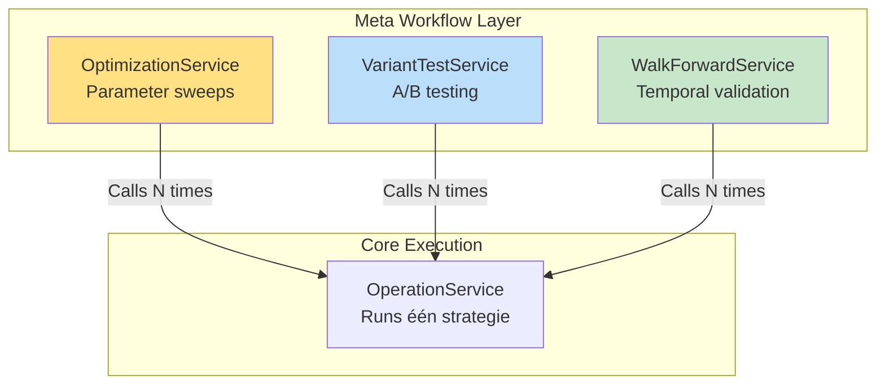

# Hoofdstuk 10: Meta Workflows

**Status:** Definitief  
**Versie:** 4.0

---

## 10.1. Meta Workflows Concept

Meta workflows zijn **hogere-orde analyses** die de OperationService herhaaldelijk aanroepen met verschillende configuraties.



**Kernprincipe**: OperationService is de "motor", meta workflows zijn de "onderzoekers".

---

## 10.2. OptimizationService

Systematisch doorzoeken van parameter ruimte.

### Configuration

```yaml
# config/optimizations/optimize_fvg_params.yaml
optimization_config:
  name: "FVG Parameter Sweep"
  base_operation: "config/operations/ict_backtest.yaml"
  base_strategy: "config/runs/ict_smc_strategy.yaml"
  
  parameter_space:
    - worker_instance: "fvg_det_1"
      parameters:
        min_gap_size:
          start: 3
          end: 10
          step: 1
        require_structure_break:
          values: [true, false]
  
  optimization_target:
    primary_metric: "sharpe_ratio"
    constraints:
      min_trades: 10
      max_drawdown: 15.0
```

### Implementation

```python
# services/meta_workflows/optimization_service.py
class OptimizationService:
    """Parameter optimization via grid search."""
    
    def run_optimization(
        self,
        config: OptimizationConfig
    ) -> OptimizationResult:
        """
        Run complete parameter sweep.
        
        Workflow:
        1. Generate parameter combinations
        2. Create BuildSpecs voor elke combinatie
        3. Run via OperationService
        4. Collect results
        5. Analyze best performers
        """
        # 1. Generate combinations
        combinations = self._generate_parameter_grid(
            config.parameter_space
        )
        
        # 2. Run parallel backtests
        results = []
        for combo in combinations:
            # Modify strategy_blueprint params
            modified_blueprint = self._apply_params(
                config.base_strategy,
                combo
            )
            
            # Run backtest
            result = self.operation_service.run_backtest(
                modified_blueprint
            )
            results.append(result)
        
        # 3. Analyze
        best = self._find_best(results, config.optimization_target)
        
        return OptimizationResult(
            total_runs=len(results),
            best_params=best.parameters,
            best_metrics=best.metrics,
            all_results=results
        )
```

---

## 10.3. VariantTestService

A/B testing van strategische keuzes.

### Configuration

```yaml
# config/variants/exit_strategy_test.yaml
variant_config:
  name: "Exit Strategy Comparison"
  base_operation: "config/operations/ict_backtest.yaml"
  base_strategy: "config/runs/ict_smc_strategy.yaml"
  
  variants:
    - name: "liquidity_targets"
      description: "ICT liquidity-based exits"
      overrides:
        workforce:
          planning_workers:
            exit_planning:
              - instance_id: "exit_1"
                plugin: "liquidity_target_exit"
                params:
                  target_opposite_liquidity: true
    
    - name: "atr_based"
      description: "ATR-based stops"
      overrides:
        workforce:
          planning_workers:
            exit_planning:
              - instance_id: "exit_1"
                plugin: "atr_based_stops"
                params:
                  atr_multiplier: 2.0
```

### Comparison Output

```
┌─────────────────────────────────────────────────────┐
│  VARIANT COMPARISON RESULTS                          │
├─────────────────────────────────────────────────────┤
│                                                      │
│  Metric              │ Variant A  │ Variant B        │
│  ────────────────────┼────────────┼──────────        │
│  Sharpe Ratio        │ 2.45       │ 2.78 ⭐        │
│  Total Return        │ 34.5%      │ 31.2%           │
│  Max Drawdown        │ 8.2%       │ 5.4% ⭐        │
│  Win Rate            │ 58.3%      │ 61.5% ⭐        │
│  Total Trades        │ 127        │ 98              │
│                                                      │
│  Causale Analyse:                                   │
│  Opportunities Rejected:                            │
│    Variant A: 118 (48%)                             │
│    Variant B: 147 (60%) - more defensive            │
│                                                      │
│  Top Rejection Reasons (Variant B):                 │
│    • MAX_DRAWDOWN: 67 (45%)                         │
│    • VOLATILITY_SPIKE: 43 (29%)                     │
│    • MARKET_RISK: 37 (25%)                          │
│                                                      │
│  [Export Report] [View Details] [Apply Winner]     │
└─────────────────────────────────────────────────────┘
```

---

## 10.4. ParallelRunService

Herbruikbare backend component voor parallelle executie.

```python
# services/meta_workflows/parallel_run_service.py
from concurrent.futures import ProcessPoolExecutor

class ParallelRunService:
    """Executes multiple operations in parallel."""
    
    def run_parallel(
        self,
        build_specs_list: List[BuildSpecs],
        max_workers: int = None
    ) -> List[BacktestResult]:
        """
        Run operations parallel.
        
        Args:
            build_specs_list: List van BuildSpecs voor elke run
            max_workers: Max parallel processes
        
        Returns:
            List van resultaten
        """
        max_workers = max_workers or os.cpu_count()
        
        with ProcessPoolExecutor(max_workers=max_workers) as executor:
            futures = [
                executor.submit(self._run_single, specs)
                for specs in build_specs_list
            ]
            
            results = []
            for future in as_completed(futures):
                try:
                    result = future.result()
                    results.append(result)
                except Exception as e:
                    logger.error(f"Run failed: {e}")
        
        return results
    
    def _run_single(self, build_specs: BuildSpecs) -> BacktestResult:
        """Run één backtest in isolated process."""
        # Create isolated OperationService
        operation_service = OperationService(...)
        
        # Run backtest
        return operation_service.run_from_specs(build_specs)
```

---

## 10.5. WalkForwardService (Voorbeeld)

Tijd-gebaseerde validatie voor robustness.

```python
# services/meta_workflows/walk_forward_service.py
class WalkForwardService:
    """Walk-forward analysis."""
    
    def run_walk_forward(
        self,
        config: WalkForwardConfig
    ) -> WalkForwardResult:
        """
        Walk-forward analyse.
        
        Workflow:
        1. Optimaliseer op in-sample periode
        2. Test op out-of-sample periode  
        3. Roll forward
        4. Repeat
        """
        results = []
        
        for window in config.time_windows:
            # 1. Optimize in-sample
            best_params = self.optimization_service.optimize(
                data_range=window.in_sample
            )
            
            # 2. Test out-of-sample
            oos_result = self.operation_service.run_backtest(
                params=best_params,
                data_range=window.out_of_sample
            )
            
            results.append(oos_result)
        
        # Aggregate out-of-sample results
        return WalkForwardResult(
            oos_results=results,
            aggregate_metrics=self._aggregate(results)
        )
```

---

## 10.6. Meta Workflow Impact op Architectuur

### Geen Aanpassingen Nodig

De meta workflows werken **zonder wijzigingen** aan kernarchitectuur:

✅ **OperationService**: Blijft pure executor  
✅ **BuildSpecs**: Kunnen programmatisch gewijzigd worden  
✅ **ConfigTranslator**: Kan BuildSpecs uit gewijzigde configs maken  
✅ **Factories**: Werken met any BuildSpecs

### Gebruik van BuildSpecs

```python
# In OptimizationService
for param_combo in combinations:
    # Start met base specs
    modified_specs = base_build_specs.copy()
    
    # Wijzig workforce_spec
    for worker_spec in modified_specs.workforce_spec:
        if worker_spec.instance_id == target_worker:
            worker_spec.params.update(param_combo)
    
    # Run met modified specs
    result = operation_service.run_from_specs(modified_specs)
```

---

**Einde Hoofdstuk 10**

Dit hoofdstuk beschrijft meta workflows (Optimization, Variant Testing, Walk-Forward) die de OperationService als motor gebruiken zonder aanpassingen aan kernarchitectuur.