# 00_INDEX.md

# S1mpleTrader V2 Architectuur - Index

**Versie:** 4.0  
**Status:** Definitief  
**Datum:** 2025-10-23

---

## Overzicht Herziene Documentatie

Deze documentatie beschrijft de **definitieve V4.0 architectuur** van S1mpleTrader, waarbij alle addenda volledig zijn geïntegreerd. De architectuur is gebaseerd op drie fundamentele paradigma's:

1. **Platgeslagen Event-Driven Netwerk** (geen Operators)
2. **Point-in-Time DTO-Gedreven Data** (geen enriched_df)
3. **BuildSpec-Gedreven Bootstrap** (ConfigTranslator)

---

## Hoofddocument

### [Voorwoord](Voorwoord.md)
- De Drie Fundamentele Paradigma's
- Architectuur Overzicht
- Kernprincipes
- Navigatie

---

## Afzonderlijke Hoofdstukken

### DEEL I: FUNDAMENTEN & COMMUNICATIE

#### [Hoofdstuk 1: Communicatie Architectuur](H1_Communicatie_Architectuur.md)
- Platgeslagen Event-Driven Netwerk
- EventAdapter als generieke uitvoerder
- EventWiringFactory als configurator
- Event Types (System vs Custom)
- Bootstrap Sequence

#### [Hoofdstuk 2: De Drie Configuratielagen & BuildSpecs](H2_Configuratielagen_BuildSpecs.md)
- Gelaagde configuratie (Platform, Operation, Strategy)
- ConfigTranslator & BuildSpecs
- OperationService als levenscyclus manager
- Validatie (Fail Fast)

#### [Hoofdstuk 3: Het Data Landschap (Point-in-Time)](H3_Data_Landschap_Point_in_Time.md)
- Minimale TradingContext
- ITradingContextProvider & Tick Cache
- Platform Providers (Toolbox)
- DispositionEnvelope voor flow control
- DTO Registry & Enrollment

### DEEL II: COMPONENTEN

#### [Hoofdstuk 4: Plugin Anatomie](H4_Plugin_Anatomie.md)
- Plugin mappenstructuur
- Manifest.yaml specificatie
- Worker.py implementatie (StandardWorker vs EventDrivenWorker)
- Schema.py parameter validatie
- DTO definitie & enrollment
- Testing requirements
- Complete voorbeelden

#### [Hoofdstuk 5: Worker Ecosysteem](H5_Worker_Ecosysteem.md)
- De 5 worker categorieën:
  - ContextWorker (7 sub-types)
  - OpportunityWorker (7 sub-types)
  - ThreatWorker (5 sub-types)
  - PlanningWorker (4 sub-types)
  - ExecutionWorker (4 sub-types)
- Input/output patronen per categorie
- Causale ID generatie
- Manifest templates
- Complete code voorbeelden

### DEEL III: ORKESTRATIE & WORKFLOW

#### [Hoofdstuk 6: Workflow Orkestratie](H6_Workflow_Orkestratie.md)
- Platgeslagen model (geen Operators)
- Complete tick lifecycle
- Flow patronen (sequentieel, parallel, event-driven)
- Strategy Builder UI wiring generatie
- Causale traceerbaarheid
- Feedback loops
- Voordelen vs Operator model

### DEEL IV: FRONTEND & GEBRUIKER

#### [Hoofdstuk 7: Frontend Integration](H7_Frontend_Integration.md)
- Strategy Builder UI (wiring generator)
- Plugin Library & Discovery
- Event Topology Viewer
- Trade Explorer (causale analyse)
- Live Monitoring Dashboard
- BFF API endpoints
- TypeScript interfaces

### DEEL V: OPERATIONS & DEVELOPMENT

#### [Hoofdstuk 8: Robuustheid & Operations](H8_Robuustheid_Operations.md)
- Persistence Suite (IDataPersistor, IStatePersistor, IJournalPersistor)
- Atomic writes & crash recovery
- Causaal Traceability Framework
- State reconciliation (live trading)
- Supervisor model
- Network resilience
- Health checks

#### [Hoofdstuk 9: Development Strategy](H9_Development_Strategy.md)
- Plugin development workflow
- Strategy development workflow
- Plugin IDE generator
- Testing strategie (Unit, Integration, E2E)
- Debugging tools
- Best practices DO's & DON'Ts

#### [Hoofdstuk 10: Meta Workflows](H10_Meta_Workflows.md)
- OptimizationService (parameter sweeps)
- VariantTestService (A/B testing)
- WalkForwardService (temporal validation)
- ParallelRunService (parallel execution)
- Impact op architectuur
- BuildSpecs usage in meta workflows

### DEEL VI: STANDAARDEN & BIJLAGEN

#### [Hoofdstuk 11: Coding Standards](H11_Coding_Standards.md)
- Code kwaliteit (PEP 8)
- Contract-gedreven development
- Dependency injection
- DTO best practices
- Point-in-Time principe
- Testing standards
- Internationalisatie
- SOLID principles
- Quick reference checklists

#### [Bijlage A: Terminologie](Bijlage_A_Terminologie.md)
- Alfabetische terminologie lijst
- Deprecated terms (V3.0 → V4.0)
- Afkortingen

---

## Belangrijkste Wijzigingen vs V3.0

### Vervallen Concepten ❌

- BaseOperator klasse
- operators.yaml configuratie
- Operator-gedreven orkestratie
- enriched_df in TradingContext
- Impliciete data doorgifte

### Nieuwe Concepten ✨

- EventAdapter per component
- BuildSpecs & ConfigTranslator
- ITradingContextProvider
- Tick Cache (DTO-only)
- DispositionEnvelope
- UI-gegenereerde strategy_wiring_map
- DTO Registry
- Point-in-Time garantie

### Behouden Concepten ✅

- 5 Worker categorieën
- 27 Sub-types
- Causaal ID Framework
- Persistence Suite interfaces
- Plugin-First filosofie
- SOLID principes

---

## Leesaanbevelingen

### Voor Nieuwe Developers

1. Start met **Voorwoord** (paradigma's begrijpen)
2. Lees **H2: Configuratielagen** (hoe configuratie werkt)
3. Lees **H3: Data Landschap** (hoe data flow werkt)
4. Lees **H4: Plugin Anatomie** (hoe een plugin bouwen)
5. Lees **H5: Worker Ecosysteem** (welk worker type kiezen)

### Voor Architects

1. Lees **H1: Communicatie** (EventAdapter model)
2. Lees **H6: Workflow** (platgeslagen orkestratie)
3. Lees **H2: Configuratielagen** (BuildSpecs filosofie)
4. Lees **Bijlage A** (terminologie)

### Voor Migratie van V3.0

1. Lees **Bijlage A** (deprecated terms)
2. Lees **Voorwoord** (paradigma shifts)
3. Lees **Bijlage B: Migratie Gids** (komt binnenkort)

---

## Quick Reference

### Kerncomponenten

| Component | Locatie | Type |
|-----------|---------|------|
| ConfigTranslator | `backend/config/translator.py` | Backend |
| EventAdapter | `backend/assembly/event_adapter.py` | Backend |
| EventWiringFactory | `backend/assembly/event_wiring_factory.py` | Backend |
| TickCacheManager | `backend/core/tick_cache_manager.py` | Backend |
| ITradingContextProvider | `backend/core/interfaces/context_provider.py` | Interface |
| OperationService | `services/operation_service.py` | Service |

### Configuratie Bestanden

| Bestand | Laag | Doel |
|---------|------|------|
| platform.yaml | 1 | Globale instellingen |
| operation.yaml | 2 | Werkruimte definitie |
| connectors.yaml | 2 | Exchange verbindingen |
| schedule.yaml | 2 | Tijd-triggers |
| platform_wiring_map.yaml | 2 | Singleton bedrading |
| strategy_blueprint.yaml | 3 | Workforce definitie |
| strategy_wiring_map.yaml | 3 | Worker bedrading (UI) |

### Key Interfaces

- `ITradingContextProvider` - Tick Cache toegang
- `IOhlcvProvider` - Historische data
- `IStateProvider` - Worker state
- `IJournalWriter` - Logging
- `ILedgerProvider` - Financiële staat
- `IExecutionProvider` - Trade execution

---

## Contact & Vragen

Voor vragen over de architectuur of suggesties voor verbeteringen, zie de documentatie in de originele `docs/system/` directory of raadpleeg het development team.

---

**Laatst bijgewerkt:** 2025-10-23  
**Volgende review:** Bij architectuur wijzigingen

---

# 01_Communicatie_Architectuur.md

# Hoofdstuk 1: Communicatie Architectuur

**Status:** Definitief  
**Versie:** 4.0

---

## 1.1. Kernprincipe: Platgeslagen Event-Driven Netwerk

De communicatie architectuur van S1mpleTrader is gebaseerd op één fundamenteel principe:

> **Elke component krijgt zijn eigen EventAdapter. Er zijn geen Operators.**

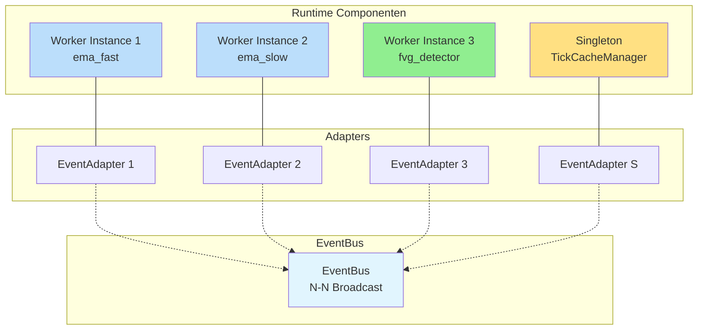

**Kenmerken**:
- ✅ Elke worker instance heeft precies één adapter
- ✅ Elke adapter weet exact wat hij moet doen (via configuratie)
- ✅ EventBus is pure N-N broadcast (geen intelligentie)
- ✅ Bedrading volledig expliciet in strategy_wiring_map.yaml

---

## 1.2. De EventAdapter: Generieke Communicatie Uitvoerder

De [`EventAdapter`](backend/assembly/event_adapter.py) is een generieke component zonder business logica. Zijn gedrag wordt **volledig bepaald door configuratie**.

### Configuratie Structuur

Elke adapter krijgt tijdens bootstrap van de [`EventWiringFactory`](backend/assembly/event_wiring_factory.py) zijn configuratie:

```python
# backend/assembly/event_adapter.py
from typing import Dict, List, Callable, Any
from pydantic import BaseModel

class AdapterConfig(BaseModel):
    """Configuratie voor één EventAdapter."""
    
    # Subscriptions: welke events triggeren deze component?
    subscriptions: List[str]  # event namen
    
    # Handler mapping: event_name -> method_name
    handler_mapping: Dict[str, str]
    
    # Publication config: wat mag deze adapter publiceren?
    system_event_publications: Dict[str, str]  # disposition -> event_name
    allowed_custom_events: List[str]
    flow_stop_event: str

class EventAdapter:
    """Generieke adapter - gedrag via configuratie."""
    
    def __init__(
        self,
        component: Any,  # Worker of Singleton
        config: AdapterConfig,
        event_bus: EventBus,
        context_provider: ITradingContextProvider
    ):
        self._component = component
        self._config = config
        self._event_bus = event_bus
        self._context_provider = context_provider
        
        # Abonneer op geconfigureerde events
        for event_name in config.subscriptions:
            handler = self._create_handler(event_name)
            event_bus.subscribe(event_name, handler)
    
    def _create_handler(self, event_name: str) -> Callable:
        """Creëer handler voor specifiek event."""
        def handler(payload: Any) -> None:
            # Zoek welke methode aangeroepen moet worden
            method_name = self._config.handler_mapping.get(event_name)
            if not method_name:
                return
            
            # Roep component aan
            method = getattr(self._component, method_name)
            result = method(payload) if payload else method()
            
            # Verwerk DispositionEnvelope
            self._process_disposition(result)
        
        return handler
    
    def _process_disposition(self, envelope: DispositionEnvelope) -> None:
        """Verwerk worker output envelope."""
        
        if envelope.disposition == "CONTINUE":
            # Publiceer systeem event voor volgende worker
            system_event = self._config.system_event_publications.get("CONTINUE")
            if system_event:
                # Haal data uit cache voor payload
                payload = self._create_system_payload(system_event)
                self._event_bus.publish(system_event, payload)
        
        elif envelope.disposition == "PUBLISH":
            # Valideer custom event
            if envelope.event_name not in self._config.allowed_custom_events:
                raise PermissionError(
                    f"Component not allowed to publish '{envelope.event_name}'"
                )
            
            # Publiceer custom event
            self._event_bus.publish(
                envelope.event_name,
                envelope.event_payload
            )
        
        elif envelope.disposition == "STOP":
            # Publiceer flow stop event
            self._event_bus.publish(
                self._config.flow_stop_event,
                FlowStopDTO()
            )
```

### Adapter Configuratie Voorbeeld

Voor worker `ema_fast`:

```python
AdapterConfig(
    subscriptions=["TICK_FLOW_START"],
    handler_mapping={
        "TICK_FLOW_START": "process"
    },
    system_event_publications={
        "CONTINUE": "ema_fast_OUTPUT"
    },
    allowed_custom_events=[],  # Geen custom events
    flow_stop_event="ema_fast_STOP"
)
```

Voor event-aware worker `emergency_news_monitor`:

```python
AdapterConfig(
    subscriptions=["NEWS_RECEIVED"],
    handler_mapping={
        "NEWS_RECEIVED": "on_news"
    },
    system_event_publications={},
    allowed_custom_events=["EMERGENCY_HALT_TRADING"],  # Uit manifest
    flow_stop_event="news_monitor_STOP"
)
```

---

## 1.3. EventWiringFactory: De Configurator

De [`EventWiringFactory`](backend/assembly/event_wiring_factory.py) creëert en configureert alle adapters op basis van de wiring_specs uit BuildSpecs.

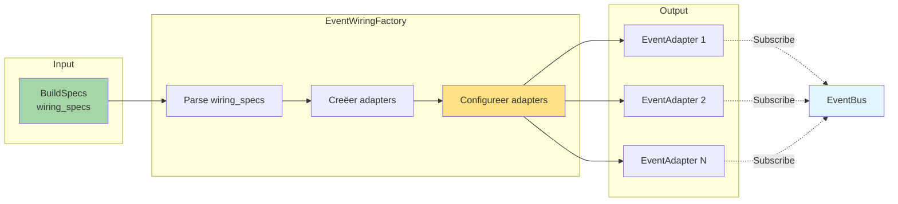

**Implementatie**:

```python
# backend/assembly/event_wiring_factory.py
class EventWiringFactory:
    """Creëert en configureert EventAdapters uit BuildSpecs."""
    
    def wire_all_from_spec(
        self,
        platform_wiring_spec: List[WiringRule],
        strategy_wiring_spec: List[WiringRule],
        worker_instances: Dict[str, Any],
        singleton_instances: Dict[str, Any]
    ) -> Dict[str, EventAdapter]:
        """
        Hoofdmethode: bedraad alles.
        
        Args:
            platform_wiring_spec: Bedrading voor singletons
            strategy_wiring_spec: Bedrading voor workers
            worker_instances: Map van instance_id -> worker
            singleton_instances: Map van singleton_id -> singleton
        
        Returns:
            Map van component_id -> EventAdapter
        """
        adapters = {}
        
        # Wire platform singletons
        for rule in platform_wiring_spec:
            adapter = self._create_adapter_for_rule(
                rule, 
                singleton_instances
            )
            adapters[rule.target['component_id']] = adapter
        
        # Wire strategy workers
        for rule in strategy_wiring_spec:
            adapter = self._create_adapter_for_rule(
                rule,
                worker_instances
            )
            adapters[rule.target['component_id']] = adapter
        
        return adapters
    
    def _create_adapter_for_rule(
        self,
        rule: WiringRule,
        component_map: Dict[str, Any]
    ) -> EventAdapter:
        """Creëer adapter voor één wiring rule."""
        
        component = component_map[rule.target['component_id']]
        
        # Bouw adapter configuratie
        config = self._build_adapter_config(rule, component)
        
        # Creëer adapter
        return EventAdapter(
            component=component,
            config=config,
            event_bus=self._event_bus,
            context_provider=self._context_provider
        )
    
    def _build_adapter_config(
        self,
        rule: WiringRule,
        component: Any
    ) -> AdapterConfig:
        """Bouw AdapterConfig uit WiringRule."""
        
        # Verzamel alle rules voor dit component
        all_rules = self._find_all_rules_for_component(
            rule.target['component_id']
        )
        
        # Extract subscriptions
        subscriptions = [r.source['event_name'] for r in all_rules]
        
        # Extract handler mapping
        handler_mapping = {
            r.source['event_name']: r.target['handler_method']
            for r in all_rules
        }
        
        # Extract publication config
        system_pubs = self._extract_system_publications(all_rules)
        custom_events = self._extract_custom_events(component)
        
        return AdapterConfig(
            subscriptions=subscriptions,
            handler_mapping=handler_mapping,
            system_event_publications=system_pubs,
            allowed_custom_events=custom_events,
            flow_stop_event=f"{component.instance_id}_STOP"
        )
```

---

## 1.4. De EventBus: Pure N-N Broadcast

De [`EventBus`](backend/core/event_bus.py) is extreem simpel - een pure publish/subscribe bus zonder intelligentie.

```python
# backend/core/event_bus.py
from typing import Dict, List, Callable, Any
from threading import Lock

class EventBus:
    """Pure N-N broadcast bus."""
    
    def __init__(self):
        self._subscriptions: Dict[str, List[Callable]] = {}
        self._lock = Lock()
    
    def subscribe(self, event_name: str, handler: Callable) -> None:
        """Subscribe handler to event."""
        with self._lock:
            if event_name not in self._subscriptions:
                self._subscriptions[event_name] = []
            self._subscriptions[event_name].append(handler)
    
    def publish(self, event_name: str, payload: Any = None) -> None:
        """Publish event to all subscribers."""
        with self._lock:
            subscribers = self._subscriptions.get(event_name, [])
        
        for handler in subscribers:
            try:
                handler(payload)
            except Exception as e:
                # Log maar crash niet
                logger.error(f"Handler error for '{event_name}': {e}")
```

**Geen**:
- ❌ Routing logica
- ❌ Payload transformatie
- ❌ Filtering
- ❌ Prioriteiten

**Wel**:
- ✅ Subscribe
- ✅ Publish
- ✅ Thread-safe

---

## 1.5. Event Types: System vs Custom

De architectuur onderscheidt twee types events:

### System Events (Flow Control)

**Doel**: Interne flow control tussen workers in de standaard pipeline.

**Kenmerken**:
- Unieke namen gegenereerd door UI (bv. `ema_fast_OUTPUT`, `TICK_FLOW_START`)
- Bevatten **altijd** een payload (Systeem DTO of data uit cache)
- Gedefinieerd in strategy_wiring_map.yaml
- Niet zichtbaar voor plugin developer

**Voorbeelden**:
- `TICK_FLOW_START` - Start van nieuwe tick
- `ema_fast_OUTPUT` - Output van ema_fast worker
- `CONTEXT_PHASE_COMPLETE` - Context verrijking klaar

### Custom Events (Plugin-to-Plugin)

**Doel**: Expliciete communicatie tussen event-aware plugins.

**Kenmerken**:
- Namen gedefinieerd in manifest.yaml
- Bevatten meestal **geen** payload (data in Tick Cache)
- Gedeclareerd in manifest.publishes
- Expliciet zichtbaar voor developer

**Voorbeelden**:
- `SIGNAL_GENERATED` - Opportunity gedetecteerd
- `THREAT_DETECTED` - Risico gevonden
- `EMERGENCY_HALT_TRADING` - Noodstop signaal

**Manifest declaratie**:

```yaml
# manifest.yaml van emergency_news_monitor
capabilities:
  events:
    enabled: true
    publishes:
      - event_name: "EMERGENCY_HALT_TRADING"
        description: "Published when high-impact news detected"
    wirings:
      - listens_to: "NEWS_RECEIVED"
        invokes:
          method: "on_news"
```

---

## 1.6. Wiring Maps: Platform vs Strategy

De bedrading wordt gedefinieerd in twee aparte configuraties:

### Platform Wiring Map (Statisch)

**Bestand**: [`platform_wiring_map.yaml`](config/platform_wiring_map.yaml)

**Doel**: Bedraadt operation-brede singleton componenten.

```yaml
# config/platform_wiring_map.yaml
wiring_rules:
  - wiring_id: "raw_tick_to_cache_manager"
    source:
      component_id: "ExecutionEnvironment"
      event_name: "RAW_TICK"
      event_type: "SystemEvent"
    target:
      component_id: "TickCacheManager"
      handler_method: "on_raw_tick"
  
  - wiring_id: "ledger_to_aggregator"
    source:
      component_id: "StrategyLedger"
      event_name: "LEDGER_STATE_CHANGED"
      event_type: "SystemEvent"
    target:
      component_id: "AggregatedLedger"
      handler_method: "on_ledger_update"
```

### Strategy Wiring Map (UI-Gegenereerd)

**Bestand**: [`strategy_wiring_map.yaml`](config/runs/strategy_wiring_map.yaml)

**Doel**: Bedraadt alle workers voor één specifieke strategie.

**Gegenereerd door**: Strategy Builder UI

**Basis**: Template uit [`base_wiring.yaml`](config/base_wiring.yaml) + plugin manifesten + gebruiker keuzes

```yaml
# config/runs/ict_smc_wiring_v1.yaml (gegenereerd)
wiring_rules:
  # Start van flow
  - wiring_id: "flow_start_to_ema_fast"
    source:
      component_id: "TickCacheManager"
      event_name: "TICK_FLOW_START"
      event_type: "SystemEvent"
    target:
      component_id: "ema_fast"
      handler_method: "process"
  
  # Sequentiële keten (UI detecteert dit uit positionering)
  - wiring_id: "ema_fast_to_ema_slow"
    source:
      component_id: "ema_fast"
      event_name: "ema_fast_OUTPUT"
      event_type: "SystemEvent"
    target:
      component_id: "ema_slow"
      handler_method: "process"
  
  # Van context naar opportunity
  - wiring_id: "context_to_fvg"
    source:
      component_id: "ema_slow"
      event_name: "ema_slow_OUTPUT"
      event_type: "SystemEvent"
    target:
      component_id: "fvg_det_1"
      handler_method: "process"
  
  # Custom event (uit manifest van news monitor)
  - wiring_id: "news_to_emergency_exit"
    source:
      component_id: "news_monitor"
      event_name: "EMERGENCY_HALT_TRADING"
      event_type: "CustomEvent"
    target:
      component_id: "emergency_exit_agent"
      handler_method: "on_emergency_halt"
```

---

## 1.7. Strategy Builder UI: Intelligente Wiring Generatie

De UI is de **generator** van de strategy_wiring_map.yaml.

### Workflow in UI

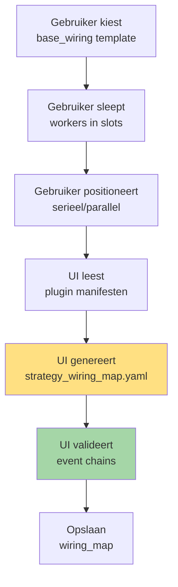

**Intelligente generatie**:

1. **Seriële positionering**: UI genereert chain
   ```
   ema_fast → ema_slow → fvg_detector
   
   Genereert:
   - TICK_FLOW_START → ema_fast
   - ema_fast_OUTPUT → ema_slow
   - ema_slow_OUTPUT → fvg_detector
   ```

2. **Parallelle positionering**: UI genereert fan-out/fan-in
   ```
   TICK_FLOW_START → ema_fast
   TICK_FLOW_START → ema_slow
   (beide outputs → volgende fase)
   ```

3. **Custom events**: UI leest manifest en tekent automatisch verbindingen
   ```
   manifest declares:
   publishes: ["EMERGENCY_HALT"]
   
   UI finds listeners:
   emergency_exit_agent listens to "EMERGENCY_HALT"
   
   UI genereert:
   - EMERGENCY_HALT → emergency_exit_agent
   ```

---

## 1.8. Event Chain Validation

De [`EventChainValidator`](backend/assembly/event_chain_validator.py) analyseert de complete event topologie **voor** runtime start.

### Validatie Checks

```python
# backend/assembly/event_chain_validator.py
class EventChainValidator:
    """Valideert event chain integriteit."""
    
    def validate(self, wiring_specs: List[WiringRule]) -> ValidationResult:
        """
        Complete event chain validatie.
        
        Checks:
        1. Alle events hebben publishers
        2. Geen circular dependencies
        3. Orphaned events (warning)
        4. Type consistency
        """
        result = ValidationResult()
        
        # Bouw event graph
        graph = self._build_event_graph(wiring_specs)
        
        # Check 1: Publishers
        for event in graph.get_all_events():
            if graph.has_subscribers(event) and not graph.has_publishers(event):
                result.add_error(
                    f"Event '{event}' has subscribers but no publishers!"
                )
        
        # Check 2: Circular dependencies (DFS)
        cycles = self._detect_cycles(graph)
        for cycle in cycles:
            result.add_error(f"Circular dependency: {' → '.join(cycle)}")
        
        # Check 3: Orphaned events
        for event in graph.get_all_events():
            if graph.has_publishers(event) and not graph.has_subscribers(event):
                result.add_warning(
                    f"Event '{event}' published but no subscribers"
                )
        
        return result
```

**Voorbeeld validatie output**:

```
✓ Check 1: All events have publishers (12 events checked)
✓ Check 2: No circular dependencies detected
⚠ Check 3: Event 'debug_trace' has no subscribers (is this intentional?)
✓ Check 4: Payload types consistent

SUCCESS: Event chain valid with 0 errors, 1 warning
```

---

## 1.9. Bootstrap Sequence

De complete startup volgorde:

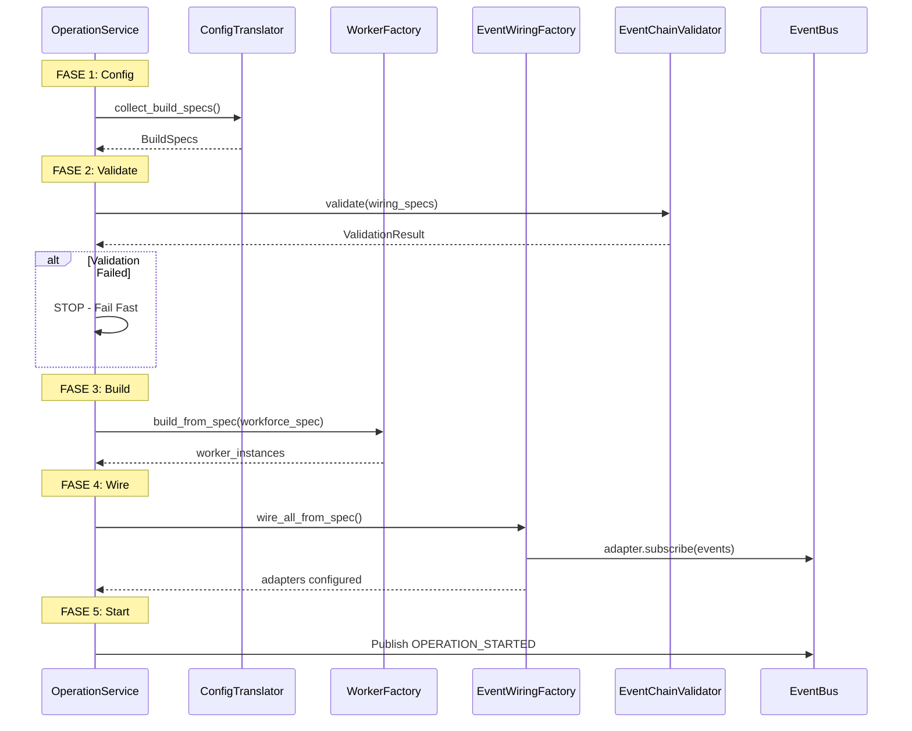

---

## 1.10. Voordelen van dit Model

### Versus Operator Model

| Aspect | Oude Model (Operators) | Nieuwe Model (Platgeslagen) |
|--------|----------------------|---------------------------|
| **Complexiteit** | Operator laag + Adapters | Alleen Adapters |
| **Configuratie** | operators.yaml + wiring_map | strategy_wiring_map (UI) |
| **Transparantie** | Impliciet via operator strategie | Expliciet in wiring_map |
| **Flexibiliteit** | Beperkt door operator categories | Volledig vrij |
| **Testbaarheid** | Mock operator + workers | Mock adapter config |

### Kernvoordelen

✅ **Maximale SRP**: Elke component doet precies één ding
✅ **Expliciete Flow**: Exact zichtbaar in configuratie
✅ **UI-Driven**: Strategy Builder genereert bedrading
✅ **Valideerbaar**: Complete event chain analyse voor runtime
✅ **Flexibel**: Ondersteunt complexe workflows zonder code wijzigingen

---

**Einde Hoofdstuk 1**

Dit hoofdstuk beschrijft de fundamentele communicatie architectuur zonder Operators. Alle orkestratie gebeurt via expliciet bedrade EventAdapters, volledig gestuurd door de UI-gegenereerde strategy_wiring_map.yaml.

---

# 02_Configuratielagen_BuildSpecs.md

# Hoofdstuk 2: De Drie Configuratielagen & BuildSpecs

**Status:** Definitief  
**Versie:** 4.0

---

## 2.1. De Gelaagde Configuratie Structuur

S1mpleTrader gebruikt een strikte hiërarchie van drie configuratielagen, elk met een duidelijke verantwoordelijkheid.

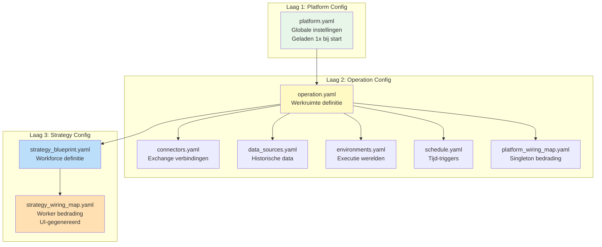

### Laag 1: PlatformConfig

**Doel**: Globale, run-onafhankelijke platform instellingen.

**Bestand**: [`platform.yaml`](config/platform.yaml)

**Inhoud**:
- Logging profielen en taalinstellingen
- Basis paden (plugins_root_path)
- Archivering formaat
- Globale platform settings

**Levenscyclus**: Geladen **eenmaal** bij start van OperationService.

```yaml
# config/platform.yaml
language: "nl"
logging:
  profile: "analysis"
  profiles:
    developer: [INFO, WARNING, ERROR]
    analysis: [DEBUG, INFO, TRADE, ERROR]
plugins_root_path: "plugins"
archiving:
  format: "parquet"
```

### Laag 2: OperationConfig

**Doel**: Definieert de operationele werkruimte - alle technische middelen en de te draaien strategieën.

**Hoofdbestand**: [`operation.yaml`](config/operation.yaml)

**Gerelateerde bestanden**:
- [`connectors.yaml`](config/connectors.yaml) - Live exchange verbindingen
- [`data_sources.yaml`](config/data_sources.yaml) - Lokale historische datasets
- [`environments.yaml`](config/environments.yaml) - Executie omgevingen (backtest/paper/live)
- [`schedule.yaml`](config/schedule.yaml) - Tijd-gebaseerde triggers
- [`platform_wiring_map.yaml`](config/platform_wiring_map.yaml) - Bedrading voor operation-brede singletons

**Voorbeeld operation.yaml**:

```yaml
# config/operation.yaml
display_name: "BTC Trading Operation"
description: "Multi-strategy BTC operation"

strategy_links:
  - strategy_link_id: "live_btc_ict"
    is_active: true
    execution_environment_id: "live_kraken_main"
    strategy_config:
      blueprint_id: "ict_smc_strategy"
      wiring_map_id: "ict_smc_wiring_v1"
```

### Laag 3: StrategyConfig

**Doel**: Volledige definitie van één specifieke strategie-instantie.

**Bestanden**:
- [`strategy_blueprint.yaml`](config/runs/strategy_blueprint.yaml) - Workforce (welke plugins, met welke params)
- [`strategy_wiring_map.yaml`](config/runs/strategy_wiring_map.yaml) - Worker bedrading (**UI-gegenereerd**)

**Voorbeeld strategy_blueprint.yaml**:

```yaml
# config/runs/ict_smc_strategy.yaml
display_name: "ICT/SMC Strategy"
version: "1.0.0"

workforce:
  context_workers:
    - instance_id: "ema_fast"
      plugin: "ema_detector"
      params:
        period: 20
    
    - instance_id: "ema_slow"
      plugin: "ema_detector"
      params:
        period: 50
  
  opportunity_workers:
    - instance_id: "fvg_det_1"
      plugin: "fvg_detector"
      params:
        min_gap_size: 5
```

**Voorbeeld strategy_wiring_map.yaml** (gegenereerd door UI):

```yaml
# config/runs/ict_smc_wiring_v1.yaml
# Gegenereerd door Strategy Builder UI
wiring_rules:
  # Systeem event: Start context phase
  - wiring_id: "start_to_ema_fast"
    source:
      component_id: "ExecutionEnvironment"
      event_name: "TICK_FLOW_START"
      event_type: "SystemEvent"
    target:
      component_id: "ema_fast"
      handler_method: "process"
  
  # Systeem event: Chain ema_fast → ema_slow
  - wiring_id: "ema_fast_to_slow"
    source:
      component_id: "ema_fast"
      event_name: "ema_fast_OUTPUT"
      event_type: "SystemEvent"
    target:
      component_id: "ema_slow"
      handler_method: "process"
  
  # Systeem event: ema_slow → fvg_detector
  - wiring_id: "context_to_opportunity"
    source:
      component_id: "ema_slow"
      event_name: "ema_slow_OUTPUT"
      event_type: "SystemEvent"
    target:
      component_id: "fvg_det_1"
      handler_method: "process"
```

---

## 2.2. De ConfigTranslator: Van YAML naar BuildSpecs

De [`ConfigTranslator`](backend/config/translator.py) is het brein dat alle configuratielagen leest en vertaalt naar één geünificeerd [`BuildSpecs`](backend/assembly/build_specs.py) object.

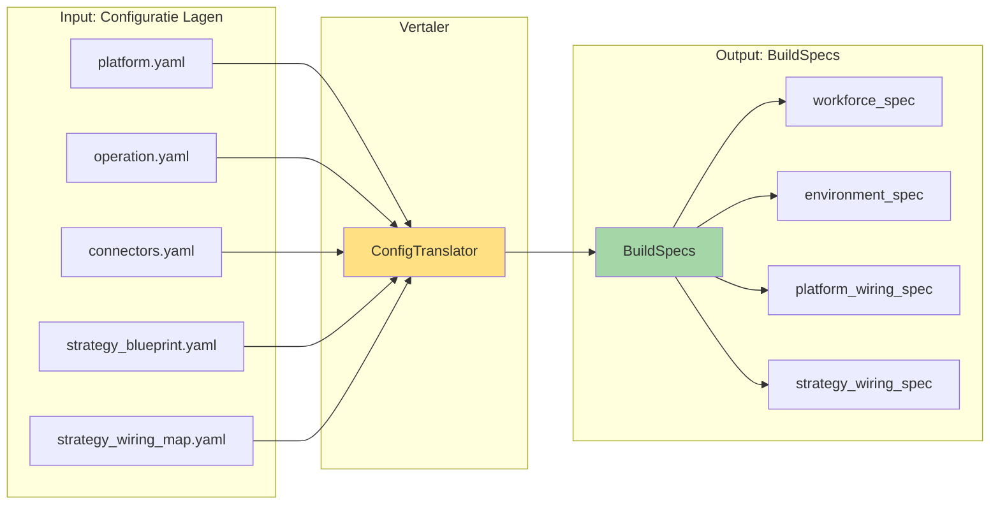

### BuildSpecs Structuur

```python
# backend/assembly/build_specs.py
from pydantic import BaseModel
from typing import List, Dict, Any

class WorkerSpec(BaseModel):
    """Specificatie voor één worker instance."""
    instance_id: str
    plugin_name: str
    params: Dict[str, Any]
    requires_capabilities: List[str]  # bv. ["state_persistence", "ohlcv_window"]

class WiringRule(BaseModel):
    """Eén bedrading tussen componenten."""
    wiring_id: str
    source: Dict[str, str]  # component_id, event_name, event_type
    target: Dict[str, str]  # component_id, handler_method
    condition: Dict[str, Any] = {}

class BuildSpecs(BaseModel):
    """Complete machine-leesbare specificatie voor bootstrap."""
    
    # Platform niveau
    platform_wiring_spec: List[WiringRule]
    
    # Strategy niveau
    workforce_spec: List[WorkerSpec]
    strategy_wiring_spec: List[WiringRule]
    
    # Environment
    environment_spec: Dict[str, Any]
    
    # Persistentie
    persistor_spec: Dict[str, Any]
```

### ConfigTranslator Workflow

```python
# backend/config/translator.py
class ConfigTranslator:
    """Vertaalt YAML configuratie naar BuildSpecs."""
    
    def collect_build_specs(
        self,
        strategy_config: StrategyConfig,
        platform_config: PlatformConfig,
        operation_config: OperationConfig
    ) -> BuildSpecs:
        """
        Hoofdmethode: vertaalt alle config naar BuildSpecs.
        
        Args:
            strategy_config: Strategy blueprint + wiring map
            platform_config: Platform instellingen
            operation_config: Operation resources
        
        Returns:
            Complete BuildSpecs klaar voor factories
        """
        return BuildSpecs(
            platform_wiring_spec=self._translate_platform_wiring(operation_config),
            workforce_spec=self._translate_workforce(strategy_config),
            strategy_wiring_spec=self._translate_strategy_wiring(strategy_config),
            environment_spec=self._translate_environment(strategy_config, operation_config),
            persistor_spec=self._translate_persistors(strategy_config)
        )
```

---

## 2.3. OperationService als Levenscyclus Manager

De [`OperationService`](services/operation_service.py) is de dirigent die de hele bootstrap orkestreert via een strikte "factory chain".

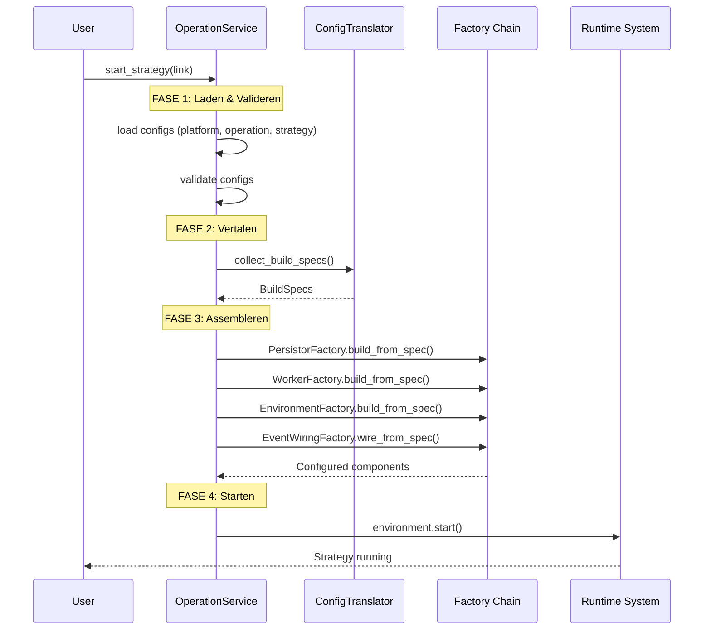

### Kernmethoden

```python
# services/operation_service.py
class OperationService:
    """Pure levenscyclus manager voor strategieën."""
    
    def start_strategy(self, strategy_link) -> str:
        """
        Universele start-procedure voor één strategie.
        
        Returns:
            strategy_instance_id
        """
        # 1. Laden & Valideren
        strategy_config = self._config_loader.load_strategy_config(
            strategy_link.blueprint_id
        )
        self._config_validator.validate_strategy_config(
            strategy_config, 
            self._operation_config
        )
        
        # 2. Vertalen
        build_specs = self._config_translator.collect_build_specs(
            strategy_config,
            self._platform_config,
            self._operation_config
        )
        
        # 3. Assembleren (Factory Chain)
        persistor_map = self._persistor_factory.build_from_spec(
            build_specs.persistor_spec
        )
        worker_instances = self._worker_factory.build_from_spec(
            build_specs.workforce_spec,
            persistor_map
        )
        environment = self._environment_factory.build_from_spec(
            build_specs.environment_spec
        )
        
        # 4. Bedraad het systeem
        self._event_wiring_factory.wire_all_from_spec(
            build_specs.platform_wiring_spec,
            build_specs.strategy_wiring_spec,
            worker_instances
        )
        
        # 5. Start
        environment.start()
        
        # 6. Registreer
        instance_id = self._register_active_strategy(...)
        return instance_id
    
    def stop_strategy(self, instance_id: str) -> None:
        """Stop één strategie."""
        pass
    
    def restart_strategy(self, instance_id: str) -> None:
        """Herstart één strategie."""
        self.stop_strategy(instance_id)
        self.start_strategy(original_link)
```

---

## 2.4. Validatie: Fail Fast

Alle validatie gebeurt **voor** de factories worden aangeroepen:

**Validators**:
- [`ConfigValidator`](backend/config/validator.py) - Schema validatie, referentie checks
- [`DependencyValidator`](backend/assembly/dependency_validator.py) - Data-afhankelijkheden tussen workers
- [`EventChainValidator`](backend/assembly/event_chain_validator.py) - Event topologie integriteit

```python
# Validatie workflow
try:
    config_validator.validate_all()
    dependency_validator.validate(blueprint, wiring_map)
    event_chain_validator.validate(wiring_specs)
except ValidationError as e:
    # FAIL FAST - stop bootstrap
    logger.error(f"Validation failed: {e}")
    raise
```

### Wat wordt gevalideerd

- ✅ YAML schema correctheid (Pydantic)
- ✅ Cross-file referenties (connector_id, plugin_id bestaan)
- ✅ Data dependencies (required DTOs worden geproduceerd)
- ✅ Event chains (alle triggers hebben publishers)
- ✅ Circular dependencies (geen event loops)
- ✅ Execution volgorde vs data afhankelijkheden

---

**Einde Hoofdstuk 2**

Dit hoofdstuk beschrijft de drie configuratielagen, de ConfigTranslator die ze vertaalt naar BuildSpecs, en de OperationService die als levenscyclus manager fungeert.

---

# 03_Data_Landschap_Point_in_Time.md


# Hoofdstuk 3: Het Data Landschap (Point-in-Time Architectuur)

**Status:** Definitief  
**Versie:** 4.0

---

## 3.1. De Minimale TradingContext

De [`TradingContext`](backend/dtos/state/trading_context.py) bevat **alleen** de meest essentiële basis informatie:

```python
# backend/dtos/state/trading_context.py
from pydantic import BaseModel
from datetime import datetime

class TradingContext(BaseModel):
    """Minimale context voor één tick."""
    
    timestamp: datetime
    strategy_link_id: str
    asset_pair: str
    current_price: float
    
    # GEEN enriched_df
    # GEEN grote data structuren
    # Alle andere data via ITradingContextProvider
```

---

## 3.2. ITradingContextProvider: De Data Hub

De [`ITradingContextProvider`](backend/core/interfaces/context_provider.py) is de centrale toegangspoort tot alle tick-specifieke data.

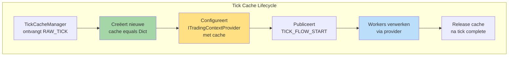

### Interface

```python
# backend/core/interfaces/context_provider.py
from typing import Protocol, Dict, Type
from pydantic import BaseModel

class ITradingContextProvider(Protocol):
    """Interface voor Point-in-Time data toegang."""
    
    def start_new_tick(
        self, 
        tick_cache: Dict[Type[BaseModel], BaseModel],
        timestamp: datetime,
        current_price: float
    ) -> None:
        """Configureert provider voor nieuwe tick."""
        ...
    
    def get_base_context(self) -> BaseContextDTO:
        """Haalt minimale basis context op."""
        ...
    
    def get_required_dtos(
        self, 
        requesting_worker: IWorker
    ) -> Dict[Type[BaseModel], BaseModel]:
        """
        Haalt DTOs op basis van manifest.requires_dtos.
        
        Raises:
            MissingContextDataError: Als vereist DTO ontbreekt
        """
        ...
    
    def set_result_dto(
        self, 
        producing_worker: IWorker,
        result_dto: BaseModel
    ) -> None:
        """
        Plaatst geproduceerd DTO in cache.
        Valideert tegen manifest.produces_dtos.
        """
        ...
```

---

## 3.3. De Tick Cache: Tijdelijke DTO Opslag

**Definitie**: Een dictionary die **alleen bestaat tijdens één tick/flow**.

```python
# Type definitie
TickCacheType = Dict[Type[BaseModel], BaseModel]

# Voorbeeld cache inhoud tijdens een tick:
{
    EMAOutputDTO: EMAOutputDTO(ema_20=50123.45, ema_50=50089.12),
    MarketStructureDTO: MarketStructureDTO(is_bos=True, trend='bullish'),
    ATROutputDTO: ATROutputDTO(atr_14=234.56)
}
```

### Kenmerken

- ✅ **Levensduur**: Alleen tijdens één tick (extreem kort)
- ✅ **Inhoud**: Alleen DTO-instanties (geen primitieve types)
- ✅ **Doel**: Efficiënte data-doorgifte tussen workers
- ✅ **Persistentie**: NIET persistent (weggegooid na tick)

### Verschil met StrategyJournal

| Aspect | Tick Cache | StrategyJournal |
|--------|------------|-----------------|
| **Levensduur** | Extreem kort (1 tick) | Permanent |
| **Inhoud** | Intermediaire DTOs | Significante events |
| **Doel** | Data flow binnen tick | Historische logging |
| **Persistentie** | Nee | Ja (bestand) |

---

## 3.4. Platform Providers: De Toolbox

Workers krijgen toegang tot platform diensten via geïnjecteerde Provider interfaces.

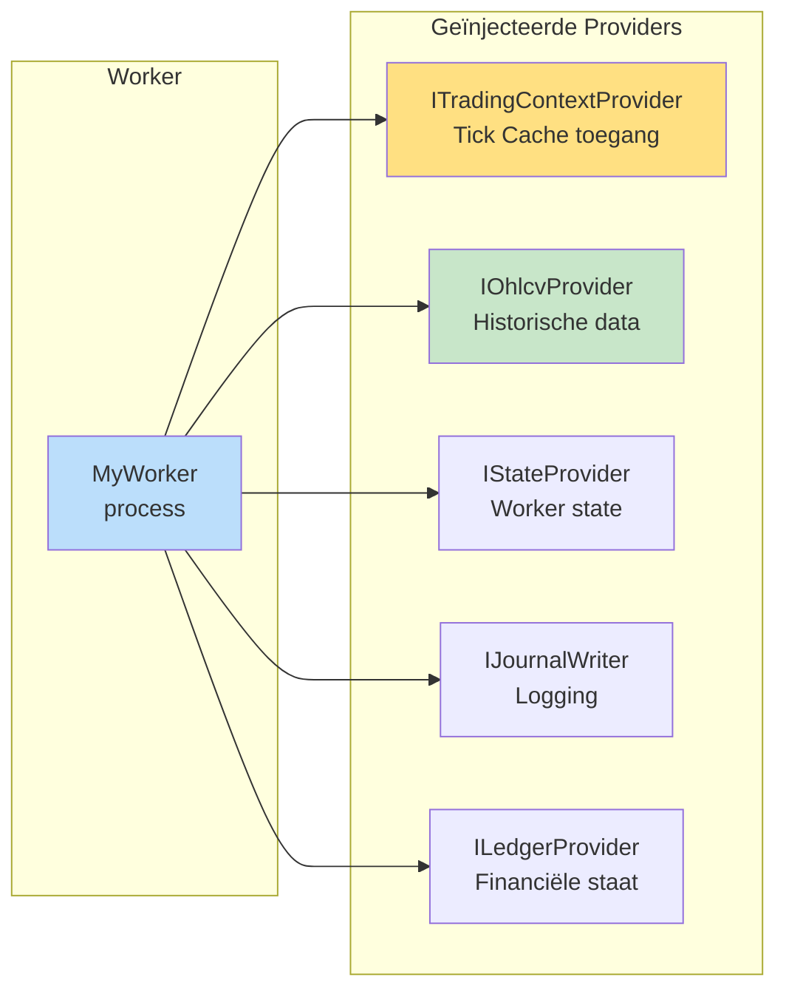

### Provider Overzicht

| Provider | Capability Key | Gebruik |
|----------|---------------|---------|
| [`ITradingContextProvider`](backend/core/interfaces/context_provider.py) | (standaard) | Tick Cache toegang |
| [`IOhlcvProvider`](backend/core/interfaces/ohlcv_provider.py) | "ohlcv_window" | Historische OHLCV data |
| [`IStateProvider`](backend/core/interfaces/state_provider.py) | "state_persistence" | Worker state (persistent) |
| [`IJournalWriter`](backend/core/interfaces/journal_writer.py) | "journaling" | Strategy Journal logging |
| [`ILedgerProvider`](backend/core/interfaces/ledger_provider.py) | "ledger_state" | Financiële staat |
| [`IMtfProvider`](backend/core/interfaces/mtf_provider.py) | "multi_timeframe" | Multi-timeframe data |

### Declaratie in Manifest

```yaml
# manifest.yaml
requires_capability:
  - "ohlcv_window"
  - "state_persistence"
```

### Injectie door WorkerFactory

```python
# De WorkerFactory leest requires_capability en injecteert providers
worker = WorkerClass(
    params=params,
    context_provider=trading_context_provider,  # Altijd geïnjecteerd
    ohlcv_provider=ohlcv_provider,              # Op basis van manifest
    state_provider=state_provider                # Op basis van manifest
)
```

---

## 3.5. DispositionEnvelope: Flow Control

Workers communiceren hun intentie na verwerking via een [`DispositionEnvelope`](backend/shared_dtos/disposition_envelope.py).

```python
# backend/shared_dtos/disposition_envelope.py
from pydantic import BaseModel
from typing import Optional, Literal

class DispositionEnvelope(BaseModel):
    """Gestandaardiseerde envelope voor worker output."""
    
    disposition: Literal["CONTINUE", "PUBLISH", "STOP"] = "CONTINUE"
    
    # Alleen bij PUBLISH
    event_name: Optional[str] = None
    event_payload: Optional[BaseModel] = None  # Systeem DTO
```

### Gebruik Patronen

```python
# Patroon 1: CONTINUE (normale flow, data in cache)
class EMADetector(StandardWorker):
    def process(self) -> DispositionEnvelope:
        # Bereken EMA
        result_dto = EMAOutputDTO(ema_20=..., ema_50=...)
        
        # Plaats in cache voor volgende worker
        self.context_provider.set_result_dto(self, result_dto)
        
        # Signaal: ga door met flow
        return DispositionEnvelope(disposition="CONTINUE")

# Patroon 2: PUBLISH (publiceer event op EventBus)
class FVGDetector(StandardWorker):
    def process(self) -> DispositionEnvelope:
        if fvg_detected:
            signal = OpportunitySignalDTO(...)
            
            # Publiceer naar EventBus
            return DispositionEnvelope(
                disposition="PUBLISH",
                event_name="SIGNAL_GENERATED",
                event_payload=signal
            )
        else:
            # Stop deze flow-tak
            return DispositionEnvelope(disposition="STOP")

# Patroon 3: STOP (beëindig deze flow-tak)
class RiskGovernor(StandardWorker):
    def process(self) -> DispositionEnvelope:
        if risk_too_high:
            # Log afwijzing in journal
            self.journal_writer.log_rejection(...)
            
            # Stop flow
            return DispositionEnvelope(disposition="STOP")
```

---

## 3.6. Data Flow Voorbeeld: Complete Tick

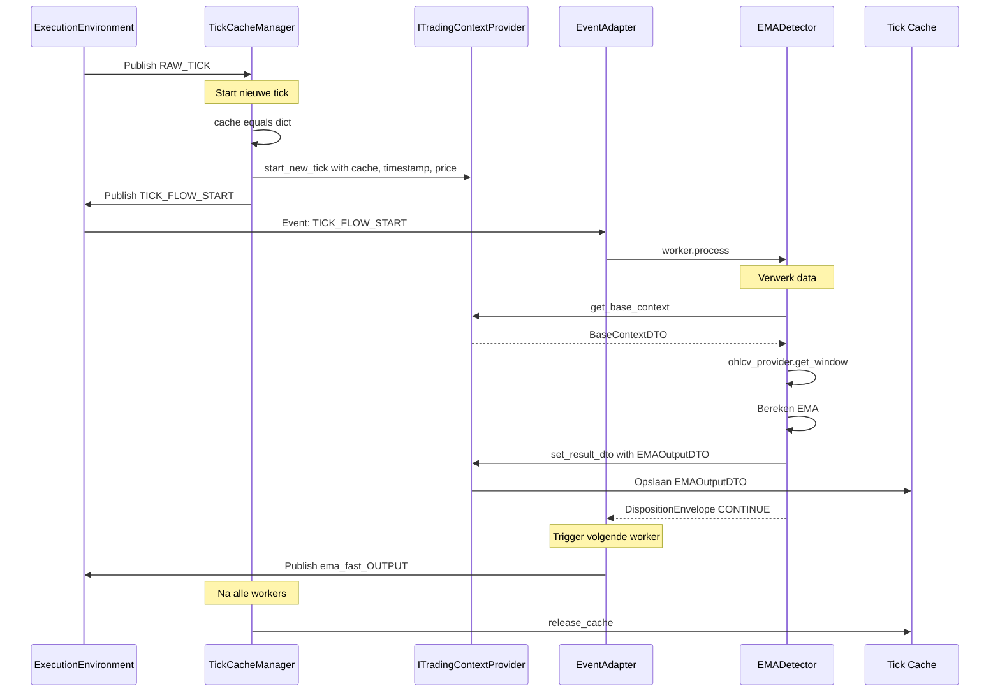

---

## 3.7. DTO Types: Cache vs EventBus

**Cruciaal onderscheid**:

| Gebruik | DTO Type | Via | Doel |
|---------|----------|-----|------|
| **Tick Cache** | Plugin-specifieke DTOs | `set_result_dto()` | Interne synchrone flow |
| **EventBus** | Standaard Systeem DTOs | `DispositionEnvelope.PUBLISH` | Externe signalen/events |

### Plugin-specifieke DTOs (voor cache)

**Voorbeelden**: `EMAOutputDTO`, `MarketStructureDTO`, `PatternConfirmationDTO`

**Locatie**: 
- Gedefinieerd in plugin's [`dtos/`](plugins/*/dtos/) folder
- Gekopieerd naar centraal register: [`backend/dto_reg/<vendor>/<plugin>/<version>/`](backend/dto_reg/)

```python
# plugins/ema_detector/dtos/ema_output_dto.py
class EMAOutputDTO(BaseModel):
    ema_20: float
    ema_50: float
    ema_200: float = 0.0
    timestamp: datetime
    
    class Config:
        frozen = True
```

### Systeem DTOs (voor EventBus)

**Voorbeelden**: `OpportunitySignalDTO`, `CriticalEventDTO`, `RoutedTradePlanDTO`

**Locatie**: [`backend/dtos/`](backend/dtos/)

```python
# backend/dtos/pipeline/signal.py
class OpportunitySignalDTO(BaseModel):
    opportunity_id: UUID = Field(default_factory=uuid4)
    timestamp: datetime
    asset: str
    signal_type: str
    confidence: float
    metadata: Dict[str, Any] = {}
```

---

## 3.8. TickCacheManager: Flow Initiator

De [`TickCacheManager`](backend/core/tick_cache_manager.py) is de singleton die elke nieuwe data-verwerkingsflow initieert.

```python
# backend/core/tick_cache_manager.py
from typing import Dict, Type
from pydantic import BaseModel

class TickCacheManager:
    """Beheert levenscyclus van Tick Caches."""
    
    def __init__(
        self,
        context_provider: ITradingContextProvider,
        event_bus: EventBus
    ):
        self._context_provider = context_provider
        self._event_bus = event_bus
        self._active_caches: Dict[str, Dict] = {}
    
    def on_raw_tick(self, tick_event: Any) -> None:
        """
        Event handler - aangeroepen bij RAW_TICK event.
        Start nieuwe flow.
        """
        # 1. Creëer nieuwe cache
        cache = {}
        
        # 2. Extract basis info
        timestamp = tick_event.timestamp
        price = tick_event.current_price
        
        # 3. Configureer provider
        self._context_provider.start_new_tick(cache, timestamp, price)
        
        # 4. Publiceer start event
        tick_id = str(uuid4())
        self._active_caches[tick_id] = cache
        
        self._event_bus.publish(
            "TICK_FLOW_START",
            TickFlowStartDTO(tick_id=tick_id)
        )
    
    def release_cache(self, tick_id: str) -> None:
        """Geef cache vrij na flow complete."""
        if tick_id in self._active_caches:
            del self._active_caches[tick_id]
```

---

## 3.9. Worker Data Toegang Patroon

### Complete voorbeeld: ContextWorker

```python
# plugins/context_workers/indicator_calculation/ema_detector/worker.py
from backend.core.base_worker import StandardWorker
from backend.dtos.state.base_context_dto import BaseContextDTO
from backend.shared_dtos.disposition_envelope import DispositionEnvelope
from .dtos.ema_output_dto import EMAOutputDTO

class EMADetector(StandardWorker):
    """Berekent EMA indicatoren."""
    
    # Providers worden geïnjecteerd door WorkerFactory
    context_provider: ITradingContextProvider
    ohlcv_provider: IOhlcvProvider
    
    def process(self) -> DispositionEnvelope:
        """Hoofdverwerking - Point-in-Time."""
        
        # 1. Haal basis context
        base_ctx = self.context_provider.get_base_context()
        
        # 2. Haal historische data (Point-in-Time!)
        df = self.ohlcv_provider.get_window(
            timestamp=base_ctx.timestamp,
            lookback=200
        )
        
        # 3. Bereken EMA
        ema_20 = df['close'].ewm(span=self.params.period_fast).mean().iloc[-1]
        ema_50 = df['close'].ewm(span=self.params.period_slow).mean().iloc[-1]
        
        # 4. Creëer output DTO
        result = EMAOutputDTO(
            ema_20=ema_20,
            ema_50=ema_50,
            timestamp=base_ctx.timestamp
        )
        
        # 5. Plaats in Tick Cache
        self.context_provider.set_result_dto(self, result)
        
        # 6. Signaal: ga door naar volgende worker
        return DispositionEnvelope(disposition="CONTINUE")
```

### Complete voorbeeld: OpportunityWorker

```python
# plugins/opportunity_workers/technical_pattern/fvg_detector/worker.py
from backend.core.base_worker import StandardWorker
from backend.dtos.pipeline.signal import OpportunitySignalDTO
from backend.shared_dtos.disposition_envelope import DispositionEnvelope
# Import van andere plugin's DTO via centraal register
from backend.dto_reg.s1mple.market_structure_detector.v1_0_0.structure_dto import MarketStructureDTO

class FVGDetector(StandardWorker):
    """Detecteert Fair Value Gaps."""
    
    context_provider: ITradingContextProvider
    ohlcv_provider: IOhlcvProvider
    
    def process(self) -> DispositionEnvelope:
        """FVG detectie - gebruikt DTOs uit cache."""
        
        # 1. Haal basis context
        base_ctx = self.context_provider.get_base_context()
        
        # 2. Haal required DTOs uit cache
        # Manifest declareert: requires_dtos: ["MarketStructureDTO"]
        required_dtos = self.context_provider.get_required_dtos(self)
        structure_dto = required_dtos[MarketStructureDTO]
        
        # 3. Haal OHLCV data
        df = self.ohlcv_provider.get_window(
            timestamp=base_ctx.timestamp,
            lookback=100
        )
        
        # 4. FVG logica
        if self._detect_fvg(df, structure_dto):
            # Kans gevonden! Publiceer naar EventBus
            signal = OpportunitySignalDTO(
                opportunity_id=uuid4(),
                timestamp=base_ctx.timestamp,
                asset=base_ctx.asset_pair,
                signal_type='fvg_entry',
                confidence=0.85,
                metadata={'gap_size': 8.5}
            )
            
            return DispositionEnvelope(
                disposition="PUBLISH",
                event_name="SIGNAL_GENERATED",
                event_payload=signal
            )
        else:
            # Geen kans, stop deze flow-tak
            return DispositionEnvelope(disposition="STOP")
    
    def _detect_fvg(self, df, structure_dto) -> bool:
        """FVG detectie logica."""
        # Alleen detecteren na structure break
        if not structure_dto.is_bos:
            return False
        
        # Check voor gap
        # ... implementatie ...
        return gap_detected
```

---

## 3.10. DTO Registry & Enrollment

Plugin-specifieke DTOs worden centraal beschikbaar gesteld via een "enrollment" mechanisme.

### Structuur

```
backend/
└── dto_reg/
    └── <vendor>/
        └── <plugin_name>/
            └── v<version>/
                └── <dto_name>.py
```

### Voorbeeld

```
backend/dto_reg/
├── s1mple/
│   ├── ema_detector/
│   │   └── v1_0_0/
│   │       └── ema_output_dto.py
│   └── market_structure_detector/
│       └── v1_0_0/
│           └── structure_dto.py
```

### Gebruik

```python
# Producer plugin definieert DTO lokaal
# plugins/ema_detector/dtos/ema_output_dto.py

# Bij enrollment kopieert platform naar centraal register
# backend/dto_reg/s1mple/ema_detector/v1_0_0/ema_output_dto.py

# Consumer importeert van centrale locatie
from backend.dto_reg.s1mple.ema_detector.v1_0_0.ema_output_dto import EMAOutputDTO
```

### Manifest Declaraties

```yaml
# Producer manifest
produces_dtos:
  - dto_type: "EMAOutputDTO"
    local_path: "dtos/ema_output_dto.py"

# Consumer manifest  
requires_dtos:
  - dto_type: "EMAOutputDTO"
    expected_path: "backend.dto_reg.s1mple.ema_detector.v1_0_0.ema_output_dto"
```

---

## 3.11. Point-in-Time Garantie

### Hoe wordt Point-in-Time gegarandeerd?

1. **TickCacheManager**: Legt timestamp vast bij flow start
2. **Platform Providers**: MOETEN timestamp respecteren (geen toekomstige data)
3. **Tick Cache**: Bevat alleen data berekend binnen huidige tick
4. **Validatie**: DependencyValidator checkt data-volgorde tijdens bootstrap

```python
# Voorbeeld: IOhlcvProvider implementatie
class OhlcvProvider:
    def get_window(self, timestamp: datetime, lookback: int) -> pd.DataFrame:
        """
        Haalt OHLCV data op.
        
        CRUCIALE REGEL: Retourneer ALLEEN data tot en met timestamp.
        Geen data uit de toekomst!
        """
        return self._data_source.load_data(
            end_time=timestamp,  # ← Point-in-Time grens
            lookback=lookback
        )
```

---

**Einde Hoofdstuk 3**

Dit hoofdstuk beschrijft het complete Point-in-Time data landschap met ITradingContextProvider, Tick Cache, Platform Providers en DispositionEnvelope voor flow control.


---

# 04_Plugin_Anatomie.md

# Hoofdstuk 4: Plugin Anatomie

**Status:** Definitief  
**Versie:** 4.0

---

## 4.1. De Plugin als Zelfstandige Eenheid

Een plugin is een **volledig zelfstandige, testbare eenheid** van businesslogica. De mappenstructuur maakt dit mogelijk:

```
plugins/<worker_category>/<sub_type>/<plugin_name>/
├── manifest.yaml          # Identiteit & contracten
├── worker.py             # Businesslogica
├── schema.py             # Parameter validatie
├── dtos/                 # Output DTOs (optioneel)
│   └── my_output_dto.py
└── tests/
    └── test_worker.py    # Verplichte tests
```

---

## 4.2. Manifest.yaml: De Complete Plugin Specificatie

Het [`manifest.yaml`](plugins/*/manifest.yaml) is de **Single Source of Truth** voor alles wat het platform over een plugin moet weten.

### 4.2.1. Identificatie

```yaml
# manifest.yaml
identification:
  name: "ema_detector"                    # Technische naam (snake_case)
  display_name: "EMA Detector"           # UI naam
  type: "context_worker"                 # Een van de 5 categorieën
  subtype: "indicator_calculation"       # Een van de 27 sub-types
  version: "1.0.0"                       # Semantische versie
  description: "Berekent EMA indicatoren"
  author: "S1mpleTrader Team"
```

**Worker Types** (5 categorieën):
- `context_worker` - Verrijkt data met context
- `opportunity_worker` - Detecteert handelskansen
- `threat_worker` - Detecteert risico's
- `planning_worker` - Maakt trade plannen
- `execution_worker` - Voert uit en beheert

### 4.2.2. Data Contracten (DTO-Centric)

```yaml
# Data dependencies voor Point-in-Time model
requires_capability:
  - "ohlcv_window"           # Platform provider
  - "state_persistence"      # State provider

requires_dtos:
  # DTOs die deze worker uit Tick Cache nodig heeft
  - dto_type: "MarketStructureDTO"
    expected_path: "backend.dto_reg.s1mple.market_structure_detector.v1_0_0.structure_dto"

produces_dtos:
  # DTOs die deze worker in Tick Cache plaatst
  - dto_type: "EMAOutputDTO"
    local_path: "dtos/ema_output_dto.py"
    description: "EMA waarden voor verschillende periodes"
```

**Verschil met oude model**:
- ❌ GEEN `requires: ['close', 'high']` (DataFrame kolommen)
- ❌ GEEN `provides: ['ema_20', 'ema_50']` (DataFrame kolommen)
- ✅ WEL `requires_dtos` en `produces_dtos` (expliciete DTOs)

### 4.2.3. Capabilities

```yaml
capabilities:
  # State persistence
  state:
    enabled: true
    state_dto: "dtos.state_dto.EMAState"
  
  # Event communication (alleen voor event-aware workers)
  events:
    enabled: true
    publishes:
      - event_name: "EMA_CROSS_DETECTED"
        description: "Published when EMAs cross"
    wirings:
      - listens_to: "SCHEDULE_TICK"
        invokes:
          method: "on_scheduled_check"
  
  # Journaling
  journaling:
    enabled: false  # Deze worker logt niet
```

---

## 4.3. Worker.py: De Twee Basisklassen

Plugin developers kiezen **expliciet** tussen twee architecturale rollen:

### StandardWorker (90% van plugins)

**Voor**: Workers in de standaard, georkestreerde pipeline.

```python
# plugins/context_workers/indicator_calculation/ema_detector/worker.py
from backend.core.base_worker import StandardWorker
from backend.core.interfaces.context_provider import ITradingContextProvider
from backend.core.interfaces.ohlcv_provider import IOhlcvProvider
from backend.shared_dtos.disposition_envelope import DispositionEnvelope
from .dtos.ema_output_dto import EMAOutputDTO

class EMADetector(StandardWorker):
    """
    ContextWorker - Indicator Calculation
    
    Berekent EMA indicatoren voor technische analyse.
    """
    
    # Type hints voor geïnjecteerde providers
    context_provider: ITradingContextProvider
    ohlcv_provider: IOhlcvProvider
    
    def __init__(self, params, **providers):
        """
        Args:
            params: Gevalideerde parameters uit schema.py
            **providers: Geïnjecteerde platform providers
        """
        super().__init__(params)
        self.context_provider = providers['context_provider']
        self.ohlcv_provider = providers['ohlcv_provider']
    
    def process(self) -> DispositionEnvelope:
        """
        Verplichte methode voor StandardWorker.
        
        Returns:
            DispositionEnvelope met flow control instructie
        """
        # 1. Haal basis context
        base_ctx = self.context_provider.get_base_context()
        
        # 2. Haal OHLCV data (Point-in-Time)
        df = self.ohlcv_provider.get_window(
            timestamp=base_ctx.timestamp,
            lookback=200
        )
        
        # 3. Bereken EMA
        ema_20 = df['close'].ewm(span=self.params.period_fast).mean().iloc[-1]
        ema_50 = df['close'].ewm(span=self.params.period_slow).mean().iloc[-1]
        
        # 4. Creëer output DTO
        result = EMAOutputDTO(
            ema_20=float(ema_20),
            ema_50=float(ema_50),
            timestamp=base_ctx.timestamp
        )
        
        # 5. Plaats in Tick Cache
        self.context_provider.set_result_dto(self, result)
        
        # 6. Continue flow
        return DispositionEnvelope(disposition="CONTINUE")
```

### EventDrivenWorker (10% van plugins)

**Voor**: Autonome workers die reageren op events.

```python
# plugins/threat_workers/external_event/news_monitor/worker.py
from backend.core.base_worker import EventDrivenWorker
from backend.shared_dtos.disposition_envelope import DispositionEnvelope
from backend.dtos.execution.critical_event import CriticalEventDTO

class NewsMonitor(EventDrivenWorker):
    """
    ThreatWorker - External Event
    
    Monitort nieuws voor high-impact events.
    GEEN process() methode - alleen event handlers.
    """
    
    context_provider: ITradingContextProvider
    state_provider: IStateProvider
    
    def __init__(self, params, **providers):
        super().__init__(params)
        self.context_provider = providers['context_provider']
        self.state_provider = providers['state_provider']
    
    def on_news(self, news_event: NewsEventDTO) -> DispositionEnvelope:
        """
        Event handler - aangeroepen bij NEWS_RECEIVED.
        
        Methode naam komt uit manifest.wirings.
        """
        # Analyseer nieuws
        if news_event.impact == "HIGH":
            # Publiceer noodsignaal
            threat = CriticalEventDTO(
                threat_id=uuid4(),
                threat_type="HIGH_IMPACT_NEWS",
                severity="CRITICAL",
                details={"headline": news_event.headline}
            )
            
            return DispositionEnvelope(
                disposition="PUBLISH",
                event_name="EMERGENCY_HALT_TRADING",
                event_payload=threat
            )
        
        # Geen bedreiging
        return DispositionEnvelope(disposition="STOP")
```

---

## 4.4. Schema.py: Parameter Validatie

Elk plugin definieert zijn configureerbare parameters via Pydantic.

```python
# plugins/context_workers/indicator_calculation/ema_detector/schema.py
from pydantic import BaseModel, Field

class EMADetectorParams(BaseModel):
    """Parameter schema voor EMA Detector."""
    
    period_fast: int = Field(
        default=20,
        ge=5,
        le=200,
        description="params.ema_detector.period_fast.desc"
    )
    
    period_slow: int = Field(
        default=50,
        ge=10,
        le=500,
        description="params.ema_detector.period_slow.desc"
    )
    
    def validate_periods(self):
        """Custom validatie: slow > fast."""
        if self.period_slow <= self.period_fast:
            raise ValueError("period_slow must be > period_fast")
```

**Gebruik in strategy_blueprint.yaml**:

```yaml
workforce:
  context_workers:
    - instance_id: "ema_main"
      plugin: "ema_detector"
      params:
        period_fast: 20
        period_slow: 50
```

---

## 4.5. DTO Definitie & Enrollment

### Lokale DTO Definitie

Plugin definieert output DTOs lokaal:

```python
# plugins/context_workers/indicator_calculation/ema_detector/dtos/ema_output_dto.py
from pydantic import BaseModel
from datetime import datetime

class EMAOutputDTO(BaseModel):
    """Output DTO voor EMA berekeningen."""
    
    ema_20: float
    ema_50: float
    ema_200: float = 0.0  # Optioneel
    timestamp: datetime
    
    class Config:
        frozen = True  # Immutable
```

### Enrollment Proces

Wanneer de plugin wordt "enrolled" via de Plugin IDE:

1. **IDE detecteert** DTOs in `dtos/` folder
2. **Platform kopieert** naar centraal register:
   ```
   backend/dto_reg/s1mple/ema_detector/v1_0_0/ema_output_dto.py
   ```
3. **Platform registreert** in DTO Registry
4. **Andere plugins** kunnen nu importeren:
   ```python
   from backend.dto_reg.s1mple.ema_detector.v1_0_0.ema_output_dto import EMAOutputDTO
   ```

### Versioning

DTOs zijn **versie-specifiek** gekoppeld aan plugin versie:

```
backend/dto_reg/s1mple/ema_detector/
├── v1_0_0/
│   └── ema_output_dto.py
├── v1_1_0/
│   └── ema_output_dto.py  # Backwards compatible wijziging
└── v2_0_0/
    └── ema_output_dto.py  # Breaking change
```

**Dependency management**: DependencyValidator checkt tijdens bootstrap of gevraagde DTO versie beschikbaar is.

---

## 4.6. Testing Requirements

### Verplichte Test Structuur

```python
# plugins/context_workers/indicator_calculation/ema_detector/tests/test_worker.py
import pytest
from unittest.mock import MagicMock
from ..worker import EMADetector
from ..dtos.ema_output_dto import EMAOutputDTO
from backend.shared_dtos.disposition_envelope import DispositionEnvelope

@pytest.fixture
def mock_providers():
    """Mock all required providers."""
    
    # Mock context provider
    context_provider = MagicMock()
    context_provider.get_base_context.return_value = BaseContextDTO(
        timestamp=datetime(2024, 1, 1, 10, 0),
        current_price=50000.0
    )
    
    # Mock OHLCV provider
    ohlcv_provider = MagicMock()
    ohlcv_provider.get_window.return_value = create_test_dataframe()
    
    return {
        'context_provider': context_provider,
        'ohlcv_provider': ohlcv_provider
    }

def test_ema_detector_calculates_correctly(mock_providers):
    """Test EMA calculation logic."""
    
    # Arrange
    params = {'period_fast': 20, 'period_slow': 50}
    worker = EMADetector(params, **mock_providers)
    
    # Act
    result = worker.process()
    
    # Assert
    assert isinstance(result, DispositionEnvelope)
    assert result.disposition == "CONTINUE"
    
    # Verify DTO was placed in cache
    mock_providers['context_provider'].set_result_dto.assert_called_once()
    call_args = mock_providers['context_provider'].set_result_dto.call_args
    
    produced_dto = call_args[0][1]
    assert isinstance(produced_dto, EMAOutputDTO)
    assert produced_dto.ema_20 > 0
    assert produced_dto.ema_50 > 0
    assert produced_dto.ema_50 > produced_dto.ema_20  # Slow > Fast

def test_ema_detector_respects_point_in_time(mock_providers):
    """Test that worker requests data with correct timestamp."""
    
    # Arrange
    params = {'period_fast': 20, 'period_slow': 50}
    worker = EMADetector(params, **mock_providers)
    
    # Act
    worker.process()
    
    # Assert - check OHLCV was requested with correct timestamp
    mock_providers['ohlcv_provider'].get_window.assert_called_once()
    call_kwargs = mock_providers['ohlcv_provider'].get_window.call_args[1]
    
    assert 'timestamp' in call_kwargs
    assert call_kwargs['timestamp'] == datetime(2024, 1, 1, 10, 0)
```

**Test Coverage Requirements**:
- ✅ Happy path (normale werking)
- ✅ Edge cases (lege data, extreme waarden)
- ✅ Parameter validatie
- ✅ DTO structuur validatie
- ✅ Point-in-Time correctheid
- ✅ Provider interactie

---

## 4.7. Plugin Development Checklist

### Minimale Plugin (Pure ContextWorker)

```
☐ Creëer plugin directory structuur
☐ Schrijf manifest.yaml
  ☐ identification (type, subtype)
  ☐ requires_capability
  ☐ produces_dtos
☐ Schrijf schema.py (parameter model)
☐ Schrijf worker.py
  ☐ Inherit van StandardWorker
  ☐ Implementeer process() methode
  ☐ Gebruik providers via self.<provider>
  ☐ Return DispositionEnvelope
☐ Definieer output DTO in dtos/
☐ Schrijf tests/test_worker.py
  ☐ Test met gemockte providers
  ☐ Verify DTO output
  ☐ Verify Point-in-Time
☐ Run pytest - 100% pass vereist
```

### Event-Aware Plugin (Toegevoegd)

```
☐ Alle stappen van minimale plugin
☐ Plus:
  ☐ Inherit van EventDrivenWorker
  ☐ manifest.capabilities.events.enabled = true
  ☐ Declareer publishes in manifest
  ☐ Declareer wirings in manifest
  ☐ Implementeer event handler methoden
  ☐ Test event publicatie
  ☐ Test event ontvangst
```

---

## 4.8. Complete Plugin Voorbeeld

### Manifest

```yaml
# plugins/opportunity_workers/technical_pattern/ema_cross_detector/manifest.yaml
identification:
  name: "ema_cross_detector"
  display_name: "EMA Cross Detector"
  type: "opportunity_worker"
  subtype: "technical_pattern"
  version: "1.0.0"
  description: "Detecteert EMA kruisingen als entry signalen"
  author: "Trading Team"

requires_capability:
  - "state_persistence"  # Voor het bijhouden van vorige waarden

requires_dtos:
  - dto_type: "EMAOutputDTO"
    expected_path: "backend.dto_reg.s1mple.ema_detector.v1_0_0.ema_output_dto"

produces_dtos: []  # Geen intermediaire DTOs

capabilities:
  state:
    enabled: true
    state_dto: "dtos.cross_state_dto.CrossStateDTO"
  
  events:
    enabled: false  # Geen custom events
  
  journaling:
    enabled: false
```

### Schema

```python
# schema.py
from pydantic import BaseModel, Field

class EMACrossDetectorParams(BaseModel):
    """Parameters voor EMA Cross Detector."""
    
    min_separation: float = Field(
        default=0.001,
        ge=0.0,
        le=0.1,
        description="params.ema_cross.min_separation.desc"
    )
    
    require_volume_confirmation: bool = Field(
        default=True,
        description="params.ema_cross.require_volume.desc"
    )
```

### State DTO

```python
# dtos/cross_state_dto.py
from pydantic import BaseModel

class CrossStateDTO(BaseModel):
    """Interne state voor cross detectie."""
    
    last_ema_20: float = 0.0
    last_ema_50: float = 0.0
    last_cross_type: str = ""  # 'bullish' of 'bearish'
```

### Worker Implementatie

```python
# worker.py
from backend.core.base_worker import StandardWorker
from backend.dtos.pipeline.signal import OpportunitySignalDTO
from backend.shared_dtos.disposition_envelope import DispositionEnvelope
from backend.dto_reg.s1mple.ema_detector.v1_0_0.ema_output_dto import EMAOutputDTO
from .schema import EMACrossDetectorParams
from .dtos.cross_state_dto import CrossStateDTO

class EMACrossDetector(StandardWorker):
    """Detecteert EMA kruisingen."""
    
    params: EMACrossDetectorParams
    context_provider: ITradingContextProvider
    state_provider: IStateProvider
    
    def process(self) -> DispositionEnvelope:
        """Detecteer EMA cross."""
        
        # 1. Haal basis context
        base_ctx = self.context_provider.get_base_context()
        
        # 2. Haal required DTOs uit cache
        required_dtos = self.context_provider.get_required_dtos(self)
        ema_dto = required_dtos[EMAOutputDTO]
        
        # 3. Haal vorige state
        state = self.state_provider.get() or CrossStateDTO()
        
        # 4. Detecteer cross
        cross_detected = False
        cross_type = ""
        
        if state.last_ema_20 > 0:  # Niet eerste run
            # Bullish cross: fast kruist boven slow
            if (state.last_ema_20 < state.last_ema_50 and 
                ema_dto.ema_20 > ema_dto.ema_50):
                
                separation = abs(ema_dto.ema_20 - ema_dto.ema_50) / ema_dto.ema_50
                if separation >= self.params.min_separation:
                    cross_detected = True
                    cross_type = "bullish"
            
            # Bearish cross: fast kruist onder slow
            elif (state.last_ema_20 > state.last_ema_50 and 
                  ema_dto.ema_20 < ema_dto.ema_50):
                
                separation = abs(ema_dto.ema_20 - ema_dto.ema_50) / ema_dto.ema_50
                if separation >= self.params.min_separation:
                    cross_detected = True
                    cross_type = "bearish"
        
        # 5. Update state
        state.last_ema_20 = ema_dto.ema_20
        state.last_ema_50 = ema_dto.ema_50
        state.last_cross_type = cross_type
        self.state_provider.set(state)
        
        # 6. Publiceer indien cross gedetecteerd
        if cross_detected:
            signal = OpportunitySignalDTO(
                opportunity_id=uuid4(),
                timestamp=base_ctx.timestamp,
                asset=base_ctx.asset_pair,
                signal_type=f"ema_cross_{cross_type}",
                confidence=0.75,
                metadata={
                    'ema_20': ema_dto.ema_20,
                    'ema_50': ema_dto.ema_50,
                    'separation': separation
                }
            )
            
            return DispositionEnvelope(
                disposition="PUBLISH",
                event_name="SIGNAL_GENERATED",
                event_payload=signal
            )
        
        # Geen cross
        return DispositionEnvelope(disposition="STOP")
```

### Test

```python
# tests/test_worker.py
from unittest.mock import MagicMock
from ..worker import EMACrossDetector
from ..dtos.cross_state_dto import CrossStateDTO
from backend.dto_reg.s1mple.ema_detector.v1_0_0.ema_output_dto import EMAOutputDTO

def test_detects_bullish_cross():
    """Test bullish EMA cross detection."""
    
    # Mock providers
    context_provider = MagicMock()
    context_provider.get_base_context.return_value = BaseContextDTO(
        timestamp=datetime.now(),
        current_price=50000.0
    )
    context_provider.get_required_dtos.return_value = {
        EMAOutputDTO: EMAOutputDTO(
            ema_20=50100.0,  # Fast boven slow
            ema_50=50000.0,
            timestamp=datetime.now()
        )
    }
    
    state_provider = MagicMock()
    # Vorige state: fast onder slow
    state_provider.get.return_value = CrossStateDTO(
        last_ema_20=49900.0,
        last_ema_50=50000.0,
        last_cross_type=""
    )
    
    # Test
    worker = EMACrossDetector(
        params={'min_separation': 0.001},
        context_provider=context_provider,
        state_provider=state_provider
    )
    
    result = worker.process()
    
    # Verify
    assert result.disposition == "PUBLISH"
    assert result.event_name == "SIGNAL_GENERATED"
    assert result.event_payload.signal_type == "ema_cross_bullish"
    
    # Verify state updated
    state_provider.set.assert_called_once()
```

---

## 4.9. Plugin Categorieën & Sub-Types

Elke plugin behoort tot één van de **5 hoofdcategorieën** en één van de **27 sub-types**:

### ContextWorker (7 sub-types)

| Sub-Type | Doel | Voorbeelden |
|----------|------|-------------|
| `regime_classification` | Markt regime bepalen | ADX filter, Volatility regime |
| `structural_analysis` | Technische structuren | Market structure, Liquidity zones |
| `indicator_calculation` | Indicatoren berekenen | EMA, RSI, ATR, MACD |
| `microstructure_analysis` | Orderbook analyse | Imbalance detector |
| `temporal_context` | Tijd-gebaseerde context | Session analyzer, Killzones |
| `sentiment_enrichment` | Sentiment data | News sentiment, Fear & Greed |
| `fundamental_enrichment` | Fundamentele data | On-chain metrics, Earnings |

### OpportunityWorker (7 sub-types)

| Sub-Type | Doel | Voorbeelden |
|----------|------|-------------|
| `technical_pattern` | Patroonherkenning | FVG, Breakouts, Divergences |
| `momentum_signal` | Momentum signalen | Trend continuation |
| `mean_reversion` | Mean reversion | Oversold bounce |
| `statistical_arbitrage` | Arbitrage | Pair trading |
| `event_driven` | Nieuws-gebaseerd | News reactions |
| `sentiment_signal` | Sentiment extremen | Fear/Greed signals |
| `ml_prediction` | ML voorspellingen | Model predictions |

### ThreatWorker (5 sub-types)

| Sub-Type | Doel | Voorbeelden |
|----------|------|-------------|
| `portfolio_risk` | Portfolio risico | Max drawdown, Exposure |
| `market_risk` | Markt risico | Volatility spikes, Liquidity |
| `system_health` | Systeem gezondheid | Connection monitor |
| `strategy_performance` | Performance monitoring | Win rate degradation |
| `external_event` | Externe events | Breaking news |

### PlanningWorker (4 sub-types)

| Sub-Type | Doel | Voorbeelden |
|----------|------|-------------|
| `entry_planning` | Entry bepalen | Limit entry, Market entry |
| `exit_planning` | Stops/targets bepalen | Liquidity targets, ATR stops |
| `size_planning` | Position sizing | Fixed risk, Kelly criterion |
| `order_routing` | Order routing | Limit router, Iceberg |

### ExecutionWorker (4 sub-types)

| Sub-Type | Doel | Voorbeelden |
|----------|------|-------------|
| `trade_initiation` | Trades initiëren | Plan executor |
| `position_management` | Posities beheren | Trailing stops, Profit taker |
| `risk_safety` | Noodmaatregelen | Emergency exit, Circuit breaker |
| `operational` | Geplande taken | DCA executor, Rebalancer |

---

## 4.10. Best Practices

### DO's ✅

- **Expliciet declareren**: Alle data dependencies in manifest
- **Type-safe**: Gebruik DTOs voor alle data
- **Point-in-Time**: Request data altijd met timestamp
- **Immutable DTOs**: Gebruik `frozen=True` in Config
- **Test providers**: Mock alle providers in tests
- **Validate params**: Gebruik Pydantic validators
- **Document DTOs**: Duidelijke docstrings

### DON'Ts ❌

- **Geen globals**: Nooit globale state
- **Geen side-effects**: Alleen via providers
- **Geen hardcoded paths**: Gebruik centraal DTO register
- **Geen primitives in cache**: Altijd DTOs
- **Geen toekomst data**: Respecteer Point-in-Time
- **Geen EventBus direct**: Alleen via DispositionEnvelope
- **Geen tests skippen**: 100% coverage vereist

---

**Einde Hoofdstuk 4**

Dit hoofdstuk beschrijft de complete anatomie van een plugin in de nieuwe architectuur, met focus op DTO-centric data flow, expliciete contracten en maximale testbaarheid.

---

# 05_Worker_Ecosysteem.md

# Hoofdstuk 5: Worker Ecosysteem (5 Categorieën)

**Status:** Definitief  
**Versie:** 4.0

---

## 5.1. De Vijf Worker Categorieën

S1mpleTrader organiseert alle businesslogica in vijf gespecialiseerde worker categorieën, elk met een duidelijke verantwoordelijkheid.

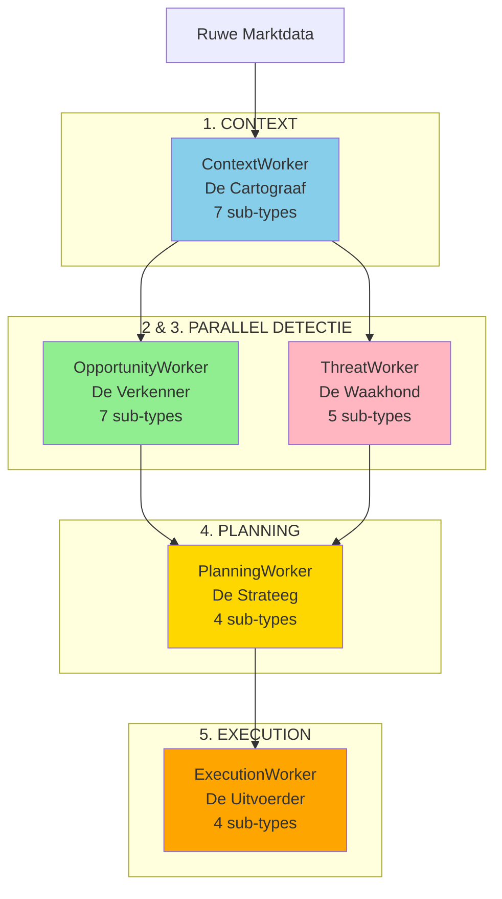

**Kernprincipe**: Elke categorie heeft één duidelijke verantwoordelijkheid (SRP).

---

## 5.2. ContextWorker - "De Cartograaf"

**Verantwoordelijkheid**: Verrijkt ruwe data met objectieve, beschrijvende context.

**Kernprincipe**: Objectief en beschrijvend - "Dit is wat er is"

### Input/Output Pattern

```python
# Typisch ContextWorker patroon
class MyContextWorker(StandardWorker):
    def process(self) -> DispositionEnvelope:
        # Input: basis context + platform providers
        base_ctx = self.context_provider.get_base_context()
        df = self.ohlcv_provider.get_window(base_ctx.timestamp, ...)
        
        # Verwerk: objectieve analyse
        result_dto = self._calculate_context(df)
        
        # Output: plaats DTO in cache
        self.context_provider.set_result_dto(self, result_dto)
        
        # Flow: continue naar volgende
        return DispositionEnvelope(disposition="CONTINUE")
```

### Sub-Types & Voorbeelden

#### 1. REGIME_CLASSIFICATION

**Doel**: Classificeer marktregime en condities.

```python
# plugins/context_workers/regime_classification/adx_filter/worker.py
class ADXTrendFilter(StandardWorker):
    """Classificeert trending vs ranging markt."""
    
    def process(self) -> DispositionEnvelope:
        # Bereken ADX
        adx_value = self._calculate_adx(df)
        
        # Classificeer regime
        result = MarketRegimeDTO(
            regime='trending' if adx_value > 25 else 'ranging',
            strength=adx_value / 100,
            timestamp=base_ctx.timestamp
        )
        
        self.context_provider.set_result_dto(self, result)
        return DispositionEnvelope(disposition="CONTINUE")
```

**Output DTO**:
```python
class MarketRegimeDTO(BaseModel):
    regime: Literal['trending', 'ranging', 'transitioning']
    strength: float  # 0.0 - 1.0
    timestamp: datetime
```

#### 2. STRUCTURAL_ANALYSIS

**Doel**: Identificeer technische marktstructuren.

```python
class MarketStructureDetector(StandardWorker):
    """Detecteert Break of Structure en CHoCH."""
    
    def process(self) -> DispositionEnvelope:
        # Analyseer swing points
        swings = self._identify_swings(df)
        
        # Detecteer structure breaks
        result = MarketStructureDTO(
            is_bos=self._is_break_of_structure(swings),
            is_choch=self._is_change_of_character(swings),
            trend_direction='bullish' if bullish else 'bearish',
            last_swing_high=swings.high,
            last_swing_low=swings.low
        )
        
        self.context_provider.set_result_dto(self, result)
        return DispositionEnvelope(disposition="CONTINUE")
```

#### 3. INDICATOR_CALCULATION

**Doel**: Bereken technische indicatoren.

```python
class EMADetector(StandardWorker):
    """Berekent EMA indicatoren."""
    
    def process(self) -> DispositionEnvelope:
        df = self.ohlcv_provider.get_window(...)
        
        result = EMAOutputDTO(
            ema_20=df['close'].ewm(span=20).mean().iloc[-1],
            ema_50=df['close'].ewm(span=50).mean().iloc[-1],
            ema_200=df['close'].ewm(span=200).mean().iloc[-1]
        )
        
        self.context_provider.set_result_dto(self, result)
        return DispositionEnvelope(disposition="CONTINUE")
```

---

## 5.3. OpportunityWorker - "De Verkenner"

**Verantwoordelijkheid**: Herkennen van handelskansen op basis van patronen.

**Kernprincipe**: Probabilistisch en creatief - "Ik zie een mogelijkheid"

### Input/Output Pattern

```python
# Typisch OpportunityWorker patroon
class MyOpportunityWorker(StandardWorker):
    def process(self) -> DispositionEnvelope:
        # Input: required DTOs uit cache
        required_dtos = self.context_provider.get_required_dtos(self)
        structure_dto = required_dtos[MarketStructureDTO]
        
        # Verwerk: pattern detectie
        if self._pattern_detected(structure_dto):
            # Output: publiceer signaal
            signal = OpportunitySignalDTO(
                opportunity_id=uuid4(),  # Causale ID
                signal_type='my_pattern',
                confidence=0.85
            )
            
            return DispositionEnvelope(
                disposition="PUBLISH",
                event_name="SIGNAL_GENERATED",
                event_payload=signal
            )
        
        # Geen kans gevonden
        return DispositionEnvelope(disposition="STOP")
```

### Sub-Types & Voorbeelden

#### TECHNICAL_PATTERN

**Doel**: Detecteer chart patronen.

```python
class FVGDetector(StandardWorker):
    """Detecteert Fair Value Gaps."""
    
    def process(self) -> DispositionEnvelope:
        # Haal structuur context
        required_dtos = self.context_provider.get_required_dtos(self)
        structure = required_dtos[MarketStructureDTO]
        
        # Alleen detecteren na structure break
        if not structure.is_bos:
            return DispositionEnvelope(disposition="STOP")
        
        # Check voor FVG
        df = self.ohlcv_provider.get_window(...)
        
        if self._is_fvg(df):
            signal = OpportunitySignalDTO(
                opportunity_id=uuid4(),
                timestamp=base_ctx.timestamp,
                signal_type='fvg_entry',
                confidence=0.85,
                metadata={'gap_size': 8.5}
            )
            
            return DispositionEnvelope(
                disposition="PUBLISH",
                event_name="SIGNAL_GENERATED",
                event_payload=signal
            )
        
        return DispositionEnvelope(disposition="STOP")
```

#### MOMENTUM_SIGNAL

```python
class TrendContinuation(StandardWorker):
    """Detecteert trend continuation signalen."""
    
    def process(self) -> DispositionEnvelope:
        required_dtos = self.context_provider.get_required_dtos(self)
        
        # Vereist regime en EMA data
        regime = required_dtos[MarketRegimeDTO]
        ema = required_dtos[EMAOutputDTO]
        
        # Alleen in trending markt
        if regime.regime != 'trending':
            return DispositionEnvelope(disposition="STOP")
        
        # Check momentum
        if self._momentum_confirmed(ema):
            signal = OpportunitySignalDTO(
                opportunity_id=uuid4(),
                signal_type='trend_continuation',
                confidence=regime.strength
            )
            
            return DispositionEnvelope(
                disposition="PUBLISH",
                event_name="SIGNAL_GENERATED",
                event_payload=signal
            )
        
        return DispositionEnvelope(disposition="STOP")
```

---

## 5.4. ThreatWorker - "De Waakhond"

**Verantwoordelijkheid**: Detecteren van risico's en bedreigingen.

**Kernprincipe**: Defensief en informatief - "Let op, hier is een risico"

### Input/Output Pattern

```python
# Typisch ThreatWorker patroon
class MyThreatWorker(StandardWorker):
    def process(self) -> DispositionEnvelope:
        # Input: ledger state via provider
        current_dd = self.ledger_provider.get_current_drawdown()
        
        # Verwerk: risico analyse
        if current_dd > self.params.max_drawdown:
            # Output: publiceer threat
            threat = CriticalEventDTO(
                threat_id=uuid4(),  # Causale ID
                threat_type='MAX_DRAWDOWN_BREACHED',
                severity='HIGH',
                details={'current': current_dd, 'max': self.params.max_drawdown}
            )
            
            return DispositionEnvelope(
                disposition="PUBLISH",
                event_name="THREAT_DETECTED",
                event_payload=threat
            )
        
        # Geen dreiging
        return DispositionEnvelope(disposition="STOP")
```

### Sub-Types & Voorbeelden

#### PORTFOLIO_RISK

```python
class MaxDrawdownMonitor(StandardWorker):
    """Monitort portfolio drawdown."""
    
    ledger_provider: ILedgerProvider
    
    def process(self) -> DispositionEnvelope:
        # Haal ledger staat
        current_dd = self.ledger_provider.get_current_drawdown()
        peak = self.ledger_provider.get_peak_capital()
        
        if current_dd > self.params.max_drawdown_percent:
            threat = CriticalEventDTO(
                threat_id=uuid4(),
                timestamp=self.context_provider.get_base_context().timestamp,
                threat_type='MAX_DRAWDOWN_BREACHED',
                severity='HIGH',
                details={
                    'current_drawdown': current_dd,
                    'max_allowed': self.params.max_drawdown_percent,
                    'peak_capital': peak
                }
            )
            
            return DispositionEnvelope(
                disposition="PUBLISH",
                event_name="THREAT_DETECTED",
                event_payload=threat
            )
        
        return DispositionEnvelope(disposition="STOP")
```

**Trigger**: Vaak event-driven via `LEDGER_STATE_CHANGED`

```yaml
# manifest.yaml
capabilities:
  events:
    enabled: true
    wirings:
      - listens_to: "LEDGER_STATE_CHANGED"
        invokes:
          method: "process"
```

#### MARKET_RISK

```python
class VolatilitySpikeDetector(StandardWorker):
    """Detecteert volatiliteit spikes."""
    
    def process(self) -> DispositionEnvelope:
        required_dtos = self.context_provider.get_required_dtos(self)
        atr = required_dtos[ATROutputDTO]
        
        # Haal historische ATR
        hist_atr = self.state_provider.get()['atr_percentiles']
        
        # Check spike
        current_percentile = self._calculate_percentile(atr.atr_14, hist_atr)
        
        if current_percentile > 95:
            threat = CriticalEventDTO(
                threat_id=uuid4(),
                threat_type='VOLATILITY_SPIKE',
                severity='MEDIUM',
                details={'percentile': current_percentile}
            )
            
            return DispositionEnvelope(
                disposition="PUBLISH",
                event_name="THREAT_DETECTED",
                event_payload=threat
            )
        
        return DispositionEnvelope(disposition="STOP")
```

---

## 5.5. PlanningWorker - "De Strateeg"

**Verantwoordelijkheid**: Transformeren van kansen naar concrete, uitvoerbare plannen.

**Kernprincipe**: Deterministisch en tactisch - "Gegeven deze kans, dit is het plan"

### Sequentiële Sub-Fases

Planning gebeurt in vier sequentiële stappen:

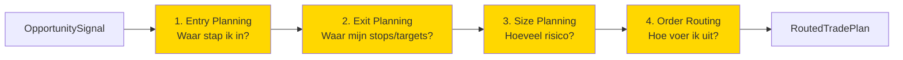

### Input/Output Pattern

```python
# Planning workers vormen een chain via DTOs
class EntryPlanner(StandardWorker):
    def process(self) -> DispositionEnvelope:
        # Input: OpportunitySignal (van EventBus) + Context DTOs
        required_dtos = self.context_provider.get_required_dtos(self)
        structure = required_dtos[MarketStructureDTO]
        
        # Bereken entry
        entry_price = self._calculate_entry(structure)
        
        # Output: EntryPlanDTO in cache
        plan = EntryPlanDTO(
            entry_price=entry_price,
            entry_type='LIMIT'
        )
        
        self.context_provider.set_result_dto(self, plan)
        return DispositionEnvelope(disposition="CONTINUE")

class ExitPlanner(StandardWorker):
    def process(self) -> DispositionEnvelope:
        # Input: EntryPlanDTO uit cache
        required_dtos = self.context_provider.get_required_dtos(self)
        entry_plan = required_dtos[EntryPlanDTO]
        
        # Bereken stops/targets
        exit_plan = ExitPlanDTO(
            stop_loss=self._calculate_stop(entry_plan),
            take_profit=self._calculate_target(entry_plan)
        )
        
        self.context_provider.set_result_dto(self, exit_plan)
        return DispositionEnvelope(disposition="CONTINUE")

# ... SizePlanner, OrderRouter ...

class OrderRouter(StandardWorker):
    """Laatste planner - publiceert complete plan."""
    
    def process(self) -> DispositionEnvelope:
        # Input: alle vorige plan DTOs
        required_dtos = self.context_provider.get_required_dtos(self)
        entry = required_dtos[EntryPlanDTO]
        exit = required_dtos[ExitPlanDTO]
        size = required_dtos[SizePlanDTO]
        
        # Creëer final plan
        final_plan = RoutedTradePlanDTO(
            trade_id=uuid4(),
            entry_price=entry.entry_price,
            stop_loss=exit.stop_loss,
            take_profit=exit.take_profit,
            position_size=size.position_size,
            order_type='LIMIT',
            routing_params={'tif': 'GTC'}
        )
        
        # Publiceer naar ExecutionWorker
        return DispositionEnvelope(
            disposition="PUBLISH",
            event_name="PLAN_READY",
            event_payload=final_plan
        )
```

### Sub-Types Detail

#### ENTRY_PLANNING

**Output**: [`EntryPlanDTO`](backend/dtos/pipeline/entry_plan_dto.py)

```python
class EntryPlanDTO(BaseModel):
    """Entry planning specificatie."""
    entry_price: float
    entry_type: Literal['MARKET', 'LIMIT', 'STOP']
    entry_params: Dict[str, Any] = {}
```

**Voorbeelden**:
- `limit_entry_at_fvg` - Limit order op FVG midpoint
- `market_entry_immediate` - Direct market order
- `twap_entry` - Time-weighted average entry

#### EXIT_PLANNING

**Input**: `EntryPlanDTO`  
**Output**: [`ExitPlanDTO`](backend/dtos/pipeline/exit_plan_dto.py)

```python
class ExitPlanDTO(BaseModel):
    """Exit planning specificatie."""
    stop_loss: float
    take_profit: float
    stop_type: str = 'LIMIT'
    target_type: str = 'LIMIT'
```

**Voorbeelden**:
- `liquidity_target_exit` - Targets op liquidity zones
- `atr_based_stops` - Stops gebaseerd op ATR
- `fixed_rr_exit` - Fixed Risk:Reward ratio

#### SIZE_PLANNING

**Input**: `ExitPlanDTO`  
**Output**: [`SizePlanDTO`](backend/dtos/pipeline/size_plan_dto.py)

```python
class SizePlanDTO(BaseModel):
    """Size planning specificatie."""
    position_size: float
    risk_amount: float
    sizing_rationale: str
```

**Voorbeelden**:
- `fixed_risk_sizer` - Fixed % per trade
- `kelly_criterion` - Kelly formula
- `adaptive_sizer` - Aanpassen op basis van threats

#### ORDER_ROUTING

**Input**: `SizePlanDTO`  
**Output**: [`RoutedTradePlanDTO`](backend/dtos/pipeline/routed_trade_plan.py) (via PUBLISH)

```python
class RoutedTradePlanDTO(BaseModel):
    """Complete, uitvoerbaar trade plan."""
    
    # Causale IDs
    trade_id: UUID
    opportunity_id: UUID  # Link naar opportunity
    
    # Entry
    entry_price: float
    entry_type: str
    
    # Exit
    stop_loss: float
    take_profit: float
    
    # Size
    position_size: float
    
    # Routing
    order_type: str
    routing_params: Dict[str, Any]
```

---

## 5.6. ExecutionWorker - "De Uitvoerder"

**Verantwoordelijkheid**: Uitvoeren en actief beheren van trades.

**Kernprincipe**: Actief en deterministisch - "Ik voer uit en beheer"

### Input/Output Pattern

```python
# Typisch ExecutionWorker patroon
class MyExecutionWorker(EventDrivenWorker):
    """Meestal event-driven."""
    
    execution_provider: IExecutionProvider
    ledger_provider: ILedgerProvider
    journal_writer: IJournalWriter
    
    def on_plan_ready(self, plan: RoutedTradePlanDTO) -> DispositionEnvelope:
        """Event handler voor PLAN_READY."""
        
        # Execute via provider
        result = self.execution_provider.place_order(
            asset=plan.asset,
            order_type=plan.order_type,
            price=plan.entry_price,
            size=plan.position_size
        )
        
        # Update ledger
        self.ledger_provider.add_position(...)
        
        # Log in journal
        self.journal_writer.log_entry({
            'event_type': 'TRADE_OPENED',
            'trade_id': plan.trade_id,
            'opportunity_id': plan.opportunity_id  # Causale link!
        })
        
        # Publiceer executie event
        return DispositionEnvelope(
            disposition="PUBLISH",
            event_name="TRADE_EXECUTED",
            event_payload=TradeExecutedDTO(...)
        )
```

### Sub-Types Detail

#### TRADE_INITIATION

**Trigger**: `PLAN_READY` event

```python
class DefaultPlanExecutor(EventDrivenWorker):
    """Voert trade plannen uit."""
    
    def on_plan_ready(self, plan: RoutedTradePlanDTO) -> DispositionEnvelope:
        # Execute trade
        order_result = self.execution_provider.place_order(...)
        
        # Log causale keten
        self.journal_writer.log_trade_opened(
            trade_id=plan.trade_id,
            opportunity_id=plan.opportunity_id  # Waarom geopend
        )
        
        return DispositionEnvelope(
            disposition="PUBLISH",
            event_name="TRADE_EXECUTED",
            event_payload=TradeExecutedDTO(...)
        )
```

#### POSITION_MANAGEMENT

**Trigger**: Vaak tijd-gebaseerd of op price updates

```python
class TrailingStopManager(EventDrivenWorker):
    """Beheert trailing stops - vereist state."""
    
    state_provider: IStateProvider
    
    def on_price_update(self, update: PriceUpdateDTO) -> DispositionEnvelope:
        """Update trailing stop bij nieuwe high."""
        
        # Haal state
        state = self.state_provider.get()
        hwm = state.get('high_water_mark', update.price)
        
        # Update HWM
        if update.price > hwm:
            state['high_water_mark'] = update.price
            self.state_provider.set(state)
            
            # Bereken nieuwe stop
            new_stop = hwm * (1 - self.params.trail_percent)
            
            # Modify order
            self.execution_provider.modify_stop(
                position_id=update.position_id,
                new_stop=new_stop
            )
            
            return DispositionEnvelope(
                disposition="PUBLISH",
                event_name="STOP_MODIFIED",
                event_payload=StopModifiedDTO(...)
            )
        
        return DispositionEnvelope(disposition="STOP")
```

#### RISK_SAFETY

**Trigger**: `THREAT_DETECTED` events

```python
class EmergencyExitAgent(EventDrivenWorker):
    """Emergency exit bij kritieke threats."""
    
    def on_threat_detected(self, threat: CriticalEventDTO) -> DispositionEnvelope:
        """React op threats."""
        
        # Alleen bij CRITICAL severity
        if threat.severity != 'CRITICAL':
            return DispositionEnvelope(disposition="STOP")
        
        # Close alle posities
        open_positions = self.ledger_provider.get_open_positions()
        
        for position in open_positions:
            self.execution_provider.close_position(
                position_id=position.id,
                reason='emergency_exit'
            )
            
            # Log met causale link
            self.journal_writer.log_trade_closed(
                trade_id=position.trade_id,
                threat_id=threat.threat_id  # Waarom gesloten!
            )
        
        return DispositionEnvelope(
            disposition="PUBLISH",
            event_name="EMERGENCY_EXIT_COMPLETE",
            event_payload=EmergencyExitDTO(...)
        )
```

#### OPERATIONAL

**Trigger**: Scheduled events

```python
class DCAExecutor(EventDrivenWorker):
    """Voert periodieke DCA aankopen uit."""
    
    def on_weekly_tick(self, tick: ScheduledTickDTO) -> DispositionEnvelope:
        """Weekly DCA purchase."""
        
        # Haal beschikbaar kapitaal
        available = self.ledger_provider.get_available_cash()
        
        # Bereken amount
        dca_amount = min(self.params.weekly_amount, available)
        
        if dca_amount > self.params.min_amount:
            # Execute DCA
            self.execution_provider.place_order(
                asset=self.params.asset,
                order_type='MARKET',
                size=dca_amount / base_ctx.current_price
            )
            
            return DispositionEnvelope(
                disposition="PUBLISH",
                event_name="DCA_EXECUTED",
                event_payload=DCAExecutedDTO(amount=dca_amount)
            )
        
        return DispositionEnvelope(disposition="STOP")
```

---

## 5.7. Worker Category Overzicht

### Data Flow Samenvatting

| Categorie | Primaire Input | Primaire Output | Disposition |
|-----------|---------------|-----------------|-------------|
| **ContextWorker** | Platform providers | Plugin DTOs → Cache | CONTINUE |
| **OpportunityWorker** | Cache DTOs | OpportunitySignalDTO → EventBus | PUBLISH of STOP |
| **ThreatWorker** | Cache DTOs + Ledger | CriticalEventDTO → EventBus | PUBLISH of STOP |
| **PlanningWorker** | Cache DTOs (chain) | Plan DTOs → Cache<br/>Final: PUBLISH | CONTINUE<br/>Final: PUBLISH |
| **ExecutionWorker** | EventBus events | Side-effects + Events | PUBLISH |

### Causale ID Generatie

| Worker Type | Genereert ID | Gebruikt ID |
|-------------|--------------|-------------|
| **OpportunityWorker** | `opportunity_id` | - |
| **ThreatWorker** | `threat_id` | - |
| **PlanningWorker** | `trade_id` | `opportunity_id` (link) |
| **ExecutionWorker** | - | `trade_id`, `threat_id` (logging) |

---

## 5.8. Manifest Templates per Categorie

### ContextWorker Template

```yaml
identification:
  name: "my_context_worker"
  type: "context_worker"
  subtype: "indicator_calculation"  # of andere context sub-type

requires_capability:
  - "ohlcv_window"

requires_dtos: []  # Meestal geen, tenzij chained

produces_dtos:
  - dto_type: "MyOutputDTO"
    local_path: "dtos/my_output_dto.py"

capabilities:
  state:
    enabled: false  # Meestal niet nodig
  events:
    enabled: false  # Nooit voor pure ContextWorkers
```

### OpportunityWorker Template

```yaml
identification:
  name: "my_opportunity_worker"
  type: "opportunity_worker"
  subtype: "technical_pattern"  # of andere opportunity sub-type

requires_capability:
  - "ohlcv_window"  # Optioneel

requires_dtos:
  - dto_type: "MarketStructureDTO"  # Context van andere workers
    expected_path: "backend.dto_reg.s1mple.market_structure.v1_0_0.structure_dto"

produces_dtos: []  # Publiceert via EventBus, niet cache

capabilities:
  state:
    enabled: false  # Alleen als nodig voor pattern tracking
  events:
    enabled: false  # Gebruikt DispositionEnvelope.PUBLISH
```

### ThreatWorker Template (Event-Driven)

```yaml
identification:
  name: "my_threat_worker"
  type: "threat_worker"
  subtype: "portfolio_risk"

requires_capability:
  - "ledger_state"

requires_dtos: []

produces_dtos: []

capabilities:
  events:
    enabled: true
    wirings:
      - listens_to: "LEDGER_STATE_CHANGED"
        invokes:
          method: "on_ledger_update"
    publishes:
      - event_name: "THREAT_DETECTED"
```

### PlanningWorker Template

```yaml
identification:
  name: "my_entry_planner"
  type: "planning_worker"
  subtype: "entry_planning"

requires_dtos:
  - dto_type: "MarketStructureDTO"
    expected_path: "..."

produces_dtos:
  - dto_type: "EntryPlanDTO"
    local_path: "dtos/entry_plan_dto.py"

capabilities:
  state:
    enabled: false
  events:
    enabled: false  # Standard flow via cache
```

### ExecutionWorker Template (Event-Driven)

```yaml
identification:
  name: "my_executor"
  type: "execution_worker"
  subtype: "trade_initiation"

requires_capability:
  - "execution_provider"
  - "ledger_state"
  - "journaling"

requires_dtos: []

produces_dtos: []

capabilities:
  events:
    enabled: true
    wirings:
      - listens_to: "PLAN_READY"
        invokes:
          method: "on_plan_ready"
    publishes:
      - event_name: "TRADE_EXECUTED"
```

---

## 5.9. Quick Reference: Welke Worker Type?

### Beslisboom

```
Je wilt data verrijken met objectieve info?
└─> ContextWorker
    └─> Welk type data?
        ├─> Markt regime → regime_classification
        ├─> Structuren (swings, zones) → structural_analysis
        ├─> Indicatoren (EMA, RSI) → indicator_calculation
        └─> ...

Je wilt handelskansen detecteren?
└─> OpportunityWorker
    └─> Wat voor signaal?
        ├─> Chart patroon → technical_pattern
        ├─> Momentum → momentum_signal
        ├─> Mean reversion → mean_reversion
        └─> ...

Je wilt risico's detecteren?
└─> ThreatWorker
    └─> Wat voor risico?
        ├─> Portfolio (drawdown) → portfolio_risk
        ├─> Markt (volatility) → market_risk
        ├─> Systeem (connection) → system_health
        └─> ...

Je wilt een signaal omzetten naar een plan?
└─> PlanningWorker
    └─> Welke fase?
        ├─> Entry bepalen → entry_planning
        ├─> Exit bepalen → exit_planning
        ├─> Size bepalen → size_planning
        └─> Routing bepalen → order_routing

Je wilt trades uitvoeren of beheren?
└─> ExecutionWorker
    └─> Wat voor actie?
        ├─> Trade openen → trade_initiation
        ├─> Positie beheren → position_management
        ├─> Noodmaatregelen → risk_safety
        └─> Geplande taken (DCA) → operational
```

---

**Einde Hoofdstuk 5**

Dit hoofdstuk beschrijft het complete Worker Ecosysteem met alle 5 categorieën en 27 sub-types, inclusief input/output patronen, voorbeelden en templates voor elk type.

---

# 06_Workflow_Orkestratie.md


# Hoofdstuk 6: Workflow Orkestratie

**Status:** Definitief
**Versie:** 4.0

---

## 6.1. Het Platgeslagen Model

In het platgeslagen model is er **geen orkestrerende laag** (geen Operators). De workflow wordt volledig bepaald door **expliciete bedrading** via EventAdapters.

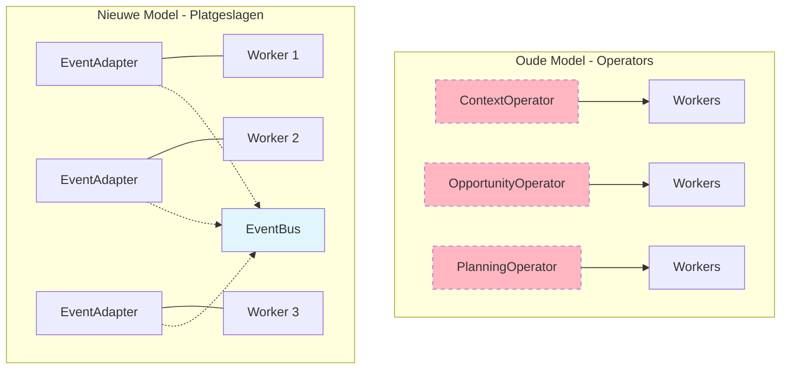

**Kernverschil**: Workers communiceren via EventBus, niet via Operators.

---

## 6.2. Complete Tick Lifecycle

Een complete data-verwerkingscyclus van RAW_TICK tot trade execution:

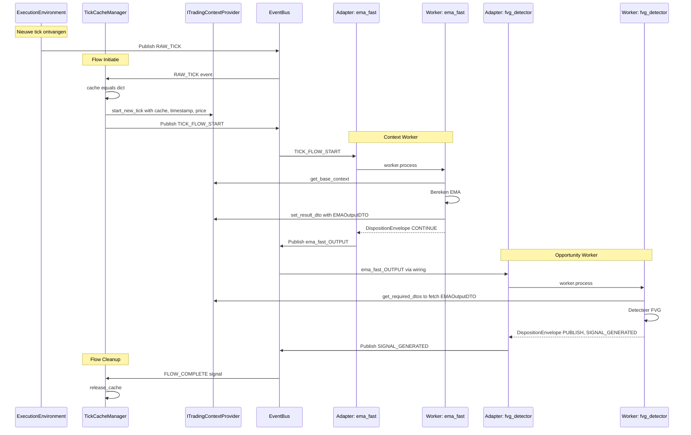

---

## 6.3. Flow Patronen

### 6.3.1. Sequentiële Keten

**UI**: Workers onder elkaar geplaatst in Strategy Builder

**Wiring**:

```yaml
wiring_rules:
  - wiring_id: "flow_start_to_w1"
    source: {component_id: "TickCacheManager", event_name: "TICK_FLOW_START"}
    target: {component_id: "ema_fast", handler_method: "process"}
  
  - wiring_id: "w1_to_w2"
    source: {component_id: "ema_fast", event_name: "ema_fast_OUTPUT"}
    target: {component_id: "ema_slow", handler_method: "process"}
```

**Data**: Elke worker plaatst DTO in cache, volgende haalt op.

### 6.3.2. Parallelle Detectie

**UI**: Workers naast elkaar geplaatst

**Wiring**:

```yaml
wiring_rules:
  - wiring_id: "context_to_fvg"
    source: {component_id: "structure_det", event_name: "structure_det_OUTPUT"}
    target: {component_id: "fvg_detector", handler_method: "process"}
  
  - wiring_id: "context_to_breakout"
    source: {component_id: "structure_det", event_name: "structure_det_OUTPUT"}
    target: {component_id: "breakout_scanner", handler_method: "process"}
```

**Data**: Beide workers delen Tick Cache, publiceren onafhankelijk.

### 6.3.3. Event Coordinatie

**UI**: Event-aware workers met custom events

**Manifest**:

```yaml
capabilities:
  events:
    enabled: true
    wirings:
      - listens_to: "DCA_OPPORTUNITY_SCORED"
        invokes: {method: "on_opportunity_scored"}
      - listens_to: "DCA_RISK_ASSESSED"
        invokes: {method: "on_risk_assessed"}
```

**Worker**:

```python
class AdaptiveDCAPlanner(EventDrivenWorker):
    state_provider: IStateProvider
    
    def on_opportunity_scored(self, score_dto):
        state = self.state_provider.get()
        state['opportunity_score'] = score_dto.score
        self.state_provider.set(state)
        self._try_create_plan()
    
    def on_risk_assessed(self, risk_dto):
        state = self.state_provider.get()
        state['risk_level'] = risk_dto.risk_level
        self.state_provider.set(state)
        self._try_create_plan()
    
    def _try_create_plan(self):
        state = self.state_provider.get()
        
        if 'opportunity_score' in state and 'risk_level' in state:
            # Beide ontvangen - maak plan
            amount = self._decide_amount(
                state['opportunity_score'],
                state['risk_level']
            )
            
            if amount > 0:
                plan = DCAplanDTO(amount=amount)
                self.state_provider.set({})  # Reset
                
                return DispositionEnvelope(
                    disposition="PUBLISH",
                    event_name="DCA_PLAN_READY",
                    event_payload=plan
                )
```

---

## 6.4. Strategy Builder UI: Wiring Generatie

De UI is de intelligente generator van strategy_wiring_map.yaml.

### UI Workflow

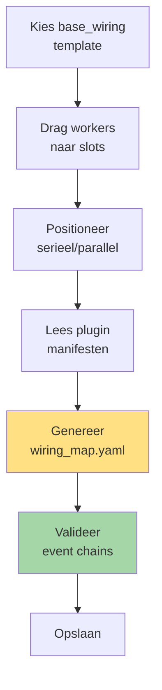

### Generatie Logica

**Seriële positionering**:
```
User plaatst: [A] → [B] → [C]

UI genereert:
  TICK_FLOW_START → A
  A_OUTPUT → B
  B_OUTPUT → C
```

**Parallelle positionering**:
```
User plaatst: [A]
              [B] (parallel)

UI genereert:
  TICK_FLOW_START → A
  TICK_FLOW_START → B
```

**Custom events** (uit manifest):
```
Manifest van A: publishes: ["MY_EVENT"]
Manifest van B: wirings: listens_to: "MY_EVENT"

UI genereert:
  MY_EVENT → B.on_my_event()
```

---

## 6.5. Causale Traceerbaarheid

Alle belangrijke beslissingen worden gelogd met causale IDs.

### ID Types

| ID Type | Gegenereerd Door | Betekenis |
|---------|------------------|-----------|
| `opportunity_id` | OpportunityWorker | Waarom trade geopend? |
| `threat_id` | ThreatWorker | Waarom trade gewijzigd/gesloten? |
| `trade_id` | PlanningWorker | Primaire trade identifier |
| `scheduled_id` | Scheduler | Waarom nu uitgevoerd? |

### Journal Logging

```python
# In ExecutionWorker
self.journal_writer.log_trade_opened(
    trade_id=plan.trade_id,
    opportunity_id=plan.opportunity_id  # Causale link!
)

# Later bij close
self.journal_writer.log_trade_closed(
    trade_id=position.trade_id,
    threat_id=threat.threat_id  # Causale link naar threat!
)
```

### Analyse Mogelijkheden

Met causale IDs kan men:
- Alle trades van één opportunity type analyseren
- Zien waarom trades werden afgewezen (threat_id)
- Win rate per opportunity pattern berekenen
- Impact van threats op performance meten

---

## 6.6. Feedback Loops

### Real-time Feedback (Binnen Operation)

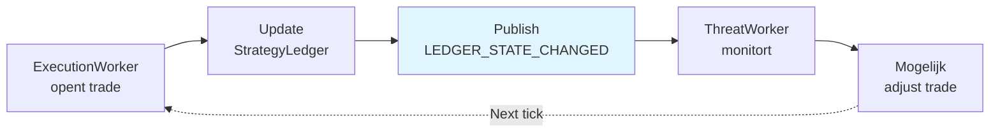

### Strategic Feedback (Tussen Operations)

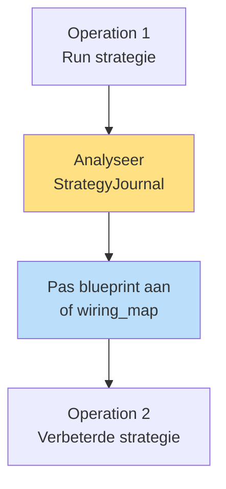

---

## 6.7. Validation & Safety

### Bootstrap Validaties

Alle validaties gebeuren **voor** runtime start:

```python
# Bootstrap sequence met validaties
def bootstrap_strategy(build_specs):
    # 1. Validate event chains
    event_validator.validate(build_specs.strategy_wiring_spec)
    # → Check: alle triggers hebben publishers
    # → Check: geen circular dependencies
    # → Check: payload types consistent
    
    # 2. Validate data dependencies
    dependency_validator.validate(
        build_specs.workforce_spec,
        build_specs.strategy_wiring_spec
    )
    # → Check: required DTOs worden geproduceerd
    # → Check: executie volgorde vs dependencies
    
    # 3. Validate config
    config_validator.validate_all(build_specs)
    # → Check: alle referenties bestaan
    # → Check: parameters valid
    
    # Als ALLE validaties slagen → build runtime
    factories.build_from_specs(build_specs)
```

### Runtime Safety

- **Point-in-Time**: Providers weigeren toekomstige data
- **Type Safety**: Pydantic validatie op alle DTOs
- **Permission Checks**: Adapters valideren allowed events
- **Atomic Writes**: State persistence crash-safe

---

## 6.8. Voordelen van Platgeslagen Model

### vs Operator Model

| Aspect | Met Operators | Platgeslagen |
|--------|--------------|--------------|
| **Transparantie** | Impliciet via operator strategie | Expliciet in wiring_map |
| **Flexibiliteit** | Beperkt door operator categorieën | Volledig vrij |
| **UI Rol** | Configureert workers | Genereert complete flow |
| **Debugging** | Operator + workers | Alleen workers + wiring |
| **Testing** | Mock operators + workers | Mock adapter config |
| **Complexiteit** | Operator laag + adapters | Alleen adapters |

### Kernvoordelen

✅ **Expliciete Flow**: Complete workflow zichtbaar in één bestand
✅ **UI-Driven**: Strategy Builder genereert bedrading
✅ **Flexibel**: Ondersteunt alle patronen (sequential, parallel, event-driven)
✅ **Valideerbaar**: Complete analyse tijdens bootstrap
✅ **Testbaar**: Mock wiring specs in tests
✅ **Schaalbaar**: Geen performance overhead van extra laag

---

**Einde Hoofdstuk 6**

Dit hoofdstuk beschrijft de complete workflow orkestratie in het platgeslagen model, waar de expliciete bedrading via strategy_wiring_map.yaml de volledige flow definieert zonder tussenliggende Operator laag.

---

# 07_Frontend_Integration.md

# Hoofdstuk 7: Frontend Integration

**Status:** Definitief  
**Versie:** 4.0

---

## 7.1. Strategy Builder UI: De Wiring Generator

De Strategy Builder UI is de **belangrijkste tool** in de nieuwe architectuur - het is de generator van de strategy_wiring_map.yaml.

### UI Workflow

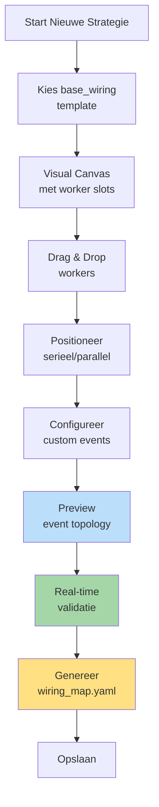

### Canvas Layout

```
┌─────────────────────────────────────────────────────┐
│  STRATEGY BUILDER: ICT/SMC Strategy                 │
├─────────────────────────────────────────────────────┤
│                                                      │
│  ┌─── CONTEXT PHASE (Sequential) ─────────────┐   │
│  │                                              │   │
│  │  [1] ema_detector (fast)                    │   │
│  │       ↓ (UI shows flow arrow)               │   │
│  │  [2] ema_detector (slow)                    │   │
│  │       ↓                                      │   │
│  │  [3] market_structure_detector              │   │
│  │                                              │   │
│  └──────────────────────────────────────────────┘   │
│                                                      │
│  ┌─── OPPORTUNITY PHASE (Parallel) ───────────┐   │
│  │                                              │   │
│  │  [A] fvg_detector        [B] breakout_scan │   │
│  │      (parallel - UI shows side-by-side)     │   │
│  │                                              │   │
│  └──────────────────────────────────────────────┘   │
│                                                      │
│  ┌─── THREAT MONITORING (Event-Driven) ───────┐   │
│  │                                              │   │
│  │  [⚡] max_drawdown_monitor                  │   │
│  │      Triggers: LEDGER_STATE_CHANGED         │   │
│  │      Publishes: THREAT_DETECTED             │   │
│  │                                              │   │
│  └──────────────────────────────────────────────┘   │
│                                                      │
│  [Generate Wiring] [Preview Topology] [Validate]   │
└─────────────────────────────────────────────────────┘
```

### Intelligente Generatie

**Seriële detectie**:
```javascript
// UI detecteert verticale positionering
if (worker2.y > worker1.y + threshold) {
  // Genereer chain
  wiring_rules.push({
    source: {component_id: worker1.id, event_name: `${worker1.id}_OUTPUT`},
    target: {component_id: worker2.id, handler_method: "process"}
  });
}
```

**Parallelle detectie**:
```javascript
// UI detecteert horizontale positionering
if (Math.abs(worker1.y - worker2.y) < threshold) {
  // Beiden triggeren op zelfde event
  const trigger_event = findPreviousPhaseOutput();
  
  wiring_rules.push(
    {source: {event_name: trigger_event}, target: {component_id: worker1.id}},
    {source: {event_name: trigger_event}, target: {component_id: worker2.id}}
  );
}
```

**Custom events**:
```javascript
// UI leest manifest en tekent automatisch verbindingen
if (worker.manifest.capabilities?.events?.publishes) {
  for (const published_event of worker.manifest.capabilities.events.publishes) {
    // Zoek listeners
    const listeners = findWorkersListeningTo(published_event.event_name);
    
    // Teken verbindingen
    for (const listener of listeners) {
      drawEventConnection(worker, listener, published_event.event_name);
      
      // Genereer wiring rule
      wiring_rules.push({
        source: {component_id: worker.id, event_name: published_event.event_name},
        target: {component_id: listener.id, handler_method: listener.handler}
      });
    }
  }
}
```

---

## 7.2. Plugin Library & Discovery

### Multi-Dimensionale Filtering

```
┌─────────────────────────────────────────────────────┐
│  PLUGIN LIBRARY                                      │
├─────────────────────────────────────────────────────┤
│                                                      │
│  Filters:                                           │
│  Worker Type:  [OpportunityWorker ▼]               │
│  Sub-Type:     [technical_pattern ▼]               │
│  Capabilities: [☐ state] [☐ events]                │
│  Search:       [fvg______________]                  │
│                                                      │
│  ─────────────────────────────────────────────────  │
│                                                      │
│  📦 fvg_detector                    ⭐⭐⭐⭐⭐      │
│  OpportunityWorker / Technical Pattern             │
│  Badges: [StandardWorker] [Pure Logic]             │
│                                                      │
│  Requires DTOs:                                     │
│  • MarketStructureDTO                              │
│  • EMAOutputDTO                                     │
│                                                      │
│  Produces: OpportunitySignalDTO (via PUBLISH)      │
│                                                      │
│  [Add to Strategy] [View Details] [Clone]          │
│                                                      │
│  ─────────────────────────────────────────────────  │
│                                                      │
│  📦 adaptive_dca_planner            ⭐⭐⭐⭐       │
│  PlanningWorker / Entry Planning                    │
│  Badges: [EventDrivenWorker] [State] [Events]      │
│                                                      │
│  Listens to: DCA_OPPORTUNITY_SCORED, DCA_RISK      │
│  Publishes: DCA_PLAN_READY                         │
│                                                      │
│  [Add to Strategy] [Configure Events] [Docs]       │
└─────────────────────────────────────────────────────┘
```

### TypeScript Interfaces

```typescript
// frontend/src/types/plugin.ts
interface PluginCard {
  identification: {
    name: string;
    displayName: string;
    type: WorkerType;
    subtype: string;
    version: string;
  };
  
  dependencies: {
    requiresCapability: string[];
    requiresDtos: DtoReference[];
    producesDtos: DtoReference[];
  };
  
  capabilities: {
    state?: boolean;
    events?: {
      publishes: string[];
      wirings: EventWiring[];
    };
  };
  
  isCompatible: boolean;
  popularity: number;
}

interface DtoReference {
  dtoType: string;
  expectedPath: string;
}
```

---

## 7.3. Event Topology Viewer

Visuele weergave van complete event chain.

```
┌─────────────────────────────────────────────────────┐
│  EVENT TOPOLOGY: ict_smc_strategy                   │
├─────────────────────────────────────────────────────┤
│                                                      │
│              ┌──────────────┐                       │
│              │TickCache     │                       │
│              │Manager       │                       │
│              └──────┬───────┘                       │
│                     │ TICK_FLOW_START               │
│                     ▼                                │
│       ┌─────────────────────────┐                  │
│       │ ema_fast                 │                  │
│       └──────────┬──────────────┘                  │
│                  │ ema_fast_OUTPUT                  │
│                  ▼                                   │
│       ┌─────────────────────────┐                  │
│       │ ema_slow                 │                  │
│       └──────────┬──────────────┘                  │
│                  │ ema_slow_OUTPUT                  │
│           ┌──────┴──────┐                           │
│           ▼             ▼                            │
│    ┌──────────┐  ┌──────────┐                      │
│    │fvg_det   │  │breakout  │                      │
│    └────┬─────┘  └────┬─────┘                      │
│         │             │                              │
│         └──────┬──────┘                             │
│                │ SIGNAL_GENERATED                    │
│                ▼                                      │
│       ┌─────────────────┐                           │
│       │ Planning Chain   │                           │
│       └─────────────────┘                           │
│                                                      │
│  Click node for details | Export PNG                │
└─────────────────────────────────────────────────────┘
```

---

## 7.4. Trade Explorer: Causale Analyse

```
┌─────────────────────────────────────────────────────┐
│  TRADE EXPLORER                                      │
├─────────────────────────────────────────────────────┤
│                                                      │
│  Filters:                                           │
│  OpportunityID: [abc-123___] 🔍                    │
│  ThreatID:      [__________ ] 🔍                    │
│  TradeID:       [__________ ] 🔍                    │
│                                                      │
│  ─────────────────────────────────────────────────  │
│                                                      │
│  📊 Trade #42: +€125.00 (+2.5%)                    │
│  ┌────────────────────────────────────────────┐    │
│  │                                             │    │
│  │  🆔 TradeID: def-456-abc                   │    │
│  │                                             │    │
│  │  🔗 Causale Keten:                         │    │
│  │  ┌──────────────────────────────────┐     │    │
│  │  │ Geopend vanwege:                  │     │    │
│  │  │ 💡 OpportunityID: abc-123-xyz     │     │    │
│  │  │    → fvg_detector                 │     │    │
│  │  │    → Confidence: 85%              │     │    │
│  │  │    → Gap size: 8.5 pips           │     │    │
│  │  │                                    │     │    │
│  │  │ Gesloten vanwege:                 │     │    │
│  │  │ 🎯 Take profit hit                │     │    │
│  │  │    (geen threat)                  │     │    │
│  │  └──────────────────────────────────┘     │    │
│  │                                             │    │
│  │  [View Context] [Replay] [Similar Trades] │    │
│  └────────────────────────────────────────────┘    │
│                                                      │
│  📊 Trade #43: -€50.00 (-1.0%) ⚠️                 │
│  ┌────────────────────────────────────────────┐    │
│  │  🆔 TradeID: ghi-789-def                   │    │
│  │                                             │    │
│  │  🔗 Causale Keten:                         │    │
│  │  ┌──────────────────────────────────┐     │    │
│  │  │ Geopend vanwege:                  │     │    │
│  │  │ 💡 OpportunityID: jkl-012-mno     │     │    │
│  │  │                                    │     │    │
│  │  │ Gesloten vanwege:                 │     │    │
│  │  │ ⚠️ ThreatID: pqr-345-stu         │     │    │
│  │  │    → max_drawdown_monitor         │     │    │
│  │  │    → Drawdown: 2.5% (max: 2.0%)  │     │    │
│  │  │    → Emergency exit triggered     │     │    │
│  │  └──────────────────────────────────┘     │    │
│  └────────────────────────────────────────────┘    │
└─────────────────────────────────────────────────────┘
```

### BFF API Endpoints

```typescript
// GET /api/strategies/:strategyId/topology
interface EventTopologyResponse {
  nodes: TopologyNode[];
  edges: TopologyEdge[];
  validation: ValidationResult;
}

// POST /api/strategies/generate-wiring
interface GenerateWiringRequest {
  baseWiringTemplateId: string;
  workers: WorkerPlacement[];  // instance_id, plugin, position
}

interface GenerateWiringResponse {
  wiringMap: WiringMap;
  validationResult: ValidationResult;
  previewTopology: EventTopology;
}

// GET /api/trades/:tradeId/causal-chain
interface CausalChainResponse {
  tradeId: string;
  opportunityId: string;
  threatId?: string;
  timeline: CausalEvent[];
}
```

---

## 7.5. Live Monitoring Dashboard

```
┌─────────────────────────────────────────────────────┐
│  LIVE STRATEGY: ict_smc_strategy                    │
├─────────────────────────────────────────────────────┤
│                                                      │
│  📊 StrategyLedger (Operationeel)                   │
│  Capital: €10,000 | Realized: +€523 | Open: 1      │
│                                                      │
│  📜 StrategyJournal (Analytisch)                    │
│  Opportunities: 47 | Accepted: 15 | Rejected: 32    │
│                                                      │
│  ⚠️ Active Threats                                  │
│  🟡 Drawdown: 6.2% (threshold: 10%)                │
│  🟢 Volatility: Normal                              │
│                                                      │
│  📡 Real-time Event Stream                          │
│  14:25:32  TICK_FLOW_START                         │
│  14:25:33  ema_fast_OUTPUT                         │
│  14:25:34  SIGNAL_GENERATED (fvg_detector)         │
│  14:25:35  THREAT_DETECTED (drawdown_monitor)      │
│  14:25:36  OPPORTUNITY_REJECTED (risk too high)    │
│                                                      │
│  [⏸️ Pause] [🛑 Emergency Stop] [⚙️ Settings]     │
└─────────────────────────────────────────────────────┘
```

---

## 7.6. Belangrijkste UI Updates vs V3.0

### Vervallen UI Componenten ❌

- Operator Configuration UI (operators.yaml editor)
- Operator strategy visualizer
- Execution/Aggregation strategy selectors

### Nieuwe UI Componenten ✨

- **Wiring Canvas**: Visuele worker positionering
- **Event Topology Viewer**: Complete event chain visualisatie
- **Wiring Generator**: Automatische strategy_wiring_map.yaml generatie
- **Real-time Validation**: Event chain validatie tijdens design
- **DTO Dependency Graph**: Visualisatie van DTO afhankelijkheden

### Behouden UI Componenten ✅

- Plugin Library (met filtering)
- Trade Explorer (causale analyse)
- Live Monitoring
- Backtest Results
- Parameter Configuration

---

**Einde Hoofdstuk 7**

Dit hoofdstuk beschrijft de frontend integratie met focus op de Strategy Builder als centrale wiring generator en de causale analyse tools.

---

# 08_Robuustheid_Operations.md

# Hoofdstuk 8: Robuustheid & Operations

**Status:** Definitief  
**Versie:** 4.0

---

## 8.1. Persistence Suite

De [`PersistorFactory`](backend/assembly/persistor_factory.py) creëert drie gespecialiseerde persistors.

### Interface-Gedreven Persistentie

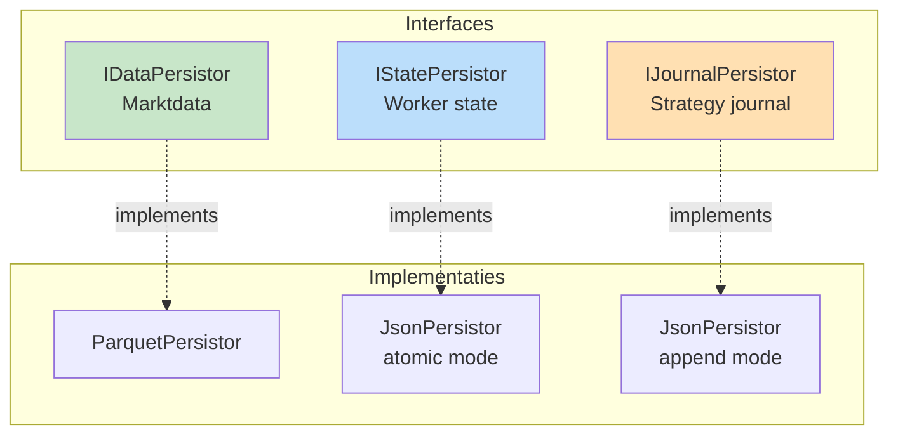

### Atomic Writes (Crash-Safe)

**Pattern**: Write-Ahead Log (journaling)

```python
# backend/data/persistors/json_persistor.py
class JsonPersistor:
    """Crash-safe JSON persistence."""
    
    def save_atomic(self, data: dict) -> None:
        """
        Atomic write pattern.
        
        Stappen:
        1. Write to .journal file
        2. fsync (force to disk)
        3. Atomic rename
        """
        journal_path = f"{self.path}.journal"
        
        # 1. Write to journal
        with open(journal_path, 'w') as f:
            json.dump(data, f, indent=2)
            f.flush()
            os.fsync(f.fileno())  # 2. Force to disk
        
        # 3. Atomic rename (all-or-nothing)
        os.replace(journal_path, self.path)
    
    def load(self) -> dict:
        """Load with automatic crash recovery."""
        
        # Check for incomplete write
        if os.path.exists(f"{self.path}.journal"):
            # Crash during write - complete it
            os.replace(f"{self.path}.journal", self.path)
        
        # Load normal file
        if os.path.exists(self.path):
            with open(self.path, 'r') as f:
                return json.load(f)
        
        return {}
```

---

## 8.2. Causaal Traceability Framework

Vier getypeerde IDs voor complete "waarom"-analyse.

### ID Types

```python
# backend/dtos/pipeline/signal.py
class OpportunitySignalDTO(BaseModel):
    opportunity_id: UUID = Field(default_factory=uuid4)  # Waarom geopend?
    # ...

# backend/dtos/execution/critical_event.py
class CriticalEventDTO(BaseModel):
    threat_id: UUID = Field(default_factory=uuid4)  # Waarom gesloten?
    # ...

# backend/dtos/pipeline/routed_trade_plan.py
class RoutedTradePlanDTO(BaseModel):
    trade_id: UUID = Field(default_factory=uuid4)  # Primaire ID
    opportunity_id: UUID  # Causale link terug!
    # ...
```

### Journal Logging met Causale Links

```python
# In ExecutionWorker
class DefaultPlanExecutor(EventDrivenWorker):
    def on_plan_ready(self, plan: RoutedTradePlanDTO):
        # Execute trade
        result = self.execution_provider.place_order(...)
        
        # Log met causale context
        self.journal_writer.log_trade_opened(
            trade_id=plan.trade_id,
            opportunity_id=plan.opportunity_id,  # ← Causale link
            details={
                'entry_price': result.fill_price,
                'position_size': result.filled_quantity
            }
        )

# Later bij close
class RiskSafetyWorker(EventDrivenWorker):
    def on_threat(self, threat: CriticalEventDTO):
        # Close positions
        for position in self.ledger_provider.get_open_positions():
            self.execution_provider.close_position(...)
            
            # Log met threat link
            self.journal_writer.log_trade_closed(
                trade_id=position.trade_id,
                threat_id=threat.threat_id,  # ← Waarom gesloten
                closure_reason='emergency_exit'
            )
```

---

## 8.3. State Reconciliation (Live Trading)

Voor live omgevingen: periodieke sync met exchange.

```python
# services/reconciliation_service.py
class ReconciliationService:
    """Reconcilieert internal state met exchange."""
    
    def reconcile(self, strategy_link_id: str) -> ReconciliationResult:
        """
        Pull-based state verificatie.
        
        Workflow:
        1. Haal "truth" van exchange (via IAPIConnector)
        2. Vergelijk met StrategyLedger
        3. Corrigeer discrepanties
        4. Log verschillen
        """
        # 1. Get exchange truth
        exchange_positions = self.api_connector.get_open_positions()
        exchange_orders = self.api_connector.get_open_orders()
        
        # 2. Get internal state
        internal_positions = self.ledger_provider.get_open_positions()
        
        # 3. Compare
        discrepancies = self._find_discrepancies(
            exchange_positions,
            internal_positions
        )
        
        # 4. Correct
        for disc in discrepancies:
            self.ledger_provider.force_update(disc.correction)
            logger.critical(f"State discrepancy corrected: {disc}")
        
        return ReconciliationResult(
            discrepancies_found=len(discrepancies),
            corrections_applied=len(discrepancies)
        )
```

**Trigger**: 
- Bij startup (altijd)
- Periodiek (via Scheduler - elk 5 minuten)
- Na netwerk reconnect

---

## 8.4. Supervisor Model (Crash Recovery)

External watchdog voor automatic restart.

```python
# run_supervisor.py
"""
Supervisor watchdog voor live trading.

Monitort main process en restart bij crash.
"""
import subprocess
import time

def main():
    """Main supervisor loop."""
    
    while True:
        try:
            # Start main process
            process = subprocess.Popen([
                'python', 'services/operation_service.py',
                '--operation', 'live_operation'
            ])
            
            # Wait for completion
            return_code = process.wait()
            
            if return_code != 0:
                # Crash detected
                logger.error(f"Process crashed with code {return_code}")
                logger.info("Restarting in 5 seconds...")
                time.sleep(5)
                # Loop continues - restart
            else:
                # Normal exit
                break
                
        except KeyboardInterrupt:
            # User stop
            process.terminate()
            break
```

**Recovery bij restart**:
1. JsonPersistor.load() herstelt state (via .journal recovery)
2. ReconciliationService sync met exchange
3. EventWiringFactory rebuild adapters
4. Normal operation resume

---

## 8.5. Network Resilience

### Connection Monitoring

```python
# plugins/threat_workers/system_health/connection_monitor/worker.py
class ConnectionMonitor(EventDrivenWorker):
    """Monitort netwerk connectie."""
    
    def on_heartbeat_timeout(self, event) -> DispositionEnvelope:
        """Triggered bij gemiste heartbeat."""
        
        # Publish threat
        threat = CriticalEventDTO(
            threat_id=uuid4(),
            threat_type='CONNECTION_LOST',
            severity='CRITICAL',
            details={'last_heartbeat': event.last_seen}
        )
        
        return DispositionEnvelope(
            disposition="PUBLISH",
            event_name="THREAT_DETECTED",
            event_payload=threat
        )
```

### Circuit Breaker

```python
# plugins/execution_workers/risk_safety/circuit_breaker/worker.py
class CircuitBreaker(EventDrivenWorker):
    """Halt trading bij systeem problemen."""
    
    def on_threat(self, threat: CriticalEventDTO) -> DispositionEnvelope:
        """React op system threats."""
        
        if threat.threat_type == 'CONNECTION_LOST':
            # Halt nieuwe trades
            self._halt_flag = True
            
            # Optioneel: close alle posities
            if self.params.close_on_disconnect:
                self._emergency_close_all()
            
            return DispositionEnvelope(
                disposition="PUBLISH",
                event_name="TRADING_HALTED",
                event_payload=HaltedDTO(reason='connection_lost')
            )
        
        return DispositionEnvelope(disposition="STOP")
```

---

## 8.6. Validation Strategie

### Bootstrap Validations (Fail Fast)

```python
# Complete validation voor runtime start
try:
    # 1. Schema validatie
    config_validator.validate_all(configs)
    
    # 2. Dependency validatie
    dependency_validator.validate(
        workforce_spec,
        wiring_spec
    )
    
    # 3. Event chain validatie
    event_chain_validator.validate(wiring_spec)
    
except ValidationError as e:
    # STOP - fail fast
    logger.error(f"Validation failed: {e}")
    raise SystemExit(1)
```

### Runtime Validations

```python
# During execution
def set_result_dto(self, worker, dto):
    """Runtime validatie bij DTO placement."""
    
    # Check: DTO type matches manifest.produces_dtos
    expected_types = worker.manifest.produces_dtos
    if type(dto) not in expected_types:
        raise TypeError(
            f"Worker {worker.instance_id} produced {type(dto)} "
            f"but manifest declares {expected_types}"
        )
    
    # Place in cache
    self._cache[type(dto)] = dto
```

---

## 8.7. Operationele Monitoring

### Metrics Collectie

```python
# Platform collecteert metrics
class MetricsCollector:
    """Verzamelt operational metrics."""
    
    metrics = {
        'ticks_processed': 0,
        'events_published': 0,
        'workers_executed': 0,
        'cache_hits': 0,
        'cache_misses': 0,
        'validation_errors': 0
    }
    
    def on_tick_complete(self):
        self.metrics['ticks_processed'] += 1
    
    def on_cache_access(self, hit: bool):
        if hit:
            self.metrics['cache_hits'] += 1
        else:
            self.metrics['cache_misses'] += 1
```

### Health Checks

```python
# Health check endpoints
def health_check() -> HealthStatus:
    """System health check."""
    
    return HealthStatus(
        event_bus_alive=event_bus.is_alive(),
        strategies_running=len(operation_service.active_strategies),
        last_tick_timestamp=tick_cache_manager.last_tick_time,
        cache_memory_usage=tick_cache_manager.memory_usage(),
        validation_errors_last_hour=metrics.get_errors_last_hour()
    )
```

---

**Einde Hoofdstuk 8**

Dit hoofdstuk beschrijft robuustheid mechanismen: atomic writes, causale traceability, state reconciliation, crash recovery en validatie strategieën.

---

# 09_Development_Strategy.md

# Hoofdstuk 9: Development Strategy

**Status:** Definitief  
**Versie:** 4.0

---

## 9.1. Development Workflow

De development cyclus in V4.0 architectuur.

### Plugin Development

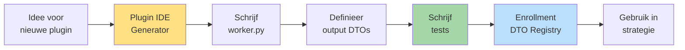

### Strategy Development

```mermaid
graph LR
    Start[Open Strategy<br/>Builder]
    Select[Selecteer<br/>workers]
    Position[Positioneer<br/>serieel/parallel]
    Events[Configureer<br/>custom events]
    Generate[Genereer<br/>wiring_map]
    Validate[Valideer<br/>event chains]
    Test[Backtest]
    Analyze[Analyseer<br/>resultaten]
    Refine[Verfijn<br/>strategie]
    
    Start --> Select
    Select --> Position
    Position --> Events
    Events --> Generate
    Generate --> Validate
    Validate --> Test
    Test --> Analyze
    Analyze --> Refine
    Refine --> Select
    
    style Generate fill:#FFE082
    style Validate fill:#A5D6A7
```

---

## 9.2. Plugin IDE: Intelligente Generator

### Wizard Steps

```
Step 1: Worker Type Selectie
├─ Kies categorie (Context/Opportunity/Threat/Planning/Execution)
└─ Kies sub-type (27 opties)

Step 2: Base Class Selectie
├─ StandardWorker (90%) - voor pipeline
└─ EventDrivenWorker (10%) - voor events

Step 3: Capabilities
├─ [ ] state_persistence
├─ [ ] events (indien EventDrivenWorker)
└─ [ ] journaling

Step 4: Data Contracten
├─ requires_capability: welke providers?
├─ requires_dtos: welke DTOs uit cache?
└─ produces_dtos: welke DTOs produceren?

Step 5: Parameters (schema.py)
└─ Definieer configureerbare params

Step 6: Event Config (indien events enabled)
├─ Publishes: welke events?
└─ Wirings: luister naar welke events?

Step 7: Generate
└─ Creëer complete plugin scaffold
```

### Gegenereerde Code

IDE genereert:
- `manifest.yaml` (compleet)
- `worker.py` (skeleton met TODOs)
- `schema.py` (parameter model)
- `dtos/output_dto.py` (indien produces_dtos)
- `tests/test_worker.py` (test template)

---

## 9.3. Testing Strategie

### Test Levels

```mermaid
graph TB
    subgraph "Level 1: Unit Tests"
        UT[Plugin Tests<br/>Mock alle providers]
    end
    
    subgraph "Level 2: Integration Tests"
        IT[Component Tests<br/>Real providers]
    end
    
    subgraph "Level 3: System Tests"
        ST[End-to-End<br/>Complete operation]
    end
    
    UT --> IT
    IT --> ST
    
    style UT fill:#C8E6C9
    style IT fill:#FFF9C4
    style ST fill:#BBDEFB
```

### Unit Test Pattern

```python
# tests/test_worker.py
from unittest.mock import MagicMock
import pytest

class TestMyWorker:
    """Test suite voor MyWorker."""
    
    @pytest.fixture
    def mock_providers(self):
        """Setup all mocked providers."""
        return {
            'context_provider': MagicMock(spec=ITradingContextProvider),
            'ohlcv_provider': MagicMock(spec=IOhlcvProvider),
            'state_provider': MagicMock(spec=IStateProvider)
        }
    
    def test_happy_path(self, mock_providers):
        """Test normale werking."""
        # Arrange
        worker = MyWorker(params={}, **mock_providers)
        mock_providers['context_provider'].get_base_context.return_value = (
            BaseContextDTO(timestamp=..., current_price=50000.0)
        )
        
        # Act
        result = worker.process()
        
        # Assert
        assert result.disposition == "CONTINUE"
        mock_providers['context_provider'].set_result_dto.assert_called_once()
    
    def test_point_in_time_respected(self, mock_providers):
        """Verify Point-in-Time principe."""
        worker = MyWorker(params={}, **mock_providers)
        worker.process()
        
        # Verify timestamp werd meegegeven
        call_args = mock_providers['ohlcv_provider'].get_window.call_args
        assert 'timestamp' in call_args[1]
    
    def test_missing_dto_raises_error(self, mock_providers):
        """Test error bij missing required DTO."""
        worker = MyWorker(params={}, **mock_providers)
        mock_providers['context_provider'].get_required_dtos.side_effect = (
            MissingContextDataError("EMAOutputDTO missing")
        )
        
        with pytest.raises(MissingContextDataError):
            worker.process()
```

### Integration Test Pattern

```python
# tests/integration/test_context_chain.py
def test_complete_context_chain():
    """Test complete context worker chain."""
    
    # Real providers (niet gemockt)
    context_provider = TradingContextProvider()
    ohlcv_provider = OhlcvProvider(data_source=test_data)
    
    # Real workers
    ema_detector = EMADetector(params={'period': 20}, ...)
    structure_detector = MarketStructureDetector(params={}, ...)
    
    # Execute chain
    result1 = ema_detector.process()
    assert result1.disposition == "CONTINUE"
    
    # Verify DTO in cache
    cached_dtos = context_provider.get_cached_dtos()
    assert EMAOutputDTO in cached_dtos
    
    # Next worker can access
    result2 = structure_detector.process()
    # Structure detector kan EMAOutputDTO opvragen
```

---

## 9.4. Debugging Tools

### Event Tracing

```python
# tools/trace_event_flow.py
"""Trace complete event flow voor één tick."""

def trace_tick(tick_id: str):
    """
    Trace all events voor één tick.
    
    Output:
    - Timeline van alle events
    - Welke workers werden getriggerd
    - Welke DTOs werden geproduceerd
    - Welke decisions werden gemaakt
    """
    events = event_bus.get_events_for_tick(tick_id)
    
    for event in events:
        print(f"{event.timestamp} - {event.name}")
        print(f"  Publisher: {event.source}")
        print(f"  Subscribers: {event.subscribers}")
        if event.payload:
            print(f"  Payload: {event.payload}")
```

### Wiring Validator Tool

```bash
# Command line tool
python tools/validate_wiring.py --strategy ict_smc_strategy

Output:
✓ All events have publishers
✓ No circular dependencies
⚠ Event 'debug_trace' has no subscribers
✓ DTO dependencies satisfied

Summary: Valid with 1 warning
```

---

## 9.5. Best Practices

### DO's ✅

**Plugin Development**:
- Start met Plugin IDE generator
- Schrijf tests eerst (TDD)
- Mock alle providers in unit tests
- Gebruik DTO Registry voor imports
- Declareer alle dependencies in manifest

**Strategy Development**:
- Begin met simpele base_wiring template
- Test elke worker apart eerst
- Gebruik UI voor wiring generatie
- Valideer event chains voor runtime
- Analyseer causale data in Trade Explorer

**Testing**:
- Unit tests: mock providers
- Integration tests: real components
- E2E tests: complete backtest
- 100% coverage voor enrollment
- Test Point-in-Time correctheid

### DON'Ts ❌

**Plugin Development**:
- Geen globals of singletons in worker
- Geen hardcoded paths naar DTOs
- Geen side-effects zonder providers
- Geen EventBus directe toegang
- Geen tests skippen

**Strategy Development**:
- Geen manual wiring_map editing
- Geen circular event dependencies
- Geen workers zonder manifest
- Geen productie zonder backtest
- Geen validatie overslaan

---

**Einde Hoofdstuk 9**

Dit hoofdstuk beschrijft de development workflow, tools en best practices voor plugin en strategy development in de V4.0 architectuur.

---

# 10_Meta_Workflows.md

# Hoofdstuk 10: Meta Workflows

**Status:** Definitief  
**Versie:** 4.0

---

## 10.1. Meta Workflows Concept

Meta workflows zijn **hogere-orde analyses** die de OperationService herhaaldelijk aanroepen met verschillende configuraties.

```mermaid
graph TB
    subgraph "Meta Workflow Layer"
        Opt[OptimizationService<br/>Parameter sweeps]
        Var[VariantTestService<br/>A/B testing]
        WF[WalkForwardService<br/>Temporal validation]
    end
    
    subgraph "Core Execution"
        OpSvc[OperationService<br/>Runs één strategie]
    end
    
    Opt -->|Calls N times| OpSvc
    Var -->|Calls N times| OpSvc
    WF -->|Calls N times| OpSvc
    
    style Opt fill:#FFE082
    style Var fill:#BBDEFB
    style WF fill:#C8E6C9
```

**Kernprincipe**: OperationService is de "motor", meta workflows zijn de "onderzoekers".

---

## 10.2. OptimizationService

Systematisch doorzoeken van parameter ruimte.

### Configuration

```yaml
# config/optimizations/optimize_fvg_params.yaml
optimization_config:
  name: "FVG Parameter Sweep"
  base_operation: "config/operations/ict_backtest.yaml"
  base_strategy: "config/runs/ict_smc_strategy.yaml"
  
  parameter_space:
    - worker_instance: "fvg_det_1"
      parameters:
        min_gap_size:
          start: 3
          end: 10
          step: 1
        require_structure_break:
          values: [true, false]
  
  optimization_target:
    primary_metric: "sharpe_ratio"
    constraints:
      min_trades: 10
      max_drawdown: 15.0
```

### Implementation

```python
# services/meta_workflows/optimization_service.py
class OptimizationService:
    """Parameter optimization via grid search."""
    
    def run_optimization(
        self,
        config: OptimizationConfig
    ) -> OptimizationResult:
        """
        Run complete parameter sweep.
        
        Workflow:
        1. Generate parameter combinations
        2. Create BuildSpecs voor elke combinatie
        3. Run via OperationService
        4. Collect results
        5. Analyze best performers
        """
        # 1. Generate combinations
        combinations = self._generate_parameter_grid(
            config.parameter_space
        )
        
        # 2. Run parallel backtests
        results = []
        for combo in combinations:
            # Modify strategy_blueprint params
            modified_blueprint = self._apply_params(
                config.base_strategy,
                combo
            )
            
            # Run backtest
            result = self.operation_service.run_backtest(
                modified_blueprint
            )
            results.append(result)
        
        # 3. Analyze
        best = self._find_best(results, config.optimization_target)
        
        return OptimizationResult(
            total_runs=len(results),
            best_params=best.parameters,
            best_metrics=best.metrics,
            all_results=results
        )
```

---

## 10.3. VariantTestService

A/B testing van strategische keuzes.

### Configuration

```yaml
# config/variants/exit_strategy_test.yaml
variant_config:
  name: "Exit Strategy Comparison"
  base_operation: "config/operations/ict_backtest.yaml"
  base_strategy: "config/runs/ict_smc_strategy.yaml"
  
  variants:
    - name: "liquidity_targets"
      description: "ICT liquidity-based exits"
      overrides:
        workforce:
          planning_workers:
            exit_planning:
              - instance_id: "exit_1"
                plugin: "liquidity_target_exit"
                params:
                  target_opposite_liquidity: true
    
    - name: "atr_based"
      description: "ATR-based stops"
      overrides:
        workforce:
          planning_workers:
            exit_planning:
              - instance_id: "exit_1"
                plugin: "atr_based_stops"
                params:
                  atr_multiplier: 2.0
```

### Comparison Output

```
┌─────────────────────────────────────────────────────┐
│  VARIANT COMPARISON RESULTS                          │
├─────────────────────────────────────────────────────┤
│                                                      │
│  Metric              │ Variant A  │ Variant B        │
│  ────────────────────┼────────────┼──────────        │
│  Sharpe Ratio        │ 2.45       │ 2.78 ⭐        │
│  Total Return        │ 34.5%      │ 31.2%           │
│  Max Drawdown        │ 8.2%       │ 5.4% ⭐        │
│  Win Rate            │ 58.3%      │ 61.5% ⭐        │
│  Total Trades        │ 127        │ 98              │
│                                                      │
│  Causale Analyse:                                   │
│  Opportunities Rejected:                            │
│    Variant A: 118 (48%)                             │
│    Variant B: 147 (60%) - more defensive            │
│                                                      │
│  Top Rejection Reasons (Variant B):                 │
│    • MAX_DRAWDOWN: 67 (45%)                         │
│    • VOLATILITY_SPIKE: 43 (29%)                     │
│    • MARKET_RISK: 37 (25%)                          │
│                                                      │
│  [Export Report] [View Details] [Apply Winner]     │
└─────────────────────────────────────────────────────┘
```

---

## 10.4. ParallelRunService

Herbruikbare backend component voor parallelle executie.

```python
# services/meta_workflows/parallel_run_service.py
from concurrent.futures import ProcessPoolExecutor

class ParallelRunService:
    """Executes multiple operations in parallel."""
    
    def run_parallel(
        self,
        build_specs_list: List[BuildSpecs],
        max_workers: int = None
    ) -> List[BacktestResult]:
        """
        Run operations parallel.
        
        Args:
            build_specs_list: List van BuildSpecs voor elke run
            max_workers: Max parallel processes
        
        Returns:
            List van resultaten
        """
        max_workers = max_workers or os.cpu_count()
        
        with ProcessPoolExecutor(max_workers=max_workers) as executor:
            futures = [
                executor.submit(self._run_single, specs)
                for specs in build_specs_list
            ]
            
            results = []
            for future in as_completed(futures):
                try:
                    result = future.result()
                    results.append(result)
                except Exception as e:
                    logger.error(f"Run failed: {e}")
        
        return results
    
    def _run_single(self, build_specs: BuildSpecs) -> BacktestResult:
        """Run één backtest in isolated process."""
        # Create isolated OperationService
        operation_service = OperationService(...)
        
        # Run backtest
        return operation_service.run_from_specs(build_specs)
```

---

## 10.5. WalkForwardService (Voorbeeld)

Tijd-gebaseerde validatie voor robustness.

```python
# services/meta_workflows/walk_forward_service.py
class WalkForwardService:
    """Walk-forward analysis."""
    
    def run_walk_forward(
        self,
        config: WalkForwardConfig
    ) -> WalkForwardResult:
        """
        Walk-forward analyse.
        
        Workflow:
        1. Optimaliseer op in-sample periode
        2. Test op out-of-sample periode  
        3. Roll forward
        4. Repeat
        """
        results = []
        
        for window in config.time_windows:
            # 1. Optimize in-sample
            best_params = self.optimization_service.optimize(
                data_range=window.in_sample
            )
            
            # 2. Test out-of-sample
            oos_result = self.operation_service.run_backtest(
                params=best_params,
                data_range=window.out_of_sample
            )
            
            results.append(oos_result)
        
        # Aggregate out-of-sample results
        return WalkForwardResult(
            oos_results=results,
            aggregate_metrics=self._aggregate(results)
        )
```

---

## 10.6. Meta Workflow Impact op Architectuur

### Geen Aanpassingen Nodig

De meta workflows werken **zonder wijzigingen** aan kernarchitectuur:

✅ **OperationService**: Blijft pure executor  
✅ **BuildSpecs**: Kunnen programmatisch gewijzigd worden  
✅ **ConfigTranslator**: Kan BuildSpecs uit gewijzigde configs maken  
✅ **Factories**: Werken met any BuildSpecs

### Gebruik van BuildSpecs

```python
# In OptimizationService
for param_combo in combinations:
    # Start met base specs
    modified_specs = base_build_specs.copy()
    
    # Wijzig workforce_spec
    for worker_spec in modified_specs.workforce_spec:
        if worker_spec.instance_id == target_worker:
            worker_spec.params.update(param_combo)
    
    # Run met modified specs
    result = operation_service.run_from_specs(modified_specs)
```

---

**Einde Hoofdstuk 10**

Dit hoofdstuk beschrijft meta workflows (Optimization, Variant Testing, Walk-Forward) die de OperationService als motor gebruiken zonder aanpassingen aan kernarchitectuur.

---

# 11_Coding_Standards.md

# Hoofdstuk 11: Coding Standards & Design Principles

**Status:** Definitief  
**Versie:** 4.0

---

## 11.1. Code Kwaliteit

### PEP 8 Compliance

- **Regellengte**: Maximum 100 karakters
- **Naamgeving**: 
  - `snake_case` voor functies, variabelen, modules
  - `PascalCase` voor classes
  - `UPPER_CASE` voor constanten
- **Type Hinting**: Verplicht voor alle functies en variabelen
- **Docstrings**: Google Style, Engels

### Imports Structuur

```python
# backend/core/strategy_journal.py
"""
Append-only causal log of all events.

@layer: Backend (Core)
@dependencies: [backend.core.interfaces, backend.dtos.state]
"""

# 1. Standard Library
from typing import List, Dict, Any
from datetime import datetime
from uuid import UUID

# 2. Third-Party
from pydantic import BaseModel

# 3. Our Application (absolute paths from project root)
from backend.core.interfaces.persistors import IJournalPersistor
from backend.dtos.state.journal_entry import JournalEntry
```

---

## 11.2. Contract-Gedreven Ontwikkeling

### Pydantic voor Alle Data

**Regel**: Alle data tussen componenten = Pydantic BaseModel

```python
# ✅ GOED: Type-safe DTO
class EMAOutputDTO(BaseModel):
    ema_20: float
    ema_50: float
    timestamp: datetime

# ❌ FOUT: Primitieve dict
result = {'ema_20': 50.0, 'ema_50': 49.0}
```

### Interface-Based Dependencies

**Regel**: Dependency op abstractie, niet concrete implementatie

```python
# ✅ GOED: Interface dependency
class MyWorker(StandardWorker):
    context_provider: ITradingContextProvider  # Interface
    state_provider: IStateProvider

# ❌ FOUT: Concrete dependency
class BadWorker(StandardWorker):
    context_provider: TradingContextProvider  # Concrete class
```

---

## 11.3. Dependency Injection

### Constructor Injection (Standaard)

```python
# ✅ GOED: Constructor injection
class EMADetector(StandardWorker):
    def __init__(self, params, **providers):
        super().__init__(params)
        self.context_provider = providers['context_provider']
        self.ohlcv_provider = providers['ohlcv_provider']

# ❌ FOUT: Property setters
class BadWorker(StandardWorker):
    def __init__(self, params):
        self.context_provider = None  # Wordt later gezet
    
    def set_context_provider(self, provider):
        self.context_provider = provider
```

### Factory Pattern

**Regel**: Complexe objecten via factories, niet direct constructors

```python
# ✅ GOED: Via factory
worker = worker_factory.build_from_spec(worker_spec)

# ❌ FOUT: Direct instantiëren
worker = EMADetector(params)
worker.context_provider = ...  # Manual wiring
```

---

## 11.4. DTO Best Practices

### Immutability

```python
# ✅ GOED: Frozen DTO
class EMAOutputDTO(BaseModel):
    ema_20: float
    ema_50: float
    
    class Config:
        frozen = True  # Immutable

# ❌ FOUT: Mutable DTO
class BadDTO(BaseModel):
    value: float  # Kan gewijzigd worden
```

### Validation

```python
# ✅ GOED: Field validation
class MyParams(BaseModel):
    period: int = Field(
        ...,
        ge=5,
        le=200,
        description="params.my_worker.period.desc"
    )
    
    @validator('period')
    def validate_period(cls, v):
        if v % 2 == 0:
            raise ValueError("Period must be odd")
        return v

# ❌ FOUT: Geen validatie
class BadParams(BaseModel):
    period: int  # Geen grenzen, geen checks
```

---

## 11.5. Point-in-Time Principe

### Provider Gebruik

```python
# ✅ GOED: Respecteert timestamp
class MyWorker(StandardWorker):
    def process(self):
        base_ctx = self.context_provider.get_base_context()
        
        # ALTIJD timestamp meegeven
        df = self.ohlcv_provider.get_window(
            timestamp=base_ctx.timestamp,  # Point-in-Time!
            lookback=200
        )

# ❌ FOUT: Geen timestamp
class BadWorker(StandardWorker):
    def process(self):
        df = self.ohlcv_provider.get_latest()  # Lekkage!
```

### State Access

```python
# ✅ GOED: Via provider
class MyWorker(StandardWorker):
    def process(self):
        state = self.state_provider.get()
        state['counter'] = state.get('counter', 0) + 1
        self.state_provider.set(state)

# ❌ FOUT: Direct attribuut
class BadWorker(StandardWorker):
    def process(self):
        self.counter += 1  # Niet persistent!
```

---

## 11.6. DispositionEnvelope Patterns

### CONTINUE Pattern

```python
# ✅ GOED: Data in cache, continue flow
def process(self):
    result_dto = self._calculate()
    self.context_provider.set_result_dto(self, result_dto)
    return DispositionEnvelope(disposition="CONTINUE")
```

### PUBLISH Pattern

```python
# ✅ GOED: Publiceer signaal
def process(self):
    if self._condition_met():
        signal = OpportunitySignalDTO(...)
        return DispositionEnvelope(
            disposition="PUBLISH",
            event_name="SIGNAL_GENERATED",
            event_payload=signal
        )
    return DispositionEnvelope(disposition="STOP")
```

### STOP Pattern

```python
# ✅ GOED: Geen output, stop flow
def process(self):
    if not self._should_continue():
        return DispositionEnvelope(disposition="STOP")
```

---

## 11.7. Testing Standards

### Test Coverage

**Regel**: 100% test coverage vereist voor enrollment

```python
# tests/test_worker.py
def test_happy_path():
    """Test normale werking."""
    pass

def test_edge_cases():
    """Test edge cases."""
    pass

def test_error_handling():
    """Test error scenarios."""
    pass

def test_point_in_time():
    """Test timestamp correctheid."""
    pass
```

### Mock Providers

```python
# ✅ GOED: Mock alle providers
from unittest.mock import MagicMock

@pytest.fixture
def mock_providers():
    context_provider = MagicMock(spec=ITradingContextProvider)
    context_provider.get_base_context.return_value = BaseContextDTO(...)
    
    ohlcv_provider = MagicMock(spec=IOhlcvProvider)
    ohlcv_provider.get_window.return_value = test_dataframe()
    
    return {
        'context_provider': context_provider,
        'ohlcv_provider': ohlcv_provider
    }

def test_worker(mock_providers):
    worker = MyWorker(params, **mock_providers)
    result = worker.process()
    
    # Verify provider calls
    mock_providers['context_provider'].set_result_dto.assert_called_once()
```

---

## 11.8. Internationalisatie (i18n)

### Translation Keys

**Regel**: Alle user-facing tekst via translation keys

```python
# ✅ GOED: Translation key
description = Field(
    ...,
    description="params.ema_detector.period.desc"
)

# ❌ FOUT: Hardcoded tekst
description = Field(
    ...,
    description="The EMA period in bars"
)
```

### Structuur

```yaml
# locales/nl.yaml
params:
  ema_detector:
    period:
      desc: "De EMA periode in bars"

# locales/en.yaml  
params:
  ema_detector:
    period:
      desc: "The EMA period in bars"
```

---

## 11.9. Error Handling

### Fail Fast Principe

```python
# ✅ GOED: Fail tijdens bootstrap
def validate_config(config):
    if not config.is_valid():
        raise ConfigurationError("Invalid config")
    # Continue alleen als valid

# ❌ FOUT: Silent failures
def bad_validate(config):
    if not config.is_valid():
        logger.warning("Config might be invalid")
        # Gaat toch door!
```

### Informative Errors

```python
# ✅ GOED: Duidelijke error
raise MissingDTOError(
    f"Worker '{self.instance_id}' requires DTOs of type "
    f"{required_types} but only {available_types} available in cache"
)

# ❌ FOUT: Vage error
raise ValueError("Missing data")
```

---

## 11.10. SOLID Principles

### Single Responsibility

```python
# ✅ GOED: Eén verantwoordelijkheid
class ConfigTranslator:
    """Vertaalt YAML naar BuildSpecs."""
    def collect_build_specs(self, ...): pass

class WorkerFactory:
    """Bouwt workers uit specs."""
    def build_from_spec(self, ...): pass

# ❌ FOUT: Meerdere verantwoordelijkheden
class BadService:
    """Laadt config EN bouwt workers EN start execution."""
    pass
```

### Dependency Inversion

```python
# ✅ GOED: Hang af van abstractie
class MyWorker:
    def __init__(self, provider: IStateProvider):  # Interface
        self._provider = provider

# ❌ FOUT: Hang af van concrete class
class BadWorker:
    def __init__(self, provider: JsonStatePersistor):  # Concrete
        self._provider = provider
```

---

## 11.11. Naamgevingsconventies

### Interfaces

```python
# ✅ GOED: I prefix
class ITradingContextProvider(Protocol): pass
class IStateProvider(Protocol): pass

# ❌ FOUT: Geen I prefix
class TradingContextProvider(Protocol): pass
```

### Factories

```python
# ✅ GOED: Factory suffix
class WorkerFactory: pass
class PersistorFactory: pass

# ❌ FOUT: Onduidelijke naam
class WorkerBuilder: pass  # Is dit een builder of factory?
```

### Private Members

```python
# ✅ GOED: _ prefix voor internal
class MyClass:
    def __init__(self):
        self._internal_state = {}  # Private
        self.public_api = None     # Public
    
    def _internal_method(self): pass  # Private
    def public_method(self): pass      # Public
```

---

## 11.12. Documentation Standards

### Docstrings

```python
# ✅ GOED: Complete docstring
def process(self, context: TradingContext) -> DispositionEnvelope:
    """
    Process trading context and detect opportunities.
    
    Args:
        context: Current trading context with timestamp
    
    Returns:
        DispositionEnvelope with flow control instruction
    
    Raises:
        MissingDataError: If required DTOs not in cache
    """
    pass
```

### File Headers

```python
# backend/core/strategy_journal.py
"""
Append-only causal log of all events.

@layer: Backend (Core)
@dependencies: [backend.core.interfaces, backend.dtos.state]
@responsibilities:
    - Manages immutable historical log
    - Contains opportunities, threats, trades with causal links
    - Uses IJournalPersistor for persistence
"""
```

---

## 11.13. Quick Reference Checklist

### Voor Elke Plugin

- [ ] Manifest.yaml compleet (type, subtype, dependencies, capabilities)
- [ ] Schema.py met parameter validatie
- [ ] Worker.py met type hints en docstrings
- [ ] DTOs immutable (frozen=True)
- [ ] Providers via constructor injection
- [ ] DispositionEnvelope correct gebruikt
- [ ] Point-in-Time principe gerespecteerd
- [ ] Tests met 100% coverage
- [ ] Translation keys voor alle user-facing tekst
- [ ] Error messages informatief

### Voor Elke Factory

- [ ] Eén verantwoordelijkheid (SRP)
- [ ] build_from_spec() methode
- [ ] Dependencies via constructor
- [ ] Geen business logica
- [ ] Complete error handling

### Voor Elke DTO

- [ ] Pydantic BaseModel
- [ ] frozen=True (indien mogelijk)
- [ ] Field validatie waar nodig
- [ ] Duidelijke docstring
- [ ] Translation keys in descriptions

---

**Einde Hoofdstuk 11**

Dit hoofdstuk beschrijft de coding standards zonder verwijzingen naar het oude Operator model, volledig gericht op de nieuwe platgeslagen, DTO-centric architectuur.

---

# Bijlage_A_Terminologie.md

# Bijlage A: Terminologie

**Status:** Definitief  
**Versie:** 4.0

---

## Actieve Terminologie

### A

**AdapterConfig** - Configuratie object voor één EventAdapter, bevat subscriptions, handler_mapping en publication_config.

**AggregatedLedger** - Operation-breed singleton dat financiële staat over alle strategieën aggregeert.

### B

**BaseContextDTO** - Minimale context DTO met timestamp en current_price voor één tick.

**BuildSpecs** - Machine-leesbare specificatie gegenereerd door ConfigTranslator, bevat alle instructies voor factories.

### C

**ConfigTranslator** - Backend component die YAML configuratie vertaalt naar BuildSpecs.

**Custom Events** - Plugin-gedefinieerde events (bv. EMERGENCY_HALT_TRADING), gedeclareerd in manifest.publishes.

### D

**DependencyValidator** - Validator die checkt of data-afhankelijkheden consistent zijn met workflow.

**DispositionEnvelope** - Standaard return type van workers, bevat flow control (CONTINUE/PUBLISH/STOP).

**DTO Registry** - Centraal register van plugin-specifieke DTOs op `backend/dto_reg/<vendor>/<plugin>/<version>/`.

### E

**EventAdapter** - Generieke component die één worker of singleton verbindt met EventBus.

**EventBus** - Pure N-N broadcast bus zonder intelligentie.

**EventChainValidator** - Validator die event topologie analyseert tijdens bootstrap.

**EventDrivenWorker** - Basisklasse voor workers die autonoom op events reageren (geen process() methode).

**EventWiringFactory** - Factory die EventAdapters creëert en configureert uit wiring_specs.

### I

**ITradingContextProvider** - Interface voor toegang tot Tick Cache en basis context.

**IOhlcvProvider** - Interface voor historische OHLCV data (Point-in-Time).

**IStateProvider** - Interface voor persistent worker state.

**IJournalWriter** - Interface voor StrategyJournal logging.

**ILedgerProvider** - Interface voor financiële staat toegang.

### O

**OperationConfig** - Configuratie laag 2, bevat connectors, environments, schedule voor één operation.

**OperationService** - Hoofdservice die strategie levenscycli beheert (start/stop/restart).

**OpportunityID** - Causale UUID die reden voor trade opening vastlegt.

### P

**PlatformConfig** - Configuratie laag 1, bevat globale platform instellingen.

**Point-in-Time Principe** - Architecturaal principe dat data-lekkage uit toekomst voorkomt.

**Platform Providers** - Singleton services (IOhlcvProvider, IStateProvider, etc.) geïnjecteerd in workers.

**platform_wiring_map.yaml** - Bedradings configuratie voor operation-brede singletons.

### S

**StandardWorker** - Basisklasse voor workers in georkestreerde pipeline (vereist process() methode).

**StrategyConfig** - Configuratie laag 3, bevat blueprint en wiring_map voor één strategie.

**StrategyJournal** - Append-only logboek met causale geschiedenis van één strategie.

**StrategyLedger** - Operationele financiële staat van één strategie (alleen actueel).

**strategy_wiring_map.yaml** - UI-gegenereerde bedradings configuratie voor één strategie.

**System Events** - Interne flow-control events (bv. ema_fast_OUTPUT), niet zichtbaar voor plugin developer.

### T

**ThreatID** - Causale UUID die reden voor trade wijziging/sluiting vastlegt.

**Tick Cache** - Tijdelijke Dict[Type[BaseModel], BaseModel] die alleen tijdens één tick bestaat.

**TickCacheManager** - Singleton die Tick Cache levenscyclus beheert en flows initieert.

**TradeID** - Primaire identifier voor trade, gegenereerd door PlanningWorker.

**TradingContext** - Minimale context met alleen timestamp, price, strategy_link_id, asset_pair.

### W

**WiringRule** - Configuratie object dat één event-bedrading definieert (source → target).

**WorkerFactory** - Factory die workers bouwt uit workforce_spec met provider injecties.

---

## Deprecated Terminologie

### 🚫 VERVALLEN IN V4.0

**AnalysisOperator** ❌ - Operator die AnalysisWorkers beheerde. **Vervangen door**: Platgeslagen model zonder Operators.

**AnalysisWorker** ❌ - Worker type. **Vervangen door**: OpportunityWorker + PlanningWorker.

**BaseOperator** ❌ - Generieke operator klasse. **Vervallen**: Geen Operators meer.

**ContextOperator** ❌ - Operator voor ContextWorkers. **Vervallen**: Directe bedrading via adapters.

**enriched_df** ❌ - DataFrame in TradingContext. **Vervangen door**: DTOs in Tick Cache.

**ExecutionOperator** ❌ - Operator voor ExecutionWorkers. **Vervallen**: Event-driven via adapters.

**MonitorWorker** ❌ - Oude naam. **Vervangen door**: ThreatWorker (betere semantiek).

**operators.yaml** ❌ - Configuratie bestand. **Vervallen**: Geen operators meer.

**OpportunityOperator** ❌ - Operator voor OpportunityWorkers. **Vervallen**: Directe bedrading.

**PlanningOperator** ❌ - Operator voor PlanningWorkers. **Vervallen**: Sequentiële chain via wiring.

**ThreatOperator** ❌ - Operator voor ThreatWorkers. **Vervallen**: Event-driven via adapters.

**wiring_map.yaml** (globaal) ❌ - Globale bedrading. **Vervangen door**: platform_wiring_map.yaml + strategy_wiring_map.yaml.

### ⚠️ GEWIJZIGD IN V4.0

**EventAdapter** ⚠️ - **Was**: Per operator. **Nu**: Per component (worker/singleton).

**TradingContext** ⚠️ - **Was**: Bevatte enriched_df. **Nu**: Minimaal met alleen basis info.

**wiring_map.yaml** ⚠️ - **Was**: Statisch platform bestand. **Nu**: UI-gegenereerd per strategie.

---

## Afkortingen

- **DTO** - Data Transfer Object (Pydantic BaseModel)
- **SRP** - Single Responsibility Principle
- **DI** - Dependency Injection
- **CQRS** - Command Query Responsibility Segregation
- **MTF** - Multi-Timeframe
- **FVG** - Fair Value Gap
- **DCA** - Dollar Cost Averaging
- **UI** - User Interface (Strategy Builder)

---

**Einde Bijlage A**

Deze bijlage bevat alle actieve terminologie voor V4.0 architectuur en markeert deprecated terms uit eerdere versies.

---

# Combined.md

# 00_INDEX.md

# S1mpleTrader V2 Architectuur - Index

**Versie:** 4.0  
**Status:** Definitief  
**Datum:** 2025-10-23

---

## Overzicht Herziene Documentatie

Deze documentatie beschrijft de **definitieve V4.0 architectuur** van S1mpleTrader, waarbij alle addenda volledig zijn geïntegreerd. De architectuur is gebaseerd op drie fundamentele paradigma's:

1. **Platgeslagen Event-Driven Netwerk** (geen Operators)
2. **Point-in-Time DTO-Gedreven Data** (geen enriched_df)
3. **BuildSpec-Gedreven Bootstrap** (ConfigTranslator)

---

## Hoofddocument

### [Voorwoord](Voorwoord.md)
- De Drie Fundamentele Paradigma's
- Architectuur Overzicht
- Kernprincipes
- Navigatie

---

## Afzonderlijke Hoofdstukken

### DEEL I: FUNDAMENTEN & COMMUNICATIE

#### [Hoofdstuk 1: Communicatie Architectuur](H1_Communicatie_Architectuur.md)
- Platgeslagen Event-Driven Netwerk
- EventAdapter als generieke uitvoerder
- EventWiringFactory als configurator
- Event Types (System vs Custom)
- Bootstrap Sequence

#### [Hoofdstuk 2: De Drie Configuratielagen & BuildSpecs](H2_Configuratielagen_BuildSpecs.md)
- Gelaagde configuratie (Platform, Operation, Strategy)
- ConfigTranslator & BuildSpecs
- OperationService als levenscyclus manager
- Validatie (Fail Fast)

#### [Hoofdstuk 3: Het Data Landschap (Point-in-Time)](H3_Data_Landschap_Point_in_Time.md)
- Minimale TradingContext
- ITradingContextProvider & Tick Cache
- Platform Providers (Toolbox)
- DispositionEnvelope voor flow control
- DTO Registry & Enrollment

### DEEL II: COMPONENTEN

#### [Hoofdstuk 4: Plugin Anatomie](H4_Plugin_Anatomie.md)
- Plugin mappenstructuur
- Manifest.yaml specificatie
- Worker.py implementatie (StandardWorker vs EventDrivenWorker)
- Schema.py parameter validatie
- DTO definitie & enrollment
- Testing requirements
- Complete voorbeelden

#### [Hoofdstuk 5: Worker Ecosysteem](H5_Worker_Ecosysteem.md)
- De 5 worker categorieën:
  - ContextWorker (7 sub-types)
  - OpportunityWorker (7 sub-types)
  - ThreatWorker (5 sub-types)
  - PlanningWorker (4 sub-types)
  - ExecutionWorker (4 sub-types)
- Input/output patronen per categorie
- Causale ID generatie
- Manifest templates
- Complete code voorbeelden

### DEEL III: ORKESTRATIE & WORKFLOW

#### [Hoofdstuk 6: Workflow Orkestratie](H6_Workflow_Orkestratie.md)
- Platgeslagen model (geen Operators)
- Complete tick lifecycle
- Flow patronen (sequentieel, parallel, event-driven)
- Strategy Builder UI wiring generatie
- Causale traceerbaarheid
- Feedback loops
- Voordelen vs Operator model

### DEEL IV: FRONTEND & GEBRUIKER

#### [Hoofdstuk 7: Frontend Integration](H7_Frontend_Integration.md)
- Strategy Builder UI (wiring generator)
- Plugin Library & Discovery
- Event Topology Viewer
- Trade Explorer (causale analyse)
- Live Monitoring Dashboard
- BFF API endpoints
- TypeScript interfaces

### DEEL V: OPERATIONS & DEVELOPMENT

#### [Hoofdstuk 8: Robuustheid & Operations](H8_Robuustheid_Operations.md)
- Persistence Suite (IDataPersistor, IStatePersistor, IJournalPersistor)
- Atomic writes & crash recovery
- Causaal Traceability Framework
- State reconciliation (live trading)
- Supervisor model
- Network resilience
- Health checks

#### [Hoofdstuk 9: Development Strategy](H9_Development_Strategy.md)
- Plugin development workflow
- Strategy development workflow
- Plugin IDE generator
- Testing strategie (Unit, Integration, E2E)
- Debugging tools
- Best practices DO's & DON'Ts

#### [Hoofdstuk 10: Meta Workflows](H10_Meta_Workflows.md)
- OptimizationService (parameter sweeps)
- VariantTestService (A/B testing)
- WalkForwardService (temporal validation)
- ParallelRunService (parallel execution)
- Impact op architectuur
- BuildSpecs usage in meta workflows

### DEEL VI: STANDAARDEN & BIJLAGEN

#### [Hoofdstuk 11: Coding Standards](H11_Coding_Standards.md)
- Code kwaliteit (PEP 8)
- Contract-gedreven development
- Dependency injection
- DTO best practices
- Point-in-Time principe
- Testing standards
- Internationalisatie
- SOLID principles
- Quick reference checklists

#### [Bijlage A: Terminologie](Bijlage_A_Terminologie.md)
- Alfabetische terminologie lijst
- Deprecated terms (V3.0 → V4.0)
- Afkortingen

---

## Belangrijkste Wijzigingen vs V3.0

### Vervallen Concepten ❌

- BaseOperator klasse
- operators.yaml configuratie
- Operator-gedreven orkestratie
- enriched_df in TradingContext
- Impliciete data doorgifte

### Nieuwe Concepten ✨

- EventAdapter per component
- BuildSpecs & ConfigTranslator
- ITradingContextProvider
- Tick Cache (DTO-only)
- DispositionEnvelope
- UI-gegenereerde strategy_wiring_map
- DTO Registry
- Point-in-Time garantie

### Behouden Concepten ✅

- 5 Worker categorieën
- 27 Sub-types
- Causaal ID Framework
- Persistence Suite interfaces
- Plugin-First filosofie
- SOLID principes

---

## Leesaanbevelingen

### Voor Nieuwe Developers

1. Start met **Voorwoord** (paradigma's begrijpen)
2. Lees **H2: Configuratielagen** (hoe configuratie werkt)
3. Lees **H3: Data Landschap** (hoe data flow werkt)
4. Lees **H4: Plugin Anatomie** (hoe een plugin bouwen)
5. Lees **H5: Worker Ecosysteem** (welk worker type kiezen)

### Voor Architects

1. Lees **H1: Communicatie** (EventAdapter model)
2. Lees **H6: Workflow** (platgeslagen orkestratie)
3. Lees **H2: Configuratielagen** (BuildSpecs filosofie)
4. Lees **Bijlage A** (terminologie)

### Voor Migratie van V3.0

1. Lees **Bijlage A** (deprecated terms)
2. Lees **Voorwoord** (paradigma shifts)
3. Lees **Bijlage B: Migratie Gids** (komt binnenkort)

---

## Quick Reference

### Kerncomponenten

| Component | Locatie | Type |
|-----------|---------|------|
| ConfigTranslator | `backend/config/translator.py` | Backend |
| EventAdapter | `backend/assembly/event_adapter.py` | Backend |
| EventWiringFactory | `backend/assembly/event_wiring_factory.py` | Backend |
| TickCacheManager | `backend/core/tick_cache_manager.py` | Backend |
| ITradingContextProvider | `backend/core/interfaces/context_provider.py` | Interface |
| OperationService | `services/operation_service.py` | Service |

### Configuratie Bestanden

| Bestand | Laag | Doel |
|---------|------|------|
| platform.yaml | 1 | Globale instellingen |
| operation.yaml | 2 | Werkruimte definitie |
| connectors.yaml | 2 | Exchange verbindingen |
| schedule.yaml | 2 | Tijd-triggers |
| platform_wiring_map.yaml | 2 | Singleton bedrading |
| strategy_blueprint.yaml | 3 | Workforce definitie |
| strategy_wiring_map.yaml | 3 | Worker bedrading (UI) |

### Key Interfaces

- `ITradingContextProvider` - Tick Cache toegang
- `IOhlcvProvider` - Historische data
- `IStateProvider` - Worker state
- `IJournalWriter` - Logging
- `ILedgerProvider` - Financiële staat
- `IExecutionProvider` - Trade execution

---

## Contact & Vragen

Voor vragen over de architectuur of suggesties voor verbeteringen, zie de documentatie in de originele `docs/system/` directory of raadpleeg het development team.

---

**Laatst bijgewerkt:** 2025-10-23  
**Volgende review:** Bij architectuur wijzigingen

---

# 01_Communicatie_Architectuur.md

# Hoofdstuk 1: Communicatie Architectuur

**Status:** Definitief  
**Versie:** 4.0

---

## 1.1. Kernprincipe: Platgeslagen Event-Driven Netwerk

De communicatie architectuur van S1mpleTrader is gebaseerd op één fundamenteel principe:

> **Elke component krijgt zijn eigen EventAdapter. Er zijn geen Operators.**

```mermaid
graph TB
    subgraph "Runtime Componenten"
        W1[Worker Instance 1<br/>ema_fast]
        W2[Worker Instance 2<br/>ema_slow]
        W3[Worker Instance 3<br/>fvg_detector]
        S1[Singleton<br/>TickCacheManager]
    end
    
    subgraph "Adapters"
        A1[EventAdapter 1]
        A2[EventAdapter 2]
        A3[EventAdapter 3]
        AS[EventAdapter S]
    end
    
    subgraph "EventBus"
        Bus[EventBus<br/>N-N Broadcast]
    end
    
    W1 --- A1
    W2 --- A2
    W3 --- A3
    S1 --- AS
    
    A1 -.-> Bus
    A2 -.-> Bus
    A3 -.-> Bus
    AS -.-> Bus
    
    style W1 fill:#BBDEFB
    style W2 fill:#BBDEFB
    style W3 fill:#90EE90
    style S1 fill:#FFE082
    style Bus fill:#E1F5FE
```

**Kenmerken**:
- ✅ Elke worker instance heeft precies één adapter
- ✅ Elke adapter weet exact wat hij moet doen (via configuratie)
- ✅ EventBus is pure N-N broadcast (geen intelligentie)
- ✅ Bedrading volledig expliciet in strategy_wiring_map.yaml

---

## 1.2. De EventAdapter: Generieke Communicatie Uitvoerder

De [`EventAdapter`](backend/assembly/event_adapter.py) is een generieke component zonder business logica. Zijn gedrag wordt **volledig bepaald door configuratie**.

### Configuratie Structuur

Elke adapter krijgt tijdens bootstrap van de [`EventWiringFactory`](backend/assembly/event_wiring_factory.py) zijn configuratie:

```python
# backend/assembly/event_adapter.py
from typing import Dict, List, Callable, Any
from pydantic import BaseModel

class AdapterConfig(BaseModel):
    """Configuratie voor één EventAdapter."""
    
    # Subscriptions: welke events triggeren deze component?
    subscriptions: List[str]  # event namen
    
    # Handler mapping: event_name -> method_name
    handler_mapping: Dict[str, str]
    
    # Publication config: wat mag deze adapter publiceren?
    system_event_publications: Dict[str, str]  # disposition -> event_name
    allowed_custom_events: List[str]
    flow_stop_event: str

class EventAdapter:
    """Generieke adapter - gedrag via configuratie."""
    
    def __init__(
        self,
        component: Any,  # Worker of Singleton
        config: AdapterConfig,
        event_bus: EventBus,
        context_provider: ITradingContextProvider
    ):
        self._component = component
        self._config = config
        self._event_bus = event_bus
        self._context_provider = context_provider
        
        # Abonneer op geconfigureerde events
        for event_name in config.subscriptions:
            handler = self._create_handler(event_name)
            event_bus.subscribe(event_name, handler)
    
    def _create_handler(self, event_name: str) -> Callable:
        """Creëer handler voor specifiek event."""
        def handler(payload: Any) -> None:
            # Zoek welke methode aangeroepen moet worden
            method_name = self._config.handler_mapping.get(event_name)
            if not method_name:
                return
            
            # Roep component aan
            method = getattr(self._component, method_name)
            result = method(payload) if payload else method()
            
            # Verwerk DispositionEnvelope
            self._process_disposition(result)
        
        return handler
    
    def _process_disposition(self, envelope: DispositionEnvelope) -> None:
        """Verwerk worker output envelope."""
        
        if envelope.disposition == "CONTINUE":
            # Publiceer systeem event voor volgende worker
            system_event = self._config.system_event_publications.get("CONTINUE")
            if system_event:
                # Haal data uit cache voor payload
                payload = self._create_system_payload(system_event)
                self._event_bus.publish(system_event, payload)
        
        elif envelope.disposition == "PUBLISH":
            # Valideer custom event
            if envelope.event_name not in self._config.allowed_custom_events:
                raise PermissionError(
                    f"Component not allowed to publish '{envelope.event_name}'"
                )
            
            # Publiceer custom event
            self._event_bus.publish(
                envelope.event_name,
                envelope.event_payload
            )
        
        elif envelope.disposition == "STOP":
            # Publiceer flow stop event
            self._event_bus.publish(
                self._config.flow_stop_event,
                FlowStopDTO()
            )
```

### Adapter Configuratie Voorbeeld

Voor worker `ema_fast`:

```python
AdapterConfig(
    subscriptions=["TICK_FLOW_START"],
    handler_mapping={
        "TICK_FLOW_START": "process"
    },
    system_event_publications={
        "CONTINUE": "ema_fast_OUTPUT"
    },
    allowed_custom_events=[],  # Geen custom events
    flow_stop_event="ema_fast_STOP"
)
```

Voor event-aware worker `emergency_news_monitor`:

```python
AdapterConfig(
    subscriptions=["NEWS_RECEIVED"],
    handler_mapping={
        "NEWS_RECEIVED": "on_news"
    },
    system_event_publications={},
    allowed_custom_events=["EMERGENCY_HALT_TRADING"],  # Uit manifest
    flow_stop_event="news_monitor_STOP"
)
```

---

## 1.3. EventWiringFactory: De Configurator

De [`EventWiringFactory`](backend/assembly/event_wiring_factory.py) creëert en configureert alle adapters op basis van de wiring_specs uit BuildSpecs.

```mermaid
graph LR
    subgraph "Input"
        BS[BuildSpecs<br/>wiring_specs]
    end
    
    subgraph "EventWiringFactory"
        Parse[Parse wiring_specs]
        Create[Creëer adapters]
        Config[Configureer adapters]
    end
    
    subgraph "Output"
        A1[EventAdapter 1]
        A2[EventAdapter 2]
        A3[EventAdapter N]
    end
    
    BS --> Parse
    Parse --> Create
    Create --> Config
    Config --> A1
    Config --> A2
    Config --> A3
    
    A1 -.->|Subscribe| EB[EventBus]
    A2 -.->|Subscribe| EB
    A3 -.->|Subscribe| EB
    
    style BS fill:#A5D6A7
    style Config fill:#FFE082
    style EB fill:#E1F5FE
```

**Implementatie**:

```python
# backend/assembly/event_wiring_factory.py
class EventWiringFactory:
    """Creëert en configureert EventAdapters uit BuildSpecs."""
    
    def wire_all_from_spec(
        self,
        platform_wiring_spec: List[WiringRule],
        strategy_wiring_spec: List[WiringRule],
        worker_instances: Dict[str, Any],
        singleton_instances: Dict[str, Any]
    ) -> Dict[str, EventAdapter]:
        """
        Hoofdmethode: bedraad alles.
        
        Args:
            platform_wiring_spec: Bedrading voor singletons
            strategy_wiring_spec: Bedrading voor workers
            worker_instances: Map van instance_id -> worker
            singleton_instances: Map van singleton_id -> singleton
        
        Returns:
            Map van component_id -> EventAdapter
        """
        adapters = {}
        
        # Wire platform singletons
        for rule in platform_wiring_spec:
            adapter = self._create_adapter_for_rule(
                rule, 
                singleton_instances
            )
            adapters[rule.target['component_id']] = adapter
        
        # Wire strategy workers
        for rule in strategy_wiring_spec:
            adapter = self._create_adapter_for_rule(
                rule,
                worker_instances
            )
            adapters[rule.target['component_id']] = adapter
        
        return adapters
    
    def _create_adapter_for_rule(
        self,
        rule: WiringRule,
        component_map: Dict[str, Any]
    ) -> EventAdapter:
        """Creëer adapter voor één wiring rule."""
        
        component = component_map[rule.target['component_id']]
        
        # Bouw adapter configuratie
        config = self._build_adapter_config(rule, component)
        
        # Creëer adapter
        return EventAdapter(
            component=component,
            config=config,
            event_bus=self._event_bus,
            context_provider=self._context_provider
        )
    
    def _build_adapter_config(
        self,
        rule: WiringRule,
        component: Any
    ) -> AdapterConfig:
        """Bouw AdapterConfig uit WiringRule."""
        
        # Verzamel alle rules voor dit component
        all_rules = self._find_all_rules_for_component(
            rule.target['component_id']
        )
        
        # Extract subscriptions
        subscriptions = [r.source['event_name'] for r in all_rules]
        
        # Extract handler mapping
        handler_mapping = {
            r.source['event_name']: r.target['handler_method']
            for r in all_rules
        }
        
        # Extract publication config
        system_pubs = self._extract_system_publications(all_rules)
        custom_events = self._extract_custom_events(component)
        
        return AdapterConfig(
            subscriptions=subscriptions,
            handler_mapping=handler_mapping,
            system_event_publications=system_pubs,
            allowed_custom_events=custom_events,
            flow_stop_event=f"{component.instance_id}_STOP"
        )
```

---

## 1.4. De EventBus: Pure N-N Broadcast

De [`EventBus`](backend/core/event_bus.py) is extreem simpel - een pure publish/subscribe bus zonder intelligentie.

```python
# backend/core/event_bus.py
from typing import Dict, List, Callable, Any
from threading import Lock

class EventBus:
    """Pure N-N broadcast bus."""
    
    def __init__(self):
        self._subscriptions: Dict[str, List[Callable]] = {}
        self._lock = Lock()
    
    def subscribe(self, event_name: str, handler: Callable) -> None:
        """Subscribe handler to event."""
        with self._lock:
            if event_name not in self._subscriptions:
                self._subscriptions[event_name] = []
            self._subscriptions[event_name].append(handler)
    
    def publish(self, event_name: str, payload: Any = None) -> None:
        """Publish event to all subscribers."""
        with self._lock:
            subscribers = self._subscriptions.get(event_name, [])
        
        for handler in subscribers:
            try:
                handler(payload)
            except Exception as e:
                # Log maar crash niet
                logger.error(f"Handler error for '{event_name}': {e}")
```

**Geen**:
- ❌ Routing logica
- ❌ Payload transformatie
- ❌ Filtering
- ❌ Prioriteiten

**Wel**:
- ✅ Subscribe
- ✅ Publish
- ✅ Thread-safe

---

## 1.5. Event Types: System vs Custom

De architectuur onderscheidt twee types events:

### System Events (Flow Control)

**Doel**: Interne flow control tussen workers in de standaard pipeline.

**Kenmerken**:
- Unieke namen gegenereerd door UI (bv. `ema_fast_OUTPUT`, `TICK_FLOW_START`)
- Bevatten **altijd** een payload (Systeem DTO of data uit cache)
- Gedefinieerd in strategy_wiring_map.yaml
- Niet zichtbaar voor plugin developer

**Voorbeelden**:
- `TICK_FLOW_START` - Start van nieuwe tick
- `ema_fast_OUTPUT` - Output van ema_fast worker
- `CONTEXT_PHASE_COMPLETE` - Context verrijking klaar

### Custom Events (Plugin-to-Plugin)

**Doel**: Expliciete communicatie tussen event-aware plugins.

**Kenmerken**:
- Namen gedefinieerd in manifest.yaml
- Bevatten meestal **geen** payload (data in Tick Cache)
- Gedeclareerd in manifest.publishes
- Expliciet zichtbaar voor developer

**Voorbeelden**:
- `SIGNAL_GENERATED` - Opportunity gedetecteerd
- `THREAT_DETECTED` - Risico gevonden
- `EMERGENCY_HALT_TRADING` - Noodstop signaal

**Manifest declaratie**:

```yaml
# manifest.yaml van emergency_news_monitor
capabilities:
  events:
    enabled: true
    publishes:
      - event_name: "EMERGENCY_HALT_TRADING"
        description: "Published when high-impact news detected"
    wirings:
      - listens_to: "NEWS_RECEIVED"
        invokes:
          method: "on_news"
```

---

## 1.6. Wiring Maps: Platform vs Strategy

De bedrading wordt gedefinieerd in twee aparte configuraties:

### Platform Wiring Map (Statisch)

**Bestand**: [`platform_wiring_map.yaml`](config/platform_wiring_map.yaml)

**Doel**: Bedraadt operation-brede singleton componenten.

```yaml
# config/platform_wiring_map.yaml
wiring_rules:
  - wiring_id: "raw_tick_to_cache_manager"
    source:
      component_id: "ExecutionEnvironment"
      event_name: "RAW_TICK"
      event_type: "SystemEvent"
    target:
      component_id: "TickCacheManager"
      handler_method: "on_raw_tick"
  
  - wiring_id: "ledger_to_aggregator"
    source:
      component_id: "StrategyLedger"
      event_name: "LEDGER_STATE_CHANGED"
      event_type: "SystemEvent"
    target:
      component_id: "AggregatedLedger"
      handler_method: "on_ledger_update"
```

### Strategy Wiring Map (UI-Gegenereerd)

**Bestand**: [`strategy_wiring_map.yaml`](config/runs/strategy_wiring_map.yaml)

**Doel**: Bedraadt alle workers voor één specifieke strategie.

**Gegenereerd door**: Strategy Builder UI

**Basis**: Template uit [`base_wiring.yaml`](config/base_wiring.yaml) + plugin manifesten + gebruiker keuzes

```yaml
# config/runs/ict_smc_wiring_v1.yaml (gegenereerd)
wiring_rules:
  # Start van flow
  - wiring_id: "flow_start_to_ema_fast"
    source:
      component_id: "TickCacheManager"
      event_name: "TICK_FLOW_START"
      event_type: "SystemEvent"
    target:
      component_id: "ema_fast"
      handler_method: "process"
  
  # Sequentiële keten (UI detecteert dit uit positionering)
  - wiring_id: "ema_fast_to_ema_slow"
    source:
      component_id: "ema_fast"
      event_name: "ema_fast_OUTPUT"
      event_type: "SystemEvent"
    target:
      component_id: "ema_slow"
      handler_method: "process"
  
  # Van context naar opportunity
  - wiring_id: "context_to_fvg"
    source:
      component_id: "ema_slow"
      event_name: "ema_slow_OUTPUT"
      event_type: "SystemEvent"
    target:
      component_id: "fvg_det_1"
      handler_method: "process"
  
  # Custom event (uit manifest van news monitor)
  - wiring_id: "news_to_emergency_exit"
    source:
      component_id: "news_monitor"
      event_name: "EMERGENCY_HALT_TRADING"
      event_type: "CustomEvent"
    target:
      component_id: "emergency_exit_agent"
      handler_method: "on_emergency_halt"
```

---

## 1.7. Strategy Builder UI: Intelligente Wiring Generatie

De UI is de **generator** van de strategy_wiring_map.yaml.

### Workflow in UI

```mermaid
graph TB
    Start[Gebruiker kiest<br/>base_wiring template]
    
    Drag[Gebruiker sleept<br/>workers in slots]
    
    Position[Gebruiker positioneert<br/>serieel/parallel]
    
    Read[UI leest<br/>plugin manifesten]
    
    Generate[UI genereert<br/>strategy_wiring_map.yaml]
    
    Validate[UI valideert<br/>event chains]
    
    Save[Opslaan<br/>wiring_map]
    
    Start --> Drag
    Drag --> Position
    Position --> Read
    Read --> Generate
    Generate --> Validate
    Validate --> Save
    
    style Generate fill:#FFE082
    style Validate fill:#A5D6A7
```

**Intelligente generatie**:

1. **Seriële positionering**: UI genereert chain
   ```
   ema_fast → ema_slow → fvg_detector
   
   Genereert:
   - TICK_FLOW_START → ema_fast
   - ema_fast_OUTPUT → ema_slow
   - ema_slow_OUTPUT → fvg_detector
   ```

2. **Parallelle positionering**: UI genereert fan-out/fan-in
   ```
   TICK_FLOW_START → ema_fast
   TICK_FLOW_START → ema_slow
   (beide outputs → volgende fase)
   ```

3. **Custom events**: UI leest manifest en tekent automatisch verbindingen
   ```
   manifest declares:
   publishes: ["EMERGENCY_HALT"]
   
   UI finds listeners:
   emergency_exit_agent listens to "EMERGENCY_HALT"
   
   UI genereert:
   - EMERGENCY_HALT → emergency_exit_agent
   ```

---

## 1.8. Event Chain Validation

De [`EventChainValidator`](backend/assembly/event_chain_validator.py) analyseert de complete event topologie **voor** runtime start.

### Validatie Checks

```python
# backend/assembly/event_chain_validator.py
class EventChainValidator:
    """Valideert event chain integriteit."""
    
    def validate(self, wiring_specs: List[WiringRule]) -> ValidationResult:
        """
        Complete event chain validatie.
        
        Checks:
        1. Alle events hebben publishers
        2. Geen circular dependencies
        3. Orphaned events (warning)
        4. Type consistency
        """
        result = ValidationResult()
        
        # Bouw event graph
        graph = self._build_event_graph(wiring_specs)
        
        # Check 1: Publishers
        for event in graph.get_all_events():
            if graph.has_subscribers(event) and not graph.has_publishers(event):
                result.add_error(
                    f"Event '{event}' has subscribers but no publishers!"
                )
        
        # Check 2: Circular dependencies (DFS)
        cycles = self._detect_cycles(graph)
        for cycle in cycles:
            result.add_error(f"Circular dependency: {' → '.join(cycle)}")
        
        # Check 3: Orphaned events
        for event in graph.get_all_events():
            if graph.has_publishers(event) and not graph.has_subscribers(event):
                result.add_warning(
                    f"Event '{event}' published but no subscribers"
                )
        
        return result
```

**Voorbeeld validatie output**:

```
✓ Check 1: All events have publishers (12 events checked)
✓ Check 2: No circular dependencies detected
⚠ Check 3: Event 'debug_trace' has no subscribers (is this intentional?)
✓ Check 4: Payload types consistent

SUCCESS: Event chain valid with 0 errors, 1 warning
```

---

## 1.9. Bootstrap Sequence

De complete startup volgorde:

```mermaid
sequenceDiagram
    participant OS as OperationService
    participant CT as ConfigTranslator
    participant WF as WorkerFactory
    participant EWF as EventWiringFactory
    participant ECV as EventChainValidator
    participant Bus as EventBus
    
    Note over OS: FASE 1: Config
    OS->>CT: collect_build_specs()
    CT-->>OS: BuildSpecs
    
    Note over OS: FASE 2: Validate
    OS->>ECV: validate(wiring_specs)
    ECV-->>OS: ValidationResult
    
    alt Validation Failed
        OS->>OS: STOP - Fail Fast
    end
    
    Note over OS: FASE 3: Build
    OS->>WF: build_from_spec(workforce_spec)
    WF-->>OS: worker_instances
    
    Note over OS: FASE 4: Wire
    OS->>EWF: wire_all_from_spec()
    EWF->>Bus: adapter.subscribe(events)
    EWF-->>OS: adapters configured
    
    Note over OS: FASE 5: Start
    OS->>Bus: Publish OPERATION_STARTED
```

---

## 1.10. Voordelen van dit Model

### Versus Operator Model

| Aspect | Oude Model (Operators) | Nieuwe Model (Platgeslagen) |
|--------|----------------------|---------------------------|
| **Complexiteit** | Operator laag + Adapters | Alleen Adapters |
| **Configuratie** | operators.yaml + wiring_map | strategy_wiring_map (UI) |
| **Transparantie** | Impliciet via operator strategie | Expliciet in wiring_map |
| **Flexibiliteit** | Beperkt door operator categories | Volledig vrij |
| **Testbaarheid** | Mock operator + workers | Mock adapter config |

### Kernvoordelen

✅ **Maximale SRP**: Elke component doet precies één ding
✅ **Expliciete Flow**: Exact zichtbaar in configuratie
✅ **UI-Driven**: Strategy Builder genereert bedrading
✅ **Valideerbaar**: Complete event chain analyse voor runtime
✅ **Flexibel**: Ondersteunt complexe workflows zonder code wijzigingen

---

**Einde Hoofdstuk 1**

Dit hoofdstuk beschrijft de fundamentele communicatie architectuur zonder Operators. Alle orkestratie gebeurt via expliciet bedrade EventAdapters, volledig gestuurd door de UI-gegenereerde strategy_wiring_map.yaml.

---

# 02_Configuratielagen_BuildSpecs.md

# Hoofdstuk 2: De Drie Configuratielagen & BuildSpecs

**Status:** Definitief  
**Versie:** 4.0

---

## 2.1. De Gelaagde Configuratie Structuur

S1mpleTrader gebruikt een strikte hiërarchie van drie configuratielagen, elk met een duidelijke verantwoordelijkheid.

```mermaid
graph TB
    subgraph "Laag 1: Platform Config"
        Platform[platform.yaml<br/>Globale instellingen<br/>Geladen 1x bij start]
    end
    
    subgraph "Laag 2: Operation Config"
        Operation[operation.yaml<br/>Werkruimte definitie]
        Connectors[connectors.yaml<br/>Exchange verbindingen]
        DataSources[data_sources.yaml<br/>Historische data]
        Environments[environments.yaml<br/>Executie werelden]
        Schedule[schedule.yaml<br/>Tijd-triggers]
        PlatformWiring[platform_wiring_map.yaml<br/>Singleton bedrading]
    end
    
    subgraph "Laag 3: Strategy Config"
        Blueprint[strategy_blueprint.yaml<br/>Workforce definitie]
        StrategyWiring[strategy_wiring_map.yaml<br/>Worker bedrading<br/>UI-gegenereerd]
    end
    
    Platform --> Operation
    Operation --> Blueprint
    Operation --> Connectors
    Operation --> DataSources
    Operation --> Environments
    Operation --> Schedule
    Operation --> PlatformWiring
    Blueprint --> StrategyWiring
    
    style Platform fill:#E8F5E9
    style Operation fill:#FFF9C4
    style Blueprint fill:#BBDEFB
    style StrategyWiring fill:#FFE0B2
```

### Laag 1: PlatformConfig

**Doel**: Globale, run-onafhankelijke platform instellingen.

**Bestand**: [`platform.yaml`](config/platform.yaml)

**Inhoud**:
- Logging profielen en taalinstellingen
- Basis paden (plugins_root_path)
- Archivering formaat
- Globale platform settings

**Levenscyclus**: Geladen **eenmaal** bij start van OperationService.

```yaml
# config/platform.yaml
language: "nl"
logging:
  profile: "analysis"
  profiles:
    developer: [INFO, WARNING, ERROR]
    analysis: [DEBUG, INFO, TRADE, ERROR]
plugins_root_path: "plugins"
archiving:
  format: "parquet"
```

### Laag 2: OperationConfig

**Doel**: Definieert de operationele werkruimte - alle technische middelen en de te draaien strategieën.

**Hoofdbestand**: [`operation.yaml`](config/operation.yaml)

**Gerelateerde bestanden**:
- [`connectors.yaml`](config/connectors.yaml) - Live exchange verbindingen
- [`data_sources.yaml`](config/data_sources.yaml) - Lokale historische datasets
- [`environments.yaml`](config/environments.yaml) - Executie omgevingen (backtest/paper/live)
- [`schedule.yaml`](config/schedule.yaml) - Tijd-gebaseerde triggers
- [`platform_wiring_map.yaml`](config/platform_wiring_map.yaml) - Bedrading voor operation-brede singletons

**Voorbeeld operation.yaml**:

```yaml
# config/operation.yaml
display_name: "BTC Trading Operation"
description: "Multi-strategy BTC operation"

strategy_links:
  - strategy_link_id: "live_btc_ict"
    is_active: true
    execution_environment_id: "live_kraken_main"
    strategy_config:
      blueprint_id: "ict_smc_strategy"
      wiring_map_id: "ict_smc_wiring_v1"
```

### Laag 3: StrategyConfig

**Doel**: Volledige definitie van één specifieke strategie-instantie.

**Bestanden**:
- [`strategy_blueprint.yaml`](config/runs/strategy_blueprint.yaml) - Workforce (welke plugins, met welke params)
- [`strategy_wiring_map.yaml`](config/runs/strategy_wiring_map.yaml) - Worker bedrading (**UI-gegenereerd**)

**Voorbeeld strategy_blueprint.yaml**:

```yaml
# config/runs/ict_smc_strategy.yaml
display_name: "ICT/SMC Strategy"
version: "1.0.0"

workforce:
  context_workers:
    - instance_id: "ema_fast"
      plugin: "ema_detector"
      params:
        period: 20
    
    - instance_id: "ema_slow"
      plugin: "ema_detector"
      params:
        period: 50
  
  opportunity_workers:
    - instance_id: "fvg_det_1"
      plugin: "fvg_detector"
      params:
        min_gap_size: 5
```

**Voorbeeld strategy_wiring_map.yaml** (gegenereerd door UI):

```yaml
# config/runs/ict_smc_wiring_v1.yaml
# Gegenereerd door Strategy Builder UI
wiring_rules:
  # Systeem event: Start context phase
  - wiring_id: "start_to_ema_fast"
    source:
      component_id: "ExecutionEnvironment"
      event_name: "TICK_FLOW_START"
      event_type: "SystemEvent"
    target:
      component_id: "ema_fast"
      handler_method: "process"
  
  # Systeem event: Chain ema_fast → ema_slow
  - wiring_id: "ema_fast_to_slow"
    source:
      component_id: "ema_fast"
      event_name: "ema_fast_OUTPUT"
      event_type: "SystemEvent"
    target:
      component_id: "ema_slow"
      handler_method: "process"
  
  # Systeem event: ema_slow → fvg_detector
  - wiring_id: "context_to_opportunity"
    source:
      component_id: "ema_slow"
      event_name: "ema_slow_OUTPUT"
      event_type: "SystemEvent"
    target:
      component_id: "fvg_det_1"
      handler_method: "process"
```

---

## 2.2. De ConfigTranslator: Van YAML naar BuildSpecs

De [`ConfigTranslator`](backend/config/translator.py) is het brein dat alle configuratielagen leest en vertaalt naar één geünificeerd [`BuildSpecs`](backend/assembly/build_specs.py) object.

```mermaid
graph LR
    subgraph "Input: Configuratie Lagen"
        P[platform.yaml]
        O[operation.yaml]
        C[connectors.yaml]
        S[strategy_blueprint.yaml]
        W[strategy_wiring_map.yaml]
    end
    
    subgraph "Vertaler"
        CT[ConfigTranslator]
    end
    
    subgraph "Output: BuildSpecs"
        BS[BuildSpecs]
        WS[workforce_spec]
        EWS[environment_spec]
        PWS[platform_wiring_spec]
        SWS[strategy_wiring_spec]
    end
    
    P --> CT
    O --> CT
    C --> CT
    S --> CT
    W --> CT
    
    CT --> BS
    BS --> WS
    BS --> EWS
    BS --> PWS
    BS --> SWS
    
    style CT fill:#FFE082
    style BS fill:#A5D6A7
```

### BuildSpecs Structuur

```python
# backend/assembly/build_specs.py
from pydantic import BaseModel
from typing import List, Dict, Any

class WorkerSpec(BaseModel):
    """Specificatie voor één worker instance."""
    instance_id: str
    plugin_name: str
    params: Dict[str, Any]
    requires_capabilities: List[str]  # bv. ["state_persistence", "ohlcv_window"]

class WiringRule(BaseModel):
    """Eén bedrading tussen componenten."""
    wiring_id: str
    source: Dict[str, str]  # component_id, event_name, event_type
    target: Dict[str, str]  # component_id, handler_method
    condition: Dict[str, Any] = {}

class BuildSpecs(BaseModel):
    """Complete machine-leesbare specificatie voor bootstrap."""
    
    # Platform niveau
    platform_wiring_spec: List[WiringRule]
    
    # Strategy niveau
    workforce_spec: List[WorkerSpec]
    strategy_wiring_spec: List[WiringRule]
    
    # Environment
    environment_spec: Dict[str, Any]
    
    # Persistentie
    persistor_spec: Dict[str, Any]
```

### ConfigTranslator Workflow

```python
# backend/config/translator.py
class ConfigTranslator:
    """Vertaalt YAML configuratie naar BuildSpecs."""
    
    def collect_build_specs(
        self,
        strategy_config: StrategyConfig,
        platform_config: PlatformConfig,
        operation_config: OperationConfig
    ) -> BuildSpecs:
        """
        Hoofdmethode: vertaalt alle config naar BuildSpecs.
        
        Args:
            strategy_config: Strategy blueprint + wiring map
            platform_config: Platform instellingen
            operation_config: Operation resources
        
        Returns:
            Complete BuildSpecs klaar voor factories
        """
        return BuildSpecs(
            platform_wiring_spec=self._translate_platform_wiring(operation_config),
            workforce_spec=self._translate_workforce(strategy_config),
            strategy_wiring_spec=self._translate_strategy_wiring(strategy_config),
            environment_spec=self._translate_environment(strategy_config, operation_config),
            persistor_spec=self._translate_persistors(strategy_config)
        )
```

---

## 2.3. OperationService als Levenscyclus Manager

De [`OperationService`](services/operation_service.py) is de dirigent die de hele bootstrap orkestreert via een strikte "factory chain".

```mermaid
sequenceDiagram
    participant User
    participant OpService as OperationService
    participant Translator as ConfigTranslator
    participant Factories as Factory Chain
    participant Runtime as Runtime System
    
    User->>OpService: start_strategy(link)
    
    Note over OpService: FASE 1: Laden & Valideren
    OpService->>OpService: load configs (platform, operation, strategy)
    OpService->>OpService: validate configs
    
    Note over OpService: FASE 2: Vertalen
    OpService->>Translator: collect_build_specs()
    Translator-->>OpService: BuildSpecs
    
    Note over OpService: FASE 3: Assembleren
    OpService->>Factories: PersistorFactory.build_from_spec()
    OpService->>Factories: WorkerFactory.build_from_spec()
    OpService->>Factories: EnvironmentFactory.build_from_spec()
    OpService->>Factories: EventWiringFactory.wire_from_spec()
    Factories-->>OpService: Configured components
    
    Note over OpService: FASE 4: Starten
    OpService->>Runtime: environment.start()
    Runtime-->>User: Strategy running
```

### Kernmethoden

```python
# services/operation_service.py
class OperationService:
    """Pure levenscyclus manager voor strategieën."""
    
    def start_strategy(self, strategy_link) -> str:
        """
        Universele start-procedure voor één strategie.
        
        Returns:
            strategy_instance_id
        """
        # 1. Laden & Valideren
        strategy_config = self._config_loader.load_strategy_config(
            strategy_link.blueprint_id
        )
        self._config_validator.validate_strategy_config(
            strategy_config, 
            self._operation_config
        )
        
        # 2. Vertalen
        build_specs = self._config_translator.collect_build_specs(
            strategy_config,
            self._platform_config,
            self._operation_config
        )
        
        # 3. Assembleren (Factory Chain)
        persistor_map = self._persistor_factory.build_from_spec(
            build_specs.persistor_spec
        )
        worker_instances = self._worker_factory.build_from_spec(
            build_specs.workforce_spec,
            persistor_map
        )
        environment = self._environment_factory.build_from_spec(
            build_specs.environment_spec
        )
        
        # 4. Bedraad het systeem
        self._event_wiring_factory.wire_all_from_spec(
            build_specs.platform_wiring_spec,
            build_specs.strategy_wiring_spec,
            worker_instances
        )
        
        # 5. Start
        environment.start()
        
        # 6. Registreer
        instance_id = self._register_active_strategy(...)
        return instance_id
    
    def stop_strategy(self, instance_id: str) -> None:
        """Stop één strategie."""
        pass
    
    def restart_strategy(self, instance_id: str) -> None:
        """Herstart één strategie."""
        self.stop_strategy(instance_id)
        self.start_strategy(original_link)
```

---

## 2.4. Validatie: Fail Fast

Alle validatie gebeurt **voor** de factories worden aangeroepen:

**Validators**:
- [`ConfigValidator`](backend/config/validator.py) - Schema validatie, referentie checks
- [`DependencyValidator`](backend/assembly/dependency_validator.py) - Data-afhankelijkheden tussen workers
- [`EventChainValidator`](backend/assembly/event_chain_validator.py) - Event topologie integriteit

```python
# Validatie workflow
try:
    config_validator.validate_all()
    dependency_validator.validate(blueprint, wiring_map)
    event_chain_validator.validate(wiring_specs)
except ValidationError as e:
    # FAIL FAST - stop bootstrap
    logger.error(f"Validation failed: {e}")
    raise
```

### Wat wordt gevalideerd

- ✅ YAML schema correctheid (Pydantic)
- ✅ Cross-file referenties (connector_id, plugin_id bestaan)
- ✅ Data dependencies (required DTOs worden geproduceerd)
- ✅ Event chains (alle triggers hebben publishers)
- ✅ Circular dependencies (geen event loops)
- ✅ Execution volgorde vs data afhankelijkheden

---

**Einde Hoofdstuk 2**

Dit hoofdstuk beschrijft de drie configuratielagen, de ConfigTranslator die ze vertaalt naar BuildSpecs, en de OperationService die als levenscyclus manager fungeert.

---

# 03_Data_Landschap_Point_in_Time.md


# Hoofdstuk 3: Het Data Landschap (Point-in-Time Architectuur)

**Status:** Definitief  
**Versie:** 4.0

---

## 3.1. De Minimale TradingContext

De [`TradingContext`](backend/dtos/state/trading_context.py) bevat **alleen** de meest essentiële basis informatie:

```python
# backend/dtos/state/trading_context.py
from pydantic import BaseModel
from datetime import datetime

class TradingContext(BaseModel):
    """Minimale context voor één tick."""
    
    timestamp: datetime
    strategy_link_id: str
    asset_pair: str
    current_price: float
    
    # GEEN enriched_df
    # GEEN grote data structuren
    # Alle andere data via ITradingContextProvider
```

---

## 3.2. ITradingContextProvider: De Data Hub

De [`ITradingContextProvider`](backend/core/interfaces/context_provider.py) is de centrale toegangspoort tot alle tick-specifieke data.

```mermaid
graph TB
    subgraph "Tick Cache Lifecycle"
        Start[TickCacheManager<br/>ontvangt RAW_TICK]
        Create[Creëert nieuwe<br/>cache equals Dict]
        Config[Configureert<br/>ITradingContextProvider<br/>met cache]
        Publish[Publiceert<br/>TICK_FLOW_START]
        Process[Workers verwerken<br/>via provider]
        Release[Release cache<br/>na tick complete]
    end
    
    Start --> Create
    Create --> Config
    Config --> Publish
    Publish --> Process
    Process --> Release
    
    style Create fill:#A5D6A7
    style Config fill:#FFE082
    style Process fill:#BBDEFB
```

### Interface

```python
# backend/core/interfaces/context_provider.py
from typing import Protocol, Dict, Type
from pydantic import BaseModel

class ITradingContextProvider(Protocol):
    """Interface voor Point-in-Time data toegang."""
    
    def start_new_tick(
        self, 
        tick_cache: Dict[Type[BaseModel], BaseModel],
        timestamp: datetime,
        current_price: float
    ) -> None:
        """Configureert provider voor nieuwe tick."""
        ...
    
    def get_base_context(self) -> BaseContextDTO:
        """Haalt minimale basis context op."""
        ...
    
    def get_required_dtos(
        self, 
        requesting_worker: IWorker
    ) -> Dict[Type[BaseModel], BaseModel]:
        """
        Haalt DTOs op basis van manifest.requires_dtos.
        
        Raises:
            MissingContextDataError: Als vereist DTO ontbreekt
        """
        ...
    
    def set_result_dto(
        self, 
        producing_worker: IWorker,
        result_dto: BaseModel
    ) -> None:
        """
        Plaatst geproduceerd DTO in cache.
        Valideert tegen manifest.produces_dtos.
        """
        ...
```

---

## 3.3. De Tick Cache: Tijdelijke DTO Opslag

**Definitie**: Een dictionary die **alleen bestaat tijdens één tick/flow**.

```python
# Type definitie
TickCacheType = Dict[Type[BaseModel], BaseModel]

# Voorbeeld cache inhoud tijdens een tick:
{
    EMAOutputDTO: EMAOutputDTO(ema_20=50123.45, ema_50=50089.12),
    MarketStructureDTO: MarketStructureDTO(is_bos=True, trend='bullish'),
    ATROutputDTO: ATROutputDTO(atr_14=234.56)
}
```

### Kenmerken

- ✅ **Levensduur**: Alleen tijdens één tick (extreem kort)
- ✅ **Inhoud**: Alleen DTO-instanties (geen primitieve types)
- ✅ **Doel**: Efficiënte data-doorgifte tussen workers
- ✅ **Persistentie**: NIET persistent (weggegooid na tick)

### Verschil met StrategyJournal

| Aspect | Tick Cache | StrategyJournal |
|--------|------------|-----------------|
| **Levensduur** | Extreem kort (1 tick) | Permanent |
| **Inhoud** | Intermediaire DTOs | Significante events |
| **Doel** | Data flow binnen tick | Historische logging |
| **Persistentie** | Nee | Ja (bestand) |

---

## 3.4. Platform Providers: De Toolbox

Workers krijgen toegang tot platform diensten via geïnjecteerde Provider interfaces.

```mermaid
graph LR
    subgraph "Worker"
        W[MyWorker<br/>process]
    end
    
    subgraph "Geïnjecteerde Providers"
        CP[ITradingContextProvider<br/>Tick Cache toegang]
        OP[IOhlcvProvider<br/>Historische data]
        SP[IStateProvider<br/>Worker state]
        JP[IJournalWriter<br/>Logging]
        LP[ILedgerProvider<br/>Financiële staat]
    end
    
    W --> CP
    W --> OP
    W --> SP
    W --> JP
    W --> LP
    
    style W fill:#BBDEFB
    style CP fill:#FFE082
    style OP fill:#C8E6C9
```

### Provider Overzicht

| Provider | Capability Key | Gebruik |
|----------|---------------|---------|
| [`ITradingContextProvider`](backend/core/interfaces/context_provider.py) | (standaard) | Tick Cache toegang |
| [`IOhlcvProvider`](backend/core/interfaces/ohlcv_provider.py) | "ohlcv_window" | Historische OHLCV data |
| [`IStateProvider`](backend/core/interfaces/state_provider.py) | "state_persistence" | Worker state (persistent) |
| [`IJournalWriter`](backend/core/interfaces/journal_writer.py) | "journaling" | Strategy Journal logging |
| [`ILedgerProvider`](backend/core/interfaces/ledger_provider.py) | "ledger_state" | Financiële staat |
| [`IMtfProvider`](backend/core/interfaces/mtf_provider.py) | "multi_timeframe" | Multi-timeframe data |

### Declaratie in Manifest

```yaml
# manifest.yaml
requires_capability:
  - "ohlcv_window"
  - "state_persistence"
```

### Injectie door WorkerFactory

```python
# De WorkerFactory leest requires_capability en injecteert providers
worker = WorkerClass(
    params=params,
    context_provider=trading_context_provider,  # Altijd geïnjecteerd
    ohlcv_provider=ohlcv_provider,              # Op basis van manifest
    state_provider=state_provider                # Op basis van manifest
)
```

---

## 3.5. DispositionEnvelope: Flow Control

Workers communiceren hun intentie na verwerking via een [`DispositionEnvelope`](backend/shared_dtos/disposition_envelope.py).

```python
# backend/shared_dtos/disposition_envelope.py
from pydantic import BaseModel
from typing import Optional, Literal

class DispositionEnvelope(BaseModel):
    """Gestandaardiseerde envelope voor worker output."""
    
    disposition: Literal["CONTINUE", "PUBLISH", "STOP"] = "CONTINUE"
    
    # Alleen bij PUBLISH
    event_name: Optional[str] = None
    event_payload: Optional[BaseModel] = None  # Systeem DTO
```

### Gebruik Patronen

```python
# Patroon 1: CONTINUE (normale flow, data in cache)
class EMADetector(StandardWorker):
    def process(self) -> DispositionEnvelope:
        # Bereken EMA
        result_dto = EMAOutputDTO(ema_20=..., ema_50=...)
        
        # Plaats in cache voor volgende worker
        self.context_provider.set_result_dto(self, result_dto)
        
        # Signaal: ga door met flow
        return DispositionEnvelope(disposition="CONTINUE")

# Patroon 2: PUBLISH (publiceer event op EventBus)
class FVGDetector(StandardWorker):
    def process(self) -> DispositionEnvelope:
        if fvg_detected:
            signal = OpportunitySignalDTO(...)
            
            # Publiceer naar EventBus
            return DispositionEnvelope(
                disposition="PUBLISH",
                event_name="SIGNAL_GENERATED",
                event_payload=signal
            )
        else:
            # Stop deze flow-tak
            return DispositionEnvelope(disposition="STOP")

# Patroon 3: STOP (beëindig deze flow-tak)
class RiskGovernor(StandardWorker):
    def process(self) -> DispositionEnvelope:
        if risk_too_high:
            # Log afwijzing in journal
            self.journal_writer.log_rejection(...)
            
            # Stop flow
            return DispositionEnvelope(disposition="STOP")
```

---

## 3.6. Data Flow Voorbeeld: Complete Tick

```mermaid
sequenceDiagram
    participant Env as ExecutionEnvironment
    participant TCM as TickCacheManager
    participant TCP as ITradingContextProvider
    participant Adapter as EventAdapter
    participant Worker as EMADetector
    participant Cache as Tick Cache
    
    Env->>TCM: Publish RAW_TICK
    
    Note over TCM: Start nieuwe tick
    TCM->>TCM: cache equals dict
    TCM->>TCP: start_new_tick with cache, timestamp, price
    TCM->>Env: Publish TICK_FLOW_START
    
    Env->>Adapter: Event: TICK_FLOW_START
    Adapter->>Worker: worker.process
    
    Note over Worker: Verwerk data
    Worker->>TCP: get_base_context
    TCP-->>Worker: BaseContextDTO
    Worker->>Worker: ohlcv_provider.get_window
    Worker->>Worker: Bereken EMA
    Worker->>TCP: set_result_dto with EMAOutputDTO
    TCP->>Cache: Opslaan EMAOutputDTO
    Worker-->>Adapter: DispositionEnvelope CONTINUE
    
    Note over Adapter: Trigger volgende worker
    Adapter->>Env: Publish ema_fast_OUTPUT
    
    Note over TCM: Na alle workers
    TCM->>Cache: release_cache
```

---

## 3.7. DTO Types: Cache vs EventBus

**Cruciaal onderscheid**:

| Gebruik | DTO Type | Via | Doel |
|---------|----------|-----|------|
| **Tick Cache** | Plugin-specifieke DTOs | `set_result_dto()` | Interne synchrone flow |
| **EventBus** | Standaard Systeem DTOs | `DispositionEnvelope.PUBLISH` | Externe signalen/events |

### Plugin-specifieke DTOs (voor cache)

**Voorbeelden**: `EMAOutputDTO`, `MarketStructureDTO`, `PatternConfirmationDTO`

**Locatie**: 
- Gedefinieerd in plugin's [`dtos/`](plugins/*/dtos/) folder
- Gekopieerd naar centraal register: [`backend/dto_reg/<vendor>/<plugin>/<version>/`](backend/dto_reg/)

```python
# plugins/ema_detector/dtos/ema_output_dto.py
class EMAOutputDTO(BaseModel):
    ema_20: float
    ema_50: float
    ema_200: float = 0.0
    timestamp: datetime
    
    class Config:
        frozen = True
```

### Systeem DTOs (voor EventBus)

**Voorbeelden**: `OpportunitySignalDTO`, `CriticalEventDTO`, `RoutedTradePlanDTO`

**Locatie**: [`backend/dtos/`](backend/dtos/)

```python
# backend/dtos/pipeline/signal.py
class OpportunitySignalDTO(BaseModel):
    opportunity_id: UUID = Field(default_factory=uuid4)
    timestamp: datetime
    asset: str
    signal_type: str
    confidence: float
    metadata: Dict[str, Any] = {}
```

---

## 3.8. TickCacheManager: Flow Initiator

De [`TickCacheManager`](backend/core/tick_cache_manager.py) is de singleton die elke nieuwe data-verwerkingsflow initieert.

```python
# backend/core/tick_cache_manager.py
from typing import Dict, Type
from pydantic import BaseModel

class TickCacheManager:
    """Beheert levenscyclus van Tick Caches."""
    
    def __init__(
        self,
        context_provider: ITradingContextProvider,
        event_bus: EventBus
    ):
        self._context_provider = context_provider
        self._event_bus = event_bus
        self._active_caches: Dict[str, Dict] = {}
    
    def on_raw_tick(self, tick_event: Any) -> None:
        """
        Event handler - aangeroepen bij RAW_TICK event.
        Start nieuwe flow.
        """
        # 1. Creëer nieuwe cache
        cache = {}
        
        # 2. Extract basis info
        timestamp = tick_event.timestamp
        price = tick_event.current_price
        
        # 3. Configureer provider
        self._context_provider.start_new_tick(cache, timestamp, price)
        
        # 4. Publiceer start event
        tick_id = str(uuid4())
        self._active_caches[tick_id] = cache
        
        self._event_bus.publish(
            "TICK_FLOW_START",
            TickFlowStartDTO(tick_id=tick_id)
        )
    
    def release_cache(self, tick_id: str) -> None:
        """Geef cache vrij na flow complete."""
        if tick_id in self._active_caches:
            del self._active_caches[tick_id]
```

---

## 3.9. Worker Data Toegang Patroon

### Complete voorbeeld: ContextWorker

```python
# plugins/context_workers/indicator_calculation/ema_detector/worker.py
from backend.core.base_worker import StandardWorker
from backend.dtos.state.base_context_dto import BaseContextDTO
from backend.shared_dtos.disposition_envelope import DispositionEnvelope
from .dtos.ema_output_dto import EMAOutputDTO

class EMADetector(StandardWorker):
    """Berekent EMA indicatoren."""
    
    # Providers worden geïnjecteerd door WorkerFactory
    context_provider: ITradingContextProvider
    ohlcv_provider: IOhlcvProvider
    
    def process(self) -> DispositionEnvelope:
        """Hoofdverwerking - Point-in-Time."""
        
        # 1. Haal basis context
        base_ctx = self.context_provider.get_base_context()
        
        # 2. Haal historische data (Point-in-Time!)
        df = self.ohlcv_provider.get_window(
            timestamp=base_ctx.timestamp,
            lookback=200
        )
        
        # 3. Bereken EMA
        ema_20 = df['close'].ewm(span=self.params.period_fast).mean().iloc[-1]
        ema_50 = df['close'].ewm(span=self.params.period_slow).mean().iloc[-1]
        
        # 4. Creëer output DTO
        result = EMAOutputDTO(
            ema_20=ema_20,
            ema_50=ema_50,
            timestamp=base_ctx.timestamp
        )
        
        # 5. Plaats in Tick Cache
        self.context_provider.set_result_dto(self, result)
        
        # 6. Signaal: ga door naar volgende worker
        return DispositionEnvelope(disposition="CONTINUE")
```

### Complete voorbeeld: OpportunityWorker

```python
# plugins/opportunity_workers/technical_pattern/fvg_detector/worker.py
from backend.core.base_worker import StandardWorker
from backend.dtos.pipeline.signal import OpportunitySignalDTO
from backend.shared_dtos.disposition_envelope import DispositionEnvelope
# Import van andere plugin's DTO via centraal register
from backend.dto_reg.s1mple.market_structure_detector.v1_0_0.structure_dto import MarketStructureDTO

class FVGDetector(StandardWorker):
    """Detecteert Fair Value Gaps."""
    
    context_provider: ITradingContextProvider
    ohlcv_provider: IOhlcvProvider
    
    def process(self) -> DispositionEnvelope:
        """FVG detectie - gebruikt DTOs uit cache."""
        
        # 1. Haal basis context
        base_ctx = self.context_provider.get_base_context()
        
        # 2. Haal required DTOs uit cache
        # Manifest declareert: requires_dtos: ["MarketStructureDTO"]
        required_dtos = self.context_provider.get_required_dtos(self)
        structure_dto = required_dtos[MarketStructureDTO]
        
        # 3. Haal OHLCV data
        df = self.ohlcv_provider.get_window(
            timestamp=base_ctx.timestamp,
            lookback=100
        )
        
        # 4. FVG logica
        if self._detect_fvg(df, structure_dto):
            # Kans gevonden! Publiceer naar EventBus
            signal = OpportunitySignalDTO(
                opportunity_id=uuid4(),
                timestamp=base_ctx.timestamp,
                asset=base_ctx.asset_pair,
                signal_type='fvg_entry',
                confidence=0.85,
                metadata={'gap_size': 8.5}
            )
            
            return DispositionEnvelope(
                disposition="PUBLISH",
                event_name="SIGNAL_GENERATED",
                event_payload=signal
            )
        else:
            # Geen kans, stop deze flow-tak
            return DispositionEnvelope(disposition="STOP")
    
    def _detect_fvg(self, df, structure_dto) -> bool:
        """FVG detectie logica."""
        # Alleen detecteren na structure break
        if not structure_dto.is_bos:
            return False
        
        # Check voor gap
        # ... implementatie ...
        return gap_detected
```

---

## 3.10. DTO Registry & Enrollment

Plugin-specifieke DTOs worden centraal beschikbaar gesteld via een "enrollment" mechanisme.

### Structuur

```
backend/
└── dto_reg/
    └── <vendor>/
        └── <plugin_name>/
            └── v<version>/
                └── <dto_name>.py
```

### Voorbeeld

```
backend/dto_reg/
├── s1mple/
│   ├── ema_detector/
│   │   └── v1_0_0/
│   │       └── ema_output_dto.py
│   └── market_structure_detector/
│       └── v1_0_0/
│           └── structure_dto.py
```

### Gebruik

```python
# Producer plugin definieert DTO lokaal
# plugins/ema_detector/dtos/ema_output_dto.py

# Bij enrollment kopieert platform naar centraal register
# backend/dto_reg/s1mple/ema_detector/v1_0_0/ema_output_dto.py

# Consumer importeert van centrale locatie
from backend.dto_reg.s1mple.ema_detector.v1_0_0.ema_output_dto import EMAOutputDTO
```

### Manifest Declaraties

```yaml
# Producer manifest
produces_dtos:
  - dto_type: "EMAOutputDTO"
    local_path: "dtos/ema_output_dto.py"

# Consumer manifest  
requires_dtos:
  - dto_type: "EMAOutputDTO"
    expected_path: "backend.dto_reg.s1mple.ema_detector.v1_0_0.ema_output_dto"
```

---

## 3.11. Point-in-Time Garantie

### Hoe wordt Point-in-Time gegarandeerd?

1. **TickCacheManager**: Legt timestamp vast bij flow start
2. **Platform Providers**: MOETEN timestamp respecteren (geen toekomstige data)
3. **Tick Cache**: Bevat alleen data berekend binnen huidige tick
4. **Validatie**: DependencyValidator checkt data-volgorde tijdens bootstrap

```python
# Voorbeeld: IOhlcvProvider implementatie
class OhlcvProvider:
    def get_window(self, timestamp: datetime, lookback: int) -> pd.DataFrame:
        """
        Haalt OHLCV data op.
        
        CRUCIALE REGEL: Retourneer ALLEEN data tot en met timestamp.
        Geen data uit de toekomst!
        """
        return self._data_source.load_data(
            end_time=timestamp,  # ← Point-in-Time grens
            lookback=lookback
        )
```

---

**Einde Hoofdstuk 3**

Dit hoofdstuk beschrijft het complete Point-in-Time data landschap met ITradingContextProvider, Tick Cache, Platform Providers en DispositionEnvelope voor flow control.


---

# 04_Plugin_Anatomie.md

# Hoofdstuk 4: Plugin Anatomie

**Status:** Definitief  
**Versie:** 4.0

---

## 4.1. De Plugin als Zelfstandige Eenheid

Een plugin is een **volledig zelfstandige, testbare eenheid** van businesslogica. De mappenstructuur maakt dit mogelijk:

```
plugins/<worker_category>/<sub_type>/<plugin_name>/
├── manifest.yaml          # Identiteit & contracten
├── worker.py             # Businesslogica
├── schema.py             # Parameter validatie
├── dtos/                 # Output DTOs (optioneel)
│   └── my_output_dto.py
└── tests/
    └── test_worker.py    # Verplichte tests
```

---

## 4.2. Manifest.yaml: De Complete Plugin Specificatie

Het [`manifest.yaml`](plugins/*/manifest.yaml) is de **Single Source of Truth** voor alles wat het platform over een plugin moet weten.

### 4.2.1. Identificatie

```yaml
# manifest.yaml
identification:
  name: "ema_detector"                    # Technische naam (snake_case)
  display_name: "EMA Detector"           # UI naam
  type: "context_worker"                 # Een van de 5 categorieën
  subtype: "indicator_calculation"       # Een van de 27 sub-types
  version: "1.0.0"                       # Semantische versie
  description: "Berekent EMA indicatoren"
  author: "S1mpleTrader Team"
```

**Worker Types** (5 categorieën):
- `context_worker` - Verrijkt data met context
- `opportunity_worker` - Detecteert handelskansen
- `threat_worker` - Detecteert risico's
- `planning_worker` - Maakt trade plannen
- `execution_worker` - Voert uit en beheert

### 4.2.2. Data Contracten (DTO-Centric)

```yaml
# Data dependencies voor Point-in-Time model
requires_capability:
  - "ohlcv_window"           # Platform provider
  - "state_persistence"      # State provider

requires_dtos:
  # DTOs die deze worker uit Tick Cache nodig heeft
  - dto_type: "MarketStructureDTO"
    expected_path: "backend.dto_reg.s1mple.market_structure_detector.v1_0_0.structure_dto"

produces_dtos:
  # DTOs die deze worker in Tick Cache plaatst
  - dto_type: "EMAOutputDTO"
    local_path: "dtos/ema_output_dto.py"
    description: "EMA waarden voor verschillende periodes"
```

**Verschil met oude model**:
- ❌ GEEN `requires: ['close', 'high']` (DataFrame kolommen)
- ❌ GEEN `provides: ['ema_20', 'ema_50']` (DataFrame kolommen)
- ✅ WEL `requires_dtos` en `produces_dtos` (expliciete DTOs)

### 4.2.3. Capabilities

```yaml
capabilities:
  # State persistence
  state:
    enabled: true
    state_dto: "dtos.state_dto.EMAState"
  
  # Event communication (alleen voor event-aware workers)
  events:
    enabled: true
    publishes:
      - event_name: "EMA_CROSS_DETECTED"
        description: "Published when EMAs cross"
    wirings:
      - listens_to: "SCHEDULE_TICK"
        invokes:
          method: "on_scheduled_check"
  
  # Journaling
  journaling:
    enabled: false  # Deze worker logt niet
```

---

## 4.3. Worker.py: De Twee Basisklassen

Plugin developers kiezen **expliciet** tussen twee architecturale rollen:

### StandardWorker (90% van plugins)

**Voor**: Workers in de standaard, georkestreerde pipeline.

```python
# plugins/context_workers/indicator_calculation/ema_detector/worker.py
from backend.core.base_worker import StandardWorker
from backend.core.interfaces.context_provider import ITradingContextProvider
from backend.core.interfaces.ohlcv_provider import IOhlcvProvider
from backend.shared_dtos.disposition_envelope import DispositionEnvelope
from .dtos.ema_output_dto import EMAOutputDTO

class EMADetector(StandardWorker):
    """
    ContextWorker - Indicator Calculation
    
    Berekent EMA indicatoren voor technische analyse.
    """
    
    # Type hints voor geïnjecteerde providers
    context_provider: ITradingContextProvider
    ohlcv_provider: IOhlcvProvider
    
    def __init__(self, params, **providers):
        """
        Args:
            params: Gevalideerde parameters uit schema.py
            **providers: Geïnjecteerde platform providers
        """
        super().__init__(params)
        self.context_provider = providers['context_provider']
        self.ohlcv_provider = providers['ohlcv_provider']
    
    def process(self) -> DispositionEnvelope:
        """
        Verplichte methode voor StandardWorker.
        
        Returns:
            DispositionEnvelope met flow control instructie
        """
        # 1. Haal basis context
        base_ctx = self.context_provider.get_base_context()
        
        # 2. Haal OHLCV data (Point-in-Time)
        df = self.ohlcv_provider.get_window(
            timestamp=base_ctx.timestamp,
            lookback=200
        )
        
        # 3. Bereken EMA
        ema_20 = df['close'].ewm(span=self.params.period_fast).mean().iloc[-1]
        ema_50 = df['close'].ewm(span=self.params.period_slow).mean().iloc[-1]
        
        # 4. Creëer output DTO
        result = EMAOutputDTO(
            ema_20=float(ema_20),
            ema_50=float(ema_50),
            timestamp=base_ctx.timestamp
        )
        
        # 5. Plaats in Tick Cache
        self.context_provider.set_result_dto(self, result)
        
        # 6. Continue flow
        return DispositionEnvelope(disposition="CONTINUE")
```

### EventDrivenWorker (10% van plugins)

**Voor**: Autonome workers die reageren op events.

```python
# plugins/threat_workers/external_event/news_monitor/worker.py
from backend.core.base_worker import EventDrivenWorker
from backend.shared_dtos.disposition_envelope import DispositionEnvelope
from backend.dtos.execution.critical_event import CriticalEventDTO

class NewsMonitor(EventDrivenWorker):
    """
    ThreatWorker - External Event
    
    Monitort nieuws voor high-impact events.
    GEEN process() methode - alleen event handlers.
    """
    
    context_provider: ITradingContextProvider
    state_provider: IStateProvider
    
    def __init__(self, params, **providers):
        super().__init__(params)
        self.context_provider = providers['context_provider']
        self.state_provider = providers['state_provider']
    
    def on_news(self, news_event: NewsEventDTO) -> DispositionEnvelope:
        """
        Event handler - aangeroepen bij NEWS_RECEIVED.
        
        Methode naam komt uit manifest.wirings.
        """
        # Analyseer nieuws
        if news_event.impact == "HIGH":
            # Publiceer noodsignaal
            threat = CriticalEventDTO(
                threat_id=uuid4(),
                threat_type="HIGH_IMPACT_NEWS",
                severity="CRITICAL",
                details={"headline": news_event.headline}
            )
            
            return DispositionEnvelope(
                disposition="PUBLISH",
                event_name="EMERGENCY_HALT_TRADING",
                event_payload=threat
            )
        
        # Geen bedreiging
        return DispositionEnvelope(disposition="STOP")
```

---

## 4.4. Schema.py: Parameter Validatie

Elk plugin definieert zijn configureerbare parameters via Pydantic.

```python
# plugins/context_workers/indicator_calculation/ema_detector/schema.py
from pydantic import BaseModel, Field

class EMADetectorParams(BaseModel):
    """Parameter schema voor EMA Detector."""
    
    period_fast: int = Field(
        default=20,
        ge=5,
        le=200,
        description="params.ema_detector.period_fast.desc"
    )
    
    period_slow: int = Field(
        default=50,
        ge=10,
        le=500,
        description="params.ema_detector.period_slow.desc"
    )
    
    def validate_periods(self):
        """Custom validatie: slow > fast."""
        if self.period_slow <= self.period_fast:
            raise ValueError("period_slow must be > period_fast")
```

**Gebruik in strategy_blueprint.yaml**:

```yaml
workforce:
  context_workers:
    - instance_id: "ema_main"
      plugin: "ema_detector"
      params:
        period_fast: 20
        period_slow: 50
```

---

## 4.5. DTO Definitie & Enrollment

### Lokale DTO Definitie

Plugin definieert output DTOs lokaal:

```python
# plugins/context_workers/indicator_calculation/ema_detector/dtos/ema_output_dto.py
from pydantic import BaseModel
from datetime import datetime

class EMAOutputDTO(BaseModel):
    """Output DTO voor EMA berekeningen."""
    
    ema_20: float
    ema_50: float
    ema_200: float = 0.0  # Optioneel
    timestamp: datetime
    
    class Config:
        frozen = True  # Immutable
```

### Enrollment Proces

Wanneer de plugin wordt "enrolled" via de Plugin IDE:

1. **IDE detecteert** DTOs in `dtos/` folder
2. **Platform kopieert** naar centraal register:
   ```
   backend/dto_reg/s1mple/ema_detector/v1_0_0/ema_output_dto.py
   ```
3. **Platform registreert** in DTO Registry
4. **Andere plugins** kunnen nu importeren:
   ```python
   from backend.dto_reg.s1mple.ema_detector.v1_0_0.ema_output_dto import EMAOutputDTO
   ```

### Versioning

DTOs zijn **versie-specifiek** gekoppeld aan plugin versie:

```
backend/dto_reg/s1mple/ema_detector/
├── v1_0_0/
│   └── ema_output_dto.py
├── v1_1_0/
│   └── ema_output_dto.py  # Backwards compatible wijziging
└── v2_0_0/
    └── ema_output_dto.py  # Breaking change
```

**Dependency management**: DependencyValidator checkt tijdens bootstrap of gevraagde DTO versie beschikbaar is.

---

## 4.6. Testing Requirements

### Verplichte Test Structuur

```python
# plugins/context_workers/indicator_calculation/ema_detector/tests/test_worker.py
import pytest
from unittest.mock import MagicMock
from ..worker import EMADetector
from ..dtos.ema_output_dto import EMAOutputDTO
from backend.shared_dtos.disposition_envelope import DispositionEnvelope

@pytest.fixture
def mock_providers():
    """Mock all required providers."""
    
    # Mock context provider
    context_provider = MagicMock()
    context_provider.get_base_context.return_value = BaseContextDTO(
        timestamp=datetime(2024, 1, 1, 10, 0),
        current_price=50000.0
    )
    
    # Mock OHLCV provider
    ohlcv_provider = MagicMock()
    ohlcv_provider.get_window.return_value = create_test_dataframe()
    
    return {
        'context_provider': context_provider,
        'ohlcv_provider': ohlcv_provider
    }

def test_ema_detector_calculates_correctly(mock_providers):
    """Test EMA calculation logic."""
    
    # Arrange
    params = {'period_fast': 20, 'period_slow': 50}
    worker = EMADetector(params, **mock_providers)
    
    # Act
    result = worker.process()
    
    # Assert
    assert isinstance(result, DispositionEnvelope)
    assert result.disposition == "CONTINUE"
    
    # Verify DTO was placed in cache
    mock_providers['context_provider'].set_result_dto.assert_called_once()
    call_args = mock_providers['context_provider'].set_result_dto.call_args
    
    produced_dto = call_args[0][1]
    assert isinstance(produced_dto, EMAOutputDTO)
    assert produced_dto.ema_20 > 0
    assert produced_dto.ema_50 > 0
    assert produced_dto.ema_50 > produced_dto.ema_20  # Slow > Fast

def test_ema_detector_respects_point_in_time(mock_providers):
    """Test that worker requests data with correct timestamp."""
    
    # Arrange
    params = {'period_fast': 20, 'period_slow': 50}
    worker = EMADetector(params, **mock_providers)
    
    # Act
    worker.process()
    
    # Assert - check OHLCV was requested with correct timestamp
    mock_providers['ohlcv_provider'].get_window.assert_called_once()
    call_kwargs = mock_providers['ohlcv_provider'].get_window.call_args[1]
    
    assert 'timestamp' in call_kwargs
    assert call_kwargs['timestamp'] == datetime(2024, 1, 1, 10, 0)
```

**Test Coverage Requirements**:
- ✅ Happy path (normale werking)
- ✅ Edge cases (lege data, extreme waarden)
- ✅ Parameter validatie
- ✅ DTO structuur validatie
- ✅ Point-in-Time correctheid
- ✅ Provider interactie

---

## 4.7. Plugin Development Checklist

### Minimale Plugin (Pure ContextWorker)

```
☐ Creëer plugin directory structuur
☐ Schrijf manifest.yaml
  ☐ identification (type, subtype)
  ☐ requires_capability
  ☐ produces_dtos
☐ Schrijf schema.py (parameter model)
☐ Schrijf worker.py
  ☐ Inherit van StandardWorker
  ☐ Implementeer process() methode
  ☐ Gebruik providers via self.<provider>
  ☐ Return DispositionEnvelope
☐ Definieer output DTO in dtos/
☐ Schrijf tests/test_worker.py
  ☐ Test met gemockte providers
  ☐ Verify DTO output
  ☐ Verify Point-in-Time
☐ Run pytest - 100% pass vereist
```

### Event-Aware Plugin (Toegevoegd)

```
☐ Alle stappen van minimale plugin
☐ Plus:
  ☐ Inherit van EventDrivenWorker
  ☐ manifest.capabilities.events.enabled = true
  ☐ Declareer publishes in manifest
  ☐ Declareer wirings in manifest
  ☐ Implementeer event handler methoden
  ☐ Test event publicatie
  ☐ Test event ontvangst
```

---

## 4.8. Complete Plugin Voorbeeld

### Manifest

```yaml
# plugins/opportunity_workers/technical_pattern/ema_cross_detector/manifest.yaml
identification:
  name: "ema_cross_detector"
  display_name: "EMA Cross Detector"
  type: "opportunity_worker"
  subtype: "technical_pattern"
  version: "1.0.0"
  description: "Detecteert EMA kruisingen als entry signalen"
  author: "Trading Team"

requires_capability:
  - "state_persistence"  # Voor het bijhouden van vorige waarden

requires_dtos:
  - dto_type: "EMAOutputDTO"
    expected_path: "backend.dto_reg.s1mple.ema_detector.v1_0_0.ema_output_dto"

produces_dtos: []  # Geen intermediaire DTOs

capabilities:
  state:
    enabled: true
    state_dto: "dtos.cross_state_dto.CrossStateDTO"
  
  events:
    enabled: false  # Geen custom events
  
  journaling:
    enabled: false
```

### Schema

```python
# schema.py
from pydantic import BaseModel, Field

class EMACrossDetectorParams(BaseModel):
    """Parameters voor EMA Cross Detector."""
    
    min_separation: float = Field(
        default=0.001,
        ge=0.0,
        le=0.1,
        description="params.ema_cross.min_separation.desc"
    )
    
    require_volume_confirmation: bool = Field(
        default=True,
        description="params.ema_cross.require_volume.desc"
    )
```

### State DTO

```python
# dtos/cross_state_dto.py
from pydantic import BaseModel

class CrossStateDTO(BaseModel):
    """Interne state voor cross detectie."""
    
    last_ema_20: float = 0.0
    last_ema_50: float = 0.0
    last_cross_type: str = ""  # 'bullish' of 'bearish'
```

### Worker Implementatie

```python
# worker.py
from backend.core.base_worker import StandardWorker
from backend.dtos.pipeline.signal import OpportunitySignalDTO
from backend.shared_dtos.disposition_envelope import DispositionEnvelope
from backend.dto_reg.s1mple.ema_detector.v1_0_0.ema_output_dto import EMAOutputDTO
from .schema import EMACrossDetectorParams
from .dtos.cross_state_dto import CrossStateDTO

class EMACrossDetector(StandardWorker):
    """Detecteert EMA kruisingen."""
    
    params: EMACrossDetectorParams
    context_provider: ITradingContextProvider
    state_provider: IStateProvider
    
    def process(self) -> DispositionEnvelope:
        """Detecteer EMA cross."""
        
        # 1. Haal basis context
        base_ctx = self.context_provider.get_base_context()
        
        # 2. Haal required DTOs uit cache
        required_dtos = self.context_provider.get_required_dtos(self)
        ema_dto = required_dtos[EMAOutputDTO]
        
        # 3. Haal vorige state
        state = self.state_provider.get() or CrossStateDTO()
        
        # 4. Detecteer cross
        cross_detected = False
        cross_type = ""
        
        if state.last_ema_20 > 0:  # Niet eerste run
            # Bullish cross: fast kruist boven slow
            if (state.last_ema_20 < state.last_ema_50 and 
                ema_dto.ema_20 > ema_dto.ema_50):
                
                separation = abs(ema_dto.ema_20 - ema_dto.ema_50) / ema_dto.ema_50
                if separation >= self.params.min_separation:
                    cross_detected = True
                    cross_type = "bullish"
            
            # Bearish cross: fast kruist onder slow
            elif (state.last_ema_20 > state.last_ema_50 and 
                  ema_dto.ema_20 < ema_dto.ema_50):
                
                separation = abs(ema_dto.ema_20 - ema_dto.ema_50) / ema_dto.ema_50
                if separation >= self.params.min_separation:
                    cross_detected = True
                    cross_type = "bearish"
        
        # 5. Update state
        state.last_ema_20 = ema_dto.ema_20
        state.last_ema_50 = ema_dto.ema_50
        state.last_cross_type = cross_type
        self.state_provider.set(state)
        
        # 6. Publiceer indien cross gedetecteerd
        if cross_detected:
            signal = OpportunitySignalDTO(
                opportunity_id=uuid4(),
                timestamp=base_ctx.timestamp,
                asset=base_ctx.asset_pair,
                signal_type=f"ema_cross_{cross_type}",
                confidence=0.75,
                metadata={
                    'ema_20': ema_dto.ema_20,
                    'ema_50': ema_dto.ema_50,
                    'separation': separation
                }
            )
            
            return DispositionEnvelope(
                disposition="PUBLISH",
                event_name="SIGNAL_GENERATED",
                event_payload=signal
            )
        
        # Geen cross
        return DispositionEnvelope(disposition="STOP")
```

### Test

```python
# tests/test_worker.py
from unittest.mock import MagicMock
from ..worker import EMACrossDetector
from ..dtos.cross_state_dto import CrossStateDTO
from backend.dto_reg.s1mple.ema_detector.v1_0_0.ema_output_dto import EMAOutputDTO

def test_detects_bullish_cross():
    """Test bullish EMA cross detection."""
    
    # Mock providers
    context_provider = MagicMock()
    context_provider.get_base_context.return_value = BaseContextDTO(
        timestamp=datetime.now(),
        current_price=50000.0
    )
    context_provider.get_required_dtos.return_value = {
        EMAOutputDTO: EMAOutputDTO(
            ema_20=50100.0,  # Fast boven slow
            ema_50=50000.0,
            timestamp=datetime.now()
        )
    }
    
    state_provider = MagicMock()
    # Vorige state: fast onder slow
    state_provider.get.return_value = CrossStateDTO(
        last_ema_20=49900.0,
        last_ema_50=50000.0,
        last_cross_type=""
    )
    
    # Test
    worker = EMACrossDetector(
        params={'min_separation': 0.001},
        context_provider=context_provider,
        state_provider=state_provider
    )
    
    result = worker.process()
    
    # Verify
    assert result.disposition == "PUBLISH"
    assert result.event_name == "SIGNAL_GENERATED"
    assert result.event_payload.signal_type == "ema_cross_bullish"
    
    # Verify state updated
    state_provider.set.assert_called_once()
```

---

## 4.9. Plugin Categorieën & Sub-Types

Elke plugin behoort tot één van de **5 hoofdcategorieën** en één van de **27 sub-types**:

### ContextWorker (7 sub-types)

| Sub-Type | Doel | Voorbeelden |
|----------|------|-------------|
| `regime_classification` | Markt regime bepalen | ADX filter, Volatility regime |
| `structural_analysis` | Technische structuren | Market structure, Liquidity zones |
| `indicator_calculation` | Indicatoren berekenen | EMA, RSI, ATR, MACD |
| `microstructure_analysis` | Orderbook analyse | Imbalance detector |
| `temporal_context` | Tijd-gebaseerde context | Session analyzer, Killzones |
| `sentiment_enrichment` | Sentiment data | News sentiment, Fear & Greed |
| `fundamental_enrichment` | Fundamentele data | On-chain metrics, Earnings |

### OpportunityWorker (7 sub-types)

| Sub-Type | Doel | Voorbeelden |
|----------|------|-------------|
| `technical_pattern` | Patroonherkenning | FVG, Breakouts, Divergences |
| `momentum_signal` | Momentum signalen | Trend continuation |
| `mean_reversion` | Mean reversion | Oversold bounce |
| `statistical_arbitrage` | Arbitrage | Pair trading |
| `event_driven` | Nieuws-gebaseerd | News reactions |
| `sentiment_signal` | Sentiment extremen | Fear/Greed signals |
| `ml_prediction` | ML voorspellingen | Model predictions |

### ThreatWorker (5 sub-types)

| Sub-Type | Doel | Voorbeelden |
|----------|------|-------------|
| `portfolio_risk` | Portfolio risico | Max drawdown, Exposure |
| `market_risk` | Markt risico | Volatility spikes, Liquidity |
| `system_health` | Systeem gezondheid | Connection monitor |
| `strategy_performance` | Performance monitoring | Win rate degradation |
| `external_event` | Externe events | Breaking news |

### PlanningWorker (4 sub-types)

| Sub-Type | Doel | Voorbeelden |
|----------|------|-------------|
| `entry_planning` | Entry bepalen | Limit entry, Market entry |
| `exit_planning` | Stops/targets bepalen | Liquidity targets, ATR stops |
| `size_planning` | Position sizing | Fixed risk, Kelly criterion |
| `order_routing` | Order routing | Limit router, Iceberg |

### ExecutionWorker (4 sub-types)

| Sub-Type | Doel | Voorbeelden |
|----------|------|-------------|
| `trade_initiation` | Trades initiëren | Plan executor |
| `position_management` | Posities beheren | Trailing stops, Profit taker |
| `risk_safety` | Noodmaatregelen | Emergency exit, Circuit breaker |
| `operational` | Geplande taken | DCA executor, Rebalancer |

---

## 4.10. Best Practices

### DO's ✅

- **Expliciet declareren**: Alle data dependencies in manifest
- **Type-safe**: Gebruik DTOs voor alle data
- **Point-in-Time**: Request data altijd met timestamp
- **Immutable DTOs**: Gebruik `frozen=True` in Config
- **Test providers**: Mock alle providers in tests
- **Validate params**: Gebruik Pydantic validators
- **Document DTOs**: Duidelijke docstrings

### DON'Ts ❌

- **Geen globals**: Nooit globale state
- **Geen side-effects**: Alleen via providers
- **Geen hardcoded paths**: Gebruik centraal DTO register
- **Geen primitives in cache**: Altijd DTOs
- **Geen toekomst data**: Respecteer Point-in-Time
- **Geen EventBus direct**: Alleen via DispositionEnvelope
- **Geen tests skippen**: 100% coverage vereist

---

**Einde Hoofdstuk 4**

Dit hoofdstuk beschrijft de complete anatomie van een plugin in de nieuwe architectuur, met focus op DTO-centric data flow, expliciete contracten en maximale testbaarheid.

---

# 05_Worker_Ecosysteem.md

# Hoofdstuk 5: Worker Ecosysteem (5 Categorieën)

**Status:** Definitief  
**Versie:** 4.0

---

## 5.1. De Vijf Worker Categorieën

S1mpleTrader organiseert alle businesslogica in vijf gespecialiseerde worker categorieën, elk met een duidelijke verantwoordelijkheid.

```mermaid
graph TB
    Data[Ruwe Marktdata]
    
    subgraph "1. CONTEXT"
        CW[ContextWorker<br/>De Cartograaf<br/>7 sub-types]
    end
    
    subgraph "2 & 3. PARALLEL DETECTIE"
        OW[OpportunityWorker<br/>De Verkenner<br/>7 sub-types]
        TW[ThreatWorker<br/>De Waakhond<br/>5 sub-types]
    end
    
    subgraph "4. PLANNING"
        PW[PlanningWorker<br/>De Strateeg<br/>4 sub-types]
    end
    
    subgraph "5. EXECUTION"
        EW[ExecutionWorker<br/>De Uitvoerder<br/>4 sub-types]
    end
    
    Data --> CW
    CW --> OW
    CW --> TW
    OW --> PW
    TW --> PW
    PW --> EW
    
    style CW fill:#87CEEB
    style OW fill:#90EE90
    style TW fill:#FFB6C1
    style PW fill:#FFD700
    style EW fill:#FFA500
```

**Kernprincipe**: Elke categorie heeft één duidelijke verantwoordelijkheid (SRP).

---

## 5.2. ContextWorker - "De Cartograaf"

**Verantwoordelijkheid**: Verrijkt ruwe data met objectieve, beschrijvende context.

**Kernprincipe**: Objectief en beschrijvend - "Dit is wat er is"

### Input/Output Pattern

```python
# Typisch ContextWorker patroon
class MyContextWorker(StandardWorker):
    def process(self) -> DispositionEnvelope:
        # Input: basis context + platform providers
        base_ctx = self.context_provider.get_base_context()
        df = self.ohlcv_provider.get_window(base_ctx.timestamp, ...)
        
        # Verwerk: objectieve analyse
        result_dto = self._calculate_context(df)
        
        # Output: plaats DTO in cache
        self.context_provider.set_result_dto(self, result_dto)
        
        # Flow: continue naar volgende
        return DispositionEnvelope(disposition="CONTINUE")
```

### Sub-Types & Voorbeelden

#### 1. REGIME_CLASSIFICATION

**Doel**: Classificeer marktregime en condities.

```python
# plugins/context_workers/regime_classification/adx_filter/worker.py
class ADXTrendFilter(StandardWorker):
    """Classificeert trending vs ranging markt."""
    
    def process(self) -> DispositionEnvelope:
        # Bereken ADX
        adx_value = self._calculate_adx(df)
        
        # Classificeer regime
        result = MarketRegimeDTO(
            regime='trending' if adx_value > 25 else 'ranging',
            strength=adx_value / 100,
            timestamp=base_ctx.timestamp
        )
        
        self.context_provider.set_result_dto(self, result)
        return DispositionEnvelope(disposition="CONTINUE")
```

**Output DTO**:
```python
class MarketRegimeDTO(BaseModel):
    regime: Literal['trending', 'ranging', 'transitioning']
    strength: float  # 0.0 - 1.0
    timestamp: datetime
```

#### 2. STRUCTURAL_ANALYSIS

**Doel**: Identificeer technische marktstructuren.

```python
class MarketStructureDetector(StandardWorker):
    """Detecteert Break of Structure en CHoCH."""
    
    def process(self) -> DispositionEnvelope:
        # Analyseer swing points
        swings = self._identify_swings(df)
        
        # Detecteer structure breaks
        result = MarketStructureDTO(
            is_bos=self._is_break_of_structure(swings),
            is_choch=self._is_change_of_character(swings),
            trend_direction='bullish' if bullish else 'bearish',
            last_swing_high=swings.high,
            last_swing_low=swings.low
        )
        
        self.context_provider.set_result_dto(self, result)
        return DispositionEnvelope(disposition="CONTINUE")
```

#### 3. INDICATOR_CALCULATION

**Doel**: Bereken technische indicatoren.

```python
class EMADetector(StandardWorker):
    """Berekent EMA indicatoren."""
    
    def process(self) -> DispositionEnvelope:
        df = self.ohlcv_provider.get_window(...)
        
        result = EMAOutputDTO(
            ema_20=df['close'].ewm(span=20).mean().iloc[-1],
            ema_50=df['close'].ewm(span=50).mean().iloc[-1],
            ema_200=df['close'].ewm(span=200).mean().iloc[-1]
        )
        
        self.context_provider.set_result_dto(self, result)
        return DispositionEnvelope(disposition="CONTINUE")
```

---

## 5.3. OpportunityWorker - "De Verkenner"

**Verantwoordelijkheid**: Herkennen van handelskansen op basis van patronen.

**Kernprincipe**: Probabilistisch en creatief - "Ik zie een mogelijkheid"

### Input/Output Pattern

```python
# Typisch OpportunityWorker patroon
class MyOpportunityWorker(StandardWorker):
    def process(self) -> DispositionEnvelope:
        # Input: required DTOs uit cache
        required_dtos = self.context_provider.get_required_dtos(self)
        structure_dto = required_dtos[MarketStructureDTO]
        
        # Verwerk: pattern detectie
        if self._pattern_detected(structure_dto):
            # Output: publiceer signaal
            signal = OpportunitySignalDTO(
                opportunity_id=uuid4(),  # Causale ID
                signal_type='my_pattern',
                confidence=0.85
            )
            
            return DispositionEnvelope(
                disposition="PUBLISH",
                event_name="SIGNAL_GENERATED",
                event_payload=signal
            )
        
        # Geen kans gevonden
        return DispositionEnvelope(disposition="STOP")
```

### Sub-Types & Voorbeelden

#### TECHNICAL_PATTERN

**Doel**: Detecteer chart patronen.

```python
class FVGDetector(StandardWorker):
    """Detecteert Fair Value Gaps."""
    
    def process(self) -> DispositionEnvelope:
        # Haal structuur context
        required_dtos = self.context_provider.get_required_dtos(self)
        structure = required_dtos[MarketStructureDTO]
        
        # Alleen detecteren na structure break
        if not structure.is_bos:
            return DispositionEnvelope(disposition="STOP")
        
        # Check voor FVG
        df = self.ohlcv_provider.get_window(...)
        
        if self._is_fvg(df):
            signal = OpportunitySignalDTO(
                opportunity_id=uuid4(),
                timestamp=base_ctx.timestamp,
                signal_type='fvg_entry',
                confidence=0.85,
                metadata={'gap_size': 8.5}
            )
            
            return DispositionEnvelope(
                disposition="PUBLISH",
                event_name="SIGNAL_GENERATED",
                event_payload=signal
            )
        
        return DispositionEnvelope(disposition="STOP")
```

#### MOMENTUM_SIGNAL

```python
class TrendContinuation(StandardWorker):
    """Detecteert trend continuation signalen."""
    
    def process(self) -> DispositionEnvelope:
        required_dtos = self.context_provider.get_required_dtos(self)
        
        # Vereist regime en EMA data
        regime = required_dtos[MarketRegimeDTO]
        ema = required_dtos[EMAOutputDTO]
        
        # Alleen in trending markt
        if regime.regime != 'trending':
            return DispositionEnvelope(disposition="STOP")
        
        # Check momentum
        if self._momentum_confirmed(ema):
            signal = OpportunitySignalDTO(
                opportunity_id=uuid4(),
                signal_type='trend_continuation',
                confidence=regime.strength
            )
            
            return DispositionEnvelope(
                disposition="PUBLISH",
                event_name="SIGNAL_GENERATED",
                event_payload=signal
            )
        
        return DispositionEnvelope(disposition="STOP")
```

---

## 5.4. ThreatWorker - "De Waakhond"

**Verantwoordelijkheid**: Detecteren van risico's en bedreigingen.

**Kernprincipe**: Defensief en informatief - "Let op, hier is een risico"

### Input/Output Pattern

```python
# Typisch ThreatWorker patroon
class MyThreatWorker(StandardWorker):
    def process(self) -> DispositionEnvelope:
        # Input: ledger state via provider
        current_dd = self.ledger_provider.get_current_drawdown()
        
        # Verwerk: risico analyse
        if current_dd > self.params.max_drawdown:
            # Output: publiceer threat
            threat = CriticalEventDTO(
                threat_id=uuid4(),  # Causale ID
                threat_type='MAX_DRAWDOWN_BREACHED',
                severity='HIGH',
                details={'current': current_dd, 'max': self.params.max_drawdown}
            )
            
            return DispositionEnvelope(
                disposition="PUBLISH",
                event_name="THREAT_DETECTED",
                event_payload=threat
            )
        
        # Geen dreiging
        return DispositionEnvelope(disposition="STOP")
```

### Sub-Types & Voorbeelden

#### PORTFOLIO_RISK

```python
class MaxDrawdownMonitor(StandardWorker):
    """Monitort portfolio drawdown."""
    
    ledger_provider: ILedgerProvider
    
    def process(self) -> DispositionEnvelope:
        # Haal ledger staat
        current_dd = self.ledger_provider.get_current_drawdown()
        peak = self.ledger_provider.get_peak_capital()
        
        if current_dd > self.params.max_drawdown_percent:
            threat = CriticalEventDTO(
                threat_id=uuid4(),
                timestamp=self.context_provider.get_base_context().timestamp,
                threat_type='MAX_DRAWDOWN_BREACHED',
                severity='HIGH',
                details={
                    'current_drawdown': current_dd,
                    'max_allowed': self.params.max_drawdown_percent,
                    'peak_capital': peak
                }
            )
            
            return DispositionEnvelope(
                disposition="PUBLISH",
                event_name="THREAT_DETECTED",
                event_payload=threat
            )
        
        return DispositionEnvelope(disposition="STOP")
```

**Trigger**: Vaak event-driven via `LEDGER_STATE_CHANGED`

```yaml
# manifest.yaml
capabilities:
  events:
    enabled: true
    wirings:
      - listens_to: "LEDGER_STATE_CHANGED"
        invokes:
          method: "process"
```

#### MARKET_RISK

```python
class VolatilitySpikeDetector(StandardWorker):
    """Detecteert volatiliteit spikes."""
    
    def process(self) -> DispositionEnvelope:
        required_dtos = self.context_provider.get_required_dtos(self)
        atr = required_dtos[ATROutputDTO]
        
        # Haal historische ATR
        hist_atr = self.state_provider.get()['atr_percentiles']
        
        # Check spike
        current_percentile = self._calculate_percentile(atr.atr_14, hist_atr)
        
        if current_percentile > 95:
            threat = CriticalEventDTO(
                threat_id=uuid4(),
                threat_type='VOLATILITY_SPIKE',
                severity='MEDIUM',
                details={'percentile': current_percentile}
            )
            
            return DispositionEnvelope(
                disposition="PUBLISH",
                event_name="THREAT_DETECTED",
                event_payload=threat
            )
        
        return DispositionEnvelope(disposition="STOP")
```

---

## 5.5. PlanningWorker - "De Strateeg"

**Verantwoordelijkheid**: Transformeren van kansen naar concrete, uitvoerbare plannen.

**Kernprincipe**: Deterministisch en tactisch - "Gegeven deze kans, dit is het plan"

### Sequentiële Sub-Fases

Planning gebeurt in vier sequentiële stappen:

```mermaid
graph LR
    Signal[OpportunitySignal] --> Entry[1. Entry Planning<br/>Waar stap ik in?]
    Entry --> Exit[2. Exit Planning<br/>Waar mijn stops/targets?]
    Exit --> Size[3. Size Planning<br/>Hoeveel risico?]
    Size --> Route[4. Order Routing<br/>Hoe voer ik uit?]
    Route --> Plan[RoutedTradePlan]
    
    style Entry fill:#FFD700
    style Exit fill:#FFD700
    style Size fill:#FFD700
    style Route fill:#FFD700
```

### Input/Output Pattern

```python
# Planning workers vormen een chain via DTOs
class EntryPlanner(StandardWorker):
    def process(self) -> DispositionEnvelope:
        # Input: OpportunitySignal (van EventBus) + Context DTOs
        required_dtos = self.context_provider.get_required_dtos(self)
        structure = required_dtos[MarketStructureDTO]
        
        # Bereken entry
        entry_price = self._calculate_entry(structure)
        
        # Output: EntryPlanDTO in cache
        plan = EntryPlanDTO(
            entry_price=entry_price,
            entry_type='LIMIT'
        )
        
        self.context_provider.set_result_dto(self, plan)
        return DispositionEnvelope(disposition="CONTINUE")

class ExitPlanner(StandardWorker):
    def process(self) -> DispositionEnvelope:
        # Input: EntryPlanDTO uit cache
        required_dtos = self.context_provider.get_required_dtos(self)
        entry_plan = required_dtos[EntryPlanDTO]
        
        # Bereken stops/targets
        exit_plan = ExitPlanDTO(
            stop_loss=self._calculate_stop(entry_plan),
            take_profit=self._calculate_target(entry_plan)
        )
        
        self.context_provider.set_result_dto(self, exit_plan)
        return DispositionEnvelope(disposition="CONTINUE")

# ... SizePlanner, OrderRouter ...

class OrderRouter(StandardWorker):
    """Laatste planner - publiceert complete plan."""
    
    def process(self) -> DispositionEnvelope:
        # Input: alle vorige plan DTOs
        required_dtos = self.context_provider.get_required_dtos(self)
        entry = required_dtos[EntryPlanDTO]
        exit = required_dtos[ExitPlanDTO]
        size = required_dtos[SizePlanDTO]
        
        # Creëer final plan
        final_plan = RoutedTradePlanDTO(
            trade_id=uuid4(),
            entry_price=entry.entry_price,
            stop_loss=exit.stop_loss,
            take_profit=exit.take_profit,
            position_size=size.position_size,
            order_type='LIMIT',
            routing_params={'tif': 'GTC'}
        )
        
        # Publiceer naar ExecutionWorker
        return DispositionEnvelope(
            disposition="PUBLISH",
            event_name="PLAN_READY",
            event_payload=final_plan
        )
```

### Sub-Types Detail

#### ENTRY_PLANNING

**Output**: [`EntryPlanDTO`](backend/dtos/pipeline/entry_plan_dto.py)

```python
class EntryPlanDTO(BaseModel):
    """Entry planning specificatie."""
    entry_price: float
    entry_type: Literal['MARKET', 'LIMIT', 'STOP']
    entry_params: Dict[str, Any] = {}
```

**Voorbeelden**:
- `limit_entry_at_fvg` - Limit order op FVG midpoint
- `market_entry_immediate` - Direct market order
- `twap_entry` - Time-weighted average entry

#### EXIT_PLANNING

**Input**: `EntryPlanDTO`  
**Output**: [`ExitPlanDTO`](backend/dtos/pipeline/exit_plan_dto.py)

```python
class ExitPlanDTO(BaseModel):
    """Exit planning specificatie."""
    stop_loss: float
    take_profit: float
    stop_type: str = 'LIMIT'
    target_type: str = 'LIMIT'
```

**Voorbeelden**:
- `liquidity_target_exit` - Targets op liquidity zones
- `atr_based_stops` - Stops gebaseerd op ATR
- `fixed_rr_exit` - Fixed Risk:Reward ratio

#### SIZE_PLANNING

**Input**: `ExitPlanDTO`  
**Output**: [`SizePlanDTO`](backend/dtos/pipeline/size_plan_dto.py)

```python
class SizePlanDTO(BaseModel):
    """Size planning specificatie."""
    position_size: float
    risk_amount: float
    sizing_rationale: str
```

**Voorbeelden**:
- `fixed_risk_sizer` - Fixed % per trade
- `kelly_criterion` - Kelly formula
- `adaptive_sizer` - Aanpassen op basis van threats

#### ORDER_ROUTING

**Input**: `SizePlanDTO`  
**Output**: [`RoutedTradePlanDTO`](backend/dtos/pipeline/routed_trade_plan.py) (via PUBLISH)

```python
class RoutedTradePlanDTO(BaseModel):
    """Complete, uitvoerbaar trade plan."""
    
    # Causale IDs
    trade_id: UUID
    opportunity_id: UUID  # Link naar opportunity
    
    # Entry
    entry_price: float
    entry_type: str
    
    # Exit
    stop_loss: float
    take_profit: float
    
    # Size
    position_size: float
    
    # Routing
    order_type: str
    routing_params: Dict[str, Any]
```

---

## 5.6. ExecutionWorker - "De Uitvoerder"

**Verantwoordelijkheid**: Uitvoeren en actief beheren van trades.

**Kernprincipe**: Actief en deterministisch - "Ik voer uit en beheer"

### Input/Output Pattern

```python
# Typisch ExecutionWorker patroon
class MyExecutionWorker(EventDrivenWorker):
    """Meestal event-driven."""
    
    execution_provider: IExecutionProvider
    ledger_provider: ILedgerProvider
    journal_writer: IJournalWriter
    
    def on_plan_ready(self, plan: RoutedTradePlanDTO) -> DispositionEnvelope:
        """Event handler voor PLAN_READY."""
        
        # Execute via provider
        result = self.execution_provider.place_order(
            asset=plan.asset,
            order_type=plan.order_type,
            price=plan.entry_price,
            size=plan.position_size
        )
        
        # Update ledger
        self.ledger_provider.add_position(...)
        
        # Log in journal
        self.journal_writer.log_entry({
            'event_type': 'TRADE_OPENED',
            'trade_id': plan.trade_id,
            'opportunity_id': plan.opportunity_id  # Causale link!
        })
        
        # Publiceer executie event
        return DispositionEnvelope(
            disposition="PUBLISH",
            event_name="TRADE_EXECUTED",
            event_payload=TradeExecutedDTO(...)
        )
```

### Sub-Types Detail

#### TRADE_INITIATION

**Trigger**: `PLAN_READY` event

```python
class DefaultPlanExecutor(EventDrivenWorker):
    """Voert trade plannen uit."""
    
    def on_plan_ready(self, plan: RoutedTradePlanDTO) -> DispositionEnvelope:
        # Execute trade
        order_result = self.execution_provider.place_order(...)
        
        # Log causale keten
        self.journal_writer.log_trade_opened(
            trade_id=plan.trade_id,
            opportunity_id=plan.opportunity_id  # Waarom geopend
        )
        
        return DispositionEnvelope(
            disposition="PUBLISH",
            event_name="TRADE_EXECUTED",
            event_payload=TradeExecutedDTO(...)
        )
```

#### POSITION_MANAGEMENT

**Trigger**: Vaak tijd-gebaseerd of op price updates

```python
class TrailingStopManager(EventDrivenWorker):
    """Beheert trailing stops - vereist state."""
    
    state_provider: IStateProvider
    
    def on_price_update(self, update: PriceUpdateDTO) -> DispositionEnvelope:
        """Update trailing stop bij nieuwe high."""
        
        # Haal state
        state = self.state_provider.get()
        hwm = state.get('high_water_mark', update.price)
        
        # Update HWM
        if update.price > hwm:
            state['high_water_mark'] = update.price
            self.state_provider.set(state)
            
            # Bereken nieuwe stop
            new_stop = hwm * (1 - self.params.trail_percent)
            
            # Modify order
            self.execution_provider.modify_stop(
                position_id=update.position_id,
                new_stop=new_stop
            )
            
            return DispositionEnvelope(
                disposition="PUBLISH",
                event_name="STOP_MODIFIED",
                event_payload=StopModifiedDTO(...)
            )
        
        return DispositionEnvelope(disposition="STOP")
```

#### RISK_SAFETY

**Trigger**: `THREAT_DETECTED` events

```python
class EmergencyExitAgent(EventDrivenWorker):
    """Emergency exit bij kritieke threats."""
    
    def on_threat_detected(self, threat: CriticalEventDTO) -> DispositionEnvelope:
        """React op threats."""
        
        # Alleen bij CRITICAL severity
        if threat.severity != 'CRITICAL':
            return DispositionEnvelope(disposition="STOP")
        
        # Close alle posities
        open_positions = self.ledger_provider.get_open_positions()
        
        for position in open_positions:
            self.execution_provider.close_position(
                position_id=position.id,
                reason='emergency_exit'
            )
            
            # Log met causale link
            self.journal_writer.log_trade_closed(
                trade_id=position.trade_id,
                threat_id=threat.threat_id  # Waarom gesloten!
            )
        
        return DispositionEnvelope(
            disposition="PUBLISH",
            event_name="EMERGENCY_EXIT_COMPLETE",
            event_payload=EmergencyExitDTO(...)
        )
```

#### OPERATIONAL

**Trigger**: Scheduled events

```python
class DCAExecutor(EventDrivenWorker):
    """Voert periodieke DCA aankopen uit."""
    
    def on_weekly_tick(self, tick: ScheduledTickDTO) -> DispositionEnvelope:
        """Weekly DCA purchase."""
        
        # Haal beschikbaar kapitaal
        available = self.ledger_provider.get_available_cash()
        
        # Bereken amount
        dca_amount = min(self.params.weekly_amount, available)
        
        if dca_amount > self.params.min_amount:
            # Execute DCA
            self.execution_provider.place_order(
                asset=self.params.asset,
                order_type='MARKET',
                size=dca_amount / base_ctx.current_price
            )
            
            return DispositionEnvelope(
                disposition="PUBLISH",
                event_name="DCA_EXECUTED",
                event_payload=DCAExecutedDTO(amount=dca_amount)
            )
        
        return DispositionEnvelope(disposition="STOP")
```

---

## 5.7. Worker Category Overzicht

### Data Flow Samenvatting

| Categorie | Primaire Input | Primaire Output | Disposition |
|-----------|---------------|-----------------|-------------|
| **ContextWorker** | Platform providers | Plugin DTOs → Cache | CONTINUE |
| **OpportunityWorker** | Cache DTOs | OpportunitySignalDTO → EventBus | PUBLISH of STOP |
| **ThreatWorker** | Cache DTOs + Ledger | CriticalEventDTO → EventBus | PUBLISH of STOP |
| **PlanningWorker** | Cache DTOs (chain) | Plan DTOs → Cache<br/>Final: PUBLISH | CONTINUE<br/>Final: PUBLISH |
| **ExecutionWorker** | EventBus events | Side-effects + Events | PUBLISH |

### Causale ID Generatie

| Worker Type | Genereert ID | Gebruikt ID |
|-------------|--------------|-------------|
| **OpportunityWorker** | `opportunity_id` | - |
| **ThreatWorker** | `threat_id` | - |
| **PlanningWorker** | `trade_id` | `opportunity_id` (link) |
| **ExecutionWorker** | - | `trade_id`, `threat_id` (logging) |

---

## 5.8. Manifest Templates per Categorie

### ContextWorker Template

```yaml
identification:
  name: "my_context_worker"
  type: "context_worker"
  subtype: "indicator_calculation"  # of andere context sub-type

requires_capability:
  - "ohlcv_window"

requires_dtos: []  # Meestal geen, tenzij chained

produces_dtos:
  - dto_type: "MyOutputDTO"
    local_path: "dtos/my_output_dto.py"

capabilities:
  state:
    enabled: false  # Meestal niet nodig
  events:
    enabled: false  # Nooit voor pure ContextWorkers
```

### OpportunityWorker Template

```yaml
identification:
  name: "my_opportunity_worker"
  type: "opportunity_worker"
  subtype: "technical_pattern"  # of andere opportunity sub-type

requires_capability:
  - "ohlcv_window"  # Optioneel

requires_dtos:
  - dto_type: "MarketStructureDTO"  # Context van andere workers
    expected_path: "backend.dto_reg.s1mple.market_structure.v1_0_0.structure_dto"

produces_dtos: []  # Publiceert via EventBus, niet cache

capabilities:
  state:
    enabled: false  # Alleen als nodig voor pattern tracking
  events:
    enabled: false  # Gebruikt DispositionEnvelope.PUBLISH
```

### ThreatWorker Template (Event-Driven)

```yaml
identification:
  name: "my_threat_worker"
  type: "threat_worker"
  subtype: "portfolio_risk"

requires_capability:
  - "ledger_state"

requires_dtos: []

produces_dtos: []

capabilities:
  events:
    enabled: true
    wirings:
      - listens_to: "LEDGER_STATE_CHANGED"
        invokes:
          method: "on_ledger_update"
    publishes:
      - event_name: "THREAT_DETECTED"
```

### PlanningWorker Template

```yaml
identification:
  name: "my_entry_planner"
  type: "planning_worker"
  subtype: "entry_planning"

requires_dtos:
  - dto_type: "MarketStructureDTO"
    expected_path: "..."

produces_dtos:
  - dto_type: "EntryPlanDTO"
    local_path: "dtos/entry_plan_dto.py"

capabilities:
  state:
    enabled: false
  events:
    enabled: false  # Standard flow via cache
```

### ExecutionWorker Template (Event-Driven)

```yaml
identification:
  name: "my_executor"
  type: "execution_worker"
  subtype: "trade_initiation"

requires_capability:
  - "execution_provider"
  - "ledger_state"
  - "journaling"

requires_dtos: []

produces_dtos: []

capabilities:
  events:
    enabled: true
    wirings:
      - listens_to: "PLAN_READY"
        invokes:
          method: "on_plan_ready"
    publishes:
      - event_name: "TRADE_EXECUTED"
```

---

## 5.9. Quick Reference: Welke Worker Type?

### Beslisboom

```
Je wilt data verrijken met objectieve info?
└─> ContextWorker
    └─> Welk type data?
        ├─> Markt regime → regime_classification
        ├─> Structuren (swings, zones) → structural_analysis
        ├─> Indicatoren (EMA, RSI) → indicator_calculation
        └─> ...

Je wilt handelskansen detecteren?
└─> OpportunityWorker
    └─> Wat voor signaal?
        ├─> Chart patroon → technical_pattern
        ├─> Momentum → momentum_signal
        ├─> Mean reversion → mean_reversion
        └─> ...

Je wilt risico's detecteren?
└─> ThreatWorker
    └─> Wat voor risico?
        ├─> Portfolio (drawdown) → portfolio_risk
        ├─> Markt (volatility) → market_risk
        ├─> Systeem (connection) → system_health
        └─> ...

Je wilt een signaal omzetten naar een plan?
└─> PlanningWorker
    └─> Welke fase?
        ├─> Entry bepalen → entry_planning
        ├─> Exit bepalen → exit_planning
        ├─> Size bepalen → size_planning
        └─> Routing bepalen → order_routing

Je wilt trades uitvoeren of beheren?
└─> ExecutionWorker
    └─> Wat voor actie?
        ├─> Trade openen → trade_initiation
        ├─> Positie beheren → position_management
        ├─> Noodmaatregelen → risk_safety
        └─> Geplande taken (DCA) → operational
```

---

**Einde Hoofdstuk 5**

Dit hoofdstuk beschrijft het complete Worker Ecosysteem met alle 5 categorieën en 27 sub-types, inclusief input/output patronen, voorbeelden en templates voor elk type.

---

# 06_Workflow_Orkestratie.md


# Hoofdstuk 6: Workflow Orkestratie

**Status:** Definitief
**Versie:** 4.0

---

## 6.1. Het Platgeslagen Model

In het platgeslagen model is er **geen orkestrerende laag** (geen Operators). De workflow wordt volledig bepaald door **expliciete bedrading** via EventAdapters.

```mermaid
graph TB
    subgraph "Oude Model - Operators"
        O1[ContextOperator]
        O2[OpportunityOperator]
        O3[PlanningOperator]
        W1[Workers]
        W2[Workers]
        W3[Workers]
        
        O1 --> W1
        O2 --> W2
        O3 --> W3
    end
    
    subgraph "Nieuwe Model - Platgeslagen"
        A1[EventAdapter]
        A2[EventAdapter]
        A3[EventAdapter]
        WN1[Worker 1]
        WN2[Worker 2]
        WN3[Worker 3]
        Bus[EventBus]
        
        A1 --- WN1
        A2 --- WN2
        A3 --- WN3
        
        A1 -.-> Bus
        A2 -.-> Bus
        A3 -.-> Bus
    end
    
    style O1 fill:#FFB6C1,stroke-dasharray: 5 5
    style O2 fill:#FFB6C1,stroke-dasharray: 5 5
    style O3 fill:#FFB6C1,stroke-dasharray: 5 5
    style Bus fill:#E1F5FE
```

**Kernverschil**: Workers communiceren via EventBus, niet via Operators.

---

## 6.2. Complete Tick Lifecycle

Een complete data-verwerkingscyclus van RAW_TICK tot trade execution:

```mermaid
sequenceDiagram
    participant Env as ExecutionEnvironment
    participant TCM as TickCacheManager
    participant TCP as ITradingContextProvider
    participant Bus as EventBus
    participant A1 as Adapter: ema_fast
    participant W1 as Worker: ema_fast
    participant A2 as Adapter: fvg_detector
    participant W2 as Worker: fvg_detector
    
    Note over Env: Nieuwe tick ontvangen
    Env->>Bus: Publish RAW_TICK
    
    Note over TCM: Flow Initiatie
    Bus->>TCM: RAW_TICK event
    TCM->>TCM: cache equals dict
    TCM->>TCP: start_new_tick with cache, timestamp, price
    TCM->>Bus: Publish TICK_FLOW_START
    
    Note over A1,W1: Context Worker
    Bus->>A1: TICK_FLOW_START
    A1->>W1: worker.process
    W1->>TCP: get_base_context
    W1->>W1: Bereken EMA
    W1->>TCP: set_result_dto with EMAOutputDTO
    W1-->>A1: DispositionEnvelope CONTINUE
    A1->>Bus: Publish ema_fast_OUTPUT
    
    Note over A2,W2: Opportunity Worker
    Bus->>A2: ema_fast_OUTPUT via wiring
    A2->>W2: worker.process
    W2->>TCP: get_required_dtos to fetch EMAOutputDTO
    W2->>W2: Detecteer FVG
    W2-->>A2: DispositionEnvelope PUBLISH, SIGNAL_GENERATED
    A2->>Bus: Publish SIGNAL_GENERATED
    
    Note over TCM: Flow Cleanup
    Bus->>TCM: FLOW_COMPLETE signal
    TCM->>TCM: release_cache
```

---

## 6.3. Flow Patronen

### 6.3.1. Sequentiële Keten

**UI**: Workers onder elkaar geplaatst in Strategy Builder

**Wiring**:

```yaml
wiring_rules:
  - wiring_id: "flow_start_to_w1"
    source: {component_id: "TickCacheManager", event_name: "TICK_FLOW_START"}
    target: {component_id: "ema_fast", handler_method: "process"}
  
  - wiring_id: "w1_to_w2"
    source: {component_id: "ema_fast", event_name: "ema_fast_OUTPUT"}
    target: {component_id: "ema_slow", handler_method: "process"}
```

**Data**: Elke worker plaatst DTO in cache, volgende haalt op.

### 6.3.2. Parallelle Detectie

**UI**: Workers naast elkaar geplaatst

**Wiring**:

```yaml
wiring_rules:
  - wiring_id: "context_to_fvg"
    source: {component_id: "structure_det", event_name: "structure_det_OUTPUT"}
    target: {component_id: "fvg_detector", handler_method: "process"}
  
  - wiring_id: "context_to_breakout"
    source: {component_id: "structure_det", event_name: "structure_det_OUTPUT"}
    target: {component_id: "breakout_scanner", handler_method: "process"}
```

**Data**: Beide workers delen Tick Cache, publiceren onafhankelijk.

### 6.3.3. Event Coordinatie

**UI**: Event-aware workers met custom events

**Manifest**:

```yaml
capabilities:
  events:
    enabled: true
    wirings:
      - listens_to: "DCA_OPPORTUNITY_SCORED"
        invokes: {method: "on_opportunity_scored"}
      - listens_to: "DCA_RISK_ASSESSED"
        invokes: {method: "on_risk_assessed"}
```

**Worker**:

```python
class AdaptiveDCAPlanner(EventDrivenWorker):
    state_provider: IStateProvider
    
    def on_opportunity_scored(self, score_dto):
        state = self.state_provider.get()
        state['opportunity_score'] = score_dto.score
        self.state_provider.set(state)
        self._try_create_plan()
    
    def on_risk_assessed(self, risk_dto):
        state = self.state_provider.get()
        state['risk_level'] = risk_dto.risk_level
        self.state_provider.set(state)
        self._try_create_plan()
    
    def _try_create_plan(self):
        state = self.state_provider.get()
        
        if 'opportunity_score' in state and 'risk_level' in state:
            # Beide ontvangen - maak plan
            amount = self._decide_amount(
                state['opportunity_score'],
                state['risk_level']
            )
            
            if amount > 0:
                plan = DCAplanDTO(amount=amount)
                self.state_provider.set({})  # Reset
                
                return DispositionEnvelope(
                    disposition="PUBLISH",
                    event_name="DCA_PLAN_READY",
                    event_payload=plan
                )
```

---

## 6.4. Strategy Builder UI: Wiring Generatie

De UI is de intelligente generator van strategy_wiring_map.yaml.

### UI Workflow

```mermaid
graph TB
    Start[Kies base_wiring<br/>template]
    Drag[Drag workers<br/>naar slots]
    Position[Positioneer<br/>serieel/parallel]
    Manifest[Lees plugin<br/>manifesten]
    Generate[Genereer<br/>wiring_map.yaml]
    Validate[Valideer<br/>event chains]
    Save[Opslaan]
    
    Start --> Drag
    Drag --> Position
    Position --> Manifest
    Manifest --> Generate
    Generate --> Validate
    Validate --> Save
    
    style Generate fill:#FFE082
    style Validate fill:#A5D6A7
```

### Generatie Logica

**Seriële positionering**:
```
User plaatst: [A] → [B] → [C]

UI genereert:
  TICK_FLOW_START → A
  A_OUTPUT → B
  B_OUTPUT → C
```

**Parallelle positionering**:
```
User plaatst: [A]
              [B] (parallel)

UI genereert:
  TICK_FLOW_START → A
  TICK_FLOW_START → B
```

**Custom events** (uit manifest):
```
Manifest van A: publishes: ["MY_EVENT"]
Manifest van B: wirings: listens_to: "MY_EVENT"

UI genereert:
  MY_EVENT → B.on_my_event()
```

---

## 6.5. Causale Traceerbaarheid

Alle belangrijke beslissingen worden gelogd met causale IDs.

### ID Types

| ID Type | Gegenereerd Door | Betekenis |
|---------|------------------|-----------|
| `opportunity_id` | OpportunityWorker | Waarom trade geopend? |
| `threat_id` | ThreatWorker | Waarom trade gewijzigd/gesloten? |
| `trade_id` | PlanningWorker | Primaire trade identifier |
| `scheduled_id` | Scheduler | Waarom nu uitgevoerd? |

### Journal Logging

```python
# In ExecutionWorker
self.journal_writer.log_trade_opened(
    trade_id=plan.trade_id,
    opportunity_id=plan.opportunity_id  # Causale link!
)

# Later bij close
self.journal_writer.log_trade_closed(
    trade_id=position.trade_id,
    threat_id=threat.threat_id  # Causale link naar threat!
)
```

### Analyse Mogelijkheden

Met causale IDs kan men:
- Alle trades van één opportunity type analyseren
- Zien waarom trades werden afgewezen (threat_id)
- Win rate per opportunity pattern berekenen
- Impact van threats op performance meten

---

## 6.6. Feedback Loops

### Real-time Feedback (Binnen Operation)

```mermaid
graph LR
    Execute[ExecutionWorker<br/>opent trade]
    Ledger[Update<br/>StrategyLedger]
    Event[Publish<br/>LEDGER_STATE_CHANGED]
    Threat[ThreatWorker<br/>monitort]
    Action[Mogelijk<br/>adjust trade]
    
    Execute --> Ledger
    Ledger --> Event
    Event --> Threat
    Threat --> Action
    Action -.->|Next tick| Execute
    
    style Event fill:#E1F5FE
```

### Strategic Feedback (Tussen Operations)

```mermaid
graph TB
    Run1[Operation 1<br/>Run strategie]
    Analyze[Analyseer<br/>StrategyJournal]
    Adjust[Pas blueprint aan<br/>of wiring_map]
    Run2[Operation 2<br/>Verbeterde strategie]
    
    Run1 --> Analyze
    Analyze --> Adjust
    Adjust --> Run2
    
    style Analyze fill:#FFE082
    style Adjust fill:#BBDEFB
```

---

## 6.7. Validation & Safety

### Bootstrap Validaties

Alle validaties gebeuren **voor** runtime start:

```python
# Bootstrap sequence met validaties
def bootstrap_strategy(build_specs):
    # 1. Validate event chains
    event_validator.validate(build_specs.strategy_wiring_spec)
    # → Check: alle triggers hebben publishers
    # → Check: geen circular dependencies
    # → Check: payload types consistent
    
    # 2. Validate data dependencies
    dependency_validator.validate(
        build_specs.workforce_spec,
        build_specs.strategy_wiring_spec
    )
    # → Check: required DTOs worden geproduceerd
    # → Check: executie volgorde vs dependencies
    
    # 3. Validate config
    config_validator.validate_all(build_specs)
    # → Check: alle referenties bestaan
    # → Check: parameters valid
    
    # Als ALLE validaties slagen → build runtime
    factories.build_from_specs(build_specs)
```

### Runtime Safety

- **Point-in-Time**: Providers weigeren toekomstige data
- **Type Safety**: Pydantic validatie op alle DTOs
- **Permission Checks**: Adapters valideren allowed events
- **Atomic Writes**: State persistence crash-safe

---

## 6.8. Voordelen van Platgeslagen Model

### vs Operator Model

| Aspect | Met Operators | Platgeslagen |
|--------|--------------|--------------|
| **Transparantie** | Impliciet via operator strategie | Expliciet in wiring_map |
| **Flexibiliteit** | Beperkt door operator categorieën | Volledig vrij |
| **UI Rol** | Configureert workers | Genereert complete flow |
| **Debugging** | Operator + workers | Alleen workers + wiring |
| **Testing** | Mock operators + workers | Mock adapter config |
| **Complexiteit** | Operator laag + adapters | Alleen adapters |

### Kernvoordelen

✅ **Expliciete Flow**: Complete workflow zichtbaar in één bestand
✅ **UI-Driven**: Strategy Builder genereert bedrading
✅ **Flexibel**: Ondersteunt alle patronen (sequential, parallel, event-driven)
✅ **Valideerbaar**: Complete analyse tijdens bootstrap
✅ **Testbaar**: Mock wiring specs in tests
✅ **Schaalbaar**: Geen performance overhead van extra laag

---

**Einde Hoofdstuk 6**

Dit hoofdstuk beschrijft de complete workflow orkestratie in het platgeslagen model, waar de expliciete bedrading via strategy_wiring_map.yaml de volledige flow definieert zonder tussenliggende Operator laag.

---

# 07_Frontend_Integration.md

# Hoofdstuk 7: Frontend Integration

**Status:** Definitief  
**Versie:** 4.0

---

## 7.1. Strategy Builder UI: De Wiring Generator

De Strategy Builder UI is de **belangrijkste tool** in de nieuwe architectuur - het is de generator van de strategy_wiring_map.yaml.

### UI Workflow

```mermaid
graph TB
    Start[Start Nieuwe Strategie]
    Template[Kies base_wiring<br/>template]
    Canvas[Visual Canvas<br/>met worker slots]
    Drag[Drag & Drop<br/>workers]
    Position[Positioneer<br/>serieel/parallel]
    Events[Configureer<br/>custom events]
    Preview[Preview<br/>event topology]
    Validate[Real-time<br/>validatie]
    Generate[Genereer<br/>wiring_map.yaml]
    Save[Opslaan]
    
    Start --> Template
    Template --> Canvas
    Canvas --> Drag
    Drag --> Position
    Position --> Events
    Events --> Preview
    Preview --> Validate
    Validate --> Generate
    Generate --> Save
    
    style Generate fill:#FFE082
    style Validate fill:#A5D6A7
    style Preview fill:#BBDEFB
```

### Canvas Layout

```
┌─────────────────────────────────────────────────────┐
│  STRATEGY BUILDER: ICT/SMC Strategy                 │
├─────────────────────────────────────────────────────┤
│                                                      │
│  ┌─── CONTEXT PHASE (Sequential) ─────────────┐   │
│  │                                              │   │
│  │  [1] ema_detector (fast)                    │   │
│  │       ↓ (UI shows flow arrow)               │   │
│  │  [2] ema_detector (slow)                    │   │
│  │       ↓                                      │   │
│  │  [3] market_structure_detector              │   │
│  │                                              │   │
│  └──────────────────────────────────────────────┘   │
│                                                      │
│  ┌─── OPPORTUNITY PHASE (Parallel) ───────────┐   │
│  │                                              │   │
│  │  [A] fvg_detector        [B] breakout_scan │   │
│  │      (parallel - UI shows side-by-side)     │   │
│  │                                              │   │
│  └──────────────────────────────────────────────┘   │
│                                                      │
│  ┌─── THREAT MONITORING (Event-Driven) ───────┐   │
│  │                                              │   │
│  │  [⚡] max_drawdown_monitor                  │   │
│  │      Triggers: LEDGER_STATE_CHANGED         │   │
│  │      Publishes: THREAT_DETECTED             │   │
│  │                                              │   │
│  └──────────────────────────────────────────────┘   │
│                                                      │
│  [Generate Wiring] [Preview Topology] [Validate]   │
└─────────────────────────────────────────────────────┘
```

### Intelligente Generatie

**Seriële detectie**:
```javascript
// UI detecteert verticale positionering
if (worker2.y > worker1.y + threshold) {
  // Genereer chain
  wiring_rules.push({
    source: {component_id: worker1.id, event_name: `${worker1.id}_OUTPUT`},
    target: {component_id: worker2.id, handler_method: "process"}
  });
}
```

**Parallelle detectie**:
```javascript
// UI detecteert horizontale positionering
if (Math.abs(worker1.y - worker2.y) < threshold) {
  // Beiden triggeren op zelfde event
  const trigger_event = findPreviousPhaseOutput();
  
  wiring_rules.push(
    {source: {event_name: trigger_event}, target: {component_id: worker1.id}},
    {source: {event_name: trigger_event}, target: {component_id: worker2.id}}
  );
}
```

**Custom events**:
```javascript
// UI leest manifest en tekent automatisch verbindingen
if (worker.manifest.capabilities?.events?.publishes) {
  for (const published_event of worker.manifest.capabilities.events.publishes) {
    // Zoek listeners
    const listeners = findWorkersListeningTo(published_event.event_name);
    
    // Teken verbindingen
    for (const listener of listeners) {
      drawEventConnection(worker, listener, published_event.event_name);
      
      // Genereer wiring rule
      wiring_rules.push({
        source: {component_id: worker.id, event_name: published_event.event_name},
        target: {component_id: listener.id, handler_method: listener.handler}
      });
    }
  }
}
```

---

## 7.2. Plugin Library & Discovery

### Multi-Dimensionale Filtering

```
┌─────────────────────────────────────────────────────┐
│  PLUGIN LIBRARY                                      │
├─────────────────────────────────────────────────────┤
│                                                      │
│  Filters:                                           │
│  Worker Type:  [OpportunityWorker ▼]               │
│  Sub-Type:     [technical_pattern ▼]               │
│  Capabilities: [☐ state] [☐ events]                │
│  Search:       [fvg______________]                  │
│                                                      │
│  ─────────────────────────────────────────────────  │
│                                                      │
│  📦 fvg_detector                    ⭐⭐⭐⭐⭐      │
│  OpportunityWorker / Technical Pattern             │
│  Badges: [StandardWorker] [Pure Logic]             │
│                                                      │
│  Requires DTOs:                                     │
│  • MarketStructureDTO                              │
│  • EMAOutputDTO                                     │
│                                                      │
│  Produces: OpportunitySignalDTO (via PUBLISH)      │
│                                                      │
│  [Add to Strategy] [View Details] [Clone]          │
│                                                      │
│  ─────────────────────────────────────────────────  │
│                                                      │
│  📦 adaptive_dca_planner            ⭐⭐⭐⭐       │
│  PlanningWorker / Entry Planning                    │
│  Badges: [EventDrivenWorker] [State] [Events]      │
│                                                      │
│  Listens to: DCA_OPPORTUNITY_SCORED, DCA_RISK      │
│  Publishes: DCA_PLAN_READY                         │
│                                                      │
│  [Add to Strategy] [Configure Events] [Docs]       │
└─────────────────────────────────────────────────────┘
```

### TypeScript Interfaces

```typescript
// frontend/src/types/plugin.ts
interface PluginCard {
  identification: {
    name: string;
    displayName: string;
    type: WorkerType;
    subtype: string;
    version: string;
  };
  
  dependencies: {
    requiresCapability: string[];
    requiresDtos: DtoReference[];
    producesDtos: DtoReference[];
  };
  
  capabilities: {
    state?: boolean;
    events?: {
      publishes: string[];
      wirings: EventWiring[];
    };
  };
  
  isCompatible: boolean;
  popularity: number;
}

interface DtoReference {
  dtoType: string;
  expectedPath: string;
}
```

---

## 7.3. Event Topology Viewer

Visuele weergave van complete event chain.

```
┌─────────────────────────────────────────────────────┐
│  EVENT TOPOLOGY: ict_smc_strategy                   │
├─────────────────────────────────────────────────────┤
│                                                      │
│              ┌──────────────┐                       │
│              │TickCache     │                       │
│              │Manager       │                       │
│              └──────┬───────┘                       │
│                     │ TICK_FLOW_START               │
│                     ▼                                │
│       ┌─────────────────────────┐                  │
│       │ ema_fast                 │                  │
│       └──────────┬──────────────┘                  │
│                  │ ema_fast_OUTPUT                  │
│                  ▼                                   │
│       ┌─────────────────────────┐                  │
│       │ ema_slow                 │                  │
│       └──────────┬──────────────┘                  │
│                  │ ema_slow_OUTPUT                  │
│           ┌──────┴──────┐                           │
│           ▼             ▼                            │
│    ┌──────────┐  ┌──────────┐                      │
│    │fvg_det   │  │breakout  │                      │
│    └────┬─────┘  └────┬─────┘                      │
│         │             │                              │
│         └──────┬──────┘                             │
│                │ SIGNAL_GENERATED                    │
│                ▼                                      │
│       ┌─────────────────┐                           │
│       │ Planning Chain   │                           │
│       └─────────────────┘                           │
│                                                      │
│  Click node for details | Export PNG                │
└─────────────────────────────────────────────────────┘
```

---

## 7.4. Trade Explorer: Causale Analyse

```
┌─────────────────────────────────────────────────────┐
│  TRADE EXPLORER                                      │
├─────────────────────────────────────────────────────┤
│                                                      │
│  Filters:                                           │
│  OpportunityID: [abc-123___] 🔍                    │
│  ThreatID:      [__________ ] 🔍                    │
│  TradeID:       [__________ ] 🔍                    │
│                                                      │
│  ─────────────────────────────────────────────────  │
│                                                      │
│  📊 Trade #42: +€125.00 (+2.5%)                    │
│  ┌────────────────────────────────────────────┐    │
│  │                                             │    │
│  │  🆔 TradeID: def-456-abc                   │    │
│  │                                             │    │
│  │  🔗 Causale Keten:                         │    │
│  │  ┌──────────────────────────────────┐     │    │
│  │  │ Geopend vanwege:                  │     │    │
│  │  │ 💡 OpportunityID: abc-123-xyz     │     │    │
│  │  │    → fvg_detector                 │     │    │
│  │  │    → Confidence: 85%              │     │    │
│  │  │    → Gap size: 8.5 pips           │     │    │
│  │  │                                    │     │    │
│  │  │ Gesloten vanwege:                 │     │    │
│  │  │ 🎯 Take profit hit                │     │    │
│  │  │    (geen threat)                  │     │    │
│  │  └──────────────────────────────────┘     │    │
│  │                                             │    │
│  │  [View Context] [Replay] [Similar Trades] │    │
│  └────────────────────────────────────────────┘    │
│                                                      │
│  📊 Trade #43: -€50.00 (-1.0%) ⚠️                 │
│  ┌────────────────────────────────────────────┐    │
│  │  🆔 TradeID: ghi-789-def                   │    │
│  │                                             │    │
│  │  🔗 Causale Keten:                         │    │
│  │  ┌──────────────────────────────────┐     │    │
│  │  │ Geopend vanwege:                  │     │    │
│  │  │ 💡 OpportunityID: jkl-012-mno     │     │    │
│  │  │                                    │     │    │
│  │  │ Gesloten vanwege:                 │     │    │
│  │  │ ⚠️ ThreatID: pqr-345-stu         │     │    │
│  │  │    → max_drawdown_monitor         │     │    │
│  │  │    → Drawdown: 2.5% (max: 2.0%)  │     │    │
│  │  │    → Emergency exit triggered     │     │    │
│  │  └──────────────────────────────────┘     │    │
│  └────────────────────────────────────────────┘    │
└─────────────────────────────────────────────────────┘
```

### BFF API Endpoints

```typescript
// GET /api/strategies/:strategyId/topology
interface EventTopologyResponse {
  nodes: TopologyNode[];
  edges: TopologyEdge[];
  validation: ValidationResult;
}

// POST /api/strategies/generate-wiring
interface GenerateWiringRequest {
  baseWiringTemplateId: string;
  workers: WorkerPlacement[];  // instance_id, plugin, position
}

interface GenerateWiringResponse {
  wiringMap: WiringMap;
  validationResult: ValidationResult;
  previewTopology: EventTopology;
}

// GET /api/trades/:tradeId/causal-chain
interface CausalChainResponse {
  tradeId: string;
  opportunityId: string;
  threatId?: string;
  timeline: CausalEvent[];
}
```

---

## 7.5. Live Monitoring Dashboard

```
┌─────────────────────────────────────────────────────┐
│  LIVE STRATEGY: ict_smc_strategy                    │
├─────────────────────────────────────────────────────┤
│                                                      │
│  📊 StrategyLedger (Operationeel)                   │
│  Capital: €10,000 | Realized: +€523 | Open: 1      │
│                                                      │
│  📜 StrategyJournal (Analytisch)                    │
│  Opportunities: 47 | Accepted: 15 | Rejected: 32    │
│                                                      │
│  ⚠️ Active Threats                                  │
│  🟡 Drawdown: 6.2% (threshold: 10%)                │
│  🟢 Volatility: Normal                              │
│                                                      │
│  📡 Real-time Event Stream                          │
│  14:25:32  TICK_FLOW_START                         │
│  14:25:33  ema_fast_OUTPUT                         │
│  14:25:34  SIGNAL_GENERATED (fvg_detector)         │
│  14:25:35  THREAT_DETECTED (drawdown_monitor)      │
│  14:25:36  OPPORTUNITY_REJECTED (risk too high)    │
│                                                      │
│  [⏸️ Pause] [🛑 Emergency Stop] [⚙️ Settings]     │
└─────────────────────────────────────────────────────┘
```

---

## 7.6. Belangrijkste UI Updates vs V3.0

### Vervallen UI Componenten ❌

- Operator Configuration UI (operators.yaml editor)
- Operator strategy visualizer
- Execution/Aggregation strategy selectors

### Nieuwe UI Componenten ✨

- **Wiring Canvas**: Visuele worker positionering
- **Event Topology Viewer**: Complete event chain visualisatie
- **Wiring Generator**: Automatische strategy_wiring_map.yaml generatie
- **Real-time Validation**: Event chain validatie tijdens design
- **DTO Dependency Graph**: Visualisatie van DTO afhankelijkheden

### Behouden UI Componenten ✅

- Plugin Library (met filtering)
- Trade Explorer (causale analyse)
- Live Monitoring
- Backtest Results
- Parameter Configuration

---

**Einde Hoofdstuk 7**

Dit hoofdstuk beschrijft de frontend integratie met focus op de Strategy Builder als centrale wiring generator en de causale analyse tools.

---

# 08_Robuustheid_Operations.md

# Hoofdstuk 8: Robuustheid & Operations

**Status:** Definitief  
**Versie:** 4.0

---

## 8.1. Persistence Suite

De [`PersistorFactory`](backend/assembly/persistor_factory.py) creëert drie gespecialiseerde persistors.

### Interface-Gedreven Persistentie

```mermaid
graph TB
    subgraph "Interfaces"
        IData[IDataPersistor<br/>Marktdata]
        IState[IStatePersistor<br/>Worker state]
        IJournal[IJournalPersistor<br/>Strategy journal]
    end
    
    subgraph "Implementaties"
        Parquet[ParquetPersistor]
        JsonState[JsonPersistor<br/>atomic mode]
        JsonJournal[JsonPersistor<br/>append mode]
    end
    
    IData -.->|implements| Parquet
    IState -.->|implements| JsonState
    IJournal -.->|implements| JsonJournal
    
    style IData fill:#C8E6C9
    style IState fill:#BBDEFB
    style IJournal fill:#FFE0B2
```

### Atomic Writes (Crash-Safe)

**Pattern**: Write-Ahead Log (journaling)

```python
# backend/data/persistors/json_persistor.py
class JsonPersistor:
    """Crash-safe JSON persistence."""
    
    def save_atomic(self, data: dict) -> None:
        """
        Atomic write pattern.
        
        Stappen:
        1. Write to .journal file
        2. fsync (force to disk)
        3. Atomic rename
        """
        journal_path = f"{self.path}.journal"
        
        # 1. Write to journal
        with open(journal_path, 'w') as f:
            json.dump(data, f, indent=2)
            f.flush()
            os.fsync(f.fileno())  # 2. Force to disk
        
        # 3. Atomic rename (all-or-nothing)
        os.replace(journal_path, self.path)
    
    def load(self) -> dict:
        """Load with automatic crash recovery."""
        
        # Check for incomplete write
        if os.path.exists(f"{self.path}.journal"):
            # Crash during write - complete it
            os.replace(f"{self.path}.journal", self.path)
        
        # Load normal file
        if os.path.exists(self.path):
            with open(self.path, 'r') as f:
                return json.load(f)
        
        return {}
```

---

## 8.2. Causaal Traceability Framework

Vier getypeerde IDs voor complete "waarom"-analyse.

### ID Types

```python
# backend/dtos/pipeline/signal.py
class OpportunitySignalDTO(BaseModel):
    opportunity_id: UUID = Field(default_factory=uuid4)  # Waarom geopend?
    # ...

# backend/dtos/execution/critical_event.py
class CriticalEventDTO(BaseModel):
    threat_id: UUID = Field(default_factory=uuid4)  # Waarom gesloten?
    # ...

# backend/dtos/pipeline/routed_trade_plan.py
class RoutedTradePlanDTO(BaseModel):
    trade_id: UUID = Field(default_factory=uuid4)  # Primaire ID
    opportunity_id: UUID  # Causale link terug!
    # ...
```

### Journal Logging met Causale Links

```python
# In ExecutionWorker
class DefaultPlanExecutor(EventDrivenWorker):
    def on_plan_ready(self, plan: RoutedTradePlanDTO):
        # Execute trade
        result = self.execution_provider.place_order(...)
        
        # Log met causale context
        self.journal_writer.log_trade_opened(
            trade_id=plan.trade_id,
            opportunity_id=plan.opportunity_id,  # ← Causale link
            details={
                'entry_price': result.fill_price,
                'position_size': result.filled_quantity
            }
        )

# Later bij close
class RiskSafetyWorker(EventDrivenWorker):
    def on_threat(self, threat: CriticalEventDTO):
        # Close positions
        for position in self.ledger_provider.get_open_positions():
            self.execution_provider.close_position(...)
            
            # Log met threat link
            self.journal_writer.log_trade_closed(
                trade_id=position.trade_id,
                threat_id=threat.threat_id,  # ← Waarom gesloten
                closure_reason='emergency_exit'
            )
```

---

## 8.3. State Reconciliation (Live Trading)

Voor live omgevingen: periodieke sync met exchange.

```python
# services/reconciliation_service.py
class ReconciliationService:
    """Reconcilieert internal state met exchange."""
    
    def reconcile(self, strategy_link_id: str) -> ReconciliationResult:
        """
        Pull-based state verificatie.
        
        Workflow:
        1. Haal "truth" van exchange (via IAPIConnector)
        2. Vergelijk met StrategyLedger
        3. Corrigeer discrepanties
        4. Log verschillen
        """
        # 1. Get exchange truth
        exchange_positions = self.api_connector.get_open_positions()
        exchange_orders = self.api_connector.get_open_orders()
        
        # 2. Get internal state
        internal_positions = self.ledger_provider.get_open_positions()
        
        # 3. Compare
        discrepancies = self._find_discrepancies(
            exchange_positions,
            internal_positions
        )
        
        # 4. Correct
        for disc in discrepancies:
            self.ledger_provider.force_update(disc.correction)
            logger.critical(f"State discrepancy corrected: {disc}")
        
        return ReconciliationResult(
            discrepancies_found=len(discrepancies),
            corrections_applied=len(discrepancies)
        )
```

**Trigger**: 
- Bij startup (altijd)
- Periodiek (via Scheduler - elk 5 minuten)
- Na netwerk reconnect

---

## 8.4. Supervisor Model (Crash Recovery)

External watchdog voor automatic restart.

```python
# run_supervisor.py
"""
Supervisor watchdog voor live trading.

Monitort main process en restart bij crash.
"""
import subprocess
import time

def main():
    """Main supervisor loop."""
    
    while True:
        try:
            # Start main process
            process = subprocess.Popen([
                'python', 'services/operation_service.py',
                '--operation', 'live_operation'
            ])
            
            # Wait for completion
            return_code = process.wait()
            
            if return_code != 0:
                # Crash detected
                logger.error(f"Process crashed with code {return_code}")
                logger.info("Restarting in 5 seconds...")
                time.sleep(5)
                # Loop continues - restart
            else:
                # Normal exit
                break
                
        except KeyboardInterrupt:
            # User stop
            process.terminate()
            break
```

**Recovery bij restart**:
1. JsonPersistor.load() herstelt state (via .journal recovery)
2. ReconciliationService sync met exchange
3. EventWiringFactory rebuild adapters
4. Normal operation resume

---

## 8.5. Network Resilience

### Connection Monitoring

```python
# plugins/threat_workers/system_health/connection_monitor/worker.py
class ConnectionMonitor(EventDrivenWorker):
    """Monitort netwerk connectie."""
    
    def on_heartbeat_timeout(self, event) -> DispositionEnvelope:
        """Triggered bij gemiste heartbeat."""
        
        # Publish threat
        threat = CriticalEventDTO(
            threat_id=uuid4(),
            threat_type='CONNECTION_LOST',
            severity='CRITICAL',
            details={'last_heartbeat': event.last_seen}
        )
        
        return DispositionEnvelope(
            disposition="PUBLISH",
            event_name="THREAT_DETECTED",
            event_payload=threat
        )
```

### Circuit Breaker

```python
# plugins/execution_workers/risk_safety/circuit_breaker/worker.py
class CircuitBreaker(EventDrivenWorker):
    """Halt trading bij systeem problemen."""
    
    def on_threat(self, threat: CriticalEventDTO) -> DispositionEnvelope:
        """React op system threats."""
        
        if threat.threat_type == 'CONNECTION_LOST':
            # Halt nieuwe trades
            self._halt_flag = True
            
            # Optioneel: close alle posities
            if self.params.close_on_disconnect:
                self._emergency_close_all()
            
            return DispositionEnvelope(
                disposition="PUBLISH",
                event_name="TRADING_HALTED",
                event_payload=HaltedDTO(reason='connection_lost')
            )
        
        return DispositionEnvelope(disposition="STOP")
```

---

## 8.6. Validation Strategie

### Bootstrap Validations (Fail Fast)

```python
# Complete validation voor runtime start
try:
    # 1. Schema validatie
    config_validator.validate_all(configs)
    
    # 2. Dependency validatie
    dependency_validator.validate(
        workforce_spec,
        wiring_spec
    )
    
    # 3. Event chain validatie
    event_chain_validator.validate(wiring_spec)
    
except ValidationError as e:
    # STOP - fail fast
    logger.error(f"Validation failed: {e}")
    raise SystemExit(1)
```

### Runtime Validations

```python
# During execution
def set_result_dto(self, worker, dto):
    """Runtime validatie bij DTO placement."""
    
    # Check: DTO type matches manifest.produces_dtos
    expected_types = worker.manifest.produces_dtos
    if type(dto) not in expected_types:
        raise TypeError(
            f"Worker {worker.instance_id} produced {type(dto)} "
            f"but manifest declares {expected_types}"
        )
    
    # Place in cache
    self._cache[type(dto)] = dto
```

---

## 8.7. Operationele Monitoring

### Metrics Collectie

```python
# Platform collecteert metrics
class MetricsCollector:
    """Verzamelt operational metrics."""
    
    metrics = {
        'ticks_processed': 0,
        'events_published': 0,
        'workers_executed': 0,
        'cache_hits': 0,
        'cache_misses': 0,
        'validation_errors': 0
    }
    
    def on_tick_complete(self):
        self.metrics['ticks_processed'] += 1
    
    def on_cache_access(self, hit: bool):
        if hit:
            self.metrics['cache_hits'] += 1
        else:
            self.metrics['cache_misses'] += 1
```

### Health Checks

```python
# Health check endpoints
def health_check() -> HealthStatus:
    """System health check."""
    
    return HealthStatus(
        event_bus_alive=event_bus.is_alive(),
        strategies_running=len(operation_service.active_strategies),
        last_tick_timestamp=tick_cache_manager.last_tick_time,
        cache_memory_usage=tick_cache_manager.memory_usage(),
        validation_errors_last_hour=metrics.get_errors_last_hour()
    )
```

---

**Einde Hoofdstuk 8**

Dit hoofdstuk beschrijft robuustheid mechanismen: atomic writes, causale traceability, state reconciliation, crash recovery en validatie strategieën.

---

# 09_Development_Strategy.md

# Hoofdstuk 9: Development Strategy

**Status:** Definitief  
**Versie:** 4.0

---

## 9.1. Development Workflow

De development cyclus in V4.0 architectuur.

### Plugin Development

```mermaid
graph LR
    Idea[Idee voor<br/>nieuwe plugin]
    IDE[Plugin IDE<br/>Generator]
    Code[Schrijf<br/>worker.py]
    Test[Schrijf<br/>tests]
    DTO[Definieer<br/>output DTOs]
    Enroll[Enrollment<br/>DTO Registry]
    Use[Gebruik in<br/>strategie]
    
    Idea --> IDE
    IDE --> Code
    Code --> DTO
    DTO --> Test
    Test --> Enroll
    Enroll --> Use
    
    style IDE fill:#FFE082
    style Test fill:#A5D6A7
    style Enroll fill:#BBDEFB
```

### Strategy Development

```mermaid
graph LR
    Start[Open Strategy<br/>Builder]
    Select[Selecteer<br/>workers]
    Position[Positioneer<br/>serieel/parallel]
    Events[Configureer<br/>custom events]
    Generate[Genereer<br/>wiring_map]
    Validate[Valideer<br/>event chains]
    Test[Backtest]
    Analyze[Analyseer<br/>resultaten]
    Refine[Verfijn<br/>strategie]
    
    Start --> Select
    Select --> Position
    Position --> Events
    Events --> Generate
    Generate --> Validate
    Validate --> Test
    Test --> Analyze
    Analyze --> Refine
    Refine --> Select
    
    style Generate fill:#FFE082
    style Validate fill:#A5D6A7
```

---

## 9.2. Plugin IDE: Intelligente Generator

### Wizard Steps

```
Step 1: Worker Type Selectie
├─ Kies categorie (Context/Opportunity/Threat/Planning/Execution)
└─ Kies sub-type (27 opties)

Step 2: Base Class Selectie
├─ StandardWorker (90%) - voor pipeline
└─ EventDrivenWorker (10%) - voor events

Step 3: Capabilities
├─ [ ] state_persistence
├─ [ ] events (indien EventDrivenWorker)
└─ [ ] journaling

Step 4: Data Contracten
├─ requires_capability: welke providers?
├─ requires_dtos: welke DTOs uit cache?
└─ produces_dtos: welke DTOs produceren?

Step 5: Parameters (schema.py)
└─ Definieer configureerbare params

Step 6: Event Config (indien events enabled)
├─ Publishes: welke events?
└─ Wirings: luister naar welke events?

Step 7: Generate
└─ Creëer complete plugin scaffold
```

### Gegenereerde Code

IDE genereert:
- `manifest.yaml` (compleet)
- `worker.py` (skeleton met TODOs)
- `schema.py` (parameter model)
- `dtos/output_dto.py` (indien produces_dtos)
- `tests/test_worker.py` (test template)

---

## 9.3. Testing Strategie

### Test Levels

```mermaid
graph TB
    subgraph "Level 1: Unit Tests"
        UT[Plugin Tests<br/>Mock alle providers]
    end
    
    subgraph "Level 2: Integration Tests"
        IT[Component Tests<br/>Real providers]
    end
    
    subgraph "Level 3: System Tests"
        ST[End-to-End<br/>Complete operation]
    end
    
    UT --> IT
    IT --> ST
    
    style UT fill:#C8E6C9
    style IT fill:#FFF9C4
    style ST fill:#BBDEFB
```

### Unit Test Pattern

```python
# tests/test_worker.py
from unittest.mock import MagicMock
import pytest

class TestMyWorker:
    """Test suite voor MyWorker."""
    
    @pytest.fixture
    def mock_providers(self):
        """Setup all mocked providers."""
        return {
            'context_provider': MagicMock(spec=ITradingContextProvider),
            'ohlcv_provider': MagicMock(spec=IOhlcvProvider),
            'state_provider': MagicMock(spec=IStateProvider)
        }
    
    def test_happy_path(self, mock_providers):
        """Test normale werking."""
        # Arrange
        worker = MyWorker(params={}, **mock_providers)
        mock_providers['context_provider'].get_base_context.return_value = (
            BaseContextDTO(timestamp=..., current_price=50000.0)
        )
        
        # Act
        result = worker.process()
        
        # Assert
        assert result.disposition == "CONTINUE"
        mock_providers['context_provider'].set_result_dto.assert_called_once()
    
    def test_point_in_time_respected(self, mock_providers):
        """Verify Point-in-Time principe."""
        worker = MyWorker(params={}, **mock_providers)
        worker.process()
        
        # Verify timestamp werd meegegeven
        call_args = mock_providers['ohlcv_provider'].get_window.call_args
        assert 'timestamp' in call_args[1]
    
    def test_missing_dto_raises_error(self, mock_providers):
        """Test error bij missing required DTO."""
        worker = MyWorker(params={}, **mock_providers)
        mock_providers['context_provider'].get_required_dtos.side_effect = (
            MissingContextDataError("EMAOutputDTO missing")
        )
        
        with pytest.raises(MissingContextDataError):
            worker.process()
```

### Integration Test Pattern

```python
# tests/integration/test_context_chain.py
def test_complete_context_chain():
    """Test complete context worker chain."""
    
    # Real providers (niet gemockt)
    context_provider = TradingContextProvider()
    ohlcv_provider = OhlcvProvider(data_source=test_data)
    
    # Real workers
    ema_detector = EMADetector(params={'period': 20}, ...)
    structure_detector = MarketStructureDetector(params={}, ...)
    
    # Execute chain
    result1 = ema_detector.process()
    assert result1.disposition == "CONTINUE"
    
    # Verify DTO in cache
    cached_dtos = context_provider.get_cached_dtos()
    assert EMAOutputDTO in cached_dtos
    
    # Next worker can access
    result2 = structure_detector.process()
    # Structure detector kan EMAOutputDTO opvragen
```

---

## 9.4. Debugging Tools

### Event Tracing

```python
# tools/trace_event_flow.py
"""Trace complete event flow voor één tick."""

def trace_tick(tick_id: str):
    """
    Trace all events voor één tick.
    
    Output:
    - Timeline van alle events
    - Welke workers werden getriggerd
    - Welke DTOs werden geproduceerd
    - Welke decisions werden gemaakt
    """
    events = event_bus.get_events_for_tick(tick_id)
    
    for event in events:
        print(f"{event.timestamp} - {event.name}")
        print(f"  Publisher: {event.source}")
        print(f"  Subscribers: {event.subscribers}")
        if event.payload:
            print(f"  Payload: {event.payload}")
```

### Wiring Validator Tool

```bash
# Command line tool
python tools/validate_wiring.py --strategy ict_smc_strategy

Output:
✓ All events have publishers
✓ No circular dependencies
⚠ Event 'debug_trace' has no subscribers
✓ DTO dependencies satisfied

Summary: Valid with 1 warning
```

---

## 9.5. Best Practices

### DO's ✅

**Plugin Development**:
- Start met Plugin IDE generator
- Schrijf tests eerst (TDD)
- Mock alle providers in unit tests
- Gebruik DTO Registry voor imports
- Declareer alle dependencies in manifest

**Strategy Development**:
- Begin met simpele base_wiring template
- Test elke worker apart eerst
- Gebruik UI voor wiring generatie
- Valideer event chains voor runtime
- Analyseer causale data in Trade Explorer

**Testing**:
- Unit tests: mock providers
- Integration tests: real components
- E2E tests: complete backtest
- 100% coverage voor enrollment
- Test Point-in-Time correctheid

### DON'Ts ❌

**Plugin Development**:
- Geen globals of singletons in worker
- Geen hardcoded paths naar DTOs
- Geen side-effects zonder providers
- Geen EventBus directe toegang
- Geen tests skippen

**Strategy Development**:
- Geen manual wiring_map editing
- Geen circular event dependencies
- Geen workers zonder manifest
- Geen productie zonder backtest
- Geen validatie overslaan

---

**Einde Hoofdstuk 9**

Dit hoofdstuk beschrijft de development workflow, tools en best practices voor plugin en strategy development in de V4.0 architectuur.

---

# 10_Meta_Workflows.md

# Hoofdstuk 10: Meta Workflows

**Status:** Definitief  
**Versie:** 4.0

---

## 10.1. Meta Workflows Concept

Meta workflows zijn **hogere-orde analyses** die de OperationService herhaaldelijk aanroepen met verschillende configuraties.

```mermaid
graph TB
    subgraph "Meta Workflow Layer"
        Opt[OptimizationService<br/>Parameter sweeps]
        Var[VariantTestService<br/>A/B testing]
        WF[WalkForwardService<br/>Temporal validation]
    end
    
    subgraph "Core Execution"
        OpSvc[OperationService<br/>Runs één strategie]
    end
    
    Opt -->|Calls N times| OpSvc
    Var -->|Calls N times| OpSvc
    WF -->|Calls N times| OpSvc
    
    style Opt fill:#FFE082
    style Var fill:#BBDEFB
    style WF fill:#C8E6C9
```

**Kernprincipe**: OperationService is de "motor", meta workflows zijn de "onderzoekers".

---

## 10.2. OptimizationService

Systematisch doorzoeken van parameter ruimte.

### Configuration

```yaml
# config/optimizations/optimize_fvg_params.yaml
optimization_config:
  name: "FVG Parameter Sweep"
  base_operation: "config/operations/ict_backtest.yaml"
  base_strategy: "config/runs/ict_smc_strategy.yaml"
  
  parameter_space:
    - worker_instance: "fvg_det_1"
      parameters:
        min_gap_size:
          start: 3
          end: 10
          step: 1
        require_structure_break:
          values: [true, false]
  
  optimization_target:
    primary_metric: "sharpe_ratio"
    constraints:
      min_trades: 10
      max_drawdown: 15.0
```

### Implementation

```python
# services/meta_workflows/optimization_service.py
class OptimizationService:
    """Parameter optimization via grid search."""
    
    def run_optimization(
        self,
        config: OptimizationConfig
    ) -> OptimizationResult:
        """
        Run complete parameter sweep.
        
        Workflow:
        1. Generate parameter combinations
        2. Create BuildSpecs voor elke combinatie
        3. Run via OperationService
        4. Collect results
        5. Analyze best performers
        """
        # 1. Generate combinations
        combinations = self._generate_parameter_grid(
            config.parameter_space
        )
        
        # 2. Run parallel backtests
        results = []
        for combo in combinations:
            # Modify strategy_blueprint params
            modified_blueprint = self._apply_params(
                config.base_strategy,
                combo
            )
            
            # Run backtest
            result = self.operation_service.run_backtest(
                modified_blueprint
            )
            results.append(result)
        
        # 3. Analyze
        best = self._find_best(results, config.optimization_target)
        
        return OptimizationResult(
            total_runs=len(results),
            best_params=best.parameters,
            best_metrics=best.metrics,
            all_results=results
        )
```

---

## 10.3. VariantTestService

A/B testing van strategische keuzes.

### Configuration

```yaml
# config/variants/exit_strategy_test.yaml
variant_config:
  name: "Exit Strategy Comparison"
  base_operation: "config/operations/ict_backtest.yaml"
  base_strategy: "config/runs/ict_smc_strategy.yaml"
  
  variants:
    - name: "liquidity_targets"
      description: "ICT liquidity-based exits"
      overrides:
        workforce:
          planning_workers:
            exit_planning:
              - instance_id: "exit_1"
                plugin: "liquidity_target_exit"
                params:
                  target_opposite_liquidity: true
    
    - name: "atr_based"
      description: "ATR-based stops"
      overrides:
        workforce:
          planning_workers:
            exit_planning:
              - instance_id: "exit_1"
                plugin: "atr_based_stops"
                params:
                  atr_multiplier: 2.0
```

### Comparison Output

```
┌─────────────────────────────────────────────────────┐
│  VARIANT COMPARISON RESULTS                          │
├─────────────────────────────────────────────────────┤
│                                                      │
│  Metric              │ Variant A  │ Variant B        │
│  ────────────────────┼────────────┼──────────        │
│  Sharpe Ratio        │ 2.45       │ 2.78 ⭐        │
│  Total Return        │ 34.5%      │ 31.2%           │
│  Max Drawdown        │ 8.2%       │ 5.4% ⭐        │
│  Win Rate            │ 58.3%      │ 61.5% ⭐        │
│  Total Trades        │ 127        │ 98              │
│                                                      │
│  Causale Analyse:                                   │
│  Opportunities Rejected:                            │
│    Variant A: 118 (48%)                             │
│    Variant B: 147 (60%) - more defensive            │
│                                                      │
│  Top Rejection Reasons (Variant B):                 │
│    • MAX_DRAWDOWN: 67 (45%)                         │
│    • VOLATILITY_SPIKE: 43 (29%)                     │
│    • MARKET_RISK: 37 (25%)                          │
│                                                      │
│  [Export Report] [View Details] [Apply Winner]     │
└─────────────────────────────────────────────────────┘
```

---

## 10.4. ParallelRunService

Herbruikbare backend component voor parallelle executie.

```python
# services/meta_workflows/parallel_run_service.py
from concurrent.futures import ProcessPoolExecutor

class ParallelRunService:
    """Executes multiple operations in parallel."""
    
    def run_parallel(
        self,
        build_specs_list: List[BuildSpecs],
        max_workers: int = None
    ) -> List[BacktestResult]:
        """
        Run operations parallel.
        
        Args:
            build_specs_list: List van BuildSpecs voor elke run
            max_workers: Max parallel processes
        
        Returns:
            List van resultaten
        """
        max_workers = max_workers or os.cpu_count()
        
        with ProcessPoolExecutor(max_workers=max_workers) as executor:
            futures = [
                executor.submit(self._run_single, specs)
                for specs in build_specs_list
            ]
            
            results = []
            for future in as_completed(futures):
                try:
                    result = future.result()
                    results.append(result)
                except Exception as e:
                    logger.error(f"Run failed: {e}")
        
        return results
    
    def _run_single(self, build_specs: BuildSpecs) -> BacktestResult:
        """Run één backtest in isolated process."""
        # Create isolated OperationService
        operation_service = OperationService(...)
        
        # Run backtest
        return operation_service.run_from_specs(build_specs)
```

---

## 10.5. WalkForwardService (Voorbeeld)

Tijd-gebaseerde validatie voor robustness.

```python
# services/meta_workflows/walk_forward_service.py
class WalkForwardService:
    """Walk-forward analysis."""
    
    def run_walk_forward(
        self,
        config: WalkForwardConfig
    ) -> WalkForwardResult:
        """
        Walk-forward analyse.
        
        Workflow:
        1. Optimaliseer op in-sample periode
        2. Test op out-of-sample periode  
        3. Roll forward
        4. Repeat
        """
        results = []
        
        for window in config.time_windows:
            # 1. Optimize in-sample
            best_params = self.optimization_service.optimize(
                data_range=window.in_sample
            )
            
            # 2. Test out-of-sample
            oos_result = self.operation_service.run_backtest(
                params=best_params,
                data_range=window.out_of_sample
            )
            
            results.append(oos_result)
        
        # Aggregate out-of-sample results
        return WalkForwardResult(
            oos_results=results,
            aggregate_metrics=self._aggregate(results)
        )
```

---

## 10.6. Meta Workflow Impact op Architectuur

### Geen Aanpassingen Nodig

De meta workflows werken **zonder wijzigingen** aan kernarchitectuur:

✅ **OperationService**: Blijft pure executor  
✅ **BuildSpecs**: Kunnen programmatisch gewijzigd worden  
✅ **ConfigTranslator**: Kan BuildSpecs uit gewijzigde configs maken  
✅ **Factories**: Werken met any BuildSpecs

### Gebruik van BuildSpecs

```python
# In OptimizationService
for param_combo in combinations:
    # Start met base specs
    modified_specs = base_build_specs.copy()
    
    # Wijzig workforce_spec
    for worker_spec in modified_specs.workforce_spec:
        if worker_spec.instance_id == target_worker:
            worker_spec.params.update(param_combo)
    
    # Run met modified specs
    result = operation_service.run_from_specs(modified_specs)
```

---

**Einde Hoofdstuk 10**

Dit hoofdstuk beschrijft meta workflows (Optimization, Variant Testing, Walk-Forward) die de OperationService als motor gebruiken zonder aanpassingen aan kernarchitectuur.

---

# 11_Coding_Standards.md

# Hoofdstuk 11: Coding Standards & Design Principles

**Status:** Definitief  
**Versie:** 4.0

---

## 11.1. Code Kwaliteit

### PEP 8 Compliance

- **Regellengte**: Maximum 100 karakters
- **Naamgeving**: 
  - `snake_case` voor functies, variabelen, modules
  - `PascalCase` voor classes
  - `UPPER_CASE` voor constanten
- **Type Hinting**: Verplicht voor alle functies en variabelen
- **Docstrings**: Google Style, Engels

### Imports Structuur

```python
# backend/core/strategy_journal.py
"""
Append-only causal log of all events.

@layer: Backend (Core)
@dependencies: [backend.core.interfaces, backend.dtos.state]
"""

# 1. Standard Library
from typing import List, Dict, Any
from datetime import datetime
from uuid import UUID

# 2. Third-Party
from pydantic import BaseModel

# 3. Our Application (absolute paths from project root)
from backend.core.interfaces.persistors import IJournalPersistor
from backend.dtos.state.journal_entry import JournalEntry
```

---

## 11.2. Contract-Gedreven Ontwikkeling

### Pydantic voor Alle Data

**Regel**: Alle data tussen componenten = Pydantic BaseModel

```python
# ✅ GOED: Type-safe DTO
class EMAOutputDTO(BaseModel):
    ema_20: float
    ema_50: float
    timestamp: datetime

# ❌ FOUT: Primitieve dict
result = {'ema_20': 50.0, 'ema_50': 49.0}
```

### Interface-Based Dependencies

**Regel**: Dependency op abstractie, niet concrete implementatie

```python
# ✅ GOED: Interface dependency
class MyWorker(StandardWorker):
    context_provider: ITradingContextProvider  # Interface
    state_provider: IStateProvider

# ❌ FOUT: Concrete dependency
class BadWorker(StandardWorker):
    context_provider: TradingContextProvider  # Concrete class
```

---

## 11.3. Dependency Injection

### Constructor Injection (Standaard)

```python
# ✅ GOED: Constructor injection
class EMADetector(StandardWorker):
    def __init__(self, params, **providers):
        super().__init__(params)
        self.context_provider = providers['context_provider']
        self.ohlcv_provider = providers['ohlcv_provider']

# ❌ FOUT: Property setters
class BadWorker(StandardWorker):
    def __init__(self, params):
        self.context_provider = None  # Wordt later gezet
    
    def set_context_provider(self, provider):
        self.context_provider = provider
```

### Factory Pattern

**Regel**: Complexe objecten via factories, niet direct constructors

```python
# ✅ GOED: Via factory
worker = worker_factory.build_from_spec(worker_spec)

# ❌ FOUT: Direct instantiëren
worker = EMADetector(params)
worker.context_provider = ...  # Manual wiring
```

---

## 11.4. DTO Best Practices

### Immutability

```python
# ✅ GOED: Frozen DTO
class EMAOutputDTO(BaseModel):
    ema_20: float
    ema_50: float
    
    class Config:
        frozen = True  # Immutable

# ❌ FOUT: Mutable DTO
class BadDTO(BaseModel):
    value: float  # Kan gewijzigd worden
```

### Validation

```python
# ✅ GOED: Field validation
class MyParams(BaseModel):
    period: int = Field(
        ...,
        ge=5,
        le=200,
        description="params.my_worker.period.desc"
    )
    
    @validator('period')
    def validate_period(cls, v):
        if v % 2 == 0:
            raise ValueError("Period must be odd")
        return v

# ❌ FOUT: Geen validatie
class BadParams(BaseModel):
    period: int  # Geen grenzen, geen checks
```

---

## 11.5. Point-in-Time Principe

### Provider Gebruik

```python
# ✅ GOED: Respecteert timestamp
class MyWorker(StandardWorker):
    def process(self):
        base_ctx = self.context_provider.get_base_context()
        
        # ALTIJD timestamp meegeven
        df = self.ohlcv_provider.get_window(
            timestamp=base_ctx.timestamp,  # Point-in-Time!
            lookback=200
        )

# ❌ FOUT: Geen timestamp
class BadWorker(StandardWorker):
    def process(self):
        df = self.ohlcv_provider.get_latest()  # Lekkage!
```

### State Access

```python
# ✅ GOED: Via provider
class MyWorker(StandardWorker):
    def process(self):
        state = self.state_provider.get()
        state['counter'] = state.get('counter', 0) + 1
        self.state_provider.set(state)

# ❌ FOUT: Direct attribuut
class BadWorker(StandardWorker):
    def process(self):
        self.counter += 1  # Niet persistent!
```

---

## 11.6. DispositionEnvelope Patterns

### CONTINUE Pattern

```python
# ✅ GOED: Data in cache, continue flow
def process(self):
    result_dto = self._calculate()
    self.context_provider.set_result_dto(self, result_dto)
    return DispositionEnvelope(disposition="CONTINUE")
```

### PUBLISH Pattern

```python
# ✅ GOED: Publiceer signaal
def process(self):
    if self._condition_met():
        signal = OpportunitySignalDTO(...)
        return DispositionEnvelope(
            disposition="PUBLISH",
            event_name="SIGNAL_GENERATED",
            event_payload=signal
        )
    return DispositionEnvelope(disposition="STOP")
```

### STOP Pattern

```python
# ✅ GOED: Geen output, stop flow
def process(self):
    if not self._should_continue():
        return DispositionEnvelope(disposition="STOP")
```

---

## 11.7. Testing Standards

### Test Coverage

**Regel**: 100% test coverage vereist voor enrollment

```python
# tests/test_worker.py
def test_happy_path():
    """Test normale werking."""
    pass

def test_edge_cases():
    """Test edge cases."""
    pass

def test_error_handling():
    """Test error scenarios."""
    pass

def test_point_in_time():
    """Test timestamp correctheid."""
    pass
```

### Mock Providers

```python
# ✅ GOED: Mock alle providers
from unittest.mock import MagicMock

@pytest.fixture
def mock_providers():
    context_provider = MagicMock(spec=ITradingContextProvider)
    context_provider.get_base_context.return_value = BaseContextDTO(...)
    
    ohlcv_provider = MagicMock(spec=IOhlcvProvider)
    ohlcv_provider.get_window.return_value = test_dataframe()
    
    return {
        'context_provider': context_provider,
        'ohlcv_provider': ohlcv_provider
    }

def test_worker(mock_providers):
    worker = MyWorker(params, **mock_providers)
    result = worker.process()
    
    # Verify provider calls
    mock_providers['context_provider'].set_result_dto.assert_called_once()
```

---

## 11.8. Internationalisatie (i18n)

### Translation Keys

**Regel**: Alle user-facing tekst via translation keys

```python
# ✅ GOED: Translation key
description = Field(
    ...,
    description="params.ema_detector.period.desc"
)

# ❌ FOUT: Hardcoded tekst
description = Field(
    ...,
    description="The EMA period in bars"
)
```

### Structuur

```yaml
# locales/nl.yaml
params:
  ema_detector:
    period:
      desc: "De EMA periode in bars"

# locales/en.yaml  
params:
  ema_detector:
    period:
      desc: "The EMA period in bars"
```

---

## 11.9. Error Handling

### Fail Fast Principe

```python
# ✅ GOED: Fail tijdens bootstrap
def validate_config(config):
    if not config.is_valid():
        raise ConfigurationError("Invalid config")
    # Continue alleen als valid

# ❌ FOUT: Silent failures
def bad_validate(config):
    if not config.is_valid():
        logger.warning("Config might be invalid")
        # Gaat toch door!
```

### Informative Errors

```python
# ✅ GOED: Duidelijke error
raise MissingDTOError(
    f"Worker '{self.instance_id}' requires DTOs of type "
    f"{required_types} but only {available_types} available in cache"
)

# ❌ FOUT: Vage error
raise ValueError("Missing data")
```

---

## 11.10. SOLID Principles

### Single Responsibility

```python
# ✅ GOED: Eén verantwoordelijkheid
class ConfigTranslator:
    """Vertaalt YAML naar BuildSpecs."""
    def collect_build_specs(self, ...): pass

class WorkerFactory:
    """Bouwt workers uit specs."""
    def build_from_spec(self, ...): pass

# ❌ FOUT: Meerdere verantwoordelijkheden
class BadService:
    """Laadt config EN bouwt workers EN start execution."""
    pass
```

### Dependency Inversion

```python
# ✅ GOED: Hang af van abstractie
class MyWorker:
    def __init__(self, provider: IStateProvider):  # Interface
        self._provider = provider

# ❌ FOUT: Hang af van concrete class
class BadWorker:
    def __init__(self, provider: JsonStatePersistor):  # Concrete
        self._provider = provider
```

---

## 11.11. Naamgevingsconventies

### Interfaces

```python
# ✅ GOED: I prefix
class ITradingContextProvider(Protocol): pass
class IStateProvider(Protocol): pass

# ❌ FOUT: Geen I prefix
class TradingContextProvider(Protocol): pass
```

### Factories

```python
# ✅ GOED: Factory suffix
class WorkerFactory: pass
class PersistorFactory: pass

# ❌ FOUT: Onduidelijke naam
class WorkerBuilder: pass  # Is dit een builder of factory?
```

### Private Members

```python
# ✅ GOED: _ prefix voor internal
class MyClass:
    def __init__(self):
        self._internal_state = {}  # Private
        self.public_api = None     # Public
    
    def _internal_method(self): pass  # Private
    def public_method(self): pass      # Public
```

---

## 11.12. Documentation Standards

### Docstrings

```python
# ✅ GOED: Complete docstring
def process(self, context: TradingContext) -> DispositionEnvelope:
    """
    Process trading context and detect opportunities.
    
    Args:
        context: Current trading context with timestamp
    
    Returns:
        DispositionEnvelope with flow control instruction
    
    Raises:
        MissingDataError: If required DTOs not in cache
    """
    pass
```

### File Headers

```python
# backend/core/strategy_journal.py
"""
Append-only causal log of all events.

@layer: Backend (Core)
@dependencies: [backend.core.interfaces, backend.dtos.state]
@responsibilities:
    - Manages immutable historical log
    - Contains opportunities, threats, trades with causal links
    - Uses IJournalPersistor for persistence
"""
```

---

## 11.13. Quick Reference Checklist

### Voor Elke Plugin

- [ ] Manifest.yaml compleet (type, subtype, dependencies, capabilities)
- [ ] Schema.py met parameter validatie
- [ ] Worker.py met type hints en docstrings
- [ ] DTOs immutable (frozen=True)
- [ ] Providers via constructor injection
- [ ] DispositionEnvelope correct gebruikt
- [ ] Point-in-Time principe gerespecteerd
- [ ] Tests met 100% coverage
- [ ] Translation keys voor alle user-facing tekst
- [ ] Error messages informatief

### Voor Elke Factory

- [ ] Eén verantwoordelijkheid (SRP)
- [ ] build_from_spec() methode
- [ ] Dependencies via constructor
- [ ] Geen business logica
- [ ] Complete error handling

### Voor Elke DTO

- [ ] Pydantic BaseModel
- [ ] frozen=True (indien mogelijk)
- [ ] Field validatie waar nodig
- [ ] Duidelijke docstring
- [ ] Translation keys in descriptions

---

**Einde Hoofdstuk 11**

Dit hoofdstuk beschrijft de coding standards zonder verwijzingen naar het oude Operator model, volledig gericht op de nieuwe platgeslagen, DTO-centric architectuur.

---

# README.md

# S1mpleTrader V4.0 Architectuur - Quick Start

**Versie:** 4.0  
**Laatst bijgewerkt:** 2025-10-23

---

## 📚 Start Hier

Welkom bij de S1mpleTrader V4.0 architectuur documentatie. Deze README helpt je snel op weg.

### Voor Nieuwe Developers

**Minimale leeslijst** (30 minuten):

1. **[INDEX.md](INDEX.md)** - Overzicht en navigatie
2. **[Hoofddocument - Voorwoord](../S1mpleTrader%20V2%20Architectuur%20-%20Herzien.md#voorwoord-de-drie-fundamentele-paradigmas)** - De 3 paradigma's
3. **[H3: Data Landschap](H3_Het_Data_Landschap.md)** - Hoe data werkt (Point-in-Time)
4. **[H4: Plugin Anatomie](H4_Plugin_Anatomie.md)** - Hoe een plugin bouwen
5. **[H5: Worker Ecosysteem](H5_Worker_Ecosysteem.md)** - Welk worker type kiezen

**Je bent nu klaar om je eerste plugin te bouwen!**

### Voor Architects

**Volledige leeslijst** (2 uur):

1. Lees alle hoofdstukken in volgorde
2. Focus op H1 (Communicatie), H2 (Configuratie), H6 (Workflow)
3. Bestudeer sequence diagrams en code voorbeelden
4. Lees [Bijlage A: Terminologie](Bijlage_A_Terminologie.md) voor deprecated terms

---

## 🎯 De Drie Paradigma's (Essentie)

### 1. Platgeslagen Event-Driven Netwerk

**Wat**: Geen Operators, alleen EventAdapters  
**Waarom**: Maximale transparantie en flexibiliteit  
**Lees**: [H1: Communicatie](H1_Communicatie_Architectuur.md)

### 2. Point-in-Time DTO-Gedreven Data

**Wat**: Data via ITradingContextProvider & Tick Cache, niet via enriched_df  
**Waarom**: Geen data-lekkage, type-safe, expliciet  
**Lees**: [H3: Data Landschap](../S1mpleTrader%20V2%20Architectuur%20-%20Herzien.md#hoofdstuk-3-het-data-landschap-point-in-time-architectuur)

### 3. BuildSpec-Gedreven Bootstrap

**Wat**: ConfigTranslator → BuildSpecs → Factories  
**Waarom**: Scheiding config complexiteit en runtime simpliciteit  
**Lees**: [H2: Configuratielagen](../S1mpleTrader%20V2%20Architectuur%20-%20Herzien.md#hoofdstuk-2-de-drie-configuratielagen--buildspecs)

---

## 🔧 Snelle Concepten

### Worker Types (Kies je type)

```
ContextWorker     → Verrijkt data met context (EMA, Market Structure)
OpportunityWorker → Detecteert kansen (FVG, Breakouts)
ThreatWorker      → Detecteert risico's (Drawdown, Volatility)
PlanningWorker    → Maakt trade plannen (Entry, Exit, Size, Routing)
ExecutionWorker   → Voert uit en beheert (Trade init, Position mgmt)
```

**Lees**: [H5: Worker Ecosysteem](H5_Worker_Ecosysteem.md)

### Base Classes (Kies je rol)

```python
StandardWorker      # 90% - Voor georkestreerde pipeline
                    # MOET process() implementeren

EventDrivenWorker   # 10% - Voor autonome, event-based workers
                    # GEEN process() - alleen event handlers
```

**Lees**: [H4: Plugin Anatomie](H4_Plugin_Anatomie.md#43-workerpy-de-twee-basisklassen)

### DispositionEnvelope (Return type)

```python
# Continue flow, data in cache
return DispositionEnvelope(disposition="CONTINUE")

# Publiceer event op EventBus
return DispositionEnvelope(
    disposition="PUBLISH",
    event_name="SIGNAL_GENERATED",
    event_payload=signal_dto
)

# Stop deze flow-tak
return DispositionEnvelope(disposition="STOP")
```

**Lees**: [H3: DispositionEnvelope](../S1mpleTrader%20V2%20Architectuur%20-%20Herzien.md#35-dispositionenvelope-flow-control)

---

## 📖 Documentatie Structuur

### Kern Documenten

| Document | Beschrijving | Moet Lezen |
|----------|-------------|------------|
| [INDEX.md](INDEX.md) | Navigatie en overzicht | ⭐⭐⭐ |
| [Hoofddocument](../S1mpleTrader%20V2%20Architectuur%20-%20Herzien.md) | Voorwoord + H2 + H3 | ⭐⭐⭐ |
| [H1: Communicatie](H1_Communicatie_Architectuur.md) | EventAdapter model | ⭐⭐⭐ |
| [H4: Plugin Anatomie](H4_Plugin_Anatomie.md) | Plugin structuur | ⭐⭐⭐ |
| [H5: Worker Ecosysteem](H5_Worker_Ecosysteem.md) | 5 categorieën | ⭐⭐⭐ |
| [H6: Workflow](H6_Workflow_Orkestratie.md) | Flow orkestratie | ⭐⭐ |
| [H7: Frontend](H7_Frontend_Integration.md) | UI integratie | ⭐⭐ |
| [H8: Robuustheid](H8_Robuustheid_Operations.md) | Operations | ⭐⭐ |
| [H9: Development](H9_Development_Strategy.md) | Dev workflow | ⭐⭐ |
| [H10: Meta Workflows](H10_Meta_Workflows.md) | Optimization | ⭐ |
| [H11: Standards](H11_Coding_Standards.md) | Coding rules | ⭐⭐⭐ |
| [Bijlage A](Bijlage_A_Terminologie.md) | Terminologie | ⭐⭐ |

---

## 🚀 Quick Start: Eerste Plugin

### 1. Kies Worker Type

Wat wil je bouwen?
- Data verrijken? → `ContextWorker`
- Kansen detecteren? → `OpportunityWorker`
- Risico's monitoren? → `ThreatWorker`
- Plannen maken? → `PlanningWorker`
- Uitvoeren? → `ExecutionWorker`

### 2. Gebruik Plugin IDE

```bash
# Open Plugin IDE in browser
python run_web.py

# Navigeer naar: Plugin Development → New Plugin
# Volg wizard voor scaffolding
```

### 3. Implementeer Process()

```python
# Voor StandardWorker
class MyWorker(StandardWorker):
    context_provider: ITradingContextProvider
    
    def process(self) -> DispositionEnvelope:
        # 1. Haal data
        base_ctx = self.context_provider.get_base_context()
        
        # 2. Verwerk
        result = self._calculate(base_ctx)
        
        # 3. Output
        self.context_provider.set_result_dto(self, result)
        return DispositionEnvelope(disposition="CONTINUE")
```

### 4. Test

```python
# tests/test_worker.py
def test_my_worker(mock_providers):
    worker = MyWorker(params={}, **mock_providers)
    result = worker.process()
    
    assert result.disposition == "CONTINUE"
    mock_providers['context_provider'].set_result_dto.assert_called_once()
```

### 5. Enroll & Use

```bash
# Run tests
pytest plugins/my_worker/tests/

# Enrollment (via UI of CLI)
python tools/enroll_plugin.py --plugin my_worker

# Gebruik in Strategy Builder UI
```

---

## 🎓 Veelgestelde Vragen

### "Wat is het verschil met V3.0?"

**V3.0 had**:
- BaseOperator klasse en Operator laag
- operators.yaml configuratie
- enriched_df in TradingContext
- Impliciete data doorgifte

**V4.0 heeft**:
- Platgeslagen EventAdapter model
- UI-gegenereerde strategy_wiring_map
- Point-in-Time DTOs via ITradingContextProvider
- Expliciete data via DispositionEnvelope

**Lees**: [Bijlage A: Deprecated Terms](Bijlage_A_Terminologie.md#deprecated-terminologie)

### "Hoe werkt data-uitwisseling nu?"

1. Worker vraagt DTOs op via `context_provider.get_required_dtos()`
2. Worker plaatst output via `context_provider.set_result_dto()`
3. DTOs leven in tijdelijke Tick Cache (alleen tijdens tick)
4. Volgende worker haalt DTOs op uit cache

**Lees**: [H3: Data Landschap](../S1mpleTrader%20V2%20Architectuur%20-%20Herzien.md#hoofdstuk-3-het-data-landschap-point-in-time-architectuur)

### "Wat is een DispositionEnvelope?"

Een standaard return type voor workers die flow control aanstuurt:

```python
CONTINUE - Ga door, data in cache
PUBLISH  - Publiceer event op EventBus
STOP     - Stop deze flow-tak
```

**Lees**: [H3: DispositionEnvelope](../S1mpleTrader%20V2%20Architectuur%20-%20Herzien.md#35-dispositionenvelope-flow-control)

### "Hoe configureer ik de workflow?"

Via de **Strategy Builder UI**:
1. Drag workers naar canvas
2. Positioneer serieel (onder elkaar) of parallel (naast elkaar)
3. UI genereert automatisch strategy_wiring_map.yaml
4. Validatie gebeurt real-time

**Lees**: [H7: Frontend Integration](H7_Frontend_Integration.md)

### "Wanneer gebruik ik EventDrivenWorker?"

Gebruik EventDrivenWorker als:
- Worker moet reageren op **scheduled events** (weekly DCA)
- Worker moet op **meerdere triggers** wachten (fan-in)
- Worker opereert **autonoom** (news monitor)

Anders: gebruik StandardWorker (90% van gevallen)

**Lees**: [H4: Base Classes](H4_Plugin_Anatomie.md#43-workerpy-de-twee-basisklassen)

---

## 🛠️ Tools & Commands

### Development

```bash
# Start Web UI (Plugin IDE + Strategy Builder)
python run_web.py

# Run backtest CLI
python run_backtest_cli.py --operation my_operation

# Validate configuration
python tools/validate_config.py --strategy ict_smc_strategy

# Validate event chains
python tools/validate_event_chains.py --strategy ict_smc_strategy
```

### Testing

```bash
# Run all tests
pytest

# Test one plugin
pytest plugins/my_plugin/tests/

# Test with coverage
pytest --cov=backend --cov=plugins

# Integration tests
pytest tests/integration/
```

---

## 📦 Repository Structuur

```
S1mpleTraderV2/
├── backend/
│   ├── core/              # EventBus, TickCacheManager, base_worker.py
│   ├── assembly/          # Factories, Validators, EventAdapter
│   ├── config/            # ConfigLoader, ConfigTranslator
│   ├── dtos/              # Systeem DTOs
│   └── dto_reg/           # Centraal DTO register
├── config/
│   ├── platform.yaml
│   ├── operation.yaml
│   ├── platform_wiring_map.yaml
│   └── runs/
│       ├── strategy_blueprint.yaml
│       └── strategy_wiring_map.yaml  # UI-gegenereerd
├── plugins/
│   ├── context_workers/
│   ├── opportunity_workers/
│   ├── threat_workers/
│   ├── planning_workers/
│   └── execution_workers/
├── services/
│   └── operation_service.py  # Levenscyclus manager
├── docs/
│   └── system/
│       └── herzien/       # Deze documentatie
└── tests/
```

---

## 🔗 Externe Resources

- **Originele documentatie**: `docs/system/S1mpleTrader V2 Architectuur.md` (V3.0)
- **Addenda**: `docs/system/addendums/` (achtergrond voor V4.0 wijzigingen)
- **Code voorbeelden**: Zie elk hoofdstuk voor complete code samples

---

## ⚡ Quick Reference Cards

### Plugin Manifest Template

```yaml
identification:
  name: "my_worker"
  type: "context_worker"  # of opportunity/threat/planning/execution
  subtype: "indicator_calculation"  # zie H5 voor alle sub-types
  
requires_capability:
  - "ohlcv_window"
  
requires_dtos:
  - dto_type: "SomeDTO"
    expected_path: "backend.dto_reg.vendor.plugin.version.dto"
    
produces_dtos:
  - dto_type: "MyOutputDTO"
    local_path: "dtos/my_output_dto.py"
    
capabilities:
  state: {enabled: false}
  events: {enabled: false}
  journaling: {enabled: false}
```

### Worker Template

```python
from backend.core.base_worker import StandardWorker
from backend.shared_dtos.disposition_envelope import DispositionEnvelope

class MyWorker(StandardWorker):
    context_provider: ITradingContextProvider
    ohlcv_provider: IOhlcvProvider
    
    def process(self) -> DispositionEnvelope:
        # 1. Get data
        base_ctx = self.context_provider.get_base_context()
        df = self.ohlcv_provider.get_window(base_ctx.timestamp, 200)
        
        # 2. Calculate
        result_dto = self._calculate(df)
        
        # 3. Output
        self.context_provider.set_result_dto(self, result_dto)
        return DispositionEnvelope(disposition="CONTINUE")
```

### Test Template

```python
from unittest.mock import MagicMock

def test_my_worker():
    # Mock providers
    providers = {
        'context_provider': MagicMock(),
        'ohlcv_provider': MagicMock()
    }
    
    # Test
    worker = MyWorker(params={}, **providers)
    result = worker.process()
    
    # Verify
    assert result.disposition == "CONTINUE"
```

---

## 📞 Support

Voor vragen of problemen:
1. Check [INDEX.md](INDEX.md) voor navigatie
2. Zoek in [Bijlage A: Terminologie](Bijlage_A_Terminologie.md)
3. Raadpleeg relevant hoofdstuk
4. Contact development team

---

## 🗺️ Navigatie Map

```
START HERE (README) → INDEX → Voorwoord (3 paradigma's)
                                    ↓
                            Kies je pad:
                                    ↓
                    ┌───────────────┼───────────────┐
                    ▼               ▼               ▼
            Plugin Dev      Strategy Dev     Architect
                ↓               ↓               ↓
            H4 + H5         H6 + H7         H1 + H2 + H3
```

---

**Veel succes met S1mpleTrader V4.0!** 🚀

---

# Voorwoord.md

# S1mpleTrader V4.0 Architectuur

**Versie:** 4.0  
**Status:** Definitief  
**Datum:** 2025-10-23

---

## Voorwoord: De Drie Fundamentele Paradigma's

S1mpleTrader is gebouwd op drie fundamentele architecturale paradigma's die samen een radicaal eenvoudig, maar krachtig systeem creëren:

### Paradigma 1: Platgeslagen Event-Driven Netwerk

Er zijn **geen Operators**. De workflow bestaat uit een expliciet bedraad netwerk van workers, elk met een eigen [`EventAdapter`](backend/assembly/event_adapter.py). De bedrading wordt volledig gedefinieerd in configuratie (strategy_wiring_map.yaml), grotendeels gegenereerd door de Strategy Builder UI.

**Voordeel**: Maximale transparantie en flexibiliteit - de flow is exact wat je configureert.

**Lees meer**: [H1: Communicatie Architectuur](H1_Communicatie_Architectuur.md)

### Paradigma 2: Point-in-Time DTO-Gedreven Data

Data wordt **niet** doorgegeven via een groeiende DataFrame. In plaats daarvan:
- Elk tick-moment heeft een tijdelijke **Tick Cache** met specifieke DTOs
- Workers vragen data op via [`ITradingContextProvider`](backend/core/interfaces/context_provider.py)
- Workers retourneren een [`DispositionEnvelope`](backend/shared_dtos/disposition_envelope.py) voor flow control
- Alle data-uitwisseling is expliciet en type-safe

**Voordeel**: Volledige "Point-in-Time" garantie - geen data-lekkage uit de toekomst.

**Lees meer**: [H3: Data Landschap](H3_Data_Landschap_Point_in_Time.md)

### Paradigma 3: BuildSpec-Gedreven Bootstrap

De startup-fase is gescheiden in drie strikte lagen:
1. **Configuratie** (YAML bestanden - mens-leesbaar)
2. **Vertaling** (ConfigTranslator → BuildSpecs - machine-leesbaar)
3. **Executie** (Factories → Runtime componenten)

**Voordeel**: Perfecte scheiding tussen configuratie-complexiteit (bootstrap) en runtime-simpliciteit.

**Lees meer**: [H2: Configuratielagen & BuildSpecs](H2_Configuratielagen_BuildSpecs.md)

---

## Architectuur Overzicht

```mermaid
graph TB
    subgraph "Configuratie Laag"
        YAML[YAML Bestanden<br/>platform, operation, strategy]
        CT[ConfigTranslator]
        BS[BuildSpecs]
    end
    
    subgraph "Bootstrap Laag"
        Factories[Factory Chain<br/>Worker, Wiring, Environment]
    end
    
    subgraph "Runtime Laag"
        TCM[TickCacheManager<br/>Flow Initiator]
        TCP[ITradingContextProvider<br/>Data Hub]
        Workers[Workers<br/>via EventAdapters]
        Bus[EventBus<br/>N-N Broadcast]
    end
    
    YAML --> CT
    CT --> BS
    BS --> Factories
    Factories --> TCM
    Factories --> TCP
    Factories --> Workers
    Factories --> Bus
    
    TCM -.-> Bus
    Workers -.-> TCP
    Workers -.-> Bus
    
    style CT fill:#FFE082
    style BS fill:#A5D6A7
    style Bus fill:#E1F5FE
    style TCP fill:#BBDEFB
```

---

## Kernprincipes

✅ **Plugin-First** - Alle businesslogica in plugins  
✅ **Configuratie-gedreven** - YAML definieert gedrag, code is mechanica  
✅ **Contract-gedreven** - Pydantic validatie overal  
✅ **Event-driven** - Asynchrone communicatie (opt-in)  
✅ **Dependency Injection** - Constructor injection als standaard  
✅ **100% Test Coverage** - TDD adagium strikt gevolgd

---

## Navigatie

**Start hier**: [README](README.md) voor quick start  
**Overzicht**: [INDEX](INDEX.md) voor complete navigatie  
**Terminologie**: [Bijlage A](Bijlage_A_Terminologie.md) voor begrippen

---

## Belangrijkste Wijzigingen vs V3.0

### Vervallen ❌
- BaseOperator & hele Operator laag
- operators.yaml configuratie
- enriched_df in TradingContext
- Impliciete data doorgifte

### Nieuw ✨
- EventAdapter per component
- BuildSpecs & ConfigTranslator
- ITradingContextProvider & Tick Cache
- DispositionEnvelope
- UI-gegenereerde strategy_wiring_map
- DTO Registry

### Behouden ✅
- 5 Worker categorieën
- 27 Sub-types
- Causaal ID Framework
- Persistence Suite
- Plugin-First filosofie

---

**Welkom bij S1mpleTrader V4.0** - Een platform waar configuratie koning is en code mechanica.

---

