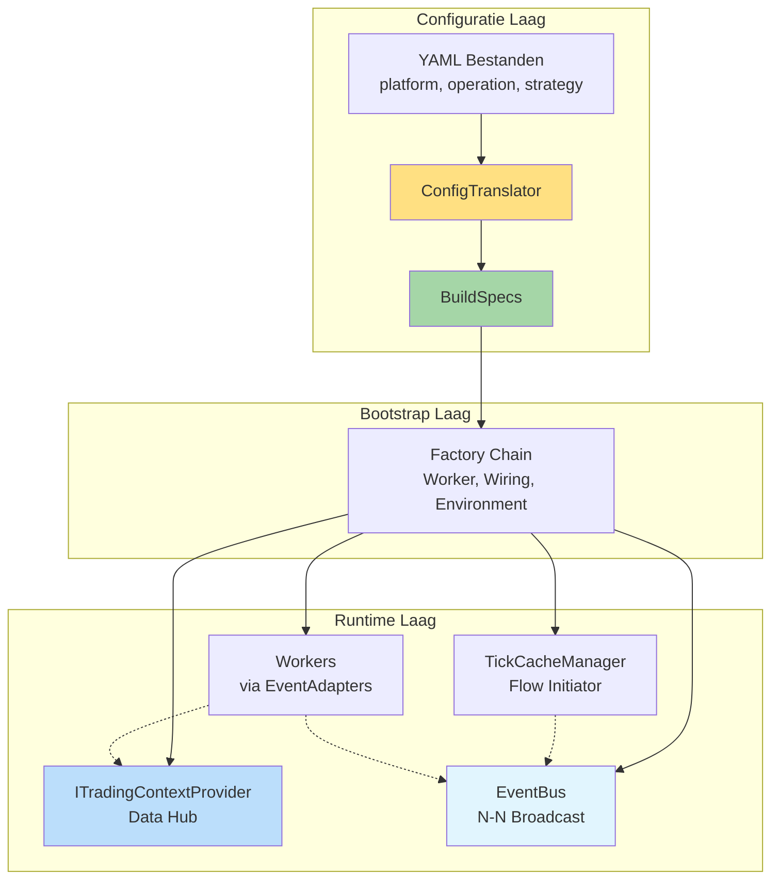

# S1mpleTrader V4.0 Architectuur

**Versie:** 4.0  
**Status:** Definitief  
**Datum:** 2025-10-23

---

## Voorwoord: De Drie Fundamentele Paradigma's

S1mpleTrader is gebouwd op drie fundamentele architecturale paradigma's die samen een radicaal eenvoudig, maar krachtig systeem creëren:

### Paradigma 1: Platgeslagen Event-Driven Netwerk

Er zijn **geen Operators**. De workflow bestaat uit een expliciet bedraad netwerk van workers, elk met een eigen [`EventAdapter`](backend/assembly/event_adapter.py). De bedrading wordt volledig gedefinieerd in configuratie (strategy_wiring_map.yaml), grotendeels gegenereerd door de Strategy Builder UI.

**Voordeel**: Maximale transparantie en flexibiliteit - de flow is exact wat je configureert.

**Lees meer**: [H1: Communicatie Architectuur](H1_Communicatie_Architectuur.md)

### Paradigma 2: Point-in-Time DTO-Gedreven Data

Data wordt **niet** doorgegeven via een groeiende DataFrame. In plaats daarvan:
- Elk tick-moment heeft een tijdelijke **Tick Cache** met specifieke DTOs
- Workers vragen data op via [`ITradingContextProvider`](backend/core/interfaces/context_provider.py)
- Workers retourneren een [`DispositionEnvelope`](backend/shared_dtos/disposition_envelope.py) voor flow control
- Alle data-uitwisseling is expliciet en type-safe

**Voordeel**: Volledige "Point-in-Time" garantie - geen data-lekkage uit de toekomst.

**Lees meer**: [H3: Data Landschap](H3_Data_Landschap_Point_in_Time.md)

### Paradigma 3: BuildSpec-Gedreven Bootstrap

De startup-fase is gescheiden in drie strikte lagen:
1. **Configuratie** (YAML bestanden - mens-leesbaar)
2. **Vertaling** (ConfigTranslator → BuildSpecs - machine-leesbaar)
3. **Executie** (Factories → Runtime componenten)

**Voordeel**: Perfecte scheiding tussen configuratie-complexiteit (bootstrap) en runtime-simpliciteit.

**Lees meer**: [H2: Configuratielagen & BuildSpecs](H2_Configuratielagen_BuildSpecs.md)

---

## Architectuur Overzicht

---

## Kernprincipes

✅ **Plugin-First** - Alle businesslogica in plugins  
✅ **Configuratie-gedreven** - YAML definieert gedrag, code is mechanica  
✅ **Contract-gedreven** - Pydantic validatie overal  
✅ **Event-driven** - Asynchrone communicatie (opt-in)  
✅ **Dependency Injection** - Constructor injection als standaard  
✅ **100% Test Coverage** - TDD adagium strikt gevolgd

---

## Navigatie

**Start hier**: [README](README.md) voor quick start  
**Overzicht**: [INDEX](INDEX.md) voor complete navigatie  
**Terminologie**: [Bijlage A](Bijlage_A_Terminologie.md) voor begrippen

---

## Belangrijkste Wijzigingen vs V3.0

### Vervallen ❌
- BaseOperator & hele Operator laag
- operators.yaml configuratie
- enriched_df in TradingContext
- Impliciete data doorgifte

### Nieuw ✨
- EventAdapter per component
- BuildSpecs & ConfigTranslator
- ITradingContextProvider & Tick Cache
- DispositionEnvelope
- UI-gegenereerde strategy_wiring_map
- DTO Registry

### Behouden ✅
- 5 Worker categorieën
- 27 Sub-types
- Causaal ID Framework
- Persistence Suite
- Plugin-First filosofie

---

**Welkom bij S1mpleTrader V4.0** - Een platform waar configuratie koning is en code mechanica.